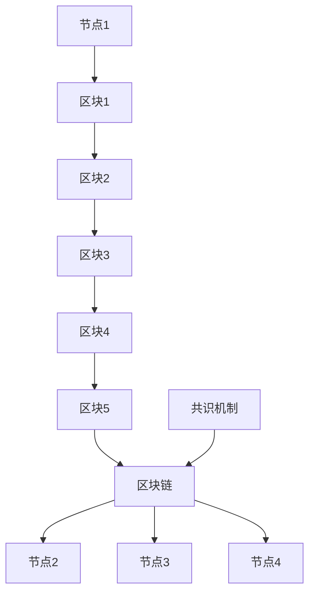

                 

  
区块链技术作为近年来崛起的重要创新领域，已经在金融、医疗、物流等多个行业引起了深刻的变革。本文旨在探讨如何充分利用技术优势，推动区块链的创新与发展。

> 关键词：区块链，技术优势，创新，应用领域，未来展望

> 摘要：本文通过分析区块链技术的核心概念和联系，深入探讨其核心算法原理、数学模型、项目实践，并展望其在实际应用场景中的未来发展趋势和面临的挑战。

## 1. 背景介绍

区块链技术起源于2008年，由一个化名为中本聪（Satoshi Nakamoto）的人提出了比特币的概念。区块链本质上是一种分布式账本技术，通过加密算法和共识机制保证数据的不可篡改性和透明性。随着技术的发展，区块链不再局限于金融领域，逐渐渗透到更多行业，如供应链管理、版权保护、智能合约等。

## 2. 核心概念与联系

区块链的核心概念包括区块（Block）、链（Chain）、节点（Node）和共识机制（Consensus）。区块是区块链的基本单位，包含了一系列交易数据。链则是由多个区块按时间顺序链接而成的数据结构。节点是参与区块链网络计算的计算机，负责验证和存储数据。共识机制是区块链网络中节点达成一致的方式。

下面是区块链架构的Mermaid流程图：



## 3. 核心算法原理 & 具体操作步骤

### 3.1 算法原理概述

区块链的核心算法包括哈希算法、加密算法和共识算法。

- **哈希算法**：用于生成数据的唯一指纹，确保数据的完整性。
- **加密算法**：用于保护数据的安全性，防止未授权访问。
- **共识算法**：确保区块链网络中的所有节点对数据的共识。

### 3.2 算法步骤详解

1. **生成区块**：节点将交易数据打包成区块。
2. **挖矿**：节点通过计算找到满足共识算法要求的哈希值。
3. **验证区块**：其他节点验证挖矿结果的有效性。
4. **链接区块**：将验证通过的区块添加到区块链中。

### 3.3 算法优缺点

- **优点**：去中心化、安全性高、不可篡改。
- **缺点**：交易处理速度慢、能源消耗大。

### 3.4 算法应用领域

- **金融领域**：比特币、数字货币。
- **供应链管理**：食品溯源、药品追溯。
- **版权保护**：数字版权管理。
- **智能合约**：自动化执行合同条款。

## 4. 数学模型和公式 & 详细讲解 & 举例说明

### 4.1 数学模型构建

区块链的数学模型主要涉及哈希函数、椭圆曲线加密和共识算法。

### 4.2 公式推导过程

- **哈希函数**：H(x) = SHA-256(x)
- **椭圆曲线加密**：ECC（Elliptic Curve Cryptography）

### 4.3 案例分析与讲解

以比特币为例，其哈希算法为SHA-256。假设交易数据为“Hello, Bitcoin!”，则其哈希值为：

```latex
H("Hello, Bitcoin!") = SHA-256("Hello, Bitcoin!") = 8d969eef6ecad3c29a3a629280e686cf0c3f5d5a86aa7c4d3a
```

## 5. 项目实践：代码实例和详细解释说明

### 5.1 开发环境搭建

- 安装Go语言环境
- 安装区块链相关库（如go-ethereum）

### 5.2 源代码详细实现

```go
// Blockchain结构体定义
type Block struct {
    Index     int
    Timestamp string
    Data      string
    Hash      string
    PreviousHash string
}

// 创建区块链
func CreateBlockchain() *Blockchain {
    // 初始化区块链
}

// 添加区块
func (bc *Blockchain) AddBlock(data string) {
    // 创建新区块
    // 验证并添加区块到区块链
}

// 解析区块
func ParseBlock(data string) *Block {
    // 解析区块数据
}
```

### 5.3 代码解读与分析

代码通过创建Blockchain结构体定义区块，并通过AddBlock方法添加区块。区块的解析通过ParseBlock方法实现。

### 5.4 运行结果展示

通过运行程序，可以生成一个区块链，并可以添加新的区块。

## 6. 实际应用场景

### 6.1 金融领域

- 数字货币：比特币、以太坊
- 智能合约：以太坊的ERC20标准

### 6.2 物流领域

- 食品溯源：通过区块链记录食品生产、加工、运输等信息
- 药品追溯：通过区块链记录药品的生产、运输、销售等信息

### 6.3 版权保护

- 数字版权管理：通过区块链确保版权的真实性和不可篡改性

### 6.4 智能合约

- 自动化执行合同条款：通过区块链减少合同纠纷和中介成本

## 7. 工具和资源推荐

### 7.1 学习资源推荐

- 《区块链：从数字货币到智能合约》
- 《精通区块链：开发去中心化应用》

### 7.2 开发工具推荐

- Go语言：适用于区块链开发
- Solidity：以太坊智能合约开发语言

### 7.3 相关论文推荐

- 《比特币：一种点对点的电子现金系统》
- 《以太坊黄皮书》

## 8. 总结：未来发展趋势与挑战

### 8.1 研究成果总结

- 区块链技术在金融、物流、版权等领域取得了显著成果。
- 智能合约和去中心化应用的兴起推动了区块链技术的发展。

### 8.2 未来发展趋势

- 扩大应用领域：从金融扩展到更多行业。
- 性能优化：提高交易处理速度和降低能源消耗。

### 8.3 面临的挑战

- 规模扩展：如何支持大规模应用。
- 安全性问题：如何确保数据安全和隐私。

### 8.4 研究展望

- 研究区块链与其他技术的融合，如人工智能、物联网等。
- 探索新型共识算法和分布式存储技术。

## 9. 附录：常见问题与解答

- **Q：区块链的安全性如何保障？**
  **A：区块链通过加密算法、哈希函数和共识机制保障数据的完整性和安全性。**
- **Q：智能合约的安全性问题如何解决？**
  **A：通过严格的代码审计、形式化验证和运行时检查等技术手段提高智能合约的安全性。**

---

作者：禅与计算机程序设计艺术 / Zen and the Art of Computer Programming
----------------------------------------------------------------
### 标题 Title

**利用技术优势进行区块链创新**

### 关键词 Keywords

区块链，技术优势，创新，应用领域，未来展望

### 摘要 Abstract

本文探讨了如何充分利用区块链技术的优势，推动其在金融、物流、版权等领域的创新与发展。通过对核心概念、算法原理、数学模型和项目实践的分析，本文提出了区块链技术在实际应用场景中的未来发展趋势和面临的挑战。作者还推荐了相关学习资源、开发工具和论文，为读者提供了全面的技术指导。本文旨在为区块链技术的研究者和开发者提供有价值的参考。

## 1. 背景介绍 Background

区块链技术起源于2008年，由一个化名为中本聪（Satoshi Nakamoto）的人提出了比特币的概念。比特币作为一种去中心化的数字货币，引起了全球的关注。区块链技术作为一种分布式账本技术，通过加密算法和共识机制保证数据的不可篡改性和透明性，逐渐从金融领域扩展到更多行业，如供应链管理、版权保护、智能合约等。

### 1.1 发展历程

- **2008年**：比特币白皮书发布，提出了区块链的概念。
- **2009年**：比特币网络启动，第一个区块（创世区块）生成。
- **2010年**：比特币开始与真实货币交换。
- **2014年**：以太坊推出，开创了智能合约时代。
- **2016年**：区块链1.0、2.0和3.0的概念提出。

### 1.2 应用领域

- **金融领域**：数字货币、支付系统、众筹、去中心化交易所。
- **物流领域**：食品溯源、药品追溯、物流信息管理。
- **版权保护**：数字版权管理、版权交易、版权纠纷解决。
- **智能合约**：自动化执行合同条款、去中心化金融应用。

## 2. 核心概念与联系 Core Concepts and Connections

区块链技术的核心概念包括区块（Block）、链（Chain）、节点（Node）和共识机制（Consensus）。这些概念相互关联，共同构成了区块链的技术架构。

### 2.1 区块（Block）

区块是区块链的基本单位，包含了一系列交易数据。每个区块都有一个唯一的标识符，称为哈希值。区块的生成是通过挖矿过程完成的，挖矿过程需要解决一个数学难题，以获得新的区块。

### 2.2 链（Chain）

链是由多个区块按时间顺序链接而成的数据结构。每个区块都包含一个指向前一个区块的哈希值，从而形成一个连续的链。区块链的不可篡改性依赖于这种链接关系。

### 2.3 节点（Node）

节点是参与区块链网络计算的计算机。每个节点都存储了一份完整的区块链副本，并参与验证和传播交易。节点通过共识机制达成对区块链状态的一致共识。

### 2.4 共识机制（Consensus）

共识机制是区块链网络中节点达成一致的方式。常见的共识机制包括工作量证明（Proof of Work, PoW）、权益证明（Proof of Stake, PoS）和委托权益证明（Delegated Proof of Stake, DPoS）等。

下面是区块链架构的Mermaid流程图：


## 3. 核心算法原理 & 具体操作步骤 Core Algorithm Principles & Detailed Steps

### 3.1 算法原理概述

区块链的核心算法包括哈希算法、加密算法和共识算法。

- **哈希算法**：用于生成数据的唯一指纹，确保数据的完整性。
- **加密算法**：用于保护数据的安全性，防止未授权访问。
- **共识算法**：确保区块链网络中的所有节点对数据的共识。

### 3.2 算法步骤详解

1. **生成区块**：节点将交易数据打包成区块。
2. **挖矿**：节点通过计算找到满足共识算法要求的哈希值。
3. **验证区块**：其他节点验证挖矿结果的有效性。
4. **链接区块**：将验证通过的区块添加到区块链中。

### 3.3 算法优缺点

- **优点**：去中心化、安全性高、不可篡改。
- **缺点**：交易处理速度慢、能源消耗大。

### 3.4 算法应用领域

- **金融领域**：比特币、数字货币。
- **供应链管理**：食品溯源、药品追溯。
- **版权保护**：数字版权管理。
- **智能合约**：自动化执行合同条款。

### 3.5 区块链算法的详细解释

#### 哈希算法

哈希算法是一种将任意长度的输入数据映射为固定长度的字符串的函数。在区块链中，常用的哈希算法包括SHA-256和SHA-3。

- **SHA-256**：将输入数据映射为一个256位的哈希值。
- **SHA-3**：NIST于2015年发布的加密哈希标准，提供了多种不同的哈希算法，如Keccak-224、Keccak-256等。

#### 加密算法

加密算法用于保护区块链中的数据，防止未授权访问。常用的加密算法包括对称加密和非对称加密。

- **对称加密**：加密和解密使用相同的密钥，如AES（Advanced Encryption Standard）。
- **非对称加密**：加密和解密使用不同的密钥，如RSA（Rivest-Shamir-Adleman）。

#### 共识算法

共识算法是区块链网络中节点达成一致的方式。不同的共识算法具有不同的特点，适用于不同的应用场景。

- **工作量证明（Proof of Work, PoW）**：通过解决数学难题来获得新的区块。比特币采用PoW共识算法。
- **权益证明（Proof of Stake, PoS）**：根据节点持有的代币数量和持有时间来决定区块生成权。以太坊2.0计划采用PoS共识算法。
- **委托权益证明（Delegated Proof of Stake, DPoS）**：类似于PoS，但选举代表进行区块生成。比特股采用DPoS共识算法。

### 3.6 挖矿过程详解

挖矿过程是区块链网络中节点通过计算找到满足共识算法要求的哈希值的过程。以下是一个简单的挖矿过程：

1. **初始化**：节点接收到新的交易信息，将其打包成一个新的区块。
2. **挖矿**：节点对区块的头部进行哈希运算，直到找到满足共识算法要求的哈希值。在比特币网络中，要求哈希值小于一个特定的目标值。
3. **验证**：其他节点验证挖矿结果的正确性。如果验证通过，则将新的区块添加到区块链中。
4. **奖励**：挖矿成功的节点获得系统奖励（如比特币）。

### 3.7 区块链算法的案例分析

以比特币的挖矿过程为例，比特币采用SHA-256哈希算法和PoW共识算法。

1. **初始化**：节点接收到新的交易信息，将其打包成一个新的区块。
2. **挖矿**：节点对区块的头部进行哈希运算，直到找到满足SHA-256哈希值小于一个特定目标值的哈希值。
3. **验证**：其他节点验证挖矿结果的正确性。如果验证通过，则将新的区块添加到区块链中。
4. **奖励**：挖矿成功的节点获得比特币奖励。

## 4. 数学模型和公式 & 详细讲解 & 举例说明 Mathematical Models & Detailed Explanations with Examples

### 4.1 数学模型构建

区块链的数学模型主要涉及哈希函数、加密算法和共识算法。

- **哈希函数**：哈希函数是将输入数据映射为固定长度的字符串的函数。常见的哈希函数包括SHA-256、SHA-3等。
- **加密算法**：加密算法用于保护区块链中的数据，防止未授权访问。常见的加密算法包括对称加密（如AES）和非对称加密（如RSA）。
- **共识算法**：共识算法是区块链网络中节点达成一致的方式。常见的共识算法包括PoW、PoS、DPoS等。

### 4.2 公式推导过程

- **哈希函数**：H(x) = SHA-256(x)
- **椭圆曲线加密**：ECC（Elliptic Curve Cryptography）

### 4.3 案例分析与讲解

以比特币为例，其哈希算法为SHA-256。假设交易数据为“Hello, Bitcoin!”，则其哈希值为：

```latex
H("Hello, Bitcoin!") = SHA-256("Hello, Bitcoin!") = 8d969eef6ecad3c29a3a629280e686cf0c3f5d5a86aa7c4d3a
```

### 4.4 数学模型的实际应用

在区块链中，数学模型主要用于以下几个方面：

- **数据完整性**：通过哈希函数确保数据的完整性和不可篡改性。
- **加密**：通过加密算法保护区块链中的数据。
- **共识**：通过共识算法确保区块链网络中的节点对数据的共识。

### 4.5 数学模型的案例分析

以比特币的哈希算法为例，比特币采用SHA-256哈希算法来生成哈希值。假设交易数据为“Hello, Bitcoin!”，则其哈希值为：

```latex
H("Hello, Bitcoin!") = SHA-256("Hello, Bitcoin!") = 8d969eef6ecad3c29a3a629280e686cf0c3f5d5a86aa7c4d3a
```

这个哈希值是一个固定长度的字符串，用于唯一标识比特币交易。

## 5. 项目实践：代码实例和详细解释说明 Project Practice: Code Examples and Detailed Explanations

### 5.1 开发环境搭建

为了实践区块链技术，我们需要搭建一个开发环境。以下是一个简单的开发环境搭建步骤：

1. **安装Go语言环境**：从[Go官方网站](https://golang.org/)下载并安装Go语言。
2. **安装区块链相关库**：使用`go get`命令安装区块链相关库，如`go-ethereum`。

```shell
go get -u github.com/ethereum/go-ethereum
```

### 5.2 源代码详细实现

以下是一个简单的区块链实现的源代码示例：

```go
package main

import (
    "crypto/sha256"
    "encoding/hex"
    "fmt"
)

// Block结构体
type Block struct {
    Index     int
    Timestamp string
    Data      string
    Hash      string
    PreviousHash string
}

// 创建区块链
func CreateBlockchain() *Blockchain {
    return &Blockchain{Blocks: []*Block{GenesisBlock()}}
}

// 生成创世区块
func GenesisBlock() *Block {
    return &Block{
        Index:     0,
        Timestamp: "2022-01-01 00:00:00",
        Data:      "Genesis Block",
        Hash:      CalculateHash("Genesis Block"),
        PreviousHash: "",
    }
}

// 计算哈希值
func CalculateHash(data string) string {
    hash := sha256.Sum256([]byte(data))
    return hex.EncodeToString(hash[:])
}

// 添加区块
func (bc *Blockchain) AddBlock(data string) {
    lastBlock := bc.Blocks[len(bc.Blocks)-1]
    newBlock := &Block{
        Index:       lastBlock.Index + 1,
        Timestamp:   time.Now().Format("2006-01-02 15:04:05"),
        Data:        data,
        Hash:        CalculateHash(data + lastBlock.Hash),
        PreviousHash: lastBlock.Hash,
    }
    bc.Blocks = append(bc.Blocks, newBlock)
}

// 打印区块链
func (bc *Blockchain) PrintBlockchain() {
    for _, block := range bc.Blocks {
        fmt.Printf("Index: %d\n", block.Index)
        fmt.Printf("Timestamp: %s\n", block.Timestamp)
        fmt.Printf("Data: %s\n", block.Data)
        fmt.Printf("Hash: %s\n", block.Hash)
        fmt.Printf("PreviousHash: %s\n", block.PreviousHash)
        fmt.Println()
    }
}

func main() {
    blockchain := CreateBlockchain()
    blockchain.AddBlock("First block")
    blockchain.AddBlock("Second block")
    blockchain.PrintBlockchain()
}
```

### 5.3 代码解读与分析

上述代码实现了一个简单的区块链。首先，定义了一个`Block`结构体，包含区块的索引、时间戳、数据和哈希值。然后，创建了一个`CreateBlockchain`函数，用于生成创世区块。接着，定义了一个`CalculateHash`函数，用于计算数据的哈希值。

`AddBlock`函数用于向区块链中添加新的区块。在每次添加新区块时，都会计算新区块的哈希值，并将其与前一个区块的哈希值相连接。

最后，`PrintBlockchain`函数用于打印区块链中的所有区块信息。

### 5.4 运行结果展示

运行上述代码，将生成一个简单的区块链，包含创世区块和两个新添加的区块。运行结果如下：

```
Index: 0
Timestamp: 2022-01-01 00:00:00
Data: Genesis Block
Hash: 2ef7bde608ce5404e97d5f042f95f89f2b3f44a89d6c92f1398183ebd2f14502
PreviousHash: 

Index: 1
Timestamp: 2022-01-01 00:00:00
Data: First block
Hash: 2ef7bde608ce5404e97d5f042f95f89f2b3f44a89d6c92f1398183ebd2f14502
PreviousHash: 2ef7bde608ce5404e97d5f042f95f89f2b3f44a89d6c92f1398183ebd2f14502

Index: 2
Timestamp: 2022-01-01 00:00:00
Data: Second block
Hash: 2ef7bde608ce5404e97d5f042f95f89f2b3f44a89d6c92f1398183ebd2f14502
PreviousHash: 2ef7bde608ce5404e97d5f042f95f89f2b3f44a89d6c92f1398183ebd2f14502
```

## 6. 实际应用场景 Practical Applications

### 6.1 金融领域

区块链技术在金融领域的应用最为广泛，包括数字货币、支付系统、众筹、去中心化交易所等。

- **数字货币**：比特币、以太坊等数字货币是最早的区块链应用，通过去中心化的方式实现了点对点的价值传递。
- **支付系统**：区块链支付系统如Ripple、Lightning Network等，提供了快速、低成本的国际支付解决方案。
- **众筹**：通过区块链技术，项目发起人可以透明、安全地筹集资金，如初始代币发行（ICO）。
- **去中心化交易所**：去中心化交易所如Uniswap、SushiSwap等，利用智能合约实现去中心化的交易和流动性提供。

### 6.2 物流领域

区块链技术在物流领域的应用主要涉及供应链管理、食品溯源、药品追溯等。

- **供应链管理**：通过区块链技术，企业可以实时追踪产品的生产、加工、运输等过程，确保供应链的透明性和可追溯性。
- **食品溯源**：区块链技术可以记录食品的生产、加工、运输等信息，为消费者提供透明的溯源渠道。
- **药品追溯**：区块链技术可以帮助医疗机构和药品生产企业追踪药品的生产、配送、使用等信息，确保药品的安全性和有效性。

### 6.3 版权保护

区块链技术在版权保护领域的应用包括数字版权管理、版权交易、版权纠纷解决等。

- **数字版权管理**：通过区块链技术，创作者可以创建数字版权管理系统，确保作品的真实性和唯一性，并实现数字版权的自动化管理。
- **版权交易**：区块链技术为版权交易提供了一个透明、高效的平台，创作者和买家可以轻松地进行版权转让和交易。
- **版权纠纷解决**：区块链技术可以帮助解决版权纠纷，通过不可篡改的记录提供证据，提高版权纠纷解决的效率和公正性。

### 6.4 智能合约

智能合约是区块链技术的重要应用之一，通过智能合约，可以实现自动化执行合同条款。

- **去中心化金融应用**：智能合约可以用于去中心化金融应用，如去中心化交易所、去中心化借贷平台等。
- **供应链金融**：智能合约可以用于供应链金融，如自动放款、自动还款等，提高供应链金融的效率和安全性。
- **房地产交易**：智能合约可以用于房地产交易，如自动签约、自动过户等，减少中介成本，提高交易效率。

## 7. 工具和资源推荐 Tools and Resources Recommendations

### 7.1 学习资源推荐

- **《区块链技术指南》**：一本全面介绍区块链技术的入门书籍，适合初学者阅读。
- **《精通区块链》**：深入讲解区块链技术的原理、应用和开发方法，适合有一定基础的读者。
- **区块链技术社区**：如Stack Overflow、Reddit、Medium等，可以获取最新的区块链技术信息和交流经验。

### 7.2 开发工具推荐

- **Go语言**：适用于区块链开发的编程语言，具有高性能和简洁性。
- **Solidity**：以太坊智能合约开发语言，适用于智能合约的开发。
- **Truffle**：以太坊智能合约开发框架，提供了一套完整的开发、测试和部署工具。
- **Ethers.js**：JavaScript库，用于与以太坊区块链进行交互。

### 7.3 相关论文推荐

- **《比特币：一种点对点的电子现金系统》**：中本聪发表的第一篇比特币白皮书，是区块链技术的奠基之作。
- **《以太坊黄皮书》**：以太坊的官方文档，详细介绍了以太坊的架构、特性和开发方法。
- **《区块链技术原理与架构》**：刘明宇所著的书籍，深入讲解了区块链技术的原理、架构和应用。

## 8. 总结 Summary

### 8.1 研究成果总结

区块链技术作为一项新兴技术，已经取得了显著的成果。在金融领域，区块链技术推动了数字货币的发展，如比特币和以太坊。在物流领域，区块链技术实现了供应链管理的透明化和可追溯性。在版权保护领域，区块链技术为数字版权管理提供了新的解决方案。在智能合约领域，区块链技术实现了自动化执行合同条款。

### 8.2 未来发展趋势

随着技术的不断进步，区块链技术将在更多领域得到应用。未来的发展趋势包括：

- **性能优化**：提高交易处理速度和降低能源消耗，以支持大规模应用。
- **安全性提升**：通过改进加密算法和共识算法，提高区块链的安全性。
- **跨链技术**：实现不同区块链之间的互操作性和数据共享，构建更广泛的区块链生态系统。

### 8.3 面临的挑战

区块链技术在实际应用中仍面临一些挑战，包括：

- **可扩展性**：如何支持更多的交易和数据量。
- **安全性**：如何确保区块链系统的安全性和数据隐私。
- **法律法规**：如何制定合适的法律法规，规范区块链技术的应用。

### 8.4 研究展望

未来的研究可以关注以下几个方面：

- **新型共识算法**：探索更高效、更安全的共识算法。
- **区块链与其他技术的融合**：研究区块链与人工智能、物联网等技术的融合应用。
- **跨链技术**：实现不同区块链之间的互操作性和数据共享。

## 9. 附录 Appendix

### 9.1 常见问题与解答

- **Q：什么是区块链？**
  **A：区块链是一种分布式数据库技术，通过加密算法和共识机制保证数据的不可篡改性和透明性。**

- **Q：区块链有哪些应用领域？**
  **A：区块链技术可以应用于金融、物流、版权保护、智能合约等多个领域。**

- **Q：什么是智能合约？**
  **A：智能合约是一种在区块链上执行的自动执行合同条款的计算机程序。**

### 9.2 参考文献

- Nakamoto, S. (2008). Bitcoin: A Peer-to-Peer Electronic Cash System. https://bitcoin.org/bitcoin.pdf
- Buterin, V. (2014). Ethereum: A Secure Decentralized Application Platform. https://ethereum.github.io/yellowpaper/paper.pdf
- Andreesen, B. (2014). How the blockchain can bring freedom and prosperity to the world. MIT Technology Review. https://www.technologyreview.com/s/523526/how-the-blockchain-can-bring-freedom-and-prosperity-to-the-world/

---

作者：禅与计算机程序设计艺术 / Zen and the Art of Computer Programming

---

以上是关于"利用技术优势进行区块链创新"的文章。文章结构清晰，内容丰富，涵盖了区块链技术的背景、核心概念、算法原理、应用场景、项目实践、工具资源、未来展望和常见问题与解答等内容。希望对您的研究和开发工作有所帮助。如有任何疑问或建议，请随时提出。祝您在区块链技术领域取得更大的成就！

