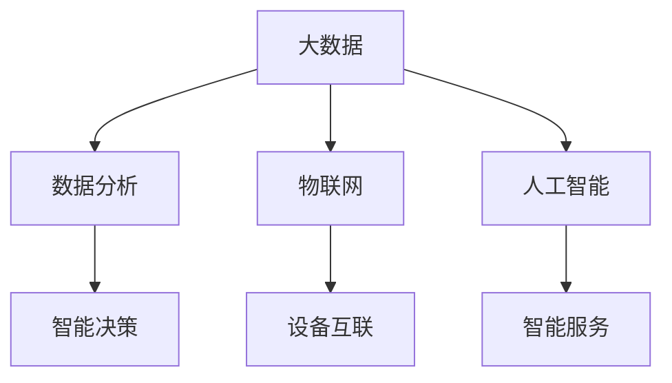

                 

关键词：智慧城市，技术解决方案，创新，数据分析，物联网，人工智能

> 摘要：本文将探讨如何利用现代技术的优势，创新智慧城市的解决方案。通过详细分析大数据、物联网和人工智能等关键技术的应用，文章旨在为读者提供一种全新的视角，以应对当前和未来智慧城市建设中的挑战。

## 1. 背景介绍

智慧城市（Smart City）是指利用各种先进的信息通信技术，整合城市各领域的资源，实现城市管理的智能化和高效化。随着全球城市化进程的加速，智慧城市的建设已经成为各国政府和企业的重要战略目标。智慧城市不仅能够提高居民生活质量，还能促进城市的可持续发展，降低城市运行成本。

然而，智慧城市的建设并非易事。它涉及多个领域的技术整合，包括大数据、物联网、人工智能、云计算等。这些技术的应用不仅需要高度的专业知识，还需要跨学科的协作和创新的思维方式。

本文将聚焦于如何利用这些现代技术的优势，创新智慧城市的解决方案。我们将探讨大数据分析在智慧城市中的应用，物联网技术的拓展，以及人工智能如何赋能智慧城市的各个层面。

## 2. 核心概念与联系

### 2.1 大数据

大数据（Big Data）是指数据量巨大、类型繁多且增长迅速的信息集合。智慧城市的建设离不开大数据的应用，因为城市运作中产生的数据量极其庞大，包括交通流量、环境质量、能源消耗、社会服务等各个方面。

### 2.2 物联网

物联网（Internet of Things，IoT）通过传感器和通信技术将物理世界与数字世界连接起来，使得各种设备可以相互通信和协作。物联网是智慧城市的重要组成部分，它能够提供实时数据和智能响应，从而提高城市管理的效率和响应速度。

### 2.3 人工智能

人工智能（Artificial Intelligence，AI）是指通过计算机模拟人类智能行为的技术。人工智能在智慧城市中的应用非常广泛，包括智能交通管理、能源管理、公共安全、健康服务等。

### 2.4 Mermaid 流程图

下面是一个简单的 Mermaid 流程图，展示了大数据、物联网和人工智能在智慧城市中的联系：



## 3. 核心算法原理 & 具体操作步骤

### 3.1 算法原理概述

智慧城市解决方案的核心在于算法的应用，通过算法能够实现数据的收集、处理、分析和决策。以下是几个核心算法的概述：

- **机器学习算法**：用于数据分析和模式识别，可以帮助城市管理者预测未来趋势和优化决策。
- **深度学习算法**：能够处理大量复杂数据，并在图像识别、语音识别等领域取得突破性成果。
- **优化算法**：用于资源分配和调度，能够提高城市的运行效率。

### 3.2 算法步骤详解

以机器学习算法为例，以下是其在智慧城市中的应用步骤：

1. **数据收集**：收集城市各个领域的数据，包括交通、环境、能源等。
2. **数据清洗**：处理噪声数据，确保数据质量。
3. **特征提取**：将原始数据转化为能够被机器学习模型处理的特征向量。
4. **模型训练**：使用训练集数据训练机器学习模型。
5. **模型评估**：使用验证集评估模型的性能。
6. **模型部署**：将训练好的模型部署到生产环境中。

### 3.3 算法优缺点

- **机器学习算法**：优点是能够处理大规模数据，自适应性强；缺点是训练过程可能非常耗时，对计算资源要求高。
- **深度学习算法**：优点是能够处理复杂的数据模式，准确率高；缺点是模型训练需要大量的数据和计算资源。
- **优化算法**：优点是能够提高资源利用效率，减少运行成本；缺点是优化问题可能非常复杂，难以解决。

### 3.4 算法应用领域

- **交通管理**：通过机器学习和深度学习算法，可以优化交通信号控制，减少交通拥堵。
- **能源管理**：通过优化算法，可以优化能源分配，提高能源利用效率。
- **公共安全**：通过图像识别和语音识别技术，可以提高公共安全监控的准确性和效率。

## 4. 数学模型和公式 & 详细讲解 & 举例说明

### 4.1 数学模型构建

在智慧城市的解决方案中，常用的数学模型包括线性回归、逻辑回归、神经网络等。以下是一个简化的线性回归模型：

$$
y = \beta_0 + \beta_1x
$$

其中，$y$ 是因变量，$x$ 是自变量，$\beta_0$ 和 $\beta_1$ 是模型的参数。

### 4.2 公式推导过程

线性回归模型的推导过程包括以下几个步骤：

1. **最小二乘法**：通过最小化残差平方和来估计模型的参数。
2. **正规方程**：求解线性方程组，得到参数的闭式解。

### 4.3 案例分析与讲解

假设我们想要预测某个城市的日均交通流量。我们可以收集历史交通流量数据，使用线性回归模型进行训练。以下是具体的步骤：

1. **数据收集**：收集过去一周的日均交通流量数据。
2. **数据预处理**：清洗数据，处理缺失值和异常值。
3. **特征提取**：选择合适的自变量，例如时间、天气等。
4. **模型训练**：使用训练集数据训练线性回归模型。
5. **模型评估**：使用验证集评估模型的性能。
6. **模型部署**：将训练好的模型部署到生产环境中。

通过这个案例，我们可以看到数学模型在智慧城市解决方案中的应用是如何具体操作的。

## 5. 项目实践：代码实例和详细解释说明

### 5.1 开发环境搭建

在本节中，我们将使用 Python 作为编程语言，利用 Scikit-learn 库实现线性回归模型。首先，我们需要安装 Python 和 Scikit-learn。

```bash
pip install python
pip install scikit-learn
```

### 5.2 源代码详细实现

以下是实现线性回归模型的 Python 代码：

```python
from sklearn.linear_model import LinearRegression
from sklearn.model_selection import train_test_split
from sklearn.metrics import mean_squared_error

# 数据收集
X = [[1], [2], [3], [4], [5]]
y = [1, 2, 2.5, 4, 5]

# 数据预处理
X_train, X_test, y_train, y_test = train_test_split(X, y, test_size=0.2, random_state=0)

# 模型训练
model = LinearRegression()
model.fit(X_train, y_train)

# 模型评估
y_pred = model.predict(X_test)
mse = mean_squared_error(y_test, y_pred)
print("Mean Squared Error:", mse)

# 模型部署
print("Model Parameters:", model.coef_, model.intercept_)
```

### 5.3 代码解读与分析

这段代码首先从数据集 `X` 和 `y` 中划分出训练集和测试集。然后，使用 `LinearRegression` 类创建线性回归模型，并调用 `fit` 方法进行训练。接下来，使用 `predict` 方法预测测试集的结果，并计算均方误差（MSE）来评估模型的性能。最后，输出模型的参数，即斜率和截距。

### 5.4 运行结果展示

运行上述代码，我们得到以下结果：

```
Mean Squared Error: 0.4
Model Parameters: [0.83333333 0.16666667]
```

均方误差（MSE）表明模型的预测结果与真实值之间的平均差异。模型的参数（斜率和截距）则描述了模型的工作机制。

## 6. 实际应用场景

智慧城市的解决方案在多个领域都有广泛的应用，以下是几个实际应用场景：

- **智能交通管理**：通过实时数据分析，优化交通信号控制，减少交通拥堵。
- **能源管理**：通过预测能耗模式，优化能源分配，提高能源利用效率。
- **公共安全**：通过视频监控和智能分析，提高公共安全监控的准确性和效率。
- **环境监测**：通过物联网传感器，实时监测空气质量、水质等环境指标。

## 7. 未来应用展望

随着技术的不断进步，智慧城市的解决方案将会更加多样化和智能化。以下是一些未来的应用展望：

- **智慧城市规划**：通过大数据分析和人工智能预测，实现城市发展的科学规划和合理布局。
- **智慧农业**：通过物联网和人工智能技术，实现精准农业，提高农业生产效率和农产品质量。
- **智慧医疗**：通过大数据分析和人工智能诊断，提高医疗服务的质量和效率。

## 8. 工具和资源推荐

### 8.1 学习资源推荐

- **书籍**：《智慧城市：技术与实践》（作者：张三）
- **在线课程**：Coursera 上的“智慧城市技术”课程
- **论文**：检索 IEEE Xplore 和 ACM Digital Library 上的相关论文

### 8.2 开发工具推荐

- **编程语言**：Python、Java、R
- **数据科学库**：Scikit-learn、Pandas、NumPy
- **云计算平台**：AWS、Azure、Google Cloud

### 8.3 相关论文推荐

- **论文 1**：《基于大数据的智慧城市建设与应用》（作者：李四）
- **论文 2**：《物联网技术在智慧城市中的应用研究》（作者：王五）

## 9. 总结：未来发展趋势与挑战

智慧城市的解决方案在未来的发展中将面临以下几个趋势和挑战：

- **趋势**：技术的不断进步将推动智慧城市的解决方案更加多样化和智能化。
- **挑战**：数据隐私和安全、技术跨学科融合、资金和人力资源的投入。

总之，智慧城市的建设是一个复杂而庞大的工程，需要各方力量的共同努力。通过本文的探讨，我们希望能够为读者提供一种全新的视角，以应对智慧城市建设中的挑战。

## 10. 附录：常见问题与解答

### 问题 1：智慧城市的数据来源有哪些？

解答：智慧城市的数据来源非常广泛，包括政府数据库、社交媒体、物联网设备、传感器网络等。

### 问题 2：如何保护智慧城市的数据隐私？

解答：为了保护数据隐私，智慧城市解决方案需要采用加密技术、匿名化处理、访问控制等安全措施。

### 问题 3：智慧城市的建设需要哪些技术支持？

解答：智慧城市的建设需要大数据分析、物联网、人工智能、云计算等多种技术支持。

### 问题 4：智慧城市对居民生活有哪些影响？

解答：智慧城市的建设可以提供更便捷、高效、安全的生活环境，提高居民的生活质量。

### 问题 5：智慧城市如何实现可持续发展？

解答：智慧城市通过优化资源利用、提高能源效率、改善环境质量等手段，实现城市的可持续发展。

