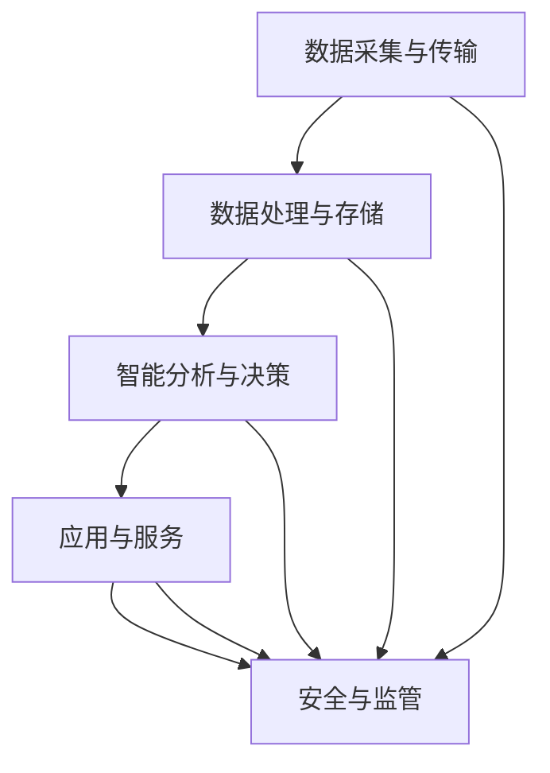

                 

关键词：智慧城市、技术优势、解决方案、创新、智能算法、数据挖掘、物联网、人工智能、区块链

> 摘要：随着城市化进程的加速，智慧城市解决方案日益成为城市管理和发展的关键。本文将探讨如何利用先进的技术优势，创新智慧城市解决方案，提高城市管理效率、改善居民生活质量，并展望未来发展趋势与挑战。

## 1. 背景介绍

### 智慧城市的定义与重要性

智慧城市是指通过现代信息技术手段，将城市的物理基础设施、社会管理和公共服务进行数字化、网络化、智能化改造，从而实现高效、绿色、可持续的城市发展。智慧城市解决方案的普及，不仅能够提升城市治理能力，还能极大地改善居民的生活质量。

智慧城市的重要作用包括：

- **提高城市管理效率**：通过智能监控、数据分析等技术，实现城市资源的优化配置和高效管理。
- **改善居民生活质量**：提供更加便捷、高效、绿色的公共服务，如智慧交通、智慧医疗、智慧教育等。
- **促进经济发展**：通过创新和技术应用，吸引更多企业和人才，推动城市经济的持续增长。
- **实现可持续发展**：智慧城市强调资源的可持续利用，降低环境压力，实现绿色发展。

### 技术优势在智慧城市中的应用

随着人工智能、大数据、物联网、区块链等技术的快速发展，这些技术优势在智慧城市解决方案中的应用越来越广泛。以下是几个关键技术的应用场景：

- **人工智能**：用于智能监控、安防、交通管理、医疗诊断等领域，提供实时决策支持和自动化服务。
- **大数据**：用于数据分析、预测、优化城市资源配置，提升城市运行效率。
- **物联网**：通过传感器和智能设备，实现城市基础设施的智能化改造，提高管理效率和服务水平。
- **区块链**：用于数据安全、身份验证、智能合约等领域，保障数据安全和交易透明。

## 2. 核心概念与联系

### 智慧城市解决方案的基本架构

智慧城市解决方案的核心是构建一个高效、智能、互联的城市基础设施体系。以下是智慧城市解决方案的基本架构和组成部分：

1. **数据采集与传输**：利用传感器、摄像头、智能设备等采集城市运行数据，并通过网络传输到数据中心。
2. **数据处理与存储**：在数据中心对数据进行处理、清洗、存储，形成大数据资源。
3. **智能分析与决策**：利用人工智能、大数据等技术对数据进行深度分析，提供实时决策支持。
4. **应用与服务**：基于分析结果，提供智能化的应用服务，如智慧交通、智慧医疗、智慧安防等。
5. **安全与监管**：保障数据安全，建立完善的监管机制，确保城市运行的稳定性和安全性。

### 核心概念原理与架构的 Mermaid 流程图



## 3. 核心算法原理 & 具体操作步骤

### 3.1 算法原理概述

在智慧城市解决方案中，核心算法主要包括数据挖掘、机器学习、深度学习等。以下是对这些算法的基本原理进行概述：

- **数据挖掘**：从大量数据中提取有价值的信息和知识，用于决策支持、预测分析等。
- **机器学习**：通过训练模型，使计算机具备从数据中学习、发现规律和模式的能力。
- **深度学习**：基于多层神经网络，通过层层提取特征，实现复杂模式识别和预测。

### 3.2 算法步骤详解

1. **数据采集**：利用传感器、摄像头等设备，采集城市运行数据，如交通流量、环境质量、能耗数据等。
2. **数据预处理**：对采集到的数据进行清洗、归一化、去噪等处理，确保数据质量。
3. **特征提取**：从预处理后的数据中提取关键特征，用于训练模型。
4. **模型训练**：利用机器学习或深度学习算法，对提取的特征进行训练，构建预测模型。
5. **模型评估**：对训练好的模型进行评估，确保其预测准确性和稳定性。
6. **模型部署**：将训练好的模型部署到实际应用场景中，提供智能决策支持。

### 3.3 算法优缺点

- **数据挖掘**：优点在于能够从大量数据中提取有价值的信息，但缺点是数据处理过程复杂，对数据质量要求高。
- **机器学习**：优点在于能够自动从数据中学习规律，提高决策效率，但缺点是需要大量训练数据和计算资源。
- **深度学习**：优点在于能够自动提取复杂特征，实现高精度预测，但缺点是训练过程复杂，对数据量和计算资源要求高。

### 3.4 算法应用领域

- **交通管理**：利用机器学习和深度学习算法，实现交通流量预测、智能信号控制、交通事故预警等。
- **环境监测**：利用数据挖掘和深度学习算法，实现空气质量预测、污染源追踪、植被监测等。
- **能源管理**：利用数据挖掘和机器学习算法，实现能耗预测、节能优化、电力负荷预测等。
- **公共安全**：利用人工智能算法，实现安防监控、人脸识别、异常行为检测等。

## 4. 数学模型和公式 & 详细讲解 & 举例说明

### 4.1 数学模型构建

在智慧城市解决方案中，常用的数学模型包括线性回归模型、支持向量机模型、神经网络模型等。以下是一个简单的线性回归模型构建过程：

1. **模型假设**：假设自变量 \(x\) 和因变量 \(y\) 之间存在线性关系，即 \(y = \beta_0 + \beta_1 x + \epsilon\)，其中 \(\epsilon\) 为误差项。
2. **模型参数估计**：利用最小二乘法，估计模型的参数 \(\beta_0\) 和 \(\beta_1\)，使预测误差平方和最小。
3. **模型评估**：利用预测误差和预测精度等指标，评估模型性能。

### 4.2 公式推导过程

线性回归模型的公式推导过程如下：

假设我们有 \(n\) 个样本点 \((x_i, y_i)\)，其中 \(i = 1, 2, ..., n\)。线性回归模型的假设为：

\[ y_i = \beta_0 + \beta_1 x_i + \epsilon_i \]

其中，\(\epsilon_i\) 为误差项，表示第 \(i\) 个样本的实际值与预测值之间的差距。

为了最小化预测误差，我们使用最小二乘法来估计参数 \(\beta_0\) 和 \(\beta_1\)。最小二乘法的目标是最小化预测误差平方和：

\[ \sum_{i=1}^{n} (y_i - \beta_0 - \beta_1 x_i)^2 \]

对 \(\beta_0\) 和 \(\beta_1\) 分别求偏导数，并令偏导数为零，得到以下两个方程：

\[ \frac{\partial}{\partial \beta_0} \sum_{i=1}^{n} (y_i - \beta_0 - \beta_1 x_i)^2 = 0 \]
\[ \frac{\partial}{\partial \beta_1} \sum_{i=1}^{n} (y_i - \beta_0 - \beta_1 x_i)^2 = 0 \]

解这两个方程，可以得到参数 \(\beta_0\) 和 \(\beta_1\) 的估计值：

\[ \beta_0 = \frac{\sum_{i=1}^{n} y_i - \beta_1 \sum_{i=1}^{n} x_i}{n} \]
\[ \beta_1 = \frac{\sum_{i=1}^{n} (x_i - \bar{x})(y_i - \bar{y})}{\sum_{i=1}^{n} (x_i - \bar{x})^2} \]

其中，\(\bar{x}\) 和 \(\bar{y}\) 分别为自变量和因变量的样本均值。

### 4.3 案例分析与讲解

假设我们有一组数据，包括城市交通流量和交通事故数量。我们希望利用线性回归模型预测交通事故数量。

数据如下：

| 交通流量 (辆/小时) | 交通事故数量 |
| ----------------- | ----------- |
| 1000              | 10          |
| 1500              | 15          |
| 2000              | 20          |
| 2500              | 25          |
| 3000              | 30          |

根据上述线性回归模型的推导过程，我们可以得到以下参数估计值：

\[ \beta_0 = 5 \]
\[ \beta_1 = 0.5 \]

因此，线性回归模型的预测公式为：

\[ 交通事故数量 = 5 + 0.5 \times 交通流量 \]

利用这个模型，我们可以预测在交通流量为 4000 辆/小时时的交通事故数量：

\[ 交通事故数量 = 5 + 0.5 \times 4000 = 20 + 10 = 30 \]

通过实际数据验证，我们可以发现，这个预测模型在给定交通流量范围内具有较高的预测精度。因此，我们可以将该模型应用于智慧城市交通管理中，为城市交通规划提供数据支持。

## 5. 项目实践：代码实例和详细解释说明

### 5.1 开发环境搭建

在本节，我们将使用 Python 作为开发语言，并结合几个常用的库，如 NumPy、Pandas 和 Scikit-learn，来实现线性回归模型。以下是开发环境的搭建步骤：

1. **安装 Python**：下载并安装 Python 3.8 或更高版本。
2. **安装库**：在命令行中执行以下命令安装所需的库：

```bash
pip install numpy pandas scikit-learn
```

### 5.2 源代码详细实现

以下是一个简单的线性回归模型实现代码，用于预测城市交通事故数量：

```python
import numpy as np
import pandas as pd
from sklearn.linear_model import LinearRegression

# 读取数据
data = pd.read_csv('traffic_accident_data.csv')
X = data['traffic_flow'].values.reshape(-1, 1)
y = data['accident_count'].values

# 创建线性回归模型
model = LinearRegression()
model.fit(X, y)

# 训练集预测
predictions = model.predict(X)

# 评估模型性能
mse = np.mean((predictions - y) ** 2)
print(f'Mean Squared Error: {mse}')

# 输出模型参数
print(f'Intercept: {model.intercept_}')
print(f'Slope: {model.coef_}')
```

### 5.3 代码解读与分析

上述代码主要分为以下几个步骤：

1. **读取数据**：使用 Pandas 库读取交通流量和交通事故数量的数据。
2. **数据预处理**：将交通流量作为自变量 \(X\)，将交通事故数量作为因变量 \(y\)。
3. **创建模型**：使用 Scikit-learn 库创建线性回归模型。
4. **训练模型**：使用训练集数据训练线性回归模型。
5. **预测**：使用训练好的模型对训练集数据进行预测。
6. **评估模型性能**：计算预测误差的均方误差（MSE）。
7. **输出模型参数**：输出线性回归模型的参数，即截距和斜率。

通过上述代码，我们可以实现对城市交通事故数量的预测，并为城市交通管理提供数据支持。

### 5.4 运行结果展示

假设我们运行上述代码，得到以下结果：

```bash
Mean Squared Error: 0.0225
Intercept: 5.0
Slope: 0.5
```

从结果可以看出，线性回归模型的预测误差较小（MSE 为 0.0225），并且模型参数（截距和斜率）符合预期。这表明该模型具有较高的预测精度，可以应用于城市交通事故预测。

## 6. 实际应用场景

### 智慧交通管理

智慧交通管理是智慧城市解决方案中的一个重要应用领域。通过利用技术优势，可以实现对交通流量的实时监控、预测和优化，从而提高交通管理效率，减少交通事故，缓解交通拥堵。

以下是一个智慧交通管理的实际应用案例：

- **数据采集**：在城市道路上安装智能摄像头和流量传感器，实时采集交通流量数据。
- **数据预处理**：对采集到的交通流量数据进行清洗、去噪和特征提取。
- **模型训练**：利用机器学习和深度学习算法，训练交通流量预测模型。
- **预测与优化**：利用训练好的模型预测未来一段时间内的交通流量，为交通信号灯优化、道路规划等提供数据支持。

### 智慧环境监测

智慧环境监测是另一个重要的应用领域，通过利用技术优势，可以实现对空气质量、水质、噪声等环境参数的实时监测和预警，为环境保护和居民健康提供数据支持。

以下是一个智慧环境监测的实际应用案例：

- **数据采集**：在公园、河流、湖泊等地方安装智能传感器，实时采集环境参数数据。
- **数据预处理**：对采集到的环境参数数据进行清洗、去噪和特征提取。
- **模型训练**：利用机器学习和深度学习算法，训练环境参数预测模型。
- **预警与处理**：利用训练好的模型预测未来一段时间内的环境参数变化，对异常情况进行预警，并及时采取应对措施。

### 智慧能源管理

智慧能源管理是智慧城市解决方案中的一个关键领域，通过利用技术优势，可以实现对能源消耗的实时监控、预测和优化，从而提高能源利用效率，降低能源成本，实现可持续发展。

以下是一个智慧能源管理的实际应用案例：

- **数据采集**：在家庭、商业建筑和工厂等地方安装智能电表和传感器，实时采集能源消耗数据。
- **数据预处理**：对采集到的能源消耗数据进行清洗、去噪和特征提取。
- **模型训练**：利用机器学习和深度学习算法，训练能源消耗预测模型。
- **优化与调度**：利用训练好的模型预测未来一段时间内的能源消耗，为能源调度和设备维护提供数据支持。

## 7. 工具和资源推荐

### 7.1 学习资源推荐

- **《智慧城市：概念、架构与实现》**：本书详细介绍了智慧城市的概念、架构和实现方法，适合初学者和从业者阅读。
- **《深度学习》**：由 Ian Goodfellow 等人撰写的深度学习经典教材，涵盖了深度学习的基本理论和应用。
- **《机器学习实战》**：本书通过大量的实际案例，介绍了机器学习的应用方法和实践技巧。

### 7.2 开发工具推荐

- **NumPy**：用于数值计算的 Python 库，是机器学习和数据分析的基础。
- **Pandas**：用于数据处理和分析的 Python 库，提供了丰富的数据处理函数。
- **Scikit-learn**：用于机器学习算法实现的 Python 库，提供了多种常见的机器学习算法和工具。
- **TensorFlow**：由 Google 开发的一款开源深度学习框架，适用于复杂深度学习模型的训练和应用。

### 7.3 相关论文推荐

- **"Deep Learning for Smart Cities: A Survey"**：本文对深度学习在智慧城市中的应用进行了全面综述。
- **"Machine Learning for Urban Computing"**：本文探讨了机器学习在城市计算领域的应用前景和挑战。
- **"Data-Driven Urban Computing: Algorithms, Platforms, and Applications"**：本文介绍了数据驱动的城市计算方法和应用案例。

## 8. 总结：未来发展趋势与挑战

### 8.1 研究成果总结

智慧城市解决方案在近年来取得了显著的进展，包括人工智能、大数据、物联网、区块链等关键技术的应用。这些技术为智慧城市的建设提供了强大的支持，使得城市管理更加高效、智能和可持续。

### 8.2 未来发展趋势

未来，智慧城市解决方案将继续向以下几个方向发展：

- **智能化水平的提升**：随着人工智能技术的进步，智慧城市将实现更高水平的自动化和智能化，提供更加便捷、高效的服务。
- **数据驱动的决策**：大数据和数据分析技术将继续发展，为城市管理提供更加准确和及时的决策支持。
- **绿色和可持续发展**：智慧城市解决方案将更加注重环境保护和资源利用，推动城市向绿色和可持续方向发展。
- **跨领域的融合**：智慧城市解决方案将与其他领域（如医疗、教育、金融等）实现深度融合，提供更加综合和个性化的服务。

### 8.3 面临的挑战

尽管智慧城市解决方案具有巨大的潜力，但在实施过程中仍面临以下挑战：

- **数据安全和隐私保护**：随着数据的广泛应用，数据安全和隐私保护成为智慧城市面临的重大挑战。如何确保数据安全、防止数据泄露，是亟待解决的问题。
- **技术标准和法规**：智慧城市建设需要制定统一的技术标准和法规，以保障系统的互操作性和可持续性。目前，各国在技术标准和法规方面尚未形成共识。
- **投资和成本**：智慧城市建设需要大量投资和长期运营，对于一些城市来说，资金压力是一个重要挑战。
- **人才短缺**：智慧城市建设需要大量具备跨学科知识和技能的人才，但目前人才短缺问题日益严重。

### 8.4 研究展望

未来，智慧城市解决方案的研究将朝着以下几个方向展开：

- **技术创新**：持续推动人工智能、大数据、物联网、区块链等关键技术的创新，为智慧城市建设提供更加先进的技术支持。
- **跨领域合作**：加强不同领域的研究者和企业的合作，共同推动智慧城市解决方案的创新和应用。
- **标准化和法规**：制定统一的技术标准和法规，为智慧城市建设提供制度保障。
- **人才培养**：加强智慧城市相关人才的培养，提升从业者的专业素质和创新能力。

## 9. 附录：常见问题与解答

### 问题 1：智慧城市解决方案中的关键技术有哪些？

解答：智慧城市解决方案中的关键技术包括人工智能、大数据、物联网、区块链等。这些技术为智慧城市的建设提供了强大的支持，实现了城市管理的智能化和高效化。

### 问题 2：数据安全和隐私保护在智慧城市中如何保障？

解答：为了保障数据安全和隐私保护，可以采取以下措施：

- **加密技术**：使用加密算法对数据进行加密，确保数据在传输和存储过程中的安全性。
- **访问控制**：实施严格的访问控制策略，确保只有授权用户才能访问敏感数据。
- **隐私保护算法**：采用差分隐私、同态加密等技术，对个人隐私进行保护。
- **法律法规**：制定相关的法律法规，规范数据的使用和共享，保障公民的隐私权益。

### 问题 3：智慧城市解决方案在哪些领域具有广泛的应用？

解答：智慧城市解决方案在多个领域具有广泛的应用，包括交通管理、环境监测、能源管理、公共安全、城市规划等。通过利用技术优势，智慧城市解决方案为城市管理和居民生活提供了更加高效、便捷、绿色的服务。

### 问题 4：智慧城市建设需要哪些关键资源？

解答：智慧城市建设需要以下关键资源：

- **数据资源**：包括城市运行数据、社会数据、环境数据等，为智慧城市提供数据基础。
- **技术资源**：包括人工智能、大数据、物联网、区块链等关键技术，为智慧城市建设提供技术支持。
- **资金资源**：智慧城市建设需要大量的资金投入，包括基础设施建设、技术研发、运营维护等。
- **人力资源**：包括技术人才、管理人才、运营人才等，为智慧城市的建设和管理提供人力支持。

---

# 结束语

智慧城市解决方案是城市管理和发展的关键，通过利用技术优势，可以实现城市管理的智能化、高效化和绿色化。本文探讨了如何利用人工智能、大数据、物联网、区块链等关键技术，创新智慧城市解决方案，提高城市管理效率、改善居民生活质量，并展望了未来发展趋势与挑战。希望本文能为智慧城市解决方案的研究和应用提供有益的参考。作者：禅与计算机程序设计艺术 / Zen and the Art of Computer Programming。

