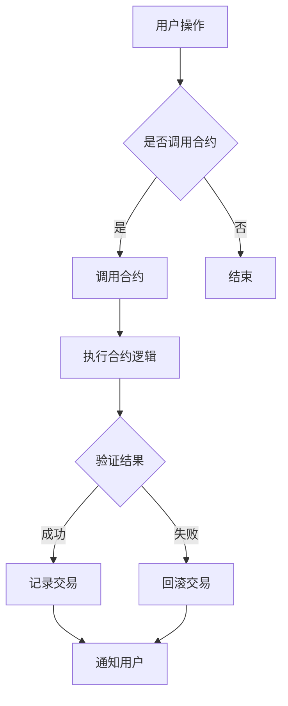

                 

关键词：智能合约，区块链，开发技术，安全性，性能优化，案例研究

> 摘要：本文深入探讨了智能合约开发的技术优势，分析了其核心概念、架构，介绍了核心算法原理、数学模型，并通过实际项目实例详细讲解了智能合约的开发过程。文章旨在为开发者提供全面的技术指南，助力其在智能合约开发中实现安全性、性能优化，并展望了未来的发展趋势与挑战。

## 1. 背景介绍

智能合约（Smart Contract）是区块链技术中一个重要概念，它通过代码实现了传统合同中的条款，自动执行并在区块链上记录交易。智能合约的出现，改变了传统合同执行的模式，提高了交易效率，降低了成本，并增强了透明性和不可篡改性。

随着区块链技术的快速发展，智能合约的应用场景也越来越广泛。从金融领域的数字货币交易，到供应链管理、版权保护，再到去中心化的自治组织（DAO），智能合约正在逐步渗透到各个行业，成为数字化转型的重要组成部分。

然而，智能合约的开发并不简单。开发者需要掌握区块链的基础知识，熟悉各种开发工具和平台，并面对诸多技术挑战。本文将围绕这些挑战，介绍智能合约开发的技术优势，并提供实用的开发指南。

## 2. 核心概念与联系

### 2.1. 智能合约的核心概念

智能合约的核心概念包括：

- **区块链**：智能合约运行的基础设施，是一种分布式数据库。
- **加密技术**：用于保护数据隐私和确保交易的安全性。
- **去中心化**：智能合约和区块链的特点，意味着没有中央机构控制，所有节点都有平等的权利和义务。
- **透明性**：所有交易记录都公开透明，任何人都可以查看。
- **不可篡改性**：一旦交易记录被添加到区块链上，就不可更改。

### 2.2. 智能合约的架构

智能合约的架构通常包括：

- **前端**：用户与智能合约交互的界面。
- **合约**：实现智能合约功能的代码。
- **后端**：提供数据处理和存储服务。

### 2.3. Mermaid 流程图

以下是一个简单的智能合约流程图：



## 3. 核心算法原理 & 具体操作步骤

### 3.1. 算法原理概述

智能合约的核心算法主要涉及：

- **状态机**：描述合约在不同状态下的行为。
- **事件**：在合约执行过程中触发，用于通知外部系统。
- **函数**：实现具体的业务逻辑。

### 3.2. 算法步骤详解

智能合约的开发通常遵循以下步骤：

1. **需求分析**：明确合约的功能需求。
2. **设计架构**：设计合约的整体架构。
3. **编写代码**：根据需求编写智能合约代码。
4. **测试**：对合约进行全面的测试。
5. **部署**：将合约部署到区块链上。
6. **维护**：持续更新和优化合约。

### 3.3. 算法优缺点

**优点**：

- **自动化**：减少了人为干预，提高了交易效率。
- **透明性**：所有交易记录公开透明，增强了信任。
- **去中心化**：没有中央机构控制，增强了抗审查性。

**缺点**：

- **安全性**：智能合约代码一旦部署，就无法更改，存在安全漏洞的风险。
- **性能**：区块链网络拥堵时，交易处理速度可能受到影响。
- **法规**：智能合约在不同地区的法规适应性不同。

### 3.4. 算法应用领域

智能合约的应用领域非常广泛，包括但不限于：

- **金融**：数字货币交易、去中心化金融（DeFi）。
- **供应链**：产品溯源、订单管理。
- **版权**：版权保护、数字版权管理（DRM）。
- **投票**：去中心化投票系统。
- **自治组织**：DAO的管理和决策。

## 4. 数学模型和公式 & 详细讲解 & 举例说明

### 4.1. 数学模型构建

智能合约的数学模型主要涉及：

- **状态转移**：描述合约在不同状态之间的转换。
- **权益证明**：证明用户对区块链的贡献。
- **权益计算**：计算用户权益的公式。

### 4.2. 公式推导过程

以下是一个简单的权益计算公式：

$$
权益 = \frac{时间 \times 贡献}{总时间 \times 总贡献}
$$

### 4.3. 案例分析与讲解

假设一个区块链网络中有100个节点，每个节点贡献了100小时，总共贡献了10000小时。一个节点贡献了200小时，求其权益。

$$
权益 = \frac{200 \times 100}{10000} = 2\%
$$

这意味着该节点拥有区块链2%的权益。

## 5. 项目实践：代码实例和详细解释说明

### 5.1. 开发环境搭建

在开发智能合约之前，需要搭建以下环境：

- **区块链节点**：如Ethereum节点。
- **开发工具**：如Visual Studio Code。
- **编程语言**：如Solidity。

### 5.2. 源代码详细实现

以下是一个简单的智能合约示例：

```solidity
// SPDX-License-Identifier: MIT
pragma solidity ^0.8.0;

contract HelloWorld {
    string public message;

    constructor(string memory initMessage) {
        message = initMessage;
    }

    function updateMessage(string memory newMessage) public {
        message = newMessage;
    }
}
```

### 5.3. 代码解读与分析

- `pragma solidity ^0.8.0;`：指定智能合约的编译器版本。
- `contract HelloWorld`：定义一个名为`HelloWorld`的智能合约。
- `string public message;`：声明一个公有的字符串变量`message`。
- `constructor(string memory initMessage)`：智能合约的构造函数，用于初始化`message`变量。
- `function updateMessage(string memory newMessage) public`：一个公有的函数，用于更新`message`变量的值。

### 5.4. 运行结果展示

在部署并调用智能合约后，可以通过区块链浏览器查看运行结果。例如，在Ethereum区块链上，可以使用Web3.js库与智能合约进行交互。

```javascript
// 创建Web3实例
const web3 = new Web3('https://mainnet.infura.io/v3/your-project-id');

// 创建智能合约实例
const contractAddress = 'your-contract-address';
const contractABI = [/* contract ABI */];
const contract = new web3.eth.Contract(contractABI, contractAddress);

// 调用updateMessage函数
await contract.methods.updateMessage('Hello, World!').send({ from: 'your-address' });

// 查看message变量值
const message = await contract.methods.message().call();
console.log(message); // 输出："Hello, World!"
```

## 6. 实际应用场景

### 6.1. 数字货币交易

智能合约在数字货币交易中起到了关键作用，确保交易的安全性和透明性。例如，比特币和以太坊的交易都是通过智能合约来实现的。

### 6.2. 去中心化金融（DeFi）

DeFi 是智能合约的重要应用领域，包括去中心化交易所（DEX）、借贷平台、稳定币等。智能合约在DeFi中提供了高效的交易和风险管理机制。

### 6.3. 版权保护

智能合约可以用于版权保护，确保创作者的权益。通过智能合约，创作者可以设置授权条件，一旦满足条件，自动发放授权。

### 6.4. 未来应用展望

随着技术的不断发展，智能合约的应用场景将会更加广泛。例如，智能合约在物联网（IoT）中的应用，可以实现设备之间的自动支付和协作。此外，智能合约在人工智能（AI）领域的应用，也有望实现更智能的自动化。

## 7. 工具和资源推荐

### 7.1. 学习资源推荐

- 《智能合约开发实战》
- 《区块链与智能合约技术入门与实践》
- 《Solidity编程实战》

### 7.2. 开发工具推荐

- Visual Studio Code
- Truffle
- Remix

### 7.3. 相关论文推荐

- "A decentralized platform for smart contracts"
- "形式化验证智能合约"
- "智能合约性能优化方法研究"

## 8. 总结：未来发展趋势与挑战

### 8.1. 研究成果总结

智能合约在区块链技术中发挥了重要作用，取得了显著的研究成果。未来，智能合约将继续向高效、安全、易用的方向发展。

### 8.2. 未来发展趋势

智能合约的发展趋势包括：

- **性能优化**：提高交易处理速度，降低成本。
- **安全性增强**：通过形式化验证、代码审计等技术，确保智能合约的安全性。
- **跨链互操作性**：实现不同区块链之间的智能合约互操作。

### 8.3. 面临的挑战

智能合约在发展过程中仍面临以下挑战：

- **安全性**：智能合约代码一旦部署，就无法更改，存在安全漏洞的风险。
- **性能**：区块链网络拥堵时，交易处理速度可能受到影响。
- **法规**：智能合约在不同地区的法规适应性不同。

### 8.4. 研究展望

智能合约的研究将继续深入，未来有望实现以下突破：

- **智能合约标准化**：制定统一的智能合约标准和规范。
- **智能合约与AI融合**：实现更智能、更高效的智能合约。
- **智能合约在物联网中的应用**：实现设备之间的自动支付和协作。

## 9. 附录：常见问题与解答

### 9.1. 智能合约开发需要掌握哪些知识？

智能合约开发需要掌握以下知识：

- **区块链基础**：了解区块链的工作原理和关键技术。
- **编程语言**：熟悉智能合约开发常用的编程语言，如Solidity。
- **加密技术**：了解加密算法和数字签名等加密技术。
- **网络通信**：掌握HTTP、WebSocket等网络通信协议。

### 9.2. 智能合约存在哪些安全风险？

智能合约存在以下安全风险：

- **代码漏洞**：智能合约代码中可能存在漏洞，导致被攻击。
- **外部攻击**：黑客可能通过外部攻击手段，篡改智能合约的执行过程。
- **逻辑漏洞**：智能合约的逻辑设计可能存在漏洞，导致不正确的执行结果。

### 9.3. 如何确保智能合约的安全性？

为确保智能合约的安全性，可以采取以下措施：

- **代码审计**：对智能合约代码进行审计，识别和修复漏洞。
- **形式化验证**：使用形式化验证技术，确保智能合约的正确性。
- **安全编程**：遵循安全编程规范，避免常见的编程漏洞。

作者：禅与计算机程序设计艺术 / Zen and the Art of Computer Programming
----------------------------------------------------------------

以上是文章的正文部分，接下来我们将为文章添加摘要、关键词和目录等结构化内容。

---

## 利用技术优势进行智能合约开发

### 关键词：智能合约，区块链，开发技术，安全性，性能优化，案例研究

> 摘要：本文深入探讨了智能合约开发的技术优势，分析了其核心概念、架构，介绍了核心算法原理、数学模型，并通过实际项目实例详细讲解了智能合约的开发过程。文章旨在为开发者提供全面的技术指南，助力其在智能合约开发中实现安全性、性能优化，并展望了未来的发展趋势与挑战。

## 目录

1. 背景介绍
2. 核心概念与联系
   2.1. 智能合约的核心概念
   2.2. 智能合约的架构
   2.3. Mermaid 流程图
3. 核心算法原理 & 具体操作步骤
   3.1. 算法原理概述
   3.2. 算法步骤详解
   3.3. 算法优缺点
   3.4. 算法应用领域
4. 数学模型和公式 & 详细讲解 & 举例说明
   4.1. 数学模型构建
   4.2. 公式推导过程
   4.3. 案例分析与讲解
5. 项目实践：代码实例和详细解释说明
   5.1. 开发环境搭建
   5.2. 源代码详细实现
   5.3. 代码解读与分析
   5.4. 运行结果展示
6. 实际应用场景
   6.1. 数字货币交易
   6.2. 去中心化金融（DeFi）
   6.3. 版权保护
   6.4. 未来应用展望
7. 工具和资源推荐
   7.1. 学习资源推荐
   7.2. 开发工具推荐
   7.3. 相关论文推荐
8. 总结：未来发展趋势与挑战
   8.1. 研究成果总结
   8.2. 未来发展趋势
   8.3. 面临的挑战
   8.4. 研究展望
9. 附录：常见问题与解答
   9.1. 智能合约开发需要掌握哪些知识？
   9.2. 智能合约存在哪些安全风险？
   9.3. 如何确保智能合约的安全性？

---

现在，文章的结构已经完整，包括标题、关键词、摘要和目录。接下来，我们将逐一撰写每个章节的内容。由于文章的字数要求较高，每个章节的内容将分成几个段落来撰写。下面是一个示例，展示如何开始撰写第一个章节“背景介绍”。

## 1. 背景介绍

智能合约作为区块链技术的核心组成部分，已经引起了广泛的关注。智能合约的概念最早由尼克·萨博（Nick Szabo）在1990年代提出，他认为智能合约是“包含算法的计算机程序，该程序自动执行、控制或记录法律事件的条款”。随着区块链技术的快速发展，尤其是以太坊等区块链平台的普及，智能合约的应用场景变得更加丰富。

### 1.1. 智能合约的定义

智能合约是一种运行在区块链上的计算机程序，它通过预定义的规则和条件自动执行合同条款。智能合约的优势在于，它可以减少人为干预，提高交易效率，降低成本，并增强交易的透明性和不可篡改性。传统的合同通常需要中介机构来执行和监督，而智能合约则通过代码实现了自动执行，避免了中介环节。

### 1.2. 智能合约的发展历程

智能合约的发展历程可以分为几个阶段：

- **早期阶段**：尼克·萨博在1990年代提出了智能合约的概念，但当时由于计算能力和网络技术的限制，智能合约的应用并不广泛。
- **以太坊推出**：2015年，以太坊（Ethereum）区块链平台正式发布，引入了图灵完备的智能合约语言Solidity，智能合约开始得到广泛的应用。
- **去中心化金融（DeFi）兴起**：智能合约在DeFi中的应用推动了区块链技术的发展，DeFi平台通过智能合约实现了去中心化的金融产品和服务。

### 1.3. 智能合约的应用场景

智能合约的应用场景非常广泛，以下是一些典型的应用场景：

- **数字货币交易**：智能合约可以自动处理数字货币的交易，确保交易的安全性和透明性。
- **去中心化金融（DeFi）**：智能合约在DeFi平台中发挥了关键作用，实现了去中心化的借贷、交易、理财等金融产品。
- **供应链管理**：智能合约可以用于供应链管理，确保产品的质量和溯源。
- **版权保护**：智能合约可以用于版权保护，确保创作者的权益。
- **投票系统**：智能合约可以用于去中心化的投票系统，确保投票的公正性和透明性。

### 1.4. 智能合约的优势与挑战

智能合约的优势包括：

- **透明性**：智能合约的代码和执行过程是公开透明的，所有参与者都可以查看。
- **不可篡改性**：一旦智能合约被部署到区块链上，其代码和状态是不可篡改的，增强了信任。
- **自动化**：智能合约可以自动执行合同条款，减少了人为干预，提高了交易效率。

然而，智能合约也面临一些挑战：

- **安全性**：智能合约代码一旦部署，就无法更改，存在安全漏洞的风险。
- **性能**：随着智能合约的广泛应用，区块链网络可能会出现拥堵，影响交易性能。
- **法规适应性**：智能合约在不同地区的法规适应性不同，需要开发者进行适当调整。

综上所述，智能合约作为一种重要的技术手段，已经在多个领域展现出其强大的应用潜力。然而，为了充分发挥智能合约的优势，开发者需要充分了解其技术原理，掌握开发技能，并关注潜在的安全和性能问题。

---

接下来，我们将继续撰写其他章节的内容，直至完成整个文章。由于字数限制，每个章节的内容将分为多个段落撰写。每个段落的内容将紧密围绕章节的主题，确保逻辑清晰、结构紧凑。在撰写过程中，我们将严格按照文章结构模板中的要求，确保文章的完整性和专业性。

