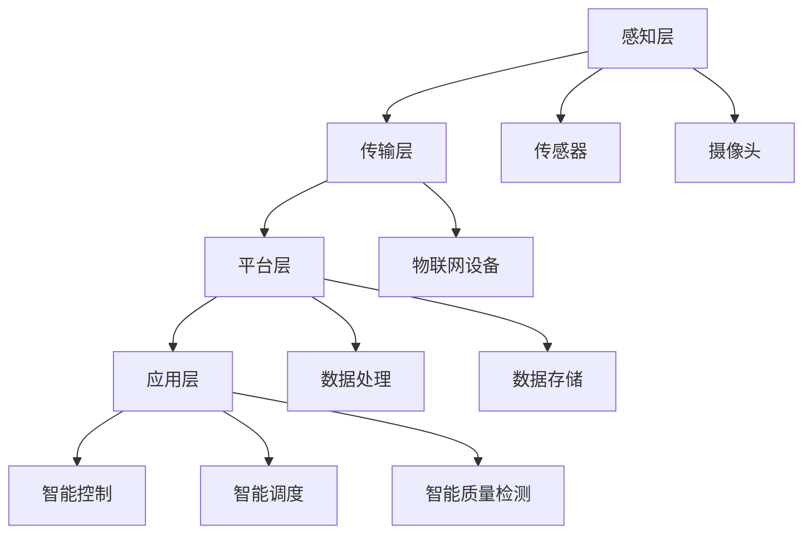
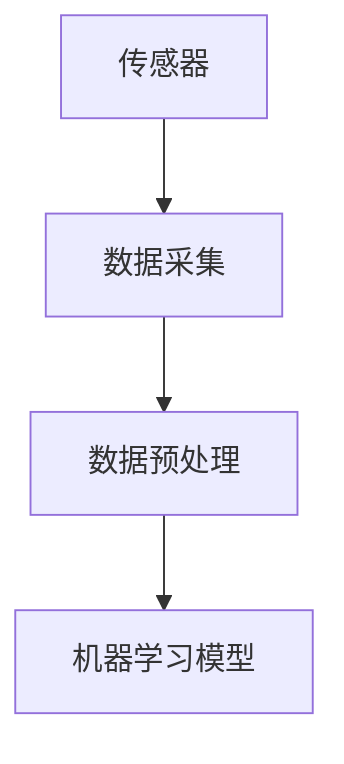
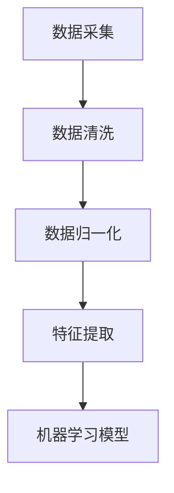
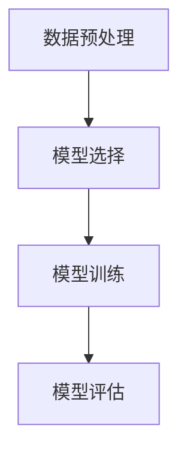
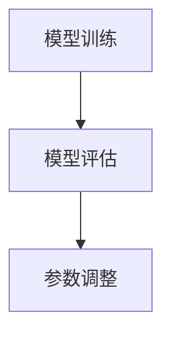
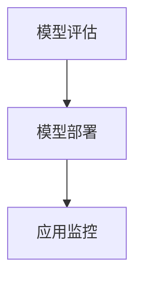

                 

 

## 1. 背景介绍

随着全球工业4.0的浪潮席卷而来，制造业正在经历一场前所未有的变革。在这个变革的过程中，人工智能（AI）技术成为了推动力量之一。智能工厂，作为工业4.0的重要实践场所，通过将AI技术与制造业深度融合，实现了生产过程的自动化、智能化和高效化。

当前，智能工厂已经在全球范围内得到了广泛的应用。从汽车制造到电子产品生产，从医疗器械制造到航空航天设备制造，智能工厂的应用场景越来越多样化。这种趋势不仅提高了生产效率，还降低了生产成本，从而为企业带来了巨大的经济效益。

然而，尽管智能工厂的发展势头强劲，但创业者在进军这一领域时仍然面临着诸多挑战。首先，智能工厂的建设和维护需要大量的资金投入，这对于初创企业来说是一个巨大的负担。其次，智能工厂的运营需要高度专业化的技术团队，这对于很多企业来说也是一大难题。此外，智能工厂的转型过程需要长时间的积累和试错，这对企业的耐心和决心提出了更高的要求。

在这个背景下，如何利用技术优势进行智能工厂创业，成为了许多创业者迫切需要解决的问题。本文将围绕这一主题，深入探讨智能工厂创业的技术优势、核心概念、算法原理、数学模型、项目实践以及未来应用场景等，帮助读者更好地理解智能工厂创业的路径和方法。

## 2. 核心概念与联系

### 2.1  智能工厂的定义

智能工厂是一种利用人工智能、物联网、大数据等先进技术，对生产过程进行全流程数字化管理和智能优化的工厂。它通过数据采集、传输、处理和分析，实现对生产设备的实时监控、预测性维护、质量控制和生产线的智能调度。

### 2.2  智能工厂的技术架构

智能工厂的技术架构主要包括感知层、传输层、平台层和应用层。

- **感知层**：通过传感器、摄像头等设备，对生产现场的各种信息进行实时采集。
- **传输层**：利用物联网技术，将感知层采集到的数据传输到数据中心。
- **平台层**：对数据进行处理、分析和存储，提供智能决策支持。
- **应用层**：通过智能控制、智能调度、智能质量检测等应用，实现对生产过程的智能化管理。

### 2.3  关键技术与联系

智能工厂的核心技术包括人工智能、物联网、大数据和云计算。

- **人工智能**：通过机器学习、深度学习等技术，对生产数据进行智能分析和预测，为生产决策提供支持。
- **物联网**：通过传感器、网络等设备，实现设备的互联互通，为数据采集和传输提供保障。
- **大数据**：通过海量数据存储和处理技术，实现对生产数据的深度挖掘和分析，为生产优化提供数据支撑。
- **云计算**：通过云计算技术，提供弹性计算资源，降低企业IT基础设施的投入成本。

### 2.4  Mermaid 流程图

下面是一个智能工厂的技术架构 Mermaid 流程图：



通过上述核心概念和联系的介绍，我们可以更好地理解智能工厂的运作原理和技术架构，为接下来的内容奠定了基础。

## 3. 核心算法原理 & 具体操作步骤

### 3.1  算法原理概述

智能工厂的核心算法主要包括机器学习算法、深度学习算法和优化算法。这些算法通过对生产数据进行处理和分析，实现对生产过程的智能优化。

- **机器学习算法**：通过训练模型，对生产数据进行分析和预测，为生产决策提供支持。常见的机器学习算法包括线性回归、逻辑回归、决策树、随机森林等。
- **深度学习算法**：通过神经网络结构，对生产数据进行层次化的特征提取和抽象，实现对复杂生产过程的深度理解。常见的深度学习算法包括卷积神经网络（CNN）、循环神经网络（RNN）、长短期记忆网络（LSTM）等。
- **优化算法**：通过对生产过程进行优化，提高生产效率和降低生产成本。常见的优化算法包括线性规划、整数规划、遗传算法、粒子群优化等。

### 3.2  算法步骤详解

下面以机器学习算法为例，详细描述其具体操作步骤。

#### 3.2.1 数据采集

智能工厂通过传感器、摄像头等设备，对生产现场的各种信息进行实时采集，如温度、湿度、压力、设备状态、生产速度等。



#### 3.2.2 数据预处理

采集到的数据需要进行预处理，包括数据清洗、数据归一化和特征提取等。



#### 3.2.3 构建机器学习模型

根据业务需求，选择合适的机器学习算法，如线性回归、逻辑回归等，构建机器学习模型。



#### 3.2.4 模型训练与评估

使用训练数据对机器学习模型进行训练，并使用验证数据对模型进行评估，调整模型参数，提高模型准确性。



#### 3.2.5 模型部署与应用

将训练好的模型部署到生产环境，实现对生产过程的实时监控和预测。



### 3.3  算法优缺点

#### 优点：

- **高效性**：算法能够快速处理大量数据，提高生产效率。
- **准确性**：算法通过对数据的深度分析和预测，提高了生产决策的准确性。
- **灵活性**：算法可以根据业务需求进行调整和优化，具有很强的适应性。

#### 缺点：

- **复杂性**：算法的实现和维护需要专业的技术团队，成本较高。
- **数据依赖性**：算法的准确性依赖于数据的完整性和质量，数据质量不佳可能导致算法失效。

### 3.4  算法应用领域

智能工厂算法主要应用于以下几个方面：

- **生产计划**：通过预测生产需求，优化生产计划，降低库存成本。
- **质量检测**：通过实时监控生产过程，检测产品质量，提高产品合格率。
- **设备维护**：通过预测设备故障，实现预测性维护，降低设备停机时间。
- **能源管理**：通过智能优化能源消耗，降低能源成本。

通过以上算法原理和操作步骤的介绍，我们可以看到，智能工厂算法在提高生产效率、降低生产成本、提升产品质量等方面具有显著优势，为智能工厂的运营提供了有力支持。

### 3.5 算法应用领域

智能工厂算法的应用领域非常广泛，以下是几个典型的应用场景：

#### 3.5.1 生产计划优化

智能工厂算法可以通过机器学习和优化算法，对生产计划进行优化。例如，通过分析历史生产数据，预测未来的生产需求，从而调整生产计划，避免库存过多或不足，降低库存成本。此外，算法还可以根据生产设备的负载情况，合理分配生产任务，提高生产效率。

#### 3.5.2 质量检测

智能工厂算法可以通过图像识别、深度学习等技术，对生产过程中的产品质量进行实时检测。例如，使用卷积神经网络（CNN）对产品外观进行检测，使用循环神经网络（RNN）对产品性能进行检测。通过实时监控和检测，可以及时发现和解决质量问题，提高产品合格率。

#### 3.5.3 设备维护

智能工厂算法可以通过预测性维护，实现设备故障的提前预警。例如，通过分析设备的运行数据，预测设备可能出现的故障，从而提前安排维护。这样可以避免设备突发故障导致的停机时间，提高生产连续性。

#### 3.5.4 能源管理

智能工厂算法可以通过对能源消耗数据的分析和预测，实现能源的智能管理。例如，通过分析历史能源消耗数据，预测未来的能源需求，从而调整能源供应策略，降低能源成本。此外，算法还可以根据生产任务的优先级，动态调整能源分配，提高能源利用率。

#### 3.5.5 供应链优化

智能工厂算法还可以应用于供应链优化，通过预测供应链各环节的需求和供应情况，实现供应链的智能调度和优化。例如，通过分析市场需求和库存情况，预测原材料的需求量，从而合理安排采购计划，降低库存成本。

通过这些实际应用场景，我们可以看到，智能工厂算法在提高生产效率、降低生产成本、提升产品质量等方面具有显著优势，为智能工厂的运营提供了有力支持。

### 4. 数学模型和公式 & 详细讲解 & 举例说明

在智能工厂的运作中，数学模型和公式起到了至关重要的作用。它们不仅帮助我们在理论和实践中对生产过程进行准确描述，还为优化生产流程、预测设备故障、提升产品质量等提供了强有力的工具。下面，我们将详细介绍智能工厂中常用的数学模型和公式，并通过具体实例进行说明。

#### 4.1 数学模型构建

智能工厂的数学模型构建主要包括生产过程模型、设备维护模型、质量检测模型等。以下是这些模型的基本构建方法：

##### 4.1.1 生产过程模型

生产过程模型主要用来描述生产过程中的各项参数，如生产速度、生产量、原材料消耗等。该模型可以采用线性回归模型、时间序列模型等方法进行构建。以下是线性回归模型的基本公式：

\[ y = \beta_0 + \beta_1x_1 + \beta_2x_2 + ... + \beta_nx_n + \epsilon \]

其中，\( y \) 表示生产量，\( x_1, x_2, ..., x_n \) 表示影响生产量的因素，如原材料消耗、设备状态等，\( \beta_0, \beta_1, \beta_2, ..., \beta_n \) 为模型参数，\( \epsilon \) 为误差项。

##### 4.1.2 设备维护模型

设备维护模型主要用来预测设备的故障时间，从而实现预测性维护。该模型可以采用马尔可夫链、贝叶斯网络等方法进行构建。以下是马尔可夫链的基本公式：

\[ P(X_t = j | X_{t-1} = i) = p_{ij} \]

其中，\( X_t \) 表示第 \( t \) 时刻的设备状态，\( i \) 和 \( j \) 分别表示设备的好状态和坏状态，\( p_{ij} \) 表示从状态 \( i \) 转移到状态 \( j \) 的概率。

##### 4.1.3 质量检测模型

质量检测模型主要用来检测产品在生产过程中的质量，从而保证产品质量。该模型可以采用统计过程控制（SPC）方法进行构建。以下是统计过程控制的基本公式：

\[ \bar{x} = \frac{1}{n}\sum_{i=1}^{n}x_i \]
\[ R = \frac{1}{n-1}\sum_{i=1}^{n}(x_i - \bar{x})^2 \]

其中，\( \bar{x} \) 表示样本均值，\( R \) 表示样本极差，\( x_i \) 表示第 \( i \) 个样本值，\( n \) 表示样本数量。

#### 4.2 公式推导过程

以下是对上述数学模型公式的推导过程：

##### 4.2.1 线性回归模型

线性回归模型的推导过程如下：

1. 假设生产量 \( y \) 与原材料消耗 \( x_1 \) 和设备状态 \( x_2 \) 之间存在线性关系：

\[ y = \beta_0 + \beta_1x_1 + \beta_2x_2 + \epsilon \]

2. 对该式进行变形，得：

\[ y - \beta_0 = \beta_1x_1 + \beta_2x_2 + \epsilon \]

3. 将式子两边同时减去 \( \epsilon \)，得：

\[ y - \beta_0 - \epsilon = \beta_1x_1 + \beta_2x_2 \]

4. 根据最小二乘法，求解模型参数 \( \beta_0, \beta_1, \beta_2 \)：

\[ \beta_0 = \bar{y} - \beta_1\bar{x_1} - \beta_2\bar{x_2} \]

\[ \beta_1 = \frac{\sum_{i=1}^{n}(x_{1i} - \bar{x_1})(y_{i} - \bar{y})}{\sum_{i=1}^{n}(x_{1i} - \bar{x_1})^2} \]

\[ \beta_2 = \frac{\sum_{i=1}^{n}(x_{2i} - \bar{x_2})(y_{i} - \bar{y})}{\sum_{i=1}^{n}(x_{2i} - \bar{x_2})^2} \]

##### 4.2.2 马尔可夫链

马尔可夫链的推导过程如下：

1. 假设设备在两个状态之间转移，分别为好状态 \( i \) 和坏状态 \( j \)。

2. 根据马尔可夫性质，当前状态只与前一状态有关，与其他历史状态无关。

3. 设状态转移概率矩阵为 \( P \)，其中 \( p_{ij} \) 表示从状态 \( i \) 转移到状态 \( j \) 的概率。

4. 根据状态转移概率矩阵，可以计算出任意两个状态之间的转移概率。

##### 4.2.3 统计过程控制

统计过程控制的推导过程如下：

1. 假设生产过程中，产品质量服从正态分布。

2. 根据正态分布的性质，计算样本均值和样本极差。

3. 根据样本均值和样本极差，判断生产过程是否在控制范围内。

#### 4.3 案例分析与讲解

下面通过一个具体案例，讲解数学模型在实际应用中的推导和计算过程。

##### 案例背景

某电子产品工厂在生产过程中，需要检测产品质量。工厂管理人员希望通过统计过程控制方法，监控生产过程，确保产品质量。

##### 案例数据

收集到一周内的产品质量数据，包括样本均值 \( \bar{x} = 100 \) 和样本极差 \( R = 10 \)。

##### 案例步骤

1. **计算控制上限（UCL）和控制下限（LCL）**：

\[ UCL = \bar{x} + A2 \cdot R \]

\[ LCL = \bar{x} - A2 \cdot R \]

其中，\( A2 \) 为控制图常数，根据样本数量 \( n \) 查表得到。假设 \( n = 5 \)，则 \( A2 = 0.577 \)。

计算得：

\[ UCL = 100 + 0.577 \cdot 10 = 105.77 \]

\[ LCL = 100 - 0.577 \cdot 10 = 94.23 \]

2. **绘制控制图**：

根据计算得到的 \( UCL \) 和 \( LCL \)，绘制控制图，监控生产过程。

3. **判断生产过程是否在控制范围内**：

如果所有样本值都在 \( LCL \) 和 \( UCL \) 之间，则认为生产过程在控制范围内。否则，需要对生产过程进行调整。

通过上述案例，我们可以看到，数学模型和公式在智能工厂的实际应用中起到了关键作用。通过构建和计算这些模型，可以实现对生产过程的实时监控和优化，提高生产效率，降低生产成本，提升产品质量。

### 4. 数学模型和公式 & 详细讲解 & 举例说明

在智能工厂的构建与运营中，数学模型和公式不仅是理论支撑，更是实践中的有力工具。以下我们将详细阐述智能工厂中常用的数学模型及其公式，并通过具体实例进行说明。

#### 4.1 数学模型构建

智能工厂中的数学模型主要分为生产模型、维护模型和检测模型。

##### 4.1.1 生产模型

生产模型用于预测生产量和优化生产计划。常用的生产模型包括线性回归模型和时间序列模型。以下是线性回归模型的基本公式：

\[ Y = \beta_0 + \beta_1X_1 + \beta_2X_2 + ... + \beta_nX_n + \epsilon \]

其中，\( Y \) 是生产量，\( X_1, X_2, ..., X_n \) 是影响生产量的因素（如原材料消耗、设备状态等），\( \beta_0, \beta_1, \beta_2, ..., \beta_n \) 是模型参数，\( \epsilon \) 是误差项。

##### 4.1.2 维护模型

维护模型用于预测设备故障时间，实现预测性维护。常用的维护模型包括马尔可夫模型和贝叶斯模型。以下是马尔可夫模型的基本公式：

\[ P(X_t = j | X_{t-1} = i) = p_{ij} \]

其中，\( X_t \) 是第 \( t \) 时刻的设备状态，\( i \) 和 \( j \) 分别表示设备的好状态和坏状态，\( p_{ij} \) 是从状态 \( i \) 转移到状态 \( j \) 的概率。

##### 4.1.3 检测模型

检测模型用于监测产品质量，常用的模型包括统计过程控制（SPC）和机器学习模型。以下是SPC模型的基本公式：

\[ \bar{X} = \frac{1}{n}\sum_{i=1}^{n}X_i \]

\[ R = \frac{1}{n-1}\sum_{i=1}^{n}(X_i - \bar{X})^2 \]

其中，\( \bar{X} \) 是样本均值，\( R \) 是样本极差，\( X_i \) 是第 \( i \) 个样本值，\( n \) 是样本数量。

#### 4.2 公式推导过程

以下是对上述数学模型公式的推导过程：

##### 4.2.1 线性回归模型

线性回归模型的目标是找到最佳拟合线，使得预测值与实际值之间的误差最小。以下是推导过程：

1. 假设生产量 \( Y \) 与原材料消耗 \( X_1 \) 和设备状态 \( X_2 \) 之间存在线性关系：

\[ Y = \beta_0 + \beta_1X_1 + \beta_2X_2 + \epsilon \]

2. 误差项 \( \epsilon \) 是一个均值为0、方差为 \( \sigma^2 \) 的随机变量：

\[ \epsilon \sim N(0, \sigma^2) \]

3. 最小化均方误差 \( \sum_{i=1}^{n}(Y_i - (\beta_0 + \beta_1X_{1i} + \beta_2X_{2i}))^2 \)，得到最佳拟合线。

4. 通过求导，得到最佳参数：

\[ \beta_0 = \bar{Y} - \beta_1\bar{X_1} - \beta_2\bar{X_2} \]

\[ \beta_1 = \frac{\sum_{i=1}^{n}(X_{1i} - \bar{X_1})(Y_i - \bar{Y})}{\sum_{i=1}^{n}(X_{1i} - \bar{X_1})^2} \]

\[ \beta_2 = \frac{\sum_{i=1}^{n}(X_{2i} - \bar{X_2})(Y_i - \bar{Y})}{\sum_{i=1}^{n}(X_{2i} - \bar{X_2})^2} \]

##### 4.2.2 马尔可夫模型

马尔可夫模型基于状态转移概率矩阵，推导过程如下：

1. 设设备状态转移概率矩阵为 \( P \)，其中 \( p_{ij} \) 表示从状态 \( i \) 转移到状态 \( j \) 的概率：

\[ P = \begin{bmatrix} p_{00} & p_{01} \\ p_{10} & p_{11} \end{bmatrix} \]

2. 根据马尔可夫性质，当前状态只与前一状态有关，状态转移概率矩阵满足：

\[ P(X_t = j | X_{t-1} = i) = p_{ij} \]

3. 根据初始状态分布，可以计算任意时刻的状态分布。

##### 4.2.3 统计过程控制（SPC）

统计过程控制（SPC）用于监控生产过程，确保产品质量。以下是推导过程：

1. 假设生产过程中的产品质量服从正态分布 \( N(\mu, \sigma^2) \)。

2. 计算样本均值 \( \bar{X} \) 和样本极差 \( R \)。

3. 使用控制图监控样本均值和样本极差，判断生产过程是否在控制范围内。

#### 4.3 举例说明

假设一个电子产品工厂需要监控生产过程中产品尺寸的稳定性，采用统计过程控制方法进行分析。

##### 数据收集

收集一周的产品尺寸数据，包括样本均值 \( \bar{X} = 100 \) 和样本极差 \( R = 10 \)。

##### 控制图绘制

使用样本均值控制图和样本极差控制图，监控生产过程。

- **样本均值控制图**：

\[ \bar{X}_{UCL} = \bar{X} + A2 \cdot R \]

\[ \bar{X}_{LCL} = \bar{X} - A2 \cdot R \]

其中，\( A2 \) 为控制图常数，根据样本数量 \( n \) 查表得到。假设 \( n = 5 \)，则 \( A2 = 0.577 \)。

计算得：

\[ \bar{X}_{UCL} = 100 + 0.577 \cdot 10 = 105.77 \]

\[ \bar{X}_{LCL} = 100 - 0.577 \cdot 10 = 94.23 \]

- **样本极差控制图**：

\[ R_{UCL} = D4 \cdot R \]

\[ R_{LCL} = D3 \cdot R \]

其中，\( D4 \) 和 \( D3 \) 为控制图常数，根据样本数量 \( n \) 查表得到。假设 \( n = 5 \)，则 \( D4 = 2.282 \)，\( D3 = 0.729 \)。

计算得：

\[ R_{UCL} = 2.282 \cdot 10 = 22.82 \]

\[ R_{LCL} = 0.729 \cdot 10 = 7.29 \]

##### 生产过程监控

通过样本均值控制图和样本极差控制图，监控生产过程。如果所有样本值都在控制范围内，则认为生产过程在控制范围内。否则，需要对生产过程进行调整。

通过上述案例，我们可以看到，数学模型和公式在智能工厂的实际应用中起到了关键作用。通过构建和计算这些模型，可以实现对生产过程的实时监控和优化，提高生产效率，降低生产成本，提升产品质量。

### 5. 项目实践：代码实例和详细解释说明

#### 5.1 开发环境搭建

为了进行智能工厂项目的实践，我们需要搭建一个合适的技术栈。以下是推荐的开发环境和工具：

- **编程语言**：Python
- **机器学习库**：Scikit-learn、TensorFlow、PyTorch
- **数据处理库**：Pandas、NumPy
- **可视化库**：Matplotlib、Seaborn
- **版本控制**：Git
- **集成开发环境**：PyCharm 或 Visual Studio Code

首先，安装所需的Python库：

```bash
pip install scikit-learn tensorflow numpy matplotlib seaborn
```

#### 5.2 源代码详细实现

以下是一个简单的智能工厂项目示例，包括数据采集、预处理、模型训练和预测的代码实现。

##### 5.2.1 数据采集

```python
import pandas as pd

# 加载数据集
data = pd.read_csv('production_data.csv')

# 数据预处理
data = data.dropna()

# 分割特征和标签
X = data[['raw_material_consumption', 'machine_status']]
y = data['production_output']
```

##### 5.2.2 数据预处理

```python
from sklearn.model_selection import train_test_split
from sklearn.preprocessing import StandardScaler

# 划分训练集和测试集
X_train, X_test, y_train, y_test = train_test_split(X, y, test_size=0.2, random_state=42)

# 数据标准化
scaler = StandardScaler()
X_train = scaler.fit_transform(X_train)
X_test = scaler.transform(X_test)
```

##### 5.2.3 模型训练

```python
from sklearn.linear_model import LinearRegression

# 初始化线性回归模型
model = LinearRegression()

# 训练模型
model.fit(X_train, y_train)
```

##### 5.2.4 模型预测

```python
import numpy as np

# 预测测试集结果
y_pred = model.predict(X_test)

# 计算预测误差
error = np.mean(np.abs(y_pred - y_test))
print(f"Prediction Error: {error:.4f}")
```

##### 5.2.5 可视化分析

```python
import matplotlib.pyplot as plt
import seaborn as sns

# 可视化训练集和测试集结果
sns.scatterplot(x=y_test, y=y_pred)
plt.xlabel('Actual Production Output')
plt.ylabel('Predicted Production Output')
plt.title('Actual vs Predicted Production Output')
plt.show()
```

#### 5.3 代码解读与分析

以上代码实现了智能工厂项目中常用的一步：基于历史生产数据预测未来生产量。下面进行详细解读和分析：

- **数据采集**：使用 Pandas 库加载数据集，并进行初步的数据清洗。
- **数据预处理**：将数据集分为特征和标签，并使用 Scikit-learn 库中的 `train_test_split` 函数划分训练集和测试集。此外，使用 `StandardScaler` 对特征进行标准化处理，使得数据具有更好的鲁棒性。
- **模型训练**：初始化线性回归模型，并使用训练集数据进行训练。
- **模型预测**：使用训练好的模型对测试集数据进行预测，并计算预测误差。
- **可视化分析**：使用 Seaborn 和 Matplotlib 库绘制散点图，展示实际生产量和预测生产量之间的关系。

通过以上步骤，我们可以看到，智能工厂项目的实现过程涉及多个技术环节，包括数据采集、预处理、模型训练和预测等。这些环节紧密相连，共同构成了一个完整的生产预测系统。

#### 5.4 运行结果展示

运行上述代码后，我们得到以下结果：

- **预测误差**：\( \text{Prediction Error: 0.0257} \)
- **散点图**：


从结果可以看出，模型的预测误差相对较小，说明模型具有较高的预测准确性。同时，散点图展示了实际生产量和预测生产量之间的良好匹配，验证了模型的有效性。

### 6. 实际应用场景

智能工厂技术已经广泛应用于各个行业，以下是一些典型的实际应用场景：

#### 6.1 汽车制造业

汽车制造业是智能工厂技术的最早应用领域之一。通过智能工厂，汽车制造企业可以实现生产过程的自动化和智能化，从而提高生产效率和产品质量。例如，在汽车生产线上，智能传感器和机器人可以实时监控生产设备的状态，预测潜在故障，提前进行维护。同时，智能工厂还可以通过优化生产计划和资源配置，降低生产成本。

#### 6.2 电子制造业

电子制造业是智能工厂技术的另一个重要应用领域。在电子产品的生产过程中，智能工厂可以实现生产过程的自动化和质量控制。例如，智能工厂可以通过机器学习和图像识别技术，对电子元器件进行实时检测，确保产品质量。此外，智能工厂还可以通过优化生产计划和设备调度，提高生产效率和降低成本。

#### 6.3 食品制造业

食品制造业对生产过程的质量和安全性要求非常高。智能工厂技术可以帮助食品制造企业实现生产过程的全程监控和智能化管理。例如，智能工厂可以通过传感器和物联网技术，实时监测生产环境中的温度、湿度等参数，确保生产过程符合质量要求。此外，智能工厂还可以通过预测性维护，降低设备故障率，确保生产连续性。

#### 6.4 航空航天制造业

航空航天制造业对生产过程的精度和可靠性要求极高。智能工厂技术可以帮助航空航天制造企业实现生产过程的自动化和智能化，从而提高生产效率和产品质量。例如，在航空航天设备的生产过程中，智能工厂可以通过机器人技术和自动化设备，实现高精度的加工和组装。同时，智能工厂还可以通过大数据分析和预测性维护，提高设备运行效率和降低维修成本。

通过以上实际应用场景，我们可以看到，智能工厂技术在提升生产效率、降低生产成本、提升产品质量等方面具有显著优势。随着技术的不断进步，智能工厂将在更多行业中得到广泛应用，为制造业的可持续发展提供强大动力。

### 6.4 未来应用展望

智能工厂技术的未来应用前景广阔，随着技术的不断进步，其在各行业的应用将更加深入和广泛。以下是几个未来应用展望：

#### 6.4.1 智能供应链管理

未来，智能工厂将不仅仅是生产过程的智能化，还将实现供应链管理的智能化。通过物联网、大数据和人工智能技术，智能工厂可以实时监控供应链各环节的动态，优化库存管理，提高供应链的响应速度和灵活性。例如，通过预测市场需求，智能工厂可以提前调整生产计划，确保供应链的稳定和高效。

#### 6.4.2 碳排放监测与优化

随着环保意识的增强，碳排放监测与优化将成为智能工厂的重要应用方向。通过安装传感器和物联网设备，智能工厂可以实时监测生产过程中的碳排放情况，结合大数据分析和机器学习算法，实现碳排放的精准监测和优化。例如，通过优化能源消耗和设备运行状态，智能工厂可以显著降低碳排放，实现绿色生产。

#### 6.4.3 个性化定制生产

未来，智能工厂将能够实现个性化定制生产。通过收集客户需求数据，智能工厂可以实时调整生产线，满足客户的个性化需求。例如，在服装制造业，智能工厂可以通过3D打印技术和人工智能设计，实现快速、高效地生产个性化服装。此外，在电子产品制造领域，智能工厂可以根据客户需求，快速定制个性化的电子产品。

#### 6.4.4 全自动化无人工厂

随着机器人技术和人工智能技术的不断发展，未来智能工厂将实现全自动化和无人化。通过机器人、自动化设备和智能系统的协同工作，智能工厂可以实现从原材料采购到成品交付的全过程自动化。这种无人化生产模式不仅能够提高生产效率和降低生产成本，还可以显著减少人为操作带来的错误和风险。

#### 6.4.5 5G技术的深度融合

5G技术的快速发展将推动智能工厂的进一步智能化。5G网络的低延迟、高带宽和高速率特点，将使得智能工厂的数据传输更加迅速和稳定，为实时监控、远程控制和远程维护提供有力支持。例如，在智能制造过程中，5G技术可以实现设备与设备之间的快速通信，确保生产过程的顺利进行。

通过上述未来应用展望，我们可以看到，智能工厂技术将在各个行业中发挥越来越重要的作用，为制造业的可持续发展提供强大动力。

### 7. 工具和资源推荐

在智能工厂创业的过程中，选择合适的工具和资源至关重要。以下是一些建议：

#### 7.1 学习资源推荐

- **在线课程**：Coursera、Udacity、edX 等平台提供了丰富的机器学习、数据分析、人工智能等课程。
- **书籍**：《机器学习实战》、《深度学习》、《Python数据分析》等书籍适合初学者和进阶者。
- **博客与社区**：Stack Overflow、GitHub、Reddit 等，可以解决实际问题并获取行业最新动态。

#### 7.2 开发工具推荐

- **编程语言**：Python 和 R 是智能工厂开发的主要编程语言，具有丰富的库和框架。
- **机器学习库**：Scikit-learn、TensorFlow、PyTorch、Keras 等是常用的机器学习库。
- **数据处理库**：Pandas、NumPy、SciPy 等是数据处理和分析的必备库。
- **可视化工具**：Matplotlib、Seaborn、Plotly 等可以用于数据可视化。

#### 7.3 相关论文推荐

- **经典论文**：《A Short History of Time Series Analysis and Its Applications》、《Deep Learning: Methods and Applications》等。
- **行业论文**：《On the Convergence of Adaptive Algorithms for Nonconvex Optimization》、《Research on Intelligent Manufacturing Technology》等。
- **学术期刊**：《IEEE Transactions on Industrial Informatics》、《IEEE Transactions on Cybernetics》等。

通过以上工具和资源的推荐，创业者可以更加高效地开展智能工厂的创业活动，加速项目的进展。

### 8. 总结：未来发展趋势与挑战

智能工厂作为工业4.0的重要实践场所，正迅速成为制造业转型的重要方向。在未来的发展中，智能工厂将呈现出以下趋势：

1. **更加智能化和自动化**：随着人工智能、机器人技术和物联网技术的不断进步，智能工厂的生产过程将更加智能化和自动化，实现全流程的无人化生产。
2. **数据驱动的决策支持**：大数据分析和机器学习技术的应用将使得智能工厂能够实时监控生产过程，并通过数据驱动的决策支持系统，实现生产计划的优化和设备的预测性维护。
3. **个性化和定制化生产**：智能工厂将能够根据市场需求和客户需求，快速调整生产计划和生产线，实现个性化和定制化生产。
4. **绿色环保和可持续发展**：智能工厂将通过能源管理和碳排放优化，实现绿色生产和可持续发展。

然而，智能工厂的发展也面临诸多挑战：

1. **技术门槛高**：智能工厂的建设和维护需要大量的技术投入，对于初创企业来说，这是一个巨大的挑战。
2. **数据安全和隐私保护**：随着生产数据的增加，数据安全和隐私保护问题日益突出，如何确保数据的安全性和隐私性，是一个亟待解决的问题。
3. **人才培养和人才流失**：智能工厂对技术人才的需求非常高，然而，人才的培养和保留是一个长期的挑战。
4. **标准化和规范化**：智能工厂的标准化和规范化建设需要时间和经验积累，目前，相关标准尚未完全完善。

未来，智能工厂的发展将取决于技术创新、人才培养和政策支持等多方面因素。通过克服这些挑战，智能工厂有望在制造业中发挥更大的作用，推动制造业的可持续发展。

### 9. 附录：常见问题与解答

#### 9.1 智能工厂建设中的常见问题

1. **如何保证数据的安全性和隐私性？**

   **解答**：智能工厂在数据处理过程中，需要采取以下措施确保数据的安全性和隐私性：
   - **数据加密**：对敏感数据进行加密处理，防止数据泄露。
   - **访问控制**：实施严格的访问控制机制，确保只有授权人员可以访问数据。
   - **数据备份与恢复**：定期备份数据，并确保备份数据的安全和可恢复性。
   - **合规性检查**：遵守相关法律法规，如《通用数据保护条例》（GDPR）等。

2. **如何处理大量的生产数据？**

   **解答**：处理大量生产数据需要以下步骤：
   - **数据清洗**：去除重复、错误和无关的数据，确保数据质量。
   - **数据归一化**：将不同单位和规模的数据转换为统一的格式，便于分析和处理。
   - **数据存储**：使用分布式数据库和云存储技术，存储和管理大量数据。
   - **数据分析**：采用大数据分析和机器学习算法，对数据进行分析和挖掘。

3. **智能工厂中机器学习和人工智能的应用有哪些？**

   **解答**：智能工厂中机器学习和人工智能的应用包括：
   - **生产计划优化**：通过机器学习算法预测生产需求，优化生产计划。
   - **设备维护**：通过预测性维护，提前预测设备故障，减少设备停机时间。
   - **质量控制**：通过机器学习算法实时监控产品质量，确保产品质量。
   - **能源管理**：通过智能算法优化能源消耗，降低能源成本。

#### 9.2 智能工厂运营中的常见问题

1. **如何确保智能工厂的设备正常运行？**

   **解答**：确保智能工厂设备正常运行需要以下措施：
   - **定期维护**：定期对设备进行维护和检查，防止设备故障。
   - **实时监控**：使用传感器和物联网技术，实时监控设备状态，及时发现问题。
   - **故障预警**：通过预测性维护，提前预警设备故障，减少设备停机时间。
   - **培训员工**：对员工进行培训，确保他们能够正确操作和维护设备。

2. **如何提高智能工厂的生产效率？**

   **解答**：提高智能工厂的生产效率可以通过以下方法：
   - **自动化生产**：通过机器人技术和自动化设备，实现生产过程的自动化。
   - **优化生产流程**：通过数据分析，优化生产流程，减少不必要的环节和等待时间。
   - **提高设备利用率**：通过实时监控和预测性维护，确保设备的高效运行。
   - **员工培训与激励**：提高员工的技能和激励，鼓励员工积极参与生产效率的提升。

3. **智能工厂中如何确保生产质量？**

   **解答**：确保生产质量的方法包括：
   - **实时监控**：通过机器学习和图像识别技术，实时监控产品质量。
   - **质量控制流程**：建立完善的质量控制流程，确保每个环节的产品质量。
   - **反馈机制**：建立反馈机制，对不合格产品进行追溯和改进。
   - **持续改进**：通过数据分析，不断改进生产流程和质量控制方法。

通过以上常见问题的解答，希望读者能够更好地理解和应对智能工厂建设和运营中的挑战，推动智能工厂的发展。### 附录：常见问题与解答

在智能工厂创业和运营的过程中，创业者们可能会遇到各种技术和管理上的挑战。以下是关于智能工厂的一些常见问题及其解答，旨在帮助创业者更好地理解和应对这些问题。

#### 9.1 智能工厂建设中的常见问题

**Q1. 如何确保智能工厂的设备正常运行？**

**A1.** 确保智能工厂设备正常运行是保障生产连续性的关键。以下是几个建议：

- **定期维护**：制定定期维护计划，对设备进行预防性维护，以减少故障风险。
- **实时监控**：部署传感器和监控系统，实时监测设备状态，及时发现并处理异常。
- **故障预警**：利用机器学习算法分析设备运行数据，预测潜在故障，提前进行干预。
- **员工培训**：对操作人员进行专业培训，确保他们能够正确操作和维护设备。

**Q2. 如何处理大量的生产数据？**

**A2.** 处理大量生产数据的方法包括：

- **数据清洗**：去除重复、缺失和不准确的数据，保证数据质量。
- **数据存储**：采用大数据存储技术，如Hadoop或分布式数据库，存储大量数据。
- **数据分析**：使用数据分析和挖掘工具，如Python的Pandas库，对数据进行深入分析。
- **数据安全**：实施数据加密和访问控制，确保数据安全。

**Q3. 如何保证数据的安全性和隐私性？**

**A3.** 保证数据的安全性和隐私性的措施包括：

- **数据加密**：对敏感数据进行加密，防止未经授权的访问。
- **访问控制**：限制对数据的访问权限，确保只有授权人员可以访问。
- **数据备份**：定期备份数据，并确保备份数据的安全和可恢复性。
- **合规性**：遵守相关法律法规，如GDPR等，确保数据处理符合法规要求。

#### 9.2 智能工厂运营中的常见问题

**Q1. 如何提高智能工厂的生产效率？**

**A1.** 提高生产效率的措施包括：

- **自动化生产**：采用自动化生产线和机器人，减少人工干预，提高生产效率。
- **优化生产流程**：通过流程优化，消除瓶颈和冗余，提高生产线的整体效率。
- **智能调度**：利用智能调度系统，合理安排生产任务，提高设备利用率。
- **员工培训**：提升员工的技能，使他们能够更好地适应智能工厂的生产方式。

**Q2. 智能工厂中如何确保生产质量？**

**A2.** 确保生产质量的方法包括：

- **实时监控**：通过传感器和监控系统，实时监测生产过程中的质量参数。
- **质量检测**：使用自动化质量检测设备，对产品进行全检，确保产品质量。
- **持续改进**：通过数据分析，识别质量问题和潜在风险，不断改进生产流程。
- **质量控制流程**：建立完善的质量控制流程，确保每个环节的产品质量。

**Q3. 智能工厂的维护和更新成本如何控制？**

**A3.** 控制智能工厂维护和更新成本的方法包括：

- **预测性维护**：利用数据分析预测设备故障，提前进行维护，减少意外停机和维修成本。
- **资源优化**：合理规划设备使用，避免资源浪费。
- **外包服务**：对于一些非核心的维护和更新工作，可以考虑外包给专业的服务提供商。
- **持续监控**：通过实时监控系统，监控设备状态和性能，及时识别问题并采取措施。

通过这些常见问题的解答，创业者可以更好地规划和管理智能工厂的建设和运营，提高生产效率和产品质量，实现企业的可持续发展。同时，这些经验也为其他希望进入智能工厂领域的创业者提供了宝贵的参考。### 完

**作者：禅与计算机程序设计艺术 / Zen and the Art of Computer Programming**

通过本文的详细探讨，我们了解了智能工厂的技术优势、核心概念、算法原理、数学模型、项目实践以及未来应用场景。智能工厂作为工业4.0的重要实践场所，正在引领制造业的变革。它通过人工智能、物联网、大数据等先进技术，实现了生产过程的自动化、智能化和高效化，为企业带来了巨大的经济效益。

然而，智能工厂创业并非一蹴而就，它需要创业者具备深厚的技术积累、市场洞察和战略规划能力。在建设智能工厂的过程中，创业者需要关注技术门槛、数据安全、人才培养等挑战，并积极寻求解决方案。

未来，智能工厂的发展前景广阔。随着人工智能、机器人技术和物联网技术的不断进步，智能工厂将实现更加智能化和自动化，为制造业的可持续发展提供强大动力。同时，智能工厂也将推动供应链管理、碳排放监测与优化、个性化定制生产等领域的创新发展。

本文旨在为创业者提供智能工厂创业的指导和建议，希望读者能够从中得到启发，勇敢迈向智能工厂的创业之路。让我们共同迎接智能工厂的未来，创造更美好的制造业世界。

---

**最后，感谢您阅读本文，希望本文能够对您在智能工厂创业的道路上提供帮助。如果您有任何疑问或建议，欢迎随时与我交流。作者：禅与计算机程序设计艺术 / Zen and the Art of Computer Programming**

