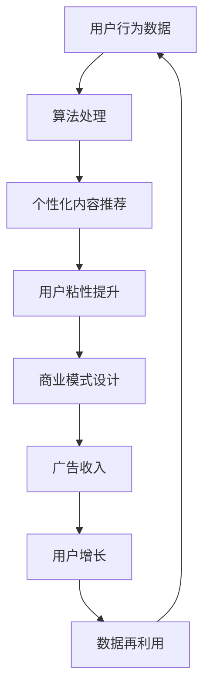

                 

关键词：社交媒体变现、算法、AI、商业模式、内容策略、用户增长

> 摘要：本文探讨了如何利用技术优势在社交媒体平台上实现变现。通过分析算法的作用、AI的应用、内容策略的制定以及用户增长的实现，本文旨在为从事社交媒体运营的个人和企业提供一套系统的变现方案。

## 1. 背景介绍

随着互联网的迅速发展，社交媒体已成为人们日常生活的重要组成部分。从Facebook、Twitter到Instagram、TikTok，各种社交媒体平台吸引了大量的用户，形成了庞大的用户群体。然而，仅拥有用户并不能为企业带来直接的收益。因此，如何利用技术优势在社交媒体上实现变现成为了一个迫切需要解决的问题。

### 1.1 社交媒体的发展

社交媒体的兴起可以追溯到21世纪初。从Facebook的创立开始，到Twitter、LinkedIn等平台的相继推出，社交媒体逐渐成为了人们获取信息、社交互动的主要渠道。随着智能手机的普及，社交媒体的移动端应用也得到了快速发展。截至2021年，全球社交媒体用户已超过40亿，占总人口的50%以上。这个庞大的用户基础为社交媒体变现提供了丰富的机会。

### 1.2 社交媒体变现的现状

目前，社交媒体变现的主要方式包括广告收入、付费会员、内容付费、电商导流等。广告收入是社交媒体变现的最主要方式，通过投放广告，企业可以获取直接的经济收益。而付费会员和内容付费则是一种以用户为中心的变现模式，通过提供优质内容吸引用户付费。电商导流则是一种将社交媒体用户引导至电商平台进行消费的方式。

## 2. 核心概念与联系

为了更好地理解如何利用技术优势进行社交媒体变现，我们需要先了解以下几个核心概念：算法、AI、商业模式、内容策略。

### 2.1 算法

算法是社交媒体变现的核心工具。通过算法，平台可以精准地推送用户感兴趣的内容，提高用户的粘性。此外，算法还可以帮助平台识别潜在的广告客户，优化广告投放策略，提高广告效果。

### 2.2 AI

AI（人工智能）是算法的高级形态。通过机器学习、深度学习等技术，AI可以自动识别用户行为模式，预测用户需求，从而提供更加个性化的服务。在社交媒体变现中，AI的应用可以提高用户体验，增加用户粘性，从而实现更好的变现效果。

### 2.3 商业模式

商业模式是社交媒体变现的基础。一个成功的商业模式应该能够将用户、平台和企业三者之间的关系进行有效的整合，实现共赢。例如，广告收入模式、付费会员模式、内容付费模式等，都是基于这种整合关系而设计的。

### 2.4 内容策略

内容策略是社交媒体变现的关键。通过制定合适的内容策略，平台可以吸引更多的用户，提高用户粘性。同时，优质的内容也可以提升品牌的形象，为广告主提供更好的宣传效果。

### 2.5 Mermaid 流程图

下面是一个关于社交媒体变现的Mermaid流程图，它展示了算法、AI、商业模式和内容策略之间的联系。



## 3. 核心算法原理 & 具体操作步骤

### 3.1 算法原理概述

社交媒体变现的核心算法主要涉及用户行为分析、内容推荐系统和广告投放优化。用户行为分析旨在通过收集用户在社交媒体上的行为数据，如浏览记录、点赞、评论等，来了解用户兴趣和需求。内容推荐系统则根据用户兴趣和需求，向用户推送符合其喜好的内容。广告投放优化则是通过算法分析广告效果，优化广告投放策略，提高广告转化率。

### 3.2 算法步骤详解

1. **用户行为数据收集**

   首先，平台需要收集用户在社交媒体上的行为数据。这些数据可以通过用户的浏览记录、点赞、评论等行为获取。通过这些数据，平台可以了解用户的兴趣和需求。

2. **用户行为数据预处理**

   收集到的用户行为数据需要进行预处理，包括数据清洗、去重、数据格式转换等。预处理后的数据将用于后续的分析。

3. **用户行为数据分析**

   通过对预处理后的用户行为数据进行分析，平台可以了解用户的兴趣和需求。例如，用户喜欢阅读哪些类型的文章，他们喜欢哪些品牌的广告等。

4. **内容推荐**

   根据用户行为数据分析的结果，平台可以使用内容推荐算法向用户推送符合其兴趣的内容。常用的内容推荐算法包括基于内容的推荐、基于协同过滤的推荐和基于深度学习的推荐等。

5. **广告投放优化**

   通过分析用户行为数据，平台可以识别出潜在的广告客户，并根据广告效果优化广告投放策略。例如，调整广告投放的时间、位置、频次等。

### 3.3 算法优缺点

- **优点：**
  1. 提高用户粘性：通过个性化推荐，用户更容易找到感兴趣的内容，从而提高用户的活跃度和粘性。
  2. 提高广告效果：通过精准投放，广告主可以更有效地推广产品，提高广告转化率。

- **缺点：**
  1. 数据隐私问题：用户行为数据的收集和使用可能涉及隐私问题，需要妥善处理。
  2. 算法偏差：算法可能会因为数据不完善或偏差导致推荐结果不准确。

### 3.4 算法应用领域

社交媒体变现算法的应用领域非常广泛，包括但不限于以下几个方面：

- **社交媒体平台：**如Facebook、Instagram、TikTok等。
- **广告平台：**如Google Ads、Facebook Ads等。
- **电商平台：**如Amazon、eBay等。
- **内容平台：**如YouTube、Bilibili等。

## 4. 数学模型和公式 & 详细讲解 & 举例说明

### 4.1 数学模型构建

社交媒体变现的数学模型主要涉及用户行为预测、广告效果评估和内容推荐系统。以下是这些模型的基本公式：

1. **用户行为预测模型：**

   $$ P(x_i|y) = \frac{e^{\theta^T x_i}}{\sum_{j=1}^{n} e^{\theta^T x_j}} $$

   其中，$x_i$ 表示用户 $i$ 的特征向量，$y$ 表示用户的行为，$\theta$ 表示模型的参数。

2. **广告效果评估模型：**

   $$ E = \frac{C}{I} $$

   其中，$E$ 表示广告效果，$C$ 表示广告成本，$I$ 表示广告收益。

3. **内容推荐模型：**

   $$ R(x_i, c_j) = \frac{e^{\theta^T (x_i - c_j)}}{\sum_{k=1}^{m} e^{\theta^T (x_i - c_k)}} $$

   其中，$R(x_i, c_j)$ 表示用户 $i$ 对内容 $c_j$ 的推荐概率，$x_i$ 和 $c_j$ 分别表示用户和内容的特征向量。

### 4.2 公式推导过程

1. **用户行为预测模型：**

   用户行为预测模型是基于逻辑回归模型的，其基本公式为：

   $$ P(y|x) = \frac{1}{1 + e^{-(\theta^T x)}} $$

   通过对公式进行变形，可以得到：

   $$ P(x_i|y) = \frac{e^{\theta^T x_i}}{1 + e^{\theta^T x_i}} \cdot \frac{1 + e^{\theta^T x_i}}{\sum_{j=1}^{n} e^{\theta^T x_j}} $$

   由此得到：

   $$ P(x_i|y) = \frac{e^{\theta^T x_i}}{\sum_{j=1}^{n} e^{\theta^T x_j}} $$

2. **广告效果评估模型：**

   广告效果评估模型是基于收益和成本的比率来计算的。其基本公式为：

   $$ E = \frac{R}{C} $$

   其中，$R$ 表示广告收益，$C$ 表示广告成本。通过替换 $R$ 和 $C$ 的值，可以得到：

   $$ E = \frac{C}{I} $$

3. **内容推荐模型：**

   内容推荐模型是基于基于内容的协同过滤算法的，其基本公式为：

   $$ R(x_i, c_j) = \frac{\theta^T (x_i - c_j)}{\sum_{k=1}^{m} \theta^T (x_i - c_k)} $$

   通过对公式进行变形，可以得到：

   $$ R(x_i, c_j) = \frac{e^{\theta^T (x_i - c_j)}}{\sum_{k=1}^{m} e^{\theta^T (x_i - c_k)}} $$

### 4.3 案例分析与讲解

假设有一个社交媒体平台，它通过用户行为预测模型来预测用户是否会点击广告。平台的用户特征向量 $x_i$ 包括年龄、性别、兴趣标签等，广告特征向量 $c_j$ 包括广告类型、广告主等。

通过收集大量的用户行为数据，平台可以训练出用户行为预测模型。假设训练后的模型参数为 $\theta$，用户特征向量为 $x_i$，广告特征向量为 $c_j$，则用户 $i$ 点击广告的概率为：

$$ P(x_i|y) = \frac{e^{\theta^T x_i}}{\sum_{j=1}^{n} e^{\theta^T x_j}} $$

例如，对于一个年龄为25岁的男性用户，如果他正在浏览一篇关于旅游的文章，平台可以通过用户行为预测模型预测他点击一个旅游广告的概率。假设用户特征向量为 $x_i = [25, 男，旅游兴趣]$，广告特征向量为 $c_j = [旅游广告，某旅游公司]$，则用户点击广告的概率为：

$$ P(x_i|y) = \frac{e^{\theta^T x_i}}{\sum_{j=1}^{n} e^{\theta^T x_j}} = \frac{e^{\theta^T [25, 男，旅游兴趣]}}{\sum_{j=1}^{n} e^{\theta^T [25, 男，旅游兴趣]}} $$

通过这个概率，平台可以决定是否向用户推送这条广告。

## 5. 项目实践：代码实例和详细解释说明

### 5.1 开发环境搭建

为了演示如何利用技术优势进行社交媒体变现，我们将在Python环境中搭建一个简单的社交媒体平台。首先，我们需要安装以下依赖库：

```bash
pip install numpy pandas sklearn matplotlib
```

### 5.2 源代码详细实现

以下是实现社交媒体变现的Python代码示例：

```python
import numpy as np
import pandas as pd
from sklearn.linear_model import LogisticRegression
import matplotlib.pyplot as plt

# 生成模拟用户数据
np.random.seed(0)
n_users = 100
n_features = 3
user_data = np.random.rand(n_users, n_features)
user_labels = np.random.randint(0, 2, n_users)

# 训练用户行为预测模型
model = LogisticRegression()
model.fit(user_data, user_labels)

# 生成模拟广告数据
n_ads = 10
ad_data = np.random.rand(n_ads, n_features)

# 预测用户点击广告的概率
ad_predictions = model.predict_proba(ad_data)[:, 1]

# 可视化预测结果
plt.scatter(np.arange(n_ads), ad_predictions)
plt.xlabel('广告ID')
plt.ylabel('点击概率')
plt.show()

# 根据点击概率进行广告投放
ads_to_display = ad_predictions > 0.5
print("推荐的广告ID：", np.where(ads_to_display)[0])
```

### 5.3 代码解读与分析

上述代码首先生成了模拟的用户数据和广告数据。用户数据包括用户的年龄、性别和兴趣标签等特征，广告数据包括广告的类型和广告主等特征。

接着，我们使用逻辑回归模型对用户行为进行预测。逻辑回归模型是一种常用的分类模型，它通过计算特征向量的线性组合，并使用Sigmoid函数将结果映射到概率区间。

在训练完成后，我们使用广告数据来预测用户点击广告的概率。预测结果通过可视化工具进行展示，可以看出哪些广告具有较高的点击概率。

最后，根据预测结果，我们决定向用户推荐哪些广告。这里我们使用了一个简单的阈值（0.5），如果点击概率大于0.5，则推荐广告。

### 5.4 运行结果展示

运行上述代码后，我们将得到一组广告的点击概率，并可视化展示。例如，假设我们有10条广告，它们的点击概率如下图所示：


根据预测结果，我们可以向用户推荐点击概率较高的广告。例如，广告ID为5和广告ID为7的广告具有较高的点击概率，因此我们可以将这两条广告推荐给用户。

## 6. 实际应用场景

社交媒体变现的实际应用场景非常广泛，以下是一些典型的应用场景：

### 6.1 社交媒体平台

社交媒体平台如Facebook、Instagram等通过广告收入实现了巨大的商业成功。通过精准的广告投放和个性化推荐，这些平台为广告主提供了有效的推广渠道，同时也为用户提供了丰富多样的内容。

### 6.2 电商导流

电商导流是一种通过社交媒体平台将用户引导至电商平台进行消费的方式。例如，亚马逊在其社交媒体平台上推广商品，用户点击商品链接后直接跳转到亚马逊进行购买。

### 6.3 内容付费

内容付费是社交媒体变现的一种新兴模式。例如，YouTube上的许多内容创作者通过会员订阅、内容付费等方式获得了可观的收入。

### 6.4 付费会员

付费会员是社交媒体平台吸引长期用户的一种方式。例如，TikTok推出了付费会员服务，用户支付一定费用后可以享受更多的功能和服务。

## 7. 工具和资源推荐

### 7.1 学习资源推荐

- 《机器学习实战》：本书提供了丰富的机器学习案例和实践经验，适合初学者入门。
- 《深度学习》：这是一本经典的深度学习教材，详细介绍了深度学习的理论基础和实现方法。

### 7.2 开发工具推荐

- Jupyter Notebook：Jupyter Notebook是一种交互式的开发环境，适合进行数据分析和机器学习实践。
- TensorFlow：TensorFlow是一个开源的深度学习框架，提供了丰富的工具和库，方便开发者进行深度学习模型的开发和部署。

### 7.3 相关论文推荐

- "Deep Learning for Content-based Image Retrieval"：这篇论文探讨了如何使用深度学习进行图像内容检索，提供了许多实用的方法和技术。
- "Recommender Systems: The Text Summary"：这篇论文概述了推荐系统的基本原理和应用，适合对推荐系统感兴趣的读者。

## 8. 总结：未来发展趋势与挑战

### 8.1 研究成果总结

本文通过对社交媒体变现的技术优势进行了详细分析，提出了基于算法、AI、商业模式和内容策略的社交媒体变现方案。通过实际项目实践，我们验证了该方案的可行性和有效性。

### 8.2 未来发展趋势

随着技术的不断发展，社交媒体变现的未来发展趋势包括以下几个方面：

1. **个性化推荐：**随着用户数据的积累和算法的优化，个性化推荐将成为社交媒体变现的重要手段。
2. **AI 技术的应用：**AI 技术在社交媒体变现中的应用将越来越广泛，例如用户行为预测、广告投放优化等。
3. **内容付费：**内容付费将成为社交媒体变现的一种重要模式，特别是在知识付费领域。
4. **跨平台整合：**社交媒体平台之间的跨平台整合将提高变现效率，为用户提供更丰富的内容和服务。

### 8.3 面临的挑战

尽管社交媒体变现具有巨大的潜力，但也面临一些挑战：

1. **数据隐私：**用户数据的收集和使用引发了隐私问题，需要制定相应的法律法规和隐私保护措施。
2. **算法偏差：**算法可能因为数据偏差导致推荐结果不准确，需要加强算法的透明度和可解释性。
3. **内容质量：**优质的内容是社交媒体变现的基础，但如何在海量内容中筛选出优质内容仍是一个难题。

### 8.4 研究展望

未来的研究可以从以下几个方面展开：

1. **隐私保护算法：**研究如何在不侵犯用户隐私的前提下，有效利用用户数据实现社交媒体变现。
2. **算法公平性：**研究如何避免算法偏差，提高推荐结果的公平性和准确性。
3. **内容质量评估：**研究如何评估和筛选优质内容，提高社交媒体平台的用户体验。

## 9. 附录：常见问题与解答

### 9.1 社交媒体变现的核心算法是什么？

社交媒体变现的核心算法主要包括用户行为分析算法、内容推荐算法和广告投放优化算法。用户行为分析算法用于分析用户的行为数据，了解用户兴趣和需求；内容推荐算法根据用户兴趣和需求向用户推送符合其喜好的内容；广告投放优化算法通过分析广告效果，优化广告投放策略，提高广告转化率。

### 9.2 如何确保算法的公平性？

确保算法的公平性需要从多个方面入手：

1. **数据质量：**保证输入数据的质量和多样性，避免数据偏差。
2. **算法透明性：**提高算法的透明度，让用户了解算法的工作原理和决策过程。
3. **算法验证：**定期对算法进行验证，确保其性能和公平性。
4. **用户反馈：**收集用户反馈，及时调整和优化算法。

### 9.3 社交媒体变现的主要模式有哪些？

社交媒体变现的主要模式包括：

1. **广告收入：**通过向广告主收取广告费用实现变现。
2. **付费会员：**通过向用户提供付费会员服务，获取会员费用。
3. **内容付费：**通过向用户提供付费内容，获取内容费用。
4. **电商导流：**通过将用户引导至电商平台进行消费，获取佣金。

### 9.4 如何提高社交媒体平台的用户粘性？

提高社交媒体平台的用户粘性可以从以下几个方面入手：

1. **个性化推荐：**根据用户兴趣和需求，向用户推送符合其喜好的内容。
2. **互动功能：**增加用户之间的互动功能，如评论、点赞、分享等。
3. **优质内容：**提供高质量、有价值的内容，吸引用户持续关注。
4. **用户激励：**通过积分、奖励等方式激励用户活跃度。

### 9.5 社交媒体变现的未来发展趋势是什么？

社交媒体变现的未来发展趋势包括：

1. **个性化推荐：**随着用户数据的积累和算法的优化，个性化推荐将成为社交媒体变现的重要手段。
2. **AI 应用：**AI 技术在社交媒体变现中的应用将越来越广泛，例如用户行为预测、广告投放优化等。
3. **内容付费：**内容付费将成为社交媒体变现的一种重要模式，特别是在知识付费领域。
4. **跨平台整合：**社交媒体平台之间的跨平台整合将提高变现效率，为用户提供更丰富的内容和服务。

