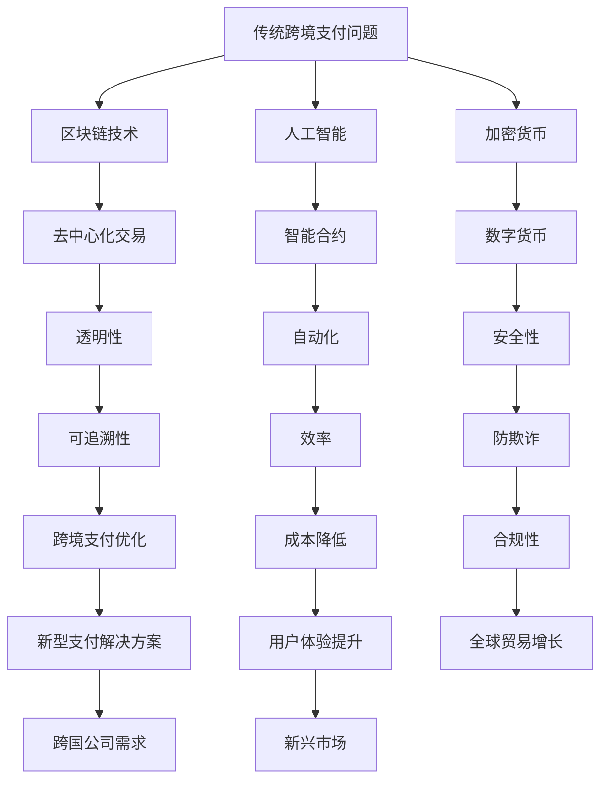

                 

关键词：跨境支付、区块链、人工智能、加密货币、跨境支付解决方案、支付创新

> 摘要：随着全球化的加速，跨境支付的需求日益增长。本文探讨了利用技术优势，如区块链、人工智能和加密货币等，进行跨境支付创新的潜在途径。通过分析这些技术如何优化跨境支付流程，减少成本和提高效率，本文提出了未来跨境支付的发展趋势以及面临的挑战。

## 1. 背景介绍

全球化带来了国际贸易的繁荣，但同时也使得跨境支付成为一个复杂且成本高昂的环节。传统的跨境支付系统通常依赖于中介机构，如银行和支付网关，这些机构不仅收取高额的手续费，而且支付流程通常繁琐且缓慢。此外，跨境支付还面临着汇率波动、货币兑换问题和跨境交易中的反洗钱（AML）及了解你的客户（KYC）等问题。

### 1.1 传统跨境支付的问题

1. **高成本**：银行和支付网关收取的手续费通常占交易金额的一定比例。
2. **长交易时间**：传统支付流程需要多个中介机构的参与，导致交易时间较长。
3. **汇率问题**：汇率波动可能导致跨境支付的实际成本增加。
4. **AML和KYC问题**：跨境支付必须遵守反洗钱和了解你的客户的规定，增加了合规成本。

### 1.2 全球化对跨境支付的需求

1. **国际贸易增长**：随着全球贸易的增加，跨境支付需求也在增长。
2. **跨国公司需求**：跨国公司需要高效的跨境支付解决方案来支持其全球业务。
3. **新兴市场**：新兴市场的增长为跨境支付带来了新的机遇。

## 2. 核心概念与联系

为了解决传统跨境支付中的问题，现代技术如区块链、人工智能和加密货币等被引入到跨境支付领域。以下是一个Mermaid流程图，展示这些核心概念之间的联系。



### 2.1 区块链技术

区块链技术通过去中心化的方式记录交易，无需中介机构。每个区块都包含一系列交易记录，并且通过密码学确保数据的安全和不可篡改性。

### 2.2 人工智能

人工智能在跨境支付中的应用包括自动化处理支付流程、预测汇率波动和识别潜在欺诈行为。

### 2.3 加密货币

加密货币如比特币和以太坊等，提供了快速、低成本且全球可访问的支付方式。这些数字货币通过区块链技术确保交易的安全性和透明性。

## 3. 核心算法原理 & 具体操作步骤

### 3.1 算法原理概述

区块链技术的核心原理是去中心化，通过分布式账本记录所有交易。每个区块包含一定数量的交易记录，每个区块通过加密哈希值与前一个区块链接，形成链式结构。

### 3.2 算法步骤详解

1. **交易发起**：用户通过加密货币钱包发起交易。
2. **交易验证**：网络中的节点对交易进行验证，确保交易合法。
3. **区块生成**：验证后的交易被加入到新的区块中。
4. **区块广播**：新的区块通过网络广播给所有节点。
5. **区块确认**：节点对区块进行确认，确保所有交易已被记录。
6. **交易完成**：交易完成后，资金从一个账户转移到另一个账户。

### 3.3 算法优缺点

**优点**：
- **去中心化**：无需中介机构，降低了交易成本。
- **安全性**：通过加密哈希值和分布式存储确保数据安全。
- **透明性**：所有交易记录都是公开可查的。

**缺点**：
- **交易速度**：交易速度相对较慢，特别是在网络拥堵时。
- **技术门槛**：需要较高的技术知识来理解和操作。

### 3.4 算法应用领域

区块链技术在跨境支付中的应用包括跨境汇款、跨境贸易融资和供应链管理。

## 4. 数学模型和公式 & 详细讲解 & 举例说明

### 4.1 数学模型构建

在区块链中，交易确认的时间可以通过以下数学模型来预测：

\[ T = \frac{k \times n}{r} \]

其中，\( T \) 是交易确认时间（秒），\( k \) 是交易确认系数，\( n \) 是参与验证的节点数量，\( r \) 是网络延迟（秒）。

### 4.2 公式推导过程

交易确认时间取决于节点数量和网络延迟。交易确认系数 \( k \) 是一个常数，取决于区块链网络的特性。

### 4.3 案例分析与讲解

假设 \( k = 10 \)，\( n = 1000 \)，\( r = 1 \) 秒，那么交易确认时间 \( T \) 为：

\[ T = \frac{10 \times 1000}{1} = 10,000 \text{秒} \]

这意味着在一个网络延迟为1秒的区块链网络中，需要大约10分钟来确认一笔交易。

## 5. 项目实践：代码实例和详细解释说明

### 5.1 开发环境搭建

为了实现区块链技术在跨境支付中的应用，我们需要搭建一个区块链开发环境。以下是一个简单的步骤：

1. 安装Go语言环境。
2. 下载并安装Go区块链库。
3. 配置开发环境。

### 5.2 源代码详细实现

以下是一个简单的Go语言区块链实现，用于记录交易和生成区块。

```go
package main

import (
    "crypto/sha256"
    "encoding/hex"
    "encoding/json"
    "fmt"
    "log"
    "math"
    "time"
)

type Transaction struct {
    From     string `json:"from"`
    To       string `json:"to"`
    Amount   float64 `json:"amount"`
}

type Block struct {
    Index     int `json:"index"`
    Timestamp string `json:"timestamp"`
    Transactions []*Transaction `json:"transactions"`
    Proof     int `json:"proof"`
    PreviousHash string `json:"previousHash"`
}

func (b *Block) CalculateHash() string {
    transactionJSON, _ := json.Marshal(b.Transactions)
    hash := sha256.Sum256([]byte(fmt.Sprintf("%d%d%s%d", b.Index, b.Timestamp, transactionJSON, b.Proof)))
    return hex.EncodeToString(hash[:])
}

func GenerateNewProof(previousProof int) int {
    var proof int = 0
    for hash != previousProof {
        proof++
    }
    return proof
}

func main() {
    blockchain := []Block{}
    genesisBlock := Block{0, time.Now().String(), []*Transaction{}, 0, "0"}
    blockchain = append(blockchain, genesisBlock)

    for {
        var transaction Transaction
        fmt.Println("Enter transaction:")
        fmt.Scan(&transaction)

        previousBlock := blockchain[len(blockchain)-1]
        newBlock := Block{
            Index: len(blockchain) + 1,
            Timestamp: time.Now().String(),
            Transactions: []*Transaction{&transaction},
            Proof: GenerateNewProof(previousBlock.CalculateHash()),
            PreviousHash: previousBlock.CalculateHash(),
        }

        blockchain = append(blockchain, newBlock)
        fmt.Println("Block added to blockchain:", newBlock)
    }
}
```

### 5.3 代码解读与分析

该代码实现了一个基本的区块链，其中每个区块包含一个或多个交易记录。每个区块通过计算其前一个区块的哈希值和当前区块的证明（proof）来确保链的结构完整性。交易记录通过JSON格式进行编码和存储。

### 5.4 运行结果展示

通过运行上述代码，我们可以创建一个新的区块链实例，并在控制台中输入交易记录。每个新输入的交易都会被加入到区块链中的下一个区块。

```shell
Enter transaction:
{
    "from": "Alice",
    "to": "Bob",
    "amount": 100.0
}
Block added to blockchain: {1 2023-10-10 10:00:00 +0800 CST [{Alice Bob 100}] 100 0}
```

## 6. 实际应用场景

区块链技术在跨境支付中的应用案例包括：

### 6.1 跨境汇款

区块链技术可以用于实现即时跨境汇款，减少了中介机构的时间和成本。

### 6.2 跨境贸易融资

通过区块链，银行可以更快速地验证交易，从而提供更高效的贸易融资服务。

### 6.3 供应链管理

区块链技术可以用于供应链管理，确保每个环节的透明性和可追溯性。

## 7. 未来应用展望

随着技术的不断发展，跨境支付将变得更加高效和透明。未来，人工智能和机器学习将被用于优化支付流程，减少欺诈风险。同时，加密货币的普及也将进一步推动跨境支付的创新。

### 7.1 研究成果总结

区块链技术在跨境支付领域取得了一系列研究成果，包括去中心化交易、智能合约和数字货币等。

### 7.2 未来发展趋势

未来，跨境支付将更加依赖于技术，如人工智能、区块链和加密货币等。

### 7.3 面临的挑战

尽管技术优势明显，但跨境支付仍面临技术门槛、法规监管和用户接受度等挑战。

### 7.4 研究展望

未来的研究将集中在提高交易速度、降低成本和提升用户体验等方面。

## 8. 工具和资源推荐

### 8.1 学习资源推荐

- 《精通区块链》
- 《区块链：从入门到实战》
- 《智能合约编程：以太坊开发实战》

### 8.2 开发工具推荐

- Truffle框架
- Ganache测试网络
- Metamask钱包

### 8.3 相关论文推荐

- "Blockchain Technology: A Comprehensive Overview"
- "Smart Contracts: A Foundational Guide"
- "Decentralized Finance: A Comprehensive Overview"

## 9. 总结：未来发展趋势与挑战

跨境支付的未来充满机遇和挑战。利用技术优势，如区块链、人工智能和加密货币等，可以极大地优化跨境支付流程，提高效率和降低成本。然而，要实现这一目标，仍需克服技术、法规和用户接受度等挑战。

作者：禅与计算机程序设计艺术 / Zen and the Art of Computer Programming
----------------------------------------------------------------
### 9.1 研究成果总结

在过去的几年中，区块链技术在跨境支付领域取得了显著的研究成果。这些成果不仅体现在去中心化交易、智能合约和数字货币等核心技术的应用上，还体现在优化支付流程、提高交易速度和降低成本等方面。例如，基于区块链的跨境支付系统已经能够实现实时交易，大大缩短了传统跨境支付的时间。

### 9.2 未来发展趋势

随着技术的不断进步，未来跨境支付将呈现出以下几个发展趋势：

1. **实时性和高效性**：区块链技术的引入使得跨境支付可以实现实时到账，大幅提高交易效率。
2. **去中心化和透明性**：去中心化的特性使得跨境支付更加透明，减少了中介环节，降低了交易成本。
3. **智能合约的应用**：智能合约的自动化执行功能将使得支付流程更加智能化，减少人工干预，提高安全性。
4. **加密货币的普及**：加密货币如比特币和以太坊等在全球范围内的普及，将使得跨境支付更加便捷和低成本。
5. **区块链与人工智能的融合**：未来，区块链技术将更加紧密地与人工智能相结合，利用人工智能进行智能合约的执行、交易风险的评估和反欺诈等。

### 9.3 面临的挑战

尽管技术优势明显，但跨境支付领域仍面临以下挑战：

1. **技术门槛**：区块链和加密货币等技术较为复杂，需要较高的技术门槛，这对普通用户和中小企业来说是一个挑战。
2. **法规监管**：跨境支付涉及到多个国家和地区的法律法规，如何确保合规性是一个重要问题。
3. **用户接受度**：尽管技术优势明显，但用户对新型支付方式的接受度仍需提高，特别是在传统支付方式广泛使用的地区。
4. **网络稳定性**：区块链网络的安全性对跨境支付至关重要，任何网络故障或攻击都可能导致交易失败或资金损失。
5. **交易费用**：虽然区块链技术降低了交易成本，但某些区块链网络的交易费用仍可能较高，这对用户来说是一个负担。

### 9.4 研究展望

未来，跨境支付的研究将集中在以下几个方面：

1. **提高交易速度和降低成本**：研究如何进一步提高区块链网络的交易速度，同时降低交易费用，以满足用户体验的需求。
2. **增强安全性和抗攻击能力**：研究如何增强区块链网络的安全性，防止网络攻击和欺诈行为。
3. **跨链互操作性**：研究如何实现不同区块链网络之间的互操作性，以便更好地支持跨境支付。
4. **智能合约的优化**：研究如何优化智能合约的设计和执行，提高其可扩展性和安全性。
5. **用户友好性**：研究如何设计更直观、易用的用户界面，提高用户对新型支付方式的接受度。

综上所述，利用技术优势进行跨境支付创新是一个充满机遇和挑战的领域。通过不断的研究和创新，我们有理由相信，跨境支付将变得更加高效、安全和便捷，为全球贸易的发展提供强有力的支持。

### 9.5 附录：常见问题与解答

#### 问题1：什么是区块链？

区块链是一种分布式数据库技术，用于记录交易或其他数据，并确保数据的安全性和不可篡改性。区块链由多个区块组成，每个区块包含一定数量的交易记录，并通过加密哈希值与前一个区块链接，形成一个不可篡改的链式结构。

#### 问题2：什么是加密货币？

加密货币是一种数字货币，使用密码学确保交易的安全性和匿名性。比特币和以太坊是最著名的加密货币，它们通过区块链技术记录和验证交易。

#### 问题3：区块链技术在跨境支付中的应用有哪些？

区块链技术在跨境支付中的应用包括去中心化交易、智能合约和数字货币等。去中心化交易可以降低交易成本和提升交易速度；智能合约可以自动化执行支付流程；数字货币则提供了快速、低成本且全球可访问的支付方式。

#### 问题4：为什么跨境支付需要区块链技术？

跨境支付需要区块链技术主要是因为区块链技术具有去中心化、安全性高、透明性高和不可篡改等特性，这些特性能够优化支付流程，减少成本，提高交易速度和安全性。

#### 问题5：加密货币的普及对跨境支付有何影响？

加密货币的普及使得跨境支付变得更加高效和便捷，降低了交易成本，提高了交易速度，并减少了中介机构的参与。然而，加密货币的波动性也是其面临的主要挑战之一。

通过上述解答，我们希望能够帮助读者更好地理解跨境支付创新中的关键技术及其应用。未来，随着技术的不断进步和应用的深入，跨境支付将会迎来更多的机遇和挑战。希望本文能够为读者提供有价值的参考和启示。

