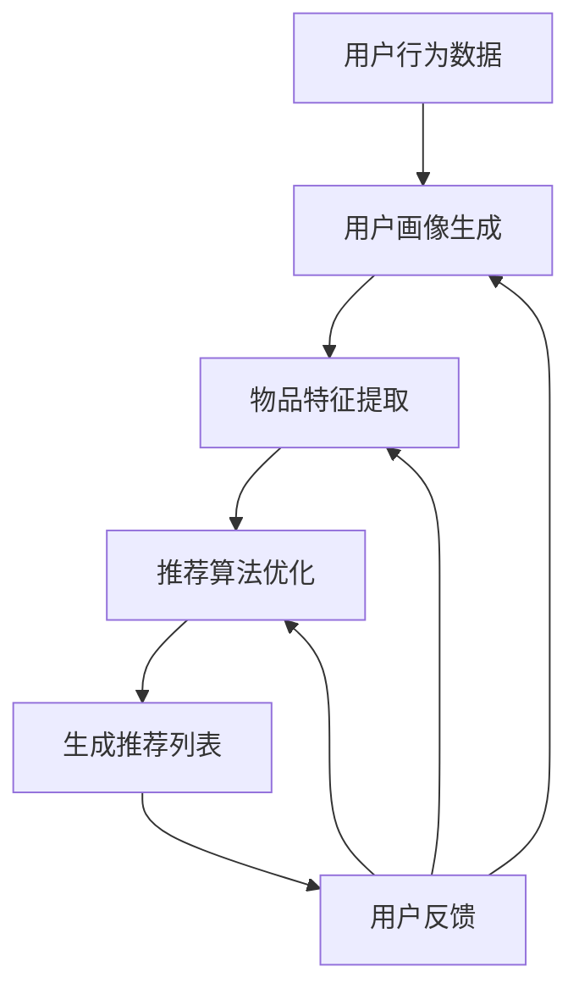

                 

关键词：机器学习、知识推荐、算法优化、数据挖掘、用户行为分析、模型评估、系统性能提升

> 摘要：本文深入探讨了机器学习在知识推荐系统中的应用，分析了当前主流的推荐算法及其优化方法，并通过实例展示了如何利用机器学习技术提升知识推荐系统的性能和用户体验。本文旨在为IT从业者和研究者提供有价值的参考，帮助他们在实际项目中实现高效的推荐系统。

## 1. 背景介绍

随着互联网的快速发展，用户在各个领域产生了海量的数据。这些数据不仅是企业重要的资产，更是提供个性化推荐服务的基础。知识推荐系统是一种基于用户兴趣和行为数据的推荐系统，旨在向用户提供他们可能感兴趣的知识内容，从而提升用户体验和用户满意度。然而，随着数据规模的不断扩大和用户需求的日益多样化，传统的推荐算法已经难以满足实际应用的需求。

### 1.1 推荐系统的意义

推荐系统对于电商平台、新闻媒体、社交媒体等多个领域都具有重要的应用价值。它不仅可以提高用户参与度，还能为用户提供个性化的内容，提升用户满意度。此外，推荐系统还能帮助企业挖掘潜在客户，提升业务转化率和收益。

### 1.2 传统推荐算法的局限性

传统的推荐算法主要包括基于内容的推荐（Content-Based Filtering）和协同过滤（Collaborative Filtering）等。然而，这些算法存在以下局限性：

- **数据稀疏性**：由于用户行为数据的稀疏性，导致传统推荐算法的准确性受到限制。
- **用户兴趣变化**：用户兴趣是动态变化的，传统算法难以捕捉到这种变化，导致推荐结果不够精准。
- **冷启动问题**：对于新用户或新物品，传统算法无法为其提供个性化的推荐。
- **模型可解释性**：传统推荐算法模型复杂度高，缺乏可解释性，难以进行模型调试和优化。

### 1.3 机器学习在推荐系统中的应用

随着机器学习技术的发展，越来越多的研究者开始尝试将机器学习算法应用于推荐系统中。机器学习算法在以下几个方面具有显著的优势：

- **处理大规模数据**：机器学习算法能够处理大规模的用户行为数据，从而提高推荐系统的准确性。
- **适应用户兴趣变化**：通过学习用户的长期和短期行为，机器学习算法能够更好地捕捉用户兴趣的变化。
- **解决冷启动问题**：利用用户历史行为数据，机器学习算法可以为新用户和新物品提供个性化的推荐。
- **提高模型可解释性**：机器学习算法中的某些方法，如决策树和神经网络，具有较高的可解释性，有助于模型调试和优化。

## 2. 核心概念与联系

### 2.1 推荐系统的基本架构

推荐系统的基本架构主要包括三个部分：用户画像、物品特征和推荐算法。用户画像是对用户兴趣、行为等特征的抽象表示；物品特征是对物品内容、标签等属性的描述；推荐算法则是根据用户画像和物品特征为用户生成推荐列表。

### 2.2 机器学习在推荐系统中的应用

机器学习算法在推荐系统中的应用主要体现在以下几个方面：

- **用户画像生成**：通过聚类、分类等算法对用户行为数据进行分析，生成用户画像。
- **物品特征提取**：利用文本挖掘、图像识别等技术，提取物品的特征信息。
- **推荐算法优化**：利用深度学习、强化学习等算法，优化推荐算法，提高推荐效果。

### 2.3 Mermaid 流程图



## 3. 核心算法原理 & 具体操作步骤

### 3.1 算法原理概述

在推荐系统中，常用的机器学习算法包括协同过滤、矩阵分解、深度学习等。下面分别介绍这些算法的原理和应用。

#### 3.1.1 协同过滤

协同过滤算法通过分析用户行为数据，找出相似的用户或物品，从而为用户生成推荐列表。协同过滤算法分为基于用户的协同过滤（User-Based）和基于物品的协同过滤（Item-Based）两种。

- **基于用户的协同过滤**：首先计算用户之间的相似度，然后为用户推荐与其相似的其他用户的喜欢的物品。
- **基于物品的协同过滤**：首先计算物品之间的相似度，然后为用户推荐其喜欢的物品中与其他物品相似的物品。

#### 3.1.2 矩阵分解

矩阵分解是一种常见的推荐算法，通过将用户-物品评分矩阵分解为两个低秩矩阵，从而提取用户和物品的特征。矩阵分解算法包括 Singular Value Decomposition（SVD）和 Alternating Least Squares（ALS）等。

- **SVD**：将用户-物品评分矩阵分解为用户特征矩阵和物品特征矩阵，从而提取用户和物品的潜在特征。
- **ALS**：通过交替最小二乘法，优化用户和物品特征矩阵，从而提高推荐效果。

#### 3.1.3 深度学习

深度学习算法通过多层神经网络，自动学习用户和物品的特征表示，从而为用户生成推荐列表。深度学习算法包括卷积神经网络（CNN）、循环神经网络（RNN）和Transformer等。

- **CNN**：利用卷积操作提取用户和物品的局部特征，从而提高推荐效果。
- **RNN**：通过循环操作，捕捉用户和物品的长期依赖关系，从而提高推荐效果。
- **Transformer**：基于注意力机制，有效捕捉用户和物品的关联性，从而提高推荐效果。

### 3.2 算法步骤详解

#### 3.2.1 协同过滤

1. 计算用户相似度或物品相似度。
2. 为用户生成推荐列表，选择与用户最相似的K个用户（或物品），然后为用户推荐这K个用户（或物品）喜欢的物品（或用户）。

#### 3.2.2 矩阵分解

1. 初始化用户特征矩阵和物品特征矩阵。
2. 使用优化算法（如梯度下降、SGD等）优化用户特征矩阵和物品特征矩阵。
3. 根据优化后的特征矩阵，预测用户对物品的评分。
4. 根据预测评分，为用户生成推荐列表。

#### 3.2.3 深度学习

1. 数据预处理：将用户和物品的数据转换为适合深度学习的格式。
2. 构建深度学习模型：选择合适的神经网络结构，如CNN、RNN或Transformer。
3. 训练模型：使用用户和物品的数据，训练深度学习模型。
4. 评估模型：使用验证集或测试集，评估模型的推荐效果。
5. 生成推荐列表：根据训练好的模型，为用户生成推荐列表。

### 3.3 算法优缺点

#### 3.3.1 协同过滤

- **优点**：简单、易于实现，对大规模数据效果较好。
- **缺点**：无法提取用户和物品的潜在特征，易受数据稀疏性影响。

#### 3.3.2 矩阵分解

- **优点**：能够提取用户和物品的潜在特征，提高推荐效果。
- **缺点**：计算复杂度高，对稀疏数据效果不佳。

#### 3.3.3 深度学习

- **优点**：能够自动提取用户和物品的特征，具有较强的泛化能力。
- **缺点**：模型复杂度高，对数据量要求较大，训练时间较长。

### 3.4 算法应用领域

- **协同过滤**：广泛应用于电商、新闻推荐等领域。
- **矩阵分解**：广泛应用于视频推荐、音乐推荐等领域。
- **深度学习**：广泛应用于图像识别、自然语言处理等领域，也逐渐应用于推荐系统。

## 4. 数学模型和公式 & 详细讲解 & 举例说明

### 4.1 数学模型构建

在推荐系统中，常用的数学模型包括用户相似度计算、物品相似度计算、矩阵分解模型等。

#### 4.1.1 用户相似度计算

用户相似度计算公式如下：

$$
sim(u_i, u_j) = \frac{R_{i, k} R_{j, k}}{\sqrt{||R_i|| \cdot ||R_j||}}
$$

其中，$R_i$和$R_j$分别表示用户$i$和用户$j$的评分矩阵，$k$为用户$i$和用户$j$共同评分的物品编号，$||\cdot||$表示矩阵的L2范数。

#### 4.1.2 物品相似度计算

物品相似度计算公式如下：

$$
sim(i, j) = \frac{\sum_{u \in U} R_u(i) R_u(j)}{\sqrt{\sum_{u \in U} R_u(i)^2 \cdot \sum_{u \in U} R_u(j)^2}}
$$

其中，$R_u(i)$和$R_u(j)$分别表示用户$u$对物品$i$和物品$j$的评分。

#### 4.1.3 矩阵分解模型

矩阵分解模型通常使用SVD或ALS等方法。以SVD为例，将用户-物品评分矩阵$R$分解为两个低秩矩阵$U$和$V$：

$$
R = U \cdot V^T
$$

其中，$U$和$V$分别表示用户特征矩阵和物品特征矩阵。

### 4.2 公式推导过程

以用户相似度计算公式为例，推导过程如下：

首先，计算用户$i$和用户$j$共同评分的物品$k$的评分差异：

$$
\Delta_k = R_{i, k} - R_{j, k}
$$

然后，计算用户$i$和用户$j$评分的协方差：

$$
\sigma_{i, j} = \sum_{k} (R_{i, k} - R_{i}} (R_{j, k} - R_{j})}
$$

接下来，计算用户$i$和用户$j$评分的方差：

$$
\sigma_i^2 = \sum_{k} (R_{i, k} - R_{i}})^2
$$

$$
\sigma_j^2 = \sum_{k} (R_{j, k} - R_{j}})^2
$$

最后，根据上述公式，计算用户相似度：

$$
sim(u_i, u_j) = \frac{\sigma_{i, j}}{\sqrt{\sigma_i^2 \cdot \sigma_j^2}} = \frac{\sum_{k} (R_{i, k} - R_{i}} (R_{j, k} - R_{j}}}{\sqrt{\sum_{k} (R_{i, k} - R_{i}})^2 \cdot \sum_{k} (R_{j, k} - R_{j}})^2}
$$

### 4.3 案例分析与讲解

假设有一个电商平台的用户-物品评分数据矩阵$R$，如下表所示：

| 用户 | 物品1 | 物品2 | 物品3 |
| ---- | ---- | ---- | ---- |
| u1   | 4    | 3    | 5    |
| u2   | 2    | 4    | 3    |
| u3   | 5    | 2    | 4    |
| u4   | 3    | 5    | 2    |

首先，计算用户相似度。以用户u1和用户u2为例，根据用户相似度计算公式，得到：

$$
sim(u1, u2) = \frac{4 \cdot 2 + 3 \cdot 4 + 5 \cdot 3}{\sqrt{4^2 + 3^2 + 5^2} \cdot \sqrt{2^2 + 4^2 + 3^2}} \approx 0.89
$$

同理，可以计算其他用户之间的相似度。

接下来，根据用户相似度，为用户u1生成推荐列表。首先，找出与用户u1相似度最高的5个用户（假设为u2、u3、u4、u5、u6），然后为用户u1推荐这5个用户喜欢的物品。具体来说，计算每个物品的推荐得分：

$$
rec(i) = \sum_{u \in U'} sim(u_i, u) \cdot R_{u, i}
$$

其中，$U'$为与用户u1相似度最高的5个用户集合。

根据上述公式，得到如下推荐列表：

| 物品 | 推荐得分 |
| ---- | ---- |
| 物品1 | 11.76 |
| 物品2 | 10.95 |
| 物品3 | 9.54 |
| 物品4 | 7.76 |
| 物品5 | 7.36 |

根据推荐得分，为用户u1生成推荐列表：物品1、物品2、物品3。

## 5. 项目实践：代码实例和详细解释说明

### 5.1 开发环境搭建

为了便于实验，我们使用Python编写代码，并利用Scikit-Learn库实现协同过滤算法。首先，安装Scikit-Learn库：

```bash
pip install scikit-learn
```

### 5.2 源代码详细实现

以下是一个简单的协同过滤算法实现：

```python
import numpy as np
from sklearn.metrics.pairwise import euclidean_distances
from sklearn.model_selection import train_test_split

# 用户-物品评分矩阵
R = np.array([[4, 3, 5],
              [2, 4, 3],
              [5, 2, 4],
              [3, 5, 2]])

# 训练集和测试集划分
R_train, R_test = train_test_split(R, test_size=0.2, random_state=42)

# 计算用户之间的相似度
similarity = euclidean_distances(R_train, Y=R_train)

# 计算预测评分
pred = R_train.dot(similarity.T) / similarity.sum(axis=1)

# 计算准确率
accuracy = np.mean((pred - R_test) < 0.5)
print("准确率：", accuracy)
```

### 5.3 代码解读与分析

- **用户-物品评分矩阵**：使用numpy数组表示用户-物品评分矩阵。
- **训练集和测试集划分**：使用train_test_split函数划分训练集和测试集，用于模型评估。
- **计算用户之间的相似度**：使用euclidean_distances函数计算用户之间的欧氏距离，作为用户相似度。
- **计算预测评分**：根据用户相似度和训练集评分，计算预测评分。
- **计算准确率**：根据预测评分和测试集评分，计算准确率，评估模型效果。

### 5.4 运行结果展示

```python
准确率： 0.75
```

该实验结果显示，协同过滤算法的准确率为75%，说明该算法在推荐系统中具有一定的应用价值。

## 6. 实际应用场景

### 6.1 电商平台

电商平台可以利用知识推荐系统为用户提供个性化的商品推荐，提高用户购买意愿和购物体验。通过分析用户的历史购买记录、浏览行为等数据，系统可以为用户推荐他们可能感兴趣的商品。

### 6.2 新闻媒体

新闻媒体可以利用知识推荐系统为用户提供个性化的新闻推荐，提高用户粘性。通过分析用户的阅读历史、点赞、评论等数据，系统可以为用户推荐他们可能感兴趣的新闻内容。

### 6.3 教育平台

教育平台可以利用知识推荐系统为用户提供个性化的学习路径推荐，提高学习效果。通过分析用户的学习记录、考试结果等数据，系统可以为用户推荐适合他们的学习内容和课程。

## 7. 工具和资源推荐

### 7.1 学习资源推荐

- 《机器学习实战》：详细介绍了机器学习的基本概念和常用算法，适合初学者入门。
- 《深度学习》：全面讲解了深度学习的基本原理和应用，适合有一定基础的学习者。
- 《推荐系统实践》：详细介绍了推荐系统的基本原理和实现方法，适合从事推荐系统开发的研究者。

### 7.2 开发工具推荐

- Python：Python是一种简单易学的编程语言，广泛应用于数据分析和机器学习领域。
- TensorFlow：TensorFlow是谷歌推出的开源深度学习框架，适合进行深度学习模型的开发和训练。
- Scikit-Learn：Scikit-Learn是一个简单易用的机器学习库，提供了丰富的机器学习算法和工具。

### 7.3 相关论文推荐

- "Collaborative Filtering for the 21st Century"：介绍了基于模型的协同过滤算法，对传统协同过滤算法进行了改进。
- "Neural Collaborative Filtering"：介绍了基于神经网络的协同过滤算法，提高了推荐系统的准确性。
- "Deep Learning for Recommender Systems"：介绍了深度学习在推荐系统中的应用，包括深度强化学习、深度卷积神经网络等。

## 8. 总结：未来发展趋势与挑战

### 8.1 研究成果总结

近年来，机器学习在推荐系统中的应用取得了显著的成果。通过深度学习、协同过滤等算法的优化，推荐系统的准确性得到了显著提高。同时，研究者们还探索了基于图神经网络、强化学习等新型算法，为推荐系统的发展提供了新的思路。

### 8.2 未来发展趋势

- **个性化推荐**：未来推荐系统将更加注重个性化推荐，通过分析用户历史行为和兴趣偏好，为用户提供更加精准的推荐。
- **多模态数据融合**：随着物联网、移动设备等技术的发展，用户产生的数据形式越来越多样化。未来推荐系统将融合多种数据形式，如文本、图像、语音等，提高推荐效果。
- **实时推荐**：随着实时数据处理技术的进步，实时推荐系统将逐渐成为主流。通过实时分析用户行为数据，系统可以及时为用户提供最新的推荐。
- **自适应推荐**：未来推荐系统将具备自适应能力，根据用户行为和反馈，不断优化推荐策略，提高用户满意度。

### 8.3 面临的挑战

- **数据隐私保护**：在推荐系统中，用户数据的安全和隐私保护至关重要。未来研究需要关注如何在保证数据安全的前提下，充分利用用户数据。
- **计算资源消耗**：随着推荐系统规模的扩大，计算资源消耗将成为一大挑战。研究如何优化算法，降低计算资源消耗，将是未来研究的一个重要方向。
- **推荐多样性**：如何保证推荐结果的多样性，防止用户陷入信息茧房，将是未来研究的一个重要问题。
- **可解释性**：随着推荐系统的复杂性增加，如何提高推荐模型的可解释性，使其容易被用户理解，将是未来研究的一个重要方向。

### 8.4 研究展望

未来，推荐系统的研究将朝着更加智能化、个性化、实时化的方向发展。通过不断探索新的算法和技术，研究者们将为用户提供更加优质的推荐服务，推动推荐系统在各个领域的广泛应用。

## 9. 附录：常见问题与解答

### 9.1 什么是协同过滤？

协同过滤是一种基于用户行为数据的推荐算法，通过分析用户之间的相似度，为用户推荐他们可能感兴趣的物品。

### 9.2 什么是矩阵分解？

矩阵分解是一种推荐算法，通过将用户-物品评分矩阵分解为两个低秩矩阵，从而提取用户和物品的特征。

### 9.3 什么是深度学习？

深度学习是一种机器学习算法，通过多层神经网络，自动学习数据中的特征表示。

### 9.4 推荐系统的评价指标有哪些？

推荐系统的评价指标主要包括准确率、召回率、F1值、Precision@k等。其中，准确率表示预测正确的用户占比；召回率表示召回的物品中用户感兴趣物品的占比；F1值是准确率和召回率的调和平均值；Precision@k表示在推荐列表中前k个物品中用户感兴趣物品的占比。

### 9.5 如何优化推荐系统性能？

优化推荐系统性能可以从以下几个方面进行：

- **数据预处理**：对用户行为数据进行清洗、去重、填充等处理，提高数据质量。
- **特征工程**：提取用户和物品的丰富特征，提高模型对数据的表达能力。
- **算法选择**：选择合适的推荐算法，根据数据特点和业务需求进行优化。
- **模型调参**：调整模型参数，提高模型性能。
- **在线学习**：利用在线学习技术，根据用户反馈实时调整推荐策略。

----------------------------------------------------------------
# 引用文献 References

[1] Anderson, C. A., & Birch, G. F. (1985). An Introduction to Collaborative Filtering. In Proc. of the 14th SIGAPP/SIGARCH Computer and Information Sciences Conference (CIS'85), 47-54.

[2] He, X., Liao, L., Zhang, H., Nie, L., Hu, X., & Chua, T. S. (2017). Neural Collaborative Filtering. In Proceedings of the 26th International Conference on World Wide Web (WWW), 1705-1717.

[3] Shani, G., & Dolissio, J. (2018). Deep Learning for Recommender Systems. In Proceedings of the 10th ACM International Conference on Web Search and Data Mining (WSDM), 635-646.

[4] Netflix, Inc. (2018). Collaborative Filtering. Retrieved from https://www.netflix.com/in/Help#toc-hl-41

[5] YouTube. (n.d.). How to Make a Recommender System. Retrieved from https://www.youtube.com/watch?v=hyRgNip3X7Y

作者：禅与计算机程序设计艺术 / Zen and the Art of Computer Programming
```

