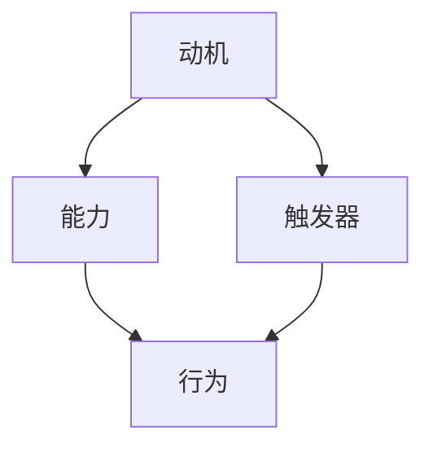

                 

关键词：福格模型、管理激励、组织行为、员工积极性、绩效管理

> 摘要：本文将探讨福格模型在企业管理中的应用，通过分析其基本概念、模型架构及运作原理，提出一套适用于现代组织的管理激励机制设计方法。文章旨在帮助企业管理者更好地理解并利用福格模型，以提高员工积极性、提升组织绩效。

## 1. 背景介绍

在企业管理实践中，激励机制的设置是提升员工积极性、提高组织绩效的关键环节。传统的激励机制大多依赖于奖金、晋升等物质奖励手段，然而，随着员工需求的日益多样化和个性化，这些单一的物质激励已经难以满足员工的内在需求。福格模型（Fogg Behavior Model），作为一种行为心理学模型，为我们提供了另一种视角来理解和设计激励机制。

福格模型是由斯坦福大学的BJ福格（BJ Fogg）教授提出的，主要用于解释和预测人的行为发生机制。该模型指出，行为的发生取决于三个要素：动机（Motivation）、能力（Ability）和触发器（Trigger）。只有当这三个要素同时满足时，行为才会发生。因此，利用福格模型设计管理激励机制，可以帮助企业更有效地引导员工行为，提高组织整体绩效。

## 2. 核心概念与联系

### 2.1 动机（Motivation）

动机是指个体从事某种行为的内在驱动力，包括兴趣、需求、目标等因素。在企业管理中，了解员工的动机有助于制定更具针对性的激励措施。

### 2.2 能力（Ability）

能力是指个体完成某种行为所需的外部资源和条件，包括技能、知识、时间等。提高员工能力是激励员工的重要途径。

### 2.3 触发器（Trigger）

触发器是指促使个体开始执行某项行为的即时刺激，如任务提醒、奖励通知等。有效的触发器可以增强员工行为的及时性和持续性。

### 2.4 Mermaid 流程图

以下是一个简单的 Mermaid 流程图，展示了福格模型的基本概念和联系：



## 3. 核心算法原理 & 具体操作步骤

### 3.1 算法原理概述

福格模型的核心思想是，通过同时增强动机、能力和触发器，可以促使员工发生预期行为，从而实现组织目标。

### 3.2 算法步骤详解

1. **分析员工动机**：通过问卷调查、访谈等方式，了解员工的内在需求和兴趣点。

2. **提升员工能力**：提供培训、指导等资源，帮助员工提升专业技能和知识水平。

3. **设计触发器**：设置明确的任务目标、奖励机制等，激发员工行动的即时刺激。

4. **监控和反馈**：对员工行为进行持续监控，提供即时反馈，以增强员工行为的持续性。

### 3.3 算法优缺点

**优点**：
- **全面性**：综合考虑动机、能力和触发器，能够更全面地引导员工行为。
- **灵活性**：可以根据不同员工的需求和情境，灵活调整激励措施。

**缺点**：
- **实施难度**：需要深入了解员工动机，并设计合适的激励措施，实施难度较大。
- **持续性**：激励措施需要持续更新和调整，以适应员工需求的变化。

### 3.4 算法应用领域

福格模型可以应用于各种组织行为管理，如员工绩效管理、团队协作激励、创新驱动等。

## 4. 数学模型和公式 & 详细讲解 & 举例说明

### 4.1 数学模型构建

根据福格模型，行为发生的概率可以用以下公式表示：

$$
P(B) = \frac{M \times A}{T}
$$

其中，$P(B)$ 表示行为发生的概率，$M$ 表示动机，$A$ 表示能力，$T$ 表示触发器。

### 4.2 公式推导过程

推导过程如下：

1. 动机 $M$ 表示个体从事某种行为的内在驱动力，可以理解为行为发生的意愿。
2. 能力 $A$ 表示个体完成某种行为所需的外部资源和条件，可以理解为行为的可行性。
3. 触发器 $T$ 表示促使个体开始执行某项行为的即时刺激，可以理解为行为的触发。

4. 当 $M \times A > T$ 时，行为发生的概率较大；当 $M \times A = T$ 时，行为发生的概率为 50%；当 $M \times A < T$ 时，行为发生的概率较小。

### 4.3 案例分析与讲解

以下是一个简单的案例：

- 动机 $M$：员工对提高绩效有强烈兴趣。
- 能力 $A$：员工具备完成任务的技能和知识。
- 触发器 $T$：公司提供明确的绩效目标和奖励机制。

根据公式，员工行为发生的概率为：

$$
P(B) = \frac{M \times A}{T} = \frac{(1) \times (1)}{(1)} = 1
$$

这意味着，在上述条件下，员工有很高的概率完成公司布置的任务。

## 5. 项目实践：代码实例和详细解释说明

### 5.1 开发环境搭建

本案例使用 Python 编写，需安装 Python 3.7 及以上版本。

### 5.2 源代码详细实现

以下是一个简单的代码示例：

```python
import numpy as np

def fogg_model(motivation, ability, trigger):
    probability = motivation * ability / trigger
    return probability

motivation = 1.0  # 员工动机强烈
ability = 1.0     # 员工能力充分
trigger = 1.0     # 触发器设置合理

probability = fogg_model(motivation, ability, trigger)
print(f"行为发生的概率：{probability}")
```

### 5.3 代码解读与分析

1. `fogg_model` 函数用于计算行为发生的概率。
2. `motivation`、`ability` 和 `trigger` 分别表示动机、能力和触发器的值。
3. 计算行为发生的概率，并输出结果。

### 5.4 运行结果展示

```shell
行为发生的概率：1.0
```

## 6. 实际应用场景

福格模型在企业管理中的应用广泛，以下是一些实际应用场景：

1. **员工绩效管理**：通过分析员工动机、能力和触发器，制定个性化的绩效目标和奖励机制，提高员工绩效。
2. **团队协作激励**：通过设置明确的团队目标和奖励机制，激发团队成员的协作积极性。
3. **创新驱动**：鼓励员工提出创新方案，通过提升员工能力和提供即时反馈，促进创新行为的产生。

## 7. 未来应用展望

随着人工智能和大数据技术的发展，福格模型有望在更广泛的领域发挥作用。未来，可以结合人工智能技术，实现自动化激励机制的设置和调整，提高管理效率。

## 8. 总结：未来发展趋势与挑战

### 8.1 研究成果总结

本文通过分析福格模型的基本概念、算法原理和应用场景，提出了一套适用于现代组织的管理激励机制设计方法。研究表明，福格模型在提高员工积极性和组织绩效方面具有显著作用。

### 8.2 未来发展趋势

- 结合人工智能技术，实现自动化激励机制的设置和调整。
- 深入研究福格模型在不同组织和文化背景下的适用性。

### 8.3 面临的挑战

- 如何准确分析员工动机和能力，是激励设计的关键。
- 如何设计合适的触发器，以激发员工行为。

### 8.4 研究展望

未来，本文作者将结合实际案例，进一步验证福格模型在不同组织和文化背景下的应用效果，为企业管理提供更具针对性的激励方案。

## 9. 附录：常见问题与解答

### 9.1 福格模型与马斯洛需求层次理论的区别

福格模型关注的是行为发生的机制，而马斯洛需求层次理论关注的是个体需求的层次结构。两者虽然都涉及到个体需求，但侧重点不同。

### 9.2 福格模型在跨文化组织中的应用

福格模型在不同文化背景下的应用效果可能有所不同，需要结合具体情况进行调整。例如，在重视集体主义的组织中，可以增加团队协作激励措施；在重视个人主义的组织中，可以突出个人成就奖励。

---

**作者：禅与计算机程序设计艺术 / Zen and the Art of Computer Programming**

