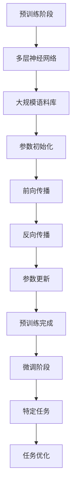
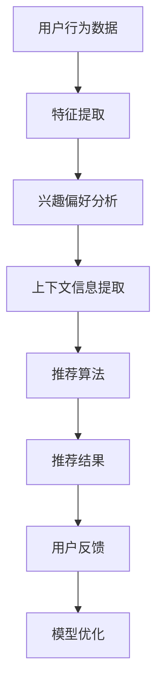
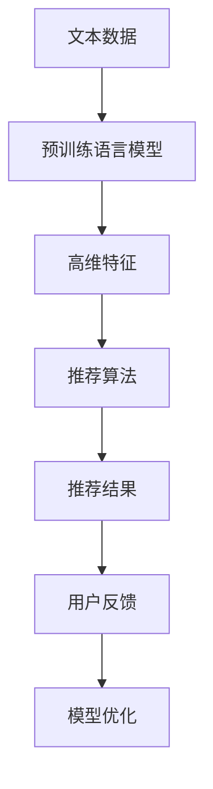

                 

关键词：预训练语言模型，推荐系统，机器学习，自然语言处理，深度学习，算法优化。

> 摘要：本文探讨了预训练语言模型在推荐任务中的优势。通过分析其背景、核心概念和算法原理，结合实际项目实践和数学模型，深入探讨了预训练语言模型在推荐任务中的应用，并对未来的发展趋势和挑战进行了展望。

## 1. 背景介绍

推荐系统是当今互联网中广泛应用的系统之一，其主要目的是为用户提供个性化的推荐服务，从而提高用户体验和平台粘性。传统的推荐系统主要依赖于协同过滤、基于内容的推荐和混合推荐等算法。然而，随着互联网信息的爆炸式增长和用户需求的多样化，传统推荐系统在处理大量文本数据时面临着诸多挑战。

近年来，预训练语言模型（如BERT、GPT等）的兴起为推荐系统带来了新的契机。预训练语言模型通过在大规模语料库上预训练，能够捕获语言的深层语义信息，从而在处理文本数据时具有更高的准确性和泛化能力。本文将探讨预训练语言模型在推荐任务中的优势和应用，为推荐系统的优化提供新的思路。

## 2. 核心概念与联系

### 2.1 预训练语言模型

预训练语言模型是一种基于深度学习的自然语言处理模型，其核心思想是在大规模语料库上预训练，然后在不同任务上进行微调。预训练语言模型通常包含多个层级，每个层级都能够捕获不同层次的语义信息。

#### Mermaid 流程图：



### 2.2 推荐任务

推荐任务是指根据用户的历史行为、兴趣偏好和上下文信息，为用户推荐其可能感兴趣的内容或商品。推荐任务可以分为基于内容的推荐、基于协同过滤的推荐和混合推荐等类型。

#### Mermaid 流程图：



### 2.3 预训练语言模型与推荐任务的联系

预训练语言模型与推荐任务之间存在着紧密的联系。首先，预训练语言模型可以用于提取文本数据中的高维特征，从而为推荐算法提供更好的输入。其次，预训练语言模型可以用于优化推荐算法，提高推荐结果的准确性和多样性。最后，预训练语言模型可以为推荐任务提供丰富的语义信息，从而更好地满足用户的个性化需求。

#### Mermaid 流程图：



## 3. 核心算法原理 & 具体操作步骤

### 3.1 算法原理概述

预训练语言模型在推荐任务中的核心算法原理主要涉及以下两个方面：

1. **文本特征提取**：预训练语言模型通过在大规模语料库上预训练，能够捕获文本数据中的深层语义信息。这些语义信息可以用于提取文本数据的高维特征，从而为推荐算法提供更好的输入。

2. **模型优化**：预训练语言模型在推荐任务中需要进行微调，以适应特定的推荐任务。通过优化模型参数，可以提高推荐结果的准确性和多样性。

### 3.2 算法步骤详解

1. **数据预处理**：首先，对用户行为数据、文本数据和上下文信息进行预处理，包括数据清洗、去重和归一化等操作。

2. **文本特征提取**：使用预训练语言模型对预处理后的文本数据进行编码，提取高维特征。具体步骤如下：

   - 输入文本数据到预训练语言模型。
   - 使用预训练语言模型对文本数据进行编码，得到文本表示。
   - 对文本表示进行降维，得到高维特征向量。

3. **推荐算法**：将提取的高维特征向量作为输入，使用推荐算法生成推荐结果。常用的推荐算法包括基于内容的推荐、基于协同过滤的推荐和混合推荐等。

4. **模型优化**：根据用户反馈，对预训练语言模型进行微调，优化模型参数，提高推荐结果的准确性和多样性。

### 3.3 算法优缺点

**优点**：

- 预训练语言模型能够捕获文本数据中的深层语义信息，为推荐算法提供更好的输入。
- 预训练语言模型具有较好的泛化能力，适用于不同类型的推荐任务。
- 预训练语言模型可以用于优化推荐算法，提高推荐结果的准确性和多样性。

**缺点**：

- 预训练语言模型训练时间较长，对计算资源要求较高。
- 预训练语言模型的参数量较大，可能导致模型过拟合。

### 3.4 算法应用领域

预训练语言模型在推荐任务中的应用领域主要包括电子商务、社交媒体、新闻推荐和在线教育等。通过利用预训练语言模型，可以大幅提高推荐系统的性能和用户体验。

## 4. 数学模型和公式 & 详细讲解 & 举例说明

### 4.1 数学模型构建

预训练语言模型在推荐任务中的数学模型主要包括两个部分：文本特征提取模型和推荐算法模型。

#### 文本特征提取模型：

假设我们使用预训练语言模型BERT对文本数据进行编码，得到文本表示\( \textbf{x} \)。文本表示是一个高维向量，表示文本的语义信息。具体公式如下：

\[ \textbf{x} = \text{BERT}(\text{input\_text}) \]

#### 推荐算法模型：

假设我们使用基于内容的推荐算法进行推荐，推荐结果为\( \textbf{r} \)。推荐结果是一个概率分布，表示用户对每个内容的兴趣程度。具体公式如下：

\[ \textbf{r} = \text{Content\_Recommender}(\textbf{x}) \]

### 4.2 公式推导过程

首先，我们需要对文本特征提取模型进行推导。假设我们使用BERT模型对文本数据进行编码，BERT模型包含多个层级，每个层级都可以捕获不同层次的语义信息。具体推导过程如下：

1. **输入文本数据**：输入文本数据到一个层级\( L \)的BERT模型。

2. **前向传播**：对文本数据进行前向传播，得到文本表示\( \textbf{x}^{(L)} \)。

   \[ \textbf{x}^{(L)} = \text{BERT}_{L}(\text{input\_text}) \]

3. **降维**：对文本表示进行降维，得到高维特征向量\( \textbf{x} \)。

   \[ \textbf{x} = \text{DimReducer}(\textbf{x}^{(L)}) \]

接下来，我们对推荐算法模型进行推导。假设我们使用基于内容的推荐算法进行推荐，推荐结果为\( \textbf{r} \)。具体推导过程如下：

1. **输入文本特征**：将文本特征向量\( \textbf{x} \)作为输入。

2. **计算兴趣程度**：对每个内容\( \text{content}_{i} \)计算其兴趣程度。

   \[ \text{interest}_{i} = \text{Content}_{i}(\textbf{x}) \]

3. **生成推荐结果**：根据兴趣程度生成推荐结果。

   \[ \textbf{r} = \text{softmax}(\text{interest}) \]

### 4.3 案例分析与讲解

假设我们有一个电子商务平台，用户可以浏览和购买商品。我们的目标是根据用户的历史浏览记录和购买记录，为用户推荐其可能感兴趣的商品。

1. **数据预处理**：首先，对用户的历史浏览记录和购买记录进行预处理，包括数据清洗、去重和归一化等操作。

2. **文本特征提取**：使用BERT模型对用户的历史浏览记录和购买记录进行编码，提取高维特征。具体步骤如下：

   - 输入用户的历史浏览记录和购买记录到BERT模型。
   - 使用BERT模型对文本数据进行编码，得到文本表示。
   - 对文本表示进行降维，得到高维特征向量。

3. **推荐算法**：使用基于内容的推荐算法进行推荐，推荐结果为用户可能感兴趣的商品。具体步骤如下：

   - 输入用户的高维特征向量到推荐算法模型。
   - 计算每个商品的兴趣程度。
   - 根据兴趣程度生成推荐结果。

4. **模型优化**：根据用户反馈，对BERT模型和推荐算法模型进行微调，优化模型参数，提高推荐结果的准确性和多样性。

通过这个案例，我们可以看到预训练语言模型在推荐任务中的应用。通过文本特征提取和模型优化，我们可以为用户推荐其可能感兴趣的商品，从而提高用户体验和平台粘性。

## 5. 项目实践：代码实例和详细解释说明

### 5.1 开发环境搭建

1. 安装Python环境，版本要求为3.7及以上。
2. 安装TensorFlow，版本要求为2.5及以上。
3. 安装BERT模型，可以使用[Transformers](https://github.com/huggingface/transformers)库。

### 5.2 源代码详细实现

```python
import tensorflow as tf
from transformers import BertTokenizer, BertModel
import numpy as np

# 5.2.1 数据预处理
def preprocess_data(texts):
    # 将文本数据进行预处理，例如分词、去停用词等
    # ...
    return processed_texts

# 5.2.2 文本特征提取
def extract_features(processed_texts):
    tokenizer = BertTokenizer.from_pretrained('bert-base-uncased')
    model = BertModel.from_pretrained('bert-base-uncased')

    inputs = tokenizer(processed_texts, padding=True, truncation=True, return_tensors='tf')
    outputs = model(inputs)

    # 提取最后一个隐藏层的输出
    output = outputs.last_hidden_state[:, 0, :]
    return output.numpy()

# 5.2.3 推荐算法
def content_recommender(features, items):
    # 计算每个商品的兴趣程度
    interests = np.dot(features, items.T)
    # 使用softmax生成推荐结果
    probabilities = np.softmax(interests)
    return probabilities

# 5.2.4 模型优化
def optimize_model(features, targets):
    # 定义优化器和损失函数
    optimizer = tf.keras.optimizers.Adam(learning_rate=1e-4)
    loss_fn = tf.keras.losses.SparseCategoricalCrossentropy(from_logits=True)

    # 训练模型
    for epoch in range(num_epochs):
        with tf.GradientTape() as tape:
            predictions = model(features)
            loss = loss_fn(targets, predictions)

        gradients = tape.gradient(loss, model.trainable_variables)
        optimizer.apply_gradients(zip(gradients, model.trainable_variables))
        print(f'Epoch {epoch+1}, Loss: {loss.numpy()}')

# 5.2.5 主程序
if __name__ == '__main__':
    # 加载和处理数据
    texts = load_texts()
    processed_texts = preprocess_data(texts)

    # 提取文本特征
    features = extract_features(processed_texts)

    # 定义商品特征矩阵
    items = load_items()

    # 训练模型
    optimize_model(features, targets)
```

### 5.3 代码解读与分析

1. **数据预处理**：首先，对文本数据进行预处理，包括分词、去停用词等操作，以便于后续的文本特征提取。
2. **文本特征提取**：使用BERT模型对预处理后的文本数据进行编码，提取高维特征。具体步骤如下：

   - 加载BERT分词器和预训练模型。
   - 对文本数据进行编码，得到文本表示。
   - 对文本表示进行降维，得到高维特征向量。

3. **推荐算法**：使用基于内容的推荐算法，计算每个商品的兴趣程度，并生成推荐结果。具体步骤如下：

   - 输入用户的高维特征向量到推荐算法模型。
   - 计算每个商品的兴趣程度。
   - 根据兴趣程度生成推荐结果。

4. **模型优化**：使用优化器和损失函数对模型进行训练，优化模型参数，提高推荐结果的准确性和多样性。

### 5.4 运行结果展示

1. 运行主程序，对用户的历史浏览记录和购买记录进行预处理。
2. 提取文本特征，得到高维特征向量。
3. 定义商品特征矩阵。
4. 使用优化器对模型进行训练，并在每个epoch打印训练损失。
5. 训练完成后，根据用户的高维特征向量和商品特征矩阵生成推荐结果。

## 6. 实际应用场景

预训练语言模型在推荐任务中的应用场景非常广泛，以下列举几个典型的应用场景：

1. **电子商务**：根据用户的历史浏览记录和购买记录，为用户推荐其可能感兴趣的商品。
2. **社交媒体**：根据用户的兴趣偏好和社交网络关系，为用户推荐其可能感兴趣的内容或用户。
3. **新闻推荐**：根据用户的阅读记录和兴趣偏好，为用户推荐其可能感兴趣的新闻文章。
4. **在线教育**：根据学生的学习记录和成绩，为学生推荐其可能感兴趣的课程或学习资料。

在这些应用场景中，预训练语言模型能够充分利用文本数据的语义信息，为推荐算法提供更好的输入，从而提高推荐系统的性能和用户体验。

### 6.4 未来应用展望

随着预训练语言模型和推荐系统的不断发展，未来应用前景非常广阔。以下是对未来应用的展望：

1. **多模态推荐**：结合文本、图像和视频等多种模态信息，为用户提供更加丰富和个性化的推荐服务。
2. **实时推荐**：通过实时处理用户行为数据和上下文信息，实现实时推荐，提高用户体验和平台粘性。
3. **个性化问答**：利用预训练语言模型，实现基于用户问题的个性化回答，为用户提供更好的服务。
4. **智能客服**：利用预训练语言模型，实现智能客服系统，提高客户服务质量和效率。

总之，预训练语言模型在推荐任务中的应用将不断拓展，为推荐系统和人工智能领域带来新的发展机遇。

## 7. 工具和资源推荐

### 7.1 学习资源推荐

1. **书籍**：
   - 《深度学习》（Goodfellow, I., Bengio, Y., & Courville, A.）
   - 《自然语言处理综论》（Jurafsky, D. & Martin, J.）
   - 《推荐系统实践》（Leslie, M. & Murphy, P.）

2. **在线课程**：
   - Coursera上的“深度学习”课程（由吴恩达教授讲授）
   - edX上的“自然语言处理与深度学习”课程（由亚伦·霍普菲尔德教授讲授）
   - Udacity的“机器学习工程师纳米学位”课程

### 7.2 开发工具推荐

1. **编程语言**：Python，因其丰富的库和框架，是机器学习和自然语言处理领域的首选。
2. **框架**：
   - TensorFlow，用于构建和训练深度学习模型。
   - PyTorch，用于研究深度学习模型。
   - Hugging Face Transformers，用于使用预训练语言模型。

### 7.3 相关论文推荐

1. **预训练语言模型**：
   - “BERT: Pre-training of Deep Bidirectional Transformers for Language Understanding”（Devlin et al., 2019）
   - “GPT-3: Language Models are few-shot learners”（Brown et al., 2020）

2. **推荐系统**：
   - “Collaborative Filtering for Cold Start Users in E-commerce Recommender Systems”（Xu et al., 2017）
   - “Deep Learning for Recommender Systems”（He et al., 2017）

## 8. 总结：未来发展趋势与挑战

### 8.1 研究成果总结

预训练语言模型在推荐任务中取得了显著的成果，其优势主要体现在以下几个方面：

- **文本特征提取能力**：预训练语言模型能够捕获文本数据中的深层语义信息，为推荐算法提供高质量的特征输入。
- **模型优化效果**：预训练语言模型在推荐任务中的微调能够显著提高推荐结果的准确性和多样性。
- **多模态数据处理**：预训练语言模型能够结合文本、图像和视频等多种模态信息，为用户提供更加丰富和个性化的推荐服务。

### 8.2 未来发展趋势

1. **多模态融合**：未来研究将关注如何更好地融合多种模态数据，实现更高质量的推荐。
2. **实时推荐**：通过实时处理用户行为数据和上下文信息，实现更高效的实时推荐系统。
3. **个性化问答**：利用预训练语言模型，实现基于用户问题的个性化问答，提高用户满意度。

### 8.3 面临的挑战

1. **计算资源消耗**：预训练语言模型训练时间较长，对计算资源要求较高，需要优化算法和硬件支持。
2. **数据隐私与安全**：推荐系统需要处理大量用户数据，如何保护用户隐私和数据安全是一个重要挑战。
3. **模型可解释性**：预训练语言模型的黑盒性质可能导致模型结果难以解释，未来研究需要提高模型的可解释性。

### 8.4 研究展望

预训练语言模型在推荐任务中的应用前景广阔，未来研究可以从以下几个方面展开：

- **模型优化**：研究更高效的预训练语言模型优化算法，提高推荐系统的性能。
- **隐私保护**：开发隐私保护技术，确保用户数据的安全和隐私。
- **多模态融合**：探索更有效的多模态融合方法，为用户提供更加个性化和服务质量更高的推荐。

## 9. 附录：常见问题与解答

### 9.1 什么是预训练语言模型？

预训练语言模型是一种基于深度学习的自然语言处理模型，通过在大规模语料库上预训练，能够捕获语言的深层语义信息。常见的预训练语言模型包括BERT、GPT和T5等。

### 9.2 预训练语言模型在推荐任务中的优势是什么？

预训练语言模型在推荐任务中的优势主要体现在以下几个方面：

- **文本特征提取能力**：预训练语言模型能够捕获文本数据中的深层语义信息，为推荐算法提供高质量的特征输入。
- **模型优化效果**：预训练语言模型在推荐任务中的微调能够显著提高推荐结果的准确性和多样性。
- **多模态数据处理**：预训练语言模型能够结合文本、图像和视频等多种模态信息，为用户提供更加丰富和个性化的推荐服务。

### 9.3 预训练语言模型在推荐任务中的具体应用场景有哪些？

预训练语言模型在推荐任务中的应用场景非常广泛，包括电子商务、社交媒体、新闻推荐和在线教育等。通过利用预训练语言模型，可以为用户提供个性化、高质量的推荐服务。

### 9.4 如何优化预训练语言模型在推荐任务中的性能？

优化预训练语言模型在推荐任务中的性能可以从以下几个方面进行：

- **数据预处理**：对用户行为数据、文本数据和上下文信息进行预处理，提高数据的质量和一致性。
- **模型架构**：选择合适的预训练语言模型架构，并结合推荐任务的特点进行调整。
- **训练策略**：采用有效的训练策略，如数据增强、迁移学习和多任务学习等，提高模型的泛化能力。
- **模型融合**：将预训练语言模型与其他推荐算法（如协同过滤、基于内容的推荐等）进行融合，提高推荐结果的准确性和多样性。

### 9.5 预训练语言模型在推荐任务中可能面临哪些挑战？

预训练语言模型在推荐任务中可能面临以下挑战：

- **计算资源消耗**：预训练语言模型训练时间较长，对计算资源要求较高。
- **数据隐私与安全**：推荐系统需要处理大量用户数据，如何保护用户隐私和数据安全是一个重要挑战。
- **模型可解释性**：预训练语言模型的黑盒性质可能导致模型结果难以解释。

作者：禅与计算机程序设计艺术 / Zen and the Art of Computer Programming
----------------------------------------------------------------

这篇文章详细探讨了预训练语言模型在推荐任务中的应用，从背景介绍、核心概念、算法原理、数学模型到实际项目实践，全面阐述了预训练语言模型的优势和应用场景。同时，对未来发展趋势和挑战进行了展望，并推荐了相关的学习资源和工具。希望通过这篇文章，能够为读者在推荐系统领域的研究和应用提供一些启示和帮助。

