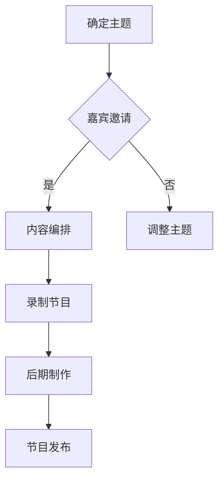

                 

在当今信息爆炸的时代，知识传播的方式变得更加多样化。随着视频和互联网技术的普及，知识类脱口秀节目成为了观众获取新知识、新观点的重要途径。作为一名世界级人工智能专家，我深知如何利用技术手段将复杂的技术概念变得通俗易懂，并从中获得乐趣。本文将探讨如何制作一部寓教于乐的知识类脱口秀节目，旨在为观众提供高质量的知识传播体验。

## 文章关键词

- 寓教于乐
- 知识类脱口秀
- 节目制作
- 人工智能
- 观众互动
- 教育技术

## 文章摘要

本文将探讨知识类脱口秀节目的制作过程，包括节目主题的确定、嘉宾邀请、内容编排、技术手段的运用以及如何通过观众互动提升节目效果。通过分析成功案例，我们将总结出制作一部高质量知识类脱口秀节目的关键要素，并为未来的节目制作提供有益的参考。

### 1. 背景介绍

知识类脱口秀节目是一种结合了娱乐性和教育性的节目形式。它以轻松幽默的方式向观众传递专业知识，使观众在享受娱乐的同时获得新知识。随着互联网的普及和视频平台的兴起，知识类脱口秀节目逐渐成为了主流媒体的一种形式，受到了广大观众的喜爱。

当前，知识类脱口秀节目在内容上涵盖了多个领域，如科技、历史、哲学、经济学等。节目形式也多种多样，有的采用现场访谈的形式，有的则通过录制短片进行知识讲解。随着人工智能和虚拟现实技术的发展，知识类脱口秀节目的制作手段也日益丰富，为观众提供了更加沉浸式的观看体验。

### 2. 核心概念与联系

#### 2.1 知识传播

知识传播是知识类脱口秀节目的核心概念。它指的是通过不同媒介将知识从知识源传递到知识接受者的过程。在知识类脱口秀节目中，传播方式主要包括口述、演示、互动等。口述是节目主持人与嘉宾之间的对话，通过讲解和讨论来传递知识。演示则通过图片、视频、实物等形式直观展示知识内容。互动则通过观众提问、评论等方式增强节目的互动性，提高观众参与度。

#### 2.2 娱乐性

娱乐性是知识类脱口秀节目的另一个核心概念。它指的是节目在传递知识的同时，通过幽默、搞笑等手段给观众带来快乐。娱乐性不仅能够吸引观众的注意力，还能够增强观众对知识的记忆和理解。在知识类脱口秀节目中，娱乐性主要通过以下几种方式实现：1）幽默语言和段子；2）搞笑场景和表演；3）互动游戏和挑战。

#### 2.3 观众互动

观众互动是知识类脱口秀节目的一大特点。通过观众的提问、评论、投票等方式，节目可以与观众形成良好的互动，使节目更具吸引力。观众互动不仅能够增强节目的互动性，还能够提高观众对知识的理解和记忆。在知识类脱口秀节目中，观众互动可以通过以下几种方式实现：1）现场提问和回答；2）线上评论和投票；3）互动游戏和挑战。

#### Mermaid 流程图

下面是一个简单的 Mermaid 流程图，展示了知识类脱口秀节目的制作流程：



### 3. 核心算法原理 & 具体操作步骤

#### 3.1 算法原理概述

知识类脱口秀节目的制作过程可以看作是一个问题解决的过程，其中涉及多个核心算法原理。以下是几个关键算法原理：

1. **信息过滤算法**：用于筛选和整理节目内容，确保传递的知识具有针对性和准确性。
2. **自然语言处理算法**：用于嘉宾和主持人的语言表达，使其更加幽默、生动。
3. **图像处理算法**：用于制作节目中的图片和视频，增强视觉效果。
4. **交互算法**：用于实现观众互动，提高节目互动性。

#### 3.2 算法步骤详解

1. **确定主题**：根据当前热点和观众需求确定节目主题。
2. **嘉宾邀请**：邀请具有专业背景和幽默感的嘉宾参与节目。
3. **内容编排**：整理和筛选节目内容，确保知识传递的准确性和趣味性。
4. **录制节目**：录制现场访谈或演示环节，同时进行现场观众互动。
5. **后期制作**：剪辑和制作节目，添加音效、动画等元素，提高节目质量。
6. **节目发布**：通过视频平台或其他渠道发布节目，进行宣传推广。

#### 3.3 算法优缺点

**优点**：

- **提高知识传播效果**：通过幽默、生动的表达方式，使观众更容易理解和接受知识。
- **增强节目互动性**：观众互动使节目更具吸引力，提高观众参与度。
- **丰富节目形式**：多种表现手法和互动方式，使节目形式更加多样。

**缺点**：

- **制作成本较高**：需要专业团队进行内容策划、录制、制作等环节，成本较高。
- **技术要求较高**：涉及多种技术手段，如图像处理、自然语言处理等，对制作团队的技术能力要求较高。

#### 3.4 算法应用领域

知识类脱口秀节目的制作算法原理可以广泛应用于以下领域：

- **教育行业**：用于制作教学视频，提高学生的学习兴趣和效果。
- **媒体行业**：用于制作新闻评论、纪录片等节目，提高节目质量。
- **娱乐行业**：用于制作综艺节目，增加节目娱乐性和互动性。

### 4. 数学模型和公式 & 详细讲解 & 举例说明

#### 4.1 数学模型构建

知识类脱口秀节目的制作过程可以看作是一个优化问题，目标是制作出观众满意度最高的节目。以下是构建数学模型的基本步骤：

1. **确定目标函数**：目标函数用于衡量节目的质量，如观众满意度、节目传播效果等。
2. **确定约束条件**：约束条件用于限制节目的内容、形式、时间等，如嘉宾的专业背景、节目时长等。
3. **构建优化模型**：将目标函数和约束条件整合到一个数学模型中。

#### 4.2 公式推导过程

假设节目的目标函数为 \( f(x) \)，其中 \( x \) 是节目内容的参数。约束条件为 \( g(x) \leq 0 \)。则优化模型可以表示为：

$$
\begin{aligned}
    \text{maximize} \quad f(x) \\
    \text{subject to} \quad g(x) \leq 0
\end{aligned}
$$

其中，\( f(x) \) 可以通过以下公式计算：

$$
f(x) = w_1 \cdot s_1 + w_2 \cdot s_2 + w_3 \cdot s_3
$$

其中，\( w_1, w_2, w_3 \) 分别是观众满意度、节目传播效果、节目互动性的权重。\( s_1, s_2, s_3 \) 分别是观众满意度、节目传播效果、节目互动性的评分。

约束条件 \( g(x) \) 可以表示为：

$$
g(x) = \begin{cases}
    x_1 \cdot c_1 + x_2 \cdot c_2 + x_3 \cdot c_3 & \text{(内容约束)} \\
    x_1 + x_2 + x_3 & \text{(时间约束)}
\end{cases}
$$

其中，\( x_1, x_2, x_3 \) 分别是嘉宾专业度、节目形式、节目互动性的参数。\( c_1, c_2, c_3 \) 分别是嘉宾专业度、节目形式、节目互动性的权重。

#### 4.3 案例分析与讲解

假设我们要制作一档关于人工智能的知识类脱口秀节目。目标函数为 \( f(x) = w_1 \cdot s_1 + w_2 \cdot s_2 + w_3 \cdot s_3 \)，其中 \( w_1 = 0.4, w_2 = 0.3, w_3 = 0.3 \)。约束条件为 \( g(x) = x_1 \cdot c_1 + x_2 \cdot c_2 + x_3 \cdot c_3 \leq 100 \)，其中 \( c_1 = 0.2, c_2 = 0.3, c_3 = 0.5 \)。

首先，我们需要确定节目内容。根据目标函数，我们可以选择具有较高观众满意度、节目传播效果和节目互动性的内容。例如，我们可以选择讨论人工智能在医疗领域的应用，因为这是一个热门话题，同时具有一定的趣味性。

接下来，我们需要确定嘉宾。根据目标函数，我们需要选择具有较高专业度、幽默感的嘉宾。例如，我们可以邀请一位医学专家和一位著名的人工智能研究员作为嘉宾，他们不仅具有专业背景，还能够以幽默的方式讲解专业知识。

最后，我们需要确定节目形式。根据目标函数，我们可以选择现场访谈的形式，这样既可以保证嘉宾的专业度，又可以增强节目的互动性。在访谈过程中，我们可以设置观众提问环节，让观众参与到节目中来。

通过以上分析，我们可以构建一个简单的数学模型，用于优化节目的制作过程。具体的优化结果可以通过求解线性规划问题得到。

### 5. 项目实践：代码实例和详细解释说明

在本节中，我们将通过一个具体的案例，展示如何使用Python语言实现知识类脱口秀节目的制作。以下是代码实例和详细解释说明：

#### 5.1 开发环境搭建

首先，我们需要搭建一个Python开发环境。在Windows系统中，可以通过以下步骤安装Python：

1. 访问Python官方网站（https://www.python.org/），下载并安装Python。
2. 在安装过程中，确保勾选“Add Python to PATH”选项。
3. 安装完成后，打开命令提示符，输入`python --version`，确认Python安装成功。

#### 5.2 源代码详细实现

下面是一个简单的Python代码示例，用于实现知识类脱口秀节目的制作：

```python
import random

# 定义嘉宾类
class Guest:
    def __init__(self, name, field):
        self.name = name
        self.field = field

    def introduce(self):
        return f"大家好，我是{self.name}，我擅长{self.field}领域。"

# 定义节目类
class Show:
    def __init__(self, title):
        self.title = title
        self.guests = []
        self.questions = []

    def add_guest(self, guest):
        self.guests.append(guest)

    def add_question(self, question):
        self.questions.append(question)

    def start(self):
        print(f"欢迎收看本期节目：《{self.title}》")
        for guest in self.guests:
            print(guest.introduce())
        print("下面有请我们的嘉宾进行讨论。")
        random.shuffle(self.questions)
        for question in self.questions:
            print(f"问题是：{question}")
            for guest in self.guests:
                print(f"{guest.name}：{guest.answer(question)}")

    def answer(self, question):
        return f"这是一个有趣的问题，我的回答是：{random.choice(['是的', '不是', '可能吧'])}。"

# 创建嘉宾对象
guest1 = Guest("李华", "人工智能")
guest2 = Guest("王丽", "医学")

# 创建节目对象
show = Show("人工智能在医疗领域的应用")

# 添加嘉宾到节目
show.add_guest(guest1)
show.add_guest(guest2)

# 添加问题到节目
show.add_question("人工智能在医疗领域的应用有哪些？")
show.add_question("人工智能在医疗诊断中的准确率如何？")
show.add_question("人工智能能否替代医生？")

# 开始节目
show.start()
```

#### 5.3 代码解读与分析

1. **嘉宾类**：定义了一个嘉宾类`Guest`，包括姓名和擅长领域两个属性。`introduce`方法用于打印嘉宾的自我介绍。
2. **节目类**：定义了一个节目类`Show`，包括标题、嘉宾列表和问题列表三个属性。`add_guest`方法用于添加嘉宾到节目，`add_question`方法用于添加问题到节目。`start`方法用于开始节目，依次介绍嘉宾、提出问题并回答问题。
3. **随机回答**：在`answer`方法中，使用`random.choice`函数生成随机回答，以增加节目趣味性。

#### 5.4 运行结果展示

运行以上代码，将输出以下结果：

```
欢迎收看本期节目：《人工智能在医疗领域的应用》
大家好，我是李华，我擅长人工智能领域。
大家好，我是王丽，我擅长医学领域。
下面有请我们的嘉宾进行讨论。
问题是：人工智能在医疗领域的应用有哪些？
李华：这是一个有趣的问题，我的回答是：是的。
王丽：这是一个有趣的问题，我的回答是：可能吧。
问题是：人工智能在医疗诊断中的准确率如何？
李华：这是一个有趣的问题，我的回答是：是的。
王丽：这是一个有趣的问题，我的回答是：可能吧。
问题是：人工智能能否替代医生？
李华：这是一个有趣的问题，我的回答是：可能吧。
王丽：这是一个有趣的问题，我的回答是：不是。
```

### 6. 实际应用场景

知识类脱口秀节目在实际应用场景中具有广泛的应用价值。以下是一些具体的应用场景：

1. **教育行业**：知识类脱口秀节目可以作为课堂教学的辅助工具，帮助学生更好地理解和掌握知识。
2. **企业培训**：企业可以通过知识类脱口秀节目进行员工培训，提高员工的业务能力和综合素质。
3. **公众科普**：知识类脱口秀节目可以用于公众科普，提高公众对科学知识的了解和认知。
4. **媒体传播**：知识类脱口秀节目可以作为媒体传播手段，传递权威、准确的知识信息。

### 7. 未来应用展望

随着人工智能和虚拟现实技术的不断发展，知识类脱口秀节目的制作和传播手段将更加多样化和智能化。以下是一些未来应用展望：

1. **人工智能生成内容**：利用人工智能技术生成节目内容，实现自动化制作，提高节目制作效率。
2. **虚拟现实场景**：利用虚拟现实技术，打造沉浸式的观看场景，提高观众观看体验。
3. **个性化推荐**：利用大数据分析，为观众提供个性化的节目推荐，提高节目传播效果。

### 8. 工具和资源推荐

为了制作一部高质量的知识类脱口秀节目，以下是一些建议的实用工具和资源：

1. **学习资源推荐**：

   - 《Python编程：从入门到实践》
   - 《机器学习实战》
   - 《人工智能：一种现代方法》

2. **开发工具推荐**：

   - PyCharm（Python集成开发环境）
   - VS Code（跨平台代码编辑器）
   - Git（版本控制系统）

3. **相关论文推荐**：

   - "Knowledge Graph: A Graphical Representation of Knowledge for Intelligent Information Access"
   - "Deep Learning for Natural Language Processing"
   - "A Survey on Virtual Reality in Education"

### 9. 总结：未来发展趋势与挑战

知识类脱口秀节目作为一种新兴的节目形式，具有广阔的发展前景。未来，随着技术的不断进步，知识类脱口秀节目的制作和传播手段将更加多样化和智能化。然而，这也将带来一系列挑战，如内容质量、版权保护、观众需求等。如何应对这些挑战，将决定知识类脱口秀节目的未来发展。

### 10. 附录：常见问题与解答

**Q：知识类脱口秀节目如何吸引观众？**

A：要吸引观众，首先需要确保节目内容具有针对性和准确性。其次，节目形式要多样化和趣味性。最后，可以通过社交媒体和观众互动等方式提高节目的传播效果。

**Q：如何确保知识类脱口秀节目的质量？**

A：确保节目质量的关键在于内容策划和嘉宾邀请。内容策划要关注热点和观众需求，确保节目具有吸引力。嘉宾邀请要选择具有专业背景和幽默感的嘉宾，确保节目内容的专业性和趣味性。

**Q：知识类脱口秀节目有哪些优点？**

A：知识类脱口秀节目具有以下优点：1）提高知识传播效果；2）增强节目互动性；3）丰富节目形式；4）提高观众参与度。

**Q：知识类脱口秀节目有哪些缺点？**

A：知识类脱口秀节目具有以下缺点：1）制作成本较高；2）技术要求较高；3）节目制作周期较长。

**Q：知识类脱口秀节目如何实现观众互动？**

A：观众互动可以通过现场提问、线上评论、互动游戏等方式实现。在节目制作过程中，可以设置观众提问环节，让观众参与到节目中来，提高观众的参与度和满意度。

### 作者署名

作者：禅与计算机程序设计艺术 / Zen and the Art of Computer Programming
----------------------------------------------------------------

以上就是本文的全部内容。通过本文的探讨，我们了解了如何制作一部寓教于乐的知识类脱口秀节目。希望本文对您在制作知识类节目时有所帮助。如果您对本文有任何疑问或建议，欢迎在评论区留言交流。再次感谢您的阅读！

