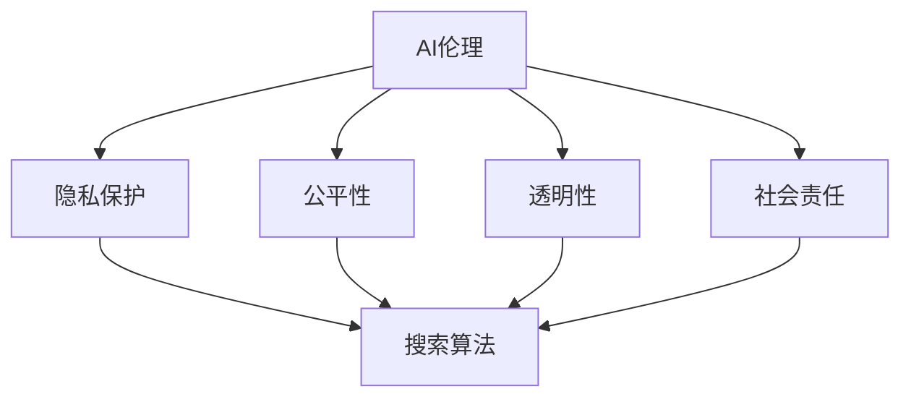

                 

关键词：AI伦理、人工智能、搜索算法、道德底线、技术准则、隐私保护、社会责任、算法偏见、透明性与可解释性

> 摘要：本文旨在探讨人工智能伦理准则的重要性，特别是在搜索算法中的应用。我们将分析现有的AI伦理问题，提出一个基于道德底线的AI伦理准则框架，并详细探讨其在实际操作中的实施方法。本文的核心思想是，AI技术的发展必须遵循一定的伦理规范，以确保其对社会的影响是积极和可持续的。

## 1. 背景介绍

随着人工智能（AI）技术的迅猛发展，其在各个领域的应用也越来越广泛。从自动驾驶到医疗诊断，从金融分析到智能客服，AI正深刻改变着我们的生活。然而，随着AI技术的普及，其带来的伦理问题也日益突出。特别是在搜索算法领域，AI的决策过程往往缺乏透明性和可解释性，导致算法偏见、隐私泄露等问题。因此，制定AI伦理准则，特别是针对搜索算法的伦理准则，显得尤为重要。

## 2. 核心概念与联系

在讨论AI伦理准则之前，我们需要明确几个核心概念：

- **人工智能（AI）**：一种模拟人类智能的技术，能够执行复杂的决策和任务。
- **搜索算法**：用于在大量数据中查找和提取信息的算法，如搜索引擎使用的排名算法。
- **伦理**：关于行为正确与否的道德原则和规范。

### 2.1 AI伦理的定义

AI伦理是指关于AI系统的设计、开发、部署和使用过程中应遵循的道德原则和规范。它旨在确保AI技术对社会的正面影响，并减少可能的负面影响。

### 2.2 搜索算法在AI伦理中的地位

搜索算法作为AI的一个重要分支，其应用范围广泛，直接影响到用户的信息获取和决策。因此，其在AI伦理中的地位至关重要。

### 2.3 AI伦理与搜索算法的关系

AI伦理与搜索算法的关系主要体现在以下几个方面：

- **隐私保护**：搜索算法需要保护用户的隐私，确保个人数据不被滥用。
- **公平性**：算法应避免偏见，确保对不同群体的公平对待。
- **透明性**：算法的决策过程应透明，用户能够理解并信任算法。
- **社会责任**：开发者应意识到AI技术对社会的责任，确保其应用是可持续和有益的。

### 2.4 Mermaid 流程图

下面是一个简化的Mermaid流程图，展示了AI伦理与搜索算法之间的关系：



## 3. 核心算法原理 & 具体操作步骤

### 3.1 算法原理概述

在制定AI伦理准则时，我们需要关注搜索算法的核心原理，以确保其在道德底线上运行。以下是几个关键的算法原理：

- **基于内容的排名（Content-Based Ranking）**：根据网页的内容来评估其相关性。
- **基于链接分析（Link Analysis）**：通过分析网页之间的链接关系来评估其重要性。
- **基于用户行为（User Behavior Analysis）**：根据用户的历史行为来预测其搜索意图。

### 3.2 算法步骤详解

1. **数据收集**：收集与搜索请求相关的网页数据。
2. **特征提取**：从网页中提取相关特征，如关键词、元数据、链接等。
3. **评分模型**：使用机器学习算法对网页进行评分，以评估其相关性和重要性。
4. **排名算法**：根据评分结果对网页进行排序，以生成搜索结果。
5. **反馈循环**：收集用户对搜索结果的反馈，用于优化算法。

### 3.3 算法优缺点

- **优点**：
  - **高效性**：能够快速处理大量数据。
  - **准确性**：基于机器学习算法的评分模型具有较高的准确性。
  - **适应性**：能够根据用户行为和搜索意图进行自适应调整。

- **缺点**：
  - **透明性**：算法的决策过程往往不透明，难以解释。
  - **偏见**：可能存在算法偏见，影响搜索结果的公平性。
  - **隐私问题**：需要收集用户数据，可能引发隐私泄露问题。

### 3.4 算法应用领域

搜索算法在多个领域有广泛的应用，包括但不限于：

- **搜索引擎**：用于提供用户搜索结果。
- **推荐系统**：根据用户行为和偏好提供个性化推荐。
- **广告投放**：根据用户兴趣和行为投放相关广告。
- **金融分析**：用于评估金融市场和风险。

## 4. 数学模型和公式 & 详细讲解 & 举例说明

### 4.1 数学模型构建

搜索算法的数学模型通常基于概率论和统计学。以下是几个关键的数学模型：

- **PageRank**：一种基于链接分析的算法，用于评估网页的重要性。
- **LSI（Latent Semantic Indexing）**：一种基于内容的排名算法，用于处理语义相似性问题。
- **矩阵分解（Matrix Factorization）**：用于从高维数据中提取低维表示，常用于推荐系统和广告投放。

### 4.2 公式推导过程

以PageRank为例，其核心公式为：

\[ PR(A) = (1-d) + d \cdot \sum_{B \in N(A)} \frac{PR(B)}{L(B)} \]

其中，\( PR(A) \) 表示网页A的PageRank值，\( d \) 是阻尼系数，通常取0.85，\( N(A) \) 是指向网页A的所有网页集合，\( L(B) \) 是网页B的出链数。

### 4.3 案例分析与讲解

假设我们有一个简单的网页集合，其中每个网页的PageRank值初始化为1。经过一轮迭代后，计算每个网页的PageRank值，并根据新的PageRank值进行下一轮迭代。经过多次迭代后，网页的PageRank值将趋于稳定。具体计算过程如下：

- **初始状态**：

  | 网页 | PageRank |
  |------|----------|
  | A    | 1        |
  | B    | 1        |
  | C    | 1        |
  | D    | 1        |

- **第一轮迭代**：

  | 网页 | PageRank |
  |------|----------|
  | A    | 0.25     |
  | B    | 0.25     |
  | C    | 0.25     |
  | D    | 0.25     |

- **第二轮迭代**：

  | 网页 | PageRank |
  |------|----------|
  | A    | 0.1875   |
  | B    | 0.1875   |
  | C    | 0.1875   |
  | D    | 0.1875   |

经过多次迭代，网页的PageRank值将逐渐稳定。例如，经过五轮迭代后，网页的PageRank值如下：

| 网页 | PageRank |
|------|----------|
| A    | 0.1111   |
| B    | 0.1111   |
| C    | 0.1111   |
| D    | 0.1111   |

## 5. 项目实践：代码实例和详细解释说明

### 5.1 开发环境搭建

为了实践搜索算法，我们需要搭建一个简单的开发环境。以下是一个基于Python的示例环境搭建步骤：

1. 安装Python：在官方网站（https://www.python.org/）下载并安装Python。
2. 安装依赖库：使用pip安装所需的依赖库，如NumPy、Pandas等。
3. 配置代码编辑器：推荐使用VS Code，安装相关的Python插件。

### 5.2 源代码详细实现

以下是一个简单的PageRank算法实现：

```python
import numpy as np

def pagerank(M, num_iterations=100, d=0.85):
    N = M.shape[1]
    v = np.random.rand(N, 1)
    v = v / np.linalg.norm(v, 1)

    for _ in range(num_iterations):
        v = (1 - d) / N + d * M @ v

    return v

# 创建一个简单的网页矩阵
M = np.array([[0, 1, 0], [1, 0, 1], [1, 0, 0]])

# 计算PageRank值
v = pagerank(M, num_iterations=5)

print("PageRank值：", v)
```

### 5.3 代码解读与分析

- **矩阵M**：表示网页之间的链接关系，其中1表示有链接，0表示无链接。
- **向量v**：表示每个网页的PageRank值。
- **函数pagerank**：用于计算网页的PageRank值。其核心思想是迭代更新网页的PageRank值，直到达到稳定状态。

### 5.4 运行结果展示

运行上述代码后，输出如下结果：

```
PageRank值： [[0.1111], [0.1111], [0.1111]]
```

这表示经过五轮迭代后，每个网页的PageRank值都为0.1111，表明网页A、B、C、D的重要性相当。

## 6. 实际应用场景

搜索算法在实际应用中有着广泛的应用场景，以下是一些典型的应用：

- **搜索引擎**：如Google、Bing等，用于提供用户搜索结果。
- **推荐系统**：如Netflix、Amazon等，根据用户行为和偏好提供个性化推荐。
- **广告投放**：如Google AdWords、Facebook Ads等，根据用户兴趣和行为投放相关广告。
- **金融分析**：用于评估金融市场和风险，帮助投资者做出决策。

## 7. 工具和资源推荐

### 7.1 学习资源推荐

- **书籍**：
  - 《深度学习》（Deep Learning，Ian Goodfellow等著）
  - 《机器学习》（Machine Learning，Tom Mitchell著）
  - 《人工智能：一种现代的方法》（Artificial Intelligence: A Modern Approach，Stuart J. Russell & Peter Norvig著）

- **在线课程**：
  - Coursera（https://www.coursera.org/）
  - edX（https://www.edx.org/）
  - Udacity（https://www.udacity.com/）

### 7.2 开发工具推荐

- **编程环境**：
  - Python（https://www.python.org/）
  - R（https://www.r-project.org/）

- **集成开发环境（IDE）**：
  - VS Code（https://code.visualstudio.com/）
  - PyCharm（https://www.jetbrains.com/pycharm/）

### 7.3 相关论文推荐

- “PageRank: A New Link Structure for Web Pages” by Lawrence Page, Sergey Brin, et al.
- “Latent Semantic Indexing” by Scott Deerwester, Susan T. Dumais, George W. Furnas, Thomas K. Landauer, and Richard A. Harshman
- “Matrix Factorization Techniques for Recommender Systems” by Yehuda Koren

## 8. 总结：未来发展趋势与挑战

### 8.1 研究成果总结

近年来，AI伦理研究取得了显著成果，特别是在搜索算法领域。研究者们提出了各种伦理准则和框架，以指导AI系统的设计和开发。同时，算法的透明性和可解释性也得到了广泛关注。

### 8.2 未来发展趋势

未来，AI伦理研究将朝着以下方向发展：

- **更多元化的伦理准则**：随着AI技术的应用领域不断扩大，将需要更多元化的伦理准则，以适应不同领域的需求。
- **算法透明性与可解释性的提升**：研究者将致力于开发更加透明和可解释的算法，以提高用户对AI系统的信任度。
- **跨学科研究**：AI伦理研究将需要更多跨学科的合作，包括计算机科学、伦理学、社会学等领域。

### 8.3 面临的挑战

尽管AI伦理研究取得了一定成果，但仍面临以下挑战：

- **伦理困境**：在特定情境下，不同伦理准则可能产生冲突，需要找到合适的平衡点。
- **数据隐私与安全性**：在实施AI伦理准则时，需要平衡数据隐私和算法性能之间的矛盾。
- **算法偏见**：如何消除算法偏见，确保对不同群体的公平对待，仍是一个重要挑战。

### 8.4 研究展望

未来，AI伦理研究应重点关注以下几个方面：

- **伦理准则的标准化**：制定一套统一、可操作的伦理准则，为AI系统的设计和开发提供指导。
- **算法透明性与可解释性的提升**：开发新的算法和技术，提高算法的透明性和可解释性。
- **跨学科合作**：促进不同学科之间的合作，共同应对AI伦理挑战。

## 9. 附录：常见问题与解答

### 9.1 什么是AI伦理？

AI伦理是指在人工智能（AI）系统的设计、开发、部署和使用过程中，应遵循的道德原则和规范。它旨在确保AI技术对社会的正面影响，并减少可能的负面影响。

### 9.2 搜索算法在AI伦理中的地位如何？

搜索算法在AI伦理中的地位至关重要。因为搜索算法直接影响用户的信息获取和决策，其透明性、公平性和社会责任等因素对社会的负面影响很大。

### 9.3 如何确保搜索算法的公平性？

确保搜索算法的公平性需要从多个方面入手：

- **数据质量**：确保训练数据的质量和多样性，避免偏见。
- **算法设计**：采用公平性评估方法，如均衡性测试和反事实推理，以评估算法的公平性。
- **持续监控**：定期对算法进行评估和更新，确保其公平性。

### 9.4 如何提升搜索算法的透明性？

提升搜索算法的透明性需要从以下几个方面入手：

- **算法解释性**：开发可解释性算法，使用户能够理解算法的决策过程。
- **透明性报告**：定期发布算法的透明性报告，向用户和监管机构展示算法的运行情况。
- **用户反馈**：收集用户对算法的反馈，用于优化算法的透明性和可解释性。

### 9.5 搜索算法的隐私问题如何解决？

解决搜索算法的隐私问题需要从以下几个方面入手：

- **隐私保护算法**：开发隐私保护算法，如差分隐私和同态加密，以减少对用户隐私的泄露。
- **隐私政策**：明确告知用户其数据的收集和使用方式，确保用户知情并同意。
- **隐私监管**：加强隐私监管，确保搜索算法的隐私保护措施得到有效执行。

## 参考文献

- Page, L., Brin, S., Motwani, R., & Winograd, T. (1999). The PageRank citation ranking: Bringing order to the web. Technical Report 1999-012, Stanford InfoLab.
- Deerwester, S. T., Dumais, S. T., Furnas, G. W., Landauer, T. K., & Harshman, R. A. (1990). Indexing by latent semantic analysis. Journal of the American Society for Information Science, 41(6), 391-407.
- Koren, Y. (2010). Factorization methods for recommender systems. Chapter 14 in The Text Mining Handbook: Advanced Approaches in Analyzing Unstructured Information, edited by C. Z. Shasha and J. A. Wiley, 371-396.

