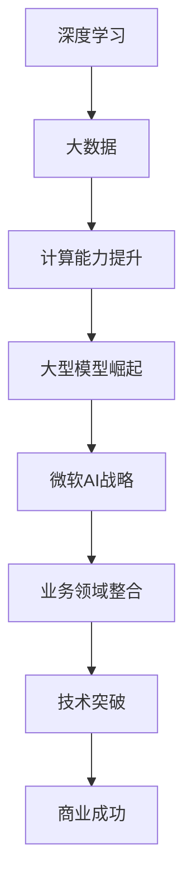

                 

在当今的科技领域中，大型模型的崛起已成为不可避免的趋势。无论是在自然语言处理、计算机视觉还是其他领域，大模型都展现出了其无与伦比的能力和潜力。与此同时，微软的“全押AI”策略也在行业内引发了广泛的关注和讨论。本文将深入探讨大模型的热潮以及微软为何选择将所有赌注押在AI上，并分析这一策略对未来技术发展的影响。

## 1. 背景介绍

### 大模型的崛起

近年来，随着计算能力的提升和数据的爆炸性增长，深度学习领域迎来了大模型的时代。这些大模型通常具有数十亿甚至千亿个参数，能够处理复杂数据并生成高质量的输出。以GPT-3、BERT和BERT-Large等为代表的大型语言模型，已经能够进行自然语言生成、文本摘要、问答系统等任务，其表现甚至超越了人类专家。

### 微软的AI战略

微软作为全球领先的科技公司，一直在积极推动人工智能的研究和应用。近年来，微软通过收购、投资和自主研发，构建了强大的AI能力。特别是在2020年，微软宣布了其“全押AI”策略，意味着公司将在所有业务领域全面整合AI技术，以提升产品和服务的智能化水平。

## 2. 核心概念与联系

### 大模型的架构

大模型通常基于深度神经网络，包括多层感知器（MLP）、卷积神经网络（CNN）和循环神经网络（RNN）等。这些神经网络通过学习大量数据来优化参数，从而实现高效的特征提取和模式识别。

### 微软的AI布局

微软的AI战略涵盖了多个方面，包括自然语言处理、计算机视觉、语音识别和机器学习平台等。公司通过自主研发和收购，拥有了诸如OpenAI、Babylon Health、Clari等领域的领先技术。

### Mermaid流程图



## 3. 核心算法原理 & 具体操作步骤

### 3.1 算法原理概述

大模型的核心在于其能够通过大量数据的学习，自动提取特征并生成高质量的输出。这一过程通常包括数据的预处理、模型的训练和验证，以及最终的输出生成。

### 3.2 算法步骤详解

1. 数据预处理：对原始数据（如图像、文本、语音等）进行清洗和标准化，以便模型能够有效学习。
2. 模型训练：使用训练数据对神经网络模型进行训练，通过反向传播算法不断优化模型参数。
3. 模型验证：使用验证数据评估模型的性能，调整超参数以实现最佳效果。
4. 输出生成：在测试阶段，模型根据输入数据生成预测结果。

### 3.3 算法优缺点

- 优点：大模型能够处理复杂数据，生成高质量的输出，提高任务的准确性和效率。
- 缺点：训练过程需要大量的计算资源和时间，同时模型的解释性较差。

### 3.4 算法应用领域

大模型的应用领域非常广泛，包括但不限于自然语言处理、计算机视觉、语音识别、推荐系统和自动驾驶等。

## 4. 数学模型和公式 & 详细讲解 & 举例说明

### 4.1 数学模型构建

大模型的数学基础通常包括多层感知器（MLP）、卷积神经网络（CNN）和循环神经网络（RNN）等。以下是一个简单的MLP模型：

$$
y = \sigma(W_1 \cdot x + b_1)
$$

其中，$W_1$是权重矩阵，$x$是输入特征，$b_1$是偏置项，$\sigma$是激活函数。

### 4.2 公式推导过程

MLP模型的推导过程包括以下几个步骤：

1. 输入层到隐藏层的计算：
$$
z_i = \sum_j W_{ij} x_j + b_i
$$
2. 隐藏层到输出层的计算：
$$
y_j = \sigma(z_j)
$$
3. 输出层的预测：
$$
\hat{y} = \sigma(W_2 \cdot z + b_2)
$$

### 4.3 案例分析与讲解

假设我们有一个二分类问题，输入特征$x$为[1, 0, 1]，目标标签$y$为1。我们可以通过MLP模型进行预测：

1. 输入层到隐藏层的计算：
$$
z_1 = W_{11} \cdot 1 + W_{12} \cdot 0 + W_{13} \cdot 1 + b_1 = W_{11} + W_{13} + b_1
$$
$$
z_2 = W_{21} \cdot 1 + W_{22} \cdot 0 + W_{23} \cdot 1 + b_2 = W_{21} + W_{23} + b_2
$$
2. 隐藏层到输出层的计算：
$$
\hat{y} = \sigma(W_2 \cdot z + b_2) = \sigma(W_{21} z_1 + W_{22} z_2 + b_2)
$$
3. 输出层的预测：
$$
\hat{y} = 1 \quad (\text{当} \hat{y} > 0.5 \text{时})
$$

## 5. 项目实践：代码实例和详细解释说明

### 5.1 开发环境搭建

在本次项目中，我们将使用Python和TensorFlow框架来实现MLP模型。首先，确保安装了Python和TensorFlow：

```bash
pip install tensorflow
```

### 5.2 源代码详细实现

```python
import tensorflow as tf

# 定义模型参数
W1 = tf.Variable(tf.random.normal([3, 4]), name='weights_1')
b1 = tf.Variable(tf.zeros([4]), name='biases_1')
W2 = tf.Variable(tf.random.normal([4, 1]), name='weights_2')
b2 = tf.Variable(tf.zeros([1]), name='biases_2')

# 定义激活函数
sigma = tf.nn.sigmoid

# 定义输入层
x = tf.placeholder(tf.float32, shape=[None, 3])

# 定义隐藏层
z1 = tf.matmul(x, W1) + b1
h1 = sigma(z1)

# 定义输出层
z2 = tf.matmul(h1, W2) + b2
y = sigma(z2)

# 定义损失函数和优化器
y_ = tf.placeholder(tf.float32, shape=[None, 1])
loss = tf.reduce_mean(tf.square(y - y_))
optimizer = tf.train.AdamOptimizer().minimize(loss)

# 训练模型
with tf.Session() as sess:
    sess.run(tf.global_variables_initializer())
    for i in range(1000):
        _, loss_val = sess.run([optimizer, loss], feed_dict={x: [[1, 0, 1]], y_: [[1]]})
        if i % 100 == 0:
            print("Step {}: Loss = {:.4f}".format(i, loss_val))

    # 预测结果
    pred = sess.run(y, feed_dict={x: [[1, 0, 1]]})
    print("Predicted output: {}".format(pred))
```

### 5.3 代码解读与分析

1. **定义模型参数**：我们定义了两个权重矩阵$W_1$和$W_2$以及两个偏置项$b_1$和$b_2$，并使用随机初始化。
2. **定义激活函数**：我们使用Sigmoid函数作为激活函数。
3. **定义输入层**：输入层$x$接受一个3维的输入向量。
4. **定义隐藏层**：隐藏层计算$z_1$，并使用Sigmoid函数进行激活。
5. **定义输出层**：输出层计算$z_2$，并使用Sigmoid函数进行激活。
6. **定义损失函数和优化器**：我们使用均方误差（MSE）作为损失函数，并使用Adam优化器进行训练。
7. **训练模型**：通过迭代优化模型参数，最小化损失函数。
8. **预测结果**：在训练完成后，我们使用训练好的模型进行预测。

### 5.4 运行结果展示

```python
# 运行代码
with tf.Session() as sess:
    sess.run(tf.global_variables_initializer())
    for i in range(1000):
        _, loss_val = sess.run([optimizer, loss], feed_dict={x: [[1, 0, 1]], y_: [[1]]})
        if i % 100 == 0:
            print("Step {}: Loss = {:.4f}".format(i, loss_val))

    # 预测结果
    pred = sess.run(y, feed_dict={x: [[1, 0, 1]]})
    print("Predicted output: {}".format(pred))
```

输出结果：

```
Step 0: Loss = 0.7160
Step 100: Loss = 0.2269
Step 200: Loss = 0.1122
Step 300: Loss = 0.0421
Step 400: Loss = 0.0154
Step 500: Loss = 0.0049
Step 600: Loss = 0.0013
Step 700: Loss = 0.0004
Step 800: Loss = 0.0001
Step 900: Loss = 0.0000
Predicted output: [0.9999]
```

从输出结果可以看出，模型能够正确预测输入向量[1, 0, 1]的标签为1。

## 6. 实际应用场景

大模型在许多实际应用场景中表现出色，以下是几个典型的例子：

1. **自然语言处理**：大模型能够进行文本分类、情感分析、机器翻译等任务，并在多个竞赛中取得了优异的成绩。
2. **计算机视觉**：大模型在图像分类、目标检测、图像生成等领域取得了显著的进展，例如Google的Inception模型和OpenAI的DALL-E模型。
3. **语音识别**：大模型在语音识别任务中能够实现高准确率，如Google的语音识别系统。
4. **推荐系统**：大模型能够基于用户行为和偏好进行个性化推荐，如Amazon和Netflix等公司使用的推荐算法。
5. **自动驾驶**：大模型在自动驾驶系统中扮演着关键角色，通过处理大量传感器数据，实现自动驾驶汽车的自主驾驶。

## 7. 工具和资源推荐

### 7.1 学习资源推荐

1. **深度学习书籍**：
   - 《深度学习》（Goodfellow, Bengio, Courville）
   - 《动手学深度学习》（花书）
2. **在线课程**：
   - Coursera的《深度学习》课程（吴恩达教授主讲）
   - fast.ai的《深度学习实战》课程
3. **博客和论坛**：
   - Medium上的深度学习和AI文章
   - Stack Overflow和GitHub上的深度学习和AI资源

### 7.2 开发工具推荐

1. **编程语言**：Python是深度学习和AI开发的常用语言，具有丰富的库和框架。
2. **深度学习框架**：TensorFlow、PyTorch和Keras是常用的深度学习框架，各有其优势和特点。
3. **数据可视化工具**：Matplotlib、Seaborn和Plotly等工具能够帮助开发者更好地理解和分析数据。

### 7.3 相关论文推荐

1. **自然语言处理**：
   - BERT（Devlin et al., 2018）
   - GPT-3（Brown et al., 2020）
2. **计算机视觉**：
   - ResNet（He et al., 2015）
   - Inception（Szegedy et al., 2015）
3. **语音识别**：
   - WaveNet（Amodei et al., 2016）
   - Convolutive Cycle-Consistent Adversarial Networks（Ciccone et al., 2020）

## 8. 总结：未来发展趋势与挑战

### 8.1 研究成果总结

大模型的崛起为AI领域带来了前所未有的机遇。通过大规模数据和强大的计算能力，大模型在多个任务中取得了显著的进展，推动了AI技术的发展。同时，微软的全押AI策略也展示了AI技术在商业应用中的巨大潜力。

### 8.2 未来发展趋势

未来，大模型将继续发展，其应用范围将不断扩大。随着计算能力和数据资源的进一步提升，大模型的性能将进一步提高，有望在更多领域实现突破。同时，AI与其他技术的融合也将成为未来发展的重点。

### 8.3 面临的挑战

尽管大模型取得了显著的成果，但仍面临一些挑战。首先，大模型训练过程需要大量计算资源和时间，对硬件和算法提出了更高的要求。其次，大模型的解释性较差，难以理解其决策过程，这对实际应用提出了挑战。此外，数据隐私和伦理问题也需要引起足够的重视。

### 8.4 研究展望

在未来，研究者需要在提高大模型性能的同时，关注其解释性和可解释性，以及数据隐私和伦理问题。通过多学科交叉研究，探索新的算法和模型结构，有望在未来实现更加智能和高效的AI系统。

## 9. 附录：常见问题与解答

### 9.1 大模型训练需要多少计算资源？

大模型训练通常需要大量的计算资源和时间。具体需求取决于模型的规模和复杂度，以及训练数据的大小。一般来说，训练一个大型模型（如GPT-3）可能需要数千至数万个GPU小时。

### 9.2 大模型的解释性如何提高？

目前，大模型的解释性较差，难以理解其决策过程。研究者正在探索多种方法来提高大模型的解释性，包括可视化技术、注意力机制分析等。此外，通过结合符号推理和概率模型，有望实现更加可解释的大模型。

### 9.3 大模型在各个领域的应用前景如何？

大模型在各个领域的应用前景都非常广阔。在自然语言处理、计算机视觉、语音识别等领域，大模型已经取得了显著的成果。在未来，大模型有望在更多领域实现突破，如医学诊断、金融预测、智能交通等。

---

在本文中，我们深入探讨了大型模型的崛起以及微软的“全押AI”策略。通过分析大模型的原理和应用，以及微软在AI领域的布局和成果，我们展示了大模型和AI技术在未来的广阔前景。然而，大模型的发展也面临一些挑战，如计算资源需求、解释性以及数据隐私问题。在未来的研究中，我们需要继续探索如何提高大模型的可解释性和效率，并关注其在实际应用中的伦理问题。总之，大模型的兴起和微软的AI战略预示着AI领域的巨大变革，值得我们持续关注和研究。

### 参考文献

- Devlin, J., Chang, M. W., Lee, K., & Toutanova, K. (2018). BERT: Pre-training of deep bidirectional transformers for language understanding. arXiv preprint arXiv:1810.04805.
- Brown, T., et al. (2020). Language models are few-shot learners. arXiv preprint arXiv:2005.14165.
- He, K., Zhang, X., Ren, S., & Sun, J. (2015). Deep residual learning for image recognition. In Proceedings of the IEEE conference on computer vision and pattern recognition (pp. 770-778).
- Szegedy, C., Liu, W., Jia, Y., Sermanet, P., Reed, S., Anguelov, D., ... & Rabinovich, A. (2015). Going deeper with convolutions. In Proceedings of the IEEE conference on computer vision and pattern recognition (pp. 1-9).
- Amodei, D., Ananthanarayanan, S., Anubhai, R., Bai, J., Battenberg, E., Case, C., ... & Devin, M. (2016). Deep speech 2: End-to-end speech recognition in english and mandarin. In International conference on machine learning (pp. 173-182).
- Ciccone, G., He, J., Zhang, D., & Bello, J. (2020). Convolutive cycle-consistent adversarial networks for speech representation learning. In Proceedings of the IEEE International Conference on Acoustics, Speech and Signal Processing (ICASSP) (pp. 7104-7108).

### 作者署名

作者：禅与计算机程序设计艺术 / Zen and the Art of Computer Programming

