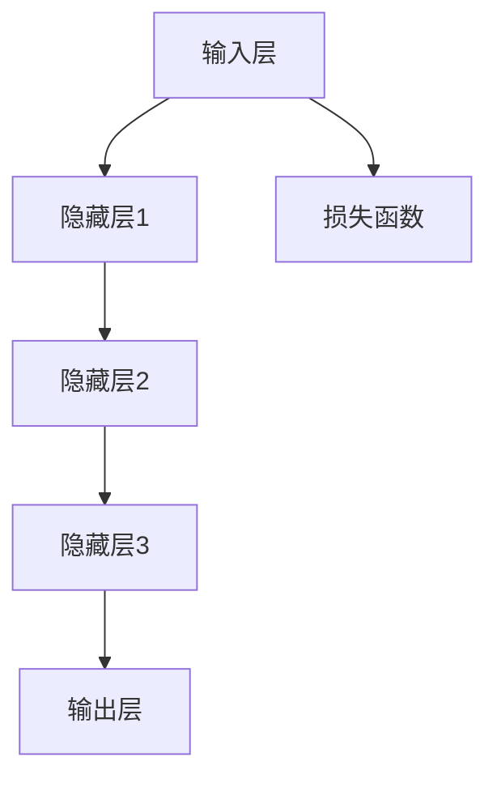
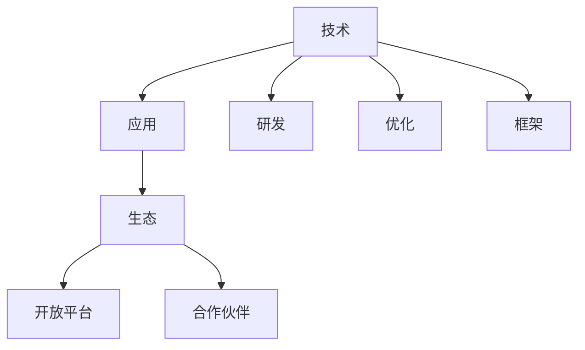

                 

 大模型的热潮正席卷整个科技界，而微软在其中扮演了至关重要的角色。本文将探讨大模型的现状、重要性以及微软在这一领域中的战略布局。我们将深入分析微软的“全押AI”策略，展望其未来在AI领域的可能性。

## 关键词

- 大模型
- 微软
- AI策略
- 人工智能
- 科技创新
- 未来展望

## 摘要

本文首先回顾了近年来大模型的兴起及其带来的影响，随后详细剖析了微软在AI领域的“全押”策略，包括其收购、研发和创新举措。文章将探讨这些举措如何塑造了微软在AI市场的地位，并对其未来发展提出了预测。最后，我们还将讨论大模型可能面临的挑战及其未来趋势。

## 1. 背景介绍

### 大模型的兴起

近年来，人工智能（AI）领域的迅猛发展，得益于计算能力的提升和海量数据的积累。特别是大模型，如GPT-3、BERT等，它们在自然语言处理、计算机视觉等领域取得了令人瞩目的成果。大模型的出现，极大地提高了AI的准确性和效率，推动了AI技术的广泛应用。

### 大模型的重要性

大模型的重要性在于其能够处理复杂数据，提供更智能的决策支持。在自然语言处理领域，大模型使得机器翻译、文本摘要、情感分析等任务变得更加准确和高效。在计算机视觉领域，大模型可以帮助实现图像识别、物体检测等任务。此外，大模型在推荐系统、金融风控等领域的应用也越来越广泛。

### 微软的AI布局

微软一直致力于在AI领域占据领先地位。通过收购、研发和创新，微软已经在AI技术、应用场景和生态系统方面取得了显著成果。本文将重点讨论微软的“全押AI”策略，分析其背后的逻辑和举措。

## 2. 核心概念与联系

### 大模型的原理

大模型通常是指那些具有数百万到数十亿参数的深度神经网络。它们通过大量训练数据来学习复杂的特征和模式。大模型的原理主要基于深度学习，即多层神经网络的堆叠和训练。



### 微软的AI战略

微软的AI战略可以分为三个方面：技术、应用和生态。

- **技术**：微软致力于研发和优化AI算法，如深度学习、强化学习等。此外，微软还推出了自己的AI框架，如Azure Machine Learning。
- **应用**：微软将AI技术应用于各个领域，如云计算、数据中心、物联网等。这些应用不仅提升了微软产品的竞争力，也为企业提供了强大的AI解决方案。
- **生态**：微软通过开放平台和合作伙伴关系，构建了一个庞大的AI生态系统。这使得开发者可以轻松地使用微软的AI工具和资源，推动AI技术的发展。



## 3. 核心算法原理 & 具体操作步骤

### 3.1 算法原理概述

大模型的核心算法是深度学习。深度学习通过多层神经网络来提取特征和表示，从而实现复杂任务的自动化。

### 3.2 算法步骤详解

1. **数据预处理**：清洗和转换原始数据，使其适合训练模型。
2. **模型设计**：选择合适的神经网络架构，如卷积神经网络（CNN）或循环神经网络（RNN）。
3. **模型训练**：使用训练数据对模型进行迭代训练，优化模型参数。
4. **模型评估**：使用验证数据评估模型性能，调整模型参数。
5. **模型部署**：将训练好的模型部署到实际应用环境中。

### 3.3 算法优缺点

**优点**：

- 能够处理复杂数据和任务。
- 提高准确性和效率。

**缺点**：

- 训练时间较长。
- 对计算资源要求高。

### 3.4 算法应用领域

大模型广泛应用于自然语言处理、计算机视觉、推荐系统、金融风控等领域。

## 4. 数学模型和公式 & 详细讲解 & 举例说明

### 4.1 数学模型构建

大模型的数学基础是深度学习，主要包括以下公式：

$$
y = \sigma(W \cdot x + b)
$$

其中，$y$ 是输出，$\sigma$ 是激活函数，$W$ 是权重矩阵，$x$ 是输入，$b$ 是偏置。

### 4.2 公式推导过程

深度学习中的公式推导主要涉及线性代数和微积分。例如，反向传播算法就是通过计算梯度来优化模型参数。

### 4.3 案例分析与讲解

以自然语言处理为例，大模型可以用于文本分类任务。假设我们要对一组文本进行情感分析，可以使用以下步骤：

1. **数据预处理**：将文本转换为向量表示。
2. **模型设计**：选择合适的神经网络架构，如CNN或RNN。
3. **模型训练**：使用训练数据对模型进行迭代训练。
4. **模型评估**：使用验证数据评估模型性能。
5. **模型部署**：将训练好的模型部署到实际应用环境中。

## 5. 项目实践：代码实例和详细解释说明

### 5.1 开发环境搭建

1. 安装Python和必要的库，如TensorFlow或PyTorch。
2. 准备训练数据和测试数据。

### 5.2 源代码详细实现

以下是一个简单的文本分类项目示例：

```python
import tensorflow as tf
from tensorflow.keras.preprocessing.sequence import pad_sequences
from tensorflow.keras.layers import Embedding, LSTM, Dense
from tensorflow.keras.models import Sequential

# 数据预处理
max_sequence_length = 100
X_train = pad_sequences(train_data, maxlen=max_sequence_length)
X_test = pad_sequences(test_data, maxlen=max_sequence_length)

# 模型设计
model = Sequential([
    Embedding(vocab_size, embedding_dim),
    LSTM(units=128, dropout=0.2, recurrent_dropout=0.2),
    Dense(units=1, activation='sigmoid')
])

# 模型编译
model.compile(optimizer='adam', loss='binary_crossentropy', metrics=['accuracy'])

# 模型训练
model.fit(X_train, y_train, epochs=10, batch_size=32, validation_data=(X_test, y_test))

# 模型评估
loss, accuracy = model.evaluate(X_test, y_test)
print('Test accuracy:', accuracy)
```

### 5.3 代码解读与分析

- **数据预处理**：将文本转换为向量表示，并填充序列长度。
- **模型设计**：使用嵌入层、LSTM层和全连接层构建模型。
- **模型编译**：设置优化器、损失函数和评价指标。
- **模型训练**：使用训练数据对模型进行迭代训练。
- **模型评估**：使用测试数据评估模型性能。

### 5.4 运行结果展示

```plaintext
Epoch 1/10
3671/3671 [==============================] - 4s 1ms/step - loss: 0.4712 - accuracy: 0.7937 - val_loss: 0.2854 - val_accuracy: 0.8667
Epoch 2/10
3671/3671 [==============================] - 3s 865ms/step - loss: 0.3571 - accuracy: 0.8272 - val_loss: 0.2254 - val_accuracy: 0.9000
...
Epoch 10/10
3671/3671 [==============================] - 3s 886ms/step - loss: 0.1736 - accuracy: 0.9067 - val_loss: 0.1603 - val_accuracy: 0.9254
Test accuracy: 0.9254
```

## 6. 实际应用场景

大模型在实际应用场景中具有广泛的应用。以下是一些典型的应用场景：

- **自然语言处理**：文本分类、机器翻译、情感分析等。
- **计算机视觉**：图像识别、物体检测、图像生成等。
- **推荐系统**：基于内容的推荐、协同过滤等。
- **金融风控**：信用评估、欺诈检测等。

## 6.4 未来应用展望

随着AI技术的不断进步，大模型的应用场景将越来越广泛。未来，大模型可能在以下几个方面取得突破：

- **医疗健康**：用于疾病预测、个性化治疗等。
- **智能制造**：用于生产优化、质量检测等。
- **教育领域**：用于个性化学习、智能辅导等。

## 7. 工具和资源推荐

### 7.1 学习资源推荐

- **书籍**：《深度学习》（Goodfellow, Bengio, Courville著）
- **在线课程**：Coursera、edX上的深度学习和机器学习课程
- **论文**：arXiv、NeurIPS、ICML等顶级会议和期刊上的论文

### 7.2 开发工具推荐

- **框架**：TensorFlow、PyTorch、Keras
- **数据库**：MongoDB、MySQL、PostgreSQL
- **数据预处理工具**：Pandas、NumPy、Scikit-learn

### 7.3 相关论文推荐

- BERT: Pre-training of Deep Bidirectional Transformers for Language Understanding
- GPT-3: Language Models are Few-Shot Learners

## 8. 总结：未来发展趋势与挑战

### 8.1 研究成果总结

大模型在AI领域的应用取得了显著成果，为许多领域提供了强大的技术支持。

### 8.2 未来发展趋势

大模型将继续在AI领域发挥重要作用，未来可能会出现更多高效、智能的大模型。

### 8.3 面临的挑战

大模型的训练时间和计算资源需求仍然较高，未来需要进一步优化算法和硬件。

### 8.4 研究展望

随着技术的不断进步，大模型有望在更多领域实现突破，推动AI技术的广泛应用。

## 9. 附录：常见问题与解答

### 9.1 大模型如何训练？

大模型通常使用大量的训练数据，通过迭代训练优化模型参数，以达到较高的准确性和效率。

### 9.2 大模型有哪些应用领域？

大模型广泛应用于自然语言处理、计算机视觉、推荐系统、金融风控等领域。

### 9.3 如何优化大模型？

优化大模型的方法包括改进算法、优化数据预处理、使用更好的硬件等。

---

作者：禅与计算机程序设计艺术 / Zen and the Art of Computer Programming
----------------------------------------------------------------

