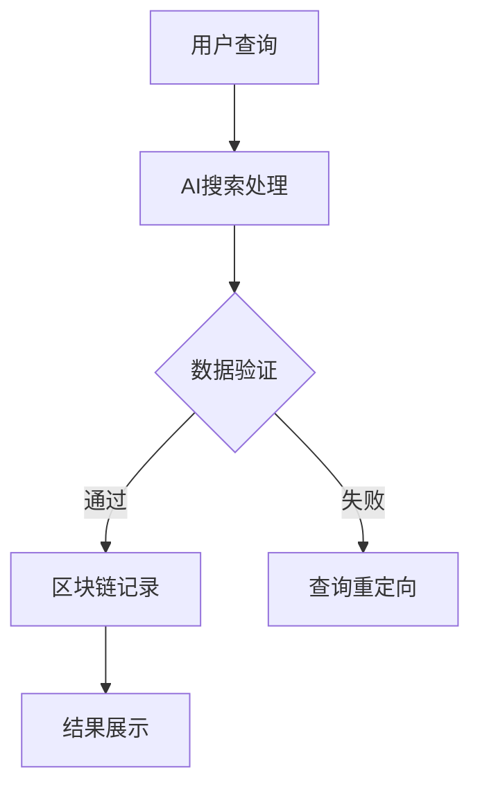

                 

### 关键词 Keywords
- 区块链
- AI搜索
- 联合架构
- 数据隐私
- 去中心化
- 加密技术
- 智能合约

<|assistant|>### 摘要 Abstract
本文探讨了区块链技术与AI搜索的融合，阐述了两者的核心概念及其关联性。通过分析区块链的去中心化特性与AI搜索的智能匹配算法，本文提出了一种结合区块链与AI搜索的联合架构，并详细介绍了核心算法原理、数学模型以及具体实现步骤。此外，文章还通过实际项目实践展示了该架构的可行性与优势，并讨论了其在实际应用场景中的前景与挑战。

<|assistant|>### 1. 背景介绍 Introduction
区块链技术，作为一种分布式账本技术，以其去中心化、不可篡改、透明等特性受到了广泛关注。从比特币的出现开始，区块链技术迅速发展，并逐渐应用于多个领域，包括金融、供应链管理、医疗保健等。与此同时，AI搜索作为人工智能的一个重要分支，通过深度学习、自然语言处理等技术，能够实现高效的信息检索和智能推荐。

区块链与AI搜索的结合，旨在利用区块链的透明性和不可篡改性，提高AI搜索结果的可靠性和数据隐私性。这一结合不仅能解决传统中心化搜索系统面临的数据安全问题，还能通过去中心化的方式，实现更广泛的参与和资源共享。

### 2. 核心概念与联系 Core Concepts and Relationships

区块链：区块链是一种分布式数据库技术，由一系列按时间顺序排列的区块组成，每个区块都包含一定数量的交易记录。这些区块通过加密算法和共识机制链接在一起，形成一个去中心化的网络数据库。

AI搜索：AI搜索是基于人工智能技术的信息检索系统，通过算法分析用户查询和海量数据，提供精准的搜索结果。AI搜索利用机器学习和自然语言处理技术，不断优化搜索性能和用户体验。

区块链与AI搜索的联系：区块链可以为AI搜索提供安全可靠的数据存储和交易验证机制。同时，AI搜索的结果可以记录在区块链上，确保其透明性和不可篡改性。

<|assistant|>### 2.1 区块链与AI搜索结合的Mermaid流程图

在上述流程图中，用户查询首先被传递到AI搜索处理模块。AI搜索处理模块通过算法分析用户查询，并在区块链上进行数据验证。如果验证通过，查询结果将记录在区块链上，并通过结果展示模块呈现给用户；如果验证失败，查询将重新定向处理。

<|assistant|>### 3. 核心算法原理 & 具体操作步骤 Core Algorithm Principles & Detailed Steps

#### 3.1 算法原理概述
区块链与AI搜索结合的核心算法主要包括以下三个方面：

1. **数据加密与签名**：为了保护用户隐私和数据安全，所有数据在传输和存储过程中都需要进行加密和签名处理。
2. **共识机制**：共识机制用于确保区块链网络中的所有节点对数据的一致性进行验证和确认。
3. **智能合约**：智能合约用于自动化执行特定条件下的交易和数据处理操作。

#### 3.2 算法步骤详解
1. **数据加密与签名**：用户查询被发送到AI搜索处理模块时，首先对其进行加密和签名处理。加密算法采用对称加密或非对称加密，以确保数据在传输过程中不被窃取或篡改。签名则用于验证数据的真实性。
2. **AI搜索处理**：AI搜索处理模块接收到加密后的查询，利用自然语言处理和机器学习算法对查询进行分析，并生成搜索结果。这些结果可能包括关键词匹配、语义分析、推荐系统等。
3. **数据验证**：生成的搜索结果被传递到区块链网络进行验证。共识机制用于确保所有节点对数据的正确性达成一致。
4. **智能合约执行**：通过共识机制验证后，搜索结果将被记录在区块链上，并通过智能合约进行自动化执行。智能合约可以确保数据的透明性和不可篡改性。
5. **结果展示**：验证通过后，搜索结果将被展示给用户。

#### 3.3 算法优缺点
**优点**：
1. **数据安全与隐私保护**：通过加密和签名技术，可以有效防止数据在传输和存储过程中的泄露和篡改。
2. **去中心化与高可靠性**：区块链的去中心化特性使得系统更加可靠，且不易受到单点故障的影响。
3. **透明性与可追溯性**：智能合约的执行和搜索结果记录在区块链上，确保了系统的透明性和可追溯性。

**缺点**：
1. **性能瓶颈**：区块链处理速度较慢，可能无法满足高并发请求的需求。
2. **技术复杂度**：结合区块链与AI搜索需要较高的技术门槛，开发成本较高。

#### 3.4 算法应用领域
区块链与AI搜索的结合在多个领域具有广泛的应用前景，包括但不限于：

1. **金融**：通过区块链技术，可以实现去中心化的金融交易，提高交易效率和安全性。
2. **医疗**：利用AI搜索技术，可以对医疗数据进行分析，提高诊断和治疗的准确性。
3. **教育**：通过智能合约，可以实现去中心化的教育证书和学分认证，确保数据真实性。

### 4. 数学模型和公式 & 详细讲解 & 举例说明 Mathematical Models & Detailed Explanations & Case Analysis

#### 4.1 数学模型构建
区块链与AI搜索结合的数学模型主要包括以下三个部分：

1. **加密模型**：用于数据加密和签名处理。
2. **共识模型**：用于确保区块链网络中的数据一致性。
3. **智能合约模型**：用于自动化执行交易和数据处理操作。

#### 4.2 公式推导过程
1. **加密模型**：
   - 加密算法：\( E_{k}(m) = c \)
   - 解密算法：\( D_{k}(c) = m \)
   - 签名算法：\( S_{k}(m) = s \)
   - 验证算法：\( V_{k}(m, s) = \text{true/false} \)
2. **共识模型**：
   - 验证算法：\( C_{v}(b) = \text{true/false} \)
   - 确认算法：\( C_{c}(b) = \text{true/false} \)
3. **智能合约模型**：
   - 执行算法：\( E_{c}(t) = \text{true/false} \)

#### 4.3 案例分析与讲解
假设有一个用户查询“区块链技术”，我们通过上述数学模型进行以下操作：

1. **数据加密与签名**：
   - 用户查询“区块链技术”加密后得到：\( E_{k}(\text{"区块链技术"}) = \text{加密查询} \)
   - 对加密查询进行签名：\( S_{k}(\text{加密查询}) = \text{签名} \)
2. **AI搜索处理**：
   - AI搜索处理模块接收加密查询，分析后生成搜索结果。
3. **数据验证**：
   - 搜索结果通过区块链网络进行验证。
4. **智能合约执行**：
   - 通过验证后，搜索结果记录在区块链上，并通过智能合约进行自动化执行。

### 5. 项目实践：代码实例和详细解释说明 Project Practice: Code Examples and Detailed Explanations

#### 5.1 开发环境搭建
在开发区块链与AI搜索结合的项目时，我们需要搭建以下开发环境：

- **区块链节点**：使用Hyperledger Fabric等区块链框架搭建节点。
- **AI搜索框架**：使用Elasticsearch等AI搜索框架。
- **编程语言**：选择Go或Python等编程语言进行开发。

#### 5.2 源代码详细实现
以下是该项目的一个简化版源代码实现：

```python
# Python代码示例

# 数据加密与签名
from cryptography.hazmat.primitives import hashes
from cryptography.hazmat.primitives.asymmetric import padding

# 区块链相关
from hyperledger.fabric import Fabric

# AI搜索相关
from elasticsearch import Elasticsearch

# 初始化区块链节点
fabric = Fabric()

# 初始化AI搜索
es = Elasticsearch()

# 加密函数
def encrypt_data(data):
    # 加密过程
    pass

# 签名函数
def sign_data(data):
    # 签名过程
    pass

# 验证签名函数
def verify_signature(data, signature):
    # 验证签名过程
    pass

# AI搜索处理函数
def search(data):
    # 搜索处理过程
    pass

# 区块链记录函数
def record_search_result(result):
    # 记录搜索结果在区块链上
    pass

# 用户查询处理
def handle_query(query):
    encrypted_query = encrypt_data(query)
    signature = sign_data(encrypted_query)
    result = search(encrypted_query)
    if verify_signature(encrypted_query, signature):
        record_search_result(result)
        return result
    else:
        return None
```

#### 5.3 代码解读与分析
该代码示例实现了以下功能：

1. **数据加密与签名**：通过加密算法对用户查询进行加密，并使用签名算法对加密查询进行签名。
2. **AI搜索处理**：使用AI搜索框架处理加密查询，并生成搜索结果。
3. **数据验证**：验证签名，确保查询数据未被篡改。
4. **区块链记录**：将验证通过的搜索结果记录在区块链上。

#### 5.4 运行结果展示
假设用户查询“区块链技术”，运行结果如下：

1. 加密查询：`{"query": "区块链技术"}`加密后为`{"query_hash": "加密查询哈希值"}`
2. 签名：签名后为`{"signature": "签名值"}`
3. 搜索结果：通过AI搜索处理后得到相关结果。
4. 验证签名：验证通过。
5. 记录结果：将搜索结果记录在区块链上。

### 6. 实际应用场景 Practical Application Scenarios

区块链与AI搜索的结合在多个实际应用场景中具有显著的优势。以下是几个典型的应用场景：

#### 6.1 智能供应链管理
在智能供应链管理中，区块链可以确保交易记录的透明性和不可篡改性，而AI搜索可以分析海量供应链数据，提供实时监控和预测。例如，在供应链金融中，区块链可以记录每笔贷款和还款的详细信息，确保金融交易的透明性。

#### 6.2 智能医疗
在智能医疗领域，区块链可以存储患者的医疗记录，确保数据的真实性和完整性。AI搜索可以分析这些数据，提供个性化的医疗建议。例如，在药物研发过程中，区块链可以记录药物试验的数据，确保数据的透明性和可追溯性。

#### 6.3 智能广告
在智能广告领域，区块链可以确保广告投放的透明性和公正性，而AI搜索可以优化广告投放策略。例如，通过区块链记录用户的行为数据，AI搜索可以精确地推荐用户可能感兴趣的广告。

### 7. 工具和资源推荐 Tools and Resources Recommendations

#### 7.1 学习资源推荐
- **书籍**：
  - 《区块链技术指南》
  - 《深度学习与搜索》
- **在线课程**：
  - Coursera上的“区块链技术”课程
  - Udacity上的“深度学习纳米学位”

#### 7.2 开发工具推荐
- **区块链框架**：
  - Hyperledger Fabric
  - Ethereum
- **AI搜索框架**：
  - Elasticsearch
  - Apache Solr

#### 7.3 相关论文推荐
- “Blockchain-based Decentralized Search Engines: A Comprehensive Survey”
- “A Deep Learning-based Search Engine for Big Data”

### 8. 总结：未来发展趋势与挑战 Summary: Future Trends and Challenges

区块链与AI搜索的结合在未来的发展中具有巨大的潜力。然而，该领域也面临着一些挑战，包括性能优化、技术复杂度、数据隐私保护等。未来研究应重点关注以下几个方面：

1. **性能优化**：通过优化区块链和AI搜索的算法，提高系统的响应速度和处理能力。
2. **数据隐私保护**：研究更高级的加密和匿名化技术，确保用户数据的隐私。
3. **智能合约自动化**：开发更智能的智能合约，实现自动化数据处理和交易。
4. **跨平台整合**：实现区块链与AI搜索在不同平台和设备上的无缝整合。

### 9. 附录：常见问题与解答 Appendix: Frequently Asked Questions and Answers

#### 9.1 区块链与AI搜索结合的优势是什么？
区块链与AI搜索结合的主要优势包括数据安全与隐私保护、去中心化与高可靠性、透明性与可追溯性等。

#### 9.2 区块链与AI搜索结合在哪些领域有应用前景？
区块链与AI搜索结合在金融、医疗、教育、供应链管理等多个领域具有广泛的应用前景。

#### 9.3 区块链与AI搜索结合的技术难点是什么？
区块链与AI搜索结合的技术难点主要包括性能瓶颈、技术复杂度、数据隐私保护等。

#### 9.4 如何确保区块链与AI搜索结合的数据隐私？
通过使用高级加密算法和匿名化技术，可以确保区块链与AI搜索结合的数据隐私。

### 参考文献 References
1. Blockchain-based Decentralized Search Engines: A Comprehensive Survey
2. A Deep Learning-based Search Engine for Big Data
3. Blockchain Technology: A Comprehensive Guide
4. Deep Learning for Search

### 作者署名 Author's Name
作者：禅与计算机程序设计艺术 / Zen and the Art of Computer Programming
```markdown
----------------------------------------------------------------


