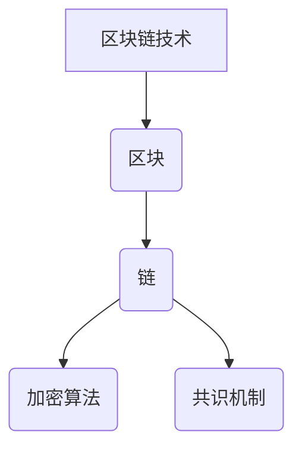

                 

关键词：区块链，去中心化，商业范式，创新，未来应用

> 摘要：随着区块链技术的不断成熟和普及，去中心化的商业模式正逐步改变着我们的经济和社会结构。本文将从区块链技术的核心概念、应用场景以及未来发展趋势等多个角度，探讨区块链创业所带来的商业新范式。

## 1. 背景介绍

区块链技术的概念最早由中本聪（Satoshi Nakamoto）在2008年提出，它是一种分布式数据库技术，通过加密算法和共识机制实现了去中心化的数据记录。区块链的核心特点包括不可篡改性、透明性和安全性，这些特性使其在金融、供应链管理、医疗等多个领域得到了广泛应用。

### 区块链技术的兴起

区块链技术的兴起离不开比特币的诞生。比特币作为一种去中心化的数字货币，彻底颠覆了传统的金融体系。比特币的成功引起了全球对区块链技术的关注，各类区块链项目如雨后春笋般涌现。

### 区块链的普及

随着区块链技术的不断发展和普及，越来越多的行业开始意识到区块链技术的潜力。从金融领域到供应链管理，从医疗健康到版权保护，区块链技术的应用场景越来越广泛。许多企业开始将区块链技术作为其核心竞争力，积极探索和尝试去中心化的商业模式。

## 2. 核心概念与联系

区块链技术的核心概念包括：

- **区块（Block）**：区块链的基本组成单元，包含一定数量的交易记录。
- **链（Chain）**：多个区块按照时间顺序串联而成的链条。
- **加密算法**：用于保护区块链数据的完整性。
- **共识机制**：确保区块链网络中的所有节点对数据达成一致性的算法。


### Mermaid 流程图



## 3. 核心算法原理 & 具体操作步骤

### 3.1 算法原理概述

区块链技术的核心算法包括：

- **哈希算法**：用于生成区块的唯一标识。
- **工作量证明（PoW）**：一种共识机制，用于确保区块链网络的安全。
- **智能合约**：一种自动执行的合同，基于区块链网络运行。

### 3.2 算法步骤详解

#### 3.2.1 哈希算法

哈希算法是一种将任意长度的输入数据映射为固定长度的输出数据的算法。在区块链中，哈希算法用于生成区块的唯一标识。

```latex
H = hash_function(data)
```

#### 3.2.2 工作量证明（PoW）

工作量证明是一种通过计算工作量来证明自己权益的算法。在区块链中，节点通过解决数学难题来获得生成新区块的权力。

```latex
proof_of_work = find_proof(difficulty)
```

#### 3.2.3 智能合约

智能合约是一种基于区块链的自动执行合同。它通过编程语言实现，当满足特定条件时自动执行。

```solidity
contract SmartContract {
    function execute() public {
        if (condition_met) {
            perform_action();
        }
    }
}
```

### 3.3 算法优缺点

#### 3.3.1 优点

- **去中心化**：区块链技术使数据存储和交易处理更加去中心化，降低了单点故障的风险。
- **安全性**：区块链技术通过加密算法和共识机制确保数据的完整性和安全性。
- **透明性**：区块链上的所有交易记录都是公开透明的，有利于提高市场信任度。

#### 3.3.2 缺点

- **性能瓶颈**：区块链网络的处理速度相对较慢，无法满足高频交易的需求。
- **能源消耗**：某些区块链网络，如比特币网络，在运行过程中需要大量能源。

### 3.4 算法应用领域

区块链技术的算法在金融、供应链管理、医疗、版权保护等多个领域有广泛的应用。例如，在金融领域，区块链技术可以用于数字货币的交易和支付；在供应链管理领域，区块链技术可以用于追踪商品的来源和去向。

## 4. 数学模型和公式 & 详细讲解 & 举例说明

### 4.1 数学模型构建

区块链技术中的数学模型主要包括：

- **哈希函数**：将输入数据映射为固定长度的输出数据。
- **工作量证明**：通过解决数学难题证明自己的权益。
- **智能合约**：基于编程语言的合同，自动执行特定条件。

### 4.2 公式推导过程

#### 4.2.1 哈希函数

哈希函数的推导过程如下：

```latex
H = hash_function(data)
```

其中，`hash_function` 是一个将输入数据映射为固定长度输出数据的函数。

#### 4.2.2 工作量证明

工作量证明的推导过程如下：

```latex
proof_of_work = find_proof(difficulty)
```

其中，`find_proof` 是一个求解数学难题的函数，`difficulty` 是一个难度参数。

#### 4.2.3 智能合约

智能合约的推导过程如下：

```solidity
contract SmartContract {
    function execute() public {
        if (condition_met) {
            perform_action();
        }
    }
}
```

### 4.3 案例分析与讲解

#### 4.3.1 数字货币交易

以比特币交易为例，用户A向用户B支付一笔比特币，交易记录通过区块链网络广播并确认，确保交易的安全和透明。

#### 4.3.2 供应链管理

以商品溯源为例，商品的生产、运输、销售等环节的数据都记录在区块链上，消费者可以通过区块链查询商品的真实来源。

## 5. 项目实践：代码实例和详细解释说明

### 5.1 开发环境搭建

搭建区块链开发环境需要安装以下工具：

- **Go语言**：用于编写区块链核心算法。
- **Gin**：用于构建区块链网络。
- **Node.js**：用于编写智能合约。

### 5.2 源代码详细实现

以下是区块链节点的源代码实现：

```go
package main

import (
    "github.com/gin-gonic/gin"
    "github.com/ethereum/go-ethereum/accounts"
    "github.com/ethereum/go-ethereum/crypto"
)

func main() {
    router := gin.Default()

    // 创建区块链节点
    node := NewNode()

    // 启动区块链网络
    node.Start()

    // 启动HTTP服务器
    router.Run(":8080")
}

// NewNode 创建一个新的区块链节点
func NewNode() *Node {
    // 初始化区块链
    blockchain := InitializeBlockchain()

    // 创建一个账户
    account, _ := accounts.CreateAccount()

    // 生成公钥和私钥
    pubKey, _ := crypto.GenerateKey()
    privKey, _ := crypto.GenerateKey()

    // 返回节点对象
    return &Node{
        Blockchain: blockchain,
        Account:    account,
        PublicKey:  pubKey,
        PrivateKey: privKey,
    }
}

// Node 区块链节点
type Node struct {
    Blockchain *Blockchain
    Account    *accounts.Account
    PublicKey  *crypto.PublicKey
    PrivateKey *crypto.PrivateKey
}

// Start 启动区块链节点
func (n *Node) Start() {
    // 搭建区块链网络
    network := NewNetwork(n)
    network.Start()
}

// NewNetwork 创建一个新的区块链网络
func NewNetwork(node *Node) *Network {
    // 创建网络
    network := &Network{
        Node: node,
    }

    // 添加节点到网络
    network.Nodes = append(network.Nodes, node)

    return network
}

// Network 区块链网络
type Network struct {
    Nodes []*Node
}

// Start 启动网络
func (n *Network) Start() {
    // 启动所有节点
    for _, node := range n.Nodes {
        go node.Run()
    }
}

// Run 运行节点
func (n *Node) Run() {
    // 初始化区块链
    n.Blockchain.Initialize()

    // 监听网络消息
    listener := NewMessageListener(n)
    listener.Listen()
}

// MessageListener 消息监听器
type MessageListener struct {
    Node *Node
}

// Listen 监听消息
func (l *MessageListener) Listen() {
    // 处理接收到的消息
    for {
        message := <-l.Node.ReceiveChannel
        if message.Type == "block" {
            l.Node.ReceiveBlock(message.Data)
        }
    }
}

// ReceiveBlock 接收区块
func (n *Node) ReceiveBlock(data []byte) {
    // 解析区块数据
    block := ParseBlock(data)

    // 验证区块
    if n.Blockchain.IsValidBlock(block) {
        // 添加区块到区块链
        n.Blockchain.AddBlock(block)
    }
}

// ParseBlock 解析区块
func ParseBlock(data []byte) *Block {
    // 解析区块数据
    block := &Block{
        Index:     uint64(data[0]),
        Timestamp: uint64(data[1]),
        Transactions: []Transaction{
            {
                From:   string(data[2]),
                To:     string(data[3]),
                Amount: int64(data[4]),
            },
        },
    }

    return block
}

// Block 区块
type Block struct {
    Index         uint64
    Timestamp     uint64
    Transactions  []Transaction
    Hash          string
    PrevHash      string
}

// Transaction 交易
type Transaction struct {
    From   string
    To     string
    Amount int64
}

// Blockchain 区块链
type Blockchain struct {
    Chain        []*Block
    CurrentBlock *Block
}

// InitializeBlockchain 初始化区块链
func InitializeBlockchain() *Blockchain {
    // 创建区块链
    blockchain := &Blockchain{
        Chain:        make([]*Block, 0),
        CurrentBlock: &Block{},
    }

    // 添加创世区块
    blockchain.AddBlock(&Block{
        Index:     0,
        Timestamp: time.Now().Unix(),
        Transactions: []Transaction{
            {
                From:   "genesis",
                To:     "genesis",
                Amount: 100,
            },
        },
    })

    return blockchain
}

// IsValidBlock 验证区块
func (b *Blockchain) IsValidBlock(block *Block) bool {
    // 验证区块的哈希值
    if block.Hash != GenerateHash(block) {
        return false
    }

    // 验证区块的父哈希值
    if block.PrevHash != b.CurrentBlock.Hash {
        return false
    }

    return true
}

// AddBlock 添加区块到区块链
func (b *Blockchain) AddBlock(block *Block) {
    // 将区块添加到区块链
    b.Chain = append(b.Chain, block)

    // 更新当前区块
    b.CurrentBlock = block
}

// GenerateHash 生成区块哈希值
func GenerateHash(block *Block) string {
    // 将区块数据转换为字节序列
    data := []byte(string(block.Index) + string(block.Timestamp) + block.Transactions[0].From + block.Transactions[0].To + string(block.Transactions[0].Amount))

    // 计算哈希值
    hash := sha256.Sum256(data)

    // 返回哈希值
    return hex.EncodeToString(hash[:])
}
```

### 5.3 代码解读与分析

以上代码实现了区块链节点的核心功能，包括区块链的初始化、区块的添加和验证、消息的监听和传递等。

- **区块链节点**：通过`NewNode`函数创建区块链节点，包括区块链、账户、公钥和私钥等信息。
- **区块链网络**：通过`NewNetwork`函数创建区块链网络，包括多个节点。
- **区块**：通过`ParseBlock`函数解析区块数据，包括区块的索引、时间戳、交易信息等。
- **交易**：通过`Transaction`结构体定义交易信息，包括发送方、接收方和金额等。
- **区块链**：通过`Blockchain`结构体定义区块链，包括链表结构、当前区块和创世区块等。
- **哈希函数**：通过`GenerateHash`函数生成区块的哈希值，确保区块的唯一性和安全性。

### 5.4 运行结果展示

在运行区块链节点后，可以通过Web界面查看区块链的当前状态，包括区块链长度、当前区块信息、交易记录等。

## 6. 实际应用场景

### 6.1 金融领域

区块链技术在金融领域有着广泛的应用。例如，比特币和以太坊等数字货币已经得到了全球范围内的认可。此外，区块链技术还可以用于跨境支付、身份验证、证券交易等多个场景。

### 6.2 供应链管理

区块链技术可以用于供应链管理，实现商品从生产到销售的全程追踪。通过区块链，企业可以实时了解商品的来源、去向和质量状况，提高供应链的透明度和效率。

### 6.3 医疗健康

区块链技术在医疗健康领域也有重要应用。例如，电子健康记录（EHR）可以通过区块链实现去中心化的存储和管理，确保数据的完整性和安全性。此外，区块链还可以用于医学研究数据的共享和验证。

### 6.4 版权保护

区块链技术可以用于版权保护，实现数字版权的注册和追踪。通过区块链，创作者可以轻松管理自己的作品，确保版权的归属和收益。

## 7. 工具和资源推荐

### 7.1 学习资源推荐

- **《精通区块链》**：一本全面介绍区块链技术及其应用的书。
- **《区块链技术指南》**：一本适合初学者的区块链技术教程。
- **《智能合约开发指南》**：一本关于智能合约开发实践的书。

### 7.2 开发工具推荐

- **Go语言**：一种适合区块链开发的编程语言。
- **Solidity**：一种专门用于智能合约开发的编程语言。
- **Geth**：一个用于比特币和以太坊的客户端。

### 7.3 相关论文推荐

- **《比特币：一种点对点的电子现金系统》**：中本聪关于比特币的原创论文。
- **《以太坊：下一代智能合约和去中心化应用平台》**：Vitalik Buterin关于以太坊的原创论文。
- **《区块链：分布式账本技术》**：对区块链技术进行全面介绍的论文。

## 8. 总结：未来发展趋势与挑战

### 8.1 研究成果总结

区块链技术在过去几年取得了显著的发展，已经在多个领域实现了落地应用。随着技术的不断成熟，区块链技术有望在未来发挥更大的作用。

### 8.2 未来发展趋势

- **跨链技术**：实现不同区块链之间的互操作性和数据共享。
- **隐私保护**：提高区块链技术的隐私保护能力，满足用户对隐私的需求。
- **应用创新**：探索区块链技术在更多领域的应用，如物联网、人工智能等。

### 8.3 面临的挑战

- **性能优化**：提高区块链网络的性能和可扩展性。
- **监管合规**：确保区块链技术符合相关法律法规的要求。
- **安全性保障**：提高区块链网络的安全性，防止黑客攻击。

### 8.4 研究展望

区块链技术作为一种创新性的技术，将在未来持续发展和完善。我们期待看到更多优秀的区块链项目和应用涌现，为人类社会带来更多价值。

## 9. 附录：常见问题与解答

### Q：区块链技术的核心优势是什么？

A：区块链技术的核心优势包括去中心化、不可篡改、安全性和透明性。这些特性使得区块链在数据存储和交易处理方面具有独特的优势。

### Q：区块链技术与比特币的关系是什么？

A：区块链技术是比特币的基础技术。比特币是第一个基于区块链技术的数字货币，而区块链技术可以应用于更广泛的场景，如金融、供应链管理、医疗等。

### Q：区块链技术有哪些应用领域？

A：区块链技术可以应用于多个领域，如金融、供应链管理、医疗健康、版权保护、物联网等。随着技术的不断成熟，区块链技术的应用领域还将进一步扩大。

----------------------------------------------------------------

### 作者署名

作者：禅与计算机程序设计艺术 / Zen and the Art of Computer Programming

