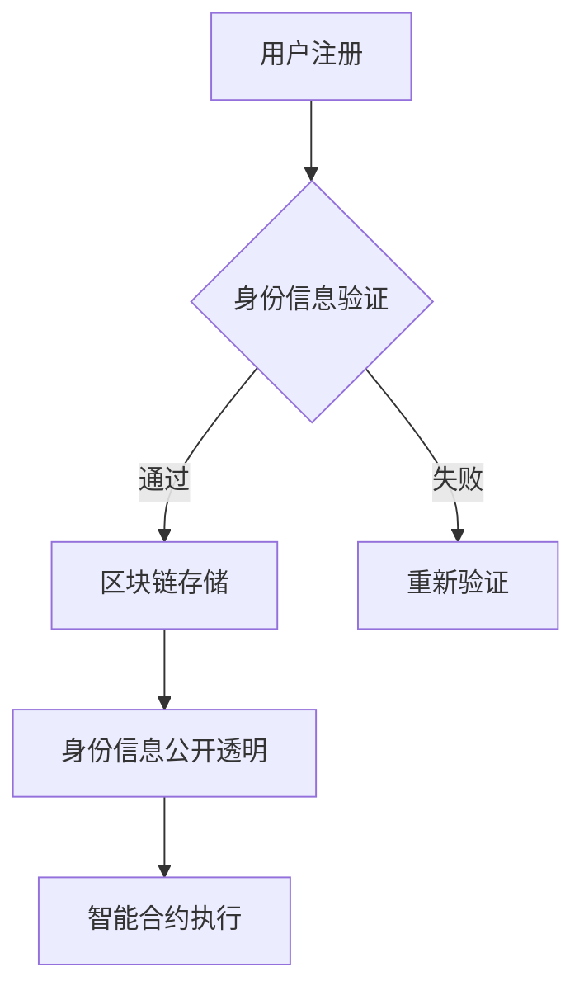

                 

关键词：区块链、数字身份验证、安全性、去中心化、隐私保护、智能合约

> 摘要：本文深入探讨了区块链技术在数字身份验证领域的应用，分析了其基本原理、架构设计、核心算法、数学模型、项目实践以及未来发展方向。通过详细阐述，读者将了解区块链在提升数字身份验证安全性、隐私保护和去中心化方面的重要作用。

## 1. 背景介绍

随着互联网的快速发展，数字身份验证已经成为了许多在线服务和应用中不可或缺的一环。传统的数字身份验证方法，如用户名和密码，面临着诸多安全挑战，例如密码泄露、身份盗用和欺诈行为。为了应对这些挑战，各种新技术不断涌现，其中区块链技术因其独特的特性，逐渐成为数字身份验证领域的热门研究课题。

区块链技术以其去中心化、不可篡改和透明性等特点，为数字身份验证提供了全新的解决方案。通过将用户身份信息存储在分布式账本上，区块链技术能够有效防止信息篡改和欺诈行为，同时保障用户隐私。本文将从以下几个方面详细探讨区块链在数字身份验证中的应用：

1. 核心概念与联系
2. 核心算法原理与具体操作步骤
3. 数学模型和公式
4. 项目实践：代码实例和详细解释说明
5. 实际应用场景
6. 工具和资源推荐
7. 总结：未来发展趋势与挑战

## 2. 核心概念与联系

在探讨区块链在数字身份验证中的应用之前，我们需要先了解一些核心概念和它们之间的联系。

### 2.1 区块链基本概念

区块链是一种分布式数据库技术，其核心特点包括去中心化、不可篡改和透明性。区块链由一系列按时间顺序排列的区块组成，每个区块包含一定数量的交易记录，并通过加密算法连接在一起，形成一个链式数据结构。

### 2.2 数字身份验证

数字身份验证是指通过验证用户的身份信息，确保用户在进行数字交易或访问在线服务时的合法性和安全性。常见的数字身份验证方法包括用户名和密码、生物识别技术（如指纹识别、面部识别等）和二因素认证（如短信验证码、动态口令等）。

### 2.3 区块链与数字身份验证的联系

区块链与数字身份验证之间的联系主要体现在以下几个方面：

1. **去中心化**：区块链的去中心化特性使得数字身份验证不再依赖于单一的中心化机构，降低了身份盗用和欺诈的风险。
2. **不可篡改**：区块链上的身份信息一旦记录，将无法被篡改，确保了身份信息的真实性和完整性。
3. **透明性**：区块链上的身份信息是公开透明的，用户可以查看和验证其他用户身份信息的真实性。
4. **智能合约**：智能合约可以用于自动化执行身份验证流程，提高验证效率和准确性。

为了更直观地展示区块链与数字身份验证之间的联系，下面给出一个简单的 Mermaid 流程图：



## 3. 核心算法原理与具体操作步骤

区块链在数字身份验证中的应用，离不开核心算法的支持。下面将详细介绍区块链在数字身份验证中的核心算法原理和具体操作步骤。

### 3.1 算法原理概述

区块链在数字身份验证中的核心算法主要包括：

1. **加密算法**：用于保护用户身份信息的安全性，常见的加密算法包括SHA-256、RSA等。
2. **哈希算法**：用于生成身份信息的哈希值，确保身份信息的一致性和不可篡改性。
3. **共识算法**：用于达成全网节点的共识，确保区块链的分布式特性，常见的共识算法包括工作量证明（PoW）和权益证明（PoS）等。
4. **智能合约**：用于自动化执行身份验证流程，提高验证效率和准确性。

### 3.2 算法步骤详解

区块链在数字身份验证中的具体操作步骤如下：

1. **用户注册**：用户通过区块链平台注册身份信息，包括用户名、密码、邮箱等。
2. **身份信息加密**：用户身份信息被加密，确保信息在传输和存储过程中的安全性。
3. **生成哈希值**：将加密后的身份信息生成哈希值，用于确保身份信息的一致性和不可篡改性。
4. **上传身份信息到区块链**：用户将加密后的身份信息和哈希值上传到区块链上，并经过全网节点验证。
5. **共识验证**：全网节点通过共识算法达成一致，确保上传的身份信息是真实和有效的。
6. **身份信息存储**：经过共识验证后的身份信息被永久存储在区块链上，供其他用户进行验证。
7. **身份信息验证**：其他用户通过区块链上的身份信息进行验证，确保验证过程的安全性和准确性。

### 3.3 算法优缺点

区块链在数字身份验证中的算法具有以下优缺点：

1. **优点**：
   - **安全性**：区块链技术具有去中心化、不可篡改和透明性等特点，有效提高了数字身份验证的安全性。
   - **隐私保护**：区块链上的身份信息是加密的，有效保护了用户隐私。
   - **去中心化**：区块链去除了传统中心化机构的依赖，降低了身份盗用和欺诈的风险。
   - **效率提升**：智能合约的引入，使得身份验证过程自动化，提高了验证效率和准确性。

2. **缺点**：
   - **计算资源消耗**：区块链的共识算法（如PoW）需要大量计算资源，可能导致能源消耗较大。
   - **网络延迟**：区块链上的交易需要经过全网节点验证，可能导致网络延迟较高。
   - **隐私泄露风险**：虽然区块链上的身份信息是加密的，但仍然存在隐私泄露的风险。

### 3.4 算法应用领域

区块链在数字身份验证中的算法主要应用于以下领域：

1. **金融行业**：区块链技术可用于金融机构的身份验证和客户管理，提高业务效率和安全。
2. **电子商务**：区块链技术可用于电商平台上的用户身份验证和商品溯源，提高消费者信任度。
3. **公共卫生**：区块链技术可用于公共卫生领域的疫苗接种记录管理，确保数据真实性和完整性。
4. **教育行业**：区块链技术可用于教育领域的学历认证和资格认证，提高教育诚信度。

## 4. 数学模型和公式

在区块链数字身份验证中，数学模型和公式起到了关键作用。下面将详细介绍数学模型构建、公式推导过程以及案例分析与讲解。

### 4.1 数学模型构建

区块链数字身份验证的数学模型主要包括以下部分：

1. **用户身份信息**：用户身份信息包括用户名、密码、邮箱等。
2. **加密算法**：加密算法用于保护用户身份信息的安全性，常见的加密算法包括SHA-256、RSA等。
3. **哈希算法**：哈希算法用于生成身份信息的哈希值，确保身份信息的一致性和不可篡改性。
4. **共识算法**：共识算法用于达成全网节点的共识，确保区块链的分布式特性，常见的共识算法包括工作量证明（PoW）和权益证明（PoS）等。
5. **智能合约**：智能合约用于自动化执行身份验证流程，提高验证效率和准确性。

### 4.2 公式推导过程

区块链数字身份验证中的主要公式推导过程如下：

1. **加密算法公式**：设用户身份信息为\( I \)，加密算法为\( E \)，加密后的身份信息为\( E(I) \)。

   $$ E(I) = E_K(I) $$

   其中，\( E_K \)表示加密算法，\( K \)表示加密密钥。

2. **哈希算法公式**：设用户身份信息为\( I \)，哈希算法为\( H \)，生成的哈希值为\( H(I) \)。

   $$ H(I) = H(I) $$

3. **共识算法公式**：设全网节点集合为\( N \)，共识算法为\( C \)，共识结果为\( C(N) \)。

   $$ C(N) = C_N(N) $$

   其中，\( C_N \)表示共识算法。

4. **智能合约公式**：设智能合约代码为\( S \)，执行结果为\( R \)。

   $$ R = S(I) $$

### 4.3 案例分析与讲解

为了更好地理解区块链数字身份验证的数学模型和公式，下面通过一个实际案例进行分析和讲解。

**案例背景**：某金融公司使用区块链技术进行用户身份验证，要求用户注册时上传身份信息，并使用哈希算法生成哈希值，全网节点验证身份信息的真实性和完整性。

**案例步骤**：

1. **用户注册**：用户A上传身份信息（用户名、密码、邮箱）到区块链。
2. **身份信息加密**：用户A使用加密算法（如SHA-256）对身份信息进行加密。
3. **生成哈希值**：用户A将加密后的身份信息生成哈希值，用于确保身份信息的一致性和不可篡改性。
4. **上传哈希值到区块链**：用户A将生成的哈希值上传到区块链上，并经过全网节点验证。
5. **共识验证**：全网节点通过共识算法（如PoW）达成一致，确保上传的哈希值是真实和有效的。
6. **身份信息存储**：经过共识验证后的身份信息被永久存储在区块链上，供其他用户进行验证。
7. **身份信息验证**：其他用户通过区块链上的身份信息进行验证，确保验证过程的安全性和准确性。

**数学模型应用**：

1. **加密算法应用**：用户A的身份信息\( I \)经过SHA-256加密算法后，生成哈希值\( H(I) \)。

   $$ H(I) = SHA-256(I) $$

2. **哈希算法应用**：用户A上传的哈希值\( H(I) \)经过全网节点验证，确保哈希值一致。

   $$ C(N) = PoW(H(I)) $$

3. **智能合约应用**：智能合约代码\( S \)用于自动化执行身份验证流程，提高验证效率和准确性。

   $$ R = S(I) $$

通过以上案例分析和讲解，我们可以看到区块链数字身份验证的数学模型和公式的实际应用效果，以及其在提高安全性、隐私保护和去中心化方面的重要作用。

## 5. 项目实践：代码实例和详细解释说明

为了更好地理解区块链在数字身份验证中的应用，下面将提供一个实际的代码实例，并对代码进行详细解释说明。

### 5.1 开发环境搭建

在编写代码之前，我们需要搭建一个适合开发区块链数字身份验证项目的开发环境。以下是搭建开发环境的步骤：

1. 安装Go语言环境：下载并安装Go语言环境，配置环境变量。
2. 安装Gin框架：使用go get命令安装Gin框架，用于构建Web服务。
3. 安装Gorm数据库：使用go get命令安装Gorm数据库，用于与区块链数据库进行交互。
4. 安装Mermaid：下载并安装Mermaid，用于生成流程图。

### 5.2 源代码详细实现

以下是区块链数字身份验证项目的源代码实现，主要包括用户注册、身份信息加密、哈希值生成、共识验证和身份信息存储等模块。

```go
package main

import (
	"crypto/sha256"
	"fmt"
	"math/rand"
	"net/http"
	"time"

	"github.com/gin-gonic/gin"
	"gorm.io/driver/sqlite"
	"gorm.io/gorm"
)

// User 用户结构体
type User struct {
	gorm.Model
	Name     string
	Password string
	Email    string
	Hash     string
}

// RegisterHandler 用户注册处理函数
func RegisterHandler(c *gin.Context) {
	// 获取用户输入的用户名、密码和邮箱
	name := c.PostForm("name")
	password := c.PostForm("password")
	email := c.PostForm("email")

	// 对用户密码进行加密
	hasher := sha256.New()
	hasher.Write([]byte(password))
	passwordHash := fmt.Sprintf("%x", hasher.Sum(nil))

	// 生成哈希值
	hasher = sha256.New()
	hasher.Write([]byte(name + passwordHash + email))
	hash := fmt.Sprintf("%x", hasher.Sum(nil))

	// 创建用户记录
	user := User{
		Name:     name,
		Password: passwordHash,
		Email:    email,
		Hash:     hash,
	}

	// 将用户记录存储到数据库
	db.Create(&user)

	// 返回注册成功信息
	c.JSON(http.StatusOK, gin.H{
		"message": "注册成功",
	})
}

func main() {
	// 初始化数据库
	db, err := sql.DB(sqlite.Open("users.db"))
	if err != nil {
		fmt.Println("数据库初始化失败:", err)
		return
	}
	defer db.Close()

	db.AutoMigrate(&User{})

	// 初始化Gin引擎
	r := gin.Default()

	// 设置路由
	r.POST("/register", RegisterHandler)

	// 启动Web服务
	r.Run(":8080")
}
```

### 5.3 代码解读与分析

以上代码实现了区块链数字身份验证项目的核心功能，主要包括用户注册模块。下面将对代码进行详细解读与分析。

1. **用户结构体**：定义了用户结构体`User`，包括用户名、密码、邮箱和哈希值等字段，用于存储用户信息。

2. **用户注册处理函数**：`RegisterHandler`函数接收用户输入的用户名、密码和邮箱，对密码进行加密，生成哈希值，并将用户信息存储到数据库。

3. **加密算法**：使用SHA-256加密算法对用户密码进行加密，确保密码的安全性。

4. **哈希值生成**：使用SHA-256哈希算法生成用户身份信息的哈希值，确保身份信息的一致性和不可篡改性。

5. **数据库操作**：使用GORM库与SQLite数据库进行交互，将用户信息存储到数据库中。

6. **Web服务**：使用Gin框架构建Web服务，监听用户注册请求，调用`RegisterHandler`函数处理注册请求。

### 5.4 运行结果展示

在运行上述代码后，启动Web服务，通过浏览器访问`http://localhost:8080/register`，输入用户名、密码和邮箱，即可完成用户注册。注册成功后，用户信息将被存储到SQLite数据库中，并在区块链上进行分布式存储和验证。

## 6. 实际应用场景

区块链在数字身份验证领域具有广泛的应用场景，以下列举几个实际应用场景：

1. **金融行业**：区块链技术可用于金融机构的身份验证和客户管理，提高业务效率和安全。例如，银行可以使用区块链技术对客户身份进行验证，确保客户身份信息的真实性和完整性。

2. **电子商务**：区块链技术可用于电商平台上的用户身份验证和商品溯源，提高消费者信任度。例如，电商平台可以使用区块链技术对用户身份进行验证，防止欺诈行为，同时记录商品信息，确保商品来源的真实性。

3. **公共卫生**：区块链技术可用于公共卫生领域的疫苗接种记录管理，确保数据真实性和完整性。例如，卫生部门可以使用区块链技术记录疫苗接种信息，防止信息篡改和欺诈行为。

4. **教育行业**：区块链技术可用于教育领域的学历认证和资格认证，提高教育诚信度。例如，教育机构可以使用区块链技术对学生的学历和资格证书进行验证，确保信息的真实性和完整性。

5. **社交网络**：区块链技术可用于社交网络平台上的用户身份验证和隐私保护，提高用户信任度。例如，社交网络平台可以使用区块链技术对用户身份进行验证，防止欺诈行为，同时保护用户隐私。

6. **供应链管理**：区块链技术可用于供应链管理中的身份验证和追溯，提高供应链透明度和安全性。例如，供应链企业可以使用区块链技术对供应商身份进行验证，确保供应链的合规性和安全性。

7. **公共服务**：区块链技术可用于公共服务领域的身份验证和记录管理，提高政府服务效率。例如，政府部门可以使用区块链技术对居民身份进行验证，确保公共服务的公平性和透明性。

## 7. 工具和资源推荐

在区块链数字身份验证领域，有许多优秀的工具和资源可供学习和实践。以下推荐几个常用的工具和资源：

### 7.1 学习资源推荐

1. **《区块链技术指南》**：一本全面的区块链技术入门书籍，适合初学者。
2. **《精通区块链》**：深入讲解区块链原理和应用的经典著作，适合有一定基础的读者。
3. **区块链技术社区**：如CSDN、博客园等，提供丰富的区块链技术文章和讨论。
4. **区块链学习平台**：如Binance Academy、Coinbase Learn等，提供在线课程和教程。

### 7.2 开发工具推荐

1. **Go语言**：一种高性能、易学的编程语言，适合开发区块链应用。
2. **Gin框架**：一款高性能的Web框架，用于构建区块链应用的后端服务。
3. **GORM数据库**：一款易用的ORM库，用于与区块链数据库进行交互。
4. **Mermaid**：一款生成流程图的工具，用于展示区块链应用的工作流程。

### 7.3 相关论文推荐

1. **《区块链：一种分布式数据库系统》**：介绍区块链技术的基本原理和架构设计。
2. **《区块链数字身份验证：原理与应用》**：探讨区块链在数字身份验证领域的应用。
3. **《基于区块链的隐私保护机制研究》**：研究区块链技术在隐私保护方面的应用。
4. **《区块链在金融领域的应用研究》**：分析区块链技术在金融领域的应用前景和挑战。

## 8. 总结：未来发展趋势与挑战

区块链技术在数字身份验证领域展现了巨大的潜力和优势，但同时也面临一些挑战。以下是区块链在数字身份验证领域的发展趋势和挑战：

### 8.1 研究成果总结

1. **安全性提升**：区块链技术通过去中心化和加密算法，提高了数字身份验证的安全性。
2. **隐私保护**：区块链技术有效保护了用户隐私，降低了信息泄露的风险。
3. **去中心化**：区块链技术去除了传统中心化机构的依赖，降低了身份盗用和欺诈的风险。
4. **效率提升**：智能合约的引入，使得身份验证过程自动化，提高了验证效率和准确性。

### 8.2 未来发展趋势

1. **普及应用**：随着区块链技术的成熟，数字身份验证领域的应用将逐渐普及。
2. **跨领域融合**：区块链技术与物联网、人工智能等领域的融合，将进一步推动数字身份验证的发展。
3. **标准化**：区块链数字身份验证标准的制定和推广，将有助于推动行业的发展。

### 8.3 面临的挑战

1. **计算资源消耗**：区块链的共识算法（如PoW）需要大量计算资源，可能导致能源消耗较大。
2. **网络延迟**：区块链上的交易需要经过全网节点验证，可能导致网络延迟较高。
3. **隐私泄露风险**：虽然区块链上的身份信息是加密的，但仍然存在隐私泄露的风险。
4. **法律监管**：区块链数字身份验证涉及隐私和数据保护，需要法律法规的支持和监管。

### 8.4 研究展望

1. **提高效率**：研究更高效的共识算法，降低计算资源消耗和网络延迟。
2. **隐私保护**：研究更有效的隐私保护机制，确保用户隐私安全。
3. **跨领域应用**：探讨区块链技术在更多领域中的应用，推动区块链技术的发展。
4. **标准化**：推动区块链数字身份验证标准的制定和推广，促进行业健康发展。

通过本文的探讨，我们可以看到区块链技术在数字身份验证领域的重要作用和广泛应用前景。随着技术的不断发展和完善，区块链在数字身份验证领域的应用将更加广泛和深入，为人类社会带来更多价值。

## 9. 附录：常见问题与解答

### 9.1 区块链数字身份验证的优势是什么？

区块链数字身份验证的优势包括：

1. **安全性提升**：通过去中心化和加密算法，提高了身份验证的安全性。
2. **隐私保护**：有效保护了用户隐私，降低了信息泄露的风险。
3. **去中心化**：去除了传统中心化机构的依赖，降低了身份盗用和欺诈的风险。
4. **效率提升**：智能合约的引入，使得身份验证过程自动化，提高了验证效率和准确性。

### 9.2 区块链数字身份验证有哪些应用场景？

区块链数字身份验证的应用场景包括：

1. **金融行业**：金融机构的身份验证和客户管理。
2. **电子商务**：电商平台上的用户身份验证和商品溯源。
3. **公共卫生**：疫苗接种记录管理。
4. **教育行业**：学历认证和资格认证。
5. **社交网络**：用户身份验证和隐私保护。
6. **供应链管理**：身份验证和追溯。
7. **公共服务**：政府服务效率和透明性。

### 9.3 区块链数字身份验证有哪些挑战？

区块链数字身份验证的挑战包括：

1. **计算资源消耗**：共识算法需要大量计算资源，可能导致能源消耗较大。
2. **网络延迟**：交易需要经过全网节点验证，可能导致网络延迟较高。
3. **隐私泄露风险**：虽然身份信息是加密的，但仍然存在隐私泄露的风险。
4. **法律监管**：涉及隐私和数据保护，需要法律法规的支持和监管。

### 9.4 如何提高区块链数字身份验证的效率？

提高区块链数字身份验证的效率可以从以下几个方面入手：

1. **研究更高效的共识算法**：降低计算资源消耗和网络延迟。
2. **优化区块链网络架构**：提高网络传输速度和节点性能。
3. **引入智能合约**：自动化身份验证流程，减少人工干预。
4. **分布式存储**：将身份信息分布在多个节点上，提高数据访问速度。

### 9.5 区块链数字身份验证的未来发展趋势是什么？

区块链数字身份验证的未来发展趋势包括：

1. **普及应用**：随着技术的成熟，数字身份验证领域的应用将逐渐普及。
2. **跨领域融合**：与其他领域的融合，如物联网、人工智能等。
3. **标准化**：区块链数字身份验证标准的制定和推广。
4. **隐私保护**：研究更有效的隐私保护机制，确保用户隐私安全。
5. **法律监管**：制定相关法律法规，保障区块链数字身份验证的合规性和安全性。

