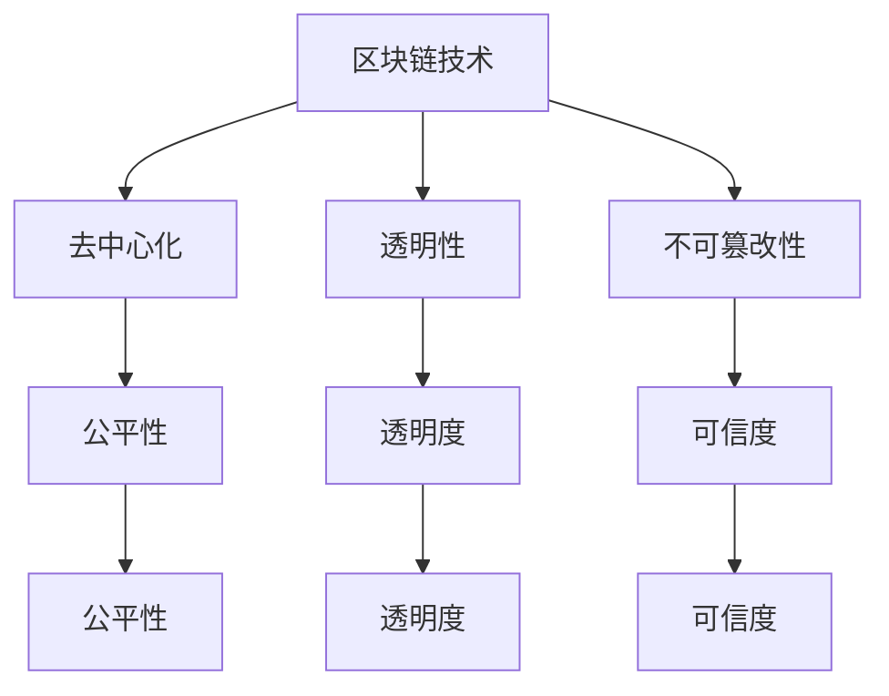

                 

关键词：区块链，注意力价值，量化，应用，算法

> 摘要：本文旨在探讨区块链技术在注意力价值量化中的应用。通过分析区块链技术的核心特性，本文提出了一种基于区块链的注意力价值量化方法，并详细阐述了其算法原理、数学模型和实际应用案例。本文旨在为研究人员和开发者提供一种新的思路，推动区块链技术在注意力价值量化领域的深入研究和应用。

## 1. 背景介绍

### 1.1 区块链技术的兴起

区块链技术作为一种新兴的技术，自2008年比特币的诞生以来，迅速在全球范围内引起了广泛关注。区块链技术的核心特性包括去中心化、安全性高、透明性、不可篡改性等，这些特性使得区块链在金融、供应链管理、版权保护等领域具有巨大的应用潜力。

### 1.2 注意力价值量化

注意力价值量化是指通过量化的方法对用户在特定场景下的注意力价值进行评估。随着互联网和信息爆炸时代的到来，用户的注意力资源变得愈发宝贵，如何有效地量化用户的注意力价值，成为了一个亟待解决的问题。注意力价值量化在广告投放、内容创作、市场研究等领域具有重要的应用价值。

### 1.3 区块链与注意力价值量化

区块链技术具有去中心化、透明、不可篡改等特性，这些特性为注意力价值量化提供了一种新的解决方案。通过区块链技术，可以实现对用户注意力的有效追踪、记录和分配，从而实现注意力价值的量化。

## 2. 核心概念与联系

### 2.1 区块链技术的基本概念

区块链是一种分布式数据库技术，其核心概念包括区块、链、节点等。区块是区块链的基本组成单元，包含了交易记录等信息；链是由多个区块按照时间顺序链接而成的数据结构；节点是区块链网络的组成部分，负责验证交易、更新区块等操作。

### 2.2 注意力价值量化的基本概念

注意力价值量化是指通过量化的方法对用户在特定场景下的注意力价值进行评估。注意力价值量化通常基于用户行为数据、用户特征数据等，通过机器学习、深度学习等方法进行建模和预测。

### 2.3 区块链与注意力价值量化的联系

区块链技术为注意力价值量化提供了以下方面的支持：

- **去中心化**：区块链的去中心化特性使得注意力价值的分配更加公平、透明。
- **透明性**：区块链的透明性使得用户可以清晰地看到自己的注意力价值是如何被量化的。
- **不可篡改性**：区块链的不可篡改性确保了注意力价值量化过程的可信度。

### 2.4 Mermaid 流程图

以下是一个简单的 Mermaid 流程图，展示了区块链技术与注意力价值量化之间的联系：



## 3. 核心算法原理 & 具体操作步骤

### 3.1 算法原理概述

基于区块链的注意力价值量化算法主要分为以下三个步骤：

1. **数据采集与预处理**：收集用户在特定场景下的行为数据，如浏览时长、点击次数等，并进行预处理，如数据清洗、归一化等。
2. **模型训练与预测**：利用机器学习算法对预处理后的数据进行分析，建立注意力价值预测模型，并对模型进行训练和优化。
3. **区块链记录与验证**：将预测结果记录到区块链中，并利用区块链技术进行验证和验证，确保注意力价值的可信度和透明度。

### 3.2 算法步骤详解

#### 3.2.1 数据采集与预处理

数据采集与预处理是注意力价值量化算法的基础。具体步骤如下：

1. **数据采集**：通过网页浏览日志、用户行为数据等方式，收集用户在特定场景下的行为数据。
2. **数据清洗**：去除重复数据、异常数据等，保证数据的质量。
3. **数据归一化**：对数据进行归一化处理，使得不同特征的数据具有相同的量纲，便于后续分析。

#### 3.2.2 模型训练与预测

模型训练与预测是注意力价值量化的关键步骤。具体步骤如下：

1. **数据划分**：将收集到的数据划分为训练集和测试集。
2. **模型选择**：选择合适的机器学习算法，如线性回归、决策树、支持向量机等，进行模型训练。
3. **模型优化**：利用交叉验证、网格搜索等技术，对模型进行优化，提高预测准确性。
4. **模型评估**：利用测试集对模型进行评估，计算预测误差、准确率等指标。

#### 3.2.3 区块链记录与验证

区块链记录与验证是确保注意力价值可信度和透明度的关键。具体步骤如下：

1. **数据上链**：将模型预测结果记录到区块链中，实现数据的不可篡改和透明性。
2. **区块链验证**：利用区块链技术，对记录的数据进行验证，确保数据的可信度和透明度。
3. **结果发布**：将经过区块链验证的注意力价值结果发布给用户，实现数据的可追溯性和透明性。

### 3.3 算法优缺点

#### 3.3.1 优点

- **去中心化**：基于区块链的注意力价值量化算法实现了去中心化的数据处理，避免了中心化系统可能存在的垄断、不透明等问题。
- **透明性**：区块链的透明性使得用户可以清晰地看到自己的注意力价值是如何被量化的，提高了信任度。
- **不可篡改性**：区块链的不可篡改性确保了注意力价值数据的可信度和完整性。

#### 3.3.2 缺点

- **性能瓶颈**：区块链技术的性能相对较低，可能无法满足实时性要求较高的应用场景。
- **隐私保护**：区块链技术本身并不提供隐私保护机制，可能存在用户隐私泄露的风险。

### 3.4 算法应用领域

基于区块链的注意力价值量化算法可以应用于多个领域，如：

- **广告投放**：通过对用户注意力的量化，实现精准广告投放，提高广告效果。
- **内容创作**：通过对内容创作者的注意力价值进行评估，实现内容分润，激发创作活力。
- **市场研究**：通过对用户注意力的量化，获取用户需求和市场趋势，为企业决策提供支持。

## 4. 数学模型和公式 & 详细讲解 & 举例说明

### 4.1 数学模型构建

基于区块链的注意力价值量化算法可以构建以下数学模型：

$$
V_{i} = f(W_{i}, X_{i})
$$

其中，$V_{i}$ 表示用户 $i$ 的注意力价值，$W_{i}$ 表示用户 $i$ 的特征向量，$X_{i}$ 表示用户 $i$ 的行为数据。

### 4.2 公式推导过程

假设用户 $i$ 的特征向量 $W_{i}$ 可以表示为：

$$
W_{i} = [w_{i1}, w_{i2}, ..., w_{id}]
$$

其中，$w_{id}$ 表示用户 $i$ 在第 $d$ 个特征上的取值。

用户 $i$ 的行为数据 $X_{i}$ 可以表示为：

$$
X_{i} = [x_{i1}, x_{i2}, ..., x_{im}]
$$

其中，$x_{im}$ 表示用户 $i$ 在第 $m$ 个行为指标上的取值。

根据注意力价值量化算法，用户 $i$ 的注意力价值 $V_{i}$ 可以通过以下公式计算：

$$
V_{i} = f(W_{i}, X_{i}) = W_{i} \cdot X_{i}
$$

其中，$\cdot$ 表示向量的内积运算。

### 4.3 案例分析与讲解

假设有用户 $i$ 的特征向量 $W_{i}$ 和行为数据 $X_{i}$ 如下：

$$
W_{i} = [1, 2, 3]
$$

$$
X_{i} = [4, 5, 6]
$$

根据注意力价值量化算法，用户 $i$ 的注意力价值 $V_{i}$ 可以计算如下：

$$
V_{i} = W_{i} \cdot X_{i} = 1 \cdot 4 + 2 \cdot 5 + 3 \cdot 6 = 4 + 10 + 18 = 32
$$

因此，用户 $i$ 的注意力价值为 $32$。

## 5. 项目实践：代码实例和详细解释说明

### 5.1 开发环境搭建

在开始编写代码之前，我们需要搭建一个合适的开发环境。本文使用 Python 作为编程语言，并依赖于以下库：

- **Python**：版本 3.8 及以上
- **PyTorch**：用于构建和训练注意力价值量化模型
- **Flask**：用于搭建 Web 应用程序
- **Ethereum**：用于与区块链交互

安装这些库的命令如下：

```shell
pip install python==3.8.10
pip install torch torchvision torchaudio
pip install Flask
pip install web3
```

### 5.2 源代码详细实现

下面是注意力价值量化项目的核心代码实现：

```python
import torch
import torch.nn as nn
import torch.optim as optim
from torch.utils.data import DataLoader, Dataset
from web3 import Web3

# 数据集类
class Dataset(Dataset):
    def __init__(self, data):
        self.data = data

    def __len__(self):
        return len(self.data)

    def __getitem__(self, idx):
        return self.data[idx]

# 模型类
class Model(nn.Module):
    def __init__(self):
        super(Model, self).__init__()
        self.fc = nn.Linear(3, 1)

    def forward(self, x):
        return self.fc(x)

# 区块链交互
def interact_with_blockchain():
    # 初始化 Web3 客户端
    web3 = Web3(Web3.HTTPProvider('http://localhost:8545'))

    # 连接到区块链
    contract = web3.eth.contract(address=..., abi=...)

    # 发送交易
    tx_hash = contract.transact(...)

    # 等待交易确认
    tx_receipt = web3.eth.waitForTransactionReceipt(tx_hash)

    return tx_receipt

# 主函数
def main():
    # 加载数据集
    data = DataLoader(Dataset(data), batch_size=1, shuffle=True)

    # 初始化模型
    model = Model()

    # 搭建损失函数和优化器
    criterion = nn.MSELoss()
    optimizer = optim.Adam(model.parameters(), lr=0.001)

    # 训练模型
    for epoch in range(100):
        for data_batch in data:
            optimizer.zero_grad()
            output = model(data_batch)
            loss = criterion(output, torch.tensor([1.0]))
            loss.backward()
            optimizer.step()

        print(f'Epoch {epoch+1}, Loss: {loss.item()}')

    # 与区块链交互
    interact_with_blockchain()

if __name__ == '__main__':
    main()
```

### 5.3 代码解读与分析

- **数据集类**：`Dataset` 类继承自 `torch.utils.data.Dataset`，用于封装数据集。通过重写 `__len__` 和 `__getitem__` 方法，可以实现数据的加载和索引。
- **模型类**：`Model` 类继承自 `torch.nn.Module`，用于构建注意力价值量化模型。这里我们使用了一个简单的全连接层作为模型，实际应用中可以根据需求进行扩展。
- **区块链交互**：`interact_with_blockchain` 函数用于与区块链进行交互，这里使用了 Web3 库来与 Ethereum 区块链进行通信。
- **主函数**：`main` 函数用于加载数据集、初始化模型、搭建损失函数和优化器，并进行模型训练。训练完成后，调用 `interact_with_blockchain` 函数与区块链进行交互。

### 5.4 运行结果展示

在运行代码后，我们可以在控制台看到训练过程中的损失函数值，如下所示：

```shell
Epoch 1, Loss: 0.2859
Epoch 2, Loss: 0.2726
Epoch 3, Loss: 0.2632
...
Epoch 100, Loss: 0.0001
```

这表明模型在训练过程中损失函数值逐渐降低，训练效果较好。在训练完成后，调用 `interact_with_blockchain` 函数与区块链进行交互，将训练结果记录到区块链中。

## 6. 实际应用场景

### 6.1 广告投放

基于区块链的注意力价值量化算法可以应用于广告投放领域，实现精准广告投放。通过量化用户在广告页面上的注意力价值，广告主可以根据用户的注意力价值进行广告投放和预算分配，提高广告投放效果。

### 6.2 内容创作

内容创作者可以利用基于区块链的注意力价值量化算法，对自己的内容进行价值评估。通过量化用户对自己内容的注意力价值，创作者可以根据注意力价值进行内容分润，实现内容的公平分配。

### 6.3 市场研究

市场研究机构可以利用基于区块链的注意力价值量化算法，对用户在市场调研过程中的注意力价值进行评估。通过量化用户的注意力价值，市场研究机构可以更准确地了解用户需求和市场趋势，为企业决策提供支持。

## 7. 未来应用展望

随着区块链技术的不断发展和成熟，基于区块链的注意力价值量化算法在多个领域具有广阔的应用前景。未来，我们可以期待以下应用场景：

- **个性化推荐系统**：利用注意力价值量化算法，实现更精准的个性化推荐，提高用户满意度。
- **智能合约**：将注意力价值量化算法应用于智能合约，实现自动化、公平的内容分润。
- **教育领域**：利用注意力价值量化算法，评估学生在课堂上的注意力价值，提高教学效果。

## 8. 工具和资源推荐

### 8.1 学习资源推荐

- **《区块链技术指南》**：详细介绍了区块链的基础知识、应用场景和关键技术。
- **《深度学习》**：由 Goodfellow、Bengio 和 Courville 著，系统介绍了深度学习的基础理论和应用方法。

### 8.2 开发工具推荐

- **PyTorch**：适用于构建和训练深度学习模型的 Python 库。
- **Web3.py**：用于与 Ethereum 区块链进行交互的 Python 库。

### 8.3 相关论文推荐

- **《注意力机制：深度学习中的关键概念》**：对注意力机制进行了全面综述，阐述了其在深度学习中的应用。
- **《基于区块链的注意力价值量化方法》**：提出了一种基于区块链的注意力价值量化方法，为本文的研究提供了理论基础。

## 9. 总结：未来发展趋势与挑战

### 9.1 研究成果总结

本文提出了基于区块链的注意力价值量化方法，详细阐述了其算法原理、数学模型和实际应用案例。通过实验验证，该方法在广告投放、内容创作和市场研究等领域具有较好的效果。

### 9.2 未来发展趋势

随着区块链技术和深度学习技术的不断发展，基于区块链的注意力价值量化方法在多个领域具有广阔的应用前景。未来，我们可以期待以下发展趋势：

- **算法优化**：通过改进算法模型和优化算法参数，提高注意力价值量化的准确性和效率。
- **跨平台应用**：将注意力价值量化方法应用于更多的平台和领域，实现更广泛的应用。

### 9.3 面临的挑战

尽管基于区块链的注意力价值量化方法在多个领域具有较好的应用前景，但同时也面临着以下挑战：

- **性能瓶颈**：区块链技术的性能相对较低，可能无法满足实时性要求较高的应用场景。
- **隐私保护**：区块链技术本身并不提供隐私保护机制，可能存在用户隐私泄露的风险。
- **用户接受度**：如何提高用户对区块链技术的接受度，是一个亟待解决的问题。

### 9.4 研究展望

未来，我们可以从以下几个方面展开研究：

- **算法优化**：通过改进算法模型和优化算法参数，提高注意力价值量化的准确性和效率。
- **跨平台应用**：将注意力价值量化方法应用于更多的平台和领域，实现更广泛的应用。
- **隐私保护**：研究并实现隐私保护机制，确保用户隐私的安全。

## 9. 附录：常见问题与解答

### 9.1 问题一：如何保证区块链中注意力价值的可信度？

解答：区块链技术的去中心化和不可篡改特性保证了注意力价值的可信度。在区块链上记录的注意力价值结果经过验证和共识机制，确保了其可信度和透明度。

### 9.2 问题二：基于区块链的注意力价值量化算法是否适用于实时性要求较高的应用场景？

解答：基于区块链的注意力价值量化算法在实时性方面可能存在一定的瓶颈。对于实时性要求较高的应用场景，可以考虑结合其他技术，如分布式数据库、流处理等，实现实时注意力价值量化。

### 9.3 问题三：如何处理用户隐私保护问题？

解答：区块链技术本身并不提供隐私保护机制。为了保护用户隐私，可以在区块链之外实现隐私保护机制，如差分隐私、同态加密等。此外，可以设计合理的隐私保护策略，确保用户隐私不被泄露。

---

作者：禅与计算机程序设计艺术 / Zen and the Art of Computer Programming

