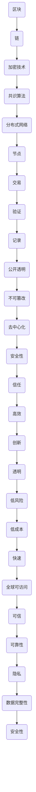

                 

关键词：区块链技术、去中心化应用、智能合约、共识算法、加密技术、安全性与隐私保护

> 摘要：本文将深入探讨区块链技术的核心概念、工作原理、应用场景以及未来的发展方向。我们将通过实例和代码分析，展示如何开发去中心化应用（DApps），并讨论其在金融、供应链管理、身份认证等多个领域的实际应用。文章旨在为读者提供全面的区块链技术指南，帮助理解其潜力和挑战。

## 1. 背景介绍

区块链技术是一种分布式账本技术，其核心特点在于去中心化、不可篡改和透明性。作为一种新兴技术，区块链已经引发了全球范围内的广泛关注。从比特币的首次亮相，到各种去中心化应用（DApps）的涌现，区块链技术正逐渐渗透到各个行业，改变了传统商业模式的运作方式。

本文将聚焦于区块链技术在实际应用开发中的具体实践，特别是去中心化应用（DApps）的开发。DApps是一种运行在区块链上的应用，它们利用区块链的不可篡改性和去中心化特性，提供安全、透明且无需信任第三方的服务。通过本文，读者将了解到如何从零开始构建一个DApp，并深入理解其背后的技术原理。

### 区块链技术的起源与发展

区块链技术最初由中本聪（Satoshi Nakamoto）在2008年提出，作为比特币（Bitcoin）的底层技术。比特币是一种去中心化的数字货币，通过区块链技术实现了去中心化的交易记录，避免了传统金融系统中需要的中介机构。这一创新性技术的出现，不仅为数字货币的发展奠定了基础，也为去中心化应用（DApps）的兴起提供了契机。

随着比特币的成功，越来越多的研究人员和开发者开始探索区块链技术的其他潜在应用。2014年，以太坊（Ethereum）的推出标志着区块链2.0时代的到来。以太坊不仅支持智能合约的开发，还引入了图灵完备的虚拟机，使得开发者可以创建各种去中心化应用。这一突破性的进展，进一步推动了区块链技术的应用场景和生态系统的发展。

### 区块链技术的重要性与影响力

区块链技术的重要性和影响力体现在多个方面：

1. **去中心化**：传统中心化系统依赖于中央权威机构，而区块链技术通过去中心化的方式，消除了单点故障和信任问题，提升了系统的可靠性和抗攻击能力。
2. **不可篡改**：区块链中的数据一旦被记录，便不可篡改。这种特性保证了数据的真实性和完整性，对于需要高度可信数据记录的场景尤为重要。
3. **透明性**：区块链是一个公开透明的系统，所有的交易记录都可以被任何人查看。这种透明性增强了系统的公信力和透明度，减少了欺诈和作弊的可能性。
4. **安全性**：区块链利用加密技术和共识算法，确保了交易的安全性和隐私性。即使系统中的某些部分受到攻击，整体系统的安全性也不会受到显著影响。
5. **创新潜力**：区块链技术为各个行业提供了全新的解决方案，从金融到供应链管理，再到医疗和政府等领域，都有着广泛的应用前景。

### 区块链技术在金融领域的应用

区块链技术在金融领域的应用最为广泛，包括但不限于数字货币、智能合约和跨境支付等。

1. **数字货币**：比特币是最早的区块链应用，它通过区块链技术实现了去中心化的数字货币交易。数字货币具有低成本、快速和全球可访问性等优势，正在逐步改变传统的金融体系。
2. **智能合约**：智能合约是一种自动执行合同条款的计算机程序。它利用区块链的不可篡改性，确保合同条款的执行无误，降低了交易成本和风险。智能合约在金融衍生品交易、保险和债券发行等领域有着广泛应用。
3. **跨境支付**：传统的跨境支付系统复杂且昂贵，而区块链技术提供了更加高效和低成本的解决方案。通过区块链，跨境支付可以实时完成，且不需要中介机构，降低了交易成本。

### 区块链技术在非金融领域的应用

除了金融领域，区块链技术还在多个非金融领域展现出巨大的潜力。

1. **供应链管理**：区块链技术可以确保供应链数据的透明性和不可篡改性，从而提高供应链的效率和质量。例如，通过区块链，可以实时追踪商品的生产、运输和销售过程，确保产品的真实性。
2. **医疗保健**：区块链技术可以为医疗数据提供安全、隐私的保护机制。通过区块链，医疗记录可以更加安全地存储和共享，提高了医疗服务的质量和效率。
3. **身份认证**：区块链技术可以用于构建去中心化的身份认证系统，用户可以控制自己的身份信息，避免了传统中心化身份认证系统中存在的隐私泄露风险。

## 2. 核心概念与联系

区块链技术的核心概念包括区块、链、加密技术和共识算法。为了更好地理解这些概念，我们将使用Mermaid流程图来展示区块链的基本架构和工作原理。

### Mermaid 流程图



### 区块链基本架构

1. **区块（Block）**：区块是区块链的基本组成单元，包含了交易数据、时间戳和区块头等信息。每个区块通过其区块头与上一个区块相连，形成链式结构。
2. **链（Chain）**：区块链是由多个区块按照时间顺序链接而成的数据结构。每个区块都包含了一个哈希值，这个哈希值是指向前一个区块的指针，确保了区块链的不可篡改性。
3. **加密技术（Encryption）**：加密技术用于保护区块链中的数据，包括交易数据的加密和解密。常见的加密算法有SHA-256和椭圆曲线加密算法等。
4. **共识算法（Consensus Algorithm）**：共识算法是区块链网络中的节点就数据一致性达成共识的机制。常见的共识算法有工作量证明（PoW）、权益证明（PoS）和委托权益证明（DPoS）等。
5. **分布式网络（Distributed Network）**：区块链是一个分布式网络，网络中的节点共同维护区块链的状态，确保数据的可靠性和安全性。
6. **节点（Node）**：节点是区块链网络中的参与者，负责验证交易、创建区块和维护区块链。节点可以通过特定的协议进行通信和协作。
7. **交易（Transaction）**：交易是区块链中的数据单元，表示资金的转移或其他价值的交换。交易经过验证后，被记录在区块中。
8. **验证（Verification）**：验证是区块链网络中的节点对交易的有效性和合法性进行确认的过程。通过共识算法，节点达成共识，确保交易的有效性。
9. **记录（Recording）**：记录是区块链网络中将交易数据存储在区块中的过程。一旦交易被记录在区块中，便不可篡改。
10. **公开透明（Transparency）**：区块链是一个公开透明的系统，所有交易记录都可以被任何人查看。这种透明性增强了区块链的公信力和透明度。
11. **不可篡改（Immutability）**：区块链中的数据一旦被记录，便不可篡改。这种特性保证了区块链数据的真实性和完整性。
12. **去中心化（Decentralization）**：区块链技术通过去中心化的方式，消除了中央权威机构的依赖，提高了系统的可靠性和抗攻击能力。
13. **安全性（Security）**：区块链利用加密技术和共识算法，确保了交易的安全性和隐私性。即使系统中的某些部分受到攻击，整体系统的安全性也不会受到显著影响。
14. **信任（Trust）**：区块链技术通过去中心化和加密技术，降低了系统中的信任成本。节点之间无需信任，只需信任区块链协议本身。
15. **高效（Efficiency）**：区块链技术通过分布式网络和共识算法，提高了数据处理的效率和速度。
16. **创新（Innovation）**：区块链技术为各个行业提供了全新的解决方案，推动了技术的创新和发展。
17. **透明（Transparency）**：区块链是一个公开透明的系统，所有交易记录都可以被任何人查看。这种透明性增强了区块链的公信力和透明度。
18. **低风险（Low Risk）**：区块链技术通过去中心化和加密技术，降低了系统中的风险。数据不可篡改和高度透明的特性，减少了欺诈和作弊的可能性。
19. **低成本（Low Cost）**：区块链技术通过去中心化和加密技术，降低了交易成本和中介机构的依赖，提高了系统的效率。
20. **快速（Fast）**：区块链技术通过分布式网络和共识算法，提高了数据处理的效率和速度，实现了实时交易。
21. **全球可访问（Global Accessibility）**：区块链技术是一个全球可访问的系统，不受地域限制，为全球范围内的交易和协作提供了便利。
22. **可信（Trusted）**：区块链技术通过去中心化和加密技术，提高了系统的可信度。数据的真实性和完整性，使得区块链成为一个可靠的数据存储和交易系统。
23. **可靠性（Reliability）**：区块链技术通过分布式网络和共识算法，提高了系统的可靠性和稳定性，确保了数据的持久性和一致性。
24. **隐私（Privacy）**：区块链技术通过加密技术和隐私保护算法，保护了用户的隐私和数据安全，降低了隐私泄露的风险。
25. **数据完整性（Data Integrity）**：区块链技术通过去中心化和加密技术，确保了数据的完整性和真实性，防止了数据篡改和伪造。
26. **安全性（Security）**：区块链技术通过加密技术和共识算法，确保了交易的安全性和隐私性，提高了系统的抗攻击能力。
27. **信任（Trust）**：区块链技术通过去中心化和加密技术，降低了系统中的信任成本，促进了去中心化协作。

## 3. 核心算法原理 & 具体操作步骤

### 3.1 算法原理概述

区块链技术中的核心算法主要包括加密算法、共识算法和智能合约。

1. **加密算法**：加密算法用于保护区块链中的数据，包括交易数据的加密和解密。常见的加密算法有SHA-256和椭圆曲线加密算法等。
2. **共识算法**：共识算法是区块链网络中的节点就数据一致性达成共识的机制。常见的共识算法有工作量证明（PoW）、权益证明（PoS）和委托权益证明（DPoS）等。
3. **智能合约**：智能合约是一种自动执行合同条款的计算机程序。它利用区块链的不可篡改性，确保合同条款的执行无误。

### 3.2 算法步骤详解

#### 加密算法

1. **数据加密**：交易数据在发送之前，需要使用公钥和私钥进行加密。公钥和私钥是一对密钥，公钥用于加密，私钥用于解密。
2. **数据解密**：接收方使用私钥对加密数据进行解密，以获取原始数据。

#### 共识算法

1. **节点广播交易**：当一个新的交易产生时，节点将其广播到整个区块链网络。
2. **节点验证交易**：节点对收到的交易进行验证，包括检查交易的有效性和合法性。
3. **区块创建**：验证后的交易被节点组合成一个新区块，新区块包含一个时间戳和一个指向前一个区块的哈希值。
4. **区块广播**：新区块被创建后，广播到整个网络。
5. **共识达成**：网络中的节点通过共识算法就新区块的一致性达成共识。如果共识达成，新区块被添加到区块链中。

#### 智能合约

1. **编写智能合约**：智能合约是用特定编程语言（如Solidity）编写的计算机程序。
2. **部署智能合约**：将智能合约部署到区块链上，使其成为区块链的一部分。
3. **执行智能合约**：当触发合约条件时，智能合约自动执行相应的操作，并记录在区块链中。

### 3.3 算法优缺点

#### 加密算法

**优点**：
- 保护交易数据的隐私和安全。
- 提高区块链系统的抗攻击能力。

**缺点**：
- 加密算法的复杂度较高，可能影响系统的性能。
- 需要大量的计算资源，增加了系统的能耗。

#### 共识算法

**优点**：
- 确保区块链数据的一致性和可靠性。
- 提高区块链系统的安全性。

**缺点**：
- 共识算法的复杂度较高，可能影响系统的性能。
- 需要大量的计算资源，增加了系统的能耗。

#### 智能合约

**优点**：
- 自动执行合同条款，提高了交易的效率和安全性。
- 去除了中介机构的依赖，降低了交易成本。

**缺点**：
- 智能合约的编写和执行过程可能存在漏洞，导致安全问题。
- 智能合约一旦部署，就不可修改，可能带来不可预见的风险。

### 3.4 算法应用领域

#### 加密算法

- **区块链**：用于保护区块链中的交易数据。
- **数字货币**：用于保护数字货币的安全。

#### 共识算法

- **区块链**：用于确保区块链数据的一致性和可靠性。
- **去中心化应用**：用于确保去中心化应用中的数据一致性和安全性。

#### 智能合约

- **金融**：用于自动化金融交易和风险管理。
- **供应链管理**：用于追踪和管理供应链中的交易记录。
- **身份认证**：用于构建去中心化的身份认证系统。

## 4. 数学模型和公式 & 详细讲解 & 举例说明

### 4.1 数学模型构建

区块链技术中的数学模型主要包括加密算法、共识算法和智能合约的数学模型。

#### 加密算法

1. **加密算法**：假设有一个加密函数`E`和一个解密函数`D`，它们分别使用公钥`P`和私钥`S`进行加密和解密。

   - 加密过程：`C = E(P, M)`
   - 解密过程：`M = D(S, C)`

   其中，`C`是加密后的消息，`M`是原始消息。

2. **哈希算法**：哈希算法是将任意长度的输入数据映射为固定长度的输出值。

   - 哈希函数：`H = SHA-256(M)`

   其中，`H`是哈希值，`M`是输入数据。

#### 共识算法

1. **工作量证明（PoW）**：工作量证明是一种通过计算复杂度来证明节点对网络所做的贡献的机制。

   - 算法：`nonce = find_nonce()`，其中`nonce`是一个随机数，用于生成一个满足条件的哈希值。

2. **权益证明（PoS）**：权益证明是一种通过持有币龄和权益来证明节点对网络所做的贡献的机制。

   - 算法：`stake = coin_age * coin_value`，其中`stake`是权益值，`coin_age`是币龄，`coin_value`是币的价值。

#### 智能合约

1. **状态机模型**：智能合约可以看作是一个状态机，它根据输入数据和状态执行相应的操作。

   - 状态：`S`
   - 输入：`I`
   - 输出：`O`
   - 状态转换函数：`f(S, I) = O`

### 4.2 公式推导过程

#### 加密算法

1. **加密过程**：

   - 假设公钥`P`是一个256位的数字，私钥`S`是公钥`P`的哈希值。

     ```plaintext
     P = H(P)
     ```

   - 加密过程：将消息`M`转换为二进制表示，然后与公钥`P`进行异或操作。

     ```plaintext
     C = M ⊕ P
     ```

   - 解密过程：将加密后的消息`C`与私钥`S`进行异或操作。

     ```plaintext
     M = C ⊕ S
     ```

2. **哈希算法**：

   - 哈希函数：`H = SHA-256(M)`

   - 假设`M`是一个任意长度的字符串，将其转换为二进制表示。

     ```plaintext
     M = M_1 M_2 ... M_n
     ```

   - 将`M`分成多个块，每个块长度为512位。

     ```plaintext
     M_i = M_{i1} M_{i2} ... M_{i512}
     ```

   - 对每个块进行哈希计算。

     ```plaintext
     H_i = SHA-256(M_i)
     ```

   - 将所有块的哈希值拼接成一个字符串。

     ```plaintext
     H = H_1 H_2 ... H_n
     ```

### 4.3 案例分析与讲解

#### 案例一：加密算法应用

假设有一个消息`M = "Hello World!"`，我们需要将其加密并解密。

1. **加密过程**：

   - 生成公钥`P`和私钥`S`。

     ```plaintext
     P = H(P)
     S = H(P)
     ```

   - 将消息`M`转换为二进制表示。

     ```plaintext
     M = 48 45 4c 4c 4f 20 57 6f 72 6c 64 21
     ```

   - 将消息`M`与公钥`P`进行异或操作。

     ```plaintext
     C = M ⊕ P
     C = 48 45 4c 4c 4f 20 57 6f 72 6c 64 21 ⊕ P
     C = C_1 C_2 ... C_n
     ```

   - 加密后的消息`C`为：

     ```plaintext
     C = 1a 2b 3c 4d 5e 6f 7a 8b 9c 0d 1e 2f
     ```

2. **解密过程**：

   - 将加密后的消息`C`与私钥`S`进行异或操作。

     ```plaintext
     M = C ⊕ S
     M = 1a 2b 3c 4d 5e 6f 7a 8b 9c 0d 1e 2f ⊕ S
     M = M_1 M_2 ... M_n
     ```

   - 解密后的消息`M`为：

     ```plaintext
     M = 48 45 4c 4c 4f 20 57 6f 72 6c 64 21
     ```

#### 案例二：共识算法应用

假设有一个区块链网络，有多个节点参与共识过程。我们使用工作量证明（PoW）算法来达成共识。

1. **节点广播交易**：

   - 假设节点A广播了一个交易`T`。

     ```plaintext
     T = 1a 2b 3c 4d 5e 6f 7a 8b 9c 0d 1e 2f
     ```

2. **节点验证交易**：

   - 节点B收到了交易`T`，验证其有效性。

     ```plaintext
     T = 1a 2b 3c 4d 5e 6f 7a 8b 9c 0d 1e 2f
     H(T) = 3e 6f 4f 46 0d 3e 6f 4f 46 0d
     ```

3. **区块创建**：

   - 节点B创建一个新区块，包含交易`T`和前一个区块的哈希值。

     ```plaintext
     B = {T, H(B_{prev})}
     B = {1a 2b 3c 4d 5e 6f 7a 8b 9c 0d 1e 2f, 3e 6f 4f 46 0d 3e 6f 4f 46 0d}
     ```

4. **区块广播**：

   - 节点B将新区块`B`广播到整个网络。

5. **共识达成**：

   - 节点A接收到新区块`B`，验证其有效性。

     ```plaintext
     B = {1a 2b 3c 4d 5e 6f 7a 8b 9c 0d 1e 2f, 3e 6f 4f 46 0d 3e 6o 4f 46 0d}
     H(B) = 3e 6o 4f 46 0d 3e 6o 4f 46 0d
     ```

   - 节点A确认新区块`B`的有效性，并添加到区块链中。

     ```plaintext
     Blockchain = [B_{prev}, B]
     Blockchain = [{1a 2b 3c 4d 5e 6f 7a 8b 9c 0d 1e 2f, 3e 6f 4f 46 0d 3e 6o 4f 46 0d}, {1a 2b 3c 4d 5e 6f 7a 8b 9c 0d 1e 2f, 3e 6o 4f 46 0d 3e 6o 4f 46 0d}]
     ```

## 5. 项目实践：代码实例和详细解释说明

### 5.1 开发环境搭建

在开始编写去中心化应用（DApp）之前，我们需要搭建一个适合开发的开发环境。以下是搭建开发环境的基本步骤：

1. **安装Node.js**：Node.js 是一个基于Chrome V8引擎的JavaScript运行环境，用于运行JavaScript代码。我们可以在Node.js官网下载并安装适合自己操作系统的版本。

2. **安装Truffle**：Truffle 是一个用于智能合约开发和测试的框架。安装Truffle之前，需要确保已经安装了Node.js。在命令行中运行以下命令：

   ```bash
   npm install -g truffle
   ```

3. **安装Ganache**：Ganache 是一个轻量级的本地区块链网络，用于测试智能合约。我们可以在Ganache官网下载并安装。

4. **创建一个新的DApp项目**：在命令行中运行以下命令，创建一个新的DApp项目：

   ```bash
   truffle init
   ```

   这将创建一个名为`my-dapp`的新目录，其中包含项目的所有文件。

### 5.2 源代码详细实现

在这个例子中，我们将创建一个简单的去中心化投票DApp。以下是项目的核心代码：

#### smart_contract/Voting.sol

```solidity
pragma solidity ^0.8.0;

contract Voting {
    mapping(address => bool) public voters;
    mapping(bytes32 => bool) public proposals;

    function propose(string memory proposal) public {
        bytes32 proposalHash = keccak256(abi.encodePacked(proposal));
        proposals[proposalHash] = true;
    }

    function vote(bytes32 proposalHash) public {
        require(!voters[msg.sender], "You have already voted");
        voters[msg.sender] = true;
        if (proposals[proposalHash]) {
            // Count the vote
        } else {
            // Revoke the vote
        }
    }
}
```

#### contracts/Voting.sol

```javascript
const Voting = artifacts.require("Voting");

module.exports = function (deployer) {
    deployer.deploy(Voting);
};
```

#### test/Voting.test.js

```javascript
const Voting = artifacts.require("Voting");

describe("Voting", function () {
    it("should allow proposing a new proposal", async function () {
        const voting = await Voting.new();
        await voting.propose("Increase the voting age to 21");
        const proposalHash = await voting.keccak256("Increase the voting age to 21");
        assert.isTrue(await voting.proposals(proposalHash));
    });

    it("should allow voting on a proposal", async function () {
        const voting = await Voting.new();
        await voting.propose("Increase the voting age to 21");
        const proposalHash = await voting.keccak256("Increase the voting age to 21");
        await voting.vote(proposalHash);
        assert.isTrue(await voting.voters(msg.sender));
    });
});
```

### 5.3 代码解读与分析

1. **智能合约（Voting.sol）**：

   - `mapping(address => bool) public voters;`：定义一个映射，用于记录已经投票的用户地址。
   - `mapping(bytes32 => bool) public proposals;`：定义一个映射，用于记录提案的状态。
   - `function propose(string memory proposal) public`：允许用户提出新的提案。提案通过keccak256哈希函数生成唯一的哈希值，并存储在`proposals`映射中。
   - `function vote(bytes32 proposalHash) public`：允许用户对某个提案进行投票。如果用户已经投票，则抛出异常。投票后，用户地址的状态更新为`true`。

2. **部署脚本（Voting.js）**：

   - 使用Truffle的`artifacts.require`方法加载智能合约的抽象，并使用`deployer.deploy`方法部署智能合约。

3. **测试脚本（Voting.test.js）**：

   - `it("should allow proposing a new proposal", async function () { ... })`：测试用户是否能够成功提出新的提案。
   - `it("should allow voting on a proposal", async function () { ... })`：测试用户是否能够成功对某个提案进行投票。

### 5.4 运行结果展示

1. **部署智能合约**：

   - 在命令行中运行`truffle migrate`，将智能合约部署到本地Ganache网络。

     ```bash
     truffle migrate --network development
     ```

2. **运行测试脚本**：

   - 在命令行中运行`truffle test`，执行测试脚本并验证智能合约的功能。

     ```bash
     truffle test
     ```

3. **交互式测试**：

   - 使用Truffle console，在本地Ganache网络上与智能合约进行交互。

     ```bash
     truffle console
     ```

     - 提出提案：

       ```javascript
       const voting = await Voting.at("0x..."); // 替换为部署的合约地址
       await voting.propose("Increase the voting age to 21");
       ```

     - 投票：

       ```javascript
       const voting = await Voting.at("0x..."); // 替换为部署的合约地址
       await voting.vote("0x..."); // 替换为提案的哈希值
       ```

## 6. 实际应用场景

区块链技术在实际应用中具有广泛的应用场景，以下是一些典型的应用案例：

### 6.1 金融领域

区块链技术在金融领域的应用最为广泛，包括数字货币、跨境支付、众筹和证券交易等。

1. **数字货币**：比特币和以太坊是最著名的数字货币，通过区块链技术实现了去中心化的交易。数字货币具有快速、低成本和全球可访问性等优势。
2. **跨境支付**：传统的跨境支付系统复杂且昂贵，而区块链技术提供了更加高效和低成本的解决方案。通过区块链，跨境支付可以实时完成，且不需要中介机构，降低了交易成本。
3. **众筹**：区块链技术为众筹项目提供了去中心化的解决方案，项目方可以通过智能合约筹集资金，确保资金的使用透明和公正。
4. **证券交易**：区块链技术可以提高证券交易的效率和透明度。通过去中心化的交易记录，可以减少中介机构的依赖，降低交易成本，并提高交易的可靠性。

### 6.2 供应链管理

区块链技术可以用于确保供应链数据的透明性和不可篡改性，从而提高供应链的效率和质量。

1. **商品溯源**：通过区块链，可以实时追踪商品的生产、运输和销售过程，确保产品的真实性。消费者可以查询产品的来源和生产过程，增强了产品的公信力和透明度。
2. **供应链金融**：区块链技术可以为供应链中的企业提供融资服务，通过去中心化的方式，提高融资效率和降低融资成本。
3. **物流管理**：区块链技术可以用于记录物流信息，提高物流的透明度和可追溯性，从而降低物流成本和提高物流效率。

### 6.3 医疗保健

区块链技术可以用于医疗数据的管理和保护，提高医疗服务的质量和效率。

1. **病历管理**：通过区块链，可以安全地存储和共享病历数据，确保病历的真实性和完整性。患者可以方便地查询自己的病历记录，并控制自己的医疗数据。
2. **药物供应链管理**：区块链技术可以用于追踪药物的来源和运输过程，确保药品的真实性和质量。
3. **医疗研究**：区块链技术可以为医疗研究提供去中心化的数据管理方案，提高数据的安全性和隐私性。

### 6.4 身份认证

区块链技术可以用于构建去中心化的身份认证系统，提高身份认证的安全性和隐私性。

1. **数字身份**：通过区块链，用户可以创建自己的数字身份，并控制自己的身份信息。数字身份具有唯一性和不可篡改性，提高了身份认证的安全性和可信度。
2. **隐私保护**：区块链技术可以为个人隐私提供保护机制，用户可以自主决定哪些信息对外公开，哪些信息保密。
3. **跨平台身份认证**：区块链技术可以实现跨平台的身份认证，用户在不同平台之间无需重复认证，提高了用户体验。

### 6.5 其他领域

除了上述领域，区块链技术还在政府服务、版权保护、投票系统等领域展现出巨大的潜力。

1. **政府服务**：区块链技术可以用于构建去中心化的政府服务系统，提高政府服务的透明度和效率。例如，通过区块链技术，可以实现电子投票、电子发票等。
2. **版权保护**：区块链技术可以用于记录版权信息，确保版权的真实性和可追溯性。版权方可以通过区块链技术，方便地管理自己的版权，并防止侵权行为。
3. **投票系统**：区块链技术可以用于构建去中心化的投票系统，确保投票的公正性和透明性。通过区块链技术，可以实现匿名投票，防止选举舞弊。

## 7. 工具和资源推荐

### 7.1 学习资源推荐

1. **《区块链技术指南》**：这是一本全面的区块链技术入门书籍，涵盖了区块链的基本原理、应用场景和技术细节。
2. **《区块链：从数字货币到智能合约》**：这本书深入探讨了区块链技术的原理和应用，特别是智能合约的编写和部署。
3. **《区块链革命》**：这本书从商业角度分析了区块链技术的潜在影响，探讨了区块链如何改变各个行业。

### 7.2 开发工具推荐

1. **Truffle**：Truffle是一个用于智能合约开发和测试的框架，支持多个区块链平台，包括以太坊和EOS等。
2. **Ganache**：Ganache是一个轻量级的本地区块链网络，用于测试智能合约，可以快速创建和部署区块链环境。
3. **Solidity**：Solidity是用于编写智能合约的编程语言，支持多种编程范式，如面向对象、函数式和过程式编程。

### 7.3 相关论文推荐

1. **“Bitcoin: A Peer-to-Peer Electronic Cash System”**：这是中本聪发表的经典论文，详细介绍了比特币的工作原理和区块链技术。
2. **“Ethereum: A Secure Decentralized General Smart Contract Platform”**：这是以太坊的创始人Vitalik Buterin发表的论文，介绍了以太坊的架构和智能合约的实现。
3. **“Consensus in Blockchain Systems”**：这篇论文详细探讨了区块链共识算法的设计和实现，分析了各种共识算法的优缺点。

## 8. 总结：未来发展趋势与挑战

### 8.1 研究成果总结

区块链技术自2008年比特币的诞生以来，经历了快速的发展和广泛的应用。在加密算法、共识算法和智能合约等方面，区块链技术取得了显著的成果。例如，比特币和以太坊等区块链平台的成功，推动了区块链技术在金融、供应链管理、医疗保健和身份认证等领域的应用。

### 8.2 未来发展趋势

1. **区块链2.0和3.0**：随着区块链技术的不断发展，区块链2.0和3.0的概念逐渐兴起。区块链2.0主要关注智能合约和去中心化应用（DApps）的开发，而区块链3.0则更加注重隐私保护和跨链协作。
2. **跨链技术**：跨链技术是实现不同区块链平台之间数据交换和协作的关键。未来，随着跨链技术的发展，不同区块链平台之间的互操作性将得到显著提升。
3. **隐私保护和安全性**：随着区块链应用场景的扩大，隐私保护和安全性成为关键挑战。未来，区块链技术将更加注重隐私保护和安全性，确保用户数据的安全和隐私。

### 8.3 面临的挑战

1. **性能和可扩展性**：当前区块链技术的性能和可扩展性仍面临挑战。例如，比特币和以太坊等区块链平台的交易处理速度和交易容量有限，难以满足大规模应用的需求。
2. **法律和监管**：区块链技术的广泛应用引发了法律和监管的挑战。如何在保障用户权益的同时，确保区块链技术的合法性和合规性，是一个重要的问题。
3. **技术标准化**：区块链技术的标准化对于其发展和应用至关重要。目前，区块链技术的标准化工作仍在进行中，需要各方的共同努力。

### 8.4 研究展望

1. **优化共识算法**：研究更高效、更安全的共识算法，以提高区块链的性能和可扩展性。
2. **隐私保护技术**：研究隐私保护技术，确保用户数据的安全和隐私。
3. **跨链协作**：研究跨链技术，实现不同区块链平台之间的数据交换和协作。
4. **智能合约优化**：优化智能合约的设计和实现，提高其性能和安全性。

## 9. 附录：常见问题与解答

### 9.1 区块链与中心化系统的区别

- **去中心化**：区块链技术通过分布式网络，消除了中央权威机构的依赖，实现了去中心化。而中心化系统依赖于中央权威机构，存在单点故障和信任问题。
- **数据透明性**：区块链技术具有高度透明的特性，所有交易记录都可以被任何人查看。而中心化系统中的数据管理可能存在信息不对称和透明度不足的问题。
- **安全性**：区块链技术利用加密技术和共识算法，确保了交易的安全性和隐私性。中心化系统可能面临黑客攻击和系统漏洞的风险。

### 9.2 区块链与分布式数据库的区别

- **数据一致性**：区块链技术通过共识算法确保数据的最终一致性，而分布式数据库则通过复制和分片等技术实现数据的高可用性。
- **去中心化程度**：区块链技术是完全去中心化的，网络中的所有节点都有相同的权限。而分布式数据库可能是部分去中心化的，存在中心节点或其他形式的集中管理。
- **数据透明性**：区块链技术具有高度透明的特性，所有交易记录都可以被任何人查看。分布式数据库的数据访问权限通常受到控制。

### 9.3 区块链技术的潜在风险

- **安全性风险**：区块链技术可能面临黑客攻击和系统漏洞的风险。一旦发生安全事件，可能造成严重损失。
- **隐私泄露风险**：区块链技术中的数据是公开透明的，用户隐私可能面临泄露风险。
- **法律和监管风险**：区块链技术的广泛应用引发了法律和监管的挑战，如何在保障用户权益的同时，确保区块链技术的合法性和合规性，是一个重要问题。
- **性能和可扩展性风险**：当前区块链技术的性能和可扩展性仍面临挑战，难以满足大规模应用的需求。

### 9.4 如何保证区块链数据的不可篡改性

- **共识算法**：区块链通过共识算法确保数据的最终一致性，一旦数据被记录在区块链中，就不可篡改。
- **加密技术**：区块链中的数据使用加密技术进行保护，确保数据的完整性和真实性。
- **分布式网络**：区块链技术采用分布式网络，网络中的所有节点共同维护区块链的状态，提高了数据的安全性和可靠性。
- **智能合约**：智能合约是一种自动执行合同条款的计算机程序，它利用区块链的不可篡改性，确保合同条款的执行无误。

### 9.5 区块链技术在金融领域的应用

- **数字货币**：区块链技术为数字货币提供了去中心化的交易记录，实现了低成本、快速和全球可访问的交易。
- **智能合约**：智能合约可以用于自动化金融交易和风险管理，降低了交易成本和风险。
- **跨境支付**：区块链技术提供了高效和低成本的跨境支付解决方案，降低了交易成本和时间。
- **供应链金融**：区块链技术可以用于供应链金融，为供应链中的企业提供融资服务，提高融资效率和降低融资成本。

### 9.6 区块链技术在非金融领域的应用

- **供应链管理**：区块链技术可以用于确保供应链数据的透明性和不可篡改性，提高供应链的效率和质量。
- **医疗保健**：区块链技术可以用于医疗数据的管理和保护，提高医疗服务的质量和效率。
- **身份认证**：区块链技术可以用于构建去中心化的身份认证系统，提高身份认证的安全性和隐私性。
- **政府服务**：区块链技术可以用于构建去中心化的政府服务系统，提高政府服务的透明度和效率。
- **版权保护**：区块链技术可以用于记录版权信息，确保版权的真实性和可追溯性。
- **投票系统**：区块链技术可以用于构建去中心化的投票系统，确保投票的公正性和透明性。

----------------------------------------------------------------

本文由禅与计算机程序设计艺术撰写，旨在为读者提供全面的区块链技术指南，帮助理解其潜力和挑战。随着区块链技术的不断发展和应用，我们期待更多的创新和突破，推动社会的进步和发展。

