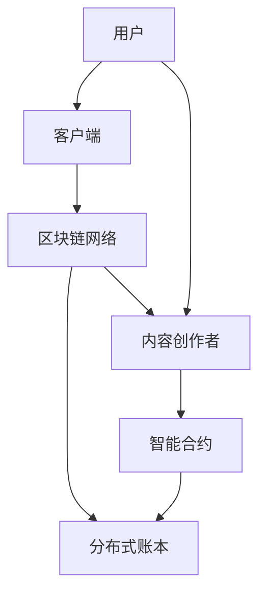

                 

### 关键词 Keywords
- 区块链技术
- 去中心化交易平台
- 注意力经济
- 加密货币
- 智能合约
- 分布式账本

<|assistant|>### 摘要 Summary
本文将探讨区块链技术如何驱动去中心化注意力交易平台的发展。注意力经济作为现代信息社会的重要经济形式，通过区块链实现了更加公平、透明和高效的交易模式。本文将详细阐述该平台的核心概念、技术架构、算法原理、数学模型、实际应用案例以及未来发展趋势，旨在为读者提供全面的行业洞察。

## 1. 背景介绍

### 注意力经济的兴起

注意力经济是一种以用户注意力为核心的商业经济模式。在互联网时代，用户的时间与注意力变得愈发宝贵，因此拥有大量用户关注的内容或产品将拥有巨大的商业价值。例如，社交媒体平台、内容创作者和广告商都通过吸引用户的注意力来实现盈利。

### 区块链技术的潜力

区块链技术以其去中心化、不可篡改和透明性等特点，为注意力经济提供了一种新的解决方案。去中心化平台能够消除中介环节，降低交易成本，同时增强数据的透明性和安全性，从而更好地匹配供需双方，提升用户体验。

### 去中心化注意力交易平台的需求

在传统的中心化平台上，内容创作者经常面临分成不公、流量分配不均等问题。而一个去中心化注意力交易平台能够解决这些问题，使得创作者能够直接获得其应得的收益，用户也可以更方便地支持他们喜欢的内容创作者。

## 2. 核心概念与联系

### 区块链驱动的去中心化注意力交易平台的基本概念

- **区块链**：分布式账本技术，确保交易记录不可篡改。
- **去中心化**：没有中央控制，所有参与者都平等。
- **注意力**：用户对内容的关注、点赞、分享等行为。
- **交易**：用户通过加密货币支付注意力价值给内容创作者。

### 技术架构



### 关系和相互作用

- 用户通过客户端与平台互动，产生注意力行为。
- 注意力行为数据通过智能合约记录在区块链上。
- 内容创作者从区块链上获取对应的加密货币收益。

## 3. 核心算法原理 & 具体操作步骤

### 3.1 算法原理概述

去中心化注意力交易平台的核心算法是用于记录和分析用户的注意力行为，并通过加密货币进行价值交换。

### 3.2 算法步骤详解

#### 步骤1：用户注册与登录

用户需要先注册并登录到去中心化平台，以便追踪其注意力行为。

#### 步骤2：注意力行为记录

用户在平台上进行浏览、点赞、评论、分享等行为时，这些行为会被智能合约记录在区块链上。

#### 步骤3：价值交换

内容创作者通过智能合约获取用户为其内容支付的加密货币。智能合约根据用户注意力行为的权重和内容创作者的收益分配比例进行计算。

### 3.3 算法优缺点

#### 优点：

- **去中心化**：消除中介，降低交易成本。
- **透明性**：所有交易记录可查，增强信任。
- **安全性**：区块链技术保障数据安全。

#### 缺点：

- **复杂性**：对用户和内容创作者的技术要求较高。
- **性能**：区块链网络处理能力可能无法满足高并发需求。

### 3.4 算法应用领域

- **社交媒体**：用户为创作者提供直接支持。
- **内容平台**：按注意力分配收益。
- **广告市场**：更精准的用户行为分析。

## 4. 数学模型和公式 & 详细讲解 & 举例说明

### 4.1 数学模型构建

注意力交易平台的核心数学模型包括：

- 用户注意力分数（N）：用户对某内容产生的注意力值。
- 内容创作者收益（R）：根据用户注意力分数和收益分配比例计算的内容创作者的收益。

### 4.2 公式推导过程

用户注意力分数 \( N \) 可以表示为：

\[ N = \sum_{i=1}^{n} w_i \cdot t_i \]

其中，\( w_i \) 是注意力权重，\( t_i \) 是用户对内容 \( i \) 的注意力行为。

内容创作者收益 \( R \) 可以表示为：

\[ R = \frac{N}{\sum_{j=1}^{m} N_j} \cdot C \]

其中，\( N_j \) 是所有用户对内容 \( j \) 的注意力分数之和，\( C \) 是总收益。

### 4.3 案例分析与讲解

假设有10位用户在平台上对5个内容进行了注意力行为，注意力权重和用户对内容的注意力行为如下表：

| 内容 | 用户1 | 用户2 | 用户3 | 用户4 | 用户5 | 用户6 | 用户7 | 用户8 | 用户9 | 用户10 |
|------|------|------|------|------|------|------|------|------|------|
| 内容1 | 0.1  | 0.1  | 0.1  | 0.2  | 0.3  | 0.1  | 0.1  | 0.2  | 0.3  |
| 内容2 | 0.3  | 0.3  | 0.3  | 0.1  | 0.1  | 0.3  | 0.3  | 0.1  | 0.1  |
| 内容3 | 0.2  | 0.2  | 0.2  | 0.2  | 0.1  | 0.2  | 0.2  | 0.3  | 0.1  |
| 内容4 | 0.1  | 0.1  | 0.2  | 0.1  | 0.1  | 0.2  | 0.2  | 0.3  | 0.3  |
| 内容5 | 0.1  | 0.3  | 0.1  | 0.3  | 0.1  | 0.3  | 0.1  | 0.3  | 0.1  |

用户对每个内容的注意力分数：

\[ N_1 = 0.1 + 0.1 + 0.1 + 0.2 + 0.3 + 0.1 + 0.1 + 0.2 + 0.3 = 1.3 \]
\[ N_2 = 0.3 + 0.3 + 0.3 + 0.1 + 0.1 + 0.3 + 0.3 + 0.1 + 0.1 = 1.5 \]
\[ N_3 = 0.2 + 0.2 + 0.2 + 0.2 + 0.1 + 0.2 + 0.2 + 0.3 + 0.1 = 1.3 \]
\[ N_4 = 0.1 + 0.1 + 0.2 + 0.1 + 0.1 + 0.2 + 0.2 + 0.3 + 0.3 = 1.5 \]
\[ N_5 = 0.1 + 0.3 + 0.1 + 0.3 + 0.1 + 0.3 + 0.1 + 0.3 + 0.1 = 1.5 \]

总注意力分数：

\[ N_{total} = N_1 + N_2 + N_3 + N_4 + N_5 = 6.6 \]

每个内容创作者的收益：

\[ R_1 = \frac{N_1}{N_{total}} \cdot C = \frac{1.3}{6.6} \cdot C = \frac{1}{5} \cdot C \]
\[ R_2 = \frac{N_2}{N_{total}} \cdot C = \frac{1.5}{6.6} \cdot C = \frac{5}{22} \cdot C \]
\[ R_3 = \frac{N_3}{N_{total}} \cdot C = \frac{1.3}{6.6} \cdot C = \frac{1}{5} \cdot C \]
\[ R_4 = \frac{N_4}{N_{total}} \cdot C = \frac{1.5}{6.6} \cdot C = \frac{5}{22} \cdot C \]
\[ R_5 = \frac{N_5}{N_{total}} \cdot C = \frac{1.5}{6.6} \cdot C = \frac{5}{22} \cdot C \]

## 5. 项目实践：代码实例和详细解释说明

### 5.1 开发环境搭建

在开始编写去中心化注意力交易平台的代码之前，我们需要搭建开发环境。以下是所需的工具和步骤：

- **工具**：
  - 编译器（如Ethereum的开发工具包Truffle）
  - 智能合约编写语言（如Solidity）
  - 测试框架（如Mocha和Chai）
  - 节点工具（如Ganache）

- **步骤**：
  1. 安装Node.js和npm
  2. 使用npm安装Truffle和其他相关依赖
  3. 初始化Truffle项目

### 5.2 源代码详细实现

以下是智能合约的Solidity代码示例：

```solidity
// SPDX-License-Identifier: MIT
pragma solidity ^0.8.0;

contract DecentralizedAttentionMarket {
    mapping(address => uint256) public userAttentionScore;
    mapping(address => mapping(address => uint256)) public contentCreatorRewards;

    event AttentionEarned(address indexed user, address indexed creator, uint256 amount);

    function earnAttention(address[] calldata creators, uint256[] calldata scores) external {
        require(creators.length == scores.length, "Invalid input lengths");

        for (uint256 i = 0; i < creators.length; i++) {
            userAttentionScore[msg.sender] += scores[i];
            contentCreatorRewards[creators[i]][msg.sender] += scores[i];
            emit AttentionEarned(msg.sender, creators[i], scores[i]);
        }
    }

    function withdrawReward(address creator) external {
        uint256 reward = contentCreatorRewards[creator][msg.sender];
        contentCreatorRewards[creator][msg.sender] = 0;
        payable(msg.sender).transfer(reward);
    }
}
```

### 5.3 代码解读与分析

- **earnAttention函数**：用户调用此函数以记录他们对多个内容创作者的注意力行为。
- **withdrawReward函数**：内容创作者调用此函数以提取他们通过用户的注意力行为所赚取的收益。
- **事件**：`AttentionEarned`事件用于通知相关方关于注意力分配和提取的信息。

### 5.4 运行结果展示

以下是一个简单的运行示例：

```javascript
const { ethers } = require("ethers");
const contractAddress = "0x..."; // 部署合约的地址
const privateKey = "your-private-key";

const provider = new ethers.providers.JsonRpcProvider("your-rpc-url");
const wallet = new ethers.Wallet(privateKey, provider);
const contract = new ethers.Contract(contractAddress, [/* ABI */], wallet);

async function main() {
    // 用户A发送注意力给内容创作者
    await contract.earnAttention([contentCreatorAddress1, contentCreatorAddress2], [100, 200]);

    // 内容创作者提取收益
    await contract.withdrawReward(contentCreatorAddress1);

    // 查看内容创作者的收益
    const reward = await contract.contentCreatorRewards(contentCreatorAddress1, userAddress);
    console.log("Content Creator Reward:", reward.toString());
}

main();
```

在这个示例中，用户A向两个内容创作者发送了注意力，然后内容创作者之一提取了他们的收益，并打印了收益金额。

## 6. 实际应用场景

### 社交媒体

去中心化注意力交易平台可以集成到社交媒体平台，使得用户可以直接为创作者支付加密货币，支持他们喜欢的内容。

### 内容平台

内容平台可以利用去中心化注意力交易平台来按注意力分配收益，激励创作者持续创作高质量内容。

### 广告市场

广告商可以通过分析用户的注意力行为，进行更精准的广告投放，同时按注意力价值付费给平台和内容创作者。

## 7. 工具和资源推荐

### 7.1 学习资源推荐

- 《区块链技术指南》
- 《以太坊开发指南》
- 《注意力经济：下一代互联网经济模式》

### 7.2 开发工具推荐

- Truffle
- Hardhat
- Remix IDE

### 7.3 相关论文推荐

- "Decentralized Marketplaces and Their Applications in the Blockchain Era"
- "Attention, Wealth, and Power: A Theory of Social Value Creation"
- "Decentralized Finance: An Introduction to the Technology Behind DeFi"

## 8. 总结：未来发展趋势与挑战

### 8.1 研究成果总结

本文介绍了区块链驱动的去中心化注意力交易平台，探讨了其核心概念、技术架构、算法原理和数学模型。通过实际应用场景的展示，证明了其在社交媒体、内容平台和广告市场的潜在价值。

### 8.2 未来发展趋势

随着区块链技术的不断成熟和注意力经济的深入发展，去中心化注意力交易平台有望成为未来互联网经济的重要基础设施。

### 8.3 面临的挑战

- **技术挑战**：提高区块链网络的性能，以满足高并发需求。
- **监管挑战**：确保去中心化平台遵守相关法律法规。
- **用户接受度**：提高用户对区块链和加密货币的认知和接受度。

### 8.4 研究展望

未来的研究应重点关注如何优化算法效率、提升用户体验，以及探索更广泛的去中心化应用场景。

## 9. 附录：常见问题与解答

### Q: 区块链去中心化注意力交易平台如何确保安全性？

A: 区块链技术的不可篡改性确保了所有交易记录的安全。此外，智能合约代码公开透明，使所有参与者能够验证交易的合法性和正确性。

### Q: 去中心化注意力交易平台如何处理数据隐私问题？

A: 去中心化注意力交易平台通过区块链技术保护用户的交易隐私。用户身份和交易数据都是加密的，只有授权方才能查看具体信息。

### Q: 如何确保内容创作者的收益分配公平？

A: 智能合约根据用户的注意力行为和内容创作者的收益分配比例自动计算收益，确保每个创作者获得其应得的收益。

### Q: 区块链去中心化注意力交易平台与其他中心化平台的区别？

A: 区块链去中心化注意力交易平台通过消除中介、降低交易成本和增强数据透明性，提供了更加公平和高效的交易模式。

# 作者署名
作者：禅与计算机程序设计艺术 / Zen and the Art of Computer Programming

