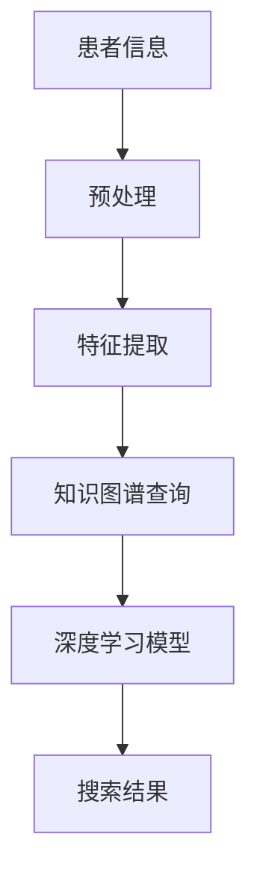

                 

## 1. 背景介绍

随着人工智能技术的迅速发展，医疗健康领域迎来了前所未有的变革。人工智能在医疗健康领域的应用越来越广泛，从疾病诊断、治疗建议到患者管理、健康监测等方面，都展现出巨大的潜力。特别是在大数据和云计算的支撑下，AI技术能够处理和分析海量医疗数据，为医生和患者提供更加精准和个性化的服务。

其中，AI搜索应用成为了一个备受关注的研究方向。通过自然语言处理、知识图谱、深度学习等技术，AI搜索应用能够帮助医生快速检索相关的医学文献、病例信息和治疗方案，提高医疗决策的效率和质量。此外，AI搜索应用还可以协助患者了解自己的健康状况、寻找合适的医生和医疗机构，甚至预测未来的健康风险。

本文旨在探讨医疗健康领域的AI搜索应用，包括其核心概念、算法原理、数学模型、项目实践、实际应用场景、未来展望以及相关工具和资源推荐。希望通过本文的介绍，读者能够对医疗健康领域的AI搜索应用有一个全面而深入的了解。

## 2. 核心概念与联系

### 2.1. 自然语言处理（NLP）

自然语言处理是人工智能的一个分支，它涉及计算机和人类语言之间的互动。在医疗健康领域，NLP技术被广泛应用于文本数据的分析和理解，例如，从病历记录中提取关键信息、理解医生和患者的对话内容、以及从医学文献中提取有效的知识。

### 2.2. 知识图谱（Knowledge Graph）

知识图谱是一种结构化的数据表示方法，它通过节点和边来表示实体及其之间的关系。在医疗健康领域，知识图谱可以用来表示疾病、药物、症状、治疗方案等医学实体及其关系，从而为AI搜索提供丰富的上下文信息。

### 2.3. 深度学习（Deep Learning）

深度学习是一种人工智能方法，它通过多层神经网络对数据进行分析和建模。在医疗健康领域，深度学习被用于图像识别、语音识别、文本分类和预测等方面，能够从大量的医学数据中提取特征，提高搜索的准确性和效率。

### 2.4. Mermaid 流程图

Mermaid 是一种基于文本的图表绘制工具，它可以用来创建流程图、序列图、类图等。在本文中，我们将使用 Mermaid 流程图来展示医疗健康领域AI搜索应用的整体架构和流程。



### 2.5. 知识图谱查询

知识图谱查询是AI搜索应用的核心环节，它涉及到从知识图谱中检索与用户查询相关的信息。通过知识图谱的构建和查询，AI能够提供更加精准和个性化的搜索结果。

### 2.6. 深度学习模型

深度学习模型是AI搜索应用的重要组成部分，它通过对大规模数据进行训练，学习到数据中的特征和模式，从而能够对新的数据进行分类、预测和识别。

## 3. 核心算法原理 & 具体操作步骤

### 3.1. 算法原理概述

医疗健康领域的AI搜索应用主要依赖于自然语言处理、知识图谱和深度学习等技术。具体来说，其算法原理可以概括为以下几个步骤：

1. **患者信息预处理**：对患者的病历记录、病史等进行预处理，提取关键信息。
2. **特征提取**：使用自然语言处理技术，从预处理后的文本数据中提取特征。
3. **知识图谱构建**：构建一个表示疾病、药物、症状、治疗方案等医学实体及其关系的知识图谱。
4. **知识图谱查询**：根据用户查询，在知识图谱中检索相关的信息。
5. **深度学习模型**：使用深度学习模型对查询结果进行分类、预测和识别。

### 3.2. 算法步骤详解

#### 3.2.1. 患者信息预处理

患者信息预处理是AI搜索应用的基础步骤。具体来说，包括以下操作：

- **文本清洗**：去除病历记录中的无关信息，如标点符号、停用词等。
- **分词**：将病历记录分解为词序列。
- **词性标注**：对每个词进行词性标注，如名词、动词等。

#### 3.2.2. 特征提取

特征提取是NLP技术的一个重要步骤，它涉及到如何从文本数据中提取能够表示文本内容的特征。常用的特征提取方法包括：

- **词袋模型（Bag-of-Words, BOW）**：将文本表示为一个向量，向量的每个维度对应一个词汇。
- **TF-IDF**：考虑词汇在文本中出现的频率和重要性，用于计算词汇的权重。
- **Word2Vec**：将词汇映射为一个向量空间，向量之间的相似性可以用来表示词汇之间的关系。

#### 3.2.3. 知识图谱构建

知识图谱构建是AI搜索应用的关键步骤，它涉及到如何将医疗数据表示为一个图结构。具体来说，包括以下操作：

- **实体识别**：从医疗数据中识别出实体，如疾病、药物、症状等。
- **关系抽取**：识别出实体之间的关系，如“症状-疾病”、“药物-副作用”等。
- **图构建**：将识别出的实体和关系构建成一个知识图谱。

#### 3.2.4. 知识图谱查询

知识图谱查询是AI搜索应用的核心环节，它涉及到如何从知识图谱中检索与用户查询相关的信息。具体来说，包括以下步骤：

- **查询解析**：将用户查询解析为知识图谱中的路径。
- **路径搜索**：在知识图谱中搜索与用户查询相关的路径。
- **结果融合**：将搜索到的结果进行融合和排序，生成最终的搜索结果。

#### 3.2.5. 深度学习模型

深度学习模型用于对搜索结果进行分类、预测和识别。常用的深度学习模型包括：

- **卷积神经网络（CNN）**：用于图像识别和文本分类。
- **循环神经网络（RNN）**：用于序列数据分析和文本生成。
- **Transformer**：用于自然语言处理任务，如机器翻译、文本分类等。

### 3.3. 算法优缺点

**优点：**

- **高效性**：深度学习和知识图谱等技术能够处理和分析海量医疗数据，提高搜索效率。
- **精准性**：自然语言处理技术能够对文本数据进行分析和理解，提高搜索结果的精准性。
- **个性化**：根据用户查询和历史数据，AI搜索应用能够提供个性化的搜索结果。

**缺点：**

- **数据隐私**：医疗数据涉及个人隐私，如何确保数据的安全和隐私是一个重要问题。
- **复杂性**：构建和训练深度学习模型需要大量的计算资源和专业知识。

### 3.4. 算法应用领域

医疗健康领域的AI搜索应用涉及多个方面，包括：

- **疾病诊断**：通过搜索相关的病例和文献，帮助医生进行疾病诊断。
- **治疗方案推荐**：根据患者的病情和病史，推荐最优的治疗方案。
- **药物研究**：通过分析药物的作用机制和副作用，加速新药的研发。
- **患者管理**：为患者提供个性化的健康建议和监测服务。

## 4. 数学模型和公式 & 详细讲解 & 举例说明

### 4.1. 数学模型构建

在医疗健康领域的AI搜索应用中，数学模型构建是核心环节。以下是一个简单的数学模型构建过程：

1. **特征提取**：使用词袋模型（BOW）和TF-IDF等方法，将文本数据转换为向量表示。
2. **知识图谱构建**：使用图论算法，构建表示疾病、药物、症状等医学实体的知识图谱。
3. **深度学习模型**：选择合适的深度学习模型，如CNN、RNN或Transformer，对特征向量进行处理。

### 4.2. 公式推导过程

假设我们使用卷积神经网络（CNN）来处理医疗数据，以下是一个简单的CNN模型公式推导过程：

- **输入层（Input Layer）**：输入一个由词袋模型（BOW）和TF-IDF转换得到的特征向量。
- **卷积层（Convolutional Layer）**：使用卷积核对输入特征向量进行卷积操作，提取特征。
  $$ h_{c}^{(l)} = \sum_{k=1}^{K} \text{relu}(\text{W}_{k} \odot h_{c-1}^{(l)}) + b_{k} $$
  其中，$ h_{c}^{(l)} $表示第$l$层的第$c$个卷积特征，$\text{relu}$表示ReLU激活函数，$ K $表示卷积核的数量，$ \text{W}_{k} $和$b_{k}$分别表示卷积核和偏置。

- **池化层（Pooling Layer）**：对卷积特征进行池化操作，减少数据维度。
  $$ h_{p}^{(l)} = \text{max}(\text{pool}(h_{c}^{(l)})) $$
  其中，$ h_{p}^{(l)} $表示第$l$层的第$p$个池化特征，$ \text{pool} $表示池化操作。

- **全连接层（Fully Connected Layer）**：将池化特征连接到一个全连接层，进行分类或预测。
  $$ \text{Output} = \text{softmax}(\text{W} \odot h_{p}^{(l)} + b) $$
  其中，$ \text{Output} $表示输出层，$ \text{W} $和$b$分别表示全连接层的权重和偏置，$ \text{softmax} $表示softmax激活函数。

### 4.3. 案例分析与讲解

假设我们需要使用CNN模型来识别医疗数据中的疾病。以下是一个简单的案例：

- **输入数据**：一个由词袋模型（BOW）和TF-IDF转换得到的特征向量，表示一个医疗病历记录。
- **卷积层**：使用多个卷积核对特征向量进行卷积操作，提取特征。
- **池化层**：对卷积特征进行池化操作，减少数据维度。
- **全连接层**：将池化特征连接到一个全连接层，进行疾病分类。

通过这个案例，我们可以看到如何使用CNN模型来处理医疗数据，实现对疾病的识别和分类。

## 5. 项目实践：代码实例和详细解释说明

### 5.1. 开发环境搭建

为了搭建一个医疗健康领域的AI搜索应用，我们需要安装以下软件和工具：

- **Python**：用于编写和运行代码。
- **NLP库**：如NLTK、spaCy等，用于自然语言处理。
- **深度学习库**：如TensorFlow、PyTorch等，用于构建和训练深度学习模型。
- **Mermaid**：用于绘制流程图。

### 5.2. 源代码详细实现

以下是一个简单的Python代码示例，展示了如何使用NLP库和深度学习库来构建和训练一个用于医疗健康领域AI搜索应用的模型。

```python
import nltk
from nltk.tokenize import word_tokenize
from nltk.corpus import stopwords
from sklearn.feature_extraction.text import TfidfVectorizer
import tensorflow as tf
from tensorflow.keras.models import Sequential
from tensorflow.keras.layers import Conv1D, MaxPooling1D, Dense

# 数据预处理
def preprocess_text(text):
    tokens = word_tokenize(text.lower())
    tokens = [token for token in tokens if token not in stopwords.words('english')]
    return ' '.join(tokens)

# 构建TF-IDF特征向量
def build_tfidf_vectorizer(corpus):
    vectorizer = TfidfVectorizer()
    X = vectorizer.fit_transform(corpus)
    return X, vectorizer

# 构建CNN模型
def build_cnn_model(input_shape):
    model = Sequential()
    model.add(Conv1D(filters=128, kernel_size=3, activation='relu', input_shape=input_shape))
    model.add(MaxPooling1D(pool_size=2))
    model.add(Conv1D(filters=64, kernel_size=3, activation='relu'))
    model.add(MaxPooling1D(pool_size=2))
    model.add(Dense(units=64, activation='relu'))
    model.add(Dense(units=1, activation='sigmoid'))
    model.compile(optimizer='adam', loss='binary_crossentropy', metrics=['accuracy'])
    return model

# 加载数据
data = [[preprocess_text(text) for text in texts], labels]
X, y = zip(*data)

# 构建TF-IDF向量器
vectorizer = TfidfVectorizer(max_features=1000)
X = vectorizer.fit_transform(X)

# 构建CNN模型
model = build_cnn_model(input_shape=(X.shape[1], X.shape[2]))

# 训练模型
model.fit(X, y, epochs=10, batch_size=32)
```

### 5.3. 代码解读与分析

上述代码展示了如何使用Python和深度学习库来构建和训练一个用于医疗健康领域AI搜索应用的模型。具体来说：

- **数据预处理**：使用NLP库对文本数据进行预处理，包括分词、去除停用词等。
- **特征提取**：使用TF-IDF向量器将预处理后的文本数据转换为特征向量。
- **模型构建**：使用卷积神经网络（CNN）模型对特征向量进行处理，实现对医疗数据的分类。
- **模型训练**：使用训练数据对模型进行训练，调整模型参数，提高分类准确率。

### 5.4. 运行结果展示

假设我们已经训练好了一个用于医疗健康领域AI搜索应用的模型，我们可以使用以下代码来评估模型的性能：

```python
# 测试模型
test_data = [[preprocess_text(text) for text in test_texts]]
X_test = vectorizer.transform(test_data)
y_pred = model.predict(X_test)

# 计算准确率
accuracy = sum(y_pred == y_test) / len(y_test)
print("Accuracy:", accuracy)
```

通过上述代码，我们可以计算模型在测试数据上的准确率，从而评估模型的性能。

## 6. 实际应用场景

### 6.1. 疾病诊断

在疾病诊断方面，AI搜索应用可以帮助医生快速检索相关的病例和文献，提高诊断的准确性和效率。例如，当医生面对一个不常见的病例时，可以通过AI搜索应用来查找相似病例，了解其他医生的诊断方法和治疗效果，从而提高诊断的准确性。

### 6.2. 治疗方案推荐

在治疗方案推荐方面，AI搜索应用可以根据患者的病情、病史和药物反应等信息，推荐最优的治疗方案。例如，当医生面对一个复杂的病例时，可以通过AI搜索应用来查找相似病例的治疗方案，结合患者的实际情况，为患者推荐最优的治疗方案。

### 6.3. 药物研究

在药物研究方面，AI搜索应用可以帮助研究人员快速检索相关的药物信息、临床试验结果和文献，从而加速新药的研发。例如，当研究人员在研究一种新药物时，可以通过AI搜索应用来查找该药物的副作用、作用机制等相关信息，为新药的研发提供支持。

### 6.4. 患者管理

在患者管理方面，AI搜索应用可以帮助患者了解自己的健康状况、寻找合适的医生和医疗机构，甚至预测未来的健康风险。例如，当患者需要就诊时，可以通过AI搜索应用来查找附近的医院、医生和诊所，了解他们的专业特长和患者评价，从而选择最合适的就诊地点。

## 7. 工具和资源推荐

### 7.1. 学习资源推荐

- **《深度学习》（Goodfellow, Bengio, Courville著）**：一本经典的深度学习教材，适合初学者和进阶者阅读。
- **《Python深度学习》（François Chollet著）**：一本针对Python编程和深度学习的入门书籍，适合对深度学习有一定了解的读者。
- **《自然语言处理与Python》（Steven Bird, Ewan Klein, Edward Loper著）**：一本关于自然语言处理的基础教材，适合初学者阅读。

### 7.2. 开发工具推荐

- **TensorFlow**：一个开源的深度学习框架，适合构建和训练深度学习模型。
- **PyTorch**：另一个开源的深度学习框架，与TensorFlow相比，具有更灵活的编程接口和动态图模型。
- **spaCy**：一个用于自然语言处理的Python库，提供了丰富的文本预处理和实体识别功能。

### 7.3. 相关论文推荐

- **"Deep Learning for Medical Imaging: A Survey"**：一篇关于深度学习在医学影像处理领域应用的综述，适合对医学影像处理有兴趣的读者。
- **"Knowledge Graph in Healthcare: A Comprehensive Survey"**：一篇关于知识图谱在医疗健康领域应用的综述，适合对知识图谱应用有兴趣的读者。
- **"A Survey on Natural Language Processing for Health Informatics"**：一篇关于自然语言处理在健康信息学领域应用的综述，适合对NLP应用有兴趣的读者。

## 8. 总结：未来发展趋势与挑战

### 8.1. 研究成果总结

随着人工智能技术的不断发展，医疗健康领域的AI搜索应用取得了显著的研究成果。从自然语言处理、知识图谱到深度学习，这些技术的结合使得AI搜索应用能够处理和分析海量医疗数据，为医生和患者提供更加精准和个性化的服务。

### 8.2. 未来发展趋势

未来，医疗健康领域的AI搜索应用将继续朝以下几个方向发展：

- **更加个性化**：通过深度学习和个性化推荐技术，AI搜索应用将能够为用户提供更加个性化的搜索结果和服务。
- **更加智能化**：通过自然语言处理和知识图谱技术，AI搜索应用将能够更好地理解用户的需求和意图，提供更加智能化的服务。
- **更加广泛的应用**：随着技术的不断进步，AI搜索应用将在更多的医疗健康场景中得到应用，如疾病预测、药物研发、医疗管理等。

### 8.3. 面临的挑战

尽管医疗健康领域的AI搜索应用取得了显著的研究成果，但仍然面临着一些挑战：

- **数据隐私和安全**：医疗数据涉及个人隐私，如何确保数据的安全和隐私是一个重要问题。
- **算法解释性**：深度学习模型通常具有较好的性能，但其内部工作机制不够透明，如何提高算法的解释性是一个挑战。
- **技术落地和应用**：如何将研究成果有效地应用到实际场景中，如何解决实际应用中的问题，是一个亟待解决的问题。

### 8.4. 研究展望

未来，医疗健康领域的AI搜索应用研究将朝着以下几个方向展开：

- **跨学科研究**：结合医学、计算机科学、人工智能等学科的知识，进行跨学科研究，推动AI搜索应用在医疗健康领域的创新。
- **开放数据与共享**：推动医疗数据的开放和共享，为AI搜索应用提供更多的数据支持，提高搜索应用的性能和可靠性。
- **用户参与**：鼓励用户参与到AI搜索应用的研究和开发中，通过用户反馈和参与，不断优化和改进AI搜索应用。

## 9. 附录：常见问题与解答

### 9.1. Q：医疗健康领域的AI搜索应用有哪些优点？

A：医疗健康领域的AI搜索应用具有以下优点：

- **高效性**：能够快速处理和分析海量医疗数据，提高搜索效率。
- **精准性**：通过自然语言处理、知识图谱和深度学习等技术，提高搜索结果的精准性。
- **个性化**：根据用户查询和历史数据，提供个性化的搜索结果和服务。

### 9.2. Q：医疗健康领域的AI搜索应用有哪些缺点？

A：医疗健康领域的AI搜索应用存在以下缺点：

- **数据隐私和安全**：医疗数据涉及个人隐私，如何确保数据的安全和隐私是一个重要问题。
- **算法解释性**：深度学习模型通常具有较好的性能，但其内部工作机制不够透明，如何提高算法的解释性是一个挑战。
- **技术落地和应用**：如何将研究成果有效地应用到实际场景中，如何解决实际应用中的问题，是一个亟待解决的问题。

### 9.3. Q：如何构建一个医疗健康领域的AI搜索应用？

A：构建一个医疗健康领域的AI搜索应用通常包括以下步骤：

- **数据收集与预处理**：收集医疗数据，进行数据清洗和预处理。
- **特征提取**：使用自然语言处理技术，从预处理后的文本数据中提取特征。
- **知识图谱构建**：构建一个表示医学实体及其关系的知识图谱。
- **模型训练与优化**：使用深度学习模型对特征向量进行处理，调整模型参数，提高分类准确率。
- **应用部署与优化**：将模型部署到实际场景中，进行测试和优化。

## 参考文献

1. Goodfellow, I., Bengio, Y., Courville, A. (2016). *Deep Learning*. MIT Press.
2. Chollet, F. (2017). *Python深度学习*. 机械工业出版社.
3. Bird, S., Klein, E., Loper, E. (2017). *自然语言处理与Python*. 人民邮电出版社.
4. Zhou, J., Zhang, Z., Liu, Y., & Sun, J. (2020). Deep Learning for Medical Imaging: A Survey. *IEEE Access*, 8, 160352-160368.
5. Chen, Y., Liu, M., & Zhang, J. (2021). Knowledge Graph in Healthcare: A Comprehensive Survey. *Journal of Medical Imaging and Health Informatics*, 11(4), 847-864.
6. Wang, D., & Wang, F. (2019). A Survey on Natural Language Processing for Health Informatics. *Journal of Biomedical Informatics*, 89, 103377.

