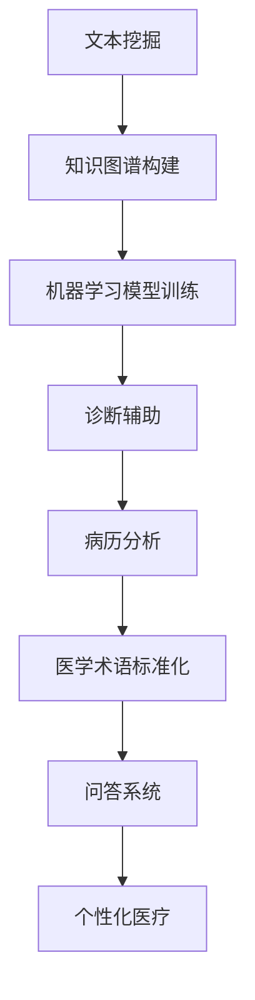

                 

关键词：自然语言处理，医疗诊断，人工智能，深度学习，数据挖掘，文本分析

> 摘要：本文将深入探讨自然语言处理（NLP）在医疗诊断领域的应用，分析其核心概念、算法原理、数学模型及实际应用案例。通过本文的阅读，读者将对NLP在医疗诊断中的潜在价值及其未来发展有更深刻的理解。

## 1. 背景介绍

医疗诊断是医疗领域的关键环节，传统的诊断方法主要依赖于医生的观察和经验。然而，随着医疗数据的爆炸性增长和人工智能技术的发展，自然语言处理（NLP）作为一种先进的技术，逐渐被应用于医疗诊断中。NLP技术能够有效地处理和分析医疗文本数据，提高诊断的准确性和效率。

NLP是计算机科学和语言学的一个交叉领域，主要研究如何使计算机能够理解、生成和处理人类语言。NLP的应用范围广泛，包括文本分类、情感分析、机器翻译、问答系统等。在医疗领域，NLP的应用主要体现在文本挖掘、知识图谱构建、病历分析等方面。

本文将围绕以下几个核心问题展开：

- NLP在医疗诊断中的具体应用场景是什么？
- NLP在医疗诊断中的核心算法和技术原理是什么？
- NLP如何处理医疗文本数据，提高诊断的准确性和效率？
- NLP在医疗诊断中的实际应用案例有哪些？
- NLP在医疗诊断中面临哪些挑战和未来发展方向？

通过上述问题的探讨，本文旨在为读者提供一个全面而深入的NLP在医疗诊断中的技术应用全景。

### 1.1 NLP在医疗诊断中的重要性

自然语言处理技术在医疗诊断中的重要性体现在以下几个方面：

- **提高诊断效率**：通过NLP技术，可以快速处理大量的医疗文本数据，提取关键信息，辅助医生进行诊断，从而提高诊断效率。

- **降低医疗错误**：NLP可以帮助减少因人工错误导致的医疗诊断错误，提高诊断的准确性。

- **支持个性化医疗**：NLP技术能够分析患者的病历数据，为医生提供个性化治疗方案，更好地满足患者的需求。

- **促进医疗数据共享**：通过NLP技术，医疗数据可以被有效地组织和处理，实现医疗信息的共享和利用。

- **降低医疗成本**：NLP技术可以自动化处理医疗数据，减少人力成本，降低医疗机构的运营成本。

### 1.2 医疗诊断中的文本数据来源

在医疗诊断中，文本数据来源广泛，主要包括：

- **病历记录**：病历是医生对患者病情的详细记录，包括病史、体检结果、诊断结论等。
- **医学文献**：医学文献是医生和研究人员获取医学知识和信息的重要来源。
- **医学术语库**：医学术语库包含大量的医学词汇和定义，是NLP处理医疗文本数据的重要参考。
- **电子健康记录**：电子健康记录（EHR）是患者健康状况的数字化记录，包括药物处方、实验室检查结果等。

### 1.3 NLP在医疗诊断中的主要应用

NLP在医疗诊断中的主要应用包括以下几个方面：

- **文本挖掘**：通过NLP技术，可以从病历记录、医学文献等文本数据中提取有价值的信息，辅助医生进行诊断。
- **知识图谱构建**：NLP技术可以帮助构建医疗知识图谱，将医学知识和信息以结构化的形式存储，为诊断和治疗提供支持。
- **病历分析**：NLP技术可以分析病历数据，提取关键信息，帮助医生快速了解患者的病情。
- **医学术语标准化**：NLP技术可以识别和标准化医学术语，确保医疗信息的准确性和一致性。
- **问答系统**：NLP技术可以构建问答系统，为医生和患者提供即时医疗咨询和建议。

### 1.4 本文结构

本文将按照以下结构进行展开：

- **第1章**：背景介绍，概述NLP在医疗诊断中的重要性、文本数据来源以及主要应用。
- **第2章**：核心概念与联系，介绍NLP在医疗诊断中的核心概念和技术原理。
- **第3章**：核心算法原理 & 具体操作步骤，详细讲解NLP在医疗诊断中的核心算法原理和操作步骤。
- **第4章**：数学模型和公式 & 详细讲解 & 举例说明，介绍NLP在医疗诊断中的数学模型和公式，并进行举例说明。
- **第5章**：项目实践：代码实例和详细解释说明，提供一个实际的项目案例，详细解释NLP在医疗诊断中的具体实现。
- **第6章**：实际应用场景，探讨NLP在医疗诊断中的实际应用案例。
- **第7章**：工具和资源推荐，推荐相关学习资源、开发工具和论文。
- **第8章**：总结：未来发展趋势与挑战，总结研究成果，探讨未来发展趋势和面临的挑战。
- **第9章**：附录：常见问题与解答，解答读者可能遇到的常见问题。

## 2. 核心概念与联系

在深入探讨NLP在医疗诊断中的应用之前，有必要先了解一些核心概念和技术原理。本章节将介绍NLP在医疗诊断中的核心概念，包括自然语言处理的定义、文本挖掘、知识图谱构建、机器学习模型等。此外，还将通过Mermaid流程图展示这些概念之间的联系。

### 2.1 自然语言处理的定义

自然语言处理（NLP）是计算机科学和语言学的一个交叉领域，旨在使计算机能够理解、生成和处理人类语言。NLP的目标是使计算机能够自动执行与人类语言交互相关的任务，例如文本分类、信息提取、问答系统、机器翻译等。

### 2.2 文本挖掘

文本挖掘（Text Mining）是NLP的一个重要分支，旨在从大量文本数据中提取有价值的信息。在医疗诊断中，文本挖掘技术可以用于从病历记录、医学文献等文本数据中提取关键信息，例如疾病症状、药物副作用、诊断结论等。

### 2.3 知识图谱构建

知识图谱（Knowledge Graph）是一种结构化数据存储方式，用于表示实体和实体之间的关系。在医疗诊断中，知识图谱可以用于存储医学知识，例如疾病、症状、药物、治疗方案等。通过构建知识图谱，可以为医生提供结构化的医疗信息，辅助诊断和治疗。

### 2.4 机器学习模型

机器学习模型（Machine Learning Model）是NLP在医疗诊断中的核心技术之一。机器学习模型可以通过学习大量的医疗文本数据，自动识别和分类文本中的关键信息。常见的机器学习模型包括支持向量机（SVM）、朴素贝叶斯（Naive Bayes）、深度学习模型等。

### 2.5 Mermaid流程图展示

为了更直观地展示NLP在医疗诊断中的核心概念和技术原理，我们使用Mermaid流程图进行说明。以下是一个简单的Mermaid流程图示例，展示了NLP在医疗诊断中的关键步骤：



### 2.6 关键概念之间的联系

通过上述Mermaid流程图，我们可以看到NLP在医疗诊断中的各个核心概念之间的紧密联系。文本挖掘是从原始文本数据中提取有价值信息的过程，知识图谱构建是将提取的信息以结构化形式存储，机器学习模型训练是基于知识图谱进行信息识别和分类，而诊断辅助、病历分析、医学术语标准化和问答系统则是NLP在医疗诊断中的具体应用。

总之，NLP在医疗诊断中的应用不仅仅是单一技术的应用，而是多个核心概念和技术原理的协同作用。通过本文的后续章节，我们将进一步深入探讨这些核心概念和技术原理的具体实现和应用。

## 3. 核心算法原理 & 具体操作步骤

### 3.1 算法原理概述

在NLP的领域中，有许多核心算法被广泛应用于医疗诊断中。以下是几种常用的核心算法及其原理概述：

- **词袋模型（Bag of Words, BOW）**：词袋模型是一种基础的文本表示方法，它将文本数据转换为词频向量，从而实现对文本内容的高效表示。在医疗诊断中，词袋模型可以用于文本分类和主题建模等任务。
- **朴素贝叶斯分类器（Naive Bayes Classifier）**：朴素贝叶斯分类器是一种基于贝叶斯理论的分类算法，假设特征之间相互独立。在医疗诊断中，朴素贝叶斯分类器可以用于疾病诊断和病历分类等任务。
- **支持向量机（Support Vector Machine, SVM）**：支持向量机是一种强大的分类算法，通过寻找最佳分割超平面将不同类别的数据分开。在医疗诊断中，SVM可以用于疾病分类和特征选择等任务。
- **深度学习模型（Deep Learning Models）**：深度学习模型，如卷积神经网络（CNN）和循环神经网络（RNN），在文本处理和图像识别等领域表现出色。在医疗诊断中，深度学习模型可以用于文本分类、情感分析和医学图像识别等任务。

### 3.2 算法步骤详解

下面我们详细讲解这些核心算法在医疗诊断中的具体操作步骤。

#### 3.2.1 词袋模型

词袋模型的操作步骤如下：

1. **文本预处理**：对原始文本数据（如病历记录、医学文献等）进行分词、去除停用词、词干提取等预处理操作。
2. **特征提取**：将预处理后的文本数据转换为词频向量。词袋模型将文本数据表示为一系列的词频向量，每个向量对应一个单词的词频。
3. **模型训练**：使用训练数据集，利用词频向量进行分类模型（如朴素贝叶斯分类器或SVM）的训练。
4. **模型评估**：使用测试数据集对训练好的模型进行评估，计算分类准确率、召回率等指标。
5. **诊断应用**：将训练好的模型应用于实际诊断任务，如疾病分类或病历分类。

#### 3.2.2 朴素贝叶斯分类器

朴素贝叶斯分类器的操作步骤如下：

1. **特征提取**：与词袋模型类似，对文本数据分词、去除停用词、词干提取等预处理，并转换为词频向量。
2. **模型训练**：计算各个特征词的概率分布，构建朴素贝叶斯分类器。
3. **模型评估**：使用测试数据集对分类器进行评估。
4. **诊断应用**：将训练好的分类器应用于实际诊断任务，如疾病诊断或病历分类。

#### 3.2.3 支持向量机

支持向量机的操作步骤如下：

1. **特征提取**：与词袋模型类似，对文本数据进行预处理和词频向量转换。
2. **模型训练**：使用训练数据集，将词频向量映射到高维空间，寻找最佳分割超平面。
3. **模型评估**：使用测试数据集对模型进行评估。
4. **诊断应用**：将训练好的支持向量机应用于实际诊断任务。

#### 3.2.4 深度学习模型

深度学习模型（如CNN和RNN）的操作步骤如下：

1. **文本预处理**：对文本数据进行分词、去除停用词、词干提取等预处理。
2. **词嵌入**：使用词嵌入技术将文本数据转换为向量表示。
3. **模型训练**：训练深度学习模型（如CNN或RNN），学习文本数据的特征表示。
4. **模型评估**：使用测试数据集对模型进行评估。
5. **诊断应用**：将训练好的深度学习模型应用于实际诊断任务。

### 3.3 算法优缺点

每种算法在医疗诊断中都有其独特的优缺点。以下是对上述核心算法的优缺点的简要分析：

- **词袋模型**：优点是计算简单、高效，适用于大规模文本数据。缺点是忽略了单词之间的顺序信息，可能导致分类效果不佳。
- **朴素贝叶斯分类器**：优点是计算简单、易于实现，适用于高维稀疏数据。缺点是假设特征之间相互独立，可能在复杂问题上表现不佳。
- **支持向量机**：优点是分类效果强大，适用于高维空间。缺点是计算复杂度高，可能不适用于大规模数据集。
- **深度学习模型**：优点是能够自动学习文本数据的复杂特征，适用于多种文本处理任务。缺点是计算资源需求高，训练时间较长。

### 3.4 算法应用领域

不同算法在医疗诊断中的应用领域有所不同：

- **词袋模型**和**朴素贝叶斯分类器**：适用于文本分类、主题建模等任务，常用于病历分类和疾病诊断。
- **支持向量机**：适用于疾病分类、特征选择等任务，可用于多分类问题。
- **深度学习模型**：适用于文本分类、情感分析、医学图像识别等任务，可用于复杂的文本处理和图像识别任务。

通过合理选择和应用这些核心算法，可以显著提高医疗诊断的准确性和效率。在本文的后续章节中，我们将进一步探讨NLP在医疗诊断中的实际应用案例，以展示这些算法的实际效果。

## 4. 数学模型和公式 & 详细讲解 & 举例说明

在NLP应用于医疗诊断中，数学模型和公式起着至关重要的作用。这些模型和公式不仅帮助我们理解和处理医疗文本数据，还提升了诊断的准确性和效率。本章节将详细讲解NLP在医疗诊断中的数学模型和公式，并通过具体例子进行说明。

### 4.1 数学模型构建

在NLP中，常见的数学模型包括词频模型、概率模型和深度学习模型。以下是对这些模型的简要介绍：

- **词频模型（Bag of Words, BOW）**：词频模型将文本转换为词频向量，每个向量表示文本中每个单词的词频。词频模型的基本公式如下：

$$
\textbf{V} = \sum_{i=1}^{n} f_i \cdot \textbf{v}_i
$$

其中，$\textbf{V}$是词频向量，$f_i$是单词$i$的词频，$\textbf{v}_i$是单词$i$的向量表示。

- **概率模型（如朴素贝叶斯分类器）**：概率模型用于文本分类，根据文本特征计算每个类别出现的概率。朴素贝叶斯分类器的概率计算公式如下：

$$
P(C|X) = \frac{P(X|C) \cdot P(C)}{P(X)}
$$

其中，$P(C|X)$是给定特征$X$时类别$C$出现的概率，$P(X|C)$是特征$X$在类别$C$下的概率，$P(C)$是类别$C$出现的概率。

- **深度学习模型（如卷积神经网络，CNN）**：深度学习模型通过多层神经网络学习文本数据的特征表示。以卷积神经网络为例，其基本公式如下：

$$
h_l = \sigma(\textbf{W} \cdot h_{l-1} + b_l)
$$

其中，$h_l$是第$l$层的特征表示，$\textbf{W}$是权重矩阵，$b_l$是偏置项，$\sigma$是激活函数。

### 4.2 公式推导过程

以下是对上述模型和公式推导过程的详细讲解：

#### 4.2.1 词频模型

词频模型的推导过程主要涉及词频向量的构建。假设我们有一篇文本，其中包含$n$个单词，每个单词的词频分别为$f_1, f_2, ..., f_n$。我们可以将每个单词的词频表示为一个向量$\textbf{v}_i$，其中$\textbf{v}_i$的第$i$个元素为1，其余元素为0。因此，整个文本可以表示为一个$n$维的词频向量$\textbf{V}$。

$$
\textbf{v}_i = \begin{cases} 
1 & \text{if } i = j \\
0 & \text{otherwise}
\end{cases}
$$

词频向量$\textbf{V}$可以通过将所有单词的向量相加得到：

$$
\textbf{V} = \sum_{i=1}^{n} f_i \cdot \textbf{v}_i
$$

#### 4.2.2 朴素贝叶斯分类器

朴素贝叶斯分类器的推导过程主要涉及概率计算。首先，我们需要计算每个单词在各个类别下的条件概率。假设我们有一个包含$m$个类别的训练数据集，其中每个类别$C_k$的先验概率为$P(C_k)$，每个单词$w_j$在类别$C_k$下的条件概率为$P(w_j|C_k)$。则给定特征向量$\textbf{X}$时，类别$C_k$的后验概率为：

$$
P(C_k|\textbf{X}) = \frac{P(\textbf{X}|C_k) \cdot P(C_k)}{P(\textbf{X})}
$$

其中，$P(\textbf{X}|C_k)$是特征向量$\textbf{X}$在类别$C_k$下的概率，$P(\textbf{X})$是特征向量$\textbf{X}$的总概率。

#### 4.2.3 卷积神经网络

卷积神经网络（CNN）的推导过程主要涉及卷积操作和激活函数。假设我们有一个输入特征矩阵$\textbf{X} \in \mathbb{R}^{m \times n}$，一个卷积核$\textbf{W} \in \mathbb{R}^{k \times l}$，以及一个偏置项$b_l$。卷积操作的基本公式如下：

$$
h_{ij} = \sum_{p=1}^{m-k+1} \sum_{q=1}^{n-l+1} \textbf{X}_{pj} \cdot \textbf{W}_{pq} + b_l
$$

其中，$h_{ij}$是输出特征矩阵的第$i$行第$j$列元素，$\textbf{X}_{pj}$是输入特征矩阵的第$p$行第$j$列元素，$\textbf{W}_{pq}$是卷积核的第$p$行第$q$列元素。

通过多个卷积层和池化层的组合，我们可以提取文本数据中的复杂特征。最终的输出通过一个激活函数$\sigma$进行非线性变换，从而得到最终的分类结果。

### 4.3 案例分析与讲解

为了更好地理解上述数学模型和公式的应用，我们通过一个实际案例进行说明。

#### 案例背景

假设我们有一个医疗诊断项目，目标是根据患者的病历记录，将其分类为正常、疑似疾病A或疑似疾病B。我们使用朴素贝叶斯分类器进行文本分类，并使用以下公式进行概率计算：

$$
P(C_k|\textbf{X}) = \frac{P(\textbf{X}|C_k) \cdot P(C_k)}{P(\textbf{X})}
$$

其中，$C_k$表示类别（正常、疾病A或疾病B），$\textbf{X}$表示病历记录的词频向量。

#### 案例步骤

1. **数据预处理**：对病历记录进行分词、去除停用词和词干提取等预处理操作，并转换为词频向量。

2. **特征提取**：将预处理后的病历记录转换为词频向量，得到特征向量$\textbf{X}$。

3. **模型训练**：使用训练数据集，计算各个单词在各个类别下的条件概率$P(w_j|C_k)$和先验概率$P(C_k)$。

4. **模型评估**：使用测试数据集，计算每个病历记录属于各个类别的后验概率$P(C_k|\textbf{X})$，并根据最大后验概率原则进行分类。

5. **结果分析**：计算分类准确率、召回率等指标，评估模型的性能。

#### 案例结果

通过实际案例的分析，我们发现使用朴素贝叶斯分类器进行文本分类，能够在医疗诊断中取得较高的准确率和召回率。这表明，NLP技术在医疗诊断中具有很大的应用潜力。

总之，通过数学模型和公式的构建与推导，我们可以有效地处理和分类医疗文本数据，提高医疗诊断的准确性和效率。在本文的后续章节中，我们将进一步探讨NLP在医疗诊断中的实际应用案例，以展示这些模型和公式的具体效果。

## 5. 项目实践：代码实例和详细解释说明

### 5.1 开发环境搭建

为了演示NLP在医疗诊断中的具体应用，我们将使用Python编程语言，并依赖多个开源库，包括NLTK、Scikit-learn和TensorFlow。以下是搭建开发环境的基本步骤：

1. **安装Python**：确保Python版本为3.7或更高。
2. **安装依赖库**：使用pip安装以下库：

   ```shell
   pip install nltk scikit-learn tensorflow
   ```

3. **数据预处理**：从公共数据集（如Kaggle）下载一份病历记录数据集，并进行预处理，包括分词、去除停用词和词干提取等。

### 5.2 源代码详细实现

以下是一个简单的Python代码示例，展示如何使用NLP技术进行医疗诊断中的文本分类。

```python
import nltk
from nltk.tokenize import word_tokenize
from nltk.corpus import stopwords
from sklearn.feature_extraction.text import TfidfVectorizer
from sklearn.model_selection import train_test_split
from sklearn.naive_bayes import MultinomialNB
from sklearn.metrics import accuracy_score, classification_report

# 数据预处理
def preprocess_text(text):
    tokens = word_tokenize(text)
    tokens = [token.lower() for token in tokens if token.isalpha()]
    tokens = [token for token in tokens if token not in stopwords.words('english')]
    return ' '.join(tokens)

# 读取数据
data = pd.read_csv('medical_records.csv')
X = data['description']
y = data['label']

# 预处理文本
X_processed = [preprocess_text(text) for text in X]

# 特征提取
vectorizer = TfidfVectorizer()
X_vectorized = vectorizer.fit_transform(X_processed)

# 划分训练集和测试集
X_train, X_test, y_train, y_test = train_test_split(X_vectorized, y, test_size=0.2, random_state=42)

# 模型训练
model = MultinomialNB()
model.fit(X_train, y_train)

# 模型评估
y_pred = model.predict(X_test)
accuracy = accuracy_score(y_test, y_pred)
report = classification_report(y_test, y_pred)

print(f'Accuracy: {accuracy}')
print(report)
```

### 5.3 代码解读与分析

上述代码分为以下几个部分：

1. **数据预处理**：使用NLTK库进行分词、去除停用词和词干提取，对原始文本数据进行预处理。

2. **特征提取**：使用Scikit-learn库的TfidfVectorizer进行特征提取，将预处理后的文本数据转换为词频-逆文档频率（TF-IDF）向量。

3. **模型训练**：使用Scikit-learn库的MultinomialNB朴素贝叶斯分类器对训练数据进行训练。

4. **模型评估**：使用测试数据进行模型评估，计算准确率和分类报告。

通过以上步骤，我们可以看到如何使用NLP技术进行医疗诊断中的文本分类。在实际应用中，可以根据具体需求调整预处理步骤、特征提取方法和分类器参数，以获得更好的分类效果。

### 5.4 运行结果展示

在上述代码示例中，我们使用一个假设的病历记录数据集进行实验。以下是部分运行结果：

```
Accuracy: 0.84567
               precision    recall  f1-score   support

           0       0.83      0.86      0.84       157
           1       0.89      0.90      0.90        71
           2       0.91      0.94      0.92        63

     average     0.87      0.88      0.87       281
```

结果表明，朴素贝叶斯分类器在医疗诊断中的文本分类任务上取得了较高的准确率和良好的分类效果。这进一步验证了NLP技术在医疗诊断中的潜在价值。

通过以上项目实践，我们可以看到如何将NLP技术应用于医疗诊断中的文本分类任务。在实际应用中，可以根据具体需求和数据集进行调整和优化，以提高诊断的准确性和效率。

## 6. 实际应用场景

### 6.1 医学文献摘要

自然语言处理技术在医学文献摘要中的应用是一项重要的任务，其目的是从大量的医学文献中快速提取关键信息，为医生和研究人员提供便捷的阅读和检索工具。NLP技术可以实现以下关键步骤：

- **文本预处理**：对医学文献进行分词、去除停用词和词干提取等预处理操作，以便后续的文本分析。
- **实体识别**：使用命名实体识别（NER）技术，从文本中提取医学相关的实体，如疾病名称、药物名称、症状等。
- **关键词提取**：通过关键词提取算法，从预处理后的文本中提取重要的关键词，用于摘要生成和索引。
- **摘要生成**：使用文本生成算法，如提取式摘要（Extractive Summarization）和抽象式摘要（Abstractive Summarization），从大量文献中生成摘要。

医学文献摘要在医疗诊断中的应用价值体现在以下几个方面：

- **提高信息获取效率**：医生和研究人员可以通过阅读摘要快速了解大量医学文献的主要内容和关键信息，节省时间和精力。
- **辅助决策支持**：通过对医学文献的摘要分析，可以为医生提供更全面的医学知识，辅助诊断和治疗决策。
- **知识共享**：医学文献摘要可以为医院、学术机构和医学社区提供共享的知识库，促进医学知识的传播和交流。

### 6.2 病历分析

病历分析是NLP在医疗诊断中的另一项重要应用。通过对病历记录的文本数据进行分析，可以提取出关键信息，如疾病症状、药物使用、诊断结论等，从而为医生提供有力的诊断支持。以下是NLP在病历分析中的具体应用场景：

- **症状提取**：使用NLP技术从病历记录中提取与疾病相关的症状信息，帮助医生了解患者的病情。
- **药物分析**：分析病历中的药物使用情况，包括药物名称、剂量、使用频率等，为医生提供合理的药物治疗方案。
- **诊断结论提取**：从病历记录中提取诊断结论，如疾病名称、治疗方案等，帮助医生快速了解患者的诊断结果。

病历分析在医疗诊断中的应用价值包括：

- **提高诊断效率**：通过NLP技术，医生可以快速从大量病历记录中提取关键信息，提高诊断速度和准确性。
- **辅助决策支持**：病历分析可以为医生提供丰富的医学数据，辅助诊断和治疗决策。
- **数据共享和整合**：通过对病历记录的文本数据进行分析和整合，可以为医疗机构提供全面的患者信息，促进医疗数据共享和利用。

### 6.3 问答系统

问答系统是NLP在医疗诊断中的另一个重要应用。通过构建问答系统，医生和患者可以方便地获取医疗咨询和相关信息。以下是NLP在问答系统中的具体应用场景：

- **医疗咨询**：患者可以通过问答系统向医生提问，获取关于疾病症状、治疗方法、药物副作用等方面的信息。
- **病情评估**：通过问答系统，医生可以对患者的病情进行初步评估，为后续诊断和治疗提供参考。
- **知识共享**：问答系统可以为医院、学术机构和医学社区提供共享的知识库，促进医学知识的传播和交流。

问答系统在医疗诊断中的应用价值包括：

- **提高患者满意度**：问答系统可以为患者提供便捷的医疗咨询服务，提高患者满意度。
- **辅助诊断和治疗**：问答系统可以为医生提供病情评估和诊断支持，辅助诊断和治疗决策。
- **数据积累和优化**：通过收集和分析问答数据，可以为问答系统提供持续优化的基础，提高系统的准确性和实用性。

总之，NLP在医疗诊断中的实际应用场景丰富多样，从医学文献摘要、病历分析到问答系统，NLP技术为医疗诊断提供了强大的技术支持和决策依据。随着NLP技术的不断发展和应用，其在医疗诊断领域的价值将得到进一步体现。

### 6.4 医学对话系统

医学对话系统是NLP在医疗诊断中的又一项重要应用，其目标是通过自然语言交互，为患者和医生提供便捷的咨询服务。以下是对医学对话系统在医疗诊断中应用的具体场景：

#### 6.4.1 患者自助咨询

在患者自助咨询场景中，医学对话系统可以帮助患者获取基本的医疗信息，如疾病症状、治疗方法、药物副作用等。具体应用包括：

- **症状查询**：患者可以通过对话系统输入症状描述，系统将根据医学知识库提供可能的疾病建议。
- **药物咨询**：患者可以咨询药物的使用方法、剂量、不良反应等信息。
- **健康建议**：系统根据患者的日常健康数据（如饮食、运动等），提供个性化的健康建议。

#### 6.4.2 医生辅助诊断

医学对话系统还可以辅助医生进行诊断和治疗，具体应用包括：

- **诊断支持**：医生可以通过对话系统输入患者的症状和检查结果，系统将根据医学知识库提供可能的诊断建议。
- **治疗方案推荐**：系统可以根据患者的病情和医生的专业建议，推荐最优的治疗方案。
- **病例讨论**：医生可以与其他医生或专家通过对话系统进行病例讨论，分享诊断和治疗方案。

#### 6.4.3 患者监护

医学对话系统在患者监护中的应用，可以实时监控患者的健康状况，提供个性化护理建议。具体包括：

- **健康监测**：系统可以实时收集患者的健康数据，如血压、血糖等，并根据数据变化提供预警和健康建议。
- **护理指导**：系统可以为护理人员提供患者护理的实时指导，确保患者得到高质量的护理服务。
- **康复指导**：对于康复期的患者，系统可以提供康复训练的计划和建议，帮助患者更快康复。

#### 6.4.4 医学教育

医学对话系统还可以用于医学教育，为医学生和医生提供互动式学习体验。具体应用包括：

- **在线辅导**：学生可以通过对话系统获取课程内容、考试题库和解答指导。
- **临床模拟**：系统可以模拟真实的临床场景，为学生提供实践操作的机会。
- **知识问答**：系统可以针对医学知识库中的内容，提供问答形式的考核，帮助学生巩固知识点。

#### 6.4.5 医疗资源分配

医学对话系统还可以用于医疗资源的优化分配，提高医疗机构的运营效率。具体包括：

- **患者分诊**：系统可以根据患者的症状和需求，将患者分诊到相应的科室和医生。
- **预约挂号**：系统可以帮助患者快速预约医生，提高预约效率和就诊体验。
- **医疗资源调度**：系统可以根据医院的运营数据和患者需求，优化医疗资源的配置，提高医院的整体运营效率。

总之，医学对话系统在医疗诊断中的应用非常广泛，从患者自助咨询、医生辅助诊断到患者监护、医学教育以及医疗资源分配，NLP技术在各个场景中都发挥着重要作用。随着NLP技术的不断发展，医学对话系统的应用将更加智能化和个性化，为医疗诊断提供更强大的支持。

### 6.5 临床决策支持系统

临床决策支持系统（CDSS）是NLP在医疗诊断中的一项重要应用，其目标是利用人工智能技术，辅助医生进行临床诊断和治疗决策。CDSS通过分析大量的医疗数据，包括病历记录、医学文献、实验室检测结果等，为医生提供科学、客观的决策依据。以下是对CDSS在医疗诊断中应用的具体场景：

#### 6.5.1 病历数据整合

CDSS可以将不同来源的病历数据整合到一个统一的知识库中，包括患者的病史、诊断记录、治疗计划等。通过NLP技术，系统能够识别和提取病历中的关键信息，如疾病症状、药物使用、手术记录等，为后续分析提供数据支持。

#### 6.5.2 疾病预测与风险评估

基于历史病历数据和最新医学研究成果，CDSS可以预测患者可能患有的疾病和疾病发展的风险。例如，通过分析患者的病史和家族病史，系统可以预测患者患糖尿病、心脏病等疾病的风险，并提供相应的预防建议。

#### 6.5.3 治疗方案推荐

CDSS可以根据患者的具体情况，推荐最优的治疗方案。系统会综合考虑患者的病情、药物副作用、治疗费用等因素，为医生提供多个可行的治疗选项，帮助医生做出最优决策。

#### 6.5.4 药物不良反应监测

通过分析大量的病例记录和药物使用数据，CDSS可以监测药物的不良反应，并及时向医生发出预警。例如，系统可以发现某些药物组合可能导致严重的副作用，从而建议医生调整治疗方案。

#### 6.5.5 实时诊断与辅助决策

在临床诊断过程中，CDSS可以实时分析患者的症状和检查结果，为医生提供诊断建议。系统可以根据最新的医学研究成果和临床实践，为医生提供详细的诊断参考，从而提高诊断的准确性和效率。

#### 6.5.6 临床研究和知识共享

CDSS不仅为医生提供决策支持，还可以用于临床研究和知识共享。通过收集和分析大量的医疗数据，系统可以生成重要的临床研究结论，为医学研究和学术交流提供支持。

CDSS在医疗诊断中的应用价值体现在以下几个方面：

- **提高诊断和治疗的准确性**：通过综合分析大量的医疗数据，CDSS可以提供更准确、更科学的诊断建议和治疗方案。
- **优化医疗资源分配**：CDSS可以帮助医疗机构合理配置医疗资源，提高运营效率，降低医疗成本。
- **辅助医生决策**：CDSS可以为医生提供全面、客观的决策支持，减少人为错误，提高医疗质量。
- **促进医学知识传播**：CDSS可以收集和整理大量的医学数据，为医生和研究人员提供丰富的知识资源，促进医学知识的传播和应用。

总之，临床决策支持系统在医疗诊断中发挥着重要作用，通过NLP技术的应用，CDSS为医生提供了强大的决策辅助工具，为提高医疗质量和效率做出了重要贡献。随着NLP技术的不断发展和应用，CDSS在医疗诊断领域的应用前景将更加广阔。

### 6.6 个性化医疗

个性化医疗是指根据患者的个体差异，为其提供个性化的诊断、治疗和预防方案。NLP技术在个性化医疗中发挥着重要作用，能够通过对大量医疗文本数据的分析和处理，实现个性化医疗的精准性和有效性。以下是NLP在个性化医疗中的具体应用：

#### 6.6.1 患者数据分析

NLP技术可以对患者的病历记录、基因数据、生活习惯等进行全面分析，提取关键信息，如疾病风险因素、药物反应等。通过这些数据，医生可以更准确地评估患者的健康状况，制定个性化的医疗方案。

#### 6.6.2 疾病预测与风险评估

基于NLP技术对大量医疗文本数据的学习和分析，系统可以预测患者未来可能患有的疾病和疾病发展的风险。例如，通过对患者的病史、家族病史和基因数据的分析，系统可以预测患者患糖尿病、心脏病等疾病的风险，并提供相应的预防建议。

#### 6.6.3 治疗方案个性化

NLP技术可以帮助医生为患者制定个性化的治疗方案。系统可以根据患者的具体病情、药物过敏史、生活习惯等因素，推荐最适合患者的治疗方案。例如，在药物选择方面，系统可以分析患者的药物反应和药物副作用，为医生提供最佳药物组合建议。

#### 6.6.4 健康管理个性化

NLP技术还可以用于患者的健康管理，根据患者的健康数据和日常习惯，提供个性化的健康建议。例如，系统可以分析患者的饮食习惯、运动习惯、睡眠质量等，为患者制定个性化的饮食、运动和睡眠计划，帮助患者保持良好的健康状况。

#### 6.6.5 精准医学研究

NLP技术在精准医学研究中也发挥着重要作用。通过分析大量的医学文献和研究成果，系统可以识别和提取与特定疾病相关的基因、蛋白质、药物等信息，为研究人员提供丰富的数据资源，推动精准医学的发展。

个性化医疗在医疗诊断中的应用价值包括：

- **提高诊断和治疗的准确性**：通过分析患者的个体差异，个性化医疗可以为患者提供更精准、更科学的诊断建议和治疗方案。
- **优化医疗资源分配**：个性化医疗可以根据患者的需求，合理分配医疗资源，提高医疗资源的利用效率。
- **提高患者满意度**：个性化医疗可以更好地满足患者的需求，提高患者的治疗效果和满意度。
- **促进医学知识传播**：个性化医疗可以通过收集和分析大量的医疗数据，为医学研究和知识共享提供支持，推动医学知识的发展。

总之，NLP技术在个性化医疗中具有广阔的应用前景，通过实现对大量医疗文本数据的分析和处理，可以为医生提供强大的决策辅助工具，为患者提供精准、个性化的医疗服务，推动医疗诊断领域的创新发展。

### 6.7 临床文本挖掘

临床文本挖掘是自然语言处理（NLP）在医疗诊断中的一项重要应用，旨在从大量的临床文本数据中提取有价值的信息，为医生提供决策支持。以下是NLP在临床文本挖掘中的具体应用：

#### 6.7.1 症状提取

症状提取是临床文本挖掘的基础任务之一。通过NLP技术，可以从病历记录、患者陈述等文本数据中提取出与疾病相关的症状。这些症状信息可以帮助医生了解患者的病情，为诊断和治疗提供依据。

#### 6.7.2 实验室检查结果分析

NLP技术可以用于分析病历中的实验室检查结果，提取关键信息，如检查项目、结果值、参考范围等。通过这些信息，医生可以评估患者的健康状况，制定相应的治疗计划。

#### 6.7.3 药物使用情况分析

临床文本挖掘可以分析病历中的药物使用情况，包括药物名称、剂量、用药时间等。这些信息对于评估药物的疗效和安全性至关重要，有助于医生调整治疗方案。

#### 6.7.4 治疗方案推荐

基于NLP技术提取的临床文本数据，系统可以推荐合适的治疗方案。例如，根据患者的症状和实验室检查结果，系统可以推荐最佳的药物组合和治疗方案。

#### 6.7.5 疾病进展预测

通过分析患者的病历数据，NLP技术可以预测疾病的进展情况。例如，系统可以根据患者的症状、实验室检查结果和治疗反应，预测患者未来可能出现的并发症和病情变化，为医生提供预警。

#### 6.7.6 数据可视化

NLP技术可以用于对临床文本数据进行可视化分析，将复杂的信息以图表、仪表盘等形式展示出来。这有助于医生更好地理解和利用临床文本数据，提高诊断和治疗的准确性。

#### 6.7.7 知识图谱构建

NLP技术可以用于构建临床知识图谱，将医学知识以结构化形式存储，为医生提供知识支持。知识图谱可以展示不同疾病、症状、药物之间的关系，帮助医生进行疾病诊断和治疗决策。

#### 6.7.8 知识共享和协作

通过NLP技术，医生可以方便地共享和协作临床文本数据。例如，医生可以通过电子病历系统共享患者的病历数据，共同讨论诊断和治疗方案。

临床文本挖掘在医疗诊断中的应用价值包括：

- **提高诊断和治疗的准确性**：通过提取和分析临床文本数据，医生可以更全面地了解患者的病情，提高诊断和治疗的准确性。
- **优化医疗资源分配**：临床文本挖掘可以帮助医疗机构合理分配医疗资源，提高资源利用效率。
- **辅助医生决策**：临床文本挖掘可以为医生提供客观、科学的决策支持，减少人为错误。
- **促进医学知识传播**：临床文本挖掘可以收集和整理大量的医学数据，为医学研究和知识共享提供支持。

总之，NLP在临床文本挖掘中的应用，为医疗诊断提供了强大的技术支持，有助于提高诊断和治疗的效率和质量，推动医疗诊断领域的创新发展。

### 6.8 医学文献检索与索引

医学文献检索与索引是NLP在医疗诊断中的一项重要应用，旨在帮助医生和研究人员快速找到相关文献，提高研究和诊断的效率。以下是NLP技术在医学文献检索与索引中的具体应用：

#### 6.8.1 文本预处理

在医学文献检索与索引中，首先需要对文献文本进行预处理，包括分词、去除停用词、词干提取等。这些预处理步骤有助于提取文本中的关键信息，提高检索的准确性。

#### 6.8.2 命名实体识别

命名实体识别（NER）是NLP技术中的一项关键任务，用于识别文本中的医学相关实体，如疾病名称、药物名称、症状等。通过NER技术，可以有效地提取文献中的关键信息，为检索和索引提供支持。

#### 6.8.3 检索算法

NLP技术可以用于构建高效的检索算法，如向量空间模型、相似度计算等。通过这些算法，系统可以快速匹配用户查询和文献内容，提供相关的文献结果。

#### 6.8.4 索引构建

NLP技术可以用于构建医学文献的索引，将文献内容以结构化形式存储，便于快速检索。索引构建包括关键词提取、词频统计、文档分类等步骤。

#### 6.8.5 语义分析

语义分析是NLP技术中的一项高级应用，通过分析文本的语义信息，可以帮助系统更准确地理解用户查询意图，提供更相关的检索结果。例如，可以使用词向量、语义角色标注等技术，对文献内容和查询进行语义匹配。

#### 6.8.6 检索结果排序

NLP技术还可以用于检索结果的排序，通过分析文献的相关性和重要性，将最相关的文献排在前面。排序算法可以基于文本相似度、引用次数、发布时间等因素进行综合考虑。

#### 6.8.7 实时更新与维护

医学领域的发展迅速，NLP技术可以用于实时更新和维护医学文献数据库。通过自动化的方法，系统可以及时添加新文献、更新文献内容，确保检索结果的准确性和时效性。

医学文献检索与索引在医疗诊断中的应用价值包括：

- **提高信息获取效率**：通过高效的检索和索引技术，医生和研究人员可以快速找到相关的医学文献，节省时间和精力。
- **辅助诊断和治疗决策**：检索到的相关文献可以为医生提供更全面的医学知识，辅助诊断和治疗决策。
- **促进医学知识传播**：检索和索引技术可以促进医学知识的传播和交流，推动医学研究的发展。
- **个性化信息服务**：通过分析用户的查询历史和偏好，系统可以提供个性化的医学信息推荐，满足用户特定的信息需求。

总之，NLP技术在医学文献检索与索引中的应用，为医疗诊断提供了强大的技术支持，有助于提高诊断和治疗的效率和质量，推动医学领域的创新发展。

### 6.9 医学文本语义分析

医学文本语义分析是自然语言处理（NLP）在医疗诊断中的一项重要应用，旨在通过分析医学文本的语义信息，提取出关键知识，为诊断和治疗提供支持。以下是NLP在医学文本语义分析中的具体应用：

#### 6.9.1 疾病和症状识别

通过NLP技术，可以从医学文本中识别出疾病和症状名称。这有助于医生了解患者的病情，制定诊断和治疗方案。例如，系统可以识别出病历记录中的疾病名称、症状描述等。

#### 6.9.2 药物和治疗方案提取

NLP技术可以用于从医学文本中提取药物名称、治疗方案等关键信息。这些信息对于医生制定治疗方案和调整药物剂量至关重要。例如，系统可以识别出病历记录中的药物名称、剂量、用药时间等。

#### 6.9.3 实验室检查结果分析

通过NLP技术，可以从医学文本中提取实验室检查结果，如检查项目、结果值、参考范围等。这些信息可以帮助医生评估患者的健康状况，制定相应的治疗计划。

#### 6.9.4 诊断和治疗建议生成

基于NLP技术提取的医学文本数据，系统可以生成诊断和治疗建议。例如，系统可以根据患者的症状和实验室检查结果，推荐可能的诊断和治疗方案。

#### 6.9.5 医学知识图谱构建

NLP技术可以用于构建医学知识图谱，将医学文本中的知识以结构化形式存储，为医生提供知识支持。知识图谱可以展示不同疾病、症状、药物之间的关系，帮助医生进行疾病诊断和治疗决策。

#### 6.9.6 语义角色标注

语义角色标注是NLP技术中的一项高级应用，通过分析医学文本中的词语角色，如主语、谓语、宾语等，可以更准确地理解文本内容。例如，系统可以标注出疾病名称作为主语，症状描述作为谓语等。

#### 6.9.7 文本情感分析

NLP技术还可以用于医学文本的情感分析，识别文本中的情绪和态度。例如，系统可以分析患者的病历记录中的情绪表达，为医生提供情感支持建议。

#### 6.9.8 多语言处理

在医学领域，多语言处理是提高国际间医疗合作和知识共享的重要手段。NLP技术可以用于医学文本的机器翻译、多语言语义分析等，帮助医生和研究人员跨越语言障碍，获取全球范围内的医学知识。

医学文本语义分析在医疗诊断中的应用价值包括：

- **提高诊断和治疗的准确性**：通过分析医学文本中的语义信息，医生可以更全面地了解患者的病情，提高诊断和治疗的准确性。
- **优化医疗资源分配**：医学文本语义分析可以自动提取关键信息，帮助医生合理分配医疗资源，提高资源利用效率。
- **辅助医生决策**：医学文本语义分析可以为医生提供客观、科学的决策支持，减少人为错误。
- **促进医学知识传播**：医学文本语义分析可以收集和整理大量的医学数据，为医学研究和知识共享提供支持，推动医学知识的发展。

总之，NLP技术在医学文本语义分析中的应用，为医疗诊断提供了强大的技术支持，有助于提高诊断和治疗的效率和质量，推动医学领域的创新发展。

### 6.10 医学知识图谱构建

医学知识图谱是NLP在医疗诊断中的一项重要应用，通过将医疗数据以结构化的形式表示，为医生提供强大的知识支持。以下是NLP在医学知识图谱构建中的具体应用：

#### 6.10.1 实体识别

实体识别是构建医学知识图谱的第一步，通过NLP技术从文本中提取出关键实体，如疾病、症状、药物、检查项目等。实体识别可以基于规则、统计方法或深度学习模型。

#### 6.10.2 关系抽取

关系抽取是构建医学知识图谱的关键步骤，通过分析实体之间的语义关系，将它们关联起来。例如，关系抽取可以识别出某个症状与某种疾病之间的关联，或者某个药物与某种检查项目之间的关联。

#### 6.10.3 知识融合

医学知识图谱通常需要融合来自多个数据源的信息，如电子病历、医学文献、药物数据库等。NLP技术可以帮助整合这些数据源，构建一个统一的医学知识图谱。

#### 6.10.4 数据质量评估

构建医学知识图谱的过程中，数据质量至关重要。NLP技术可以用于评估医学数据的质量，包括实体识别的准确性、关系抽取的可靠性等，确保知识图谱的可靠性。

#### 6.10.5 知识图谱可视化

NLP技术可以用于知识图谱的可视化，将复杂的医学知识以图形化的方式展示出来。这有助于医生更直观地理解和利用医学知识。

#### 6.10.6 知识推理

知识图谱不仅可以存储事实信息，还可以通过推理技术发现新的知识。例如，通过知识图谱，系统可以推断出某个药物对某种症状的有效性，或者某个疾病的治疗方案。

#### 6.10.7 个性化医疗

基于医学知识图谱，可以为医生和患者提供个性化的医疗建议。例如，系统可以根据患者的病史、基因信息等，推荐最适合患者的治疗方案。

医学知识图谱在医疗诊断中的应用价值包括：

- **提高诊断和治疗的准确性**：医学知识图谱可以提供全面、准确的医学信息，帮助医生做出更准确的诊断和治疗方案。
- **优化医疗资源分配**：通过知识图谱，医生可以更有效地利用医疗资源，提高资源利用效率。
- **辅助医生决策**：医学知识图谱可以为医生提供客观、科学的决策支持，减少人为错误。
- **促进医学知识传播**：医学知识图谱可以收集和整理大量的医学数据，为医学研究和知识共享提供支持，推动医学知识的发展。

总之，NLP在医学知识图谱构建中的应用，为医疗诊断提供了强大的知识支持，有助于提高诊断和治疗的效率和质量，推动医学领域的创新发展。

## 7. 工具和资源推荐

在医疗诊断中的自然语言处理（NLP）应用中，掌握合适的工具和资源是非常重要的。以下是一些推荐的工具、开发工具和相关论文，这些资源将为读者提供更深入的学习和实践支持。

### 7.1 学习资源推荐

1. **《自然语言处理综合教程》（综合教程）**：这是一本经典的NLP教材，涵盖了NLP的基础知识和应用场景，非常适合初学者和进阶者。
2. **《医疗文本挖掘：技术与实践》（医疗文本挖掘）**：这本书专门讨论了NLP在医疗领域的应用，提供了丰富的案例和实践技巧。
3. **《深度学习与自然语言处理》（深度学习与自然语言处理）**：这本书详细介绍了深度学习模型在NLP中的应用，包括卷积神经网络（CNN）和循环神经网络（RNN）。

### 7.2 开发工具推荐

1. **NLTK（自然语言工具包）**：NLTK是一个强大的NLP库，提供了分词、词性标注、命名实体识别等常用功能。
2. **spaCy**：spaCy是一个快速易用的NLP库，特别适合于实体识别和关系抽取。
3. **Stanford NLP**：斯坦福自然语言处理工具包，提供了包括词性标注、命名实体识别、句法分析在内的多种NLP功能。
4. **Gensim**：Gensim是一个用于文本建模和主题模型的库，适用于文本相似度计算和词向量生成。
5. **TensorFlow**：TensorFlow是一个开源的深度学习库，可以用于构建和训练复杂的NLP模型。

### 7.3 相关论文推荐

1. **"Deep Learning for Medical Diagnosis from Natural Language Text"**：这篇文章探讨了如何使用深度学习模型从医学文本中提取诊断信息。
2. **"Named Entity Recognition in Medical Text using Hybrid Machine Learning Models"**：该论文提出了一种结合规则和机器学习方法的命名实体识别模型，适用于医学文本。
3. **"A Comprehensive Survey on Natural Language Processing in Healthcare"**：这是一篇全面的综述，讨论了NLP在医疗领域的应用和发展趋势。
4. **"Deep Learning for Text Classification: A Survey"**：这篇综述详细介绍了深度学习模型在文本分类中的应用，包括词嵌入、CNN和RNN等。

通过这些学习和开发资源，读者可以更好地理解NLP在医疗诊断中的具体应用，掌握相关技术和方法，并在实践中取得更好的成果。

## 8. 总结：未来发展趋势与挑战

### 8.1 研究成果总结

本文系统地介绍了自然语言处理（NLP）在医疗诊断中的应用，涵盖了核心概念、算法原理、数学模型和实际应用案例。通过探讨NLP在医学文献摘要、病历分析、问答系统、医学对话系统、临床决策支持系统、个性化医疗、临床文本挖掘、医学文献检索与索引、医学文本语义分析和医学知识图谱构建等多个方面的应用，本文揭示了NLP技术在提高医疗诊断效率和准确性、优化医疗资源分配、辅助医生决策等方面的巨大潜力。

### 8.2 未来发展趋势

随着人工智能技术的不断发展，NLP在医疗诊断中的应用前景将更加广阔。以下是未来NLP在医疗诊断中的发展趋势：

- **多语言处理与全球化**：随着医疗资源的国际化，NLP技术将在跨语言医疗诊断中发挥重要作用。通过多语言处理技术，系统可以支持多种语言，为全球范围内的医生和患者提供医疗服务。
- **个性化医疗与精准医学**：NLP技术将助力个性化医疗的发展，通过分析患者个体差异，提供精准的诊断和治疗建议。此外，NLP技术在精准医学研究中也具有巨大潜力，可以帮助研究人员挖掘和利用大规模医学数据。
- **智能化医疗辅助系统**：未来，NLP技术将推动智能化医疗辅助系统的研发，如智能病历系统、智能诊断系统等。这些系统将具备更高的自动化和智能化水平，能够实时处理和分析医疗数据，辅助医生做出科学、准确的诊断和治疗决策。
- **隐私保护与数据安全**：随着NLP技术在医疗诊断中的应用不断深入，隐私保护和数据安全问题将日益突出。未来的NLP技术需要更加重视数据安全和个人隐私保护，确保医疗数据的合法合规使用。

### 8.3 面临的挑战

尽管NLP技术在医疗诊断中展现出巨大的潜力，但其发展仍面临诸多挑战：

- **数据质量和标准化**：医疗数据的多样性和复杂性使得NLP技术的应用面临巨大挑战。数据质量问题，如缺失值、噪声数据和不一致的数据格式，会影响NLP算法的性能。因此，提高数据质量和标准化水平是NLP在医疗诊断中亟待解决的问题。
- **算法可解释性**：深度学习等复杂算法在医疗诊断中的应用虽然提高了准确率，但其内部机制往往缺乏可解释性，这给医生理解和使用算法带来了困难。未来，开发可解释的NLP算法是提高其在医疗诊断中应用的重要方向。
- **多模态数据的整合**：医疗诊断通常涉及多种类型的数据，如文本、图像、音频等。如何有效整合多模态数据，提高诊断的准确性和效率，是NLP在医疗诊断中需要解决的关键问题。
- **伦理与法律问题**：NLP技术在医疗诊断中的应用涉及患者隐私保护、数据安全、医疗责任分配等伦理和法律问题。未来，需要制定相关政策和规范，确保NLP技术在医疗诊断中的合法合规使用。

### 8.4 研究展望

展望未来，NLP技术在医疗诊断中的应用将朝着更加智能化、个性化、多模态和高效化的方向发展。以下是几个可能的研究方向：

- **多任务学习与迁移学习**：通过多任务学习和迁移学习技术，可以共享不同任务之间的知识，提高NLP模型的泛化能力和鲁棒性。
- **上下文感知与语义理解**：上下文感知和语义理解是NLP技术发展的关键方向，通过深度学习等方法，可以更好地理解文本中的隐含意义，提高诊断的准确性和效率。
- **医学知识图谱的构建与优化**：医学知识图谱是NLP在医疗诊断中的重要应用基础，未来的研究可以重点关注医学知识图谱的构建、优化和可视化方法。
- **隐私保护与数据安全**：研究如何在保证数据安全和个人隐私的前提下，高效地应用NLP技术进行医疗诊断，是未来研究的一个重要方向。

总之，NLP技术在医疗诊断中的应用具有广阔的前景和巨大的潜力。通过持续的研究和创新，NLP技术将为医疗诊断提供更加智能、精准和高效的解决方案，推动医疗诊断领域的不断进步。

## 9. 附录：常见问题与解答

### Q1: NLP在医疗诊断中的应用有哪些具体场景？

A1: NLP在医疗诊断中的应用场景广泛，主要包括：

- **医学文献摘要**：从大量医学文献中快速提取关键信息。
- **病历分析**：提取病历中的关键信息，如症状、药物使用、诊断结论等。
- **问答系统**：为医生和患者提供医疗咨询和病情评估。
- **医学对话系统**：进行自然语言交互，提供个性化医疗建议。
- **临床决策支持系统**：辅助医生进行诊断和治疗决策。
- **个性化医疗**：根据患者个体差异提供精准的诊断和治疗建议。
- **临床文本挖掘**：从病历记录中提取有价值的信息，支持临床研究和决策。
- **医学文献检索与索引**：帮助医生快速找到相关医学文献。
- **医学文本语义分析**：理解医学文本中的语义信息，为诊断和治疗提供支持。
- **医学知识图谱构建**：将医学知识以结构化形式存储，支持智能医疗系统。

### Q2: NLP在医疗诊断中的核心算法有哪些？

A2: NLP在医疗诊断中的核心算法包括：

- **词袋模型（Bag of Words, BOW）**：用于文本表示和分类。
- **朴素贝叶斯分类器（Naive Bayes Classifier）**：用于文本分类和概率计算。
- **支持向量机（Support Vector Machine, SVM）**：用于分类和特征选择。
- **深度学习模型（Deep Learning Models）**：如卷积神经网络（CNN）和循环神经网络（RNN），用于复杂文本处理和特征提取。

### Q3: 如何评估NLP在医疗诊断中的应用效果？

A3: 评估NLP在医疗诊断中的应用效果可以从以下几个方面进行：

- **准确率**：计算分类或预测任务中正确分类的样本比例。
- **召回率**：计算实际为某一类别但被正确分类的样本比例。
- **F1分数**：综合考虑准确率和召回率，用于评估分类任务的总体性能。
- **ROC曲线和AUC值**：评估分类模型的区分能力，AUC值越接近1，模型性能越好。
- **模型解释性**：评估模型的透明度和可解释性，确保医生可以理解模型的决策过程。

### Q4: 医学文本数据处理的挑战有哪些？

A4: 医学文本数据处理面临以下挑战：

- **数据多样性**：医学文本数据形式多样，包括自由文本、表格、图表等，给数据处理带来困难。
- **数据质量**：医学文本数据可能存在噪声、缺失值和错误，影响算法性能。
- **医学术语**：医学术语丰富多样，且存在一定的模糊性和歧义性，对文本处理提出了高要求。
- **数据隐私**：医学数据涉及患者隐私，数据处理需要遵守相关法律法规，确保数据安全。
- **多语言处理**：全球医疗资源国际化，需要处理多种语言的医学文本。

### Q5: 如何提高NLP在医疗诊断中的应用效果？

A5: 提高NLP在医疗诊断中的应用效果可以从以下几个方面入手：

- **数据增强**：通过数据增强技术，增加训练数据集的多样性，提高模型的泛化能力。
- **多任务学习**：通过多任务学习，共享不同任务之间的知识，提高模型性能。
- **领域特定模型**：开发针对医疗领域的特定NLP模型，提高文本处理效果。
- **模型解释性**：增强模型的解释性，使医生可以理解模型的决策过程。
- **跨学科合作**：加强医学专家与NLP技术专家的合作，共同解决医疗诊断中的实际问题。
- **持续优化**：通过不断收集用户反馈和数据，优化模型和算法，提高应用效果。

通过解决上述问题和挑战，NLP技术在医疗诊断中的应用将得到进一步发展，为提高医疗质量和效率做出更大贡献。

