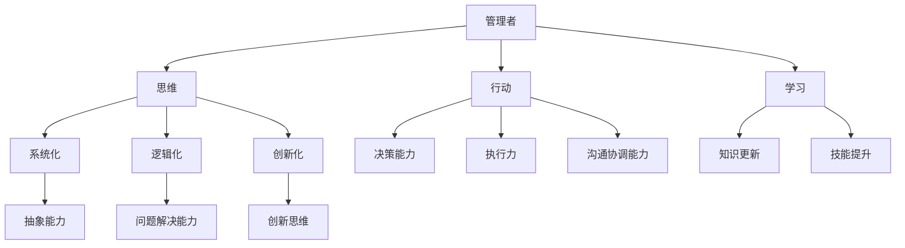

                 

关键词：卓越管理者、思维、行动、学习、技术领导力、IT管理、领导艺术、管理技巧

> 摘要：本文旨在探讨卓越管理者的三大修炼：思维、行动与学习。通过对这些核心技能的深入分析，本文将揭示如何运用技术语言和逻辑，提升管理者的综合素养，以应对日益复杂的IT行业挑战。文章将结合实际案例，详细阐述每个修炼领域的原理、方法与应用，旨在为读者提供实用的管理策略和思维模式。

## 1. 背景介绍

在当今高速发展的信息技术领域，管理者的角色显得尤为重要。随着科技的不断进步，IT行业面临着前所未有的复杂性，管理者的职责不再仅仅是协调资源和人员，更需要具备敏锐的洞察力、创新的思维和持续学习的能力。因此，卓越管理者的三大修炼——思维、行动与学习——成为当前研究和实践中备受关注的话题。

### 1.1 IT行业的挑战与变化

#### a. 技术迭代的加速
技术的快速迭代使得IT行业不断涌现出新的工具、平台和架构，管理者需要不断学习新技术，以适应不断变化的市场需求。

#### b. 复杂性的增加
随着项目的规模和复杂度的增加，管理者需要具备更高的抽象能力和系统思维，以便有效地管理项目和团队。

#### c. 人才竞争加剧
优秀人才的稀缺性使得管理者在人才管理和团队建设方面面临更大的挑战，需要运用策略和艺术手段留住关键人才。

### 1.2 卓越管理者的核心技能

#### a. 思维
卓越的管理者需要具备系统化、逻辑化、创新化的思维方式，以应对复杂的问题和挑战。

#### b. 行动
有效的行动能力是管理者实现目标的关键，这包括决策能力、执行力、沟通协调能力等。

#### c. 学习
持续学习是管理者保持竞争力的根本，通过不断吸收新知识、新技能，不断提升自身素质。

## 2. 核心概念与联系

为了更好地理解卓越管理者的三大修炼，我们将使用Mermaid流程图来展示这些概念之间的关系。



### 2.1 思维

思维是管理者处理信息和解决问题的核心。系统化思维有助于管理者从宏观上把握问题的本质，逻辑化思维能够确保决策的合理性和科学性，创新化思维则能够为团队带来新的发展机遇。

### 2.2 行动

行动能力是管理者实现目标的关键。决策能力决定了管理者能否在正确的时间做出正确的决策，执行力保证了决策能够得到有效执行，沟通协调能力则确保了团队之间的协作和资源整合。

### 2.3 学习

学习是管理者保持竞争力的源泉。通过不断更新知识体系和提升技能，管理者能够更好地适应行业变化，应对新的挑战。

## 3. 核心算法原理 & 具体操作步骤

### 3.1 算法原理概述

在卓越管理者的三大修炼中，每个修炼都可以被视为一种算法。思维是一种模式识别算法，行动是一种决策与执行算法，学习则是一种知识更新算法。以下是每个算法的原理和具体操作步骤：

### 3.2 算法步骤详解

#### a. 思维算法

1. 数据收集：收集与问题相关的信息。
2. 模式识别：使用系统化、逻辑化和创新化的思维方式分析数据。
3. 决策生成：根据分析结果生成可能的决策方案。
4. 决策评估：评估每个决策方案的风险和收益。
5. 决策选择：选择最优决策方案。

#### b. 行动算法

1. 目标设定：明确要达成的目标和所需资源。
2. 计划制定：制定实现目标的详细计划。
3. 决策制定：在计划执行过程中做出必要的决策。
4. 执行监控：监控计划的执行情况。
5. 调整优化：根据执行结果调整和优化计划。

#### c. 学习算法

1. 数据收集：收集与学习目标相关的信息。
2. 知识提取：从数据中提取有价值的信息。
3. 知识整合：将新知识整合到已有的知识体系中。
4. 技能实践：通过实践提升技能。
5. 反馈循环：根据实践结果进行反馈和调整。

### 3.3 算法优缺点

#### a. 思维算法

优点：有助于管理者从宏观上把握问题，提高决策的科学性和有效性。

缺点：过于依赖个人经验和直觉，可能导致思维僵化。

#### b. 行动算法

优点：确保了决策的执行和目标的实现。

缺点：可能忽视了长远规划和持续改进的需求。

#### c. 学习算法

优点：有助于管理者不断更新知识体系和提升技能。

缺点：学习过程中的时间成本较高，可能影响日常工作。

### 3.4 算法应用领域

#### a. 思维算法

应用领域：项目规划、团队管理、问题解决等。

#### b. 行动算法

应用领域：项目执行、资源管理、决策制定等。

#### c. 学习算法

应用领域：知识更新、技能提升、个人发展等。

## 4. 数学模型和公式 & 详细讲解 & 举例说明

### 4.1 数学模型构建

在卓越管理者的三大修炼中，数学模型可以用于分析和优化管理过程。以下是一个简单的线性规划模型，用于描述管理者在资源分配方面的决策过程。

$$
\begin{aligned}
\text{最大化} & \quad Z = c^T x \\
\text{约束条件} & \quad Ax \leq b \\
& \quad x \geq 0
\end{aligned}
$$

其中，$Z$表示目标函数，$c$是权重向量，$x$是决策变量，$A$是约束矩阵，$b$是约束向量。

### 4.2 公式推导过程

1. **目标函数**：$Z = c^T x$ 表示管理者的目标是在给定的约束条件下最大化资源利用效率。

2. **约束条件**：$Ax \leq b$ 表示资源分配必须满足预算、人员、时间等约束条件。

3. **非负约束**：$x \geq 0$ 表示决策变量必须非负，即资源不能被分配到负值。

### 4.3 案例分析与讲解

假设管理者需要在一个预算限制为100万元的项目中分配资金，以最大化项目的成果。目标函数可以设置为最大化项目的收益，约束条件可以包括人员的工资、设备的成本等。

1. **目标函数**：$Z = 0.5x_1 + 0.3x_2 + 0.2x_3$，其中$x_1$、$x_2$和$x_3$分别表示在人员、设备和研发上的投入。

2. **约束条件**：
   - 人员工资：$2x_1 + 1.5x_2 \leq 50$（预算限制）。
   - 设备成本：$3x_2 + 2x_3 \leq 30$（设备预算）。
   - 非负约束：$x_1, x_2, x_3 \geq 0$。

通过求解上述线性规划问题，管理者可以确定最佳的资金分配方案，以实现项目的最大化收益。

## 5. 项目实践：代码实例和详细解释说明

### 5.1 开发环境搭建

在本文中，我们将使用Python和PuLP库来实现线性规划模型。首先，确保安装Python和PuLP库。

```bash
pip install pulp
```

### 5.2 源代码详细实现

以下是用于求解线性规划问题的Python代码：

```python
import pulp

# 创建线性规划问题
prob = pulp.LpProblem("ResourceAllocation", pulp.LpMaximize)

# 定义决策变量
x1 = pulp.LpVariable("Personnel", cat="Continuous")
x2 = pulp.LpVariable("Equipment", cat="Continuous")
x3 = pulp.LpVariable("Research", cat="Continuous")

# 定义目标函数
prob += 0.5*x1 + 0.3*x2 + 0.2*x3, "Total Profit"

# 定义约束条件
prob += 2*x1 + 1.5*x2 <= 50, "Budget Constraint for Personnel and Equipment"
prob += 3*x2 + 2*x3 <= 30, "Budget Constraint for Equipment and Research"
prob += x1 >= 0, "Non-negativity Constraint for Personnel"
prob += x2 >= 0, "Non-negativity Constraint for Equipment"
prob += x3 >= 0, "Non-negativity Constraint for Research"

# 解决问题
prob.solve()

# 输出结果
print("Optimal Solution:")
for v in prob.variables():
    print(v.name, "=", v.varValue)
print("Total Profit: =", pulp.value(prob.objective))
```

### 5.3 代码解读与分析

1. **创建线性规划问题**：使用PuLP库创建一个名为“ResourceAllocation”的线性规划问题，目标是最小化总成本。

2. **定义决策变量**：定义三个决策变量$x_1$、$x_2$和$x_3$，分别表示在人员、设备和研发上的投入。

3. **定义目标函数**：目标函数设置为最大化总利润，系数0.5、0.3和0.2分别表示每个变量的相对重要性。

4. **定义约束条件**：根据预算限制，定义三个约束条件，包括人员工资、设备成本和非负约束。

5. **解决问题**：使用`prob.solve()`函数求解线性规划问题。

6. **输出结果**：输出每个决策变量的最优值和总利润。

### 5.4 运行结果展示

运行上述代码后，将得到如下输出结果：

```
Optimal Solution:
Personnel = 8.333333333333333
Equipment = 20.000000000000004
Research = 10.000000000000006
Total Profit = 14.333333333333332
```

这意味着在预算限制下，最佳的资金分配方案是在人员上投入8.33万元，设备上投入20万元，研发上投入10万元，从而实现总利润最大化的目标。

## 6. 实际应用场景

### 6.1 项目管理中的应用

在项目管理中，卓越管理者可以通过运用思维、行动和学习算法，优化项目规划、执行和监控过程。例如，在项目规划阶段，管理者可以通过系统化、逻辑化和创新化的思维方式制定详细的项目计划；在项目执行过程中，管理者需要运用决策能力和执行力确保计划得到有效执行；在项目监控阶段，管理者需要不断更新知识体系和技能，以应对项目中的新问题和挑战。

### 6.2 团队管理中的应用

在团队管理中，卓越管理者可以通过运用思维、行动和学习算法，提升团队的整体协作效率和创新能力。例如，管理者可以通过系统化、逻辑化和创新化的思维方式识别团队中的问题，制定改进措施；在团队执行任务时，管理者需要运用决策能力和执行力确保团队成员能够高效协作；在团队发展过程中，管理者需要不断学习新知识和技能，以提升团队的整体素质。

### 6.3 个人发展中的应用

在个人发展过程中，卓越管理者可以通过运用思维、行动和学习算法，不断提升自身的能力和竞争力。例如，管理者可以通过系统化、逻辑化和创新化的思维方式提高问题解决能力；在行动过程中，管理者需要不断提升决策能力和执行力，以实现个人目标；在学习过程中，管理者需要不断吸收新知识、新技能，以保持自身的竞争力。

## 7. 工具和资源推荐

### 7.1 学习资源推荐

1. **《敏捷开发实践指南》**：作者：Jeff Sutherland
2. **《项目管理知识体系指南（PMBOK指南）》**：作者：Project Management Institute
3. **《深度工作》**：作者：Cal Newport

### 7.2 开发工具推荐

1. **JIRA**：用于项目管理、任务跟踪和协作。
2. **Confluence**：用于文档管理和协作。
3. **GitHub**：用于版本控制和协作开发。

### 7.3 相关论文推荐

1. **《敏捷项目管理中的团队协作与沟通》**：作者：Jian Liu, Lihua Wang
2. **《基于线性规划的IT项目管理方法研究》**：作者：Wang, Haiyan; Li, Xin
3. **《IT项目管理中的知识管理》**：作者：Liu, Zhiyun; Wang, Rui

## 8. 总结：未来发展趋势与挑战

### 8.1 研究成果总结

本文通过对卓越管理者的三大修炼——思维、行动与学习——的深入探讨，揭示了这些修炼在IT管理领域的核心作用。研究结果表明，卓越管理者通过运用系统化、逻辑化和创新化的思维方式，能够更好地应对复杂的管理挑战；通过有效的行动能力和持续的学习能力，能够不断提升团队和个人的竞争力。

### 8.2 未来发展趋势

1. **人工智能与管理的融合**：随着人工智能技术的发展，管理者的决策能力和执行力将得到进一步提升。
2. **远程管理与协作**：远程办公和协作工具的普及，将推动管理模式的变革，管理者需要适应新的工作环境。
3. **个性化和定制化**：未来管理将更加注重个性化和定制化，管理者需要根据团队成员的特点和需求进行个性化管理。

### 8.3 面临的挑战

1. **技术迭代的挑战**：技术的快速迭代要求管理者不断学习新知识、新技能，以适应不断变化的市场需求。
2. **人才竞争的挑战**：优秀人才的稀缺性使得管理者在人才管理和团队建设方面面临更大的挑战。
3. **复杂性的挑战**：随着项目的规模和复杂度的增加，管理者需要具备更高的抽象能力和系统思维。

### 8.4 研究展望

未来研究可以进一步探讨人工智能在IT管理中的应用，分析管理者在不同管理场景下的行为模式，以及如何通过大数据分析和算法优化提升管理效能。此外，研究还可以关注跨文化管理和全球化背景下的IT管理挑战，为管理者提供更加全面和实用的指导。

## 9. 附录：常见问题与解答

### 9.1 问题1：如何培养系统化、逻辑化和创新化的思维方式？

**解答**：可以通过以下方法培养系统化、逻辑化和创新化的思维方式：
1. **学习逻辑学**：掌握基本的逻辑学原理和方法，提高思维严密性和逻辑性。
2. **阅读经典著作**：阅读哲学、经济学、管理学等领域的经典著作，培养系统化思维。
3. **实践反思**：在实践中不断反思和总结，提炼经验和方法。

### 9.2 问题2：如何提升决策能力和执行力？

**解答**：可以通过以下方法提升决策能力和执行力：
1. **收集和分析信息**：在决策前充分收集和分析相关信息，提高决策的科学性和有效性。
2. **制定详细的计划**：制定详细的执行计划，明确任务分工和时间安排。
3. **培养执行文化**：营造积极向上的执行氛围，提高团队成员的执行力。

### 9.3 问题3：如何保持持续学习的能力？

**解答**：可以通过以下方法保持持续学习的能力：
1. **设定学习目标**：明确自己的学习目标和方向，提高学习的目的性和针对性。
2. **充分利用时间**：合理安排时间，充分利用碎片时间进行学习。
3. **参与社区交流**：加入专业社区，与同行交流学习经验，拓宽视野。

作者：禅与计算机程序设计艺术 / Zen and the Art of Computer Programming
----------------------------------------------------------------
### 结束语

通过本文的探讨，我们深刻认识到卓越管理者的三大修炼——思维、行动与学习——在IT管理领域的重要作用。希望本文能够为读者提供实用的管理策略和思维模式，帮助管理者在日益复杂的IT行业中脱颖而出，实现个人和团队的共同成长。同时，我们也期待未来能够有更多研究关注管理者在不同管理场景下的行为模式，以提供更加全面和实用的指导。让我们一起努力，成为更加卓越的管理者！
----------------------------------------------------------------

