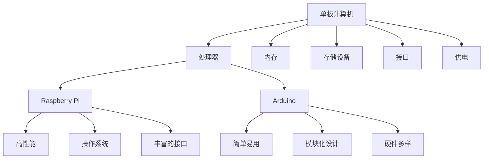

                 

关键词：单板计算机、Raspberry Pi、Arduino、项目应用、技术实践

> 摘要：本文将探讨单板计算机在当今技术领域中的重要角色，特别是Raspberry Pi和Arduino这两款开源硬件平台的强大应用场景。通过对这两款平台的核心概念、技术原理、数学模型、代码实现和实际应用的分析，本文旨在为读者提供深入了解单板计算机项目的灵感源泉，并展望其未来的发展趋势和面临的挑战。

## 1. 背景介绍

单板计算机（Single-Board Computer，简称SBC）是一种集成度高、体积小巧、功能强大的微型计算机。其核心思想是将传统的计算机系统（包括处理器、内存、存储等）集成到一块单板上，以便于嵌入式系统开发、教育和创新项目。近年来，随着开源硬件运动的蓬勃发展，单板计算机成为了技术创新的重要载体，广泛应用于智能家居、机器人、物联网等领域。

Raspberry Pi和Arduino是两款备受欢迎的开源单板计算机平台。Raspberry Pi由英国慈善基金Raspberry Pi Foundation开发，旨在促进计算机科学教育和创新。它具备高性能、低功耗的特点，以及丰富的接口和社区支持，使其成为学习和开发嵌入式系统的首选平台。Arduino则是由一个国际社区开发的单片机开发板，以其易用性和模块化设计著称，广泛应用于艺术、设计和科学实验等领域。

## 2. 核心概念与联系

### 2.1. 单板计算机的基本概念

单板计算机是一种微型计算机系统，它包含以下核心组成部分：

- **处理器（CPU）**：负责执行计算机指令，处理数据。
- **内存（RAM）**：存储正在执行的程序和临时数据。
- **存储设备（ROM/Flash）**：存储操作系统和应用程序。
- **接口**：如USB、HDMI、GPIO等，用于与其他设备通信。
- **供电**：通常通过外部电源或电池供电。

### 2.2. Raspberry Pi与Arduino的联系与区别

#### Raspberry Pi

Raspberry Pi是一款基于ARM架构的单板计算机，以其高性能、低成本和丰富的功能而著称。它具备以下特点：

- **高性能**：搭载Broadcom BCM2835/2836/2837处理器，性能优于早期的Arduino。
- **操作系统**：支持Linux等多种操作系统。
- **丰富的接口**：包括HDMI、USB、GPIO等，便于扩展。
- **社区支持**：拥有庞大的开发者社区，资源丰富。

#### Arduino

Arduino是一款基于AVR或PIC单片机的开发板，以其简单易用、模块化设计而闻名。它具备以下特点：

- **简单易用**：基于Arduino IDE，支持C/C++语言，初学者友好。
- **模块化设计**：通过各种 shields（扩展板）扩展功能。
- **硬件多样**：涵盖AVR、PIC、ARM等多种硬件平台。

### 2.3. Mermaid流程图



## 3. 核心算法原理 & 具体操作步骤

### 3.1. 算法原理概述

单板计算机项目的核心在于算法设计和具体实现。以下是几个常见的算法原理和应用：

- **PID控制算法**：在机器人控制、温度控制等领域广泛应用。
- **图像处理算法**：如边缘检测、人脸识别等。
- **通信协议**：如TCP/IP、MQTT等，用于物联网设备的数据传输。

### 3.2. 算法步骤详解

#### 3.2.1. PID控制算法

1. **设定目标值**：确定控制对象的目标位置或温度等。
2. **测量实际值**：实时获取控制对象的当前位置或温度。
3. **计算偏差**：目标值与实际值的差值。
4. **计算控制量**：根据偏差值和PID参数计算控制量。
5. **执行控制动作**：根据控制量调整控制对象。

#### 3.2.2. 图像处理算法

1. **图像输入**：读取图像数据。
2. **预处理**：如灰度化、滤波等。
3. **特征提取**：如边缘检测、特征点提取等。
4. **目标识别**：使用机器学习或传统算法进行目标识别。
5. **结果输出**：输出识别结果或处理后的图像。

#### 3.2.3. 通信协议

1. **建立连接**：配置网络参数，建立TCP/IP或MQTT连接。
2. **数据发送**：发送数据包到服务器或物联网平台。
3. **数据接收**：接收服务器或物联网平台返回的数据。
4. **处理数据**：根据接收到的数据进行相应操作。

### 3.3. 算法优缺点

#### PID控制算法

- **优点**：控制效果稳定，适用范围广。
- **缺点**：参数调整复杂，对系统非线性不敏感。

#### 图像处理算法

- **优点**：图像处理功能强大，应用广泛。
- **缺点**：计算量大，对硬件性能要求高。

#### 通信协议

- **优点**：网络通信稳定，适用于物联网设备。
- **缺点**：网络延迟较大，不适合实时性要求高的应用。

### 3.4. 算法应用领域

- **PID控制算法**：机器人控制、自动化设备、智能家居等。
- **图像处理算法**：安防监控、医疗影像、自动驾驶等。
- **通信协议**：物联网设备通信、智能家居、工业自动化等。

## 4. 数学模型和公式 & 详细讲解 & 举例说明

### 4.1. 数学模型构建

#### 4.1.1. PID控制算法数学模型

PID控制算法的核心是控制器输出公式：

\[ u(t) = K_p e(t) + K_i \int_{0}^{t} e(\tau)d\tau + K_d \frac{d e(t)}{dt} \]

其中，\( u(t) \)是控制量，\( e(t) \)是偏差值，\( K_p \)、\( K_i \)和\( K_d \)分别是比例、积分和微分系数。

#### 4.1.2. 图像处理算法数学模型

图像处理算法中的滤波器模型如下：

\[ f(x,y) = \sum_{i}\sum_{j} h(i,j) \cdot g(x-i, y-j) \]

其中，\( f(x,y) \)是滤波后的图像，\( h(i,j) \)是滤波器的卷积核，\( g(x-i, y-j) \)是原始图像的子像素。

#### 4.1.3. 通信协议数学模型

通信协议中的传输速率模型可以表示为：

\[ R = \frac{1}{T} \]

其中，\( R \)是传输速率，\( T \)是传输周期。

### 4.2. 公式推导过程

#### 4.2.1. PID控制算法推导

PID控制算法的推导主要涉及控制理论中的比例控制、积分控制和微分控制。这里简要介绍比例控制的推导过程：

比例控制的输出公式为：

\[ u(t) = K_p e(t) \]

其中，\( K_p \)是比例系数，\( e(t) \)是偏差值。

比例控制的核心思想是根据偏差值的大小直接调整控制量，以减小偏差。

#### 4.2.2. 图像处理算法推导

图像处理算法中的滤波器推导涉及卷积运算。卷积运算的公式为：

\[ (f * g)(t) = \int_{-\infty}^{\infty} f(\tau) g(t-\tau)d\tau \]

其中，\( f(t) \)和\( g(t) \)分别是两个函数，\( * \)表示卷积运算。

滤波器的设计主要涉及卷积核的选取，以实现图像的预处理、边缘检测等功能。

#### 4.2.3. 通信协议推导

通信协议的推导主要涉及网络传输理论。传输速率的推导过程如下：

传输速率是指单位时间内传输的数据量。传输速率可以表示为：

\[ R = \frac{1}{T} \]

其中，\( R \)是传输速率，\( T \)是传输周期。

传输周期的推导涉及网络延迟和传输距离等因素。

### 4.3. 案例分析与讲解

#### 4.3.1. PID控制算法案例

假设我们要控制一个电动机的位置，目标位置为10cm，实际位置为8cm。设定比例系数\( K_p = 0.5 \)，积分系数\( K_i = 0.1 \)，微分系数\( K_d = 0.1 \)。

- **初始状态**：偏差值\( e(t_0) = 2cm \)。
- **计算过程**：

  \[ u(t_0) = K_p e(t_0) = 0.5 \times 2 = 1V \]

  电动机开始向目标位置移动。

- **1秒后**：实际位置为9cm，偏差值\( e(t_1) = 1cm \)。

  \[ u(t_1) = K_p e(t_1) + K_i \int_{0}^{t_1} e(\tau)d\tau + K_d \frac{d e(t_1)}{dt} \]
  \[ u(t_1) = 0.5 \times 1 + 0.1 \times \int_{0}^{1} 2d\tau + 0.1 \times 0 \]
  \[ u(t_1) = 0.5 + 0.2 + 0 \]
  \[ u(t_1) = 0.7V \]

  电动机调整速度，继续向目标位置移动。

- **2秒后**：实际位置为10cm，偏差值\( e(t_2) = 0cm \)。

  \[ u(t_2) = K_p e(t_2) + K_i \int_{0}^{t_2} e(\tau)d\tau + K_d \frac{d e(t_2)}{dt} \]
  \[ u(t_2) = 0.5 \times 0 + 0.1 \times \int_{0}^{2} 2d\tau + 0.1 \times 0 \]
  \[ u(t_2) = 0 + 0.4 + 0 \]
  \[ u(t_2) = 0.4V \]

  电动机逐渐减速，直至目标位置。

#### 4.3.2. 图像处理算法案例

假设我们要对一幅图像进行高斯滤波处理，选取高斯滤波器的卷积核如下：

\[ h(i,j) = \begin{cases} 
  1, & \text{if } (i,j) = (0,0), \\
  \frac{1}{16\pi}, & \text{otherwise}.
\end{cases} \]

原始图像的像素值为：

\[ g(x,y) = \begin{cases} 
  255, & \text{if } (x,y) = (0,0), \\
  0, & \text{otherwise}.
\end{cases} \]

滤波后的图像计算过程如下：

\[ f(x,y) = \sum_{i}\sum_{j} h(i,j) \cdot g(x-i, y-j) \]

对于像素\( (x,y) = (1,1) \)：

\[ f(1,1) = h(0,0) \cdot g(1-0, 1-0) + h(1,0) \cdot g(1-1, 1-0) + h(0,1) \cdot g(1-0, 1-1) + h(1,1) \cdot g(1-1, 1-1) \]
\[ f(1,1) = 1 \cdot 255 + \frac{1}{16\pi} \cdot 0 + \frac{1}{16\pi} \cdot 0 + \frac{1}{16\pi} \cdot 0 \]
\[ f(1,1) = 255 \]

经过高斯滤波处理后，图像的像素值保持不变。

#### 4.3.3. 通信协议案例

假设我们要通过TCP协议传输数据，传输周期为1秒，数据包大小为1000字节。

- **建立连接**：客户端与服务器建立TCP连接。
- **数据发送**：客户端发送数据包到服务器。
- **数据接收**：服务器接收并处理数据包。
- **数据确认**：服务器发送确认信息给客户端。

传输速率计算如下：

\[ R = \frac{1}{T} = \frac{1}{1\text{秒}} = 1\text{字节/秒} \]

传输1秒后，传输的数据量为：

\[ R \times T = 1\text{字节/秒} \times 1\text{秒} = 1000\text{字节} \]

## 5. 项目实践：代码实例和详细解释说明

### 5.1. 开发环境搭建

为了进行单板计算机项目的实践，我们需要搭建一个合适的开发环境。以下是Raspberry Pi和Arduino的开发环境搭建步骤：

#### Raspberry Pi开发环境

1. 下载并安装Raspberry Pi操作系统（如Raspbian）。
2. 通过HDMI连接显示器，并使用USB键盘和鼠标进行配置。
3. 连接网络，更新系统包和安装常用软件（如Python、Node.js等）。

#### Arduino开发环境

1. 下载并安装Arduino IDE。
2. 连接Arduino开发板到计算机，并确认串口通信。
3. 安装必要的驱动程序和库文件。

### 5.2. 源代码详细实现

#### Raspberry Pi示例：智能家居照明控制

```python
import RPi.GPIO as GPIO
import time

# 初始化GPIO
GPIO.setmode(GPIO.BCM)
GPIO.setup(18, GPIO.OUT)

# 创建PWM对象，频率为100Hz
pwm = GPIO.PWM(18, 100)

# 设置占空比为50%，亮度为50%
pwm.start(50)

try:
    while True:
        # 调整亮度，逐渐变亮
        for duty in range(0, 101, 5):
            pwm.ChangeDutyCycle(duty)
            time.sleep(0.1)
        # 调整亮度，逐渐变暗
        for duty in range(100, -1, -5):
            pwm.ChangeDutyCycle(duty)
            time.sleep(0.1)
except KeyboardInterrupt:
    pass
finally:
    pwm.stop()
    GPIO.cleanup()
```

#### Arduino示例：红外遥控器控制

```cpp
#include <IRremote.h>

// 定义接收器引脚
#define RECV_PIN 11

// 初始化红外接收器
IRrecv irrecv(RECV_PIN);

decode_results results;

void setup() {
  Serial.begin(9600);
  irrecv.enableIRIn(); // Start the receiver
}

void loop() {
  if (irrecv.decode(&results)) {
    Serial.println(results.value, DEC); // Print the result
    irrecv.resume(); // Receive the next value
  }
}
```

### 5.3. 代码解读与分析

#### Raspberry Pi代码解读

这段代码使用了Python语言，实现了通过PWM信号控制LED灯的亮度。核心步骤如下：

1. **GPIO初始化**：设置GPIO模式为BCM，并初始化LED灯的GPIO引脚。
2. **创建PWM对象**：使用`GPIO.PWM()`创建PWM对象，并设置频率。
3. **启动PWM**：使用`pwm.start()`启动PWM信号，并设置初始占空比。
4. **循环控制亮度**：通过改变占空比来调整LED灯的亮度，实现逐渐变亮和变暗的效果。

#### Arduino代码解读

这段代码使用了Arduino IDE，实现了接收红外遥控器信号的功能。核心步骤如下：

1. **串口初始化**：设置串口通信波特率为9600。
2. **初始化红外接收器**：使用`IRrecv()`创建红外接收器对象。
3. **循环接收信号**：使用`irrecv.decode()`接收红外信号，并打印信号值。使用`irrecv.resume()`重新开始接收信号。

### 5.4. 运行结果展示

#### Raspberry Pi运行结果

在运行Python代码后，LED灯会逐渐变亮和变暗，实现灯光渐变效果。

#### Arduino运行结果

在接收到红外遥控器的信号后，Arduino会打印出接收到的信号值，如3834563937等。

## 6. 实际应用场景

### 6.1. 智能家居

单板计算机在智能家居中的应用非常广泛，如智能照明、智能门锁、智能温控等。通过Raspberry Pi和Arduino，用户可以轻松构建一个智能家居系统，实现远程控制、定时开关等功能。

### 6.2. 机器人

单板计算机在机器人控制中扮演着重要角色，如移动机器人、无人机、智能玩具等。通过PID控制算法和图像处理算法，机器人可以实现路径规划、障碍物避让、目标识别等功能。

### 6.3. 物联网

单板计算机在物联网设备中作为核心控制器，用于数据采集、传输和处理。通过TCP/IP和MQTT等通信协议，物联网设备可以实现实时数据传输和远程监控。

### 6.4. 未来应用展望

随着技术的不断发展，单板计算机的应用场景将更加广泛。例如，在医疗领域，单板计算机可以用于远程医疗监控、手术机器人等；在工业领域，单板计算机可以用于自动化生产线、智能工厂等。未来，单板计算机将不断融合人工智能、5G等新技术，为各行业带来更多创新和变革。

## 7. 工具和资源推荐

### 7.1. 学习资源推荐

- 《Arduino基础教程》：一本适合初学者的Arduino入门书籍。
- 《Raspberry Pi入门指南》：介绍Raspberry Pi的基本概念和使用方法。
- 《嵌入式系统设计》：涵盖单板计算机设计和开发的全书。

### 7.2. 开发工具推荐

- Arduino IDE：官方开发环境，支持Arduino开发板。
- Raspberry Pi OS：Raspberry Pi的官方操作系统，适用于Raspberry Pi开发。
- PlatformIO：跨平台的开发环境和代码库管理工具。

### 7.3. 相关论文推荐

- "Single-Board Computers for IoT Applications"
- "Raspberry Pi: A Practical Guide for Beginners and Hobbyists"
- "Arduino: A Practical Guide for Beginners and Intermediate Users"

## 8. 总结：未来发展趋势与挑战

### 8.1. 研究成果总结

单板计算机作为一种微型计算机系统，已经在智能家居、机器人、物联网等领域取得了显著的成果。通过Raspberry Pi和Arduino等开源硬件平台，用户可以轻松实现各种创新项目，推动了开源硬件运动的蓬勃发展。

### 8.2. 未来发展趋势

- **更强大的性能**：随着硬件技术的不断发展，单板计算机的性能将不断提升，支持更复杂的算法和应用。
- **更广泛的生态**：单板计算机的生态将不断丰富，包括更多的库、工具和社区资源，助力开发者创新。
- **跨平台融合**：单板计算机将与人工智能、5G、边缘计算等技术深度融合，为各行业带来更多创新应用。

### 8.3. 面临的挑战

- **安全性**：随着单板计算机的应用场景不断扩展，其安全性问题也日益凸显，需要加强安全防护措施。
- **资源受限**：单板计算机的硬件资源相对有限，如何在有限的资源下实现高效运行和功能扩展是亟待解决的问题。
- **社区维护**：开源硬件社区需要持续投入，维护良好的社区生态，为开发者提供稳定的支持和资源。

### 8.4. 研究展望

未来，单板计算机将在更多领域发挥重要作用，如医疗、工业、农业等。随着技术的不断发展，单板计算机将不断突破性能和功能的限制，为人类带来更多便捷和智能化的生活体验。

## 9. 附录：常见问题与解答

### 9.1. 单板计算机与微控制器的区别

单板计算机（如Raspberry Pi）和微控制器（如Arduino）的主要区别在于：

- **性能**：单板计算机性能更强大，适合复杂的应用场景；微控制器性能较低，但更适用于简单控制任务。
- **操作系统**：单板计算机通常运行完整的操作系统，如Linux；微控制器则运行实时操作系统或无操作系统的环境。
- **接口**：单板计算机接口更丰富，如USB、HDMI等；微控制器接口相对较少，但更模块化。

### 9.2. 如何选择合适的单板计算机

选择合适的单板计算机主要考虑以下因素：

- **性能需求**：根据项目需求选择合适的主频、内存等硬件配置。
- **开发环境**：考虑所需的开发生态，如是否支持常用的编程语言和开发工具。
- **接口需求**：根据项目需求选择具备相应接口的单板计算机，如USB、GPIO、网络接口等。
- **成本预算**：根据预算选择性价比高的单板计算机。

## 作者署名

作者：禅与计算机程序设计艺术 / Zen and the Art of Computer Programming

