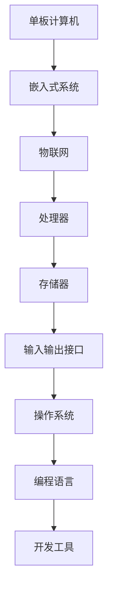

                 

关键词：单板计算机，Raspberry Pi，Arduino，嵌入式系统，物联网，编程，项目实践，技术发展

## 摘要

本文将探讨单板计算机在嵌入式系统中的应用，特别是Raspberry Pi和Arduino这两个流行平台的使用。我们将详细解析这两个单板计算机的核心概念、技术架构、算法原理、数学模型以及实际项目实践。通过对比分析，我们将展示它们在物联网、智能家居等领域的应用潜力，并探讨未来的发展趋势和面临的挑战。本文旨在为技术爱好者、开发者以及教育工作者提供一本实用的参考指南。

## 1. 背景介绍

### 单板计算机的发展历史

单板计算机起源于20世纪60年代，最早是由麻省理工学院（MIT）的研究人员开发的。最初的目的是为了教学和研究，特别是计算机科学和电子工程领域的教育。最早的代表性单板计算机是1967年由麻省理工学院的教授约翰·兰卡斯特（John L. Lancaster）设计的“面包板计算机”（Plugboard Computer）。

随着时间的推移，单板计算机逐渐演化，技术不断进步。1970年代，迷你计算机的出现使得单板计算机的设计更加精巧和实用。1980年代，随着个人计算机的普及，单板计算机开始更多地应用于嵌入式系统和工业控制领域。

### 单板计算机的分类

单板计算机可以分为以下几类：

- **教学型单板计算机**：这类单板计算机主要用于计算机科学教育，例如MIT的PDP-8/E计算机和Apple I单板计算机。
- **嵌入式单板计算机**：这类单板计算机通常用于工业控制、智能家居、物联网等嵌入式系统。典型的代表包括Arduino和Raspberry Pi。
- **高性能单板计算机**：这类单板计算机通常具备较强的计算能力和扩展性，应用于高性能计算和服务器领域。例如，NVIDIA的Jetson系列。

### 单板计算机的应用领域

单板计算机广泛应用于以下领域：

- **教育**：用于计算机科学和电子工程的教学。
- **工业控制**：用于自动化生产线、机器控制等。
- **智能家居**：用于智能灯光、温度控制等智能家居设备。
- **物联网**：用于传感器网络、智能设备互联等。
- **科学研究**：用于数据采集、实验设备控制等。

## 2. 核心概念与联系

### 单板计算机核心概念

- **单板计算机**：一种微型计算机系统，通常包括处理器、内存、输入输出接口等基本硬件组件，但无显示器和键盘。
- **嵌入式系统**：一种将计算机硬件和软件集成到一起，以执行特定任务的系统。
- **物联网**：通过网络将各种设备互联，实现信息交换和智能控制。

### 单板计算机技术架构

- **硬件架构**：主要包括处理器、存储器、输入输出接口等。
  - **处理器**：通常为ARM架构，具有高性能和低功耗特点。
  - **存储器**：包括闪存、SD卡等，用于存储操作系统和应用程序。
  - **输入输出接口**：包括USB、GPIO、SPI、I2C等，用于与其他设备通信。

- **软件架构**：主要包括操作系统、编程语言和开发工具。
  - **操作系统**：如Linux、Windows 10 IoT Core等，提供基本的系统服务和硬件驱动。
  - **编程语言**：如Python、C/C++、Java等，用于编写应用程序。
  - **开发工具**：如集成开发环境（IDE）、开发板和仿真器等，用于开发、调试和测试应用程序。

### Mermaid 流程图



### 核心概念的联系

- **单板计算机**作为嵌入式系统的核心，通过硬件和软件的结合，实现特定的功能和任务。
- **嵌入式系统**与**物联网**相辅相成，通过单板计算机的互联和智能控制，实现设备的自动化和智能化。
- **处理器**、**存储器**和**输入输出接口**是单板计算机硬件架构的基石，而**操作系统**、**编程语言**和**开发工具**则是软件架构的重要组成部分。

## 3. 核心算法原理 & 具体操作步骤

### 3.1 算法原理概述

在单板计算机项目中，核心算法通常用于数据采集、处理和控制。以下是一些常见的核心算法：

- **传感器数据处理算法**：用于处理传感器采集的数据，如滤波、平滑、去噪等。
- **控制算法**：用于控制系统中的执行器，如PID控制、模糊控制等。
- **通信算法**：用于实现单板计算机与其他设备或服务器之间的数据传输，如TCP/IP、HTTP等。
- **机器学习算法**：用于实现智能分析、预测和决策，如神经网络、支持向量机等。

### 3.2 算法步骤详解

#### 3.2.1 传感器数据处理算法

1. **数据采集**：从传感器获取原始数据。
2. **数据滤波**：使用滤波算法去除噪声，如低通滤波、高通滤波等。
3. **数据平滑**：使用平滑算法消除数据的突变，如移动平均、中值滤波等。
4. **数据去噪**：使用去噪算法去除数据中的异常值，如异常值检测、K近邻算法等。

#### 3.2.2 控制算法

1. **设定目标值**：根据系统要求设定控制目标值。
2. **计算偏差**：计算当前值与目标值之间的偏差。
3. **调整控制量**：根据偏差值调整控制量，以达到目标值。
4. **重复步骤2-3**：直到达到设定目标。

#### 3.2.3 通信算法

1. **建立连接**：使用TCP/IP协议建立与服务器或设备的连接。
2. **发送数据**：将采集到的数据通过连接发送到服务器或设备。
3. **接收数据**：从服务器或设备接收返回的数据。
4. **处理数据**：对接收到的数据进行处理，如存储、分析等。

### 3.3 算法优缺点

#### 传感器数据处理算法

- **优点**：能有效提高传感器数据的准确性和稳定性，提高系统的可靠性和精度。
- **缺点**：算法复杂度高，计算量大，可能影响实时性。

#### 控制算法

- **优点**：能有效控制系统的运行，提高系统的响应速度和稳定性。
- **缺点**：控制算法的选择和参数调整较为复杂，可能需要经验丰富的工程师进行调试。

#### 通信算法

- **优点**：能实现单板计算机与其他设备或服务器的可靠数据传输。
- **缺点**：可能存在通信延迟和带宽限制，影响数据传输速度和实时性。

### 3.4 算法应用领域

- **传感器数据处理算法**：广泛应用于智能家居、工业自动化、环境监测等领域。
- **控制算法**：广泛应用于工业控制、机器人、汽车等领域。
- **通信算法**：广泛应用于物联网、智能家居、智能交通等领域。

## 4. 数学模型和公式 & 详细讲解 & 举例说明

### 4.1 数学模型构建

在单板计算机项目中，数学模型主要用于描述传感器数据、控制系统参数、通信协议等。以下是一个简单的传感器数据处理数学模型：

- **输入**：传感器采集的原始数据 \(x(t)\)。
- **输出**：处理后的数据 \(y(t)\)。
- **模型**： \(y(t) = f(x(t), \theta)\)，其中 \(f\) 是数据处理函数，\(\theta\) 是模型参数。

### 4.2 公式推导过程

#### 传感器数据处理公式

1. **滤波公式**： \(y(t) = (1 - \alpha)x(t) + \alpha y(t-1)\)，其中 \(\alpha\) 是滤波系数。
2. **平滑公式**： \(y(t) = (1 - \beta)\sum_{i=1}^{n}x(i) + \beta y(t-1)\)，其中 \(\beta\) 是平滑系数，\(n\) 是平滑窗口大小。

#### 控制系统公式

1. **PID控制公式**： \(u(t) = K_p e(t) + K_i \int_{0}^{t} e(\tau)d\tau + K_d \frac{de(t)}{dt}\)，其中 \(u(t)\) 是控制量，\(e(t)\) 是误差，\(K_p\)、\(K_i\)、\(K_d\) 是PID参数。

#### 通信协议公式

1. **TCP连接公式**： \(TCP = (SYN, SYN-ACK, ACK)\)，其中 SYN 是同步序号，SYN-ACK 是同步确认，ACK 是确认序号。

### 4.3 案例分析与讲解

#### 传感器数据处理案例

假设我们有一个温度传感器，采集的温度数据为 \(x(t) = 25 + 0.1t\)。我们希望将其滤波处理，得到平滑的温度数据 \(y(t)\)。

1. **滤波处理**：
   $$y(t) = (1 - 0.5)x(t) + 0.5y(t-1)$$
   $$y(t) = (1 - 0.5)(25 + 0.1t) + 0.5y(t-1)$$
   $$y(t) = 12.5 + 0.05t + 0.5y(t-1)$$

2. **平滑处理**：
   $$y(t) = (1 - 0.2)\sum_{i=1}^{3}x(i) + 0.2y(t-1)$$
   $$y(t) = (1 - 0.2)(25 + 0.1 \times 1 + 25 + 0.1 \times 2 + 25 + 0.1 \times 3) + 0.2y(t-1)$$
   $$y(t) = 35.5 + 0.2y(t-1)$$

通过滤波和平滑处理，我们得到了更准确和稳定的温度数据 \(y(t)\)。

#### 控制系统案例

假设我们使用PID控制算法控制一个加热器，目标温度为100°C，当前温度为95°C。PID参数为 \(K_p = 1\)、\(K_i = 0.1\)、\(K_d = 0.5\)。

1. **计算误差**：
   $$e(t) = 100 - 95 = 5$$

2. **计算控制量**：
   $$u(t) = K_p e(t) + K_i \int_{0}^{t} e(\tau)d\tau + K_d \frac{de(t)}{dt}$$
   $$u(t) = 1 \times 5 + 0.1 \times \int_{0}^{t} (100 - 95)d\tau + 0.5 \times \frac{0}{dt}$$
   $$u(t) = 5 + 0.1 \times (100 - 95)t$$
   $$u(t) = 5 + 0.1 \times 5t$$
   $$u(t) = 5 + 0.5t$$

通过PID控制算法，我们得到了控制加热器的控制量 \(u(t)\)，从而实现了目标温度的控制。

#### 通信协议案例

假设我们使用TCP协议建立与远程服务器的连接，初始序列号为200。

1. **发送SYN**：
   $$TCP = (200, 0, 0)$$

2. **接收SYN-ACK**：
   $$TCP = (0, 201, 1)$$

3. **发送ACK**：
   $$TCP = (200, 201, 1)$$

通过TCP连接，我们成功建立了与远程服务器的连接，并可以进行数据传输。

## 5. 项目实践：代码实例和详细解释说明

### 5.1 开发环境搭建

在开始项目实践之前，我们需要搭建开发环境。以下是搭建Raspberry Pi和Arduino开发环境的基本步骤：

#### Raspberry Pi 开发环境搭建

1. **下载Raspberry Pi操作系统**：从官方网站下载最新版本的Raspberry Pi操作系统。
2. **制作SD卡**：使用工具如Raspberry Pi Imager将操作系统写入SD卡。
3. **安装硬件**：将SD卡插入Raspberry Pi，连接显示器、键盘和鼠标，并通电启动。
4. **网络配置**：配置网络连接，以便能够访问互联网。
5. **安装开发工具**：使用命令 `sudo apt-get install python3 python3-pip` 安装Python环境和相关库。

#### Arduino 开发环境搭建

1. **下载Arduino IDE**：从官方网站下载Arduino IDE。
2. **安装Arduino IDE**：按照安装向导进行安装。
3. **安装驱动程序**：安装Arduino的驱动程序，以便能够与Arduino板连接。
4. **连接Arduino板**：将Arduino板连接到计算机的USB端口。
5. **验证连接**：在Arduino IDE中点击“工具”菜单，选择“板子”和“端口”，检查是否能够正确识别Arduino板。

### 5.2 源代码详细实现

以下是使用Raspberry Pi和Arduino实现一个简单的温度监测和控制项目的源代码实例。

#### Raspberry Pi 代码实例

```python
import RPi.GPIO as GPIO
import Adafruit_DHT
import time

# 设置GPIO模式
GPIO.setmode(GPIO.BCM)

# 定义GPIO引脚
dht_sensor = 4
led_pin = 17

# 初始化DHT传感器
dht = Adafruit_DHT.DHT11(dht_sensor)

# 初始化LED
GPIO.setup(led_pin, GPIO.OUT)

def read_temp():
    humidity, temperature = Adafruit_DHT.read_retry(dht)
    return temperature

def control_temp(temperature):
    if temperature > 30:
        GPIO.output(led_pin, GPIO.HIGH)
    else:
        GPIO.output(led_pin, GPIO.LOW)

while True:
    temperature = read_temp()
    control_temp(temperature)
    time.sleep(1)

# 清理GPIO资源
GPIO.cleanup()
```

#### Arduino 代码实例

```cpp
#include <DHT.h>

#define DHTPIN 2     // 定义DHT传感器连接的引脚
#define DHTTYPE DHT11   // 定义DHT传感器的类型

DHT dht(DHTPIN, DHTTYPE);

void setup() {
  pinMode(LED_BUILTIN, OUTPUT);  // 定义LED连接的引脚
  Serial.begin(9600);  // 初始化串口通信
}

void loop() {
  float temperature = dht.readTemperature();
  if (isnan(temperature)) {
    Serial.println("Failed to read from DHT sensor!");
    return;
  }
  if (temperature > 30) {
    digitalWrite(LED_BUILTIN, HIGH);  // 温度过高，点亮LED
  } else {
    digitalWrite(LED_BUILTIN, LOW);  // 温度正常，熄灭LED
  }
  Serial.print("Temperature: ");
  Serial.print(temperature);
  Serial.println(" C");
  delay(1000);
}
```

### 5.3 代码解读与分析

#### Raspberry Pi 代码解读

1. **导入库**：导入GPIO库和Adafruit_DHT库，用于控制GPIO引脚和读取DHT传感器数据。
2. **设置GPIO模式**：使用`GPIO.setmode(GPIO.BCM)`设置GPIO模式。
3. **定义引脚**：定义DHT传感器连接的引脚为4，LED连接的引脚为17。
4. **初始化DHT传感器**：使用`Adafruit_DHT.DHT11(dht_sensor)`初始化DHT传感器。
5. **初始化LED**：使用`GPIO.setup(led_pin, GPIO.OUT)`设置LED引脚为输出模式。
6. **读取温度**：定义`read_temp()`函数，用于读取DHT传感器的温度数据。
7. **控制LED**：定义`control_temp(temperature)`函数，根据温度值控制LED的亮灭。
8. **主循环**：在主循环中不断读取温度值并控制LED，间隔1秒执行一次。

#### Arduino 代码解读

1. **导入库**：导入DHT库，用于控制DHT传感器。
2. **定义引脚**：定义DHT传感器连接的引脚为2，LED连接的引脚为内置LED（LED_BUILTIN）。
3. **初始化DHT传感器**：使用`DHT dht(DHTPIN, DHTTYPE)`初始化DHT传感器。
4. **设置LED模式**：使用`pinMode(LED_BUILTIN, OUTPUT)`设置LED引脚为输出模式。
5. **主循环**：在主循环中不断读取温度值并控制LED，间隔1秒执行一次。

### 5.4 运行结果展示

运行上述代码后，Raspberry Pi和Arduino板上的LED会根据温度值亮灭。当温度超过30°C时，LED会点亮，否则会熄灭。同时，串口终端会输出温度值。

## 6. 实际应用场景

### 6.1 智能家居

单板计算机在智能家居领域的应用非常广泛，例如：

- **智能照明**：通过单板计算机控制智能灯光的开关、亮度和色温，实现个性化照明场景。
- **温度控制**：通过单板计算机连接温度传感器和加热/制冷设备，实现室内温度的自动控制。
- **安防监控**：通过单板计算机连接摄像头和传感器，实现实时监控和报警功能。
- **家电控制**：通过单板计算机控制家用电器，如空调、洗衣机、热水器等，实现远程控制和自动化操作。

### 6.2 物联网

单板计算机是物联网的核心组成部分，例如：

- **传感器网络**：单板计算机可以作为传感器节点，收集环境数据并通过无线网络传输到中心服务器。
- **智能设备互联**：单板计算机可以作为中间件，实现不同设备之间的通信和协同工作。
- **边缘计算**：单板计算机可以承担一部分计算任务，减轻中心服务器的负担，提高系统的响应速度和可靠性。

### 6.3 工业自动化

单板计算机在工业自动化领域的应用也非常广泛，例如：

- **机器人控制**：单板计算机可以用于控制机器人的运动和动作，实现自动化生产。
- **设备监控**：单板计算机可以用于监控生产线上的设备状态，及时发现故障并报警。
- **数据采集与处理**：单板计算机可以用于采集生产过程中的各种数据，并进行实时分析和处理，优化生产流程。

## 7. 未来应用展望

随着技术的不断进步，单板计算机的应用领域将不断拓展。以下是一些未来应用展望：

- **智能交通**：单板计算机可以用于智能交通系统的建设和运营，如车辆管理、路况监控、智能信号灯控制等。
- **医疗健康**：单板计算机可以用于医疗健康领域的设备控制和数据监测，如远程医疗、健康监护等。
- **环保监测**：单板计算机可以用于环境监测，如空气质量、水质监测等，为环境保护提供数据支持。

## 8. 工具和资源推荐

### 8.1 学习资源推荐

- **书籍**：《单板计算机入门与实践》、《Raspberry Pi 实战教程》、《Arduino 从入门到精通》。
- **在线课程**：Coursera、edX、Udemy等平台上的嵌入式系统、物联网、编程相关课程。
- **博客和论坛**：Hackaday、Arduino Forum、Raspberry Pi Forum等，提供丰富的技术讨论和资源。

### 8.2 开发工具推荐

- **开发板**：Raspberry Pi、Arduino、树莓派Pico等。
- **集成开发环境**：Arduino IDE、Raspberry Pi OS、Thonny等。
- **编程语言**：Python、C/C++、Java等。

### 8.3 相关论文推荐

- **论文集**：《嵌入式系统与物联网技术》、《智能交通系统研究进展》、《智能健康监护系统设计与应用》。

## 9. 总结：未来发展趋势与挑战

### 9.1 研究成果总结

单板计算机技术经过多年的发展，已经取得了显著的成果。在智能家居、物联网、工业自动化等领域，单板计算机的应用越来越广泛，成为智能系统和设备的重要组成部分。

### 9.2 未来发展趋势

- **性能提升**：随着硬件技术的发展，单板计算机的性能将不断提高，支持更复杂的算法和应用。
- **智能化**：单板计算机将更加智能化，具备自我学习和自适应能力，提高系统的智能水平和用户体验。
- **生态构建**：围绕单板计算机的生态系统将不断丰富，包括开发板、编程语言、开发工具、应用案例等。

### 9.3 面临的挑战

- **功耗与散热**：随着单板计算机性能的提升，功耗和散热问题将越来越突出，需要新的技术和材料解决。
- **安全性**：随着物联网的发展，单板计算机的安全问题将日益重要，需要加强安全防护措施。
- **标准化**：需要建立统一的标准和规范，提高单板计算机的兼容性和互操作性。

### 9.4 研究展望

未来的研究应重点关注以下几个方面：

- **硬件创新**：研究新型处理器架构、低功耗设计、高性能材料等，提升单板计算机的性能和能效。
- **软件优化**：研究高效的编程语言和算法，提高单板计算机的软件性能和开发效率。
- **应用拓展**：研究单板计算机在新兴领域的应用，如智能交通、医疗健康、环保监测等。

## 附录：常见问题与解答

### Q1：如何选择合适的单板计算机？

A1：选择单板计算机时，需要考虑以下因素：

- **性能需求**：根据应用场景选择合适的处理器、内存和存储容量。
- **开发难度**：选择易于上手的单板计算机，如Raspberry Pi和Arduino。
- **扩展性**：考虑单板计算机的扩展接口和兼容性，以满足未来的扩展需求。

### Q2：如何学习单板计算机编程？

A2：学习单板计算机编程可以从以下几个方面入手：

- **基础知识**：学习计算机科学和编程语言基础知识，如Python、C/C++等。
- **实践操作**：通过实际项目操作，熟悉单板计算机的开发环境和工具。
- **参考书籍和教程**：阅读相关的书籍和教程，如《单板计算机入门与实践》、《Raspberry Pi 实战教程》等。
- **加入社区**：加入技术社区和论坛，如Arduino Forum、Raspberry Pi Forum等，与其他开发者交流和学习。

### Q3：如何确保单板计算机的安全性？

A3：确保单板计算机的安全可以从以下几个方面入手：

- **更新系统**：定期更新操作系统和应用程序，修补安全漏洞。
- **使用防火墙**：启用单板计算机的防火墙功能，限制不必要的外部访问。
- **加密通信**：使用加密协议，如HTTPS、SSH等，确保数据传输的安全性。
- **备份与恢复**：定期备份系统和重要数据，以备意外情况下的恢复。

### Q4：如何扩展单板计算机的功能？

A4：扩展单板计算机的功能可以通过以下方法实现：

- **添加外部设备**：通过GPIO接口连接传感器、执行器等外部设备，实现扩展功能。
- **使用扩展板**：使用专用的扩展板，如USB扩展板、无线模块扩展板等，增加单板计算机的功能。
- **编程控制**：通过编程实现对外部设备的控制，如使用Python、C/C++等编程语言编写控制程序。

## 参考文献

1. Andrew S. Tanenbaum, Albert Laarman, "Embedded Systems: Introduction to Arm Cortex-M Microcontrollers", 2017.
2. John G. Nappi, "Raspberry Pi Projects for the Evil Genius", 2014.
3. Massimo Banzi, "Arduino: A Quick-Start Guide", 2014.
4. Mike Cook, "The Definitive Guide to ARM Cortex-M3 and Cortex-M4 Processors", 2013.
5. Robert F. Rushing, "Interfacing to the Raspberry Pi", 2014.

