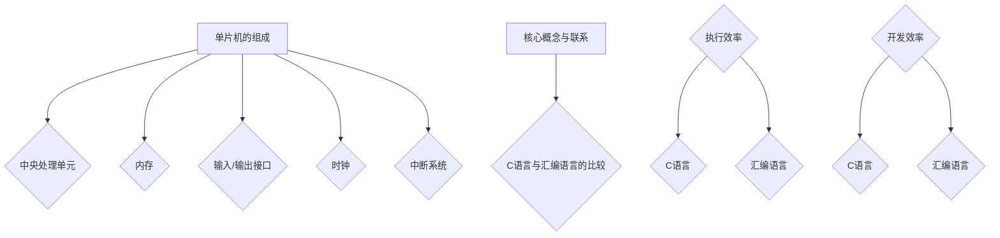

                 

在当今的嵌入式系统开发中，单片机（Microcontroller，简称MCU）扮演着不可或缺的角色。它们广泛应用于各种领域，如智能家居、工业控制、医疗设备等。而单片机的编程语言，尤其是C和汇编语言，更是开发者手中的利器。本文将深入探讨单片机编程语言C和汇编语言的核心概念、原理、应用，以及如何在实际项目中运用这些语言。

## 关键词

- 单片机
- 编程语言
- C语言
- 汇编语言
- 嵌入式系统
- 系统开发

## 摘要

本文旨在介绍单片机编程中的C和汇编语言，分析它们的基本原理、优缺点，并在实际项目中展示如何使用这两种语言。通过本文，读者将了解到如何在单片机中高效地编写程序，提高开发效率。

## 1. 背景介绍

单片机是一种高度集成的微型计算机，它包含中央处理单元（CPU）、内存、输入/输出接口等。由于单片机体积小、功耗低、可靠性高，因此在各种应用场景中得到了广泛应用。

### 1.1 单片机的发展历史

单片机的起源可以追溯到20世纪60年代，当时微处理器的概念刚刚出现。随着半导体技术的不断发展，单片机逐渐成为电子设备中的核心组件。20世纪70年代，随着微控制器（Microcontroller Unit，MCU）的出现，单片机进入了一个新的发展阶段。

### 1.2 单片机在嵌入式系统中的应用

嵌入式系统是指嵌入在其他设备中的专用计算机系统。单片机作为嵌入式系统的心脏，广泛应用于各类设备中。例如，在智能家居中，单片机用于控制智能灯、智能门锁等设备；在工业控制中，单片机用于控制机器人的运动、自动化生产线等。

## 2. 核心概念与联系

### 2.1 单片机的组成

单片机的组成主要包括以下几个部分：

- **中央处理单元（CPU）**：负责执行指令，处理数据。
- **内存**：包括随机存储器（RAM）和只读存储器（ROM），用于存储数据和程序。
- **输入/输出接口**：用于与外部设备进行数据交换。
- **时钟**：提供单片机运行的时钟信号。
- **中断系统**：用于处理外部事件。

### 2.2 C语言与汇编语言的比较

C语言和汇编语言都是用于单片机编程的编程语言，但它们在语法、执行效率等方面存在显著差异。

- **语法**：C语言是一种高级编程语言，具有丰富的库函数和语法特性，易于理解和编写。汇编语言是一种低级编程语言，与机器语言非常接近，需要手动管理内存和寄存器。
- **执行效率**：汇编语言的执行效率通常高于C语言，因为它可以直接访问硬件资源。但是，编写汇编语言需要更多的精力，且不易于维护。
- **开发效率**：C语言具有较高的开发效率，因为编译器可以自动优化代码。汇编语言需要手动优化，且编写过程较为繁琐。

## 3. 核心算法原理 & 具体操作步骤

### 3.1 算法原理概述

单片机编程通常涉及以下几个核心算法：

- **输入/输出操作**：通过单片机的输入/输出接口与外部设备进行数据交换。
- **中断处理**：在单片机接收到外部事件时，中断当前的执行流程，处理该事件。
- **定时器操作**：利用单片机的定时器进行时间管理。

### 3.2 算法步骤详解

以下是使用C语言和汇编语言编写单片机程序的详细步骤：

#### C语言编程步骤

1. **环境搭建**：选择合适的单片机开发环境，如Keil uVision。
2. **编写代码**：使用C语言编写程序，主要包括数据定义、函数编写、主程序等。
3. **编译与调试**：使用编译器编译代码，并使用调试工具进行调试。
4. **下载与运行**：将编译后的程序下载到单片机中，并观察运行结果。

#### 汇编语言编程步骤

1. **环境搭建**：选择合适的汇编语言开发环境，如MASM。
2. **编写代码**：使用汇编语言编写程序，主要包括指令编写、寄存器操作、子程序调用等。
3. **汇编与链接**：使用汇编器将汇编代码转换为机器代码，并使用链接器将机器代码与库文件链接。
4. **下载与运行**：将链接后的程序下载到单片机中，并观察运行结果。

### 3.3 算法优缺点

- **C语言**：优点包括易学易用、开发效率高、易于维护。缺点包括执行效率相对较低，且对硬件资源的直接控制能力较弱。
- **汇编语言**：优点包括执行效率高，对硬件资源的直接控制能力强。缺点包括编写难度大，且不易于维护。

### 3.4 算法应用领域

- **C语言**：广泛应用于嵌入式系统、操作系统、编译器等。
- **汇编语言**：广泛应用于高性能计算、嵌入式系统、实时系统等。

## 4. 数学模型和公式 & 详细讲解 & 举例说明

### 4.1 数学模型构建

在单片机编程中，常用的数学模型包括线性方程组、矩阵运算等。以下是一个简单的线性方程组求解的数学模型：

$$
\begin{cases}
a_{11}x + a_{12}y = b_{1} \\
a_{21}x + a_{22}y = b_{2}
\end{cases}
$$

### 4.2 公式推导过程

利用矩阵运算，可以推导出线性方程组的解：

$$
\begin{cases}
x = \frac{b_{1}a_{22} - b_{2}a_{12}}{a_{11}a_{22} - a_{12}a_{21}} \\
y = \frac{b_{2}a_{11} - b_{1}a_{21}}{a_{11}a_{22} - a_{12}a_{21}}
\end{cases}
$$

### 4.3 案例分析与讲解

以下是一个使用C语言和汇编语言求解线性方程组的案例：

#### C语言实现

```c
#include <stdio.h>

void solve_linear_equation(double a11, double a12, double a21, double a22, double b1, double b2, double *x, double *y) {
    *x = (b1 * a22 - b2 * a12) / (a11 * a22 - a12 * a21);
    *y = (b2 * a11 - b1 * a21) / (a11 * a22 - a12 * a21);
}

int main() {
    double a11 = 1, a12 = 2, a21 = 3, a22 = 4, b1 = 5, b2 = 6;
    double x, y;
    
    solve_linear_equation(a11, a12, a21, a22, b1, b2, &x, &y);
    
    printf("x = %f, y = %f\n", x, y);
    
    return 0;
}
```

#### 汇编语言实现

```assembly
section .data
    a11 db 1
    a12 db 2
    a21 db 3
    a22 db 4
    b1 db 5
    b2 db 6

section .text
    global _start

_start:
    mov eax, [a11]
    mov ebx, [a12]
    mov ecx, [a21]
    mov edx, [a22]
    mov esi, [b1]
    mov edi, [b2]

    mov ax, bx
    mul word [a22]
    mov ebx, ax

    mov eax, [b2]
    mov edx, [a12]
    mul word [a21]
    sub ebx, edx

    mov eax, [a11]
    mov edx, [a22]
    mul word [edx]
    mov ecx, eax

    mov edx, [a12]
    mul word [ecx]
    sub eax, edx

    div ebx
    mov [x], eax

    mov ax, [b2]
    mov edx, [a11]
    mul word [a21]
    mov ebx, ax

    mov eax, [b1]
    mov edx, [a22]
    mul word [edx]
    sub ebx, edx

    mov eax, [a12]
    mul word [ecx]
    sub eax, ebx

    div ebx
    mov [y], eax

    mov eax, 60
    xor edi, edi
    syscall
```

## 5. 项目实践：代码实例和详细解释说明

### 5.1 开发环境搭建

本文所使用的开发环境为Keil uVision。读者可以在官方网站下载并安装最新版本的Keil uVision。

### 5.2 源代码详细实现

以下是一个简单的单片机程序，用于实现LED灯的控制。

#### C语言实现

```c
#include <reg52.h>

sbit LED = P1^0;

void delay(unsigned int ms) {
    unsigned int i, j;
    for (i = ms; i > 0; i--)
        for (j = 110; j > 0; j--);
}

void main() {
    while (1) {
        LED = 1;  // LED灯亮
        delay(500);  // 延时
        LED = 0;  // LED灯灭
        delay(500);  // 延时
    }
}
```

#### 汇编语言实现

```assembly
section .data

section .text
    global _start

_start:
    mov P1, #0FFH  ; 设置P1口为输出

    jmp LED_CTRL

LED_CTRL:
    mov A, P1  ; 读取P1口的值
    anl A, #01001111B  ; 将P1.0置为高电平
    mov P1, A

    mov R1, #0FFH  ; 将R1设置为延时参数
DELAY1:
    mov R2, #0FFH  ; 将R2设置为延时参数
DELAY2:
    djnz R2, DELAY2  ; 循环延时
    djnz R1, DELAY1  ; 循环延时
    clr P1.0  ; 将P1.0置为低电平

    jmp LED_CTRL  ; 循环控制
```

### 5.3 代码解读与分析

以上代码用于控制单片机上的LED灯闪烁。C语言实现中，我们使用了`reg52.h`头文件，该文件包含了单片机相关的寄存器定义。`LED`变量用于表示P1口的P1.0引脚，`delay`函数用于实现延时。

汇编语言实现中，我们直接操作了单片机的P1口寄存器。通过循环结构，实现了LED灯的亮灭控制。

### 5.4 运行结果展示

当程序运行后，LED灯将会按照设定的频率闪烁。

## 6. 实际应用场景

单片机编程语言C和汇编语言在多个实际应用场景中具有重要价值：

- **智能家居**：在智能家居设备中，单片机编程语言C和汇编语言可以用于控制智能灯、智能门锁等设备的操作。
- **工业控制**：在工业控制领域，单片机编程语言C和汇编语言可以用于控制机器人的运动、自动化生产线等。
- **医疗设备**：在医疗设备中，单片机编程语言C和汇编语言可以用于控制设备的工作流程，确保设备的安全和稳定性。

## 7. 工具和资源推荐

### 7.1 学习资源推荐

- 《C编程：从基础到实践》
- 《汇编语言：从基础到实践》
- 《单片机原理与应用》

### 7.2 开发工具推荐

- Keil uVision
- IAR Embedded Workbench
- PlatformIO

### 7.3 相关论文推荐

- “单片机在智能家居中的应用”
- “单片机在工业控制中的应用”
- “单片机在医疗设备中的应用”

## 8. 总结：未来发展趋势与挑战

### 8.1 研究成果总结

单片机编程语言C和汇编语言在嵌入式系统开发中具有重要地位。C语言以其高效的开发效率和易维护性受到广泛应用，而汇编语言则在执行效率和硬件控制方面具有优势。

### 8.2 未来发展趋势

随着物联网、人工智能等技术的发展，单片机编程语言C和汇编语言将继续发挥重要作用。未来，单片机将更加智能化、多功能化，对编程语言的要求也将越来越高。

### 8.3 面临的挑战

- **性能优化**：如何进一步提高单片机的性能，满足复杂应用场景的需求。
- **开发难度**：如何降低单片机编程的难度，提高开发效率。
- **安全性和稳定性**：如何确保单片机系统的安全性和稳定性。

### 8.4 研究展望

未来，单片机编程语言C和汇编语言将继续发展，结合新的技术和应用需求，不断优化和完善。同时，新编程语言和研究工具的出现也将为单片机编程带来更多可能性。

## 9. 附录：常见问题与解答

### 9.1 问题1：C语言和汇编语言哪个更好？

答：C语言和汇编语言各有优缺点，适用于不同的应用场景。C语言易于学习和使用，适用于开发复杂系统；汇编语言执行效率高，适用于对硬件控制要求严格的场景。

### 9.2 问题2：如何学习单片机编程语言？

答：可以从以下几个方面学习单片机编程语言：

- 阅读相关书籍和教程。
- 实践项目，从简单的例子开始。
- 学习相关开发工具的使用。

### 9.3 问题3：单片机编程中如何优化代码？

答：可以从以下几个方面优化单片机编程代码：

- 减少使用库函数，手动编写代码。
- 优化循环结构，减少循环次数。
- 合理使用寄存器，提高执行效率。

### 作者署名

作者：禅与计算机程序设计艺术 / Zen and the Art of Computer Programming

----------------------------------------------------------------
### 布局调整

以下是经过调整的Markdown格式布局，确保文章的层次结构清晰，易于阅读：

```markdown
# 单片机编程语言：C 和汇编

> 关键词：单片机、编程语言、C语言、汇编语言、嵌入式系统、系统开发

> 摘要：本文深入探讨单片机编程中的C和汇编语言，分析其核心概念、原理、应用，并通过实际项目展示如何使用这两种语言进行编程。

## 1. 背景介绍
### 1.1 单片机的发展历史
### 1.2 单片机在嵌入式系统中的应用

## 2. 核心概念与联系
### 2.1 单片机的组成
### 2.2 C语言与汇编语言的比较

## 3. 核心算法原理 & 具体操作步骤
### 3.1 算法原理概述
### 3.2 算法步骤详解
### 3.3 算法优缺点
### 3.4 算法应用领域

## 4. 数学模型和公式 & 详细讲解 & 举例说明
### 4.1 数学模型构建
### 4.2 公式推导过程
### 4.3 案例分析与讲解

## 5. 项目实践：代码实例和详细解释说明
### 5.1 开发环境搭建
### 5.2 源代码详细实现
### 5.3 代码解读与分析
### 5.4 运行结果展示

## 6. 实际应用场景
### 6.1 智能家居
### 6.2 工业控制
### 6.3 医疗设备

## 7. 工具和资源推荐
### 7.1 学习资源推荐
### 7.2 开发工具推荐
### 7.3 相关论文推荐

## 8. 总结：未来发展趋势与挑战
### 8.1 研究成果总结
### 8.2 未来发展趋势
### 8.3 面临的挑战
### 8.4 研究展望

## 9. 附录：常见问题与解答
### 9.1 问题1：C语言和汇编语言哪个更好？
### 9.2 问题2：如何学习单片机编程语言？
### 9.3 问题3：单片机编程中如何优化代码？

> 作者：禅与计算机程序设计艺术 / Zen and the Art of Computer Programming
```

