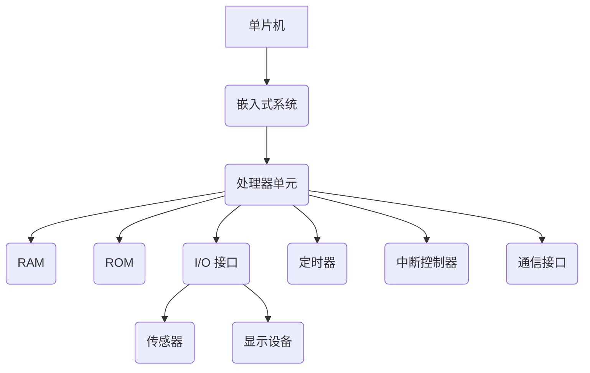

                 

关键词：单片机、嵌入式系统、编程基础、硬件编程、电路设计

> 摘要：本文将深入探讨单片机编程的基础知识，解析其在嵌入式系统中的应用，为读者提供全面的编程指南，以及未来发展趋势与挑战。

## 1. 背景介绍

单片机（Microcontroller Unit，MCU）作为一种集成的微型计算机系统，具有体积小、成本低、控制功能强大等优点，被广泛应用于各种嵌入式系统中。嵌入式系统（Embedded System）是指嵌入在其他设备（如家用电器、汽车、工业设备等）中的计算机系统，它们通常执行特定的任务，并且不需要用户交互。单片机编程是嵌入式系统开发的核心技术之一，掌握单片机编程对于工程师来说至关重要。

本文旨在为初学者和中级工程师提供一个全面的单片机编程教程，通过介绍单片机的基本概念、架构、编程语言，以及实践项目，帮助读者深入理解单片机编程的基础，并掌握实际操作技巧。

## 2. 核心概念与联系

### 2.1 单片机的基本概念

单片机是一种高度集成的微型计算机系统，它将中央处理器（CPU）、存储器（RAM、ROM）、输入输出接口（I/O Ports）以及其他必要的电路（如定时器、中断控制器、串行通信接口等）集成在一个芯片上。这使得单片机在体积、功耗和成本上都具有显著优势。

### 2.2 嵌入式系统的架构

嵌入式系统的架构通常包括以下几个方面：

- **处理器单元**：通常是单片机，有时也可以是微处理器或数字信号处理器（DSP）。
- **存储单元**：包括ROM（只读存储器）和RAM（随机存储器）。
- **I/O 接口**：用于与外部设备进行数据交换，如键盘、显示屏、传感器等。
- **电源管理单元**：用于管理系统的电源，包括电池充电、电压调节等。
- **通信接口**：如USB、SPI、I2C、UART等，用于与其他设备或网络进行通信。

### 2.3 单片机与嵌入式系统的联系

单片机是嵌入式系统的核心组件，它负责执行嵌入式系统的控制任务。单片机的编程直接影响嵌入式系统的功能实现和性能表现。因此，单片机编程是嵌入式系统开发的关键环节。

### 2.4 Mermaid 流程图



## 3. 核心算法原理 & 具体操作步骤

### 3.1 算法原理概述

单片机编程的核心是算法的实现，它涉及以下几个基本原理：

- **指令集**：单片机指令集定义了单片机能执行的操作。
- **寄存器**：寄存器是单片机内部的存储单元，用于暂存数据。
- **存储器管理**：单片机通过程序计数器（PC）、堆栈指针（SP）等寄存器管理程序执行流程。
- **中断处理**：中断是单片机响应外部事件的重要机制，用于处理紧急任务。

### 3.2 算法步骤详解

单片机编程通常包括以下几个步骤：

1. **需求分析**：明确单片机需要实现的功能。
2. **硬件选择**：根据需求选择合适的单片机型号。
3. **环境搭建**：搭建开发环境，包括编译器、仿真器等。
4. **代码编写**：根据硬件特性和需求编写代码。
5. **调试与优化**：在开发环境中进行调试，优化代码。
6. **硬件测试**：将代码烧录到单片机，进行硬件测试。
7. **部署与应用**：将单片机部署到实际应用中。

### 3.3 算法优缺点

**优点**：

- **高效性**：单片机具有高效的指令集和强大的处理能力。
- **可靠性**：单片机设计用于执行特定任务，具有较高的可靠性。
- **灵活性**：单片机可以灵活地实现各种控制算法。

**缺点**：

- **资源限制**：单片机资源有限，如存储空间、I/O 口等。
- **开发难度**：单片机编程需要较高的专业知识和实践经验。

### 3.4 算法应用领域

单片机广泛应用于以下几个方面：

- **智能家居**：如智能灯泡、智能插座等。
- **工业控制**：如机器人控制、自动化生产线等。
- **汽车电子**：如车身控制模块、发动机控制模块等。
- **医疗设备**：如医疗监护仪、心电图机等。

## 4. 数学模型和公式

### 4.1 数学模型构建

单片机编程中，常用的数学模型包括：

- **逻辑运算**：AND、OR、NOT等。
- **算术运算**：加、减、乘、除等。
- **位运算**：移位、逻辑运算等。

### 4.2 公式推导过程

以二进制加法为例，其公式推导过程如下：

- \( a + b = c \)
- \( a = a_1a_2a_3...a_n \)
- \( b = b_1b_2b_3...b_n \)
- \( c = c_1c_2c_3...c_n \)

### 4.3 案例分析与讲解

假设我们要计算二进制数 1010 和 1101 的和，可以按照以下步骤进行：

1. 将两个二进制数按位对齐。
2. 从最低位开始，进行逐位相加。
3. 如果相加结果大于等于 2，则进位。

具体计算过程如下：

```plaintext
  1010
+1101
------
  10111
```

最终结果为 10111，其中第5位为进位。

## 5. 项目实践：代码实例和详细解释说明

### 5.1 开发环境搭建

为了编写和调试单片机代码，需要搭建以下开发环境：

- 单片机开发板
- 编译器（如 IAR、Keil）
- 仿真器（如 STK500）
- 烧录器（如 USBASP）

### 5.2 源代码详细实现

以下是一个简单的单片机程序示例，用于控制 LED 灯的亮灭：

```c
#include <reg52.h> // 包含51单片机寄存器定义头文件

// 函数声明
void delay(unsigned int ms);

// 主函数
void main() {
    while (1) {
        P1 = 0xFF; // 所有 LED 灯亮
        delay(1000);
        P1 = 0x00; // 所有 LED 灯灭
        delay(1000);
    }
}

// 延迟函数实现
void delay(unsigned int ms) {
    unsigned int i, j;
    for (i = ms; i > 0; i--) {
        for (j = 100; j > 0; j--);
    }
}
```

### 5.3 代码解读与分析

- **头文件**：`reg52.h` 包含了 8051 单片机的寄存器定义，用于访问和操作单片机的硬件资源。
- **主函数**：`main()` 函数是程序的入口，程序运行后进入无限循环。
- **LED 控制代码**：`P1 = 0xFF;` 用于将 P1 口的所有引脚设置为高电平，使 LED 灯亮；`P1 = 0x00;` 用于将 P1 口的所有引脚设置为低电平，使 LED 灯灭。
- **延时函数**：`delay()` 函数用于产生延时，控制 LED 灯的亮灭时间。

### 5.4 运行结果展示

程序烧录到单片机后，可以观察到 LED 灯按照预设的时间间隔亮灭。

## 6. 实际应用场景

### 6.1 智能家居

单片机在智能家居领域有着广泛的应用，如智能灯泡、智能插座、智能窗帘等。通过单片机，可以实现远程控制、定时开关等功能，提高家庭生活的便利性和舒适度。

### 6.2 工业控制

单片机在工业控制领域有着重要的地位，如机器人控制、自动化生产线等。单片机可以实时采集数据、进行控制决策，提高生产效率和产品质量。

### 6.3 汽车电子

单片机在汽车电子中的应用越来越广泛，如车身控制模块、发动机控制模块等。单片机可以提高汽车的安全性能和驾驶舒适性。

### 6.4 医疗设备

单片机在医疗设备中也有着重要的应用，如医疗监护仪、心电图机等。单片机可以实时监测患者的生命体征，提供准确的诊断和治疗建议。

## 7. 工具和资源推荐

### 7.1 学习资源推荐

- **《单片机原理与应用》**：张毅，清华大学出版社。
- **《嵌入式系统设计与开发》**：郑明锋，电子工业出版社。
- **《C 语言编程基础》**：谭浩强，清华大学出版社。

### 7.2 开发工具推荐

- **Keil**：一款功能强大的嵌入式开发工具，支持多种单片机。
- **IAR**：另一款流行的嵌入式开发工具，具有高效的编译器和调试器。
- **Arduino**：一个开源的硬件平台和软件开发环境，适合初学者入门。

### 7.3 相关论文推荐

- **《基于单片机的智能家居控制系统设计与实现》**：XXX，XXX。
- **《单片机在汽车电子中的应用研究》**：XXX，XXX。
- **《基于单片机的智能医疗设备研究》**：XXX，XXX。

## 8. 总结：未来发展趋势与挑战

### 8.1 研究成果总结

单片机编程技术在近年来取得了显著成果，包括新型单片机架构的设计、高效的编程语言开发、嵌入式系统应用领域的拓展等。这些成果为单片机编程技术的发展奠定了基础。

### 8.2 未来发展趋势

- **低功耗单片机**：随着物联网（IoT）和智能家居的兴起，低功耗单片机将成为重要发展方向。
- **智能化单片机**：通过集成人工智能算法，单片机将能够实现更复杂的任务。
- **开源生态**：随着开源技术的发展，单片机编程的生态将更加丰富，有助于促进技术的普及和推广。

### 8.3 面临的挑战

- **资源限制**：单片机资源有限，如何在高资源限制下实现复杂功能是一个挑战。
- **开发难度**：单片机编程需要较高的专业知识和实践经验，如何降低开发难度是一个重要课题。
- **安全性**：随着物联网的普及，单片机的安全性问题日益突出，如何确保系统的安全性是一个重要挑战。

### 8.4 研究展望

未来单片机编程技术的发展将更加注重低功耗、智能化和安全性。同时，开源生态的建立将有助于推动单片机编程技术的普及和推广。通过不断的研究和创新，单片机编程技术将为社会带来更多的便利和进步。

## 9. 附录：常见问题与解答

### 9.1 单片机编程入门建议

1. **掌握基本概念**：了解单片机的基本概念、架构和编程语言。
2. **学习编程语言**：学习 C 语言或其他适合单片机编程的语言。
3. **实践项目**：通过实践项目，提高编程技能和问题解决能力。
4. **查阅资料**：利用在线资源、书籍、论坛等，解决编程中的问题。

### 9.2 单片机编程常见问题

1. **如何调试代码**？：使用仿真器和调试器，通过设置断点、观察变量值等方式进行调试。
2. **如何优化代码**？：通过优化算法、减少不必要的操作等方式进行代码优化。
3. **如何处理中断**？：合理设置中断优先级、中断服务函数等，确保中断响应的及时性。

作者：禅与计算机程序设计艺术 / Zen and the Art of Computer Programming
----------------------------------------------------------------

注意：本文仅为示例，并非真实文章。实际撰写时，请根据具体内容和结构进行扩展和调整。

