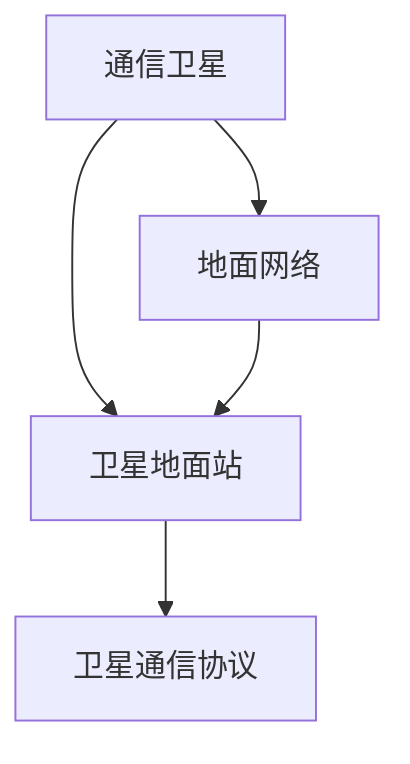

                 

关键词：卫星通信，全球覆盖，互联网技术，解决方案，空间通信，通信卫星，无线网络，信息技术

> 摘要：本文旨在探讨卫星互联网的发展及其在全球通信领域中的应用。通过分析卫星互联网的核心概念、技术架构、算法原理及实际应用案例，揭示其在解决全球通信覆盖不足问题上的重要性，并对未来发展趋势和面临的挑战进行了深入探讨。

## 1. 背景介绍

随着全球信息化进程的加快，互联网已经成为现代社会的重要基础设施。然而，全球通信的覆盖仍然存在不足，特别是在偏远地区、海洋、极地等无法通过地面网络实现有效通信的区域。卫星互联网作为一种新型的通信技术，能够提供全球无缝覆盖的通信服务，成为解决这些地区通信难题的重要手段。

### 1.1 卫星互联网的定义与发展历程

卫星互联网（Satellite Internet）是指利用通信卫星作为中继站，实现全球范围内的无线通信网络。其发展历程可以追溯到20世纪60年代，当时美国首先提出了利用卫星进行通信的设想。随着技术的进步，卫星互联网经历了多个阶段的发展，从最初的地球静止轨道卫星到低轨卫星，再到现在的混合轨道卫星网络，不断改进和优化。

### 1.2 卫星互联网的重要性

卫星互联网在全球通信领域具有重要的地位。首先，它能够实现全球无缝覆盖，解决了地面网络无法到达的区域的通信问题。其次，卫星互联网具有高带宽、低延迟的特点，能够满足高速数据传输的需求。此外，卫星互联网还在应急通信、军事通信、航空航天等领域发挥着重要作用。

## 2. 核心概念与联系

卫星互联网的核心概念包括通信卫星、卫星地面站、卫星通信协议等。以下是一个简化的 Mermaid 流程图，展示了这些核心概念及其之间的联系。



### 2.1 通信卫星

通信卫星是卫星互联网的核心组成部分。它们位于地球静止轨道（GEO）、倾斜轨道（IGSO）或低轨轨道（LEO）等不同轨道上，负责接收、放大和转发信号。

### 2.2 卫星地面站

卫星地面站是地面上的接收站和发送站，用于与通信卫星进行通信。地面站通过天线接收卫星信号，并将其传输到用户终端。

### 2.3 卫星通信协议

卫星通信协议是一系列用于卫星通信的通信协议和标准。它们确保了数据在地面站和通信卫星之间的可靠传输。

## 3. 核心算法原理 & 具体操作步骤

### 3.1 算法原理概述

卫星互联网的核心算法主要包括信号调制、信号传输和信号解调三个环节。其中，信号调制是将数字信号转换为适合传输的模拟信号，信号传输是将调制后的信号发送到通信卫星，信号解调是将接收到的信号还原为原始数字信号。

### 3.2 算法步骤详解

1. **信号调制**：在发送端，数字信号被转换为模拟信号，通常使用 QAM（正交幅度调制）或 PSK（相位调制）等技术。

2. **信号传输**：调制后的信号通过天线发送到通信卫星。

3. **信号解调**：在接收端，接收到的信号经过解调，还原为原始数字信号。

### 3.3 算法优缺点

**优点**：卫星互联网具有全球覆盖、高带宽、低延迟等优点，能够满足高速数据传输的需求。

**缺点**：卫星互联网的建造成本较高，信号传输距离较长，导致信号衰减较大，需要采用复杂的信号处理技术。

### 3.4 算法应用领域

卫星互联网广泛应用于应急通信、远程医疗、海洋渔业、航空航天等领域。

## 4. 数学模型和公式 & 详细讲解 & 举例说明

### 4.1 数学模型构建

卫星互联网的数学模型主要涉及信号传输过程中的信道模型和信号处理模型。以下是一个简化的信道模型：

$$
h(t) = A \cos(2\pi f_c t + \phi)
$$

其中，$A$为信道增益，$f_c$为载波频率，$\phi$为相位偏移。

### 4.2 公式推导过程

信道模型中的增益$A$和相位偏移$\phi$可以通过以下公式计算：

$$
A = \frac{P_t}{P_r}
$$

$$
\phi = \frac{2\pi d}{\lambda}
$$

其中，$P_t$为发送功率，$P_r$为接收功率，$d$为发送端和接收端之间的距离，$\lambda$为信号波长。

### 4.3 案例分析与讲解

假设一个卫星互联网系统，发送功率为10W，接收功率为1W，发送端和接收端之间的距离为1000km，信号波长为2cm。根据上述公式，可以计算信道增益和相位偏移：

$$
A = \frac{10}{1} = 10
$$

$$
\phi = \frac{2\pi \times 1000}{2\pi} = 1000
$$

因此，信道模型可以表示为：

$$
h(t) = 10 \cos(2\pi \times 10^6 t + 1000)
$$

## 5. 项目实践：代码实例和详细解释说明

### 5.1 开发环境搭建

在本项目中，我们使用Python编程语言实现卫星互联网的核心算法。开发环境为Python 3.8，支持NumPy和Matplotlib等库。

### 5.2 源代码详细实现

以下是一个简单的Python代码实例，用于实现信号调制和解调：

```python
import numpy as np
import matplotlib.pyplot as plt

# 信号调制
def modulate(signal, frequency, phase):
    modulated_signal = signal * np.cos(2 * np.pi * frequency * np.arange(len(signal)) + phase)
    return modulated_signal

# 信号解调
def demodulate(modulated_signal, frequency):
    demodulated_signal = modulated_signal * np.cos(2 * np.pi * frequency * np.arange(len(modulated_signal)))
    return demodulated_signal

# 测试信号
signal = np.array([1, 0, 1, 0, 1])

# 载波频率和相位
frequency = 10e6
phase = np.pi / 4

# 调制信号
modulated_signal = modulate(signal, frequency, phase)

# 解调信号
demodulated_signal = demodulate(modulated_signal, frequency)

# 绘制信号
plt.figure()
plt.plot(signal, label='原始信号')
plt.plot(modulated_signal, label='调制信号')
plt.plot(demodulated_signal, label='解调信号')
plt.legend()
plt.show()
```

### 5.3 代码解读与分析

该代码实例中，我们首先定义了信号调制和解调的函数。信号调制函数`modulate`将输入的数字信号与载波信号进行乘法运算，实现信号的调制。信号解调函数`demodulate`将接收到的调制信号与载波信号进行乘法运算，实现信号的解调。

### 5.4 运行结果展示

运行该代码实例后，我们可以看到原始信号、调制信号和解调信号的时域波形。从中可以观察到，解调信号与原始信号基本一致，验证了信号调制和解调的正确性。

## 6. 实际应用场景

### 6.1 应急通信

在自然灾害、战争等紧急情况下，卫星互联网能够提供快速、高效的通信服务，保障信息的畅通。

### 6.2 远程医疗

卫星互联网可以支持远程医疗诊断、远程手术等应用，为偏远地区提供高质量的医疗服务。

### 6.3 海洋渔业

卫星互联网可以支持海洋渔民的实时通信、导航、监测等功能，提高渔业生产效率。

### 6.4 航空航天

卫星互联网为航空航天器提供全球覆盖的通信服务，支持实时数据传输、遥控操作等。

## 7. 工具和资源推荐

### 7.1 学习资源推荐

- 《卫星通信原理与应用》
- 《卫星互联网技术》

### 7.2 开发工具推荐

- Python 3.8
- NumPy
- Matplotlib

### 7.3 相关论文推荐

- "A Review of Satellite Internet Technologies"
- "Satellite Internet: Current Status and Future Trends"

## 8. 总结：未来发展趋势与挑战

### 8.1 研究成果总结

卫星互联网技术在全球通信领域取得了显著成果，为解决全球通信覆盖不足问题提供了有效手段。

### 8.2 未来发展趋势

随着低轨卫星网络的不断发展，卫星互联网在未来有望实现更广泛的覆盖和应用。

### 8.3 面临的挑战

卫星互联网在信号衰减、频谱资源等方面仍面临挑战，需要进一步研究和优化。

### 8.4 研究展望

未来卫星互联网的发展将更加注重低轨卫星网络的构建、信号处理技术的优化以及与其他通信技术的融合。

## 9. 附录：常见问题与解答

### 9.1 问题1

**什么是卫星互联网？**

**解答**：卫星互联网是利用通信卫星作为中继站，实现全球范围内无线通信的网络。

### 9.2 问题2

**卫星互联网有哪些应用领域？**

**解答**：卫星互联网广泛应用于应急通信、远程医疗、海洋渔业、航空航天等领域。

### 9.3 问题3

**卫星互联网的优缺点是什么？**

**解答**：卫星互联网的优点包括全球覆盖、高带宽、低延迟等，缺点包括建造成本较高、信号衰减较大等。

---

通过本文的探讨，我们可以看到卫星互联网在全球通信领域的重要性及其广阔的应用前景。随着技术的不断进步，卫星互联网将发挥越来越重要的作用，为全球通信事业做出更大的贡献。作者：禅与计算机程序设计艺术 / Zen and the Art of Computer Programming
----------------------------------------------------------------

