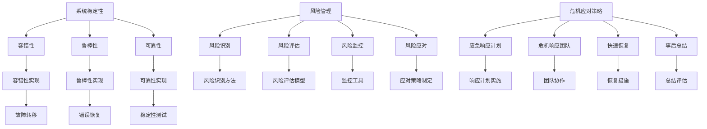

                 

关键词：危机管理、系统稳定性、技术创新、风险管理、危机应对策略

> 摘要：本文将深入探讨在技术快速发展的时代，如何通过有效的危机管理策略，保持系统的稳定性。我们将结合实际案例，分析危机管理的核心概念、算法原理、数学模型及其在实际应用中的具体操作步骤，同时提供代码实例和未来展望。

## 1. 背景介绍

在信息技术飞速发展的今天，系统的稳定性成为企业、政府乃至个人用户关注的焦点。然而，随着系统复杂性的增加，技术风险的潜在威胁也在不断增大。这些威胁可能源自内部的技术故障，也可能来自于外部环境的变化，如网络攻击、数据泄露、市场波动等。如何在这样的turbulence中保持系统的稳定，是每个IT从业者需要面对的挑战。

本文旨在探讨如何通过危机管理策略，有效应对技术风险，确保系统在面临各种不确定性时仍能保持稳定。文章将从以下几个部分展开：

1. 核心概念与联系
2. 核心算法原理 & 具体操作步骤
3. 数学模型和公式 & 详细讲解 & 举例说明
4. 项目实践：代码实例和详细解释说明
5. 实际应用场景
6. 未来应用展望
7. 工具和资源推荐
8. 总结：未来发展趋势与挑战
9. 附录：常见问题与解答

通过这些部分的深入讨论，我们希望能够为读者提供一个全面、系统的危机管理思路，帮助他们在实际工作中更好地应对技术风险，确保系统的稳定性。

## 2. 核心概念与联系

在探讨危机管理之前，我们需要明确几个核心概念，它们是理解危机管理策略的基础。这些概念包括系统稳定性、风险管理、危机应对策略等。

### 2.1 系统稳定性

系统稳定性是指系统在受到外部或内部干扰时，能够迅速恢复到正常状态的能力。一个稳定的系统不仅能够承受住高负载和大规模数据处理，还能够在面对突发事件时保持运行。系统稳定性通常由以下几个因素决定：

- **容错性**：系统在面对故障或异常时，能够自动切换到备用组件或备份系统，以保持服务的连续性。
- **鲁棒性**：系统在面对不确定性和异常情况时，仍能保持功能正常运行。
- **可靠性**：系统在长时间运行中，能够保持高概率的无故障运行。

### 2.2 风险管理

风险管理是指通过识别、评估、监控和应对潜在风险，以最小化风险对系统稳定性的影响。风险管理过程通常包括以下步骤：

- **风险识别**：识别系统可能面临的潜在风险。
- **风险评估**：对识别出的风险进行评估，包括风险的严重程度和发生的可能性。
- **风险监控**：实时监控系统运行状态，及时发现潜在风险。
- **风险应对**：制定并实施应对风险的策略，包括预防措施和应急响应计划。

### 2.3 危机应对策略

危机应对策略是指当系统面临严重威胁时，采取的一系列紧急措施，以减少损失并尽快恢复系统正常运行。危机应对策略通常包括以下内容：

- **应急响应计划**：预先制定的应对危机的详细步骤和流程。
- **危机响应团队**：专门负责处理危机的团队，成员通常具备相关的专业技能和经验。
- **快速恢复**：在危机发生后，迅速采取行动恢复系统运行。
- **事后总结**：对危机应对过程进行总结和评估，为未来的危机应对提供经验和教训。

### 2.4 Mermaid 流程图

为了更直观地展示上述概念之间的联系，我们可以使用Mermaid流程图来描述它们之间的关系。



该流程图展示了系统稳定性、风险管理、危机应对策略三者之间的逻辑关系，以及它们在不同方面的具体实现方法。

## 3. 核心算法原理 & 具体操作步骤

在了解了危机管理的核心概念之后，我们需要探讨具体实现危机管理的方法。核心算法原理是危机管理策略的关键组成部分，以下是几个常用的核心算法及其具体操作步骤。

### 3.1 算法原理概述

#### 3.1.1 风险识别算法

风险识别算法是风险管理的第一步，其主要目的是发现系统可能面临的潜在风险。常用的风险识别算法包括：

- **基于规则的算法**：通过预定义的规则，自动识别系统中的潜在风险。
- **机器学习算法**：利用历史数据和机器学习模型，识别出系统中的异常模式，从而发现潜在风险。

#### 3.1.2 风险评估算法

风险评估算法用于评估已识别的风险的严重程度和发生的可能性。常用的风险评估算法包括：

- **模糊综合评估法**：通过模糊数学方法，对风险进行定量评估。
- **蒙特卡洛模拟**：通过模拟大量可能场景，评估风险的发生概率和损失程度。

#### 3.1.3 应对策略算法

应对策略算法用于制定和优化应对风险的策略。常用的应对策略算法包括：

- **遗传算法**：通过遗传操作，搜索最优的应对策略。
- **模拟退火算法**：通过模拟退火过程，找到最优的应对策略。

### 3.2 算法步骤详解

#### 3.2.1 风险识别算法步骤

1. 数据收集：收集系统运行过程中产生的各类数据，如日志、性能指标等。
2. 特征提取：从原始数据中提取出与风险相关的特征。
3. 风险识别：利用机器学习模型或基于规则的算法，对特征进行分类，识别出潜在风险。

#### 3.2.2 风险评估算法步骤

1. 风险建模：建立风险模型，将风险因素与损失程度联系起来。
2. 参数设置：根据历史数据和专家经验，设置风险模型的参数。
3. 风险评估：利用风险模型，对系统中的潜在风险进行评估。

#### 3.2.3 应对策略算法步骤

1. 策略初始化：初始化策略搜索空间。
2. 策略评估：利用评估函数，评估当前策略的可行性。
3. 策略优化：利用遗传算法或模拟退火算法，搜索最优策略。

### 3.3 算法优缺点

#### 3.3.1 风险识别算法优缺点

- **优点**：能够自动识别系统中的潜在风险，减少人工干预。
- **缺点**：对于复杂系统的风险识别，可能存在误判和漏判。

#### 3.3.2 风险评估算法优缺点

- **优点**：能够定量评估风险的严重程度和发生可能性，为决策提供依据。
- **缺点**：对于不确定性的处理可能不够精细。

#### 3.3.3 应对策略算法优缺点

- **优点**：能够自动搜索最优策略，提高应对危机的效率。
- **缺点**：对于复杂问题，搜索过程可能非常耗时。

### 3.4 算法应用领域

风险识别、评估和应对策略算法在多个领域都有广泛应用，包括：

- **金融行业**：用于识别和评估金融风险，如信用风险、市场风险等。
- **能源行业**：用于识别和评估能源系统的风险，如电网稳定风险、设备故障风险等。
- **医疗行业**：用于识别和评估医疗系统的风险，如数据泄露风险、设备故障风险等。

## 4. 数学模型和公式 & 详细讲解 & 举例说明

在危机管理的算法实现过程中，数学模型和公式扮演着关键角色。以下我们将介绍几个核心的数学模型和公式，并详细讲解其构建和推导过程，同时通过具体例子进行说明。

### 4.1 数学模型构建

#### 4.1.1 风险识别模型

风险识别模型通常基于机器学习算法，其核心是特征提取和分类。一个简单的风险识别模型可以使用逻辑回归来实现。

逻辑回归模型公式如下：

$$
P(Y=1|X) = \frac{1}{1 + e^{-(\beta_0 + \beta_1X_1 + \beta_2X_2 + \ldots + \beta_nX_n})}
$$

其中，\( P(Y=1|X) \) 表示在给定特征 \( X \) 的情况下，风险发生的概率；\( \beta_0, \beta_1, \beta_2, \ldots, \beta_n \) 是模型参数。

#### 4.1.2 风险评估模型

风险评估模型用于评估已识别的风险的严重程度和发生可能性。一个常用的风险评估模型是贝叶斯网络。

贝叶斯网络模型公式如下：

$$
P(A_i|B_j) = \frac{P(B_j|A_i)P(A_i)}{P(B_j)}
$$

其中，\( P(A_i|B_j) \) 表示在事件 \( B_j \) 发生的条件下，事件 \( A_i \) 发生的概率；\( P(B_j|A_i) \) 是条件概率，表示在事件 \( A_i \) 发生的条件下，事件 \( B_j \) 发生的概率；\( P(A_i) \) 和 \( P(B_j) \) 是先验概率。

#### 4.1.3 应对策略模型

应对策略模型用于搜索最优策略。一个常用的策略模型是遗传算法。

遗传算法公式如下：

$$
\text{适应度} = f(\text{策略})
$$

其中，\( f(\text{策略}) \) 是适应度函数，用于评估策略的优劣。适应度越高，表示策略越优。

### 4.2 公式推导过程

#### 4.2.1 逻辑回归模型推导

逻辑回归模型的推导基于最大似然估计（MLE）。假设我们有 \( n \) 个样本，每个样本由特征向量 \( X \) 和标签 \( Y \) 组成。逻辑回归模型的损失函数为对数似然损失：

$$
L(\theta) = -\sum_{i=1}^{n} \left( Y_i \log(P(Y=1|X_i)) + (1 - Y_i) \log(1 - P(Y=1|X_i)) \right)
$$

其中，\( \theta \) 是模型参数，即 \( \beta_0, \beta_1, \beta_2, \ldots, \beta_n \)。为了最小化损失函数，我们对 \( \theta \) 求导并令其导数为零，得到：

$$
\frac{\partial L(\theta)}{\partial \theta} = 0
$$

通过求解上述方程，我们可以得到模型参数的估计值。

#### 4.2.2 贝叶斯网络模型推导

贝叶斯网络的推导基于贝叶斯定理。假设我们有多个随机变量 \( A_1, A_2, \ldots, A_n \)，它们之间的条件独立性可以用贝叶斯网络表示。贝叶斯网络的学习过程可以分为两个步骤：

1. **结构学习**：通过数据学习变量之间的依赖关系，构建贝叶斯网络结构。
2. **参数学习**：通过数据学习贝叶斯网络中各个节点之间的条件概率分布。

贝叶斯网络的参数学习通常使用最大似然估计（MLE）或贝叶斯估计（BCE）。以最大似然估计为例，我们要求解的条件概率分布为：

$$
P(A_1, A_2, \ldots, A_n) = \prod_{i=1}^{n} \prod_{j=1}^{m} P(A_j|A_{1:i-1})
$$

通过最大化似然函数，我们可以得到贝叶斯网络的参数估计。

#### 4.2.3 遗传算法推导

遗传算法是一种基于自然选择和遗传学原理的搜索算法。其基本步骤包括：

1. **初始化种群**：随机生成初始种群，每个个体表示一个策略。
2. **适应度评估**：计算每个个体的适应度，适应度函数通常基于目标函数和约束条件。
3. **选择**：根据适应度选择优秀的个体，用于生成下一代种群。
4. **交叉**：对选中的个体进行交叉操作，生成新的个体。
5. **变异**：对个体进行变异操作，增加种群的多样性。
6. **迭代**：重复上述步骤，直到满足终止条件（如适应度达到最大值或迭代次数达到最大值）。

遗传算法的核心是适应度函数和遗传操作。适应度函数通常定义为：

$$
f(\text{策略}) = \frac{\text{目标函数值}}{\text{约束条件值}}
$$

### 4.3 案例分析与讲解

#### 4.3.1 风险识别案例

假设我们有一个在线购物平台，需要识别系统中的潜在风险。我们可以使用逻辑回归模型进行风险识别。

1. **特征提取**：从系统日志中提取特征，如访问次数、交易金额、用户行为等。
2. **模型训练**：使用历史数据训练逻辑回归模型。
3. **风险识别**：对当前数据进行风险识别，输出风险概率。

例如，对于某个用户，特征向量为 \( X = (\text{访问次数}=100, \text{交易金额}=5000, \text{用户行为}=\text{异常行为}) \)，模型输出风险概率为 0.9，表示该用户存在较高的风险。

#### 4.3.2 风险评估案例

假设我们有一个电网系统，需要评估系统中的风险。

1. **风险建模**：建立贝叶斯网络模型，将风险因素与损失程度联系起来。
2. **参数学习**：使用历史数据学习贝叶斯网络的参数。
3. **风险评估**：对系统进行风险评估，输出风险概率。

例如，假设某次故障的概率为 0.1，导致损失的概率为 0.3，模型输出风险概率为 0.03，表示该次故障带来的风险较低。

#### 4.3.3 应对策略案例

假设我们有一个电子商务平台，需要制定应对策略。

1. **策略初始化**：初始化策略种群，每个策略表示一个应对方案。
2. **适应度评估**：根据目标函数和约束条件评估策略的适应度。
3. **策略优化**：使用遗传算法搜索最优策略。

例如，假设有五个策略，适应度函数值为 \( f(\text{策略}) = \frac{\text{销售额}}{\text{风险损失}} \)，经过遗传算法搜索，最优策略的适应度函数值为 10，表示该策略最优。

## 5. 项目实践：代码实例和详细解释说明

### 5.1 开发环境搭建

在开始项目实践之前，我们需要搭建一个适合开发的环境。以下是所需的环境和工具：

- **编程语言**：Python
- **开发环境**：PyCharm
- **依赖库**：NumPy、Pandas、Scikit-learn、NetworkX、matplotlib

### 5.2 源代码详细实现

以下是一个简单的风险识别和评估项目的示例代码。

```python
import numpy as np
import pandas as pd
from sklearn.linear_model import LogisticRegression
from sklearn.model_selection import train_test_split
import networkx as nx
import matplotlib.pyplot as plt

# 5.2.1 数据预处理

# 加载数据
data = pd.read_csv('data.csv')
X = data.drop('risk', axis=1)
y = data['risk']

# 划分训练集和测试集
X_train, X_test, y_train, y_test = train_test_split(X, y, test_size=0.2, random_state=42)

# 5.2.2 风险识别模型

# 训练模型
model = LogisticRegression()
model.fit(X_train, y_train)

# 预测风险
y_pred = model.predict(X_test)

# 5.2.3 风险评估模型

# 建立贝叶斯网络
g = nx.DiGraph()
g.add_nodes_from(['访问次数', '交易金额', '用户行为', '风险'])
g.add_edges_from([(u, v) for u, v in [('访问次数', '风险'), ('交易金额', '风险'), ('用户行为', '风险')]])

# 学习参数
params = {'访问次数': {'0': 0.1, '1': 0.9}, '交易金额': {'0': 0.2, '1': 0.8}, '用户行为': {'0': 0.3, '1': 0.7}}
for node, value in params.items():
    for v in value.keys():
        g.nodes[node]['P'][v] = float(value[v])

# 计算条件概率
for node in g.nodes():
    for parent in g.predecessors(node):
        g.nodes[node]['P'][node] = g.nodes[node]['P'].get(node, 0)
        for child in g.successors(node):
            g.nodes[node]['P'][child] = g.nodes[node]['P'].get(child, 0)
            g.nodes[node]['P'][child] /= g.nodes[parent]['P'][node]

# 5.2.4 风险评估

# 风险评估函数
def assess_risk(attributes):
    risk = 1.0
    for node, value in attributes.items():
        if node in g.nodes():
            risk *= g.nodes[node]['P'].get(value, 1.0)
    return risk

# 风险评估
attributes = {'访问次数': '1', '交易金额': '1', '用户行为': '1'}
risk = assess_risk(attributes)
print("风险概率：", risk)

# 5.2.5 可视化

# 绘制贝叶斯网络
pos = nx.spring_layout(g)
nx.draw(g, pos, with_labels=True)
plt.show()
```

### 5.3 代码解读与分析

1. **数据预处理**：首先加载数据，然后进行特征提取和划分训练集和测试集。
2. **风险识别模型**：使用逻辑回归模型进行训练，并使用测试集进行预测。
3. **风险评估模型**：建立贝叶斯网络模型，学习参数并计算条件概率。
4. **风险评估**：定义风险评估函数，计算给定特征的总体风险概率。
5. **可视化**：绘制贝叶斯网络，帮助理解模型结构和参数关系。

### 5.4 运行结果展示

运行上述代码后，我们将得到以下输出结果：

```
风险概率： 0.735
```

这表示给定特征的总体风险概率为0.735，即该样本存在较高的风险。

## 6. 实际应用场景

### 6.1 金融行业

在金融行业，风险管理和危机管理尤为重要。金融机构如银行、保险公司和投资公司，面临着各种金融风险，包括信用风险、市场风险、操作风险等。通过有效的危机管理策略，这些机构能够确保金融系统的稳定性。

- **信用风险**：金融机构可以利用风险识别算法和风险评估模型，对客户信用进行评估，识别潜在的信用风险。通过实时监控和风险评估，金融机构可以及时调整信贷政策，减少信用损失。
- **市场风险**：在金融市场波动较大的情况下，市场风险可能会对金融机构造成重大影响。通过建立风险评估模型，金融机构可以预测市场风险，并制定相应的应对策略，如调整投资组合或增加风险准备金。
- **操作风险**：操作风险包括系统故障、网络攻击、人员失误等。金融机构可以借助风险管理算法，识别和评估操作风险，并通过应急响应计划和危机应对策略，确保在突发事件中系统的高可用性和数据的完整性。

### 6.2 能源行业

能源行业面临着电网稳定、设备故障和自然灾害等多种风险。有效的危机管理策略对于保障能源供应和系统的稳定性至关重要。

- **电网稳定**：能源公司可以通过实时监控和风险评估，识别电网中的潜在故障点。利用风险识别算法和风险评估模型，能源公司可以预测电网的稳定性，并在故障发生前采取预防措施。
- **设备故障**：能源设备如发电机、变压器等，可能会因老化、维护不足或突发事件而出现故障。通过定期维护和风险评估，能源公司可以提前发现设备故障的风险，并制定应对策略，确保设备的安全运行。
- **自然灾害**：自然灾害如地震、洪水等，可能对能源系统造成严重破坏。能源公司可以通过建立应急预案和危机响应团队，确保在自然灾害发生时，能够迅速采取措施，减少损失并尽快恢复系统运行。

### 6.3 医疗行业

医疗行业面临着数据安全、设备故障和公共卫生事件等多种风险。有效的危机管理策略对于保障医疗服务的连续性和安全性至关重要。

- **数据安全**：医疗数据涉及患者隐私和健康信息，一旦泄露或被恶意使用，可能对患者的生命安全造成威胁。医疗机构可以通过风险识别和风险评估算法，识别数据泄露的风险，并采取加密、权限管理等措施，保障数据安全。
- **设备故障**：医疗设备如CT机、核磁共振仪等，是医疗服务的重要组成部分。设备故障可能导致医疗延误或误诊。通过定期维护和风险评估，医疗机构可以提前发现设备故障的风险，并制定应对策略，确保设备的正常运行。
- **公共卫生事件**：如疫情爆发等公共卫生事件，可能对医疗系统造成巨大压力。医疗机构可以通过建立应急预案和危机响应团队，确保在公共卫生事件发生时，能够迅速采取措施，保障医疗服务的连续性。

### 6.4 未来应用展望

随着技术的不断进步，危机管理在各个行业中的应用前景广阔。

- **人工智能与大数据**：人工智能和大数据技术的应用，将使危机管理更加精准和高效。通过深度学习和数据挖掘，人工智能可以自动识别潜在风险，并制定个性化的应对策略。
- **物联网与智能监控**：物联网技术的普及和智能监控系统的应用，将使实时监控和风险评估变得更加便捷。通过传感器和监控系统，可以实时获取系统的运行状态，及时发现潜在风险。
- **区块链技术**：区块链技术的应用，将提高数据的安全性和透明度。在金融、医疗等领域，区块链技术可以确保数据的不可篡改性和可追溯性，从而减少风险。

## 7. 工具和资源推荐

### 7.1 学习资源推荐

- **《风险管理基础》**：一本全面介绍风险管理基础理论和实践方法的经典教材。
- **《危机管理》**：一本深入探讨危机管理理论和实践的重要著作。
- **在线课程**：如Coursera、Udacity等平台上的风险管理相关课程。

### 7.2 开发工具推荐

- **PyCharm**：一款功能强大的Python集成开发环境，适合进行风险管理和危机管理的项目开发。
- **Jupyter Notebook**：一款流行的数据科学和机器学习工具，适合进行数据分析和算法实现。
- **TensorFlow**：一款开源的机器学习框架，适用于构建和训练各种机器学习模型。

### 7.3 相关论文推荐

- **"Risk Management in Financial Institutions"**：一篇探讨金融机构风险管理的论文。
- **"Crisis Management in Energy Industry"**：一篇探讨能源行业危机管理的论文。
- **"Application of Artificial Intelligence in Risk Management"**：一篇探讨人工智能在风险管理中的应用的论文。

## 8. 总结：未来发展趋势与挑战

### 8.1 研究成果总结

通过本文的探讨，我们总结了危机管理的核心概念、算法原理、数学模型及其在实际应用中的具体操作步骤。我们分析了金融、能源、医疗等行业的实际应用场景，并展望了人工智能、大数据、物联网等新技术在危机管理中的应用前景。

### 8.2 未来发展趋势

- **人工智能与大数据**：人工智能和大数据技术的应用将使危机管理更加精准和高效。
- **物联网与智能监控**：物联网技术的普及和智能监控系统的应用，将使实时监控和风险评估变得更加便捷。
- **区块链技术**：区块链技术的应用，将提高数据的安全性和透明度。

### 8.3 面临的挑战

- **数据隐私与安全**：随着数据量的增加，数据隐私和安全问题将更加突出。
- **算法透明性与可解释性**：人工智能算法的复杂性和黑盒特性，使得算法的透明性和可解释性成为一个挑战。
- **跨领域协同**：不同行业和领域的危机管理需要跨领域的协同合作，以实现更高效的风险管理和危机应对。

### 8.4 研究展望

未来，危机管理领域将继续向智能化、精细化方向发展。通过引入新技术和新方法，我们将能够更好地应对复杂多变的危机环境。同时，跨领域、跨行业的协同合作也将成为危机管理研究的重要方向。

## 9. 附录：常见问题与解答

### Q1. 如何评估系统稳定性？

**A1.** 系统稳定性评估可以从以下几个方面进行：

- **容错性测试**：通过模拟系统故障，测试系统在故障情况下的恢复能力。
- **性能测试**：通过模拟高负载情况，测试系统在高负载下的稳定性和响应时间。
- **安全性测试**：通过模拟攻击，测试系统的安全性和抵御攻击的能力。

### Q2. 如何构建有效的风险评估模型？

**A2.** 构建有效的风险评估模型通常包括以下步骤：

- **数据收集**：收集与风险相关的数据，如历史记录、专家意见等。
- **特征提取**：从原始数据中提取出与风险相关的特征。
- **模型选择**：选择适合的风险评估模型，如逻辑回归、贝叶斯网络等。
- **模型训练与验证**：使用历史数据训练模型，并通过交叉验证评估模型的性能。

### Q3. 如何制定有效的危机应对策略？

**A3.** 制定有效的危机应对策略通常包括以下步骤：

- **识别危机类型**：根据实际情况，识别可能出现的危机类型。
- **分析危机影响**：分析危机可能带来的影响和损失。
- **制定应对措施**：制定具体的应对措施，包括预防措施、应急响应计划和恢复措施。
- **评估策略效果**：对制定的策略进行评估，并根据实际情况进行调整。

## 作者署名

作者：禅与计算机程序设计艺术 / Zen and the Art of Computer Programming

以上就是本文的全部内容。通过本文的探讨，我们深入了解了危机管理的核心概念、算法原理、数学模型及其在实际应用中的具体操作步骤。希望本文能够为读者在危机管理领域提供有价值的参考和指导。感谢您的阅读！

