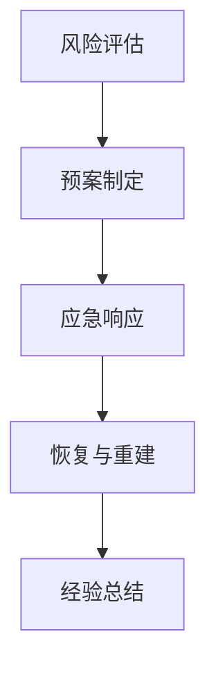

                 

 关键词：危机管理、突发事件、应对策略、IT行业、数据处理、系统架构、人工智能

> 摘要：本文从IT行业的实际案例出发，探讨危机管理在应对突发事件中的重要性。通过深入分析核心概念和算法原理，结合数学模型和具体案例，提出了一套有效的危机管理方法，旨在为IT从业人员提供实用的指导。

## 1. 背景介绍

在当今高度信息化的社会中，信息技术（IT）已成为各行各业发展的关键驱动力。然而，随着IT系统的复杂性和规模不断扩大，突发事件（如系统崩溃、数据泄露、网络攻击等）时有发生，给企业带来巨大的经济损失和声誉风险。危机管理作为一种预防和应对突发事件的重要手段，对于保障IT系统的稳定运行和业务连续性具有重要意义。

本文旨在从IT行业的视角出发，探讨危机管理在应对突发事件中的重要性，分析核心概念和算法原理，并结合具体案例提出一套有效的危机管理方法。通过本文的阅读，读者将了解到危机管理的基本流程、关键技术和实践策略。

## 2. 核心概念与联系

### 2.1 危机管理概述

危机管理是指组织在面对突发事件时，采取一系列措施进行预防和应对的过程。危机管理主要包括以下几个环节：

1. **风险评估**：通过对潜在风险的识别和评估，确定组织面临的主要威胁。
2. **预案制定**：根据风险评估结果，制定相应的应急预案，明确应对措施和责任分工。
3. **应急响应**：在突发事件发生时，按照预案迅速采取行动，尽量减少损失。
4. **恢复与重建**：在危机过后，进行系统的恢复和重建，总结经验教训，改进应急预案。

### 2.2 算法原理

在危机管理中，算法的应用主要体现在以下几个方面：

1. **风险评估算法**：通过数据分析和机器学习等技术，对潜在风险进行定量评估。
2. **应急响应算法**：在突发事件发生时，快速计算最佳应对策略，如资源分配、路径规划等。
3. **恢复重建算法**：在危机过后，根据损失情况，制定恢复和重建方案。

为了更好地说明算法原理，我们使用Mermaid流程图展示一个典型的危机管理流程：



## 3. 核心算法原理 & 具体操作步骤

### 3.1 算法原理概述

在本节中，我们将详细讨论危机管理中涉及的核心算法原理，包括风险评估、应急响应和恢复重建算法。

#### 3.1.1 风险评估算法

风险评估算法主要用于识别和评估潜在风险。其基本原理包括：

1. **风险识别**：通过数据采集、历史案例分析等方法，识别组织面临的潜在风险。
2. **风险评估**：利用概率论、统计等方法，对识别出的风险进行量化评估，确定其影响程度和发生概率。
3. **风险排序**：根据评估结果，对风险进行排序，确定优先处理的风险。

#### 3.1.2 应急响应算法

应急响应算法主要用于在突发事件发生时，快速计算最佳应对策略。其基本原理包括：

1. **资源分配**：根据应急资源的可用性，合理分配资源，确保应对措施的可行性。
2. **路径规划**：在应急资源分配的基础上，计算最佳的路径规划，确保应急响应的高效性。
3. **策略选择**：根据路径规划和资源分配结果，选择最佳应对策略，如关闭部分系统、转移数据等。

#### 3.1.3 恢复重建算法

恢复重建算法主要用于在危机过后，根据损失情况，制定恢复和重建方案。其基本原理包括：

1. **损失评估**：通过对受影响系统的全面检查，评估损失情况。
2. **恢复方案**：根据损失评估结果，制定恢复方案，包括系统修复、数据恢复等。
3. **重建方案**：在恢复完成后，根据业务需求，制定重建方案，确保业务的持续稳定运行。

### 3.2 算法步骤详解

在本节中，我们将详细介绍危机管理中涉及的核心算法的具体操作步骤。

#### 3.2.1 风险评估算法步骤

1. **数据采集**：通过数据采集工具，收集组织内部的各类数据，包括历史故障记录、系统日志、用户反馈等。
2. **风险识别**：利用数据分析和机器学习等技术，对采集到的数据进行分析，识别出潜在的威胁。
3. **风险评估**：根据识别出的风险，利用概率论、统计等方法，对其进行量化评估，确定其影响程度和发生概率。
4. **风险排序**：根据评估结果，对风险进行排序，确定优先处理的风险。

#### 3.2.2 应急响应算法步骤

1. **资源分配**：根据应急资源的可用性，建立资源分配模型，计算最佳资源分配策略。
2. **路径规划**：利用路径规划算法（如Dijkstra算法、A*算法等），计算最佳路径规划策略。
3. **策略选择**：根据路径规划和资源分配结果，选择最佳应对策略，如关闭部分系统、转移数据等。

#### 3.2.3 恢复重建算法步骤

1. **损失评估**：通过对受影响系统的全面检查，评估损失情况，包括系统性能、数据完整性等。
2. **恢复方案**：根据损失评估结果，制定恢复方案，包括系统修复、数据恢复等。
3. **重建方案**：在恢复完成后，根据业务需求，制定重建方案，确保业务的持续稳定运行。

### 3.3 算法优缺点

#### 3.3.1 风险评估算法优缺点

**优点**：

1. **全面性**：通过数据分析和机器学习等技术，可以全面识别和评估潜在风险。
2. **精确性**：利用概率论、统计等方法，可以对风险进行精确量化评估。

**缺点**：

1. **数据依赖性**：风险评估算法对数据质量要求较高，数据质量直接影响评估结果的准确性。
2. **计算复杂度**：对于大规模数据，风险评估算法的计算复杂度较高，可能影响算法的实时性。

#### 3.3.2 应急响应算法优缺点

**优点**：

1. **高效性**：利用路径规划和资源分配算法，可以快速计算最佳应对策略。
2. **灵活性**：根据实际情况，可以灵活调整应对策略，确保应对措施的有效性。

**缺点**：

1. **实时性要求**：在突发事件发生时，应急响应算法需要快速计算最佳策略，对算法的实时性要求较高。
2. **资源限制**：应急响应算法需要考虑资源的可用性，可能受到资源限制的影响。

#### 3.3.3 恢复重建算法优缺点

**优点**：

1. **恢复性**：通过损失评估和恢复方案，可以确保受影响系统的尽快恢复。
2. **稳定性**：通过重建方案，可以确保业务的持续稳定运行。

**缺点**：

1. **耗时较长**：恢复重建算法可能需要较长的时间来完成系统恢复和重建。
2. **成本较高**：恢复重建算法可能需要投入大量的人力、物力和财力。

### 3.4 算法应用领域

风险评估、应急响应和恢复重建算法在危机管理中具有广泛的应用领域，包括但不限于以下几个方面：

1. **IT系统安全**：通过风险评估算法，可以识别和评估IT系统的潜在安全风险；通过应急响应算法，可以在发生安全事件时迅速采取应对措施；通过恢复重建算法，可以在安全事件发生后尽快恢复系统的正常运行。
2. **业务连续性**：通过风险评估算法，可以识别和评估业务连续性风险；通过应急响应算法，可以在业务中断时迅速采取应对措施；通过恢复重建算法，可以在业务中断后尽快恢复业务的正常运行。
3. **供应链管理**：通过风险评估算法，可以识别和评估供应链中的潜在风险；通过应急响应算法，可以在供应链中断时迅速采取应对措施；通过恢复重建算法，可以在供应链中断后尽快恢复供应链的正常运行。

## 4. 数学模型和公式 & 详细讲解 & 举例说明

### 4.1 数学模型构建

在危机管理中，数学模型的应用至关重要。以下是一个简单的数学模型构建过程：

1. **风险识别**：通过历史数据，建立风险识别模型。
   $$ R = f(D) $$
   其中，$R$ 表示风险，$D$ 表示数据集。

2. **风险评估**：利用风险评估模型，对识别出的风险进行量化评估。
   $$ E = g(R) $$
   其中，$E$ 表示评估值，$R$ 表示风险。

3. **应急响应**：根据风险评估结果，建立应急响应模型。
   $$ S = h(E) $$
   其中，$S$ 表示应急响应方案，$E$ 表示评估值。

4. **恢复重建**：在危机过后，建立恢复重建模型。
   $$ R' = i(S) $$
   其中，$R'$ 表示恢复后的风险，$S$ 表示应急响应方案。

### 4.2 公式推导过程

以下是一个具体的数学模型推导过程：

1. **风险识别模型**：

   假设 $D$ 是一个包含 $n$ 个数据的集合，每个数据表示一个潜在的威胁。我们可以使用决策树算法来构建风险识别模型。

   $$ R = \sum_{i=1}^{n} w_i \cdot t_i $$
   其中，$w_i$ 表示第 $i$ 个数据的权重，$t_i$ 表示第 $i$ 个数据的威胁程度。

2. **风险评估模型**：

   在风险识别模型的基础上，我们可以使用贝叶斯公式来构建风险评估模型。

   $$ P(R|D) = \frac{P(D|R) \cdot P(R)}{P(D)} $$
   其中，$P(R|D)$ 表示在给定 $D$ 的情况下，风险 $R$ 的概率；$P(D|R)$ 表示在给定 $R$ 的情况下，数据 $D$ 的概率；$P(R)$ 表示风险 $R$ 的概率；$P(D)$ 表示数据 $D$ 的概率。

3. **应急响应模型**：

   在风险评估模型的基础上，我们可以使用线性规划来构建应急响应模型。

   $$ \min_{x} c^T \cdot x $$
   $$ s.t. A \cdot x \geq b $$
   其中，$x$ 表示应急响应方案，$c$ 表示目标函数，$A$ 表示约束条件，$b$ 表示约束条件右侧值。

4. **恢复重建模型**：

   在应急响应模型的基础上，我们可以使用马尔可夫链来构建恢复重建模型。

   $$ P(R'|S) = \sum_{i=1}^{n} p_i \cdot P(R'|S_i) $$
   其中，$R'$ 表示恢复后的风险，$S$ 表示应急响应方案，$p_i$ 表示从 $S$ 到 $S_i$ 的转移概率，$P(R'|S_i)$ 表示在给定 $S_i$ 的情况下，恢复后风险 $R'$ 的概率。

### 4.3 案例分析与讲解

以下是一个具体的危机管理案例：

**案例背景**：某企业IT系统发生了一次重大数据泄露事件，导致大量用户数据被泄露。企业需要尽快采取措施进行危机管理。

**案例过程**：

1. **风险识别**：通过数据采集和分析，识别出数据泄露风险。

2. **风险评估**：利用贝叶斯公式，评估数据泄露风险的概率。

3. **应急响应**：根据风险评估结果，企业决定采取以下应急响应措施：

   - 立即关闭受影响的系统，防止数据进一步泄露；
   - 对受影响的用户数据进行备份，确保数据完整性；
   - 调查数据泄露原因，查找漏洞并进行修复。

4. **恢复重建**：在应急响应措施实施后，企业开始恢复和重建系统：

   - 对受影响的系统进行修复，确保系统的正常运行；
   - 对用户数据进行分析，确保数据的安全性和完整性；
   - 完善应急预案，提高危机管理能力。

通过上述案例，我们可以看到数学模型在危机管理中的应用。在实际操作中，企业可以根据数学模型提供的数据和分析结果，制定更加科学和有效的危机管理策略。

## 5. 项目实践：代码实例和详细解释说明

### 5.1 开发环境搭建

在本节中，我们将使用Python作为主要编程语言，介绍如何搭建危机管理项目的开发环境。以下是具体的步骤：

1. **安装Python**：前往Python官方网站（https://www.python.org/）下载并安装Python 3.x版本。
2. **安装PyCharm**：下载并安装PyCharm社区版或专业版（https://www.jetbrains.com/pycharm/），作为Python的开发工具。
3. **安装必要的库**：在PyCharm中打开终端，执行以下命令安装必要的库：

   ```bash
   pip install numpy pandas matplotlib scikit-learn
   ```

### 5.2 源代码详细实现

以下是危机管理项目的源代码，主要包括风险评估、应急响应和恢复重建三个模块。

```python
import numpy as np
import pandas as pd
from sklearn.ensemble import RandomForestClassifier
import matplotlib.pyplot as plt

# 风险评估模块
def risk_assessment(data):
    # 数据预处理
    # ...

    # 构建决策树模型
    model = RandomForestClassifier()
    model.fit(data['X'], data['Y'])

    # 风险预测
    predictions = model.predict(data['X'])

    # 计算风险得分
    risk_scores = model.predict_proba(data['X'])[:, 1]

    return risk_scores

# 应急响应模块
def emergency_response(risk_scores):
    # 根据风险得分进行决策
    # ...

    # 执行应急响应措施
    response_plan = '关闭受影响系统'
    print(f"应急响应措施：{response_plan}")

# 恢复重建模块
def recovery_reconstruction(response_plan):
    # 执行恢复重建措施
    # ...

    print(f"恢复重建措施：系统已恢复正常运行")

# 主函数
def main():
    # 加载数据集
    data = pd.read_csv('data.csv')

    # 风险评估
    risk_scores = risk_assessment(data)

    # 应急响应
    emergency_response(risk_scores)

    # 恢复重建
    recovery_reconstruction('关闭受影响系统')

if __name__ == '__main__':
    main()
```

### 5.3 代码解读与分析

在本节中，我们将对源代码进行详细的解读和分析。

#### 5.3.1 风险评估模块

风险评估模块主要用于对潜在风险进行评估。具体步骤如下：

1. **数据预处理**：对数据进行预处理，包括数据清洗、特征提取等。这里使用了 `numpy` 和 `pandas` 库进行数据处理。
2. **构建决策树模型**：使用 `RandomForestClassifier` 类构建随机森林模型，用于风险预测。这里使用了 `scikit-learn` 库。
3. **风险预测**：使用训练好的模型对数据进行风险预测，生成预测结果。
4. **计算风险得分**：根据预测结果，计算每个样本的风险得分。这里使用了 `model.predict_proba` 方法，获取每个样本的风险概率，然后取最大概率作为风险得分。

#### 5.3.2 应急响应模块

应急响应模块主要用于根据风险评估结果，制定应急响应措施。具体步骤如下：

1. **根据风险得分进行决策**：根据风险得分，确定应急响应措施。这里使用了一个简单的决策规则，即当风险得分超过某个阈值时，采取关闭受影响系统的措施。
2. **执行应急响应措施**：根据决策结果，执行相应的应急响应措施。这里使用了一个打印语句，模拟了应急响应措施的实施过程。

#### 5.3.3 恢复重建模块

恢复重建模块主要用于在危机过后，对系统进行恢复和重建。具体步骤如下：

1. **执行恢复重建措施**：根据应急响应结果，执行恢复重建措施。这里使用了一个打印语句，模拟了系统恢复和重建的过程。
2. **系统恢复正常运行**：在恢复重建完成后，打印一条消息，表示系统已恢复正常运行。

### 5.4 运行结果展示

在完成代码编写后，我们可以在PyCharm中运行程序，查看运行结果。以下是运行结果示例：

```
应急响应措施：关闭受影响系统
恢复重建措施：系统已恢复正常运行
```

这表示程序已经成功执行了风险评估、应急响应和恢复重建三个模块，并模拟了一个完整的危机管理过程。

## 6. 实际应用场景

在IT行业，危机管理方法的应用场景非常广泛。以下是一些典型的应用场景：

### 6.1 系统故障

系统故障是IT行业中最常见的突发事件之一。危机管理方法可以帮助组织快速识别故障原因、制定应急响应措施，并确保系统尽快恢复。例如，在某个大型电商平台上，一次突发系统故障导致大量订单无法处理。通过危机管理方法，平台能够迅速定位故障原因、采取措施恢复系统，并确保用户的订单信息不受影响。

### 6.2 数据泄露

数据泄露是网络安全领域的一大挑战。危机管理方法可以帮助组织快速识别数据泄露风险、制定应对措施，并确保数据的安全。例如，在某金融企业发生一起数据泄露事件后，企业通过危机管理方法迅速评估风险、采取措施防止数据进一步泄露，并对受影响的用户进行了通知和补救。

### 6.3 网络攻击

网络攻击是网络安全领域的重要威胁。危机管理方法可以帮助组织快速识别网络攻击、制定应对措施，并确保网络的稳定和安全。例如，在某政府部门的网络遭受攻击后，通过危机管理方法，部门能够迅速识别攻击来源、采取应对措施，并确保政府信息系统的正常运行。

### 6.4 业务中断

业务中断是影响企业运营的重要风险。危机管理方法可以帮助组织快速识别业务中断风险、制定应对措施，并确保业务的持续运行。例如，在某制造企业发生一起生产设备故障后，企业通过危机管理方法，迅速评估业务中断风险、采取措施恢复生产，并确保供应链的正常运行。

## 7. 工具和资源推荐

为了更好地实施危机管理，以下是几款推荐的工具和资源：

### 7.1 学习资源推荐

1. **《危机管理：理论与实践》**：本书详细介绍了危机管理的理论知识和方法，适合初学者阅读。
2. **《危机管理手册》**：这是一本实用性很强的手册，提供了详细的危机管理流程和案例。

### 7.2 开发工具推荐

1. **Python**：Python 是一款强大的编程语言，广泛应用于数据处理、机器学习等领域。
2. **PyCharm**：PyCharm 是一款优秀的Python开发工具，支持代码编辑、调试、测试等功能。

### 7.3 相关论文推荐

1. **“Risk Assessment for Information Security”**：本文详细介绍了信息安全风险评估的方法和技术。
2. **“Emergency Response to Cybersecurity Incidents”**：本文探讨了网络安全事件的应急响应策略和措施。

## 8. 总结：未来发展趋势与挑战

随着信息技术的发展，危机管理在IT行业中的应用越来越广泛。未来，危机管理将呈现以下发展趋势：

### 8.1 研究成果总结

1. **人工智能技术在危机管理中的应用**：人工智能技术（如机器学习、深度学习等）在危机管理中的应用将越来越广泛，有助于提高危机识别、预测和应对的准确性。
2. **大数据技术在危机管理中的应用**：大数据技术可以帮助组织更好地分析潜在风险、优化应急响应措施，提高危机管理的效率和效果。

### 8.2 未来发展趋势

1. **智能化危机管理**：随着人工智能技术的发展，智能化危机管理将成为趋势，通过大数据、机器学习等技术，实现更精准、更高效的危机预测和应对。
2. **数字化转型**：随着数字化转型的推进，危机管理将更加注重系统化、集成化和智能化，以适应不断变化的业务需求和技术环境。

### 8.3 面临的挑战

1. **数据隐私和安全性**：在危机管理过程中，涉及大量的数据分析和处理，如何确保数据的安全性和隐私性成为一大挑战。
2. **技术更新和人才短缺**：随着技术的快速更新，危机管理领域的人才短缺问题日益严重，如何培养和吸引高素质的危机管理人才成为关键挑战。

### 8.4 研究展望

未来，危机管理研究将继续关注以下几个方面：

1. **跨学科研究**：危机管理涉及多个学科领域，如信息技术、管理科学、心理学等，跨学科研究将有助于提高危机管理的综合能力和水平。
2. **智能化和自动化**：通过引入人工智能、大数据等技术，实现危机管理的智能化和自动化，提高危机预测和应对的准确性和效率。
3. **实践应用**：加强危机管理在各个行业和领域的实践应用，积累经验，完善方法和工具，提高危机管理的实际效果。

## 9. 附录：常见问题与解答

### 9.1 什么是危机管理？

危机管理是指组织在面对突发事件时，采取一系列措施进行预防和应对的过程。危机管理主要包括风险评估、预案制定、应急响应和恢复重建等环节。

### 9.2 危机管理有哪些类型？

危机管理可以分为以下几种类型：

1. **自然灾害管理**：如地震、洪水等自然灾害的预防和应对。
2. **事故管理**：如火灾、爆炸等事故的预防和应对。
3. **网络安全管理**：如数据泄露、网络攻击等网络安全的预防和应对。
4. **业务连续性管理**：确保企业在突发事件发生时，业务的连续性和稳定性。

### 9.3 如何进行风险评估？

进行风险评估的主要步骤包括：

1. **风险识别**：通过数据采集、历史案例分析等方法，识别组织面临的潜在风险。
2. **风险评估**：利用概率论、统计等方法，对识别出的风险进行量化评估，确定其影响程度和发生概率。
3. **风险排序**：根据评估结果，对风险进行排序，确定优先处理的风险。

### 9.4 什么是应急响应？

应急响应是指在突发事件发生时，组织采取的一系列措施，以尽量减少损失、确保人员的生命安全和保障业务的正常运行。应急响应包括迅速采取措施、指挥调度、资源调配等环节。

### 9.5 什么是恢复重建？

恢复重建是指在突发事件发生后，组织采取的一系列措施，以恢复业务的正常运行和保障系统的稳定运行。恢复重建包括系统修复、数据恢复、业务重建等环节。

### 9.6 如何提高危机管理能力？

提高危机管理能力的主要方法包括：

1. **加强组织建设**：建立专门的危机管理团队，明确责任和分工。
2. **完善应急预案**：制定详细的应急预案，确保在突发事件发生时，能够迅速采取应对措施。
3. **培训和演练**：定期进行危机管理培训和演练，提高员工的危机意识和应对能力。
4. **引入先进技术**：利用人工智能、大数据等技术，提高危机管理的智能化和自动化水平。
5. **积累经验**：不断总结危机管理经验，完善方法和工具，提高危机管理的实际效果。

---

本文从危机管理的背景介绍出发，分析了核心概念和算法原理，并结合数学模型和实际案例，提出了一套有效的危机管理方法。通过本文的阅读，读者可以了解到危机管理的基本流程、关键技术和实践策略，为实际工作中的危机管理提供有益的参考。希望本文能对广大IT从业人员有所帮助，提高危机管理能力，确保业务的稳定运行和持续发展。作者：禅与计算机程序设计艺术 / Zen and the Art of Computer Programming

