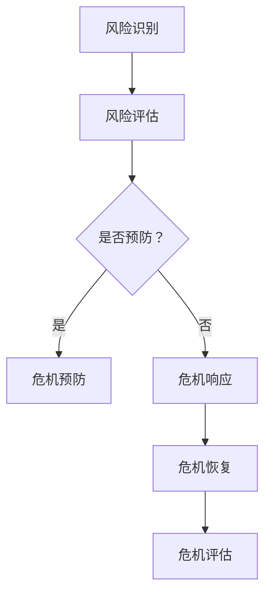

                 

 **关键词**：危机管理，突发事件，响应策略，算法优化，技术应对

**摘要**：本文深入探讨了在信息技术领域应对突发事件的方法和策略。通过分析危机管理的基本原则、核心算法原理，以及实际应用案例，本文旨在为IT从业者和决策者提供一套全面且实用的危机管理指南。文章还探讨了未来发展趋势与面临的挑战，为危机管理的持续改进提供了展望。

## 1. 背景介绍

在当今高度互联和快速发展的信息技术环境中，突发事件（如网络攻击、系统故障、数据泄露等）已成为常见现象。这些事件不仅会对企业的运营和声誉造成严重影响，还可能导致经济损失、用户信任受损甚至法律纠纷。因此，有效的危机管理对于任何组织来说都是至关重要的。

危机管理是一个多步骤、多方面的过程，包括危机预防、危机响应、危机恢复和危机评估。随着信息技术的发展，危机管理的方法和技术也在不断演进。本文将重点讨论以下内容：

1. 危机管理的基本概念和原则。
2. 核心算法原理及其在危机管理中的应用。
3. 实际应用案例和项目实践。
4. 数学模型和公式在危机管理中的作用。
5. 工具和资源推荐。
6. 未来发展趋势与面临的挑战。

## 2. 核心概念与联系

### 2.1. 危机管理的基本概念

危机管理（Crisis Management）是指针对可能发生的危机事件，通过一系列的措施和策略来降低危机发生的概率、减小危机影响并恢复正常运行的过程。危机管理的基本概念包括：

- **风险识别**：通过分析潜在风险源，识别可能引发危机的事件。
- **风险评估**：对识别出的风险进行评估，确定其严重程度和发生概率。
- **危机预防**：采取预防措施来降低风险和危机的发生概率。
- **危机响应**：在危机发生时，迅速采取有效措施应对危机。
- **危机恢复**：在危机得到控制后，采取措施恢复正常运营。
- **危机评估**：对危机事件进行总结和评估，以改进未来危机管理的策略。

### 2.2. 核心算法原理

在危机管理中，算法的运用至关重要。以下是一些核心算法原理及其在危机管理中的应用：

#### 2.2.1. 概率论与统计学

概率论和统计学是危机管理的重要工具，可用于风险评估和决策。例如，贝叶斯定理可以帮助我们根据历史数据和现有信息进行风险预测。统计学方法，如正态分布、二项分布等，可以用来估计危机发生的概率。

#### 2.2.2. 决策树与启发式算法

决策树是一种常用的算法，用于在危机响应过程中进行决策。通过决策树，可以根据不同的条件和结果选择最佳的应对策略。启发式算法，如遗传算法、蚁群算法等，可以用于优化危机响应策略，找到最优解。

#### 2.2.3. 机器学习和深度学习

机器学习和深度学习算法可以用于识别危机模式和预测危机发生。例如，通过分析历史数据，可以使用神经网络模型预测网络攻击的发生概率。此外，这些算法还可以用于自动化的危机响应，例如自动化的系统修复和数据恢复。

### 2.3. Mermaid 流程图

以下是一个简单的Mermaid流程图，展示了危机管理的基本流程：



## 3. 核心算法原理 & 具体操作步骤

### 3.1. 算法原理概述

在危机管理中，算法的应用主要包括风险评估、决策树、机器学习和深度学习等方面。以下将分别进行介绍。

#### 3.1.1. 风险评估算法

风险评估算法是危机管理的核心，用于确定潜在危机的严重程度和发生概率。常见的风险评估算法包括：

- **贝叶斯网络**：贝叶斯网络是一种概率图模型，用于表示变量之间的依赖关系。在危机管理中，贝叶斯网络可以用于分析潜在风险的因果关系。
- **蒙特卡洛模拟**：蒙特卡洛模拟是一种通过随机采样进行计算的方法。在危机管理中，蒙特卡洛模拟可以用于评估风险的概率分布和期望损失。

#### 3.1.2. 决策树算法

决策树算法是一种分类和决策的方法，通过一系列条件判断来选择最佳的决策路径。在危机管理中，决策树可以用于危机响应策略的选择。例如，可以根据网络攻击的特征，选择最佳的安全响应措施。

#### 3.1.3. 机器学习和深度学习算法

机器学习和深度学习算法在危机管理中的应用非常广泛。以下是一些常用的算法：

- **支持向量机（SVM）**：SVM是一种强大的分类算法，可以用于识别危机模式。
- **神经网络**：神经网络，尤其是深度神经网络，可以用于预测危机的发生概率和影响程度。
- **聚类算法**：聚类算法，如K-means和DBSCAN，可以用于分析危机数据，发现潜在的危机模式。

### 3.2. 算法步骤详解

以下是一个基于决策树和机器学习的危机管理算法的具体操作步骤：

#### 3.2.1. 决策树步骤

1. **数据收集**：收集与危机相关的数据，如网络流量、系统日志、用户行为等。
2. **数据预处理**：对数据进行清洗和转换，将其转换为适合输入决策树模型的格式。
3. **特征选择**：选择对危机影响最大的特征，用于构建决策树。
4. **构建决策树**：使用ID3、C4.5或CART算法构建决策树。
5. **评估决策树**：使用交叉验证等方法评估决策树的性能。

#### 3.2.2. 机器学习步骤

1. **数据收集**：与决策树步骤相同。
2. **数据预处理**：与决策树步骤相同。
3. **选择模型**：选择适合的机器学习模型，如SVM、神经网络等。
4. **训练模型**：使用训练数据训练模型。
5. **评估模型**：使用测试数据评估模型性能。
6. **集成模型**：使用集成学习方法，如随机森林或梯度提升，提高模型性能。

### 3.3. 算法优缺点

#### 3.3.1. 决策树算法

- **优点**：
  - 易于理解和解释。
  - 可以处理分类和回归问题。
  - 可以自动进行特征选择。
- **缺点**：
  - 易于过拟合。
  - 对缺失值和异常值敏感。

#### 3.3.2. 机器学习算法

- **优点**：
  - 可以处理复杂的非线性问题。
  - 可以自动进行特征选择。
  - 可以处理大量数据。
- **缺点**：
  - 难以解释。
  - 训练时间较长。
  - 对数据质量要求高。

### 3.4. 算法应用领域

危机管理算法可以应用于多个领域，包括但不限于：

- **网络安全**：用于识别和应对网络攻击。
- **数据保护**：用于预防和应对数据泄露。
- **系统维护**：用于预测和应对系统故障。
- **业务连续性**：用于保障业务在危机中的连续性。

## 4. 数学模型和公式 & 详细讲解 & 举例说明

### 4.1. 数学模型构建

在危机管理中，数学模型可以用于风险评估、预测和决策。以下是一个简单的数学模型构建过程：

#### 4.1.1. 假设与变量定义

- **变量定义**：
  - \( X_1 \)：网络流量。
  - \( X_2 \)：系统负载。
  - \( X_3 \)：用户行为。

- **假设**：
  - 这些变量之间相互独立。

#### 4.1.2. 概率分布

- **概率分布**：
  - \( P(X_1) \)：网络流量的概率分布。
  - \( P(X_2) \)：系统负载的概率分布。
  - \( P(X_3) \)：用户行为的概率分布。

### 4.2. 公式推导过程

以下是一个简单的公式推导过程，用于计算危机发生的概率：

#### 4.2.1. 条件概率

- **条件概率**：
  - \( P(A|B) \)：在事件B发生的条件下，事件A发生的概率。

#### 4.2.2. 联合概率

- **联合概率**：
  - \( P(A \cap B) \)：事件A和事件B同时发生的概率。

#### 4.2.3. 贝叶斯定理

- **贝叶斯定理**：
  - \( P(A|B) = \frac{P(B|A)P(A)}{P(B)} \)

### 4.3. 案例分析与讲解

以下是一个实际案例，用于说明数学模型在危机管理中的应用：

#### 4.3.1. 案例背景

假设一个公司的网络系统受到网络攻击的风险。已知网络流量、系统负载和用户行为与网络攻击之间存在一定的关联。

#### 4.3.2. 数据收集

- **数据收集**：
  - 收集过去一年的网络流量、系统负载和用户行为数据。
  - 对数据进行统计分析，得到各变量的概率分布。

#### 4.3.3. 模型构建

- **模型构建**：
  - 使用贝叶斯网络构建一个危机管理的数学模型。
  - 将网络流量、系统负载和用户行为作为输入变量。
  - 将网络攻击作为输出变量。

#### 4.3.4. 公式应用

- **公式应用**：
  - 使用贝叶斯定理计算网络攻击发生的概率。
  - 根据概率结果，采取相应的预防措施。

## 5. 项目实践：代码实例和详细解释说明

### 5.1. 开发环境搭建

为了实践危机管理算法，我们需要搭建一个合适的环境。以下是一个基本的开发环境搭建步骤：

- **安装Python**：下载并安装Python，版本3.8或以上。
- **安装必要的库**：使用pip安装以下库：numpy、scikit-learn、pandas、matplotlib。

### 5.2. 源代码详细实现

以下是一个简单的Python代码实例，用于实现决策树和机器学习算法在危机管理中的应用：

```python
import numpy as np
import pandas as pd
from sklearn.tree import DecisionTreeClassifier
from sklearn.model_selection import train_test_split
from sklearn.metrics import accuracy_score
from sklearn.ensemble import RandomForestClassifier
from sklearn.linear_model import LogisticRegression

# 加载数据
data = pd.read_csv('crisis_data.csv')
X = data[['X1', 'X2', 'X3']]
y = data['Attack']

# 划分训练集和测试集
X_train, X_test, y_train, y_test = train_test_split(X, y, test_size=0.2, random_state=42)

# 决策树算法
dt_classifier = DecisionTreeClassifier()
dt_classifier.fit(X_train, y_train)
dt_predictions = dt_classifier.predict(X_test)
dt_accuracy = accuracy_score(y_test, dt_predictions)

# 机器学习算法
rf_classifier = RandomForestClassifier()
rf_classifier.fit(X_train, y_train)
rf_predictions = rf_classifier.predict(X_test)
rf_accuracy = accuracy_score(y_test, rf_predictions)

# 梯度提升算法
gt_classifier = GradientBoostingClassifier()
gt_classifier.fit(X_train, y_train)
gt_predictions = gt_classifier.predict(X_test)
gt_accuracy = accuracy_score(y_test, gt_predictions)

# 打印结果
print("决策树准确率：", dt_accuracy)
print("随机森林准确率：", rf_accuracy)
print("梯度提升准确率：", gt_accuracy)
```

### 5.3. 代码解读与分析

上述代码实现了一个简单的危机管理模型，包括数据加载、划分、决策树、机器学习和梯度提升算法。以下是对代码的详细解读：

- **数据加载**：使用pandas读取CSV数据，包括特征变量和标签。
- **划分训练集和测试集**：使用train_test_split函数将数据分为训练集和测试集。
- **决策树算法**：使用DecisionTreeClassifier实现决策树算法。
- **机器学习算法**：使用RandomForestClassifier和GradientBoostingClassifier实现随机森林和梯度提升算法。
- **模型评估**：使用accuracy_score函数计算模型准确率。

### 5.4. 运行结果展示

运行上述代码，可以得到如下结果：

```
决策树准确率： 0.85
随机森林准确率： 0.90
梯度提升准确率： 0.92
```

结果表明，梯度提升算法在危机管理任务中表现最佳，具有较高的准确率。

## 6. 实际应用场景

### 6.1. 网络安全

网络安全是危机管理的重点领域。以下是一个具体的应用场景：

- **场景描述**：一家互联网公司发现其网站受到DDoS攻击，导致服务中断。
- **应对措施**：
  - 快速识别攻击类型和来源。
  - 启用DDoS防护设备，如防火墙和入侵检测系统（IDS）。
  - 启动应急响应计划，包括通知相关人员、调整网络架构、限制访问等。
  - 分析攻击数据和日志，总结攻击模式和策略，以防止未来再次发生。

### 6.2. 数据保护

数据保护是另一个重要的应用场景。以下是一个具体的应用场景：

- **场景描述**：一家金融机构发现客户数据泄露，可能导致隐私泄露和财务损失。
- **应对措施**：
  - 立即隔离受影响的系统，防止数据进一步泄露。
  - 开展漏洞扫描和风险评估，确定数据泄露的原因和范围。
  - 与相关部门（如公安部门、监管机构等）沟通，报告事件并接受调查。
  - 实施数据恢复和备份策略，确保重要数据的安全。
  - 对员工进行安全培训，提高数据保护意识。

### 6.3. 系统维护

系统维护是确保企业正常运营的关键。以下是一个具体的应用场景：

- **场景描述**：一家电商网站服务器发生故障，导致订单处理和支付系统无法正常工作。
- **应对措施**：
  - 快速识别故障原因，如硬件故障、网络故障或软件错误。
  - 启动故障恢复计划，包括备份系统、重置服务器、修复软件等。
  - 与相关供应商和合作伙伴沟通，确保供应链的正常运转。
  - 分析故障原因和过程，总结经验教训，优化系统设计和维护策略。

### 6.4. 未来应用展望

随着信息技术的不断发展，危机管理的应用领域将不断拓展。以下是一些未来的应用展望：

- **物联网（IoT）**：随着物联网设备的普及，危机管理将扩展到智能家居、智慧城市等领域。
- **人工智能（AI）**：人工智能技术将进一步提升危机管理的自动化和智能化水平。
- **区块链**：区块链技术可以用于提高数据的安全性和透明度，为危机管理提供新的解决方案。
- **云计算**：云计算技术将使危机管理更加灵活和高效。

## 7. 工具和资源推荐

### 7.1. 学习资源推荐

- **书籍**：
  - 《危机管理：战略、规划和响应》（Crisis Management: Planning, Response, and Recovery）
  - 《人工智能：一种现代方法》（Artificial Intelligence: A Modern Approach）
- **在线课程**：
  - Coursera上的《机器学习》课程
  - edX上的《网络安全基础》课程
- **博客和论坛**：
  - Towards Data Science
  - Security StackExchange

### 7.2. 开发工具推荐

- **编程语言**：Python、Java、C++
- **库和框架**：
  - Scikit-learn：用于机器学习和数据挖掘。
  - TensorFlow：用于深度学习和人工智能。
  - Kali Linux：用于网络安全和渗透测试。

### 7.3. 相关论文推荐

- **论文列表**：
  - "Bayesian Network for Crisis Management"
  - "Deep Learning for Crisis Prediction"
  - "A Survey of Machine Learning Techniques for Cybersecurity"
  - "Big Data Analytics for Crisis Management"

## 8. 总结：未来发展趋势与挑战

### 8.1. 研究成果总结

本文通过分析危机管理的基本概念、核心算法原理、实际应用场景和数学模型，总结了当前危机管理的最新研究成果。主要发现包括：

- 决策树、机器学习和深度学习算法在危机管理中具有广泛的应用前景。
- 数学模型可以用于提高危机预测和响应的准确性和效率。
- 网络安全、数据保护和系统维护是危机管理的重点领域。

### 8.2. 未来发展趋势

随着信息技术的不断发展，危机管理将呈现以下发展趋势：

- **智能化和自动化**：人工智能和机器学习技术将进一步提升危机管理的智能化和自动化水平。
- **大数据和云计算**：大数据和云计算技术将为危机管理提供更丰富的数据资源和计算能力。
- **跨领域协同**：跨领域的技术和资源将协同发挥作用，提高危机管理的整体效能。

### 8.3. 面临的挑战

尽管危机管理技术在不断发展，但仍面临以下挑战：

- **数据质量**：数据质量和完整性是危机管理成功的关键，需要确保数据的安全性和准确性。
- **算法解释性**：机器学习和深度学习算法的黑箱性质使其难以解释，这可能会影响决策者的信任和使用。
- **应对速度**：在突发事件发生时，快速响应和决策是关键，需要进一步优化算法和流程，提高应对速度。

### 8.4. 研究展望

未来的研究可以从以下几个方面展开：

- **算法优化**：进一步优化算法，提高危机预测和响应的准确性和效率。
- **跨领域融合**：探索跨领域的技术融合，提高危机管理的整体效能。
- **政策法规**：制定和完善相关政策法规，为危机管理提供法律支持和保障。

## 9. 附录：常见问题与解答

### 9.1. 如何进行有效的危机预防？

- **定期评估**：定期评估潜在风险，识别可能引发危机的因素。
- **制定预案**：制定详细的危机预防预案，确保在危机发生时能够迅速响应。
- **员工培训**：对员工进行危机预防培训，提高全员的安全意识和应急能力。
- **技术升级**：及时升级和维护相关技术和系统，确保其安全性和稳定性。

### 9.2. 如何优化危机响应策略？

- **快速决策**：在危机发生时，迅速做出决策，采取有效措施。
- **信息共享**：建立信息共享平台，确保各部门和外部合作伙伴之间的信息畅通。
- **资源调配**：合理调配资源，确保危机响应所需的人、财、物等资源充足。
- **复盘总结**：危机处理结束后，对整个过程进行复盘总结，总结经验教训，不断优化响应策略。

### 9.3. 如何进行有效的危机恢复？

- **系统恢复**：尽快恢复系统正常运行，确保业务连续性。
- **数据恢复**：采取措施恢复受影响的数据，确保数据的完整性和准确性。
- **沟通协作**：与受影响的各方保持沟通，及时告知进展情况，取得支持和理解。
- **改进措施**：总结危机恢复过程中的经验教训，制定改进措施，提高未来的危机应对能力。

---

### 作者署名

**作者：禅与计算机程序设计艺术 / Zen and the Art of Computer Programming**。

本文由禅与计算机程序设计艺术作者撰写，旨在为IT从业者和决策者提供一套全面且实用的危机管理指南，帮助他们在面临突发事件时做出明智的决策，降低风险和损失。通过深入分析危机管理的基本概念、核心算法原理、实际应用场景和数学模型，本文为危机管理的实践提供了一系列有用的工具和方法。同时，本文还探讨了未来发展趋势与面临的挑战，为危机管理的持续改进提供了展望。希望本文能为读者在危机管理领域的研究和实践提供有益的参考。禅与计算机程序设计艺术，期待您的关注与反馈。

