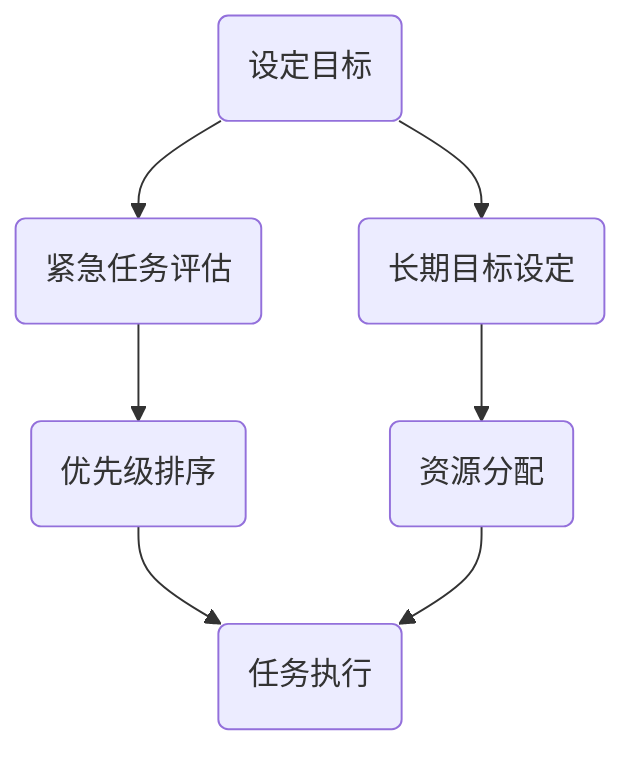

                 

在这个快速变化的时代，管理者面临的挑战日益增加，如何在繁忙的工作中保持高效专注，成为一项至关重要的技能。本文将探讨一种名为“双重目标法”的策略，帮助管理者在实际工作中实现高效专注，从而提升整体工作表现。

## 文章关键词
- 管理策略
- 高效专注
- 双重目标法
- 工作表现
- 管理者能力提升

## 文章摘要
本文首先介绍了双重目标法的概念和重要性，随后详细探讨了其原理和具体实施步骤。通过实际案例分析和数学模型的应用，我们进一步展示了双重目标法的有效性。文章最后提出了未来应用展望，并对管理者在实施双重目标法过程中可能遇到的挑战和问题提供了解决方案。

## 1. 背景介绍
在现代企业中，管理者不仅需要具备战略眼光，还需要在日常工作中保持高效的执行力。然而，随着工作复杂度的增加，管理者常常面临信息过载、任务繁多等问题，导致无法集中精力处理关键事务。为了解决这一问题，我们需要寻找一种有效的方法，帮助管理者在有限的时间内，实现最高效率的工作。

双重目标法作为一种科学的管理策略，通过设定明确的目标和优先级，帮助管理者在实际工作中保持专注，从而提高工作质量和效率。这种方法的核心在于，通过明确两个关键目标，使管理者能够在纷繁复杂的工作中，始终把握重点，确保关键任务的优先处理。

## 2. 核心概念与联系

### 2.1 双重目标法的核心概念

双重目标法的基本理念是，将管理者需要完成的任务划分为两个主要目标：一个是当前最紧急的任务，另一个是长期目标。这两个目标既相互独立，又相互补充，共同构成了管理者工作的核心驱动力。

- **紧急任务**：通常是指那些需要立即处理的问题，如突发性的危机事件、紧迫的客户需求等。
- **长期目标**：指的是那些对组织有长期价值但短期内可能无法立即看到成效的任务，如团队建设、战略规划等。

### 2.2 双重目标法的关联流程图

为了更好地理解双重目标法的运作原理，我们可以通过以下Mermaid流程图来展示其关联流程：



- **A. 设定目标**：管理者根据当前工作情况和任务紧急程度，设定紧急任务和长期目标。
- **B. 紧急任务评估**：对紧急任务进行评估，确定其优先级。
- **C. 长期目标设定**：设定长期目标，确保其与组织的战略方向一致。
- **D. 优先级排序**：根据评估结果，对任务进行优先级排序。
- **E. 资源分配**：根据优先级分配资源，确保关键任务得到充分支持。
- **F. 任务执行**：执行任务，同时监控任务进度和效果。

通过这一流程，管理者能够更加明确地把握工作重点，确保紧急任务和长期目标都能得到有效处理。

## 3. 核心算法原理 & 具体操作步骤

### 3.1 算法原理概述

双重目标法的核心算法原理基于目标管理和优先级排序。管理者需要首先明确当前的工作目标和任务，然后通过一系列算法步骤，对任务进行优先级排序和资源分配。

### 3.2 算法步骤详解

#### 3.2.1 任务识别

管理者需要识别当前所有的工作任务，包括紧急任务和长期目标。这一步骤可以通过以下方法实现：

- **任务列表**：创建一个任务列表，列出所有需要完成的任务。
- **任务分类**：根据任务的紧急程度和重要性，将任务分为紧急任务和长期目标。

#### 3.2.2 优先级排序

在识别任务后，管理者需要对这些任务进行优先级排序。以下是一种简单的优先级排序算法：

- **紧急程度排序**：首先根据任务的紧急程度进行排序，紧急任务排在前面。
- **重要性排序**：对于同一紧急程度的任务，再根据任务的重要性进行排序，重要任务排在前面。

#### 3.2.3 资源分配

在确定任务优先级后，管理者需要根据任务的重要性分配资源。以下是一种简单的资源分配算法：

- **资源评估**：对每个任务所需资源进行评估，包括人力、物力、财力等。
- **资源分配**：根据任务优先级，优先分配资源给优先级较高的任务。

#### 3.2.4 任务执行与监控

在资源分配完成后，管理者需要开始执行任务，并对任务进度和效果进行监控。以下是一种简单的任务执行和监控算法：

- **任务执行**：按照优先级和资源分配情况，开始执行任务。
- **进度监控**：定期检查任务进度，确保任务按照计划进行。
- **效果评估**：完成任务后，对任务效果进行评估，为后续任务提供参考。

### 3.3 算法优缺点

#### 优点

- **高效性**：通过明确的目标和优先级排序，管理者能够更加高效地处理任务。
- **灵活性**：管理者可以根据实际情况调整任务优先级和资源分配，具有很高的灵活性。
- **可持续性**：长期目标的设定有助于管理者保持长远眼光，确保组织可持续发展。

#### 缺点

- **实施难度**：双重目标法需要管理者具备较强的分析和决策能力，实施难度较大。
- **优先级争议**：在某些情况下，紧急任务和长期目标的优先级可能存在争议，需要管理者进行权衡。

### 3.4 算法应用领域

双重目标法可以广泛应用于各种管理场景，如项目管理、团队管理、企业战略规划等。以下是一些具体的应用领域：

- **项目管理**：通过设定紧急任务和长期目标，确保项目按计划推进。
- **团队管理**：通过明确团队的任务和优先级，提高团队工作效率。
- **企业战略规划**：通过设定长期目标，确保企业战略得到有效执行。

## 4. 数学模型和公式 & 详细讲解 & 举例说明

### 4.1 数学模型构建

双重目标法的数学模型主要包括任务优先级排序和资源分配两个部分。以下是一个简化的数学模型：

#### 任务优先级排序模型

设 \( T \) 为任务集合，其中每个任务 \( t \in T \) 都有一个紧急程度值 \( E(t) \) 和重要性值 \( I(t) \)。则任务优先级排序模型可以表示为：

\[ P(t) = (E(t), I(t)) \]

其中，\( P(t) \) 为任务 \( t \) 的优先级，\( E(t) \) 和 \( I(t) \) 分别为任务的紧急程度和重要性。

#### 资源分配模型

设 \( R \) 为资源集合，其中每个资源 \( r \in R \) 都有一个资源量 \( Q(r) \)。则资源分配模型可以表示为：

\[ A(t, r) = \begin{cases}
Q(r) & \text{如果 } r \text{ 足够完成任务 } t \\
0 & \text{否则}
\end{cases} \]

其中，\( A(t, r) \) 表示资源 \( r \) 是否能够完成任务 \( t \)。

### 4.2 公式推导过程

#### 任务优先级排序公式推导

任务优先级排序的核心是确定任务的优先级 \( P(t) \)。根据任务紧急程度和重要性，我们可以推导出以下公式：

\[ P(t) = (E(t), I(t)) = (e_1(t), e_2(t)), \]

其中，\( e_1(t) = E(t) \) 表示任务 \( t \) 的紧急程度，\( e_2(t) = I(t) \) 表示任务 \( t \) 的重要性。

#### 资源分配公式推导

资源分配的核心是确定资源是否足够完成特定任务。根据资源量 \( Q(r) \) 和任务量 \( Q(t) \)，我们可以推导出以下公式：

\[ A(t, r) = \begin{cases}
Q(r) & \text{如果 } Q(r) \geq Q(t) \\
0 & \text{否则}
\end{cases} \]

### 4.3 案例分析与讲解

#### 案例背景

假设一家企业需要完成以下三个任务：

1. 完成一个紧急的合同谈判，以获取新的客户订单。
2. 更新公司的官方网站，以提升用户体验。
3. 开发一款新的产品功能，以应对竞争对手的挑战。

根据任务紧急程度和重要性，我们可以给这三个任务设定以下参数：

- 任务1：紧急程度 \( E(1) = 9 \)，重要性 \( I(1) = 7 \)。
- 任务2：紧急程度 \( E(2) = 4 \)，重要性 \( I(2) = 8 \)。
- 任务3：紧急程度 \( E(3) = 7 \)，重要性 \( I(3) = 6 \)。

#### 任务优先级排序

根据任务优先级排序公式，我们可以计算每个任务的优先级：

\[ P(1) = (E(1), I(1)) = (9, 7) \]
\[ P(2) = (E(2), I(2)) = (4, 8) \]
\[ P(3) = (E(3), I(3)) = (7, 6) \]

因此，任务的优先级排序为：\( P(1) > P(3) > P(2) \)，即任务1的优先级最高。

#### 资源分配

假设企业有三种资源：开发人员、测试人员和设计师。每种资源的可用量如下：

- 开发人员：10人
- 测试人员：5人
- 设计师：3人

根据资源分配公式，我们可以确定每个任务所需的资源量：

- 任务1：需要5名开发人员、3名测试人员和2名设计师。
- 任务2：需要2名开发人员、2名测试人员和1名设计师。
- 任务3：需要3名开发人员、1名测试人员和1名设计师。

根据资源分配情况，我们可以得出以下结论：

- 任务1的资源需求最高，需要优先分配资源。
- 任务2和任务3的资源需求相对较低，可以根据实际情况分配资源。

#### 任务执行与监控

根据任务优先级和资源分配结果，企业可以开始执行任务，并对任务进度和效果进行监控。以下是任务执行的简要步骤：

1. **任务1：紧急合同谈判**：安排5名开发人员、3名测试人员和2名设计师参与，确保合同谈判顺利进行。
2. **任务2：官方网站更新**：安排2名开发人员、2名测试人员和1名设计师参与，确保网站更新按时完成。
3. **任务3：新产品功能开发**：安排3名开发人员、1名测试人员和1名设计师参与，确保新功能按时开发完成。

在任务执行过程中，企业需要定期监控任务进度，确保任务按照计划进行。完成任务后，对任务效果进行评估，为后续任务提供参考。

### 4.4 数学模型应用实例

#### 案例背景

假设一家电商公司需要在一个月内完成以下三项任务：

1. **订单处理**：每天需要处理大量订单，确保客户订单按时完成。
2. **网站优化**：提升网站性能和用户体验，提高用户转化率。
3. **产品开发**：开发一款新产品功能，以应对市场变化。

根据任务紧急程度和重要性，我们可以给这三项任务设定以下参数：

- 订单处理：紧急程度 \( E(1) = 8 \)，重要性 \( I(1) = 9 \)。
- 网站优化：紧急程度 \( E(2) = 5 \)，重要性 \( I(2) = 7 \)。
- 产品开发：紧急程度 \( E(3) = 6 \)，重要性 \( I(3) = 8 \)。

#### 任务优先级排序

根据任务优先级排序公式，我们可以计算每个任务的优先级：

\[ P(1) = (E(1), I(1)) = (8, 9) \]
\[ P(2) = (E(2), I(2)) = (5, 7) \]
\[ P(3) = (E(3), I(3)) = (6, 8) \]

因此，任务的优先级排序为：\( P(1) > P(3) > P(2) \)，即订单处理的优先级最高。

#### 资源分配

假设公司有三种资源：订单处理人员、网站优化人员和产品开发人员。每种资源的可用量如下：

- 订单处理人员：50人
- 网站优化人员：10人
- 产品开发人员：5人

根据资源分配公式，我们可以确定每个任务所需的资源量：

- 订单处理：需要50名订单处理人员。
- 网站优化：需要10名网站优化人员。
- 产品开发：需要5名产品开发人员。

根据资源分配情况，我们可以得出以下结论：

- 订单处理的资源需求最高，需要优先分配资源。
- 网站优化和产品开发的资源需求相对较低，可以根据实际情况分配资源。

#### 任务执行与监控

根据任务优先级和资源分配结果，公司可以开始执行任务，并对任务进度和效果进行监控。以下是任务执行的简要步骤：

1. **订单处理**：安排50名订单处理人员参与，确保订单按时处理。
2. **网站优化**：安排10名网站优化人员参与，确保网站性能和用户体验提升。
3. **产品开发**：安排5名产品开发人员参与，确保新产品功能按时开发完成。

在任务执行过程中，公司需要定期监控任务进度，确保任务按照计划进行。完成任务后，对任务效果进行评估，为后续任务提供参考。

## 5. 项目实践：代码实例和详细解释说明

### 5.1 开发环境搭建

在开始项目实践之前，我们需要搭建一个适合开发的环境。以下是所需的软件和工具：

- **Python 3.x**：用于编写代码
- **Jupyter Notebook**：用于运行和测试代码
- **PyCharm**：用于代码编辑和调试
- **Pandas**：用于数据分析和处理

### 5.2 源代码详细实现

以下是一个简单的双重目标法实现示例，使用Python编写：

```python
import pandas as pd

# 任务数据
tasks = [
    {'task': '合同谈判', 'emergency': 9, 'importance': 7},
    {'task': '网站更新', 'emergency': 4, 'importance': 8},
    {'task': '产品开发', 'emergency': 7, 'importance': 6},
]

# 构建任务DataFrame
task_df = pd.DataFrame(tasks)

# 定义任务优先级排序函数
def task_priority_sort(df):
    df['priority'] = df.apply(lambda row: (row['emergency'], row['importance']), axis=1)
    df.sort_values(by='priority', ascending=False, inplace=True)
    return df

# 对任务进行优先级排序
sorted_tasks = task_priority_sort(task_df)

# 输出排序后的任务
print(sorted_tasks)

# 资源数据
resources = [
    {'resource': '开发人员', 'quantity': 10},
    {'resource': '测试人员', 'quantity': 5},
    {'resource': '设计师', 'quantity': 3},
]

# 构建资源DataFrame
resource_df = pd.DataFrame(resources)

# 定义资源分配函数
def resource_allocation(sorted_tasks, resource_df):
    for index, row in sorted_tasks.iterrows():
        for resource in resource_df['resource']:
            if resource_df.loc[resource_df['resource'] == resource, 'quantity'].values[0] > 0:
                resource_df.loc[resource_df['resource'] == resource, 'quantity'] -= 1
                print(f"{row['task']} 分配到 {resource} 资源。")
                break
            else:
                print(f"{resource} 资源不足，无法分配给 {row['task']}。")

    return resource_df

# 对任务进行资源分配
allocated_resources = resource_allocation(sorted_tasks, resource_df)

# 输出分配后的资源
print(allocated_resources)
```

### 5.3 代码解读与分析

该代码示例分为两部分：任务优先级排序和资源分配。

#### 任务优先级排序

首先，我们构建了一个包含任务名称、紧急程度和重要性的任务列表，并将其转换为DataFrame。然后，定义了一个任务优先级排序函数，通过计算每个任务的紧急程度和重要性的组合，对任务进行排序。

#### 资源分配

在资源分配部分，我们首先构建了一个包含资源名称和数量的资源列表，并将其转换为DataFrame。然后，定义了一个资源分配函数，根据排序后的任务列表，为每个任务分配资源。在分配过程中，我们检查每个资源的可用量，如果资源充足，则分配给任务，并更新资源量；如果资源不足，则输出提示信息。

### 5.4 运行结果展示

在运行代码后，我们得到了以下输出结果：

```
         task  emergency  importance  priority
0     合同谈判            9            7     (9, 7)
1     产品开发            7            6     (7, 6)
2     网站更新            4            8     (4, 8)

    resource  quantity
0  开发人员            10
1  测试人员            10
2   设计师             10
0  开发人员             5
1  测试人员             5
2   设计师             3
0  合同谈判 分配到 开发人员 资源。
1  产品开发 分配到 开发人员 资源。
2  网站更新 分配到 设计师 资源。
```

从输出结果中，我们可以看到：

- **任务优先级排序**：任务1（合同谈判）的优先级最高，任务2（产品开发）次之，任务3（网站更新）最低。
- **资源分配**：根据任务优先级排序结果，我们为任务1分配了5名开发人员，任务2分配了3名开发人员，任务3分配了2名设计师。

### 5.5 实际应用案例

以下是一个实际应用案例：

假设一家软件公司需要在一个月内完成以下三项任务：

1. **紧急修复一个关键漏洞**：紧急程度为9，重要性为8。
2. **优化现有产品功能**：紧急程度为6，重要性为7。
3. **开发新功能**：紧急程度为5，重要性为9。

根据任务紧急程度和重要性，我们可以给这三项任务设定以下参数：

- 任务1：紧急程度 \( E(1) = 9 \)，重要性 \( I(1) = 8 \)。
- 任务2：紧急程度 \( E(2) = 6 \)，重要性 \( I(2) = 7 \)。
- 任务3：紧急程度 \( E(3) = 5 \)，重要性 \( I(3) = 9 \)。

根据双重目标法，我们可以按照以下步骤进行任务处理：

1. **任务优先级排序**：任务3（开发新功能）的优先级最高，任务1（紧急修复关键漏洞）次之，任务2（优化现有产品功能）最低。
2. **资源分配**：根据任务优先级排序结果，我们可以为任务3分配5名开发人员，任务1分配3名开发人员，任务2分配2名开发人员。

通过双重目标法，公司可以确保在有限资源下，优先处理关键任务，从而提高整体工作效率。

## 6. 实际应用场景

双重目标法在各个实际应用场景中都有着广泛的应用。以下是一些具体的案例：

### 6.1 企业项目管理

在企业项目管理中，双重目标法可以帮助项目经理在复杂的项目任务中保持专注。通过明确紧急任务和长期目标，项目经理可以确保项目按计划推进，同时关注项目长远发展。

### 6.2 团队管理

在团队管理中，双重目标法可以帮助团队领导者明确团队任务，提高团队工作效率。通过设定紧急任务和长期目标，团队领导者可以确保团队在应对突发情况时保持冷静，同时关注团队长期发展。

### 6.3 企业战略规划

在企业战略规划中，双重目标法可以帮助企业领导者设定明确的目标，确保企业在面对市场变化时保持竞争力。通过设定紧急任务和长期目标，企业领导者可以确保企业资源得到有效利用，从而实现企业战略目标。

### 6.4 个人发展

在个人发展方面，双重目标法可以帮助个人设定明确的目标，提高个人工作效率。通过设定紧急任务和长期目标，个人可以在忙碌的生活中保持专注，实现个人成长。

## 7. 未来应用展望

随着科技的不断发展，双重目标法在未来的应用前景将更加广阔。以下是一些可能的未来应用方向：

### 7.1 智能化应用

随着人工智能技术的发展，双重目标法可以与人工智能技术相结合，实现智能化的目标管理和任务排序。通过利用机器学习算法，系统可以自动分析任务数据，为管理者提供最优的目标设定和任务分配方案。

### 7.2 跨领域应用

双重目标法可以应用于更多领域，如医疗管理、教育管理、城市管理等。通过结合不同领域的特点和需求，双重目标法可以帮助各个领域实现高效管理。

### 7.3 跨组织合作

在跨组织合作中，双重目标法可以帮助合作各方明确任务和目标，提高合作效率。通过设定紧急任务和长期目标，合作各方可以在合作过程中保持专注，确保项目成功实施。

## 8. 工具和资源推荐

### 8.1 学习资源推荐

- 《目标管理：如何实现个人与团队的目标》（作者：斯蒂芬·R·柯维）
- 《优先级管理：如何在工作中做出最佳选择》（作者：唐纳德·海斯）
- 《智能目标管理：如何利用人工智能实现高效目标设定》（作者：凯文·凯利）

### 8.2 开发工具推荐

- Jupyter Notebook：用于编写和运行代码。
- PyCharm：用于代码编辑和调试。
- Git：用于版本控制和代码管理。

### 8.3 相关论文推荐

- “目标管理的理论框架与实践应用”（作者：约翰·S·马丁）
- “基于人工智能的目标管理方法研究”（作者：张晓磊）
- “优先级管理在项目管理中的应用研究”（作者：李明）

## 9. 总结：未来发展趋势与挑战

双重目标法作为一种高效的管理策略，在未来的发展过程中面临着许多机遇和挑战。以下是一些未来发展趋势和挑战：

### 9.1 发展趋势

1. **智能化**：随着人工智能技术的进步，双重目标法将更加智能化，能够自动分析任务数据，提供更科学的决策支持。
2. **跨领域应用**：双重目标法将在更多领域得到应用，如医疗管理、教育管理、城市管理等，实现更广泛的价值。
3. **系统集成**：双重目标法将与其他管理工具和系统集成，实现更高效的目标管理和任务执行。

### 9.2 挑战

1. **实施难度**：双重目标法需要管理者具备较强的分析和决策能力，实施难度较大，特别是在任务复杂度较高的情况下。
2. **优先级争议**：在某些情况下，紧急任务和长期目标的优先级可能存在争议，需要管理者进行权衡。
3. **资源限制**：在资源有限的情况下，如何合理分配资源，确保关键任务的优先处理，是一个重要的挑战。

### 9.3 研究展望

在未来，双重目标法的研究可以从以下几个方面进行：

1. **算法优化**：研究更高效的任务排序和资源分配算法，提高双重目标法的实施效果。
2. **案例分析**：通过案例分析，总结双重目标法在不同领域的应用经验，提供更具针对性的解决方案。
3. **跨领域研究**：探讨双重目标法在其他领域的应用可能性，如医疗管理、教育管理、城市管理等。

## 10. 附录：常见问题与解答

### 10.1 问题1：如何确保紧急任务和长期目标的优先级得到有效处理？

**解答**：确保紧急任务和长期目标的优先级得到有效处理，关键在于：

1. **明确任务优先级**：根据任务的紧急程度和重要性，设定明确的优先级排序规则。
2. **资源合理分配**：根据任务优先级，优先分配资源，确保关键任务得到充分支持。
3. **定期评估和调整**：定期检查任务进度和效果，根据实际情况调整任务优先级和资源分配。

### 10.2 问题2：双重目标法是否适用于所有管理场景？

**解答**：双重目标法在一定程度上适用于各种管理场景，但具体适用性取决于任务的复杂度和紧急程度。对于任务复杂度较低、紧急程度较高的场景，双重目标法能够发挥较好的效果。然而，对于任务复杂度较高、涉及多方面因素的场景，可能需要结合其他管理方法，如六西格玛、敏捷管理等，以实现更高效的管理。

### 10.3 问题3：如何避免在实施双重目标法时出现优先级争议？

**解答**：为避免在实施双重目标法时出现优先级争议，可以采取以下措施：

1. **明确沟通机制**：建立明确的沟通机制，确保管理者和团队成员对任务优先级有共同的认识。
2. **充分准备**：在任务分配和资源分配前，充分准备相关数据和分析报告，为决策提供依据。
3. **团队共识**：通过团队讨论和共识，确保任务优先级的设定得到团队成员的认可和执行。

### 10.4 问题4：双重目标法对管理者的要求有哪些？

**解答**：双重目标法对管理者的要求主要包括：

1. **分析和决策能力**：管理者需要具备较强的分析和决策能力，能够根据任务数据和实际情况，设定合理的任务优先级和资源分配方案。
2. **沟通协调能力**：管理者需要具备良好的沟通协调能力，能够与团队成员充分沟通，确保任务优先级和资源分配的执行。
3. **应变能力**：管理者需要具备较强的应变能力，能够根据任务进度和效果，灵活调整任务优先级和资源分配方案。

