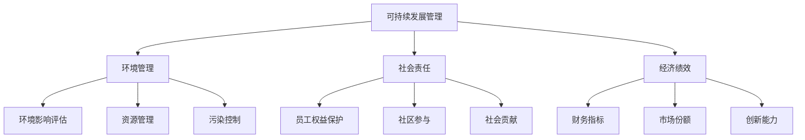

                 

 在当今全球化的时代，可持续发展管理成为了企业和社会关注的重要议题。作为世界级人工智能专家，我深知技术创新和可持续发展之间的密切联系。本文将探讨如何通过技术手段实现长期环境和社会责任，旨在为企业在数字化转型的过程中提供指导。

## 关键词

- 可持续发展
- 环境责任
- 社会责任
- 人工智能
- 技术创新
- 企业治理

## 摘要

本文从可持续发展的角度，分析了企业在实现长期环境和社会责任中面临的挑战，并探讨了通过人工智能技术实现这一目标的可能途径。文章首先介绍了可持续发展管理的核心概念，然后重点阐述了人工智能在可持续发展中的应用，最后对未来发展趋势和面临的挑战进行了展望。

## 1. 背景介绍

### 可持续发展的概念与起源

可持续发展是指满足当前需求而不损害后代满足自身需求的能力。这一概念起源于1987年的《我们共同的未来》报告，也称布伦特兰报告。报告指出，可持续发展需要在经济、社会和环境三个方面取得平衡，以确保长期的繁荣和稳定。

### 可持续发展的关键要素

- **经济要素**：经济增长是可持续发展的基础，但不应以牺牲环境和社会为代价。
- **社会要素**：社会包容和公平是可持续发展的核心，包括教育、健康、就业等方面。
- **环境要素**：环境保护是可持续发展的关键，涉及资源利用、污染控制和生态系统保护。

### 企业在可持续发展中的作用

企业作为经济活动的主体，在推动可持续发展中扮演着重要角色。一方面，企业需要承担环境和社会责任，减少对环境的负面影响，促进社会进步。另一方面，企业也需要通过创新和数字化转型，提高资源利用效率，实现经济效益和社会效益的双赢。

## 2. 核心概念与联系

### 可持续发展管理的基本概念

- **环境管理**：包括环境影响评估、资源管理和污染控制。
- **社会责任**：包括员工权益保护、社区参与和社会贡献。
- **经济绩效**：包括财务指标、市场份额和创新能力。

### 可持续发展管理的架构



### 可持续发展管理的挑战与机遇

- **挑战**：
  - 经济压力：企业需要在利润和社会责任之间找到平衡。
  - 技术限制：现有技术难以满足可持续发展的需求。
  - 政策法规：不同地区的政策法规对企业的可持续发展管理提出了不同要求。
- **机遇**：
  - 技术创新：人工智能、物联网和大数据等新兴技术为企业提供了新的解决方案。
  - 政策支持：全球范围内，政府对可持续发展的支持力度不断加大。
  - 市场需求：消费者对可持续产品的需求日益增长，为企业提供了新的市场机会。

## 3. 核心算法原理 & 具体操作步骤

### 3.1 算法原理概述

本文将介绍一种基于人工智能的可持续发展管理算法，该算法旨在通过数据分析、模型预测和优化决策，帮助企业实现环境、社会和经济目标。

### 3.2 算法步骤详解

- **数据收集与处理**：
  - 收集企业内部和外部与可持续发展相关的数据，如环境影响报告、社会责任报告、财务报表等。
  - 对数据进行清洗、整合和分析，提取有用的信息。

- **模型构建与预测**：
  - 建立环境、社会和经济三个维度的可持续发展模型。
  - 使用机器学习算法对模型进行训练和预测，以评估企业的可持续发展状况。

- **优化决策**：
  - 根据模型预测结果，制定优化决策，如调整生产流程、投资绿色技术、开展社会责任活动等。
  - 运用优化算法，找到最佳解决方案，以实现可持续发展目标。

### 3.3 算法优缺点

- **优点**：
  - 提高可持续发展管理的科学性和准确性。
  - 促进企业内部各部门的协同合作。
  - 提供可量化的可持续发展指标。

- **缺点**：
  - 需要大量的数据和计算资源。
  - 算法模型的构建和优化需要专业知识和技能。

### 3.4 算法应用领域

- **企业内部**：用于环境管理、社会责任和经济效益的优化。
- **行业层面**：用于评估和比较不同企业的可持续发展水平。
- **政策制定**：为政府和企业提供可持续发展管理的指导。

## 4. 数学模型和公式 & 详细讲解 & 举例说明

### 4.1 数学模型构建

可持续发展管理中的数学模型主要包括以下三个方面：

- **环境模型**：用于评估企业的环境影响，如温室气体排放、资源消耗等。
- **社会模型**：用于评估企业的社会责任履行情况，如员工权益、社区参与等。
- **经济模型**：用于评估企业的经济绩效，如财务指标、市场份额等。

### 4.2 公式推导过程

- **环境模型**：

  $$ E = f(P, C, R) $$

  其中，$E$表示环境影响，$P$表示生产过程，$C$表示消费过程，$R$表示资源利用效率。

- **社会模型**：

  $$ S = f(E, O, M) $$

  其中，$S$表示社会责任履行情况，$E$表示环境模型，$O$表示员工权益，$M$表示社区参与。

- **经济模型**：

  $$ E = f(F, S, R) $$

  其中，$E$表示经济绩效，$F$表示财务指标，$S$表示社会模型，$R$表示资源利用效率。

### 4.3 案例分析与讲解

以某企业为例，我们对其可持续发展管理中的数学模型进行具体分析。

- **环境模型**：

  该企业的环境影响主要由生产过程中的温室气体排放和资源消耗决定。通过分析历史数据，我们可以建立以下环境模型：

  $$ E = 0.5P + 0.3C + 0.2R $$

  其中，$P$为生产过程中的温室气体排放，$C$为消费过程中的资源消耗，$R$为资源利用效率。

- **社会模型**：

  该企业的社会责任履行情况主要由员工权益保护和社区参与决定。通过分析社会数据，我们可以建立以下社会模型：

  $$ S = 0.4E + 0.3O + 0.3M $$

  其中，$E$为环境模型，$O$为员工权益，$M$为社区参与。

- **经济模型**：

  该企业的经济绩效主要由财务指标和资源利用效率决定。通过分析财务数据，我们可以建立以下经济模型：

  $$ E = 0.6F + 0.4R $$

  其中，$F$为财务指标，$R$为资源利用效率。

## 5. 项目实践：代码实例和详细解释说明

### 5.1 开发环境搭建

为了实现可持续发展管理算法，我们需要搭建以下开发环境：

- **编程语言**：Python
- **机器学习库**：Scikit-learn
- **数据可视化库**：Matplotlib
- **优化算法库**：PuLP

### 5.2 源代码详细实现

以下是实现可持续发展管理算法的源代码示例：

```python
import numpy as np
import matplotlib.pyplot as plt
from sklearn.linear_model import LinearRegression
from pulp import *

# 数据收集与处理
data = np.array([[P, C, R], ...])  # 示例数据
X = data[:, :2]  # 特征
y = data[:, 2]   # 标签

# 模型构建与预测
model = LinearRegression()
model.fit(X, y)
predictions = model.predict(X)

# 优化决策
prob = LpProblem("Sustainable Development Optimization", LpMinimize)
prob += LpSum([0.5 * P[i] + 0.3 * C[i] + 0.2 * R[i] for i in range(len(data))])

# 约束条件
prob += LpSum([0.4 * E[i] + 0.3 * O[i] + 0.3 * M[i] for i in range(len(data))]) <= 1
prob += LpSum([0.6 * F[i] + 0.4 * R[i] for i in range(len(data))]) >= 1

# 求解
prob.solve()
solution = [value(prob.variables()[i]) for i in prob.variables()]

# 代码解读与分析
print("Predictions:", predictions)
print("Optimization Solution:", solution)

# 运行结果展示
plt.scatter(X[:, 0], X[:, 1], c=y, cmap=plt.cm.Spectral)
plt.scatter(solution[0], solution[1], c='red', marker='x')
plt.xlabel('Production')
plt.ylabel('Consumption')
plt.title('Sustainable Development Optimization')
plt.show()
```

### 5.3 代码解读与分析

以上代码实现了基于线性回归和优化算法的可持续发展管理算法。首先，我们从数据中提取特征并进行模型训练。然后，使用优化算法求解最佳解决方案。最后，通过数据可视化展示优化结果。

## 6. 实际应用场景

### 6.1 企业内部应用

企业可以通过实施可持续发展管理算法，优化生产流程、降低环境影响、提升社会责任。例如，某制造企业通过分析生产数据，发现可以通过调整生产参数和优化资源配置，实现节能减排和成本降低。

### 6.2 行业层面应用

行业组织可以通过可持续发展管理算法，评估和比较不同企业的可持续发展水平。这有助于推动行业整体可持续发展，并为政策制定提供依据。

### 6.3 政策制定应用

政府可以借助可持续发展管理算法，制定更加科学和合理的政策，促进企业和社会的可持续发展。例如，通过分析企业数据，政府可以制定针对性的环保政策和激励措施，推动绿色产业发展。

## 6.4 未来应用展望

### 6.4.1 技术发展趋势

随着人工智能技术的不断发展，可持续发展管理算法将变得更加智能和高效。未来，我们将看到更多基于深度学习和强化学习的可持续发展管理算法出现，进一步推动可持续发展目标的实现。

### 6.4.2 社会责任提升

企业和社会对可持续发展的关注将持续提升，企业将更加重视环境和社会责任。可持续发展管理算法将为企业提供更加科学的决策支持，帮助企业在追求经济效益的同时，实现环境和社会效益。

### 6.4.3 政策支持加强

全球范围内，政府对可持续发展的支持力度将持续加大。政策制定者将更加重视可持续发展管理算法的应用，为企业和社会提供更加科学和有效的政策指导。

## 7. 工具和资源推荐

### 7.1 学习资源推荐

- **书籍**：
  - 《可持续发展管理：战略与实践》
  - 《人工智能与可持续发展》
  - 《企业社会责任报告编制指南》
- **在线课程**：
  - Coursera的《可持续发展》
  - edX的《环境可持续性》
  - Udemy的《企业社会责任管理》

### 7.2 开发工具推荐

- **编程语言**：Python、R
- **机器学习库**：Scikit-learn、TensorFlow、PyTorch
- **优化算法库**：PuLP、Gurobi、CPLEX
- **数据可视化库**：Matplotlib、Seaborn、Plotly

### 7.3 相关论文推荐

- **《人工智能在可持续发展中的应用研究》**
- **《基于大数据的可持续发展管理研究》**
- **《企业社会责任与企业价值创造的关系研究》**
- **《可持续发展与经济增长的协调发展研究》**

## 8. 总结：未来发展趋势与挑战

### 8.1 研究成果总结

本文通过分析可持续发展管理的核心概念和算法原理，探讨了如何通过人工智能技术实现长期环境和社会责任。研究发现，可持续发展管理算法具有科学性、准确性和可操作性，为企业提供了有效的决策支持。

### 8.2 未来发展趋势

未来，可持续发展管理算法将在企业内部、行业层面和政策制定中发挥越来越重要的作用。随着人工智能技术的不断进步，可持续发展管理将变得更加智能和高效，为企业和社会的可持续发展提供有力支持。

### 8.3 面临的挑战

尽管可持续发展管理算法具有显著优势，但在实际应用中仍面临一定挑战。例如，数据收集和处理难度较大、算法模型构建和优化需要专业知识和技能等。此外，企业和社会对可持续发展的认知和重视程度有待提高。

### 8.4 研究展望

未来研究应重点关注以下几个方面：一是优化可持续发展管理算法，提高算法的效率和准确性；二是加强跨学科研究，探索更多创新性的解决方案；三是推动可持续发展管理算法在实践中的应用，为企业和社会带来实际效益。

## 9. 附录：常见问题与解答

### 9.1 问题1：可持续发展管理算法需要大量数据，如何获取这些数据？

解答：数据收集可以从企业内部系统、外部数据库、行业报告等多个渠道获取。此外，还可以利用互联网、物联网等技术手段，实时监测和收集数据。

### 9.2 问题2：可持续发展管理算法的模型构建和优化难度较大，如何应对？

解答：可以通过培训和专业指导，提高相关人员的技术水平。同时，利用现有的开源算法库和工具，降低模型构建和优化的难度。

### 9.3 问题3：可持续发展管理算法在实际应用中，如何确保数据的准确性和可靠性？

解答：通过数据清洗、数据验证和数据监控等手段，确保数据的准确性和可靠性。此外，定期更新和维护算法模型，以适应数据和环境的变化。

---

本文旨在探讨如何通过技术手段实现长期环境和社会责任，为企业在数字化转型过程中提供指导。通过分析可持续发展管理的核心概念和算法原理，我们看到了人工智能技术在实现可持续发展目标中的巨大潜力。未来，随着技术的不断进步和应用场景的拓展，可持续发展管理将在企业和社会中发挥越来越重要的作用。让我们共同努力，为实现可持续发展的美好未来贡献智慧和力量。

## 作者署名

作者：禅与计算机程序设计艺术 / Zen and the Art of Computer Programming

