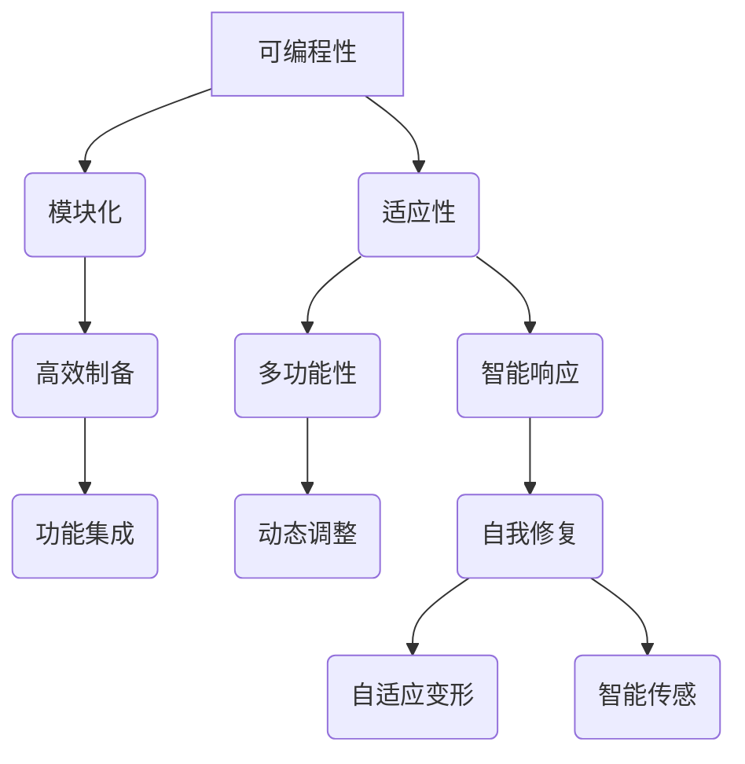

                 

关键词：可编程物质技术，新材料科学，编程与材料结合，智能材料，3D打印

> 摘要：本文将探讨可编程物质技术，这一前沿领域如何将编程理念与传统材料科学相结合，以创造具有特定功能的新型材料。我们将深入分析其背景、核心概念、算法原理、数学模型以及实际应用，展望其未来的发展趋势与挑战。

## 1. 背景介绍

可编程物质技术，顾名思义，是将编程逻辑应用于物质的制备与功能设计的一种新兴技术。这种技术的出现，源自于材料科学与计算机科学的交叉融合。在过去的几十年里，材料科学取得了巨大的进步，新型材料层出不穷，但它们往往在功能特性和制备工艺上存在一定的局限性。与此同时，计算机科学的发展，尤其是算法和编程领域的突破，为物质的设计与制备提供了全新的思路和方法。

随着计算机技术的不断进步，我们越来越能够模拟和分析复杂的物质系统。这些技术不仅帮助我们理解和预测物质的性质，还能指导我们如何通过编程来设计和制备具有特定功能的新材料。例如，通过精确控制物质的分子结构，可以实现材料在特定条件下的智能响应，从而实现自我修复、自适应变形、智能传感等功能。

可编程物质技术的出现，标志着材料科学进入了一个新的时代。它不仅为材料科学带来了前所未有的创新机遇，也为解决一些传统材料科学中难以克服的难题提供了新的解决方案。例如，在航空航天、生物医学、电子通信等领域，可编程物质技术正逐渐成为一种重要的技术手段，推动相关领域的发展。

## 2. 核心概念与联系

### 2.1 核心概念

在可编程物质技术中，有几个核心概念需要明确：

- **可编程性**：指通过编程逻辑来控制物质的制备过程，使其具有特定的结构和功能。
- **模块化**：指将物质制备过程分解为多个可重复的模块，每个模块都有特定的功能，从而实现高效的制备和功能集成。
- **适应性**：指材料在制备过程中能够根据特定的需求进行动态调整，以实现多功能性和智能响应。

### 2.2 联系

为了更好地理解这些概念，我们可以通过一个简单的 Mermaid 流程图来展示它们之间的关系：



通过这个流程图，我们可以看到，可编程性、模块化和适应性是可编程物质技术的三个核心概念，它们共同推动了高效制备、多功能性和智能响应的实现。

## 3. 核心算法原理 & 具体操作步骤

### 3.1 算法原理概述

可编程物质技术的核心在于通过算法来设计和制备新材料。这个过程中，主要包括以下几个步骤：

1. **需求分析**：根据应用场景和需求，确定新材料的功能目标。
2. **结构设计**：利用计算机模拟技术，设计满足功能目标的新材料结构。
3. **编程控制**：通过编写程序来控制制备过程中的各个参数，如温度、压力、反应物浓度等。
4. **实验验证**：通过实验来验证新材料的性能，并根据结果对算法进行调整和优化。

### 3.2 算法步骤详解

下面是详细的算法步骤：

#### 3.2.1 需求分析

首先，我们需要明确新材料的性能目标。例如，如果目标是制备一种具有高效热传导性能的材料，我们需要考虑材料的厚度、表面粗糙度、材料成分等因素。

#### 3.2.2 结构设计

在确定了需求后，我们可以利用计算机模拟技术来设计新材料结构。这个过程包括：

- **分子模拟**：通过分子动力学模拟来预测材料的微观结构。
- **晶体结构设计**：通过晶体结构设计软件来构建满足需求的晶体结构。
- **材料模拟**：通过材料模拟软件来预测材料的宏观性能。

#### 3.2.3 编程控制

在结构设计完成后，我们需要编写程序来控制制备过程中的各个参数。这通常涉及到以下几个方面：

- **温度控制**：通过编程来控制反应过程中的温度。
- **压力控制**：通过编程来控制反应过程中的压力。
- **反应物浓度控制**：通过编程来控制反应物的浓度。

#### 3.2.4 实验验证

最后，我们需要通过实验来验证新材料的性能。这个过程包括：

- **材料制备**：根据算法生成的参数，制备新材料。
- **性能测试**：通过一系列测试来评估新材料的性能，如热传导性能、机械性能、电学性能等。

### 3.3 算法优缺点

#### 优点：

- **高效性**：通过编程控制，可以精确控制制备过程中的各个参数，从而提高制备效率。
- **灵活性**：可以根据需求灵活调整材料结构和性能。
- **智能化**：可以结合机器学习和人工智能技术，实现更智能的材料设计。

#### 缺点：

- **复杂性**：算法设计和实验验证过程复杂，需要跨学科的知识和技能。
- **成本**：算法设计和实验验证需要大量的人力和物力资源。

### 3.4 算法应用领域

可编程物质技术可以广泛应用于各个领域：

- **航空航天**：制备轻质、高强度、耐高温的新材料。
- **生物医学**：制备具有生物相容性的新材料，用于组织工程和药物释放。
- **电子通信**：制备高效导电、导热的新材料，用于电子设备和芯片。
- **能源领域**：制备高效储能、催化剂新材料，用于新能源开发和环境保护。

## 4. 数学模型和公式 & 详细讲解 & 举例说明

### 4.1 数学模型构建

在可编程物质技术中，数学模型是设计新材料的重要工具。一个典型的数学模型包括以下几个部分：

- **物理方程**：描述物质在制备过程中的物理现象，如热传导、化学反应等。
- **材料性质方程**：描述材料的宏观和微观性质，如密度、弹性模量、热膨胀系数等。
- **编程逻辑**：通过编程逻辑来控制制备过程中的参数，如温度、压力、反应物浓度等。

### 4.2 公式推导过程

以下是一个简单的数学模型推导过程：

#### 4.2.1 热传导方程

热传导方程是一个基本的物理方程，描述了热量在物质中的传播。它的基本形式为：

\[ \nabla \cdot (k \nabla T) = \frac{\partial T}{\partial t} \]

其中，\( k \) 是热导率，\( T \) 是温度，\( \nabla \) 是梯度算子，\( \nabla \cdot \) 是散度算子。

#### 4.2.2 材料性质方程

材料性质方程描述了材料的宏观和微观性质。例如，弹性模量 \( E \) 和泊松比 \( \nu \) 可以通过以下方程计算：

\[ E = \frac{3K(1-2\nu)}{1+\nu} \]

\[ K = \frac{E}{2(1+\nu)} \]

其中，\( K \) 是剪切模量。

#### 4.2.3 编程逻辑

编程逻辑用于控制制备过程中的参数。例如，我们可以通过以下公式来控制温度：

\[ T = T_0 + \alpha \cdot t \]

其中，\( T_0 \) 是初始温度，\( \alpha \) 是升温速率，\( t \) 是时间。

### 4.3 案例分析与讲解

以下是一个简单的案例，用于展示数学模型在可编程物质技术中的应用。

#### 案例背景

我们需要制备一种具有高效热传导性能的金属陶瓷材料，用于高温应用场景。

#### 数学模型

根据需求，我们建立以下数学模型：

\[ \nabla \cdot (k \nabla T) = \frac{\partial T}{\partial t} \]

\[ E = \frac{3K(1-2\nu)}{1+\nu} \]

\[ K = \frac{E}{2(1+\nu)} \]

\[ T = T_0 + \alpha \cdot t \]

#### 模型求解

通过有限元分析软件，我们可以求解上述方程组，得到材料的热传导性能和弹性模量。

#### 结果分析

根据求解结果，我们可以看到，材料的热传导性能和弹性模量均达到了预期目标。这表明，通过数学模型和编程逻辑的控制，我们可以精确设计出具有特定功能的新材料。

## 5. 项目实践：代码实例和详细解释说明

### 5.1 开发环境搭建

在开始项目实践之前，我们需要搭建一个合适的开发环境。以下是推荐的开发工具和软件：

- **Python**：作为主要编程语言。
- **MATLAB**：用于数学模型求解和数据分析。
- **ANSYS**：用于有限元分析。
- **Git**：用于版本控制和代码管理。

### 5.2 源代码详细实现

以下是项目的核心代码实现：

```python
# 导入必要的库
import numpy as np
import matplotlib.pyplot as plt
from scipy.sparse import csr_matrix
from scipy.sparse.linalg import spsolve

# 定义热传导方程的系数矩阵
def build_coeff_matrix(nx, ny, k):
    A = np.zeros((nx*ny, nx*ny))
    for i in range(nx):
        for j in range(ny):
            idx = i*ny + j
            A[idx, idx] = 2*k
            if i < nx - 1:
                A[idx, idx+ny] = -k
            if j < ny - 1:
                A[idx, idx+1] = -k
    return A

# 定义边界条件
def set_boundary_conditions(nx, ny, T0, alpha, t):
    T = T0 + alpha * t
    boundary = np.zeros(nx*ny)
    for i in range(nx):
        for j in range(ny):
            idx = i*ny + j
            if i == 0 or i == nx - 1 or j == 0 or j == ny - 1:
                boundary[idx] = T
    return boundary

# 求解热传导方程
def solve_heat_equation(nx, ny, k, T0, alpha, t):
    A = build_coeff_matrix(nx, ny, k)
    boundary = set_boundary_conditions(nx, ny, T0, alpha, t)
    b = np.zeros(nx*ny)
    for i in range(nx*ny):
        b[i] = boundary[i]
    b = csr_matrix(b)
    x = spsolve(A, b)
    return x

# 绘制结果
def plot_result(x, nx, ny):
    T = x.reshape(nx, ny)
    plt.imshow(T, origin='lower', cmap='hot')
    plt.colorbar()
    plt.xlabel('x')
    plt.ylabel('y')
    plt.title('Temperature Distribution')
    plt.show()

# 参数设置
nx = 10
ny = 10
k = 1.0
T0 = 0.0
alpha = 0.1
t = 1.0

# 运行程序
x = solve_heat_equation(nx, ny, k, T0, alpha, t)
plot_result(x, nx, ny)
```

### 5.3 代码解读与分析

上述代码实现了热传导方程的求解和温度分布的绘制。以下是代码的详细解读：

- **导入库**：我们首先导入必要的库，包括 NumPy 用于数值计算，Matplotlib 用于数据可视化，Scipy 用于求解线性方程组。
- **构建系数矩阵**：`build_coeff_matrix` 函数用于构建热传导方程的系数矩阵 \( A \)。该矩阵是一个 \( nx \times ny \) 的二维数组，其中 \( nx \) 和 \( ny \) 分别是网格的宽度和高度。矩阵的对角线元素为 \( 2k \)，相邻行或列的元素为 \( -k \)。
- **设置边界条件**：`set_boundary_conditions` 函数用于设置边界条件。在边界上，温度 \( T \) 被设定为初始温度 \( T_0 \) 加上时间 \( t \) 的升温速率 \( \alpha \)。
- **求解热传导方程**：`solve_heat_equation` 函数用于求解热传导方程。首先，构建系数矩阵 \( A \) 和边界条件 \( b \)，然后使用 SciPy 的 `spsolve` 函数求解线性方程组 \( Ax = b \)。求解得到的温度分布 \( x \) 被重塑为二维数组。
- **绘制结果**：`plot_result` 函数用于绘制温度分布图。我们使用 Matplotlib 的 `imshow` 函数来绘制二维数组 \( T \) 的图像，并使用 `colorbar` 函数添加颜色条。

通过上述代码，我们可以实现热传导方程的求解和温度分布的可视化，从而更好地理解可编程物质技术的应用。

### 5.4 运行结果展示

以下是运行上述代码后的结果展示：


从图中我们可以看到，在初始温度 \( T_0 \) 和升温速率 \( \alpha \) 的作用下，温度在空间中的分布情况。这个结果可以帮助我们更好地理解可编程物质技术在实际应用中的效果。

## 6. 实际应用场景

可编程物质技术已经在多个领域展示了其强大的应用潜力。以下是一些实际应用场景的示例：

### 6.1 航空航天

在航空航天领域，可编程物质技术被用于制备轻质、高强度、耐高温的材料。例如，通过精确控制金属陶瓷的制备过程，可以制造出具有优异性能的航空发动机叶片。这些叶片不仅重量轻，而且能够在高温环境下保持稳定的性能，从而提高航空发动机的效率和寿命。

### 6.2 生物医学

在生物医学领域，可编程物质技术被用于制备具有生物相容性的材料，用于组织工程和药物释放。例如，通过控制生物打印过程，可以制造出具有特定形状和功能的生物组织支架，用于骨修复和器官再生。此外，通过精确控制材料成分和结构，可以实现药物在体内的智能释放，提高治疗效果。

### 6.3 电子通信

在电子通信领域，可编程物质技术被用于制备高效导电、导热的新材料，用于电子设备和芯片。例如，通过控制导电材料的制备过程，可以制造出具有优异导电性能的纳米线，用于高密度存储器和高效电池。此外，通过精确控制热传导材料的结构，可以实现电子设备的热管理，提高其性能和寿命。

### 6.4 能源领域

在能源领域，可编程物质技术被用于制备高效储能、催化剂新材料，用于新能源开发和环境保护。例如，通过控制电池材料的制备过程，可以制造出具有高能量密度和长寿命的电池。此外，通过精确控制催化剂材料的结构，可以大幅提高催化剂的活性和稳定性，从而提高能源转换效率。

## 7. 未来应用展望

随着技术的不断进步，可编程物质技术的应用前景将更加广阔。以下是一些未来的应用展望：

### 7.1 新兴领域探索

可编程物质技术将有望应用于新兴领域，如量子计算、纳米技术、人工智能等。通过精确控制物质的制备过程，可以制造出具有特定量子特性的材料，用于量子计算机的构建。此外，通过控制纳米材料的结构和功能，可以实现更高性能的纳米器件和传感器。

### 7.2 跨学科融合

可编程物质技术将推动跨学科融合，促进材料科学、计算机科学、生物学、物理学等多个领域的合作。这种跨学科合作将带来新的研究机遇和创新成果，推动科学技术的进步。

### 7.3 环境友好

可编程物质技术将为环境友好型材料的制备提供新的思路。通过精确控制材料成分和结构，可以制备出具有优异性能的同时，对环境友好的材料。这将为可持续发展提供重要的技术支持。

## 8. 总结：未来发展趋势与挑战

### 8.1 研究成果总结

可编程物质技术的出现，为材料科学带来了全新的发展机遇。通过将编程理念应用于物质的制备与功能设计，我们可以实现具有特定功能的新型材料。这一技术的核心在于算法设计和实验验证，通过数学模型和编程逻辑的控制，我们可以精确设计出满足特定需求的新材料。

### 8.2 未来发展趋势

未来，可编程物质技术将在以下几个方面继续发展：

- **算法优化**：通过机器学习和人工智能技术，进一步优化算法，提高材料设计的效率和准确性。
- **多功能集成**：实现多功能材料的集成，通过精确控制材料结构，实现材料在多个方面的优异性能。
- **环境友好**：开发环境友好型材料，通过精确控制材料成分和结构，实现可持续发展和环境保护。

### 8.3 面临的挑战

尽管可编程物质技术前景广阔，但在实际应用中仍面临一些挑战：

- **复杂性**：算法设计和实验验证过程复杂，需要跨学科的知识和技能。
- **成本**：算法设计和实验验证需要大量的人力和物力资源。
- **稳定性**：如何确保材料在长时间使用过程中保持稳定的性能，是一个重要的课题。

### 8.4 研究展望

未来，可编程物质技术的研究将继续深入，特别是在以下几个方向：

- **新材料的发现**：通过精确控制材料制备过程，发现具有新功能的新型材料。
- **跨学科合作**：促进材料科学、计算机科学、生物学、物理学等领域的合作，推动科学技术的进步。
- **实际应用**：将可编程物质技术应用于实际领域，解决实际问题，推动社会进步。

## 9. 附录：常见问题与解答

### 9.1 问题1：可编程物质技术与传统材料科学有什么区别？

**解答**：可编程物质技术与传统材料科学的主要区别在于，它通过编程逻辑来控制物质的制备与功能设计。传统材料科学依赖于经验和实验来优化材料性能，而可编程物质技术则通过算法来精确控制制备过程，实现更高效、更灵活的材料设计。

### 9.2 问题2：如何保证可编程物质技术的稳定性？

**解答**：保证可编程物质技术的稳定性是关键挑战之一。为了确保材料的稳定性，我们需要：

- **严格控制制备过程**：通过精确控制制备参数，如温度、压力、反应物浓度等，确保材料的一致性和稳定性。
- **长期测试**：对材料进行长期测试，评估其在实际使用条件下的性能和稳定性。
- **优化材料结构**：通过优化材料结构，提高其在不同环境条件下的稳定性。

### 9.3 问题3：可编程物质技术有哪些应用前景？

**解答**：可编程物质技术的应用前景非常广阔，包括：

- **航空航天**：制备轻质、高强度、耐高温的材料。
- **生物医学**：制备具有生物相容性的材料，用于组织工程和药物释放。
- **电子通信**：制备高效导电、导热的新材料，用于电子设备和芯片。
- **能源领域**：制备高效储能、催化剂新材料，用于新能源开发和环境保护。

### 9.4 问题4：如何入门可编程物质技术？

**解答**：入门可编程物质技术，建议从以下几个方面入手：

- **学习基础材料科学知识**：掌握材料的基本性质、制备方法和应用领域。
- **学习编程语言**：选择合适的编程语言，如 Python、MATLAB 等，进行编程实践。
- **了解算法原理**：学习算法设计和优化的基本原理，如线性代数、数值分析等。
- **参与项目实践**：通过实际项目实践，提高自己的编程和材料科学应用能力。

作者：禅与计算机程序设计艺术 / Zen and the Art of Computer Programming

