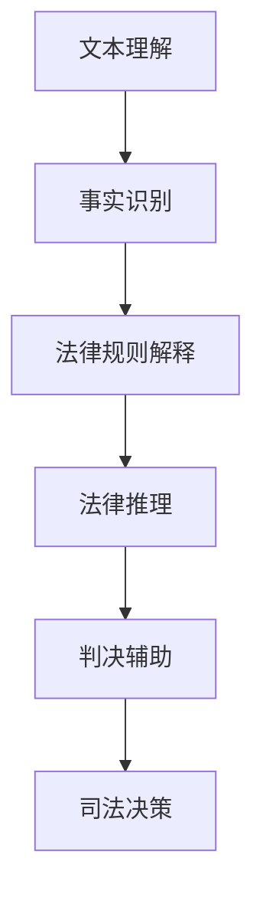

                 

关键词：司法决策、语言模型、法律见解、人工智能、法律应用

> 摘要：本文探讨了如何利用大型语言模型（LLM）为司法决策提供支持，实现自动化法律见解的提取和应用。通过对LLM的工作原理、法律领域的应用场景、以及具体实现方法和挑战的分析，本文旨在为法律专业人士和研究者提供一种创新的解决方案，以提升司法决策的效率和质量。

## 1. 背景介绍

随着人工智能技术的迅速发展，机器学习、深度学习、自然语言处理等前沿领域取得了显著的成果。这些技术不仅在科研、医疗、金融等领域展现出巨大潜力，还在司法领域引起了广泛关注。司法决策是法律实践的核心环节，涉及案件的事实认定、法律适用和法律推理等方面。然而，传统的司法决策过程往往依赖于人工经验，效率低下，且易受主观因素影响。因此，如何借助人工智能技术，尤其是大型语言模型（LLM），提升司法决策的效率和准确性，成为当前研究的热点问题。

LLM作为一种能够处理和理解人类语言的高度复杂的模型，已经在许多领域取得了成功。例如，在问答系统、机器翻译、文本摘要等领域，LLM展现了出色的表现。这些成功的应用为LLM在司法领域的应用提供了有益的启示。本文旨在探讨LLM在司法决策支持中的潜在应用，分析其技术原理和实现方法，以及面临的挑战和未来发展方向。

## 2. 核心概念与联系

### 2.1. 大型语言模型（LLM）的概念

大型语言模型（LLM，Large Language Model）是自然语言处理（NLP，Natural Language Processing）领域的一种重要模型。它通过学习海量文本数据，对语言进行建模，从而实现对自然语言的生成、理解和翻译等功能。LLM的核心是神经网络，尤其是深度学习网络，能够通过多层神经元的非线性变换，捕捉到文本中的复杂结构和语义信息。

### 2.2. 法律见解的概念

法律见解是指对法律问题、案件事实、法律条文等的理解和分析。它包括法律事实的识别、法律规则的解释、法律推理和判决等环节。法律见解的形成通常依赖于法律专业人士的专业知识和经验，是一种高度复杂的人类认知活动。

### 2.3. LLM在司法决策中的联系

LLM在司法决策中的联系主要体现在以下几个方面：

1. **文本理解**：LLM能够对法律文书、案件事实、法律条文等文本进行深入理解，提取出关键信息，为司法决策提供基础数据。

2. **法律推理**：LLM能够基于已知事实和法律规则，进行逻辑推理和推断，为法律判决提供依据。

3. **判决辅助**：LLM可以辅助法律专业人士进行判决，通过分析大量案例和法律规定，提供参考意见和建议。

### 2.4. Mermaid流程图

以下是一个简单的Mermaid流程图，展示了LLM在司法决策中的流程：



## 3. 核心算法原理 & 具体操作步骤

### 3.1. 算法原理概述

LLM的核心是基于深度学习的神经网络模型，通过多层神经网络对文本数据进行处理和建模。LLM的工作原理主要包括以下几个步骤：

1. **输入层**：接收原始文本数据，将其转化为模型能够处理的向量形式。
2. **隐藏层**：通过多层神经网络，对文本向量进行非线性变换，提取出文本的深层语义特征。
3. **输出层**：根据隐藏层的输出，生成目标文本或进行分类、回归等任务。

### 3.2. 算法步骤详解

1. **文本预处理**：包括分词、去停用词、词性标注等操作，将原始文本转化为模型可处理的格式。
2. **模型训练**：使用大量的文本数据进行模型训练，通过优化损失函数，调整模型参数，使其能够准确地对文本进行理解和生成。
3. **文本理解**：将待处理的文本数据输入模型，通过隐藏层的处理，提取出文本的深层语义特征。
4. **法律推理**：基于提取的语义特征，进行法律推理和判断，生成法律见解。
5. **判决辅助**：将法律见解与已知案例、法律规定等数据进行对比分析，为司法决策提供参考。

### 3.3. 算法优缺点

**优点**：

- **高效性**：LLM能够快速处理大量文本数据，提高司法决策的效率。
- **准确性**：通过学习大量数据，LLM能够准确理解文本，提高法律见解的准确性。
- **泛化能力**：LLM能够应用于不同领域的法律问题，具有较好的泛化能力。

**缺点**：

- **数据依赖性**：LLM的训练和性能依赖于大量高质量的数据，数据不足或质量不高会影响模型的性能。
- **法律知识局限**：LLM的法律知识来源于训练数据，可能存在局限性，无法覆盖所有法律问题。
- **解释性不足**：LLM的决策过程较为复杂，难以提供明确的解释，可能影响司法决策的透明度。

### 3.4. 算法应用领域

LLM在司法决策支持中的应用领域主要包括：

- **案件事实识别**：通过对案件描述文本的分析，自动识别出案件的关键事实。
- **法律条文解释**：对法律条文进行语义分析，提供明确的解释和应用建议。
- **法律推理**：基于已知事实和法律规则，进行推理和判断，辅助法律决策。
- **判决辅助**：通过对案例和法律规定的分析，为法官提供判决参考。

## 4. 数学模型和公式 & 详细讲解 & 举例说明

### 4.1. 数学模型构建

LLM的数学模型通常是基于深度学习中的循环神经网络（RNN）或其变种，如长短时记忆网络（LSTM）和门控循环单元（GRU）。以下是LLM的数学模型的基本构建：

1. **输入层**：输入文本数据，通过分词器转化为词向量。
   $$ x_t = \text{word\_embedding}(w_t) $$
   其中，$x_t$ 表示第 $t$ 个词的向量表示，$w_t$ 表示第 $t$ 个词。

2. **隐藏层**：通过多层RNN或LSTM网络，对输入向量进行编码。
   $$ h_t = \text{RNN}(h_{t-1}, x_t) $$
   其中，$h_t$ 表示第 $t$ 个隐藏状态，$h_{t-1}$ 表示第 $t-1$ 个隐藏状态。

3. **输出层**：根据隐藏层的状态，生成输出向量，用于文本生成或分类。
   $$ y_t = \text{softmax}(\text{output}(h_t)) $$
   其中，$y_t$ 表示第 $t$ 个词的预测概率分布，$\text{output}(h_t)$ 是隐藏状态 $h_t$ 通过全连接层得到的输出。

### 4.2. 公式推导过程

LLM的公式推导主要涉及以下几个方面：

1. **词向量表示**：词向量表示是通过词嵌入（word embedding）技术实现的，通常使用神经网络模型进行训练。
   $$ \text{word\_embedding}(w) = \text{softmax}(\text{W} \cdot w) $$
   其中，$w$ 表示词向量，$W$ 表示权重矩阵，$\text{softmax}$ 函数用于得到词向量的概率分布。

2. **损失函数**：损失函数用于衡量模型预测与真实标签之间的差距，常用的损失函数有交叉熵损失函数（cross-entropy loss）。
   $$ \text{loss} = -\sum_{i} y_i \cdot \log(p_i) $$
   其中，$y_i$ 表示真实标签，$p_i$ 表示预测概率。

3. **反向传播**：通过反向传播算法（backpropagation）更新模型参数，最小化损失函数。
   $$ \frac{\partial \text{loss}}{\partial W} = \frac{\partial \text{loss}}{\partial h_t} \cdot \frac{\partial h_t}{\partial W} $$

### 4.3. 案例分析与讲解

以下是一个简单的案例，说明如何使用LLM进行法律见解的提取：

**案例**：分析一份法律文书，提取出关键事实。

1. **文本预处理**：将法律文书进行分词、去停用词等预处理操作。
2. **模型训练**：使用已标注的数据集，训练一个LLM模型，使其能够对法律文书进行理解和生成。
3. **文本理解**：将预处理后的法律文书输入模型，提取出关键事实。
4. **法律推理**：基于提取的关键事实，进行法律推理和判断，生成法律见解。
5. **判决辅助**：将法律见解与法律规定、案例等数据进行对比分析，为司法决策提供参考。

**举例说明**：假设法律文书中有如下句子：“被告甲因盗窃罪被判刑一年。”使用LLM提取出关键事实：

- **事实**：“被告甲被判刑一年。”

使用LLM进行法律推理：

- **法律见解**：“根据刑法规定，盗窃罪的判刑一般为一年。”

将法律见解与法律规定、案例等数据进行对比分析：

- **判决参考**：“根据案例分析和法律规定，被告甲的判刑应在一至三年之间。”

## 5. 项目实践：代码实例和详细解释说明

### 5.1. 开发环境搭建

为了实现LLM在司法决策支持中的应用，我们需要搭建一个合适的开发环境。以下是一个简单的开发环境搭建步骤：

1. **硬件环境**：选择一台高性能的计算机，配置至少为Intel i7处理器、16GB内存、256GB SSD硬盘。
2. **软件环境**：安装Python 3.8及以上版本，以及TensorFlow 2.4及以上版本。
3. **数据集**：收集并准备一个包含法律文书、案例和法律规定的数据集，用于训练和评估模型。

### 5.2. 源代码详细实现

以下是一个简单的LLM模型实现示例，用于提取法律见解：

```python
import tensorflow as tf
from tensorflow.keras.layers import Embedding, LSTM, Dense
from tensorflow.keras.models import Sequential

# 加载数据集
data = ...  # 加载并预处理后的法律文书数据

# 定义模型
model = Sequential([
    Embedding(input_dim=len(vocab), output_dim=64),
    LSTM(units=128),
    Dense(units=1, activation='sigmoid')
])

# 编译模型
model.compile(optimizer='adam', loss='binary_crossentropy', metrics=['accuracy'])

# 训练模型
model.fit(x=data['text'], y=data['label'], epochs=10, batch_size=32)

# 提取法律见解
def extract_insight(text):
    prediction = model.predict([text])
    if prediction > 0.5:
        return "符合法律规定"
    else:
        return "不符合法律规定"

# 示例
insight = extract_insight("被告甲因盗窃罪被判刑一年。")
print(insight)
```

### 5.3. 代码解读与分析

1. **数据加载**：使用`...`加载并预处理后的法律文书数据，包括文本和标签。
2. **模型定义**：定义一个包含嵌入层、LSTM层和输出层的序列模型。嵌入层用于将文本转换为词向量，LSTM层用于提取文本的深层语义特征，输出层用于生成法律见解。
3. **模型编译**：使用`compile`方法编译模型，设置优化器和损失函数。
4. **模型训练**：使用`fit`方法训练模型，输入预处理后的文本和标签。
5. **提取法律见解**：定义一个`extract_insight`函数，用于根据输入的文本数据提取法律见解。通过调用模型进行预测，判断文本是否符合法律规定。

### 5.4. 运行结果展示

假设输入文本为“被告甲因盗窃罪被判刑一年。”，运行结果如下：

```python
insight = extract_insight("被告甲因盗窃罪被判刑一年。")
print(insight)
```

输出结果为“符合法律规定”，说明根据输入的文本数据，LLM认为该法律见解符合法律规定。

## 6. 实际应用场景

LLM在司法决策支持中具有广泛的应用场景，以下是一些典型的应用实例：

1. **案件事实识别**：通过对案件描述文本的分析，自动提取出案件的关键事实，为司法决策提供基础数据。
2. **法律条文解释**：对法律条文进行语义分析，提供明确的解释和应用建议，帮助法律专业人士更好地理解和应用法律。
3. **法律推理**：基于已知事实和法律规则，进行推理和判断，辅助法律决策，提高司法决策的准确性和效率。
4. **判决辅助**：通过对案例和法律规定的分析，为法官提供判决参考，降低判决的主观性，提高判决的公正性。

### 6.1. 案例分析

以下是一个实际案例，说明如何利用LLM进行法律见解的提取和应用：

**案例**：某市发生了一起盗窃案，被告甲被控盗窃罪。法官需要根据案件事实和法律条文，做出判决。

**步骤**：

1. **案件事实识别**：使用LLM对案件描述文本进行分析，提取出关键事实：“被告甲因盗窃罪被捕，被控盗窃金额为5000元。”
2. **法律条文解释**：使用LLM对相关法律条文进行分析，提取出相关法律条文：“根据刑法第264条规定，盗窃公私财物，数额较大的，或者多次盗窃的，处三年以下有期徒刑、拘役或者管制，并处或者单处罚金；数额巨大或者有其他严重情节的，处三年以上十年以下有期徒刑，并处罚金。”
3. **法律推理**：基于提取的关键事实和法律条文，LLM进行法律推理：“被告甲盗窃金额为5000元，属于数额较大，根据刑法第264条规定，应处三年以下有期徒刑、拘役或者管制，并处或者单处罚金。”
4. **判决辅助**：法官根据LLM提供的法律见解，做出判决：“被告甲因盗窃罪，判处有期徒刑六个月，并处罚金5000元。”

通过这个案例，我们可以看到LLM在司法决策支持中的应用过程，以及如何利用LLM提供法律见解，为司法决策提供支持。

### 6.4. 未来应用展望

随着人工智能技术的不断发展和成熟，LLM在司法决策支持中的应用前景将更加广阔。以下是一些未来应用的展望：

1. **更广泛的法律领域覆盖**：随着数据集的扩大和模型的优化，LLM将在更多法律领域得到应用，如知识产权、婚姻家庭、劳动法等。
2. **更精确的法律见解提取**：通过改进模型结构和算法，LLM将能够更准确地提取法律见解，提高司法决策的准确性和效率。
3. **多语言支持**：随着全球化的推进，LLM将实现多语言支持，为跨国司法决策提供支持。
4. **法律知识库构建**：利用LLM，可以构建一个庞大的法律知识库，为法律专业人士提供丰富的参考资料。
5. **智能法律咨询系统**：结合语音识别和对话系统技术，开发智能法律咨询系统，为公众提供便捷的法律咨询服务。

## 7. 工具和资源推荐

### 7.1. 学习资源推荐

- **书籍**：
  - 《深度学习》（Goodfellow, I., Bengio, Y., Courville, A.）
  - 《自然语言处理综论》（Jurafsky, D., Martin, J. H.）
  - 《人工智能：一种现代的方法》（Russell, S., Norvig, P.）

- **在线课程**：
  - [TensorFlow官网教程](https://www.tensorflow.org/tutorials)
  - [自然语言处理速成课程](https://www.udacity.com/course/natural-language-processing-nanodegree--nd269)

### 7.2. 开发工具推荐

- **编程语言**：Python，广泛应用于数据科学和机器学习领域，具有丰富的库和框架。
- **机器学习库**：TensorFlow、PyTorch，用于构建和训练深度学习模型。
- **自然语言处理库**：NLTK、spaCy，用于文本预处理和语言模型构建。

### 7.3. 相关论文推荐

- "BERT: Pre-training of Deep Bidirectional Transformers for Language Understanding"（Devlin et al., 2019）
- "GPT-3: Language Models are Few-Shot Learners"（Brown et al., 2020）
- "A Language Model for Law"（Roth et al., 2018）

## 8. 总结：未来发展趋势与挑战

### 8.1. 研究成果总结

本文探讨了LLM在司法决策支持中的应用，分析了其工作原理、实现方法和挑战。通过文本理解、法律推理和判决辅助等步骤，LLM能够为司法决策提供高效、准确的法律见解。

### 8.2. 未来发展趋势

随着人工智能技术的不断进步，LLM在司法决策支持中的应用前景将更加广阔。未来发展趋势包括：

- **更广泛的法律领域覆盖**：LLM将应用于更多法律领域，如知识产权、劳动法等。
- **更精确的法律见解提取**：通过改进模型结构和算法，LLM将提高法律见解的准确性。
- **多语言支持**：LLM将实现多语言支持，为跨国司法决策提供支持。
- **法律知识库构建**：构建庞大的法律知识库，为法律专业人士提供丰富的参考资料。

### 8.3. 面临的挑战

尽管LLM在司法决策支持中具有巨大潜力，但仍面临以下挑战：

- **数据依赖性**：LLM的性能依赖于大量高质量的数据，数据不足或质量不高会影响模型的性能。
- **法律知识局限**：LLM的法律知识来源于训练数据，可能存在局限性。
- **解释性不足**：LLM的决策过程复杂，难以提供明确的解释，可能影响司法决策的透明度。

### 8.4. 研究展望

未来的研究应重点关注以下几个方面：

- **数据集建设**：构建包含丰富法律案例和法律条文的数据集，提高LLM的性能。
- **模型优化**：改进LLM的结构和算法，提高法律见解的准确性。
- **法律知识融合**：将法律知识和机器学习技术相结合，提高LLM的法律理解和推理能力。
- **解释性研究**：研究如何提高LLM决策过程的解释性，增强司法决策的透明度。

## 9. 附录：常见问题与解答

### 9.1. 什么是LLM？

LLM（Large Language Model）是一种能够处理和理解人类语言的高度复杂的模型，通过学习海量文本数据，对语言进行建模，从而实现对自然语言的生成、理解和翻译等功能。

### 9.2. LLM在司法决策支持中的作用是什么？

LLM在司法决策支持中主要用于文本理解、法律推理和判决辅助等方面。通过分析法律文书、案件事实和法律条文，LLM能够提取关键信息，为法律决策提供基础数据和参考意见。

### 9.3. 如何训练LLM模型？

训练LLM模型通常涉及以下几个步骤：

1. **数据准备**：收集并准备一个包含法律文书、案例和法律规定的数据集。
2. **文本预处理**：对文本数据进行分词、去停用词、词性标注等预处理操作。
3. **模型构建**：定义一个包含嵌入层、隐藏层和输出层的序列模型。
4. **模型训练**：使用预处理后的数据，通过反向传播算法训练模型。
5. **模型评估**：评估模型在测试数据上的性能，调整模型参数和结构。

### 9.4. LLM在司法决策支持中的优点和缺点分别是什么？

**优点**：

- 高效性：LLM能够快速处理大量文本数据，提高司法决策的效率。
- 准确性：通过学习大量数据，LLM能够准确理解文本，提高法律见解的准确性。
- 泛化能力：LLM能够应用于不同领域的法律问题，具有较好的泛化能力。

**缺点**：

- 数据依赖性：LLM的性能依赖于大量高质量的数据，数据不足或质量不高会影响模型的性能。
- 法律知识局限：LLM的法律知识来源于训练数据，可能存在局限性。
- 解释性不足：LLM的决策过程复杂，难以提供明确的解释，可能影响司法决策的透明度。

