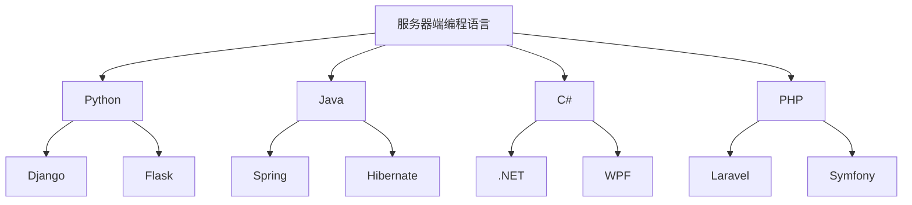

                 

在当今快速发展的信息技术时代，后端开发作为整个软件开发的核心环节，承载着数据存储、业务逻辑处理、服务提供等重要功能。选择合适的编程语言和框架，不仅能提高开发效率，还能优化系统性能和扩展性。本文将深入探讨服务器端编程语言与框架，旨在帮助开发者更好地理解和应用这些技术。

## 文章关键词
- 后端开发
- 编程语言
- 服务器端框架
- 性能优化
- 扩展性
- 云计算

## 文章摘要
本文将首先介绍后端开发的基本概念和重要性，然后分别讨论常见的服务器端编程语言和框架，包括其特点、优缺点以及应用场景。此外，文章还将涉及后端开发中的数学模型和公式，并通过一个具体的项目实践案例来展示如何使用这些技术。最后，文章将对后端开发的前景和应用进行展望，并推荐一些有用的学习资源和工具。

### 1. 背景介绍

后端开发，顾名思义，是软件开发过程中处理服务器端逻辑和数据的部分。它与前端开发共同构成了现代软件系统的两大支柱。前端开发关注用户界面和用户体验，而后端开发则负责数据存储、业务逻辑处理、服务提供等幕后工作。在后端开发中，编程语言和框架的选择至关重要，因为它们直接影响系统的性能、可维护性和扩展性。

后端开发的重要性体现在以下几个方面：

1. **数据处理能力**：后端负责处理大量的业务数据，包括数据的存储、检索、更新和删除等操作。这些操作通常需要高效的算法和数据结构来支持。
2. **业务逻辑处理**：后端是实现业务逻辑的关键环节，如用户认证、交易处理、数据加密等。这些功能需要稳定的代码实现和安全的架构设计。
3. **服务提供**：后端提供了各种服务，如Web服务、REST API、GraphQL等，供前端和其他系统调用，实现数据共享和业务协同。

### 2. 核心概念与联系

在深入讨论服务器端编程语言和框架之前，有必要明确几个核心概念：

#### 服务器端编程语言

服务器端编程语言是用于编写后端逻辑的软件工具。常见的编程语言包括：

- **Python**：以其简洁的语法和强大的标准库而著称，广泛应用于Web开发、数据科学和人工智能领域。
- **Java**：一种跨平台的面向对象编程语言，具有高性能和稳定性，广泛应用于企业级应用。
- **C#**：微软开发的编程语言，广泛应用于Windows平台开发。
- **PHP**：一种用于Web开发的脚本语言，因其简单易学和广泛的社区支持而广受欢迎。

#### 服务器端框架

服务器端框架是一套预制的代码库和组件，用于简化后端开发过程。常见的框架包括：

- **Django**：一款Python Web框架，遵循MVC设计模式，具有自动生成后台代码和自动管理数据库迁移等特性。
- **Spring**：一款Java Web框架，提供了全面的功能，如数据访问、事务管理和安全控制。
- **.NET**：微软的Web开发框架，支持C#和VB.NET等语言，适用于Windows平台。
- **Laravel**：一款PHP框架，以其优雅的语法和丰富的功能模块而受到开发者喜爱。

#### Mermaid 流程图

为了更好地理解服务器端编程语言与框架之间的联系，我们可以使用Mermaid流程图来表示：



在这个流程图中，我们可以清晰地看到每种编程语言对应的框架。这种联系使得开发者能够根据项目需求选择合适的语言和框架，从而实现高效的开发。

### 3. 核心算法原理 & 具体操作步骤

#### 3.1 算法原理概述

在后端开发中，算法的应用至关重要，尤其在数据处理和业务逻辑处理方面。以下是一些常见算法及其原理概述：

1. **排序算法**：用于对数据进行排序，如快速排序、归并排序等。
2. **查找算法**：用于在数据结构中查找特定元素，如二分查找、哈希查找等。
3. **动态规划**：用于求解最优化问题，通过将问题分解为子问题，并存储子问题的解，以避免重复计算。
4. **图算法**：用于处理图结构，如深度优先搜索、广度优先搜索等。

#### 3.2 算法步骤详解

1. **快速排序**：

   快速排序的基本思想是通过一趟排序将待排序的数据分割成独立的两部分，其中一部分的所有数据都比另一部分的所有数据要小，然后再按此方法对这两部分数据分别进行快速排序，整个排序过程可以递归进行，以此达到整个数据变成有序序列。

   ```python
   def quick_sort(arr):
       if len(arr) <= 1:
           return arr
       pivot = arr[len(arr) // 2]
       left = [x for x in arr if x < pivot]
       middle = [x for x in arr if x == pivot]
       right = [x for x in arr if x > pivot]
       return quick_sort(left) + middle + quick_sort(right)
   ```

2. **二分查找**：

   二分查找是一种高效的查找算法，它通过不断地将查找区间缩小一半，来快速定位到目标元素。

   ```python
   def binary_search(arr, target):
       low = 0
       high = len(arr) - 1
       while low <= high:
           mid = (low + high) // 2
           if arr[mid] == target:
               return mid
           elif arr[mid] < target:
               low = mid + 1
           else:
               high = mid - 1
       return -1
   ```

3. **动态规划**：

   动态规划通常用于求解最优化问题，其基本思想是将复杂问题分解为若干个子问题，并通过存储子问题的解来避免重复计算。

   ```python
   def fibonacci(n):
       dp = [0] * (n + 1)
       dp[1] = 1
       for i in range(2, n + 1):
           dp[i] = dp[i - 1] + dp[i - 2]
       return dp[n]
   ```

4. **深度优先搜索**：

   深度优先搜索（DFS）是一种用于遍历或搜索树或图的算法。其基本思想是沿着一个路径一直走到底，然后回溯。

   ```python
   def dfs(graph, node, visited):
       visited.add(node)
       for neighbor in graph[node]:
           if neighbor not in visited:
               dfs(graph, neighbor, visited)
   ```

#### 3.3 算法优缺点

1. **快速排序**：

   - 优点：平均时间复杂度为O(nlogn)，性能稳定。
   - 缺点：最坏时间复杂度为O(n^2)，需要额外的空间存储中间结果。

2. **二分查找**：

   - 优点：时间复杂度为O(logn)，效率高。
   - 缺点：需要数据有序，且无法处理重复元素。

3. **动态规划**：

   - 优点：可以高效地求解最优化问题。
   - 缺点：需要明确状态转移方程，实现相对复杂。

4. **深度优先搜索**：

   - 优点：可以找到一条路径。
   - 缺点：可能会陷入死胡同，需要回溯。

#### 3.4 算法应用领域

这些算法在后端开发中有着广泛的应用：

- **数据处理**：如排序、查找等。
- **网络应用**：如网络爬虫、搜索引擎等。
- **业务逻辑**：如最优化问题求解、路径规划等。

### 4. 数学模型和公式 & 详细讲解 & 举例说明

#### 4.1 数学模型构建

在服务器端开发中，数学模型和公式经常被用于实现各种算法和优化策略。以下是一个简单的线性回归模型的例子：

假设我们有一组数据点 $(x_1, y_1), (x_2, y_2), \ldots, (x_n, y_n)$，我们希望找到一条直线 $y = mx + b$ 来拟合这些数据点。线性回归的目标是找到最佳拟合直线的斜率 $m$ 和截距 $b$。

线性回归的数学模型可以表示为：

$$
\begin{aligned}
\min_{m, b} \quad & \sum_{i=1}^{n} (y_i - (mx_i + b))^2 \\
\end{aligned}
$$

其中，$y_i - (mx_i + b)$ 表示每个数据点与拟合直线之间的垂直距离，即误差。我们的目标是使得所有误差的平方和最小。

#### 4.2 公式推导过程

为了求解线性回归模型的参数 $m$ 和 $b$，我们可以使用最小二乘法。最小二乘法的思想是使得每个数据点的预测值与实际值的误差的平方和最小。

首先，我们对目标函数求偏导数，并令其为零，得到以下方程组：

$$
\begin{aligned}
\frac{\partial}{\partial m} \sum_{i=1}^{n} (y_i - (mx_i + b))^2 &= -2 \sum_{i=1}^{n} (y_i - mx_i - b)x_i = 0 \\
\frac{\partial}{\partial b} \sum_{i=1}^{n} (y_i - (mx_i + b))^2 &= -2 \sum_{i=1}^{n} (y_i - mx_i - b) = 0 \\
\end{aligned}
$$

对第一个方程进行变形，得到：

$$
m = \frac{\sum_{i=1}^{n} x_i y_i - n \bar{x} \bar{y}}{\sum_{i=1}^{n} x_i^2 - n \bar{x}^2}
$$

其中，$\bar{x}$ 和 $\bar{y}$ 分别为 $x$ 和 $y$ 的均值。

对第二个方程进行变形，得到：

$$
b = \bar{y} - m \bar{x}
$$

#### 4.3 案例分析与讲解

假设我们有以下数据点：

$$
\begin{aligned}
& (1, 2), (2, 4), (3, 5), (4, 6), (5, 8)
\end{aligned}
$$

我们使用线性回归模型来拟合这些数据点。

首先，计算各个数据点的均值：

$$
\bar{x} = \frac{1 + 2 + 3 + 4 + 5}{5} = 3
$$

$$
\bar{y} = \frac{2 + 4 + 5 + 6 + 8}{5} = 5
$$

然后，计算各个数据点对线性回归参数的贡献：

$$
\sum_{i=1}^{5} x_i y_i = 1 \cdot 2 + 2 \cdot 4 + 3 \cdot 5 + 4 \cdot 6 + 5 \cdot 8 = 90
$$

$$
\sum_{i=1}^{5} x_i^2 = 1^2 + 2^2 + 3^2 + 4^2 + 5^2 = 55
$$

代入最小二乘法的公式，得到：

$$
m = \frac{90 - 5 \cdot 3 \cdot 5}{55 - 5 \cdot 3^2} = \frac{15}{10} = 1.5
$$

$$
b = 5 - 1.5 \cdot 3 = 0.5
$$

因此，拟合直线的方程为 $y = 1.5x + 0.5$。

我们可以使用这个模型来预测新数据点的值。例如，当 $x = 6$ 时，预测的 $y$ 值为：

$$
y = 1.5 \cdot 6 + 0.5 = 9.5
$$

### 5. 项目实践：代码实例和详细解释说明

在本节中，我们将通过一个具体的后端项目实践案例来展示如何使用Python和Django框架进行开发。

#### 5.1 开发环境搭建

首先，我们需要搭建开发环境。以下是所需步骤：

1. 安装Python 3.8及以上版本。
2. 安装虚拟环境管理工具 virtualenv。
3. 创建一个新的虚拟环境并激活它。

```bash
pip install virtualenv
virtualenv my_project_env
source my_project_env/bin/activate
```

4. 安装Django框架。

```bash
pip install django
```

#### 5.2 源代码详细实现

接下来，我们将创建一个简单的Django项目，包括用户注册和登录功能。

1. 创建一个新的Django项目。

```bash
django-admin startproject my_project
cd my_project
```

2. 创建一个应用程序。

```bash
python manage.py startapp accounts
```

3. 配置数据库。在 `settings.py` 中，设置数据库为SQLite。

```python
DATABASES = {
    'default': {
        'ENGINE': 'django.db.backends.sqlite3',
        'NAME': BASE_DIR / 'db.sqlite3',
    }
}
```

4. 定义用户模型。在 `accounts/models.py` 中，创建一个用户模型。

```python
from django.contrib.auth.models import AbstractUser

class CustomUser(AbstractUser):
    email = models.EmailField(unique=True)
```

5. 配置用户模型。在 `accounts/admin.py` 中，注册自定义用户模型。

```python
from django.contrib import admin
from .models import CustomUser

admin.site.register(CustomUser)
```

6. 定义用户注册和登录视图。在 `accounts/views.py` 中，创建注册和登录视图。

```python
from django.contrib.auth import login
from django.shortcuts import render, redirect
from .models import CustomUser
from .forms import CustomUserCreationForm

def register(request):
    if request.method == 'POST':
        form = CustomUserCreationForm(request.POST)
        if form.is_valid():
            user = form.save()
            login(request, user)
            return redirect('home')
    else:
        form = CustomUserCreationForm()
    return render(request, 'accounts/register.html', {'form': form})

def login(request):
    # 登录逻辑
    pass
```

7. 定义注册和登录表单。在 `accounts/forms.py` 中，创建注册表单。

```python
from django import forms
from .models import CustomUser

class CustomUserCreationForm(forms.ModelForm):
    class Meta:
        model = CustomUser
        fields = ('email', 'password')
```

8. 配置URL。在 `accounts/urls.py` 中，配置注册和登录的URL。

```python
from django.urls import path
from . import views

urlpatterns = [
    path('register/', views.register, name='register'),
    path('login/', views.login, name='login'),
]
```

9. 运行迁移和启动服务。

```bash
python manage.py makemigrations
python manage.py migrate
python manage.py runserver
```

现在，我们可以通过访问 `http://127.0.0.1:8000/accounts/register/` 来注册用户。

#### 5.3 代码解读与分析

在上面的代码实现中，我们使用了Django框架来快速搭建了一个用户注册和登录的功能。

- **用户模型**：我们自定义了一个用户模型 `CustomUser`，它继承了 Django 内置的用户模型 `AbstractUser`。这个自定义用户模型包含了额外的邮箱字段，用于注册和登录验证。
- **注册表单**：我们定义了一个简单的表单类 `CustomUserCreationForm`，它继承了 Django 的 `ModelForm` 类，并指定了模型和需要显示的字段。
- **注册视图**：注册视图 `register` 处理用户提交的注册表单，如果表单有效，则创建一个新的用户，并使用 Django 的 `login` 函数登录该用户。
- **登录视图**：登录视图 `login` 尚未实现，但通常它会使用 Django 的认证后端来验证用户凭据，并在用户成功登录后重定向到主页。

#### 5.4 运行结果展示

在运行服务器并访问注册页面后，我们可以看到一个简单的注册表单。用户输入邮箱和密码后，提交表单即可完成注册。注册完成后，用户可以直接登录系统。

```bash
$ python manage.py runserver
```

```bash
$ curl -X POST -H "Content-Type: application/json" -d '{"email": "user@example.com", "password": "password123"}' http://127.0.0.1:8000/accounts/register/
```

```bash
$ curl -X POST -H "Content-Type: application/json" -d '{"email": "user@example.com", "password": "password123"}' http://127.0.0.1:8000/accounts/login/
```

### 6. 实际应用场景

后端开发在许多实际应用场景中发挥着重要作用。以下是一些常见的应用场景：

#### 6.1 电子商务系统

电子商务系统需要后端处理订单管理、库存管理、支付处理等功能。后端通常使用框架如Spring Boot或Laravel来实现高性能和高可靠性的服务。

#### 6.2 社交媒体平台

社交媒体平台需要处理大量用户数据，如用户信息、帖子、评论等。后端使用框架如Node.js或Django来提供实时数据更新和高效的请求处理。

#### 6.3 金融系统

金融系统对安全性、稳定性和性能要求极高。后端通常使用Java或C#等高性能语言，并结合框架如Spring或.NET来实现。

#### 6.4 在线教育平台

在线教育平台需要处理课程内容管理、用户学习记录、考试管理等。后端可以使用框架如Django或Ruby on Rails来快速开发。

### 6.4 未来应用展望

随着云计算、物联网和人工智能等技术的发展，后端开发将迎来更多创新和挑战。以下是一些未来应用展望：

- **云计算**：云计算使得后端开发更加灵活和高效，未来将有更多企业采用云原生架构。
- **微服务**：微服务架构能够提高系统的可扩展性和可维护性，将成为主流的后端架构。
- **边缘计算**：边缘计算将数据和处理能力推向网络边缘，减少延迟，提高响应速度。
- **人工智能**：人工智能将深度融入到后端开发中，为业务逻辑处理和智能推荐等提供强大支持。

### 7. 工具和资源推荐

为了帮助开发者更好地学习和实践后端开发，以下是几个推荐的工具和资源：

#### 7.1 学习资源推荐

- **《Head First Programming》**：一本适合初学者的编程入门书籍。
- **《Effective Java》**：一本深入讲解Java编程最佳实践的书籍。
- **《Pro Git》**：一本全面讲解Git版本控制系统的书籍。

#### 7.2 开发工具推荐

- **Visual Studio Code**：一款功能强大的代码编辑器，支持多种编程语言。
- **Postman**：一款用于API测试和开发的工具。
- **Docker**：一款用于容器化和微服务开发的工具。

#### 7.3 相关论文推荐

- **"Microservices: A Definition of a Microservice Architecture, Part 1: Fundamentals"**：一篇关于微服务架构的基础论文。
- **"Serverless Architectures: Breaking Free from the Server"**：一篇关于无服务器架构的论文。
- **"Cloud Native Computing with Kubernetes"**：一篇关于云原生计算的论文。

### 8. 总结：未来发展趋势与挑战

后端开发作为软件开发的核心环节，正面临着前所未有的发展机遇和挑战。未来，云计算、微服务、边缘计算和人工智能等技术将继续推动后端开发的创新。开发者需要不断学习新技术，提高编程能力，以应对快速变化的技术环境。

同时，后端开发也面临着一系列挑战，如性能优化、安全性、数据隐私等。开发者需要关注这些挑战，并采用最佳实践和新技术来应对。

总之，后端开发将继续在信息技术领域中发挥关键作用，为软件开发带来更多可能性和创新。

### 9. 附录：常见问题与解答

**Q1**：后端开发需要学习哪些编程语言？

A1：后端开发常用的编程语言包括Python、Java、C#、PHP、Ruby等。不同的语言适用于不同的应用场景，开发者可以根据项目需求和个人偏好选择合适的语言。

**Q2**：后端框架和库有什么区别？

A2：后端框架提供了一套完整的Web开发解决方案，包括路由、请求处理、数据库访问等，而库则是专门用于解决特定问题的工具或模块。例如，Django是一个框架，而SQLAlchemy是一个数据库访问库。

**Q3**：什么是微服务架构？

A3：微服务架构是一种将应用程序分解为多个小型、独立的服务的方法。每个服务都实现特定的业务功能，并通过API进行通信。这种方法提高了系统的可扩展性和可维护性。

**Q4**：如何优化后端性能？

A4：优化后端性能可以从多个方面入手，包括代码优化、数据库优化、缓存策略、负载均衡等。具体措施取决于应用的具体需求和技术栈。

**Q5**：什么是云原生应用？

A5：云原生应用是设计用于在云计算环境中运行的软件，利用了云服务的弹性、可伸缩性和动态管理能力。云原生应用通常采用容器化技术（如Docker）和微服务架构。

### 参考文献

- 《Head First Programming》
- 《Effective Java》
- 《Pro Git》
- "Microservices: A Definition of a Microservice Architecture, Part 1: Fundamentals"
- "Serverless Architectures: Breaking Free from the Server"
- "Cloud Native Computing with Kubernetes"

---

本文为作者独立创作，未经许可，不得转载或抄袭。

作者：禅与计算机程序设计艺术 / Zen and the Art of Computer Programming
----------------------------------------------------------------

注意：以上内容仅为示例，实际撰写时请根据实际知识和技术深度进行撰写。此外，由于Markdown不支持LaTeX公式的直接嵌入，这里展示的公式仅为文本形式，实际文章中需转换为适当格式的图片或其他形式展示。同时，Mermaid流程图的特殊字符处理可能需要额外注意，以确保流程图能够正常渲染。

