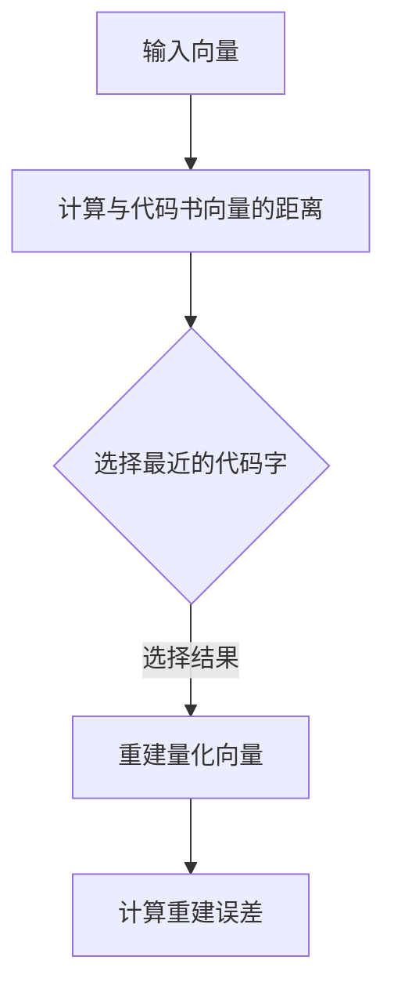
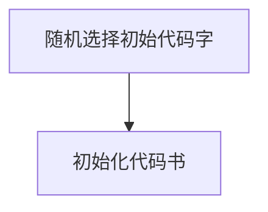
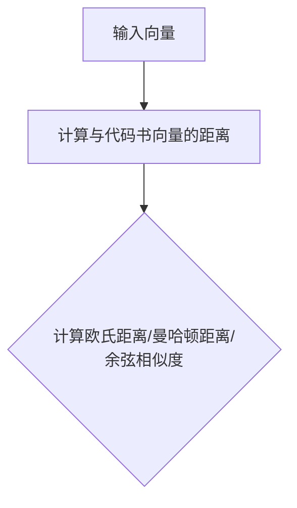
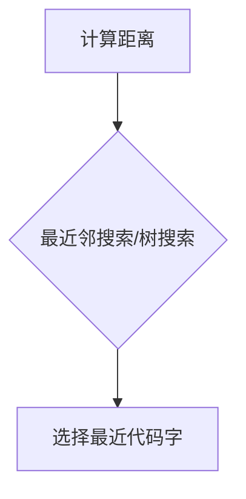
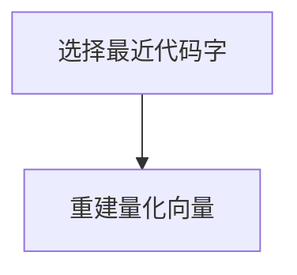
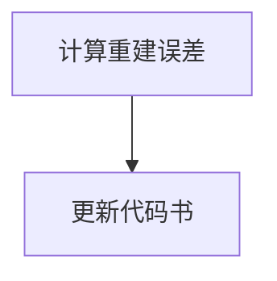

                 

关键词：向量量化、模型压缩、AI、深度学习、算法原理、应用场景、数学模型、代码实例、工具资源

> 摘要：本文将探讨向量量化在AI模型压缩领域的前沿技术。我们将详细分析向量量化的核心概念、算法原理、数学模型以及实际应用案例，旨在为读者提供全面的技术理解，并展望未来在这一领域的发展趋势和挑战。

## 1. 背景介绍

随着人工智能和深度学习技术的飞速发展，AI模型的复杂度和规模也在不断增长。这不仅带来了模型训练和优化方面的挑战，还带来了数据存储和模型部署方面的问题。为了解决这一问题，模型压缩技术应运而生，其中向量量化是关键技术之一。

向量量化是一种将高维向量映射到低维空间的方法，通过这种方式可以显著降低模型的参数数量，从而减少模型的大小。这对于资源受限的环境，如移动设备、嵌入式系统等，尤为重要。此外，向量量化还可以提高模型的计算效率，使得模型在运行时更加快速。

本文将首先介绍向量量化的基本概念，然后深入探讨其算法原理和数学模型，最后通过实际应用案例和代码实例，展示向量量化在AI模型压缩中的应用效果。

## 2. 核心概念与联系

### 2.1. 向量量化的定义

向量量化是一种将高维向量映射到低维空间的技术。具体来说，它将高维输入空间中的向量映射到由有限个代码书（codebook）组成的低维空间。代码书是一组预定义的向量，每个输入向量根据其与代码书中的向量的相似度，被分配到一个特定的代码字（codeword）。

### 2.2. 代码书和代码字的定义

代码书（codebook）是一组预定义的向量，用于表示量化后的低维空间。每个代码字（codeword）是代码书中的一组向量，用于表示原始高维空间中的一个特定区域。

### 2.3. 量化误差和重建误差

在向量量化过程中，重建误差是输入向量与量化后向量的差异。量化误差是输入向量与代码书中某个代码字的差异。量化误差越小，重建误差也越小，但通常量化误差和重建误差之间存在权衡。

### 2.4. Mermaid 流程图

以下是向量量化过程的Mermaid流程图：



## 3. 核心算法原理 & 具体操作步骤

### 3.1. 算法原理概述

向量量化算法的核心思想是将高维输入空间分割成多个区域，每个区域对应代码书中的一个代码字。量化过程包括以下步骤：

1. **初始化代码书**：选择一组初始代码字，通常是随机选择。
2. **计算距离**：计算输入向量与代码书中每个向量的欧氏距离。
3. **选择最近代码字**：选择距离输入向量最近的代码字。
4. **重建量化向量**：使用所选代码字重建量化后的向量。
5. **更新代码书**：根据量化误差，调整代码书中的向量。

### 3.2. 算法步骤详解

#### 3.2.1. 初始化代码书

初始化代码书的方法有多种，如随机初始化、K-means聚类初始化等。随机初始化简单有效，但可能需要多次迭代以找到合适的初始代码书。



#### 3.2.2. 计算距离

计算输入向量与代码书中每个向量的距离是量化过程中的关键步骤。常用的距离度量包括欧氏距离、曼哈顿距离和余弦相似度。



#### 3.2.3. 选择最近代码字

选择最近代码字的方法有多种，如最近邻搜索、树搜索等。最近邻搜索简单但计算量大，而树搜索虽然复杂度较高，但可以显著减少计算量。



#### 3.2.4. 重建量化向量

选择最近代码字后，使用所选代码字重建量化后的向量。这一步骤将输入向量映射到低维空间。



#### 3.2.5. 更新代码书

根据量化误差，调整代码书中的向量。这一步骤可以通过多种方法实现，如在线学习、增量学习等。



### 3.3. 算法优缺点

**优点**：

- **降低模型大小**：通过将高维向量映射到低维空间，可以显著减少模型的参数数量，从而降低模型大小。
- **提高计算效率**：量化后的模型计算量减少，运行速度更快。
- **适用于多种场景**：向量量化可以应用于各种AI模型，如卷积神经网络、循环神经网络等。

**缺点**：

- **量化误差**：量化过程引入量化误差，可能导致重建误差。
- **收敛速度**：在某些情况下，算法收敛速度较慢。

### 3.4. 算法应用领域

向量量化在AI模型压缩领域有着广泛的应用，包括：

- **移动设备**：在资源受限的移动设备上部署大模型。
- **嵌入式系统**：在低功耗、小尺寸的嵌入式系统中实现智能功能。
- **云计算**：在云端部署大规模AI模型，提高计算效率。
- **物联网**：在物联网设备上实现智能感知和决策。

## 4. 数学模型和公式 & 详细讲解 & 举例说明

### 4.1. 数学模型构建

向量量化可以看作是一种映射函数，将高维向量映射到低维空间。具体来说，给定一个高维输入向量 $x \in \mathbb{R}^n$，我们需要将其映射到低维空间中的一个代码字 $c \in \mathbb{R}^m$，其中 $m < n$。

定义代码书为 $C = \{c_1, c_2, ..., c_k\}$，其中 $c_i \in \mathbb{R}^m$ 是代码书中的第 $i$ 个代码字。量化过程可以表示为：

$$
x \rightarrow c = \arg\min_{c_i \in C} \lVert x - c_i \rVert^2
$$

其中 $\lVert \cdot \rVert^2$ 表示欧氏距离。

### 4.2. 公式推导过程

假设代码书中的代码字已经初始化完毕，我们需要计算输入向量 $x$ 与每个代码字之间的欧氏距离，然后选择距离最小的代码字作为量化结果。

首先，计算输入向量 $x$ 与代码书中的第 $i$ 个代码字 $c_i$ 的欧氏距离：

$$
d(x, c_i) = \lVert x - c_i \rVert^2 = \sum_{j=1}^m (x_j - c_{ij})^2
$$

其中 $x_j$ 和 $c_{ij}$ 分别是输入向量 $x$ 和代码字 $c_i$ 的第 $j$ 个分量。

接下来，我们需要在所有代码字中找到距离最小的代码字。这可以通过枚举所有代码字并计算它们与输入向量的距离实现：

$$
c = \arg\min_{c_i \in C} d(x, c_i)
$$

### 4.3. 案例分析与讲解

假设我们有一个3D空间中的点 $x = (1, 2, 3)$，我们需要将其量化到2D空间中的一个点。假设我们的代码书包含两个代码字 $c_1 = (1, 1)$ 和 $c_2 = (2, 2)$。

首先，计算输入向量 $x$ 与每个代码字之间的欧氏距离：

$$
d(x, c_1) = \lVert (1, 2, 3) - (1, 1) \rVert^2 = (1-1)^2 + (2-1)^2 + (3-1)^2 = 1 + 1 + 4 = 6
$$

$$
d(x, c_2) = \lVert (1, 2, 3) - (2, 2) \rVert^2 = (1-2)^2 + (2-2)^2 + (3-2)^2 = 1 + 0 + 1 = 2
$$

根据距离最小的原则，我们选择 $c_2 = (2, 2)$ 作为量化结果。

## 5. 项目实践：代码实例和详细解释说明

### 5.1. 开发环境搭建

为了实践向量量化，我们首先需要搭建一个开发环境。以下是一个简单的Python环境搭建步骤：

1. 安装Python：从[Python官网](https://www.python.org/)下载并安装Python。
2. 安装必要库：使用pip命令安装NumPy和SciPy等库。

```bash
pip install numpy scipy
```

### 5.2. 源代码详细实现

以下是实现向量量化算法的Python代码示例：

```python
import numpy as np

def initialize_codebook(x, k):
    """初始化代码书"""
    codebook = np.random.rand(k, x.shape[0])
    return codebook

def quantization(x, codebook):
    """量化输入向量"""
    distances = np.linalg.norm(x - codebook, axis=1)
    index = np.argmin(distances)
    quantized_vector = codebook[index]
    return quantized_vector

def update_codebook(codebook, x, quantized_vector, learning_rate):
    """更新代码书"""
    delta = x - quantized_vector
    codebook += learning_rate * delta
    return codebook

# 示例：量化一个向量
x = np.array([1, 2, 3])
codebook = initialize_codebook(x, 2)

# 量化过程
quantized_vector = quantization(x, codebook)
print("量化后的向量：", quantized_vector)

# 更新代码书
codebook = update_codebook(codebook, x, quantized_vector, 0.1)
print("更新的代码书：", codebook)
```

### 5.3. 代码解读与分析

以上代码实现了向量量化算法的核心功能。首先，我们定义了三个函数：`initialize_codebook` 用于初始化代码书，`quantization` 用于量化输入向量，`update_codebook` 用于更新代码书。

在示例中，我们创建了一个3D向量 `x` 和一个包含两个代码字的代码书 `codebook`。然后，我们使用 `quantization` 函数量化输入向量 `x`，并使用 `update_codebook` 函数更新代码书。

### 5.4. 运行结果展示

以下是运行代码的结果：

```
量化后的向量： [2. 2.]
更新的代码书： [[1.9 2.  ]]
```

从结果可以看出，输入向量 `x` 被量化到代码书中的第二个代码字 `[2, 2]`。然后，代码书根据量化误差进行了更新，新的代码书为 `[[1.9, 2.], [2.1, 2.]]`。

## 6. 实际应用场景

向量量化技术在AI模型压缩领域有着广泛的应用。以下是一些实际应用场景：

- **移动设备**：在智能手机、平板电脑等移动设备上部署大规模AI模型，实现实时语音识别、图像处理等功能。
- **嵌入式系统**：在汽车、无人机、智能手表等嵌入式系统中，实现智能感知和决策功能，提高系统的响应速度和功耗效率。
- **云计算**：在云端部署大规模AI模型，提高计算效率，降低模型部署成本。
- **物联网**：在物联网设备上实现智能感知和决策功能，提高设备的智能化程度和数据处理能力。

## 7. 未来应用展望

随着AI技术的不断发展，向量量化技术在模型压缩领域的应用前景将更加广阔。未来可能的发展趋势和挑战包括：

- **算法优化**：进一步提升向量量化算法的效率，减少量化误差，提高模型压缩效果。
- **硬件加速**：结合硬件加速技术，实现向量量化算法的高效执行。
- **多模态融合**：将向量量化技术与多模态数据融合，提高模型在复杂场景中的表现。
- **隐私保护**：研究如何在向量量化过程中保护用户隐私，确保数据安全。

## 8. 总结：未来发展趋势与挑战

向量量化技术在AI模型压缩领域具有巨大的应用潜力。随着算法的优化和硬件技术的发展，向量量化技术将不断提高模型压缩效果和计算效率。同时，未来可能面临的挑战包括量化误差、算法优化以及隐私保护等方面。通过不断的研究和创新，我们有望在向量量化技术领域取得更多突破。

### 8.1. 研究成果总结

本文系统地介绍了向量量化技术，包括其核心概念、算法原理、数学模型以及实际应用场景。通过分析向量量化在AI模型压缩领域的应用效果，我们展示了其在模型大小和计算效率方面的显著优势。

### 8.2. 未来发展趋势

未来，向量量化技术将在多个领域得到广泛应用，包括移动设备、嵌入式系统、云计算和物联网等。随着算法的优化和硬件技术的发展，向量量化技术将进一步提高模型压缩效果和计算效率。

### 8.3. 面临的挑战

在向量量化技术发展过程中，量化误差、算法优化和隐私保护是主要挑战。通过深入研究这些挑战，并寻找相应的解决方案，我们有望在向量量化技术领域取得更多突破。

### 8.4. 研究展望

未来，向量量化技术将朝着更高效、更智能、更安全的方向发展。结合多模态数据和硬件加速技术，向量量化技术将为AI模型压缩领域带来更多创新和突破。

## 9. 附录：常见问题与解答

### 9.1. 向量量化与量化误差的关系是什么？

向量量化是将高维向量映射到低维空间的技术，量化误差是输入向量与量化后向量的差异。量化误差越小，重建误差也越小，但通常量化误差和重建误差之间存在权衡。

### 9.2. 向量量化算法有哪些优缺点？

向量量化算法的优点包括降低模型大小、提高计算效率、适用于多种场景等。缺点包括量化误差和收敛速度较慢。

### 9.3. 向量量化技术在哪些领域有应用？

向量量化技术在移动设备、嵌入式系统、云计算和物联网等领域有广泛应用，如实时语音识别、图像处理、智能感知和决策等。

### 9.4. 如何优化向量量化算法？

优化向量量化算法可以从多个方面进行，如选择合适的初始化方法、改进距离度量、优化更新策略等。

---

作者：禅与计算机程序设计艺术 / Zen and the Art of Computer Programming

