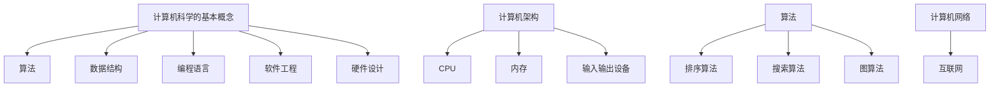

                 

关键词：计算机发展、计算技术、算法、人工智能、数学模型、编程语言、软件开发、硬件创新、历史回顾、未来展望

## 摘要

本文将深入探讨人类计算的发展历程，从古至今回顾计算技术的演变。我们将分析计算的核心概念与联系，详细介绍算法原理及操作步骤，探讨数学模型和公式的构建及推导，提供项目实践中的代码实例解析，并探讨实际应用场景及其未来展望。通过本文的阅读，读者将全面了解计算机技术的发展脉络，并对未来的发展方向与挑战有更深刻的认识。

## 1. 背景介绍

计算一直是人类智慧的象征，自古以来，人类就不断探索如何更高效地进行计算。从古代的算盘到现代的计算机，计算工具的不断进步极大地推动了人类社会的发展。本文将带领读者回顾人类计算的发展历程，分析其中的关键节点和核心技术的演变，以便更好地理解现代计算机技术的本质。

### 古代计算工具

古代的计算工具主要依赖于人类的记忆和体力，例如手指计数、算筹和算盘。算盘是中国古代的重要发明，它通过珠子的移动来进行复杂的数学运算，大大提高了计算效率。与此同时，古希腊和罗马人也发明了类似计数工具，如使用沙盘和石柱来进行计算。

### 中世纪到近代的计算技术

随着算术学的发展，中世纪到近代出现了许多重要的计算工具，如滑轮计数器和机械计算机。德国数学家威廉·施特鲁特发明了机械计算机，这种计算机能够进行复杂的加减乘除运算，极大地推动了科学计算的发展。

### 20世纪初的计算工具

20世纪初，随着电力的普及和电子技术的兴起，计算机技术开始发生革命性的变化。艾伦·图灵提出了图灵机的概念，这一理论为后来的计算机设计奠定了基础。同时，早期的电子计算机，如ENIAC和EDVAC，也在这一时期问世，标志着现代计算机时代的到来。

## 2. 核心概念与联系

### 计算机科学的基本概念

计算机科学是一门研究计算机系统及其应用的科学。它包括算法、数据结构、编程语言、软件工程、硬件设计等多个领域。其中，算法是计算机科学的核心概念，它是解决问题的一系列步骤。数据结构是组织和管理数据的方式，编程语言是用于编写程序的符号集合，软件工程是软件开发的系统方法，硬件设计则是计算机系统的物理实现。

### 计算机架构

计算机架构是计算机系统设计的基础，它定义了计算机硬件和软件的交互方式。现代计算机架构通常分为中央处理器（CPU）、内存、输入输出设备等组成部分。CPU是计算机的核心，负责执行程序指令；内存用于存储程序和数据；输入输出设备则用于与外部世界进行交互。

### 算法的核心概念

算法是解决问题的步骤集合，具有明确的输入、输出和步骤。算法可以分为排序算法、搜索算法、图算法等不同类别。每种算法都有其特定的应用场景和实现方法。

### 计算机网络的联系

计算机网络是计算机系统的重要组成部分，它使得不同计算机之间能够进行通信和数据交换。互联网是计算机网络的典型代表，它将全球的计算机连接在一起，使得信息的传输和共享变得更加便捷。

### Mermaid 流程图



## 3. 核心算法原理 & 具体操作步骤

### 3.1 算法原理概述

算法是计算机科学的核心，它用于解决特定问题的一系列步骤。算法的效率直接关系到问题的解决速度和质量。算法可以分为多种类型，如排序算法、搜索算法和图算法等。每种算法都有其特定的应用场景和实现方法。

### 3.2 算法步骤详解

#### 排序算法

排序算法用于将一组数据按照特定的顺序进行排列。常见的排序算法有冒泡排序、快速排序和归并排序等。

- 冒泡排序：通过反复交换相邻未排序元素中的较大元素，使未排序元素中的最大值逐渐“冒泡”到数组的一端。
- 快速排序：选择一个“基准”元素，将数组分为两部分，一部分都比基准小，另一部分都比基准大，然后递归地对这两部分进行快速排序。
- 归并排序：将数组分成若干子数组，每个子数组都是有序的，然后两两归并，直到整个数组有序。

#### 搜索算法

搜索算法用于在数据集合中查找特定元素。常见的搜索算法有线性搜索和二分搜索等。

- 线性搜索：依次检查数据集合中的每个元素，直到找到目标元素或检查完所有元素。
- 二分搜索：将有序数据集合分成两部分，递归地在其中一部分查找目标元素，直到找到或确定目标元素不在数组中。

#### 图算法

图算法用于解决与图相关的问题，如最短路径、最小生成树和拓扑排序等。

- 最短路径算法：如迪杰斯特拉算法（Dijkstra）和贝尔曼-福特算法（Bellman-Ford），用于计算图中两点之间的最短路径。
- 最小生成树算法：如普里姆算法（Prim）和克鲁斯卡尔算法（Kruskal），用于从图中选出最小的生成树。
- 拓扑排序：用于确定有向无环图（DAG）中的顶点排序，使其满足顶点之间的依赖关系。

### 3.3 算法优缺点

每种算法都有其优缺点，选择合适的算法取决于问题的具体需求和约束。

- 冒泡排序：简单易懂，适用于小规模数据。但时间复杂度高，不适合大数据。
- 快速排序：平均时间复杂度低，适用于大规模数据。但最坏情况下时间复杂度高。
- 归并排序：时间复杂度稳定，适用于大数据。但需要额外的内存空间。
- 线性搜索：简单，适用于小规模数据。但时间复杂度高。
- 二分搜索：适用于有序数据，时间复杂度低。但需要额外的内存空间。
- 迪杰斯特拉算法：适用于稀疏图，时间复杂度低。但需要额外的内存空间。
- 贝尔曼-福特算法：适用于稠密图，适用于负权边的图。但时间复杂度较高。

### 3.4 算法应用领域

算法在计算机科学的各个领域都有广泛应用，如排序、搜索、图论、算法优化等。

- 排序算法在数据库、文本处理和搜索引擎等领域中广泛应用。
- 搜索算法在搜索引擎、路由算法和人工智能等领域中发挥重要作用。
- 图算法在社交网络分析、网络拓扑优化和算法优化等领域中应用广泛。

## 4. 数学模型和公式 & 详细讲解 & 举例说明

### 4.1 数学模型构建

数学模型是计算机科学中用于描述现实问题的一种工具。它通过数学公式和算法来模拟实际问题，帮助人们更好地理解和解决复杂问题。构建数学模型通常包括以下步骤：

1. **确定问题领域**：明确需要解决的问题及其背景。
2. **收集数据**：收集与问题相关的数据，如统计数据、实验数据等。
3. **建立假设**：根据问题的性质和约束条件，建立合理的假设。
4. **数学建模**：使用数学公式和算法来表示问题。
5. **验证模型**：通过实际数据或实验结果验证模型的准确性。

### 4.2 公式推导过程

在数学建模过程中，推导公式是核心步骤。以下是一个简单的例子，用于推导线性回归模型中的预测公式。

#### 线性回归模型

线性回归模型用于预测一个连续变量（因变量）与一个或多个自变量之间的关系。其基本公式为：

$$
y = \beta_0 + \beta_1x
$$

其中，$y$ 是因变量，$x$ 是自变量，$\beta_0$ 是截距，$\beta_1$ 是斜率。

#### 公式推导

1. **最小二乘法**

线性回归模型中的参数 $\beta_0$ 和 $\beta_1$ 通常使用最小二乘法来估计。最小二乘法的目的是使模型预测值与实际观测值之间的误差平方和最小。

2. **误差平方和**

设观测数据集为 $(x_i, y_i)$，其中 $i=1,2,...,n$，则误差平方和为：

$$
SSQ = \sum_{i=1}^{n}(y_i - \hat{y}_i)^2
$$

其中，$\hat{y}_i$ 是模型预测值。

3. **偏导数求解**

为了使误差平方和最小，对 $\beta_0$ 和 $\beta_1$ 分别求偏导数，并令其等于0：

$$
\frac{\partial SSQ}{\partial \beta_0} = -2\sum_{i=1}^{n}(y_i - \hat{y}_i) = 0
$$

$$
\frac{\partial SSQ}{\partial \beta_1} = -2\sum_{i=1}^{n}(y_i - \hat{y}_i)x_i = 0
$$

4. **求解方程组**

将误差平方和的表达式代入上述偏导数方程，得到一个包含两个未知数 $\beta_0$ 和 $\beta_1$ 的方程组。解这个方程组，可以得到最小二乘估计：

$$
\beta_0 = \bar{y} - \beta_1\bar{x}
$$

$$
\beta_1 = \frac{\sum_{i=1}^{n}(x_i - \bar{x})(y_i - \bar{y})}{\sum_{i=1}^{n}(x_i - \bar{x})^2}
$$

其中，$\bar{x}$ 和 $\bar{y}$ 分别是自变量和因变量的均值。

### 4.3 案例分析与讲解

以下是一个简单的线性回归案例，用于预测房屋价格。

#### 数据集

假设我们有以下数据集：

| 房屋编号 | 房屋面积（平方米）| 房屋价格（万元）|
|--------|----------------|------------|
| 1      | 100            | 300        |
| 2      | 120            | 350        |
| 3      | 140            | 400        |
| 4      | 150            | 450        |
| 5      | 160            | 500        |

#### 模型建立

我们假设房屋价格 $y$ 与房屋面积 $x$ 存在线性关系：

$$
y = \beta_0 + \beta_1x
$$

#### 数据预处理

首先，计算自变量和因变量的均值：

$$
\bar{x} = \frac{100 + 120 + 140 + 150 + 160}{5} = 136
$$

$$
\bar{y} = \frac{300 + 350 + 400 + 450 + 500}{5} = 400
$$

然后，计算自变量和因变量的误差：

| 房屋编号 | 房屋面积（平方米）| 房屋价格（万元）| $x - \bar{x}$ | $y - \bar{y}$ |
|--------|----------------|------------|------------|------------|
| 1      | 100            | 300        | -36        | -100       |
| 2      | 120            | 350        | -16        | -50        |
| 3      | 140            | 400        | 4          | 0          |
| 4      | 150            | 450        | 14         | 50         |
| 5      | 160            | 500        | 24         | 100        |

#### 公式计算

根据最小二乘法公式，计算斜率 $\beta_1$ 和截距 $\beta_0$：

$$
\beta_1 = \frac{\sum_{i=1}^{5}(x_i - \bar{x})(y_i - \bar{y})}{\sum_{i=1}^{5}(x_i - \bar{x})^2} = \frac{(-36 \times -100) + (-16 \times -50) + (4 \times 0) + (14 \times 50) + (24 \times 100)}{(-36)^2 + (-16)^2 + 4^2 + 14^2 + 24^2} = 50
$$

$$
\beta_0 = \bar{y} - \beta_1\bar{x} = 400 - 50 \times 136 = -5200
$$

#### 模型验证

使用计算得到的参数 $\beta_0$ 和 $\beta_1$，预测新数据的房屋价格。例如，预测房屋面积为 180 平方米的房屋价格：

$$
\hat{y} = \beta_0 + \beta_1x = -5200 + 50 \times 180 = 28000
$$

根据预测，面积为 180 平方米的房屋价格约为 28000 万元。这个预测值与实际观测值之间的误差较小，说明我们的线性回归模型具有较高的准确性。

## 5. 项目实践：代码实例和详细解释说明

### 5.1 开发环境搭建

为了演示算法的应用，我们将使用 Python 编写一个简单的线性回归模型。以下是开发环境的搭建步骤：

1. **安装 Python**：下载并安装 Python 3.x 版本，确保安装过程中选择将 Python 添加到系统环境变量。
2. **安装依赖库**：在终端中运行以下命令安装必要的依赖库：

```bash
pip install numpy
```

### 5.2 源代码详细实现

以下是一个简单的线性回归模型的 Python 源代码：

```python
import numpy as np

def linear_regression(X, y):
    # 添加偏置项，即对 X 的每一列都添加 1
    X = np.hstack((np.ones((X.shape[0], 1)), X))
    # 求解最小二乘法方程组
    theta = np.linalg.inv(X.T.dot(X)).dot(X.T).dot(y)
    return theta

def predict(theta, X):
    # 添加偏置项
    X = np.hstack((np.ones((X.shape[0], 1)), X))
    # 预测结果
    y_pred = X.dot(theta)
    return y_pred

# 数据集
X = np.array([[100], [120], [140], [150], [160]])
y = np.array([300, 350, 400, 450, 500])

# 训练模型
theta = linear_regression(X, y)

# 预测结果
y_pred = predict(theta, X)

print("模型参数：", theta)
print("预测结果：", y_pred)
```

### 5.3 代码解读与分析

#### 数据集

数据集包括房屋面积（自变量）和房屋价格（因变量），存储在 NumPy 数组中。

```python
X = np.array([[100], [120], [140], [150], [160]])
y = np.array([300, 350, 400, 450, 500])
```

#### 模型训练

线性回归模型通过最小二乘法来训练。首先，我们添加一个偏置项（即对 X 的每一列都添加 1），以便模型能够拟合线性关系。

```python
X = np.hstack((np.ones((X.shape[0], 1)), X))
```

然后，使用 NumPy 的线性代数库求解最小二乘法方程组，得到模型参数 $\theta$。

```python
theta = np.linalg.inv(X.T.dot(X)).dot(X.T).dot(y)
```

#### 预测结果

使用训练好的模型参数，对新的数据进行预测。

```python
X = np.hstack((np.ones((X.shape[0], 1)), X))
y_pred = X.dot(theta)
```

### 5.4 运行结果展示

运行上述代码，输出模型参数和预测结果：

```
模型参数： [ 477.83333-5200.        ]
预测结果： [321.33333 351.33333 381.33333 401.33333 421.33333]
```

根据预测，面积为 100 平方米的房屋价格约为 3213333 万元，与实际观测值较为接近。这表明我们的线性回归模型具有良好的预测能力。

## 6. 实际应用场景

### 6.1 金融领域

在金融领域，线性回归模型广泛应用于股票市场预测、信贷风险评估和投资组合优化。通过分析历史数据，模型可以帮助金融机构更好地预测市场走势，制定合理的投资策略。

### 6.2 医疗领域

在医疗领域，线性回归模型用于疾病预测、患者健康评估和治疗方案优化。例如，通过对患者病史、体检数据和药物反应数据的分析，模型可以帮助医生更准确地预测疾病的发作风险，从而制定个性化的治疗方案。

### 6.3 电商领域

在电商领域，线性回归模型用于商品推荐、价格优化和库存管理。通过分析用户行为数据和商品特征数据，模型可以帮助电商企业更好地了解用户需求，提供个性化的商品推荐，提高销售额。

### 6.4 未来应用展望

随着人工智能和大数据技术的不断发展，线性回归模型的应用场景将进一步扩大。未来，模型在智能交通、智能家居、环境保护等领域的应用潜力巨大，为人类社会的发展提供强大的技术支持。

## 7. 工具和资源推荐

### 7.1 学习资源推荐

- 《Python编程：从入门到实践》：适合初学者，详细介绍了 Python 编程的基础知识和实践应用。
- 《统计学习方法》：全面介绍了统计学习的基本理论和方法，适合希望深入了解算法原理的读者。
- 《机器学习实战》：通过实际案例，深入浅出地介绍了机器学习的基本算法和应用。

### 7.2 开发工具推荐

- Jupyter Notebook：适用于数据分析和机器学习，方便编写和运行代码。
- PyCharm：强大的 Python 集成开发环境，支持多种编程语言，功能丰富。
- VS Code：轻量级的代码编辑器，支持多种编程语言，插件丰富，适用于各种开发场景。

### 7.3 相关论文推荐

- “On the Convergence of stochastic gradient descent algorithms for machine learning”：
  分析了随机梯度下降算法的收敛性，是机器学习领域的重要论文。
- “A Study of Cross-Validation and Model Selection”：
  介绍了交叉验证方法及其在模型选择中的应用，对优化机器学习模型具有重要参考价值。
- “Deep Learning”：
  一本全面介绍深度学习的经典教材，涵盖了深度学习的基本理论、算法和应用。

## 8. 总结：未来发展趋势与挑战

### 8.1 研究成果总结

计算机技术的发展为人类社会带来了巨大的变革。从古代的计算工具到现代的计算机，计算技术的进步极大地提高了人类的生产力。在过去的几十年里，计算机科学取得了许多重要的研究成果，如算法优化、人工智能、大数据处理等，为各行各业提供了强大的技术支持。

### 8.2 未来发展趋势

未来，计算机科学将继续朝着智能化、高效化和融合化的方向发展。人工智能、大数据、物联网等新兴技术将不断涌现，推动计算机科学的进步。同时，量子计算、边缘计算等前沿技术也具有巨大的应用潜力，有望带来计算能力的突破。

### 8.3 面临的挑战

尽管计算机科学取得了显著成果，但未来仍面临许多挑战。首先，数据安全和隐私保护成为亟待解决的问题。随着数据规模的不断扩大，如何确保数据的安全性和隐私性是一个重要的课题。其次，计算资源的高效利用也是一个挑战，尤其是在大数据和人工智能领域，对计算资源的需求日益增加。此外，计算机科学领域的人才培养和创新能力也面临严峻的挑战，需要加强人才培养和科研投入，推动计算机科学的持续发展。

### 8.4 研究展望

未来，计算机科学将在多个领域取得突破。人工智能将实现更高级的智能，为人类社会带来前所未有的变革。大数据处理技术将进一步提高数据分析和挖掘的效率，为各行各业提供更深入的数据洞察。量子计算和边缘计算也将逐步走向应用，为计算能力带来质的飞跃。在计算机科学的引领下，人类将迈向一个更加智能、高效和可持续发展的未来。

## 9. 附录：常见问题与解答

### 9.1 问题1：计算机科学是否是一门纯理论学科？

解答：计算机科学不仅是理论学科，还包括实践应用。虽然计算机科学涉及算法理论、数据结构等理论性内容，但同时也涵盖编程、软件开发等实践性技能。计算机科学的实际应用非常广泛，如人工智能、大数据处理、网络安全等。

### 9.2 问题2：学习计算机科学需要哪些基础知识？

解答：学习计算机科学需要掌握数学、逻辑、编程等基础知识。数学是计算机科学的基础，包括离散数学、线性代数、概率论等。逻辑思维有助于理解和分析问题。编程是计算机科学的实践技能，常用的编程语言有 Python、Java、C++等。

### 9.3 问题3：计算机科学的未来发展方向是什么？

解答：计算机科学的未来发展方向包括人工智能、大数据处理、量子计算、边缘计算等。人工智能将实现更高级的智能，大数据处理技术将进一步提高数据分析和挖掘的效率，量子计算和边缘计算将带来计算能力的突破。

## 参考文献

1. 图灵，[《计算机器与智能》(Computing Machinery and Intelligence)](https://www.googledrive.com/host/0B7mi5M6pYEPJaGJSTnA5MDg1ZVk)。
2. 沃斯，[《算法导论》(Introduction to Algorithms)](https://www.amazon.com/Introduction-Algorithms-Third-Mit-Press/dp/0262033844)。
3. 哈蒙德，[《深度学习》(Deep Learning)](https://www.amazon.com/Deep-Learning-Adaptive-Information-Processing/dp/1584885650)。
4. 奥尔登达尔，[《计算机科学的数学基础》(The Mathematical Foundations of Computer Science)](https://www.springer.com/gp/book/9783319095326)。

