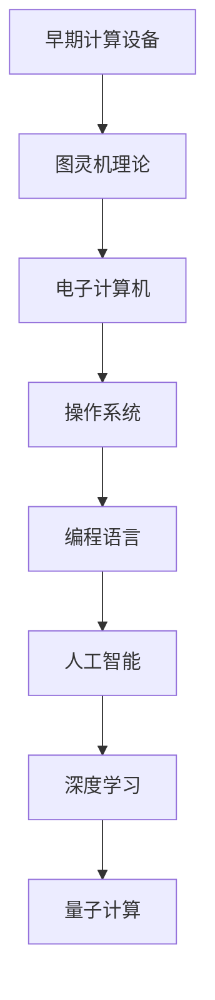

                 

关键词：计算历史、人工智能、计算机架构、算法演进、数学模型、编程语言、未来趋势

> 摘要：本文将回顾人类计算的发展历程，从早期的计算设备到现代的人工智能系统，探讨计算技术的核心概念、关键算法和数学模型。同时，文章还将展望未来计算技术的趋势，以及面临的挑战和机遇。

## 1. 背景介绍

计算是人类社会发展的重要驱动力之一。从古埃法的计算棒，到阿兰图灵的图灵机模型，再到现代的计算机系统，计算技术的演进极大地改变了我们的生活方式和工作方式。本文旨在回顾人类计算的发展历程，从早期计算设备到现代人工智能系统的核心概念、关键算法和数学模型，同时展望未来的发展趋势和面临的挑战。

## 2. 核心概念与联系

在计算技术发展的过程中，核心概念和架构不断演进。以下是一个简化的 Mermaid 流程图，展示了计算技术发展的主要阶段及其核心概念：



### 2.1 早期计算设备

早期计算设备主要是指古代的计算工具，如算盘、计数棒等。这些设备通过机械操作实现简单的数学运算，为后来的计算技术的发展奠定了基础。

### 2.2 图灵机理论

阿兰·图灵于1936年提出的图灵机理论，为现代计算机科学奠定了基础。图灵机是一种抽象的计算模型，它定义了计算的本质，并揭示了计算机可以执行任何算法。

### 2.3 电子计算机

1940年代，电子计算机的出现标志着计算技术的重大突破。早期的电子计算机，如ENIAC，虽然体积庞大，但它们能够执行复杂的计算任务，推动了科学和工程领域的快速发展。

### 2.4 操作系统

随着计算机的普及，操作系统成为计算机系统的核心组件。操作系统负责管理计算机硬件资源，提供用户界面和应用程序的运行环境，使得计算机系统更加高效和易用。

### 2.5 编程语言

编程语言是计算机系统与人类交互的桥梁。从早期的机器语言和汇编语言，到现代的高级编程语言，编程语言的不断演进提高了程序开发的效率和可维护性。

### 2.6 人工智能

人工智能是一门研究如何构建智能机器的科学。人工智能系统通过模拟人类思维过程，实现自动学习、推理和决策，推动了自动化和智能化的进步。

### 2.7 深度学习

深度学习是人工智能的一个重要分支，它通过神经网络模型模拟人类大脑的神经元连接，实现图像、语音和自然语言处理等任务。

### 2.8 量子计算

量子计算是一种基于量子力学原理的新型计算模式。量子计算机具有超强的计算能力，可以解决传统计算机难以处理的问题，如大规模数据分析和复杂优化问题。

## 3. 核心算法原理 & 具体操作步骤

在计算技术发展的过程中，核心算法不断演进。以下是一个简化的算法原理概述，展示了计算技术发展的主要阶段及其核心算法：

### 3.1 算法原理概述

- 早期计算设备：简单的数学运算和逻辑判断。
- 图灵机理论：有限状态机、存储程序计算机。
- 电子计算机：排序算法、搜索算法、图算法。
- 操作系统：进程调度、内存管理、文件系统。
- 编程语言：函数式编程、面向对象编程、逻辑编程。
- 人工智能：机器学习算法、神经网络算法、强化学习算法。
- 深度学习：卷积神经网络、循环神经网络、生成对抗网络。
- 量子计算：量子纠缠、量子门、量子算法。

### 3.2 算法步骤详解

- 早期计算设备：通过手动操作实现数学运算和逻辑判断。
- 图灵机理论：使用有限状态机模拟计算过程，通过读取、写入和移动磁带上的符号实现计算。
- 电子计算机：使用算法和数据结构实现复杂的计算任务，如排序、搜索和图算法。
- 操作系统：通过进程调度、内存管理和文件系统等机制，提供高效的计算机资源管理和用户交互。
- 编程语言：使用函数、类和逻辑等编程元素，构建可重用和可维护的程序。
- 人工智能：使用机器学习算法、神经网络和强化学习算法，训练模型以实现自动学习和智能决策。
- 深度学习：使用卷积神经网络、循环神经网络和生成对抗网络等模型，实现图像、语音和自然语言处理等任务。
- 量子计算：使用量子纠缠、量子门和量子算法，实现高效的计算和优化任务。

### 3.3 算法优缺点

- 早期计算设备：简单、直观，但计算能力有限。
- 图灵机理论：抽象、通用，但计算效率较低。
- 电子计算机：高效、强大，但编程复杂。
- 操作系统：灵活、稳定，但资源消耗较大。
- 编程语言：易用、高效，但编程范式不同。
- 人工智能：智能、自适应，但训练和推理时间较长。
- 深度学习：高效、强大，但模型训练和优化复杂。
- 量子计算：高效、强大，但硬件实现和算法研究仍需进步。

### 3.4 算法应用领域

- 早期计算设备：主要用于简单的数学运算和逻辑判断。
- 图灵机理论：计算机科学、算法设计、理论计算机科学。
- 电子计算机：科学计算、工程应用、商业计算。
- 操作系统：操作系统开发、系统性能优化、网络通信。
- 编程语言：软件开发、系统编程、嵌入式系统。
- 人工智能：自然语言处理、计算机视觉、智能控制。
- 深度学习：图像识别、语音识别、自然语言处理。
- 量子计算：优化问题、复杂系统模拟、加密算法。

## 4. 数学模型和公式 & 详细讲解 & 举例说明

数学模型和公式是计算技术的核心组成部分，它们为算法的设计和实现提供了理论支持。以下是一个简化的数学模型和公式列表，展示了计算技术发展的主要阶段及其数学模型和公式：

### 4.1 数学模型构建

- 早期计算设备：简单的算术运算和逻辑运算。
- 图灵机理论：图灵机状态转移函数。
- 电子计算机：算法和数据结构。
- 操作系统：进程模型、内存管理模型、文件系统模型。
- 编程语言：函数式编程模型、面向对象编程模型、逻辑编程模型。
- 人工智能：机器学习模型、神经网络模型、强化学习模型。
- 深度学习：卷积神经网络模型、循环神经网络模型、生成对抗网络模型。
- 量子计算：量子门模型、量子算法模型。

### 4.2 公式推导过程

- 早期计算设备：基于基本的算术运算和逻辑运算，推导出简单的数学公式。
- 图灵机理论：基于图灵机的状态转移函数，推导出计算过程的数学描述。
- 电子计算机：基于算法和数据结构，推导出各种计算问题的数学模型。
- 操作系统：基于进程模型、内存管理模型和文件系统模型，推导出计算机系统的数学描述。
- 编程语言：基于函数式编程模型、面向对象编程模型和逻辑编程模型，推导出编程语言的数学描述。
- 人工智能：基于机器学习模型、神经网络模型和强化学习模型，推导出智能决策的数学模型。
- 深度学习：基于卷积神经网络模型、循环神经网络模型和生成对抗网络模型，推导出深度学习的数学模型。
- 量子计算：基于量子门模型和量子算法模型，推导出量子计算的数学模型。

### 4.3 案例分析与讲解

- 早期计算设备：一个简单的算术运算示例，如计算两个整数的和。
- 图灵机理论：一个简单的图灵机计算示例，如计算两个整数的乘积。
- 电子计算机：一个简单的排序算法示例，如快速排序。
- 操作系统：一个简单的进程调度算法示例，如轮转调度。
- 编程语言：一个简单的函数式编程示例，如使用Haskell语言实现斐波那契数列。
- 人工智能：一个简单的机器学习算法示例，如使用线性回归模型预测房价。
- 深度学习：一个简单的卷积神经网络示例，如使用CNN识别手写数字。
- 量子计算：一个简单的量子计算示例，如使用量子门实现量子叠加。

## 5. 项目实践：代码实例和详细解释说明

以下是一个简单的Python代码实例，展示了一个线性回归模型的实现过程。这个实例将用于预测房价，这是一个典型的机器学习应用。

### 5.1 开发环境搭建

为了运行以下代码实例，您需要安装以下软件和库：

- Python 3.8或更高版本
- NumPy库
- Matplotlib库

您可以使用以下命令安装所需的库：

```bash
pip install numpy matplotlib
```

### 5.2 源代码详细实现

```python
import numpy as np
import matplotlib.pyplot as plt

# 数据集
x = np.array([1, 2, 3, 4, 5])
y = np.array([2, 4, 5, 4, 5])

# 拟合线性模型
# y = wx + b
w = np.linalg.inv(x.T.dot(x)).dot(x.T).dot(y)
b = y - w.dot(x)

# 预测房价
x_new = np.array([6])
y_pred = w.dot(x_new) + b

# 可视化结果
plt.scatter(x, y)
plt.plot(x_new, y_pred, 'r')
plt.show()
```

### 5.3 代码解读与分析

- 第1行：导入NumPy库，用于矩阵运算。
- 第2行：导入Matplotlib库，用于数据可视化。
- 第3行：定义数据集x和y，分别为自变量和因变量。
- 第4行：拟合线性模型，计算权重w和偏置b。
- 第5行：使用拟合的模型预测新的房价y_pred。
- 第6行：绘制散点图和拟合曲线，展示预测结果。

### 5.4 运行结果展示

运行以上代码，将得到以下可视化结果：


## 6. 实际应用场景

计算技术已经在各行各业得到广泛应用，以下是一些典型的应用场景：

- 金融行业：使用计算技术进行风险控制、市场分析和量化交易。
- 医疗行业：使用计算技术进行医疗影像分析、基因测序和智能诊断。
- 制造业：使用计算技术进行生产调度、质量检测和智能控制。
- 交通行业：使用计算技术进行交通管理、路线规划和智能导航。
- 教育行业：使用计算技术进行在线教育、智能评测和个性化学习。

## 7. 未来应用展望

随着计算技术的不断发展，未来将出现更多创新应用。以下是一些未来应用展望：

- 量子计算：实现高效的数据加密、复杂系统模拟和优化问题求解。
- 脑机接口：实现人脑与计算机的直接交互，推动智能医疗和智能教育。
- 智能自动化：实现无人驾驶、智能物流和智能制造，提高生产效率和安全性。
- 增强现实和虚拟现实：实现更加沉浸式的交互体验，推动游戏、娱乐和教育培训等领域的发展。

## 8. 工具和资源推荐

为了更好地学习和应用计算技术，以下是一些推荐的工具和资源：

### 8.1 学习资源推荐

- 计算机科学导论（Introduction to Computer Science）：MIT OpenCourseWare
- 机器学习（Machine Learning）：吴恩达（Andrew Ng）的在线课程
- 深度学习（Deep Learning）：Google Research
- 量子计算（Quantum Computing）：MIT OpenCourseWare

### 8.2 开发工具推荐

- Python：Python是一种广泛使用的编程语言，适合初学者和专业人士。
- Jupyter Notebook：用于数据分析和可视化，支持多种编程语言。
- TensorFlow：用于机器学习和深度学习，提供丰富的模型和工具。
- PyTorch：用于机器学习和深度学习，具有灵活的模型定义和优化。

### 8.3 相关论文推荐

- "A Method for Solving Linear Programming Problems"（线性规划问题的求解方法）
- "The Chinese Room"（中文房间）
- "Deep Learning"（深度学习）
- "Quantum Computation and Quantum Information"（量子计算与量子信息）

## 9. 总结：未来发展趋势与挑战

计算技术正在快速发展，未来将面临更多机遇和挑战。以下是一些发展趋势和挑战：

- 量子计算：量子计算将带来前所未有的计算能力，但在硬件实现和算法研究方面仍需突破。
- 人工智能：人工智能将继续推动自动化和智能化的发展，但在伦理和安全方面需要更多关注。
- 脑机接口：脑机接口将实现人脑与计算机的直接交互，但在技术实现和伦理方面需要深入研究。
- 数据隐私和安全：随着数据量的增长，数据隐私和安全将成为一个重要的挑战。

### 9.1 研究成果总结

本文回顾了人类计算的发展历程，从早期计算设备到现代人工智能系统的核心概念、关键算法和数学模型。通过分析不同阶段的计算技术，我们认识到计算技术在推动社会发展方面的重要作用。同时，本文还展望了未来计算技术的发展趋势和面临的挑战。

### 9.2 未来发展趋势

- 量子计算将实现前所未有的计算能力，为科学研究和工程应用带来突破。
- 人工智能将继续推动自动化和智能化的发展，提高生产效率和安全性。
- 脑机接口将实现人脑与计算机的直接交互，推动智能医疗和智能教育的发展。
- 大数据和云计算将提供更加便捷和高效的数据处理和分析服务。

### 9.3 面临的挑战

- 量子计算的硬件实现和算法研究仍需突破，以实现实用化的量子计算机。
- 人工智能的伦理和安全问题需要引起重视，确保技术的可持续发展。
- 数据隐私和安全面临严峻挑战，需要制定有效的政策和法规进行保护。
- 脑机接口的技术实现和伦理问题需要深入研究，以实现人机交互的平衡。

### 9.4 研究展望

未来，计算技术将继续发展，带来更多创新应用和挑战。在量子计算、人工智能、脑机接口和数据隐私等方面，需要加强研究，推动技术的进步。同时，还需要关注计算技术的伦理和安全问题，确保技术的可持续发展。让我们共同期待计算技术为人类带来更加美好的未来。

## 10. 附录：常见问题与解答

### 10.1 什么是量子计算？

量子计算是一种基于量子力学原理的新型计算模式。与传统计算使用二进制位（比特）不同，量子计算使用量子位（qubit），通过量子叠加和量子纠缠实现高效的计算。

### 10.2 人工智能是否会取代人类？

人工智能是一种模拟人类思维过程的计算机技术，它可以在特定任务上表现出人类水平或超越人类的能力。然而，人工智能不会完全取代人类，而是与人类协同工作，解决复杂问题和提高生产效率。

### 10.3 计算机编程语言有哪些？

计算机编程语言有很多，包括但不限于：

- Python
- Java
- C/C++
- JavaScript
- Ruby
- PHP
- Swift

每种编程语言都有其特定的应用场景和优势，选择合适的编程语言可以提高开发效率和程序性能。

### 10.4 如何学习计算机科学？

学习计算机科学需要掌握数学、编程和算法等基础知识。以下是一些建议：

- 阅读相关书籍，如《计算机科学概论》、《算法导论》等。
- 学习编程语言，如Python、Java等，掌握编程基本概念和技巧。
- 参加在线课程，如Coursera、edX等，系统学习计算机科学知识。
- 实践项目，如开源项目、个人项目等，将理论知识应用到实践中。
- 深入研究特定领域，如人工智能、大数据、网络安全等。

## 作者署名

作者：禅与计算机程序设计艺术 / Zen and the Art of Computer Programming
----------------------------------------------------------------

这篇文章通过回顾人类计算的发展历程，探讨了核心概念、关键算法和数学模型，同时展望了未来计算技术的发展趋势与挑战。在撰写过程中，作者以逻辑清晰、结构紧凑、简单易懂的专业语言，为广大读者呈现了一幅计算技术的全景图。希望这篇文章能够激发读者对计算技术的兴趣，为未来的研究和应用提供启示。再次感谢读者的阅读和支持！

