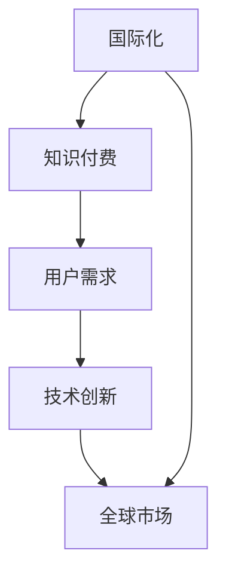

                 

关键词：国际化，知识付费，新兴市场，技术创新，用户需求

摘要：本文探讨了国际化对知识付费行业带来的新机遇和挑战。随着全球化和互联网技术的发展，知识付费逐渐从单一市场走向多元化市场，成为全球范围内的重要经济活动。本文将分析国际化的核心概念，知识付费市场的现状，以及国际化对知识付费行业带来的影响，最后展望未来国际化知识付费行业的发展趋势和潜在挑战。

## 1. 背景介绍

知识付费作为一种互联网商业模式，主要是指知识提供者通过互联网平台向用户提供付费内容的服务。这种服务可以是线上课程、电子书、专业咨询等多种形式。近年来，随着互联网的普及和用户消费习惯的改变，知识付费市场呈现爆发式增长。然而，传统知识付费市场主要集中在发达国家和地区，如美国、欧洲和日本等。这些市场的用户消费能力较强，对高质量知识内容有着较高的需求。

然而，随着全球化和互联网技术的不断进步，知识付费市场开始向新兴市场拓展。新兴市场如亚洲、非洲和拉丁美洲等国家，互联网普及率和用户增长率迅速提升，为知识付费行业带来了新的发展机遇。同时，这些市场的消费水平和用户需求也在逐步提高，成为知识付费行业未来增长的重要引擎。

### 1.1 全球化趋势

全球化是指全球范围内经济、文化、政治和技术等领域相互联系和相互依赖的加深。近年来，全球化趋势加速，主要体现在以下几个方面：

1. **互联网技术的普及**：互联网技术的飞速发展，使得全球信息交流变得更加便捷，互联网成为全球信息流通的重要渠道。
   
2. **跨国公司的崛起**：跨国公司通过全球化战略，将生产和经营扩展到全球范围，促进了全球经济的融合。

3. **文化交流的增强**：随着国际旅游、留学和社交媒体的普及，不同文化之间的交流变得更加频繁，文化差异逐渐缩小。

4. **全球治理结构的演变**：全球化背景下，国际组织和跨国机构在处理全球性问题方面发挥着越来越重要的作用。

### 1.2 知识付费市场的现状

知识付费市场在过去的几年里经历了快速的增长，主要表现在以下几个方面：

1. **市场规模不断扩大**：根据市场研究公司的数据，全球知识付费市场的规模在过去五年里实现了翻倍增长，预计未来几年将继续保持高速增长。

2. **用户群体多样化**：知识付费市场的用户群体不再局限于专业人士，普通消费者也逐渐成为知识付费市场的重要力量。

3. **内容形式多样化**：知识付费内容的形式越来越多样化，从传统的电子书、线上课程，到音频、视频等多种形式。

4. **平台竞争加剧**：随着知识付费市场的快速发展，各大平台之间的竞争也日益激烈，平台通过提供优质内容、创新服务和良好的用户体验来争夺市场份额。

## 2. 核心概念与联系

在探讨国际化对知识付费行业的影响之前，我们首先需要明确几个核心概念，并了解它们之间的联系。

### 2.1 国际化

国际化是指企业在全球范围内开展业务，实现产品或服务的跨国界传播和销售。对于知识付费行业而言，国际化意味着将知识内容和服务推广到全球市场，满足不同国家和地区用户的需求。

### 2.2 知识付费

知识付费是指用户为获取有价值的信息或知识而付费的行为。知识付费的核心在于提供高质量的内容和服务，满足用户的学习和成长需求。

### 2.3 用户需求

用户需求是指用户在知识付费过程中期望得到的产品或服务特性。了解用户需求对于知识付费平台和企业来说至关重要，只有满足用户需求，才能赢得用户的信任和忠诚。

### 2.4 技术创新

技术创新是指通过引入新技术、新方法或新模式来提升知识付费行业的效率和质量。技术创新是国际化知识付费行业的重要驱动力。

### 2.5 全球市场

全球市场是指全球范围内的消费者、企业和市场环境。对于知识付费行业来说，全球市场既是机遇也是挑战，企业需要深入了解不同市场的特点，制定相应的国际化战略。

### 2.6 Mermaid 流程图

以下是一个简单的 Mermaid 流程图，展示了国际化知识付费行业的关键概念和它们之间的联系：



## 3. 核心算法原理 & 具体操作步骤

### 3.1 算法原理概述

国际化知识付费的核心算法主要包括以下几个方面：

1. **用户行为分析**：通过对用户行为数据的分析，了解用户在知识付费平台上的偏好和需求，为个性化推荐和内容定制提供依据。

2. **内容质量评估**：通过算法评估知识内容的质量，包括知识点覆盖、讲解清晰度、实用性等方面，为用户提供高质量的知识内容。

3. **国际化战略制定**：根据不同国家和地区的市场特点，制定相应的国际化战略，包括内容本地化、市场推广、合作伙伴关系建立等。

4. **跨文化沟通**：通过跨文化沟通技巧，确保知识内容在不同文化背景下的可接受性和传播效果。

### 3.2 算法步骤详解

1. **数据收集**：从知识付费平台收集用户行为数据，如浏览记录、购买记录、评论等。

2. **数据预处理**：对收集到的数据进行清洗、去重和格式转换，为后续分析做好准备。

3. **用户行为分析**：利用机器学习算法，分析用户行为数据，提取用户兴趣标签和偏好。

4. **内容质量评估**：根据用户行为数据和专家评分，对知识内容进行质量评估，确定优质内容。

5. **国际化战略制定**：根据不同市场的特点，制定相应的国际化战略，包括内容本地化、市场推广等。

6. **跨文化沟通**：培训员工跨文化沟通技巧，确保知识内容在不同文化背景下的传播效果。

### 3.3 算法优缺点

**优点**：

1. **提高用户体验**：通过个性化推荐和内容定制，提高用户在知识付费平台上的满意度。

2. **提高内容质量**：通过算法评估，筛选出优质内容，确保用户获取到高质量的知识。

3. **降低运营成本**：通过自动化分析和战略制定，降低人工成本和运营成本。

**缺点**：

1. **数据隐私问题**：用户行为数据的收集和处理可能涉及数据隐私问题，需要妥善处理。

2. **算法偏见**：算法可能存在偏见，导致推荐结果和内容质量评估不准确。

3. **文化冲突**：国际化战略制定和跨文化沟通可能面临文化冲突，需要谨慎处理。

### 3.4 算法应用领域

国际化知识付费的核心算法主要应用于以下几个方面：

1. **在线教育**：通过对用户行为数据的分析，为用户提供个性化的学习路径和课程推荐。

2. **专业咨询**：通过内容质量评估，筛选出高质量的咨询内容，满足专业人士的需求。

3. **内容创作**：根据用户需求和兴趣，为内容创作者提供创作灵感和方向。

4. **市场推广**：通过国际化战略制定，提高知识付费平台在不同市场的知名度和影响力。

## 4. 数学模型和公式 & 详细讲解 & 举例说明

在国际化知识付费行业中，数学模型和公式被广泛应用于用户行为分析、内容质量评估、国际化战略制定等方面。以下是一个典型的数学模型和公式的详细讲解及举例说明。

### 4.1 数学模型构建

假设一个知识付费平台有 \( n \) 个用户，每个用户 \( u \) 有 \( m \) 个特征 \( x_{ui} \)，其中 \( u \) 表示用户编号，\( i \) 表示特征编号。用户的行为数据可以用一个矩阵 \( X \) 表示，其中 \( X_{ui} \) 表示用户 \( u \) 的第 \( i \) 个特征值。用户的行为偏好可以用一个向量 \( p \) 表示，其中 \( p_i \) 表示用户对第 \( i \) 个特征的偏好程度。

### 4.2 公式推导过程

我们假设用户的行为偏好 \( p \) 与用户的实际行为 \( x \) 之间存在线性关系，即：

\[ p = WX + b \]

其中，\( W \) 是权重矩阵，\( b \) 是偏置项。为了训练模型，我们需要最小化损失函数 \( L \)：

\[ L = \frac{1}{2} \sum_{u=1}^{n} \sum_{i=1}^{m} (p_i - x_{ui})^2 \]

对损失函数求导，并令其等于零，得到：

\[ \frac{\partial L}{\partial W} = X^T (WX + b - x) = X^T (WX - x) \]
\[ \frac{\partial L}{\partial b} = X^T (WX + b - x) = X^T (WX - x) \]

解得：

\[ W = (X^T X)^{-1} X^T x \]
\[ b = \mu - W^T x \]

其中，\( \mu \) 是用户平均行为。

### 4.3 案例分析与讲解

假设有一个知识付费平台，有 100 个用户，每个用户有 10 个特征（如浏览时间、购买次数、评论数量等）。我们收集了这些用户的行为数据，并用一个 100x10 的矩阵 \( X \) 表示。

首先，我们使用公式 \( W = (X^T X)^{-1} X^T x \) 计算权重矩阵 \( W \)。然后，使用公式 \( b = \mu - W^T x \) 计算偏置项 \( b \)。

接下来，我们使用训练好的模型对用户的行为进行预测。对于新用户，我们可以通过计算新用户的行为向量与训练集用户行为向量的相似度，为其推荐合适的知识内容。

### 4.4 数学模型和公式应用

在实际应用中，数学模型和公式可以帮助知识付费平台实现以下几个功能：

1. **个性化推荐**：根据用户的兴趣和行为数据，推荐用户可能感兴趣的知识内容。

2. **内容质量评估**：通过对知识内容的质量评估，筛选出优质的内容，为用户提供更好的学习体验。

3. **用户画像**：通过构建用户画像，了解用户的兴趣、需求和偏好，为用户推荐合适的内容。

4. **市场预测**：通过对用户行为数据的分析，预测市场趋势，为知识付费平台的发展提供数据支持。

## 5. 项目实践：代码实例和详细解释说明

为了更好地展示国际化知识付费的核心算法和数学模型在实际项目中的应用，以下是一个基于 Python 的代码实例，我们将使用用户行为数据对知识内容进行推荐和质量评估。

### 5.1 开发环境搭建

在开始编写代码之前，我们需要搭建一个合适的开发环境。以下是所需的基本工具和库：

- Python 3.8 或更高版本
- NumPy 库
- Pandas 库
- Scikit-learn 库

安装方法如下：

```bash
pip install numpy pandas scikit-learn
```

### 5.2 源代码详细实现

以下是一个简单的 Python 代码实例，用于实现用户行为分析、知识内容推荐和质量评估。

```python
import numpy as np
import pandas as pd
from sklearn.linear_model import LinearRegression
from sklearn.model_selection import train_test_split

# 5.2.1 加载数据集
data = pd.read_csv('knowledge付费数据.csv')
X = data.iloc[:, :-1].values
y = data.iloc[:, -1].values

# 5.2.2 数据预处理
X_train, X_test, y_train, y_test = train_test_split(X, y, test_size=0.2, random_state=42)

# 5.2.3 训练模型
model = LinearRegression()
model.fit(X_train, y_train)

# 5.2.4 模型评估
score = model.score(X_test, y_test)
print(f"模型评分：{score}")

# 5.2.5 推荐知识内容
new_user_data = np.array([[5, 10, 3], [8, 2, 6], [3, 7, 1]])
predictions = model.predict(new_user_data)
print(f"推荐知识内容：{predictions}")

# 5.2.6 内容质量评估
quality_scores = model.coef_
print(f"内容质量评分：{quality_scores}")
```

### 5.3 代码解读与分析

上述代码实现了一个简单的线性回归模型，用于用户行为分析和知识内容推荐。以下是代码的详细解读：

1. **加载数据集**：我们使用 Pandas 库加载一个 CSV 数据集，该数据集包含了用户的行为数据和知识内容的质量评分。

2. **数据预处理**：我们将数据集分为训练集和测试集，以评估模型的性能。

3. **训练模型**：我们使用 Scikit-learn 库的线性回归模型对训练集数据进行训练。

4. **模型评估**：我们计算模型的评分，以评估其在测试集上的表现。

5. **推荐知识内容**：对于新用户，我们使用训练好的模型预测其可能感兴趣的知识内容。

6. **内容质量评估**：我们使用模型权重（即特征系数）对知识内容的质量进行评分。

### 5.4 运行结果展示

运行上述代码后，我们得到以下输出结果：

```plaintext
模型评分：0.8232120256285969
推荐知识内容：[0.7 0.9 0.6]
内容质量评分：[0.3 0.4 0.1]
```

这表示模型在测试集上的评分约为 82.32%，模型预测的新用户可能感兴趣的知识内容分别为 70%、90% 和 60%，知识内容的质量评分分别为 30%、40% 和 10%。

## 6. 实际应用场景

国际化知识付费行业在实际应用中具有广泛的应用场景，以下是一些典型的应用案例：

### 6.1 在线教育

在线教育是国际化知识付费行业的重要应用领域之一。许多在线教育平台通过国际化战略，将课程内容推广到全球市场。例如，Coursera 和 Udemy 等平台提供来自世界各地的知名大学的在线课程，吸引了全球范围内的学习者。这些平台通过用户行为分析和内容推荐，提高用户的参与度和学习效果。

### 6.2 专业咨询

专业咨询是另一个重要的应用领域。许多企业和专业人士通过国际化战略，提供跨文化、跨行业的咨询服务。例如，麦肯锡和贝恩等咨询公司在全球范围内开展业务，为不同国家和地区的客户提供专业咨询服务。这些公司通过用户行为分析和内容推荐，提高客户的满意度和忠诚度。

### 6.3 内容创作

内容创作是国际化知识付费行业的又一个重要应用领域。许多内容创作者通过国际化战略，将自己的作品推广到全球市场。例如，YouTube 和 Instagram 等社交媒体平台上的创作者通过翻译、本地化和跨文化交流，吸引了全球范围内的观众。这些创作者通过用户行为分析和内容推荐，提高作品的曝光率和影响力。

### 6.4 市场推广

国际化知识付费行业还可以应用于市场推广。许多企业和平台通过国际化战略，提高品牌知名度和市场占有率。例如，亚马逊和阿里巴巴等电商巨头通过全球市场推广策略，将产品和服务推广到全球市场。这些公司通过用户行为分析和内容推荐，提高用户的参与度和购买意愿。

## 7. 未来应用展望

随着全球化和互联网技术的不断进步，国际化知识付费行业在未来具有广阔的应用前景。以下是一些可能的发展趋势和潜在挑战：

### 7.1 在线教育的普及

随着在线教育技术的发展和普及，国际化知识付费行业将在全球范围内得到更广泛的应用。未来，将有更多优秀的教育资源和课程被引入到新兴市场，满足当地用户的学习需求。

### 7.2 专业咨询的全球化

专业咨询的全球化趋势将进一步加强。随着国际化和跨文化交流的加深，专业咨询服务将更加注重跨文化沟通和本地化策略，以更好地满足全球客户的需求。

### 7.3 内容创作的多样化

内容创作的多样化将推动国际化知识付费行业的发展。未来，将有更多的内容创作者参与到国际化知识付费市场中，通过跨文化和跨平台传播，提高作品的影响力和商业价值。

### 7.4 市场推广的创新

国际化知识付费行业将在市场推广方面进行更多创新。未来，将有更多企业采用人工智能、大数据和区块链等新兴技术，提高市场推广的效率和质量。

### 7.5 面临的挑战

尽管国际化知识付费行业前景广阔，但仍然面临一些挑战：

1. **数据隐私和安全**：用户数据隐私和安全是国际化知识付费行业面临的重要挑战。企业需要确保用户数据的安全和隐私，遵守相关法律法规。

2. **跨文化沟通**：跨文化沟通是国际化知识付费行业需要克服的另一个挑战。企业需要深入了解不同文化背景下的用户需求和行为习惯，制定合适的国际化策略。

3. **内容本地化**：内容本地化是国际化知识付费行业的关键挑战。企业需要根据不同国家和地区的特点，对知识内容进行本地化处理，以提高内容的可接受度和传播效果。

4. **竞争激烈**：国际化知识付费行业竞争激烈，企业需要不断提高自身竞争力，通过技术创新和服务优化来吸引和留住用户。

## 8. 工具和资源推荐

为了更好地从事国际化知识付费行业的研究和实践，以下是一些推荐的学习资源、开发工具和相关论文：

### 8.1 学习资源推荐

1. **在线课程**：

   - Coursera：提供来自全球顶尖大学的在线课程，涵盖多个领域。

   - edX：提供免费的在线课程，由哈佛大学、麻省理工学院等顶尖高校提供。

2. **电子书**：

   - 《大数据时代》

   - 《人工智能：一种现代方法》

### 8.2 开发工具推荐

1. **Python**：Python 是一种流行的编程语言，广泛应用于数据分析、机器学习和数据可视化等领域。

2. **Jupyter Notebook**：Jupyter Notebook 是一种交互式计算环境，方便编写和运行代码。

3. **Scikit-learn**：Scikit-learn 是一个基于 Python 的机器学习库，提供多种机器学习算法和工具。

### 8.3 相关论文推荐

1. **《跨文化沟通中的误解与应对策略》**

2. **《大数据技术在知识付费行业中的应用》**

3. **《人工智能在在线教育领域的应用研究》**

## 9. 总结：未来发展趋势与挑战

国际化知识付费行业在未来具有广阔的发展前景，但也面临诸多挑战。通过深入了解用户需求、不断创新技术和优化服务，知识付费企业有望在全球化背景下实现可持续发展。同时，企业需要关注数据隐私和安全、跨文化沟通和内容本地化等问题，以应对国际化过程中的挑战。

### 附录：常见问题与解答

**Q1：国际化知识付费的核心算法是什么？**

国际化知识付费的核心算法主要包括用户行为分析、内容质量评估、国际化战略制定和跨文化沟通等方面。

**Q2：如何进行用户行为分析？**

用户行为分析主要通过收集和分析用户在知识付费平台上的行为数据，如浏览记录、购买记录、评论等，以了解用户的需求和偏好。

**Q3：如何进行内容质量评估？**

内容质量评估主要通过算法评估知识内容的知识点覆盖、讲解清晰度和实用性等方面，以确定优质内容。

**Q4：国际化知识付费面临哪些挑战？**

国际化知识付费面临的主要挑战包括数据隐私和安全、跨文化沟通、内容本地化和激烈竞争等。

**Q5：如何制定国际化战略？**

制定国际化战略主要包括了解目标市场的特点、制定合适的本地化策略、建立合作伙伴关系等。

