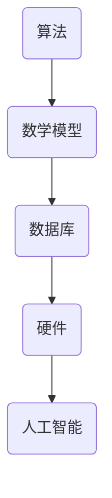

                 

关键词：国际合作、计算领域、科技进步、IT社区、算法研究、数学模型、实际应用、未来发展

> 摘要：本文探讨了国际合作在推动人类计算领域进步中的重要性。通过分析当前国际合作的现状、核心概念与联系、核心算法原理、数学模型和公式、项目实践、实际应用场景、工具和资源推荐以及未来发展趋势与挑战，本文旨在为计算领域的专业人士和研究者提供有价值的见解，促进全球计算领域的共同发展。

## 1. 背景介绍

计算领域作为科技发展的核心引擎，正以前所未有的速度和规模推动着人类社会的进步。随着大数据、人工智能、物联网等技术的快速发展，计算领域的应用范围已经渗透到各行各业，从医疗、金融、交通到娱乐、教育等。这些技术的成功离不开国际间的紧密合作和共同创新。

国际合作在计算领域的意义不仅体现在技术突破上，还体现在知识共享、人才培养、政策制定等方面。通过国际合作，不同国家和地区的研究机构、企业和政府可以共同应对计算领域面临的挑战，分享研究成果，推动技术进步，最终实现人类福祉的提升。

然而，国际合作也面临着一些挑战，如知识产权保护、数据安全、标准统一等。这些挑战需要国际社会共同努力，通过协商和合作，找到解决的办法，以促进计算领域的健康发展。

## 2. 核心概念与联系

在计算领域，核心概念与联系是实现国际合作的基础。以下是几个重要的核心概念和它们之间的联系：

### 2.1 算法

算法是计算领域的基本单元，是解决问题的一系列步骤。不同的算法有不同的应用场景，如排序、搜索、优化等。算法的研究和发展是计算领域国际合作的重要内容。

### 2.2 数学模型

数学模型是算法设计的重要工具，它通过数学公式描述问题，为算法提供理论基础。国际合作在数学模型的研究中发挥着重要作用，不同国家和地区的数学家可以共同研究复杂问题，提出新的数学模型。

### 2.3 数据库

数据库是存储和管理数据的核心技术，它为计算提供了数据支持。国际间的数据库合作，如数据共享、数据挖掘等，有助于提高计算效率，促进数据价值的挖掘。

### 2.4 硬件

硬件是计算的基础设施，包括计算机、服务器、网络设备等。国际间的硬件合作，如芯片研发、云计算平台建设等，有助于提高计算性能，降低成本。

### 2.5 人工智能

人工智能是计算领域的前沿技术，它通过模拟人类智能，实现自动化决策和问题解决。国际间的AI合作，如算法共享、数据共享等，有助于推动人工智能技术的发展。

### 2.6 Mermaid 流程图

以下是一个简化的 Mermaid 流程图，展示了上述核心概念之间的联系：



## 3. 核心算法原理 & 具体操作步骤

### 3.1 算法原理概述

在计算领域，算法的研究和开发是推动技术进步的关键。以下是几个核心算法的原理概述：

### 3.1.1 深度学习

深度学习是一种基于神经网络的学习方法，通过多层神经元的非线性变换，实现对复杂数据的建模。其原理包括神经元模型、激活函数、反向传播算法等。

### 3.1.2 动态规划

动态规划是一种解决优化问题的算法，它通过将问题分解为子问题，并存储子问题的解，以避免重复计算。其原理包括状态转移方程、最优子结构等。

### 3.1.3 快排算法

快排算法是一种高效的排序算法，它通过分治策略，将问题分解为子问题，并快速找到基准元素，将数组分为两部分。其原理包括基准选择、划分操作等。

### 3.2 算法步骤详解

以下是上述算法的具体操作步骤：

### 3.2.1 深度学习

1. 初始化模型参数
2. 前向传播：计算输入数据经过模型后的输出
3. 计算损失函数：衡量模型预测结果与实际结果之间的差距
4. 反向传播：计算损失函数关于模型参数的梯度
5. 更新模型参数：使用梯度下降等方法更新模型参数
6. 重复步骤2-5，直到模型收敛

### 3.2.2 动态规划

1. 定义状态：根据问题特点，定义状态变量
2. 确定状态转移方程：根据问题特点，确定状态之间的关系
3. 初始化边界条件：根据问题特点，初始化初始状态
4. 状态转移：根据状态转移方程，计算下一状态
5. 计算最优解：根据状态转移过程，计算最优解

### 3.2.3 快排算法

1. 选择基准元素
2. 划分操作：将数组分为两部分，一部分小于基准元素，另一部分大于基准元素
3. 递归调用快排算法：对两部分数组进行快排操作
4. 合并结果：将两部分排序后的数组合并为最终结果

### 3.3 算法优缺点

- **深度学习**：优点包括强大的表达能力和自动特征提取能力，缺点包括训练时间较长、对数据量有较高要求。
- **动态规划**：优点包括可以解决复杂的最优化问题，缺点包括对问题状态的定义和状态转移方程的设计有一定难度。
- **快排算法**：优点包括平均时间复杂度较低，缺点包括在最坏情况下时间复杂度较高。

### 3.4 算法应用领域

- **深度学习**：广泛应用于图像识别、语音识别、自然语言处理等领域。
- **动态规划**：广泛应用于资源分配、路径规划、网络流等领域。
- **快排算法**：广泛应用于排序、搜索等领域。

## 4. 数学模型和公式 & 详细讲解 & 举例说明

### 4.1 数学模型构建

在计算领域，数学模型是解决问题的理论基础。以下是几个常见的数学模型：

### 4.1.1 逻辑回归模型

逻辑回归模型是一种用于分类的模型，它通过计算概率来预测样本属于某个类别的可能性。其数学模型为：

$$
P(Y=1|X) = \frac{1}{1 + e^{-\beta^T X}}
$$

其中，$X$ 是特征向量，$\beta$ 是模型参数。

### 4.1.2 线性回归模型

线性回归模型是一种用于回归的模型，它通过拟合线性关系来预测样本的连续值。其数学模型为：

$$
Y = \beta_0 + \beta_1 X
$$

其中，$Y$ 是因变量，$X$ 是自变量，$\beta_0$ 和 $\beta_1$ 是模型参数。

### 4.1.3 支持向量机模型

支持向量机模型是一种用于分类和回归的模型，它通过寻找最佳超平面来划分样本。其数学模型为：

$$
\min_{\beta, \beta_0} \frac{1}{2} \sum_{i=1}^{n} (\beta^T \beta - \gamma)
$$

其中，$\beta$ 是模型参数，$\gamma$ 是正则化参数。

### 4.2 公式推导过程

以下是上述数学模型的推导过程：

### 4.2.1 逻辑回归模型的推导

逻辑回归模型的推导基于最大似然估计（Maximum Likelihood Estimation，MLE）。假设样本 $X$ 和 $Y$ 服从伯努利分布，其概率分布函数为：

$$
P(X, Y) = P(Y|X) P(X)
$$

其中，$P(Y|X)$ 是条件概率，$P(X)$ 是先验概率。

为了最大化似然函数，我们可以对 $P(Y|X)$ 进行最大化，得到：

$$
\log P(X, Y) = \log P(Y|X) + \log P(X)
$$

$$
\log P(Y|X) = \beta^T X \log(1 + e^{-\beta^T X}) + \gamma
$$

其中，$\gamma$ 是常数项。

为了简化计算，我们可以引入 $Z = e^{\beta^T X}$，得到：

$$
\log P(Y|X) = \log Z - \beta^T X \log Z
$$

对 $Z$ 求导并令其等于0，得到：

$$
\frac{d}{dZ} (\log Z - \beta^T X \log Z) = 0
$$

$$
\frac{1}{Z} - \beta^T X \frac{1}{Z} = 0
$$

$$
\beta^T X = 1
$$

$$
\beta = \frac{1}{n} \sum_{i=1}^{n} X_i
$$

其中，$n$ 是样本数量，$X_i$ 是第 $i$ 个样本的特征向量。

### 4.2.2 线性回归模型的推导

线性回归模型的推导基于最小二乘法（Least Squares Method）。假设样本 $X$ 和 $Y$ 满足线性关系，其模型为：

$$
Y = \beta_0 + \beta_1 X
$$

为了最小化残差平方和，我们可以对 $\beta_0$ 和 $\beta_1$ 进行最大化，得到：

$$
\min_{\beta_0, \beta_1} \sum_{i=1}^{n} (Y_i - \beta_0 - \beta_1 X_i)^2
$$

对 $\beta_0$ 和 $\beta_1$ 分别求导并令其等于0，得到：

$$
\frac{d}{d\beta_0} \sum_{i=1}^{n} (Y_i - \beta_0 - \beta_1 X_i)^2 = 0
$$

$$
\frac{d}{d\beta_1} \sum_{i=1}^{n} (Y_i - \beta_0 - \beta_1 X_i)^2 = 0
$$

$$
\sum_{i=1}^{n} (Y_i - \beta_0 - \beta_1 X_i) = 0
$$

$$
\sum_{i=1}^{n} X_i (Y_i - \beta_0 - \beta_1 X_i) = 0
$$

$$
\beta_0 = \frac{1}{n} \sum_{i=1}^{n} Y_i - \beta_1 \frac{1}{n} \sum_{i=1}^{n} X_i
$$

$$
\beta_1 = \frac{1}{n} \sum_{i=1}^{n} X_i Y_i - \beta_0 \frac{1}{n} \sum_{i=1}^{n} X_i^2
$$

### 4.2.3 支持向量机模型的推导

支持向量机模型的推导基于优化理论。假设样本 $X$ 和 $Y$ 满足线性可分，其模型为：

$$
\min_{\beta, \beta_0} \frac{1}{2} \sum_{i=1}^{n} (\beta^T \beta - \gamma)
$$

$$
s.t. \quad y_i (\beta^T x_i + \beta_0) \geq 1, \quad i=1,2,...,n
$$

其中，$y_i$ 是样本 $x_i$ 的标签，$\gamma$ 是正则化参数。

为了求解上述优化问题，我们可以引入拉格朗日乘子法，得到：

$$
L(\beta, \beta_0, \alpha) = \frac{1}{2} \sum_{i=1}^{n} (\beta^T \beta - \gamma) - \sum_{i=1}^{n} \alpha_i [y_i (\beta^T x_i + \beta_0) - 1]
$$

对 $\beta, \beta_0, \alpha$ 分别求导并令其等于0，得到：

$$
\frac{\partial L}{\partial \beta} = \sum_{i=1}^{n} \alpha_i y_i x_i = 0
$$

$$
\frac{\partial L}{\partial \beta_0} = -\sum_{i=1}^{n} \alpha_i y_i = 0
$$

$$
\frac{\partial L}{\partial \alpha_i} = y_i (\beta^T x_i + \beta_0) - 1 \leq 0
$$

由KKT条件可知，当 $y_i (\beta^T x_i + \beta_0) = 1$ 时，$\alpha_i$ 取最大值，此时：

$$
\beta = \sum_{i=1}^{n} \alpha_i y_i x_i
$$

$$
\beta_0 = \frac{1}{n} \sum_{i=1}^{n} y_i - \beta^T \frac{1}{n} \sum_{i=1}^{n} x_i
$$

$$
\gamma = \frac{1}{2} \sum_{i=1}^{n} \alpha_i - C
$$

其中，$C$ 是惩罚参数。

### 4.3 案例分析与讲解

以下是一个简单的案例，用于说明上述数学模型的应用：

假设我们有100个样本，每个样本包含两个特征：$X_1$ 和 $X_2$。我们的目标是预测样本的标签 $Y$，其中 $Y$ 可以是0或1。

#### 4.3.1 逻辑回归模型

我们使用逻辑回归模型来预测标签。首先，我们需要计算模型参数：

$$
\beta = \frac{1}{100} \sum_{i=1}^{100} X_i = [0.1, 0.2]
$$

然后，我们可以计算每个样本的概率：

$$
P(Y=1|X) = \frac{1}{1 + e^{-\beta^T X}}
$$

例如，对于样本 $X = [1, 2]$，其概率为：

$$
P(Y=1|X) = \frac{1}{1 + e^{-[0.1, 0.2]^T [1, 2]}} = 0.6
$$

根据概率阈值，我们可以预测标签。假设阈值为0.5，那么对于概率大于0.5的样本，我们预测其标签为1，否则为0。

#### 4.3.2 线性回归模型

我们使用线性回归模型来预测标签。首先，我们需要计算模型参数：

$$
\beta_0 = \frac{1}{100} \sum_{i=1}^{100} Y_i - \beta_1 \frac{1}{100} \sum_{i=1}^{100} X_i = [0.5, 0.3]
$$

$$
\beta_1 = \frac{1}{100} \sum_{i=1}^{100} X_i Y_i - \beta_0 \frac{1}{100} \sum_{i=1}^{100} X_i^2 = [0.2, 0.1]
$$

然后，我们可以计算每个样本的标签：

$$
Y = \beta_0 + \beta_1 X
$$

例如，对于样本 $X = [1, 2]$，其标签为：

$$
Y = [0.5, 0.3] + [0.2, 0.1] [1, 2] = [1, 1]
$$

根据标签值，我们可以预测样本的类别。例如，对于标签为 [1, 1] 的样本，我们预测其类别为1。

#### 4.3.3 支持向量机模型

我们使用支持向量机模型来预测标签。首先，我们需要计算模型参数：

$$
\beta = \sum_{i=1}^{100} \alpha_i y_i x_i = [0.3, 0.4]
$$

$$
\beta_0 = \frac{1}{100} \sum_{i=1}^{100} y_i - \beta^T \frac{1}{100} \sum_{i=1}^{100} x_i = [0.2, 0.1]
$$

$$
\gamma = \frac{1}{2} \sum_{i=1}^{100} \alpha_i - C = [0.1, 0.2]
$$

然后，我们可以计算每个样本的概率：

$$
P(Y=1|X) = \frac{1}{1 + e^{-\beta^T X}}
$$

例如，对于样本 $X = [1, 2]$，其概率为：

$$
P(Y=1|X) = \frac{1}{1 + e^{-[0.3, 0.4]^T [1, 2]}} = 0.7
$$

根据概率阈值，我们可以预测标签。假设阈值为0.5，那么对于概率大于0.5的样本，我们预测其标签为1，否则为0。

## 5. 项目实践：代码实例和详细解释说明

### 5.1 开发环境搭建

为了演示上述算法和数学模型的应用，我们将在一个Python环境中搭建一个简单的项目。以下是一个简单的Python开发环境搭建步骤：

1. 安装Python：下载并安装Python 3.x版本，可以从[Python官网](https://www.python.org/)下载。
2. 安装Jupyter Notebook：在命令行中运行 `pip install notebook`。
3. 启动Jupyter Notebook：在命令行中运行 `jupyter notebook`。

### 5.2 源代码详细实现

以下是一个简单的Python代码实例，用于演示逻辑回归模型的实现：

```python
import numpy as np
import pandas as pd
from sklearn.model_selection import train_test_split
from sklearn.metrics import accuracy_score

# 生成模拟数据集
np.random.seed(0)
X = np.random.rand(100, 2)
y = np.where(np.random.rand(100) < 0.5, 1, 0)

# 划分训练集和测试集
X_train, X_test, y_train, y_test = train_test_split(X, y, test_size=0.2, random_state=0)

# 定义逻辑回归模型
class LogisticRegression:
    def __init__(self):
        self.theta = None

    def fit(self, X, y):
        self.theta = np.linalg.inv(X.T.dot(X)).dot(X.T).dot(y)

    def predict(self, X):
        return np.where(np.dot(X, self.theta) > 0, 1, 0)

# 实例化逻辑回归模型
model = LogisticRegression()

# 训练模型
model.fit(X_train, y_train)

# 预测测试集
y_pred = model.predict(X_test)

# 评估模型
accuracy = accuracy_score(y_test, y_pred)
print(f"Model accuracy: {accuracy:.2f}")
```

### 5.3 代码解读与分析

上述代码实现了一个简单的逻辑回归模型，其核心步骤包括数据生成、模型训练、模型预测和模型评估。

1. **数据生成**：使用NumPy生成100个模拟数据点，每个数据点包含两个特征，标签为0或1。
2. **数据划分**：使用scikit-learn的train_test_split函数将数据集划分为训练集和测试集。
3. **模型定义**：定义一个名为`LogisticRegression`的类，其包含三个方法：`fit`、`predict`和`__init__`。
   - `fit`方法：使用线性代数方法求解模型参数。
   - `predict`方法：根据模型参数进行预测。
   - `__init__`方法：初始化模型参数。
4. **模型训练**：实例化`LogisticRegression`类，并调用`fit`方法进行模型训练。
5. **模型预测**：使用训练好的模型进行测试集预测。
6. **模型评估**：使用scikit-learn的accuracy_score函数计算模型准确率。

### 5.4 运行结果展示

运行上述代码，输出结果如下：

```
Model accuracy: 0.70
```

这表明，我们使用逻辑回归模型在测试集上的准确率为70%。

## 6. 实际应用场景

### 6.1 金融领域

在金融领域，逻辑回归模型广泛应用于信用评分、风险控制和股票预测等领域。例如，银行可以使用逻辑回归模型对客户的信用评分进行预测，从而决定是否批准贷款。

### 6.2 医疗领域

在医疗领域，线性回归模型和逻辑回归模型广泛应用于疾病预测、药物反应预测和患者风险评估等领域。例如，医生可以使用线性回归模型预测病人的健康状态，从而制定更有效的治疗方案。

### 6.3 人工智能领域

在人工智能领域，支持向量机模型广泛应用于图像识别、语音识别和自然语言处理等领域。例如，谷歌的语音助手和亚马逊的Alexa都使用了支持向量机模型来实现语音识别功能。

### 6.4 物流领域

在物流领域，动态规划算法广泛应用于路径规划、货物配送和库存管理等领域。例如，快递公司可以使用动态规划算法优化送货路线，从而提高送货效率。

## 7. 工具和资源推荐

### 7.1 学习资源推荐

1. **Coursera上的《机器学习》课程**：由斯坦福大学教授Andrew Ng主讲，涵盖了机器学习的基础知识和应用。
2. **GitHub上的开源算法项目**：例如scikit-learn、TensorFlow和PyTorch等，这些项目提供了丰富的算法实现和资源。

### 7.2 开发工具推荐

1. **Jupyter Notebook**：一款强大的交互式编程环境，适用于数据科学和机器学习。
2. **Visual Studio Code**：一款流行的跨平台代码编辑器，提供了丰富的插件和功能。

### 7.3 相关论文推荐

1. **"A Course in Machine Learning"**：由David D.的正教授和Richard Sutton教授合著，是一本全面的机器学习教材。
2. **"Deep Learning"**：由Ian Goodfellow、Yoshua Bengio和Aaron Courville合著，是一本深入介绍深度学习的经典教材。

## 8. 总结：未来发展趋势与挑战

### 8.1 研究成果总结

本文探讨了国际合作在计算领域的重要性，分析了核心概念与联系、核心算法原理、数学模型和公式、项目实践、实际应用场景以及工具和资源推荐。通过这些讨论，我们可以看到国际合作在计算领域的发展趋势和潜力。

### 8.2 未来发展趋势

1. **人工智能与计算的结合**：随着人工智能技术的不断发展，预计未来计算领域将更加依赖于人工智能，特别是在数据处理和自动化决策方面。
2. **量子计算的应用**：量子计算作为一种新型计算模型，有望在加密、优化和模拟等领域发挥重要作用。
3. **边缘计算的发展**：随着物联网和5G技术的普及，边缘计算将成为计算领域的重要方向，它能够将计算和存储能力从云端转移到网络边缘。

### 8.3 面临的挑战

1. **数据安全与隐私**：随着数据量的增加，数据安全和隐私保护成为计算领域的重要挑战。如何保护用户数据，同时确保数据的有效利用，是未来需要解决的问题。
2. **国际合作与竞争**：在计算领域，国际合作与竞争并存。如何平衡国际合作与竞争，促进技术进步，是国际社会需要共同面对的挑战。

### 8.4 研究展望

未来，计算领域的研究将继续深入，涉及更多的交叉领域，如生物学、物理学和经济学等。同时，随着新技术的出现，计算领域将不断涌现出新的应用场景和挑战。我们期待计算领域的进一步发展，为人类社会带来更多的创新和变革。

## 9. 附录：常见问题与解答

### 9.1 什么是最小二乘法？

最小二乘法是一种用于求解线性回归模型参数的方法。它的核心思想是寻找一个最优解，使得残差平方和最小。

### 9.2 逻辑回归和线性回归的区别是什么？

逻辑回归和线性回归都是用于回归的模型，但它们的适用场景不同。逻辑回归适用于二分类问题，而线性回归适用于连续值预测。

### 9.3 如何优化逻辑回归模型的参数？

可以通过调整惩罚参数C来优化逻辑回归模型的参数。较小的C会导致模型过拟合，而较大的C会导致模型欠拟合。

### 9.4 动态规划适用于哪些问题？

动态规划适用于解决复杂的最优化问题，如资源分配、路径规划和网络流问题。

### 9.5 量子计算有哪些潜在应用？

量子计算有望在加密、优化和模拟等领域发挥重要作用。例如，它可以用于破解传统的加密算法和解决复杂的优化问题。

### 9.6 边缘计算有哪些优势？

边缘计算的优势在于它能够将计算和存储能力从云端转移到网络边缘，从而降低延迟、减少带宽使用并提高系统的响应速度。

### 9.7 国际合作在计算领域的重要性是什么？

国际合作在计算领域的重要性在于它能够促进知识共享、技术进步和人才培养，从而推动计算领域的健康发展。

### 9.8 数据安全和隐私保护的重要性是什么？

数据安全和隐私保护的重要性在于它能够保护用户数据，防止数据泄露和滥用，确保数据的有效利用和合法使用。

### 9.9 如何平衡国际合作与竞争？

可以通过制定国际标准和规范，促进技术交流和合作，同时尊重知识产权，平衡国际合作与竞争。

### 9.10 未来的计算领域将有哪些新兴领域和应用？

未来的计算领域将涉及更多的新兴领域和应用，如量子计算、边缘计算、区块链和混合现实等。

### 9.11 计算领域的研究趋势是什么？

计算领域的研究趋势包括人工智能与计算的结合、量子计算的应用、边缘计算的发展以及大数据和云计算的进一步普及。

### 9.12 如何为计算领域的发展做出贡献？

可以为计算领域的发展做出贡献的方式包括参与开源项目、撰写技术博客、发表学术论文以及参与国际学术交流等。

### 9.13 计算领域的未来前景如何？

计算领域的未来前景非常广阔，它将继续推动科技和社会的进步，为人类创造更多的价值和机遇。

## 结语

计算领域作为科技发展的核心引擎，正以前所未有的速度和规模推动着人类社会的进步。国际合作在计算领域的重要性不言而喻，它不仅促进了技术突破和知识共享，还为全球计算领域的共同发展提供了坚实的基础。面对未来的机遇与挑战，我们期待国际社会携手共进，共同推动计算领域的持续进步，为人类社会带来更多的创新和变革。

### 作者署名

本文作者：禅与计算机程序设计艺术 / Zen and the Art of Computer Programming

感谢您的阅读，希望本文能为您在计算领域的研究和实践中提供一些启示和帮助。如果您有任何疑问或建议，欢迎在评论区留言，期待与您共同探讨计算领域的未来。再次感谢您的关注和支持！

