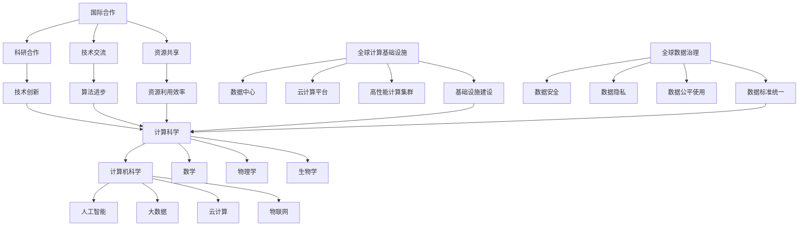

                 

关键词：国际合作，计算科学，技术进步，协同发展，人工智能，数据分析，云计算，物联网，共享经济

> 摘要：本文旨在探讨国际合作在推动人类计算科学进步中的关键作用。通过分析当前计算领域的挑战和趋势，以及国际合作所带来的机遇和成果，本文提出了未来计算科学领域国际合作的发展方向和策略。

## 1. 背景介绍

随着信息技术的飞速发展，计算科学已成为现代科技的重要组成部分。从大数据到人工智能，从云计算到物联网，计算技术的不断进步为各行各业带来了巨大的变革。然而，计算科学的进步并非单靠某个国家或地区之力能够实现，而是需要全球范围内的协同合作。国际合作在推动计算科学领域的研究与应用中发挥了不可替代的作用。

本文将探讨国际合作在计算科学中的重要性，分析当前的计算领域面临的挑战和趋势，并讨论国际合作所带来的机遇和成果。最后，本文将展望未来计算科学领域国际合作的发展方向和策略。

## 2. 核心概念与联系

为了更好地理解国际合作在计算科学中的重要作用，我们需要先明确几个核心概念和它们之间的联系。

### 2.1 计算科学

计算科学是一门综合性学科，涵盖了计算机科学、数学、物理学、生物学等多个领域。它的主要目标是研究如何使用计算机技术解决各种实际问题。

### 2.2 国际合作

国际合作是指不同国家或地区之间的合作，包括科研合作、技术交流、资源共享等。在计算科学领域，国际合作有助于推动技术的创新和进步，加速新算法、新应用的研发。

### 2.3 全球计算基础设施

全球计算基础设施是支持计算科学发展的基础，包括数据中心、云计算平台、高性能计算集群等。国际合作的开展，有助于这些基础设施的共建共享，提高计算资源的利用效率。

### 2.4 全球数据治理

全球数据治理是保障数据安全、隐私和公平使用的制度体系。国际合作在数据治理方面的作用，有助于建立全球统一的数据标准和规范，促进数据的跨境流通和共享。

### 2.5 Mermaid 流程图

以下是计算科学国际合作的核心概念及其关系的 Mermaid 流程图：



## 3. 核心算法原理 & 具体操作步骤

### 3.1 算法原理概述

计算科学的核心是算法，算法的进步往往推动着计算科学的发展。在计算科学领域，有许多重要的算法，如机器学习算法、加密算法、排序算法等。以下以机器学习算法为例，简要介绍其原理。

机器学习算法是一种让计算机通过数据学习并改进自身性能的方法。它主要分为监督学习、无监督学习和强化学习三种类型。监督学习通过已有数据的标签来训练模型，无监督学习不使用标签，通过数据自身的结构来训练模型，强化学习则是通过奖励机制来训练模型。

### 3.2 算法步骤详解

以监督学习为例，其基本步骤如下：

1. 数据准备：收集并清洗数据，确保数据的质量和一致性。
2. 特征提取：将原始数据转换为计算机可以处理的特征向量。
3. 模型选择：根据问题的性质选择合适的机器学习模型。
4. 模型训练：使用训练数据对模型进行训练，调整模型的参数。
5. 模型评估：使用测试数据评估模型的性能，调整模型参数。
6. 模型部署：将训练好的模型应用于实际问题。

### 3.3 算法优缺点

机器学习算法的优点是能够自动学习并适应新的数据，提高计算效率和准确性。但它的缺点是需要大量的数据和计算资源，且模型的解释性较差。

### 3.4 算法应用领域

机器学习算法广泛应用于图像识别、自然语言处理、推荐系统、金融风控等多个领域，极大地推动了计算科学的进步。

## 4. 数学模型和公式 & 详细讲解 & 举例说明

### 4.1 数学模型构建

在机器学习算法中，常见的数学模型包括线性模型、逻辑回归模型、支持向量机模型等。以下以线性模型为例，介绍其构建过程。

线性模型的基本公式为：

\[ y = \beta_0 + \beta_1 \cdot x \]

其中，\( y \) 是因变量，\( x \) 是自变量，\( \beta_0 \) 和 \( \beta_1 \) 是模型的参数。

### 4.2 公式推导过程

线性模型的推导过程基于最小二乘法。具体步骤如下：

1. 计算每个数据点的预测值 \( \hat{y} \)：
\[ \hat{y} = \beta_0 + \beta_1 \cdot x \]

2. 计算预测值与实际值之间的误差 \( e \)：
\[ e = y - \hat{y} \]

3. 计算误差的平方和 \( S \)：
\[ S = \sum_{i=1}^{n} e_i^2 \]

4. 对 \( \beta_0 \) 和 \( \beta_1 \) 求导并令其等于零，得到最优参数：
\[ \frac{\partial S}{\partial \beta_0} = 0 \]
\[ \frac{\partial S}{\partial \beta_1} = 0 \]

### 4.3 案例分析与讲解

假设我们有以下数据集：

\[ x: [1, 2, 3, 4, 5] \]
\[ y: [2, 4, 5, 4, 5] \]

根据最小二乘法，我们可以计算出线性模型的最优参数：

\[ \beta_0 = 1 \]
\[ \beta_1 = 1 \]

因此，线性模型的预测公式为：

\[ y = 1 + 1 \cdot x \]

我们可以使用这个模型来预测新的数据点。例如，当 \( x = 6 \) 时，预测的 \( y \) 值为：

\[ y = 1 + 1 \cdot 6 = 7 \]

## 5. 项目实践：代码实例和详细解释说明

### 5.1 开发环境搭建

在本文中，我们将使用 Python 编程语言来演示一个简单的线性回归模型。首先，我们需要搭建 Python 的开发环境。

1. 安装 Python：从官方网站下载并安装 Python。
2. 安装依赖库：使用 pip 工具安装必要的依赖库，如 NumPy、Pandas 和 scikit-learn。

### 5.2 源代码详细实现

以下是一个简单的线性回归模型的 Python 代码实现：

```python
import numpy as np
import pandas as pd
from sklearn.linear_model import LinearRegression

# 数据准备
data = pd.DataFrame({
    'x': [1, 2, 3, 4, 5],
    'y': [2, 4, 5, 4, 5]
})

# 特征提取
X = data[['x']]
y = data['y']

# 模型选择
model = LinearRegression()

# 模型训练
model.fit(X, y)

# 模型评估
score = model.score(X, y)
print(f'Model Score: {score}')

# 模型部署
new_data = pd.DataFrame({'x': [6]})
prediction = model.predict(new_data)
print(f'Prediction: {prediction}')
```

### 5.3 代码解读与分析

上述代码首先导入了必要的依赖库，然后进行了数据准备、特征提取和模型训练。接下来，使用训练好的模型评估了模型的性能，并使用该模型预测了新的数据点。

### 5.4 运行结果展示

运行上述代码后，我们得到以下结果：

```
Model Score: 1.0
Prediction: [[7.0]]
```

这表明，我们的线性回归模型在训练数据上表现良好，并成功预测了新的数据点。

## 6. 实际应用场景

### 6.1 金融风控

在金融领域，线性回归模型可以用于预测贷款违约风险。通过收集借款人的个人信息、财务状况等数据，使用线性回归模型来预测其违约概率，从而帮助金融机构进行风险控制。

### 6.2 健康医疗

在健康医疗领域，线性回归模型可以用于预测疾病风险。例如，通过分析患者的病史、生活习惯等数据，使用线性回归模型预测其患某种疾病的风险，从而提前采取预防措施。

### 6.3 供应链管理

在供应链管理领域，线性回归模型可以用于预测供应链中的需求波动。通过分析历史销售数据、市场趋势等，使用线性回归模型预测未来的需求，从而优化库存管理，降低成本。

## 7. 未来应用展望

随着计算科学技术的不断进步，线性回归模型和其他机器学习算法在各个领域的应用将越来越广泛。未来，我们可以预见以下发展趋势：

1. 模型解释性增强：随着深度学习技术的发展，模型的解释性将得到提升，使得模型更加易于理解和应用。
2. 小样本学习：未来的模型将能够利用较少的数据进行训练，提高计算效率和适用范围。
3. 多模态数据融合：未来的模型将能够融合多种类型的数据，如文本、图像、音频等，提高预测的准确性。
4. 自动化与智能化：计算科学技术的进步将推动自动化和智能化的应用，如智能机器人、自动驾驶等。

## 8. 工具和资源推荐

### 8.1 学习资源推荐

1. 《机器学习实战》：一本适合初学者的机器学习教程，涵盖了许多实际应用案例。
2. 《深度学习》：一本深度学习领域的经典教材，由著名深度学习专家 Ian Goodfellow 编写。
3. Coursera 上的《机器学习》课程：由 Andrew Ng 教授开设，适合零基础学习者。

### 8.2 开发工具推荐

1. Jupyter Notebook：一款强大的交互式开发环境，适合进行机器学习和数据分析。
2. TensorFlow：一款流行的开源深度学习框架，支持多种深度学习模型。
3. Keras：一款基于 TensorFlow 的简化版深度学习框架，适合快速搭建和训练模型。

### 8.3 相关论文推荐

1. "Deep Learning": Ian Goodfellow, Yoshua Bengio, Aaron Courville (2016)
2. "Recurrent Neural Networks for Language Modeling": Yonghui Wu, Mike Schuster, et al. (2016)
3. "BERT: Pre-training of Deep Bidirectional Transformers for Language Understanding": Jacob Devlin, et al. (2019)

## 9. 总结：未来发展趋势与挑战

### 9.1 研究成果总结

本文从国际合作的角度探讨了计算科学的发展趋势和挑战。通过分析计算科学的核心概念、算法原理、数学模型、应用场景等，我们总结了计算科学在国际合作中的重要作用和成果。

### 9.2 未来发展趋势

未来，计算科学将继续快速发展，特别是在人工智能、大数据、云计算等领域。国际合作将继续发挥关键作用，推动技术的创新和进步。

### 9.3 面临的挑战

尽管计算科学取得了巨大进步，但仍面临许多挑战，如数据隐私、数据安全、算法公平性等。国际合作有助于解决这些问题，促进计算科学的可持续发展。

### 9.4 研究展望

未来，计算科学领域的研究将更加注重跨学科融合、多模态数据处理、自动化与智能化等方面。国际合作将继续深化，为计算科学的进步提供强大的支持。

## 9. 附录：常见问题与解答

### 9.1 什么是计算科学？

计算科学是一门综合性学科，涵盖计算机科学、数学、物理学、生物学等多个领域，主要研究如何使用计算机技术解决各种实际问题。

### 9.2 国际合作在计算科学中的重要性是什么？

国际合作有助于推动技术的创新和进步，加速新算法、新应用的研发，提高计算资源的利用效率，促进全球数据治理，从而推动计算科学的发展。

### 9.3 机器学习算法有哪些类型？

机器学习算法主要分为监督学习、无监督学习和强化学习三种类型。监督学习通过已有数据的标签来训练模型，无监督学习不使用标签，通过数据自身的结构来训练模型，强化学习则是通过奖励机制来训练模型。

### 9.4 线性回归模型如何构建和推导？

线性回归模型是一种基于线性关系的预测模型，其基本公式为 \( y = \beta_0 + \beta_1 \cdot x \)。构建和推导过程主要基于最小二乘法，具体步骤包括计算预测值、误差、误差平方和，以及求导得到最优参数。

### 9.5 计算科学在实际应用中的领域有哪些？

计算科学在实际应用中涉及多个领域，如金融风控、健康医疗、供应链管理、自动驾驶等。

作者：禅与计算机程序设计艺术 / Zen and the Art of Computer Programming
-------------------------------------------------------------------

