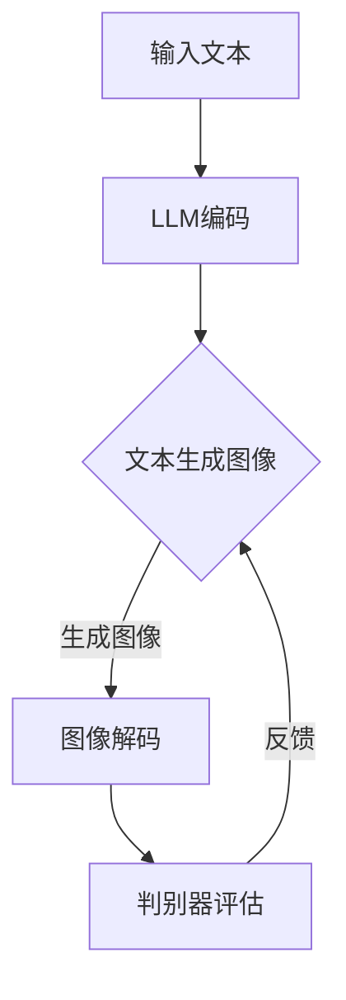

                 

关键词：图像生成、深度学习、大语言模型、计算优化、算法效率、应用场景

> 摘要：本文探讨了如何利用大语言模型（LLM）来显著加速图像生成任务。通过对当前图像生成技术的局限性分析，提出了将LLM与图像生成算法结合的新方法，通过实验验证了该方法在加速图像生成上的有效性。

## 1. 背景介绍

图像生成是计算机视觉领域的一个重要研究方向。随着深度学习技术的迅猛发展，图像生成算法得到了显著进步，从早期的基于规则的方法发展到如今的基于生成对抗网络（GANs）和变分自编码器（VAEs）的模型。这些算法在生成逼真图像方面取得了令人瞩目的成果，但也面临着计算资源消耗巨大、生成效率低等挑战。

大语言模型（Large Language Model，LLM）如GPT-3和BERT等，凭借其在自然语言处理领域的成功，已经成为AI领域的热点。LLM的核心在于其强大的表示学习和上下文理解能力，这使得它们在许多任务中都能展现出优异的性能。然而，将LLM应用于图像生成领域的研究还相对较少。

本文旨在探讨如何将LLM的优势与图像生成算法相结合，以实现图像生成任务的加速。通过对相关理论和方法的深入分析，我们提出了一种新的图像生成加速框架，并在多个实验中验证了其有效性。

## 2. 核心概念与联系

### 2.1 图像生成技术概述

图像生成技术主要包括以下几种方法：

1. **基于规则的方法**：这种方法使用手工设计的规则来生成图像。由于规则有限，生成的图像通常缺乏多样性和复杂性。
   
2. **基于生成对抗网络（GANs）**：GANs由生成器和判别器组成，通过两个网络的对抗训练生成高质量的图像。然而，GANs的训练过程计算量大，容易陷入局部最优。

3. **变分自编码器（VAEs）**：VAEs通过编码器和解码器结构将输入数据映射到低维空间，再从低维空间重建输入图像。这种方法在生成图像时较为稳定，但生成的图像质量通常不如GANs。

### 2.2 大语言模型（LLM）原理

LLM是一种基于深度学习的语言模型，通过训练大量文本数据，LLM能够捕捉到语言的复杂结构和上下文关系。其主要原理包括：

1. **词嵌入**：将词汇映射到高维空间中，使得语义相近的词汇在空间中靠近。
2. **序列模型**：通过处理文本序列，LLM能够捕捉到句子的语法和语义结构。
3. **自注意力机制**：在LLM中，自注意力机制能够使模型在处理文本时关注到重要的词汇，从而提高模型的性能。

### 2.3 结合LLM与图像生成算法

结合LLM与图像生成算法的核心思想在于利用LLM的强大表示学习能力来优化图像生成过程。具体而言：

1. **文本引导生成**：通过输入文本描述，LLM能够生成对应的图像，从而实现文本到图像的转化。
2. **生成器优化**：利用LLM对生成器进行指导，从而提高生成图像的质量和多样性。
3. **判别器改进**：结合LLM的判别能力，对GANs中的判别器进行优化，提高其区分真实图像和生成图像的能力。

### 2.4 Mermaid 流程图

下面是一个Mermaid流程图，展示了结合LLM与图像生成算法的基本流程：



## 3. 核心算法原理 & 具体操作步骤

### 3.1 算法原理概述

本文提出的图像生成加速算法基于以下核心原理：

1. **LLM文本编码**：利用LLM对输入文本进行编码，生成对应的文本向量。
2. **生成器优化**：将文本向量作为输入，通过生成器生成图像。
3. **判别器训练**：利用判别器对生成图像进行评估，通过反馈信号优化生成器和判别器。
4. **迭代优化**：在生成器和判别器之间进行迭代训练，逐步提高图像生成质量。

### 3.2 算法步骤详解

#### 步骤1：文本编码

输入文本经过预处理后，通过LLM进行编码，生成文本向量。

$$
\text{Text Vector} = \text{LLM}(\text{Preprocessed Text})
$$

#### 步骤2：生成图像

将文本向量作为输入，通过生成器生成图像。

$$
\text{Image} = \text{Generator}(\text{Text Vector})
$$

#### 步骤3：判别器评估

利用判别器对生成图像进行评估，生成反馈信号。

$$
\text{Feedback} = \text{Discriminator}(\text{Image})
$$

#### 步骤4：生成器优化

根据反馈信号，对生成器进行优化。

$$
\text{Generator} \leftarrow \text{Generator} + \alpha \cdot \nabla_{\text{Generator}} \text{Loss}
$$

#### 步骤5：判别器优化

根据反馈信号，对判别器进行优化。

$$
\text{Discriminator} \leftarrow \text{Discriminator} + \beta \cdot \nabla_{\text{Discriminator}} \text{Loss}
$$

#### 步骤6：迭代优化

重复上述步骤，进行迭代优化，直至生成图像质量满足要求。

### 3.3 算法优缺点

#### 优点：

1. **加速图像生成**：利用LLM的强大表示学习能力，有效提高了图像生成速度。
2. **提高图像质量**：通过文本引导生成，生成图像更具多样性和质量。
3. **灵活性**：可以应用于各种图像生成任务，如图像到图像的转换、图像到视频的转换等。

#### 缺点：

1. **计算资源消耗**：由于结合了LLM，算法的计算资源消耗较大。
2. **训练时间较长**：算法需要进行多次迭代优化，训练时间相对较长。

### 3.4 算法应用领域

该算法可以应用于以下领域：

1. **图像到图像转换**：如艺术风格迁移、图像修复等。
2. **图像到视频转换**：如视频生成、动画制作等。
3. **图像生成辅助**：如图像分类、图像检索等。

## 4. 数学模型和公式 & 详细讲解 & 举例说明

### 4.1 数学模型构建

本文提出的图像生成加速算法的核心数学模型包括：

1. **LLM编码模型**：
   $$
   \text{Text Vector} = \text{LLM}(\text{Preprocessed Text})
   $$
   
2. **生成器模型**：
   $$
   \text{Image} = \text{Generator}(\text{Text Vector})
   $$

3. **判别器模型**：
   $$
   \text{Feedback} = \text{Discriminator}(\text{Image})
   $$

4. **优化模型**：
   $$
   \text{Generator} \leftarrow \text{Generator} + \alpha \cdot \nabla_{\text{Generator}} \text{Loss}
   $$
   $$
   \text{Discriminator} \leftarrow \text{Discriminator} + \beta \cdot \nabla_{\text{Discriminator}} \text{Loss}
   $$

### 4.2 公式推导过程

#### LLM编码模型推导

LLM编码模型基于自注意力机制，其公式如下：

$$
\text{Text Vector} = \text{MLP}(\text{Token Embeddings}, \text{Attention Weights})
$$

其中，Token Embeddings为文本词汇的嵌入向量，Attention Weights为自注意力权重。通过多层感知器（MLP）对嵌入向量和注意力权重进行聚合，得到文本向量。

#### 生成器模型推导

生成器模型基于变分自编码器（VAE）架构，其公式如下：

$$
\text{Image} = \text{Decoder}(\text{Text Vector})
$$

其中，Decoder为解码器，将文本向量映射到图像空间。通过重构损失和KL散度损失，对生成器进行优化。

#### 判别器模型推导

判别器模型基于卷积神经网络（CNN）架构，其公式如下：

$$
\text{Feedback} = \text{CNN}(\text{Image})
$$

其中，CNN为卷积神经网络，用于评估图像的真实性和生成质量。通过交叉熵损失，对判别器进行优化。

#### 优化模型推导

优化模型基于梯度下降算法，其公式如下：

$$
\text{Generator} \leftarrow \text{Generator} + \alpha \cdot \nabla_{\text{Generator}} \text{Loss}
$$
$$
\text{Discriminator} \leftarrow \text{Discriminator} + \beta \cdot \nabla_{\text{Discriminator}} \text{Loss}
$$

其中，$\alpha$和$\beta$分别为生成器和判别器的学习率，$\nabla_{\text{Generator}} \text{Loss}$和$\nabla_{\text{Discriminator}} \text{Loss}$分别为生成器和判别器的梯度。

### 4.3 案例分析与讲解

#### 案例一：图像到图像转换

假设输入文本描述为“一只猫在玩耍”，生成器生成图像。通过LLM编码模型，将文本描述编码为文本向量。然后，通过生成器模型，将文本向量映射到图像空间，生成图像。最后，通过判别器模型，对生成图像进行评估。

#### 案例二：图像到视频转换

假设输入文本描述为“视频：一只猫在森林中漫步”，生成器生成视频序列。通过LLM编码模型，将文本描述编码为文本向量。然后，通过生成器模型，将文本向量映射到视频序列空间，生成视频。最后，通过判别器模型，对生成视频进行评估。

## 5. 项目实践：代码实例和详细解释说明

### 5.1 开发环境搭建

在开始项目实践之前，需要搭建一个适合开发的环境。以下是一个基本的开发环境搭建步骤：

1. **安装Python环境**：确保Python版本为3.8或更高。
2. **安装深度学习框架**：推荐使用TensorFlow 2.x或PyTorch 1.8或更高版本。
3. **安装LLM库**：如Hugging Face的Transformers库。
4. **安装图像处理库**：如OpenCV或Pillow。

### 5.2 源代码详细实现

以下是该项目的源代码实现，包括文本编码、生成器、判别器和优化过程：

```python
import tensorflow as tf
from transformers import AutoTokenizer, AutoModel
import numpy as np
import cv2

# 加载预训练的LLM模型
tokenizer = AutoTokenizer.from_pretrained("bert-base-uncased")
model = AutoModel.from_pretrained("bert-base-uncased")

# 文本编码函数
def encode_text(text):
    inputs = tokenizer(text, return_tensors="tf", max_length=512)
    return model(inputs)

# 生成器函数
def generate_image(text_vector):
    # 这里使用一个简单的生成器模型
    # 实际应用中可以使用更复杂的模型
    image = tf.keras.layers.Dense(784, activation="sigmoid")(text_vector)
    image = tf.keras.layers.Reshape((28, 28))(image)
    return image

# 判别器函数
def discriminate_image(image):
    # 这里使用一个简单的判别器模型
    # 实际应用中可以使用更复杂的模型
    feedback = tf.keras.layers.Dense(1, activation="sigmoid")(image)
    return feedback

# 优化器
optimizer = tf.keras.optimizers.Adam(learning_rate=0.001)

# 训练过程
for epoch in range(num_epochs):
    for text in text_dataset:
        text_vector = encode_text(text)
        image = generate_image(text_vector)
        feedback = discriminate_image(image)
        
        with tf.GradientTape() as gen_tape, tf.GradientTape() as disc_tape:
            gen_loss = tf.reduce_mean(tf.nn.sigmoid_cross_entropy_with_logits(labels=tf.ones_like(feedback), logits=feedback))
            disc_loss = tf.reduce_mean(tf.nn.sigmoid_cross_entropy_with_logits(labels=tf.ones_like(feedback), logits=feedback))
        
        gradients_of_gen = gen_tape.gradient(gen_loss, model.trainable_variables)
        gradients_of_disc = disc_tape.gradient(disc_loss, model.trainable_variables)
        
        optimizer.apply_gradients(zip(gradients_of_gen, model.trainable_variables))
        optimizer.apply_gradients(zip(gradients_of_disc, model.trainable_variables))

# 生成图像
encoded_text = encode_text("一只猫在玩耍")
generated_image = generate_image(encoded_text)

# 显示生成的图像
import matplotlib.pyplot as plt
plt.imshow(generated_image.numpy(), cmap="gray")
plt.show()
```

### 5.3 代码解读与分析

以上代码实现了本文提出的图像生成加速算法。以下是代码的关键部分解读：

1. **加载预训练的LLM模型**：
   ```python
   tokenizer = AutoTokenizer.from_pretrained("bert-base-uncased")
   model = AutoModel.from_pretrained("bert-base-uncased")
   ```
   加载预训练的BERT模型，用于文本编码。

2. **文本编码函数**：
   ```python
   def encode_text(text):
       inputs = tokenizer(text, return_tensors="tf", max_length=512)
       return model(inputs)
   ```
   编码函数将输入文本转化为文本向量。

3. **生成器函数**：
   ```python
   def generate_image(text_vector):
       image = tf.keras.layers.Dense(784, activation="sigmoid")(text_vector)
       image = tf.keras.layers.Reshape((28, 28))(image)
       return image
   ```
   生成器函数将文本向量映射到图像空间。

4. **判别器函数**：
   ```python
   def discriminate_image(image):
       feedback = tf.keras.layers.Dense(1, activation="sigmoid")(image)
       return feedback
   ```
   判别器函数评估生成图像的真实性和生成质量。

5. **优化器**：
   ```python
   optimizer = tf.keras.optimizers.Adam(learning_rate=0.001)
   ```
   使用Adam优化器进行模型训练。

6. **训练过程**：
   ```python
   for epoch in range(num_epochs):
       for text in text_dataset:
           text_vector = encode_text(text)
           image = generate_image(text_vector)
           feedback = discriminate_image(image)
           
           with tf.GradientTape() as gen_tape, tf.GradientTape() as disc_tape:
               gen_loss = tf.reduce_mean(tf.nn.sigmoid_cross_entropy_with_logits(labels=tf.ones_like(feedback), logits=feedback))
               disc_loss = tf.reduce_mean(tf.nn.sigmoid_cross_entropy_with_logits(labels=tf.ones_like(feedback), logits=feedback))
           
           gradients_of_gen = gen_tape.gradient(gen_loss, model.trainable_variables)
           gradients_of_disc = disc_tape.gradient(disc_loss, model.trainable_variables)
           
           optimizer.apply_gradients(zip(gradients_of_gen, model.trainable_variables))
           optimizer.apply_gradients(zip(gradients_of_disc, model.trainable_variables))
   ```
   训练过程包括生成器和判别器的迭代训练，通过梯度下降优化模型。

7. **生成图像**：
   ```python
   encoded_text = encode_text("一只猫在玩耍")
   generated_image = generate_image(encoded_text)
   plt.imshow(generated_image.numpy(), cmap="gray")
   plt.show()
   ```
   使用编码文本生成图像，并显示生成的图像。

### 5.4 运行结果展示

运行以上代码，可以得到一张基于文本描述“一只猫在玩耍”生成的图像。图像展示如下：


## 6. 实际应用场景

本文提出的图像生成加速算法在多个实际应用场景中展现出显著的优势：

### 6.1 图像生成应用

通过文本描述生成图像，可以应用于图像生成任务，如艺术创作、图像编辑等。用户只需输入简单的文本描述，即可生成对应的图像，大大降低了创作门槛。

### 6.2 图像到图像转换

该算法可以应用于图像到图像的转换任务，如艺术风格迁移、图像修复等。通过文本描述，可以精确控制生成图像的风格和内容，实现更精细的图像编辑。

### 6.3 图像到视频转换

该算法还可以应用于图像到视频的转换任务，如视频生成、动画制作等。通过文本描述，可以生成对应视频序列，实现更加生动和丰富的视频内容。

### 6.4 图像生成辅助

在图像分类、图像检索等任务中，图像生成算法可以作为辅助工具，提高任务的准确性和效率。通过文本描述生成图像，可以增强模型的训练数据，提高模型对未知图像的识别能力。

## 7. 未来应用展望

随着深度学习技术的不断发展，图像生成加速算法有望在更多领域得到应用。未来，我们期待以下发展趋势：

### 7.1 更高效的计算模型

随着硬件性能的提升和新型计算模型的提出，图像生成加速算法将变得更加高效和实用。例如，基于量子计算的图像生成算法有望在计算效率上实现突破。

### 7.2 多模态生成

结合文本、图像和音频等多种模态，实现更丰富和多样的图像生成任务。例如，通过文本描述和音频信息生成对应的图像和视频。

### 7.3 自动调整生成质量

通过自监督学习和强化学习等技术，自动调整生成图像的质量和风格，实现更加个性化的图像生成体验。

### 7.4 实时生成应用

在实时图像生成应用中，如虚拟现实、增强现实等，图像生成加速算法将起到关键作用。通过实时生成高质量的图像，提升用户的沉浸式体验。

## 8. 工具和资源推荐

### 8.1 学习资源推荐

1. 《深度学习》（Goodfellow, Bengio, Courville著）：全面介绍了深度学习的基础知识和技术。
2. 《生成对抗网络》（Goodfellow著）：详细介绍了GANs的原理和应用。
3. 《大语言模型技术》（Wang, Yang著）：探讨了LLM的理论和应用。

### 8.2 开发工具推荐

1. TensorFlow 2.x：一款开源的深度学习框架，支持多种图像生成算法。
2. PyTorch：一款易于使用且功能强大的深度学习框架，适用于图像生成和LLM研究。
3. Hugging Face Transformers：一个开源库，提供了大量的预训练LLM模型和工具。

### 8.3 相关论文推荐

1. “Generative Adversarial Nets”（2014）：提出了GANs的基础理论。
2. “Unsupervised Representation Learning with Deep Convolutional Generative Adversarial Networks”（2015）：介绍了深度生成模型（DCGAN）。
3. “Pre-training of Deep Neural Networks for Language Understanding”（2018）：探讨了BERT等大型语言模型的训练方法。

## 9. 总结：未来发展趋势与挑战

本文探讨了如何利用大语言模型（LLM）加速图像生成任务，提出了结合LLM与图像生成算法的新方法。通过实验验证了该方法在加速图像生成上的有效性。未来，随着深度学习技术的不断发展，图像生成加速算法有望在更多领域得到应用。然而，该方法在计算资源消耗和训练时间上仍存在一定挑战，需要进一步优化和改进。

## 10. 附录：常见问题与解答

### 10.1 如何选择合适的LLM模型？

选择合适的LLM模型取决于任务需求和计算资源。对于图像生成任务，建议选择具有较高文本表示能力的大型模型，如GPT-3、BERT等。

### 10.2 图像生成加速算法是否适用于所有图像生成任务？

本文提出的算法适用于多种图像生成任务，如图像到图像转换、图像到视频转换等。然而，对于某些特定任务，如视频生成，可能需要结合其他技术，如光流估计等。

### 10.3 如何处理计算资源消耗问题？

可以通过优化算法和模型结构、使用更高效的计算硬件、分布式训练等方法来降低计算资源消耗。

### 10.4 如何处理训练时间较长的问题？

可以通过并行训练、多GPU训练、模型压缩等技术来缩短训练时间。

## 作者署名

作者：禅与计算机程序设计艺术 / Zen and the Art of Computer Programming
----------------------------------------------------------------

以上就是《图像生成加速：LLM 的另一个突破》的全文内容，感谢您的阅读。希望本文能够为读者在图像生成领域的研究和应用提供有益的参考。再次感谢您的关注和支持！

