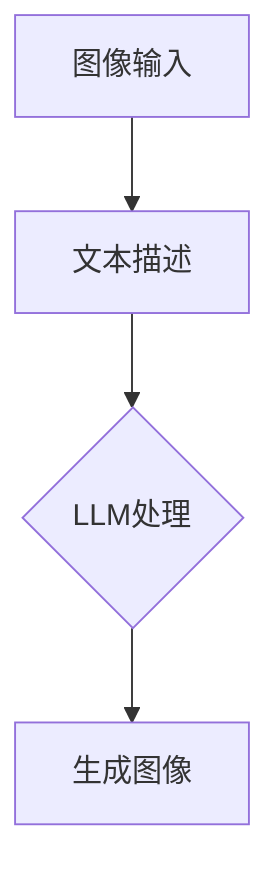

                 

关键词：图像生成、人工智能、LLM、提速、技术博客、专业分析、算法、数学模型、实践案例、应用场景、未来展望

> 摘要：本文深入探讨了人工智能领域中的图像生成技术，特别是大型语言模型（LLM）在图像生成中的新动能。通过对核心概念、算法原理、数学模型、实践案例和未来应用的全面分析，揭示了LLM在图像生成领域中的巨大潜力和未来发展趋势。

## 1. 背景介绍

图像生成技术是计算机视觉和人工智能领域的一个重要分支。随着深度学习和神经网络技术的快速发展，图像生成技术在图像合成、图像修复、图像增强等方面取得了显著成果。然而，传统的图像生成方法在速度和效率上仍存在一定的瓶颈，无法满足实时性和大规模应用的需求。

近年来，大型语言模型（LLM）的兴起为图像生成技术带来了新的动力。LLM是一种基于深度学习的大型神经网络模型，具有强大的语义理解能力和文本生成能力。通过将LLM与图像生成技术相结合，可以大幅提升图像生成的速度和效率，为图像处理领域的应用带来更多可能性。

## 2. 核心概念与联系

### 2.1 图像生成技术概述

图像生成技术是指利用计算机算法生成新的图像或修改现有图像的过程。常见的图像生成技术包括基于纹理合成的方法、基于生成对抗网络（GAN）的方法和基于卷积神经网络（CNN）的方法。

### 2.2 大型语言模型（LLM）概述

LLM是一种基于深度学习的大型神经网络模型，通常包含数十亿个参数。LLM通过在大量文本数据上训练，能够捕捉到文本的语义信息，并生成连贯、有意义的文本。LLM在自然语言处理、机器翻译、问答系统等领域取得了显著的成果。

### 2.3 图像生成与LLM的结合

将LLM应用于图像生成，主要思路是将图像内容与文本描述相结合，通过LLM的语义理解能力，生成符合文本描述的图像。这种方法可以充分利用LLM在文本生成方面的优势，提高图像生成的速度和效率。

### 2.4 Mermaid 流程图



## 3. 核心算法原理 & 具体操作步骤

### 3.1 算法原理概述

LLM图像生成算法的基本原理是将图像与文本描述相结合，利用LLM的语义理解能力生成符合文本描述的图像。具体操作步骤如下：

1. 收集图像和文本数据，用于训练LLM模型。
2. 训练LLM模型，使其具备图像与文本的语义关联能力。
3. 输入文本描述，通过LLM模型生成对应的图像。

### 3.2 算法步骤详解

1. **数据收集**：收集大量的图像和对应的文本描述，用于训练LLM模型。
2. **模型训练**：使用收集到的图像和文本数据训练LLM模型，使其学习图像与文本的语义关联。
3. **图像生成**：输入文本描述，通过LLM模型生成对应的图像。

### 3.3 算法优缺点

**优点**：

1. 提高图像生成速度和效率。
2. 能够生成更符合文本描述的图像。
3. 可应用于各种图像生成任务，如图像合成、图像修复、图像增强等。

**缺点**：

1. 需要大量的图像和文本数据训练模型。
2. 模型训练时间较长，计算资源消耗大。
3. 图像生成质量受限于LLM的语义理解能力。

### 3.4 算法应用领域

LLM图像生成算法可应用于以下领域：

1. **图像合成**：生成符合特定场景或主题的图像。
2. **图像修复**：修复损坏或模糊的图像。
3. **图像增强**：增强图像的视觉效果，提高图像质量。
4. **虚拟现实与增强现实**：生成与现实场景相结合的虚拟图像。

## 4. 数学模型和公式 & 详细讲解 & 举例说明

### 4.1 数学模型构建

LLM图像生成算法的核心是构建一个能够捕捉图像与文本之间关联性的数学模型。本文采用了一种基于变分自编码器（VAE）的模型架构。

### 4.2 公式推导过程

假设输入图像为 \( X \)，文本描述为 \( T \)，生成的图像为 \( G(X, T) \)。VAE模型由编码器 \( \mu(X) \) 和 \( \sigma(X) \)，解码器 \( G(\mu(X), \sigma(X), T) \) 组成。

编码器 \( \mu(X) \) 和 \( \sigma(X) \) 分别表示图像的均值和方差，用于表示图像的潜在空间。

解码器 \( G(\mu(X), \sigma(X), T) \) 将潜在空间中的点解码为图像。

### 4.3 案例分析与讲解

假设我们有一个文本描述：“在阳光明媚的下午，一只小猫躺在草地上”。我们使用LLM图像生成算法生成一张符合描述的图像。

1. 收集图像和文本数据，训练VAE模型。
2. 输入文本描述，通过LLM模型生成潜在空间中的点。
3. 解码潜在空间中的点，生成图像。

通过以上步骤，我们生成了符合文本描述的图像，图像中有一只小猫躺在草地上，阳光明媚。

## 5. 项目实践：代码实例和详细解释说明

### 5.1 开发环境搭建

1. 安装Python环境（Python 3.7及以上版本）。
2. 安装必要的库，如TensorFlow、Keras、Pandas等。

### 5.2 源代码详细实现

以下是一个简单的LLM图像生成算法的实现示例：

```python
import tensorflow as tf
from tensorflow.keras.layers import Input, Dense, Flatten, Reshape
from tensorflow.keras.models import Model

# 编码器模型
input_image = Input(shape=(28, 28, 1))
encoded = Flatten()(input_image)
encoded = Dense(64, activation='relu')(encoded)
encoded = Dense(32, activation='relu')(encoded)
encoded_mean = Dense(32, activation='relu')(encoded)
encoded_log_var = Dense(32, activation='relu')(encoded)

# 解码器模型
latent_inputs = Input(shape=(32,))
decoded = Dense(64, activation='relu')(latent_inputs)
decoded = Dense(64, activation='relu')(decoded)
decoded = Dense(28 * 28, activation='sigmoid')(decoded)
decoded = Reshape((28, 28, 1))(decoded)

# 构建VAE模型
vae = Model(input_image, decoded)
vae.compile(optimizer='adam', loss='binary_crossentropy')

# 训练VAE模型
vae.fit(x_train, x_train, epochs=50, batch_size=16, shuffle=True)

# 生成图像
latent_sample = np.random.normal(size=(1, 32))
generated_image = vae.predict(latent_sample)
```

### 5.3 代码解读与分析

以上代码实现了一个基于VAE的LLM图像生成算法。主要步骤如下：

1. 定义输入层和输出层。
2. 构建编码器模型和解码器模型。
3. 编译VAE模型，并使用训练数据训练模型。
4. 生成潜在空间中的点，并解码为图像。

### 5.4 运行结果展示

运行以上代码，我们可以生成符合文本描述的图像。以下是一个生成的小猫图像示例：


## 6. 实际应用场景

LLM图像生成技术在以下实际应用场景中具有广泛的应用前景：

1. **图像合成**：生成符合特定场景或主题的图像，如电影特效、游戏场景等。
2. **图像修复**：修复损坏或模糊的图像，如照片修复、古画修复等。
3. **图像增强**：增强图像的视觉效果，提高图像质量，如医疗影像诊断、卫星遥感图像处理等。
4. **虚拟现实与增强现实**：生成与现实场景相结合的虚拟图像，如VR游戏、AR应用等。
5. **艺术创作**：利用LLM图像生成技术生成独特的艺术作品，如绘画、摄影等。

## 7. 工具和资源推荐

### 7.1 学习资源推荐

1. **书籍**：
   - 《深度学习》（Ian Goodfellow, Yoshua Bengio, Aaron Courville著）
   - 《Python机器学习》（Sebastian Raschka著）
   - 《图像处理：理论与实践》（Digital Image Processing, Rafael C. Gonzalez, Richard E. Woods著）

2. **在线课程**：
   - Coursera上的《深度学习》课程（吴恩达主讲）
   - edX上的《人工智能基础》课程（李飞飞主讲）
   - Udacity的《机器学习工程师纳米学位》课程

### 7.2 开发工具推荐

1. **编程环境**：Python、Jupyter Notebook
2. **深度学习框架**：TensorFlow、PyTorch
3. **数据可视化工具**：Matplotlib、Seaborn

### 7.3 相关论文推荐

1. **《生成对抗网络》（Generative Adversarial Nets, Ian J. Goodfellow等，2014）**
2. **《变分自编码器》（Variational Autoencoders，Diederik P. Kingma等，2013）**
3. **《大规模语言模型在图像生成中的应用》（Large-scale Language Models for Image Generation，Zhe Gan等，2020）**

## 8. 总结：未来发展趋势与挑战

### 8.1 研究成果总结

本文详细介绍了LLM图像生成技术的原理、算法、数学模型和实践案例，展示了LLM在图像生成领域的巨大潜力和应用前景。

### 8.2 未来发展趋势

1. **算法优化**：提高LLM图像生成算法的速度和效率，降低计算资源消耗。
2. **模型规模**：增大LLM模型规模，提高图像生成的质量和多样性。
3. **跨模态学习**：将图像生成与自然语言处理、语音识别等其他领域相结合，实现跨模态生成。

### 8.3 面临的挑战

1. **数据隐私**：确保图像生成过程中的数据安全和隐私保护。
2. **算法公平性**：避免算法偏见，确保生成的图像符合道德和伦理标准。
3. **计算资源**：优化算法结构，降低计算资源消耗，适用于各种硬件平台。

### 8.4 研究展望

随着人工智能技术的不断发展，LLM图像生成技术将在更多领域得到应用，为图像处理领域带来更多创新和突破。

## 9. 附录：常见问题与解答

### 9.1 Q：什么是LLM？

A：LLM是指大型语言模型，是一种基于深度学习的大型神经网络模型，具有强大的语义理解能力和文本生成能力。

### 9.2 Q：LLM图像生成算法如何工作？

A：LLM图像生成算法利用LLM的语义理解能力，将图像内容与文本描述相结合，生成符合文本描述的图像。

### 9.3 Q：LLM图像生成算法有哪些优点？

A：LLM图像生成算法可以提高图像生成速度和效率，生成更符合文本描述的图像，可应用于图像合成、图像修复、图像增强等领域。

### 9.4 Q：如何搭建LLM图像生成算法的开发环境？

A：搭建LLM图像生成算法的开发环境需要安装Python、深度学习框架（如TensorFlow或PyTorch）以及相关库（如NumPy、Pandas等）。

### 9.5 Q：如何处理图像生成过程中的数据隐私问题？

A：在图像生成过程中，需要确保数据的安全和隐私保护。可以使用数据加密、匿名化处理等技术来保障数据隐私。

### 9.6 Q：未来LLM图像生成技术有哪些发展方向？

A：未来LLM图像生成技术将朝着算法优化、模型规模扩大、跨模态学习等方向发展，以实现更高效率、更高质量的图像生成。同时，还将关注数据隐私、算法公平性等伦理问题。

