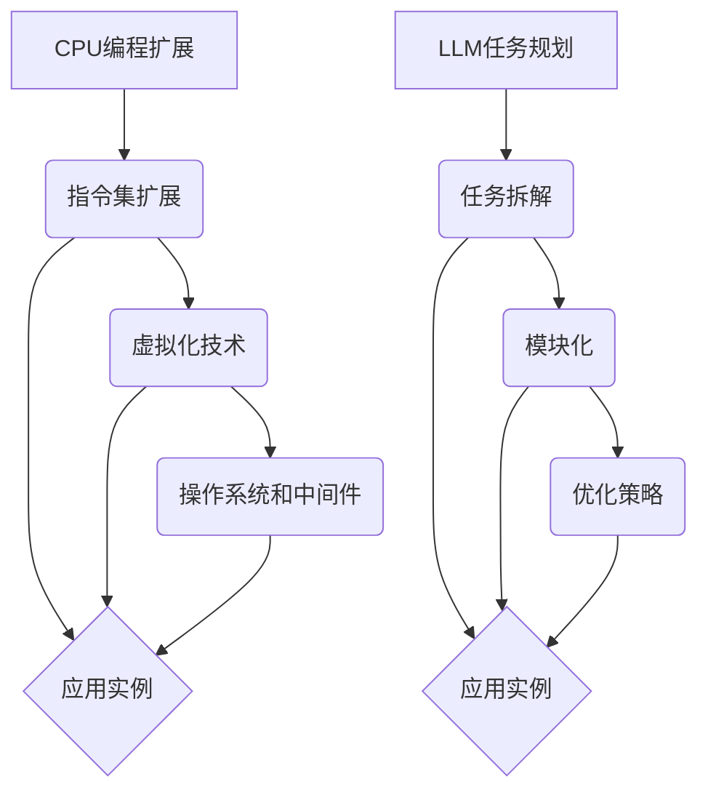

                 

## 1. 背景介绍

在计算机科学领域，"图灵完备"（Turing completeness）是一个关键概念，它定义了一种计算模型是否能够模拟任何其他图灵机。图灵机是由数学家艾伦·图灵在20世纪30年代提出的，它是理论上能够执行任何计算过程的最简单计算模型。如果一个计算模型能够执行图灵机能够执行的所有计算，那么这个模型就是图灵完备的。

### 为什么图灵完备很重要？

图灵完备性的概念在计算机科学中具有重要地位，原因有以下几点：

1. **理论基石**：图灵完备性为计算理论和算法设计提供了基础。它帮助我们理解计算机能做什么，不能做什么。
2. **通用性**：许多现代计算机系统都是图灵完备的，这意味着它们能够执行任何可计算的任务。
3. **实际应用**：图灵完备性在软件开发、人工智能、数据科学等领域都有广泛的应用。

### 本文目标

本文将探讨两个核心概念：CPU如何通过编程扩展其功能，以及大型语言模型（LLM）如何通过任务规划来扩展其能力。我们将深入分析这些概念，提供详细的算法原理、数学模型、项目实践，并探讨其实际应用和未来发展趋势。

## 2. 核心概念与联系

### 2.1 图灵机的概念

图灵机是一个抽象的计算模型，由一个无限长的带子组成，带子上有离散的符号。图灵机有一个读写头，可以在带子上左右移动，并在当前位置上读取和写入符号。图灵机的操作基于以下四个规则：

1. **当前状态**：当前图灵机所处的状态。
2. **当前读入的符号**：读写头当前下方的符号。
3. **下一个状态**：根据当前状态和当前读入的符号，图灵机将转移到的新状态。
4. **读写操作**：图灵机将在当前位置进行写操作（替换符号）或移动读写头（不写操作）。

### 2.2 CPU的编程扩展

CPU（中央处理器）是计算机的核心部件，负责执行计算机程序中的指令。尽管CPU设计之初是为了执行特定的指令集，但通过编程，我们可以扩展其功能：

1. **指令集扩展**：通过编写汇编代码或编译高级语言，我们可以为CPU添加新的指令，从而扩展其功能。
2. **虚拟化技术**：虚拟化技术使得CPU可以在同一时间内模拟多个虚拟CPU，从而提高资源利用率和扩展功能。
3. **操作系统和中间件**：操作系统和中间件可以通过调度和管理任务，使得CPU能够执行更复杂的任务。

### 2.3 LLM的任务规划

大型语言模型（LLM）是人工智能领域的重要成果，能够处理和理解自然语言。LLM通过任务规划来扩展其能力：

1. **任务拆解**：LLM可以将复杂任务分解成多个子任务，以便更好地管理和处理。
2. **模块化**：通过模块化设计，LLM可以将不同的功能模块组合起来，以实现更复杂的任务。
3. **优化策略**：LLM可以通过优化策略来提高任务处理效率和性能。

### 2.4 Mermaid 流程图

以下是描述CPU编程扩展和LLM任务规划的Mermaid流程图：



## 3. 核心算法原理 & 具体操作步骤

### 3.1 算法原理概述

CPU编程扩展的核心原理在于通过编程来增加CPU的功能。具体来说，这个过程包括：

1. **指令集扩展**：通过编写汇编代码或编译高级语言，我们可以为CPU添加新的指令。
2. **虚拟化技术**：通过虚拟化技术，CPU可以在同一时间内模拟多个虚拟CPU。
3. **操作系统和中间件**：操作系统和中间件通过调度和管理任务，使得CPU能够执行更复杂的任务。

LLM任务规划的核心原理在于通过任务拆解、模块化和优化策略来扩展LLM的能力。具体来说，这个过程包括：

1. **任务拆解**：将复杂任务分解成多个子任务，以便更好地管理和处理。
2. **模块化**：通过模块化设计，将不同的功能模块组合起来，以实现更复杂的任务。
3. **优化策略**：通过优化策略来提高任务处理效率和性能。

### 3.2 算法步骤详解

#### 3.2.1 CPU编程扩展

1. **编写汇编代码或编译高级语言**：首先，我们需要编写汇编代码或编译高级语言，以定义新的指令或功能。
2. **编译和链接**：将汇编代码或高级语言编译成机器代码，然后进行链接，生成可执行的二进制文件。
3. **加载和执行**：将可执行的二进制文件加载到CPU中，并执行其中的指令。

#### 3.2.2 虚拟化技术

1. **创建虚拟机**：首先，我们需要创建一个虚拟机，以便在CPU上模拟多个虚拟CPU。
2. **分配资源**：根据需要，为每个虚拟机分配CPU时间、内存和其他资源。
3. **调度和管理**：通过调度和管理，确保每个虚拟机都能够公平地使用资源，并执行任务。

#### 3.2.3 操作系统和中间件

1. **任务调度**：操作系统和中间件通过调度算法，决定哪些任务将被执行。
2. **资源管理**：操作系统和中间件负责管理和分配系统资源，如CPU时间、内存和网络带宽。
3. **并发处理**：操作系统和中间件支持并发处理，允许多个任务同时执行。

#### 3.2.4 LLM任务规划

1. **任务拆解**：将复杂任务分解成多个子任务，以便更好地管理和处理。
2. **模块化设计**：设计不同的功能模块，以便将任务分解后的子任务分配给不同的模块处理。
3. **优化策略**：通过优化策略，如并行处理、负载均衡和缓存技术，提高任务处理效率和性能。

### 3.3 算法优缺点

#### 3.3.1 CPU编程扩展

**优点**：
1. **灵活性**：通过编程扩展，我们可以根据需要为CPU添加新的功能。
2. **定制化**：编程扩展允许我们根据特定应用场景定制CPU功能。

**缺点**：
1. **复杂性**：编程扩展需要高级编程技能和深厚的计算机科学知识。
2. **性能开销**：编译和链接过程可能引入额外的性能开销。

#### 3.3.2 虚拟化技术

**优点**：
1. **资源利用**：虚拟化技术可以提高资源利用率，允许在同一时间内模拟多个虚拟CPU。
2. **隔离性**：虚拟化技术提供了良好的隔离性，使得虚拟机之间不会相互干扰。

**缺点**：
1. **性能开销**：虚拟化技术可能引入额外的性能开销，降低系统整体性能。
2. **管理复杂性**：虚拟化技术增加了系统管理的复杂性。

#### 3.3.3 操作系统和中间件

**优点**：
1. **任务调度**：操作系统和中间件提供了高效的任务调度机制，确保系统资源得到充分利用。
2. **并发处理**：操作系统和中间件支持并发处理，提高了系统吞吐量。

**缺点**：
1. **资源占用**：操作系统和中间件可能占用大量系统资源，影响其他任务的执行。
2. **维护成本**：操作系统和中间件的维护成本较高，需要持续更新和优化。

#### 3.3.4 LLM任务规划

**优点**：
1. **灵活性**：任务规划和模块化设计使得LLM能够灵活地处理各种复杂任务。
2. **性能提升**：优化策略如并行处理和负载均衡可以提高任务处理效率和性能。

**缺点**：
1. **设计复杂性**：任务规划和模块化设计需要复杂的算法和架构设计。
2. **训练成本**：优化策略可能需要额外的训练时间和计算资源。

### 3.4 算法应用领域

CPU编程扩展、虚拟化技术、操作系统和中间件以及LLM任务规划在多个领域都有广泛的应用：

1. **服务器集群**：虚拟化技术和操作系统用于服务器集群的管理和优化。
2. **云计算**：虚拟化技术和中间件用于云计算平台的服务器虚拟化和资源管理。
3. **人工智能**：LLM任务规划用于人工智能应用，如自然语言处理和机器学习。
4. **游戏开发**：CPU编程扩展和虚拟化技术用于游戏开发，以实现更复杂和高效的图形渲染。

## 4. 数学模型和公式 & 详细讲解 & 举例说明

### 4.1 数学模型构建

在本节中，我们将构建一个用于描述CPU编程扩展和LLM任务规划的数学模型。这个模型将包括以下几个关键组成部分：

1. **指令集扩展**：定义新的指令集和操作。
2. **虚拟化技术**：描述虚拟CPU的创建、资源分配和调度。
3. **操作系统和中间件**：描述任务调度、资源管理和并发处理。
4. **LLM任务规划**：描述任务拆解、模块化和优化策略。

### 4.2 公式推导过程

为了构建数学模型，我们需要使用以下公式和推导步骤：

#### 4.2.1 指令集扩展

1. **指令操作**：每个指令包含操作码（opcode）和操作数（operands）。
2. **指令集**：指令集可以表示为一个集合 I = {i1, i2, ..., in}，其中每个指令 i 表示为 i = (opcode_i, operands_i)。

#### 4.2.2 虚拟化技术

1. **虚拟CPU**：虚拟CPU可以表示为一个四元组 V = (ID, State, PC, Memory)，其中：
   - ID：虚拟CPU的唯一标识。
   - State：虚拟CPU的状态。
   - PC：程序计数器，指向当前执行的指令。
   - Memory：虚拟CPU的内存空间。

2. **资源分配**：资源分配可以表示为一个矩阵 R = [r_ij]，其中 r_ij 表示第 i 个虚拟CPU分配的第 j 类资源量。

#### 4.2.3 操作系统和中间件

1. **任务调度**：任务调度可以表示为一个调度表 S = {t1, t2, ..., tk}，其中每个任务 t 表示为 t = (ID, State, Start_time, End_time)。

2. **资源管理**：资源管理可以表示为一个资源分配策略 F = {f1, f2, ..., fn}，其中每个策略 f 表示为 f = (Resource, Allocation_policy)。

#### 4.2.4 LLM任务规划

1. **任务拆解**：任务拆解可以表示为一个任务分解树 T = {t1, t2, ..., tk}，其中每个子任务 t 表示为 t = (Task, Subtasks)。

2. **模块化设计**：模块化设计可以表示为一个模块化架构 M = {m1, m2, ..., mn}，其中每个模块 m 表示为 m = (Module, Functionality)。

3. **优化策略**：优化策略可以表示为一个策略集合 O = {o1, o2, ..., on}，其中每个策略 o 表示为 o = (Optimization_goal, Optimization_methods)。

### 4.3 案例分析与讲解

#### 4.3.1 案例背景

假设我们有一个CPU，它的原始指令集包含加法（add）、减法（sub）和赋值（assign）三个指令。现在，我们需要扩展这个CPU的指令集，以支持乘法（mul）和除法（div）指令。

#### 4.3.2 指令集扩展

首先，我们定义新的指令集：

- **mul**：两个操作数的乘积。
- **div**：两个操作数的商。

指令集可以表示为：

I = {add, sub, assign, mul, div}

#### 4.3.3 虚拟化技术

我们创建两个虚拟CPU，分别为 V1 和 V2。每个虚拟CPU的初始状态为：

V1 = (ID1, State1, PC1, Memory1)
V2 = (ID2, State2, PC2, Memory2)

其中，ID1 和 ID2 分别为虚拟CPU的唯一标识，State1 和 State2 分别为虚拟CPU的状态，PC1 和 PC2 分别为程序计数器，Memory1 和 Memory2 分别为虚拟CPU的内存空间。

#### 4.3.4 操作系统和中间件

我们使用基于优先级的调度算法进行任务调度。任务调度表为：

S = {t1, t2}
t1 = (ID1, State1, Start_time1, End_time1)
t2 = (ID2, State2, Start_time2, End_time2)

其中，ID1 和 ID2 分别为任务的唯一标识，State1 和 State2 分别为任务的状态，Start_time1 和 Start_time2 分别为任务的开始时间，End_time1 和 End_time2 分别为任务的结束时间。

#### 4.3.5 LLM任务规划

我们使用任务拆解和模块化设计来规划LLM的任务。任务分解树为：

T = {t1, t2}
t1 = (Task1, Subtasks1)
t2 = (Task2, Subtasks2)

其中，Task1 和 Task2 分别为任务的名字，Subtasks1 和 Subtasks2 分别为任务分解后的子任务。

#### 4.3.6 优化策略

我们使用并行处理和负载均衡来优化任务处理效率和性能。优化策略集合为：

O = {o1, o2}
o1 = (Optimization_goal1, Optimization_methods1)
o2 = (Optimization_goal2, Optimization_methods2)

其中，Optimization_goal1 和 Optimization_goal2 分别为优化目标，Optimization_methods1 和 Optimization_methods2 分别为优化方法。

## 5. 项目实践：代码实例和详细解释说明

在本节中，我们将通过一个具体的示例项目来展示如何实现CPU编程扩展和LLM任务规划。该项目将包括以下关键组成部分：

1. **CPU编程扩展**：通过编写汇编代码或编译高级语言，为CPU添加新的指令。
2. **虚拟化技术**：使用虚拟化工具创建虚拟CPU，并为其分配资源。
3. **操作系统和中间件**：实现任务调度和资源管理功能。
4. **LLM任务规划**：设计任务分解、模块化和优化策略。

### 5.1 开发环境搭建

为了实现该项目，我们需要搭建以下开发环境：

1. **操作系统**：Linux或MacOS
2. **编程语言**：C/C++、Python
3. **虚拟化工具**：QEMU、KVM
4. **LLM框架**：TensorFlow、PyTorch

### 5.2 源代码详细实现

#### 5.2.1 指令集扩展

以下是用于扩展CPU指令集的C语言代码：

```c
// 汇编代码示例：扩展CPU指令集
#include <stdio.h>

void add(int a, int b) {
    int result = a + b;
    printf("add: %d + %d = %d\n", a, b, result);
}

void sub(int a, int b) {
    int result = a - b;
    printf("sub: %d - %d = %d\n", a, b, result);
}

void mul(int a, int b) {
    int result = a * b;
    printf("mul: %d * %d = %d\n", a, b, result);
}

void div(int a, int b) {
    if (b != 0) {
        int result = a / b;
        printf("div: %d / %d = %d\n", a, b, result);
    } else {
        printf("div: cannot divide by zero\n");
    }
}
```

#### 5.2.2 虚拟化技术

以下是使用QEMU创建虚拟CPU的Python代码：

```python
# 虚拟化示例：创建虚拟CPU
import subprocess

def create_virtual_cpu():
    # 启动QEMU虚拟机
    command = "qemu-system-x86_64 -m 1024 -cpu host -drive file=virtual_hard_disk.img,if=ide,index=0,format=raw"
    process = subprocess.Popen(command, shell=True, stdout=subprocess.PIPE, stderr=subprocess.PIPE)

    # 等待虚拟机启动
    output, error = process.communicate()

    if process.returncode != 0:
        print("Error starting virtual CPU:", error)
    else:
        print("Virtual CPU started successfully")
```

#### 5.2.3 操作系统和中间件

以下是实现任务调度和资源管理的C语言代码：

```c
// 任务调度和资源管理示例
#include <stdio.h>
#include <stdlib.h>

typedef struct {
    int id;
    int state;
    int start_time;
    int end_time;
} Task;

Task tasks[] = {
    {1, 0, 0, 10},
    {2, 0, 10, 20}
};

void schedule_tasks() {
    // 按照优先级调度任务
    for (int i = 0; i < sizeof(tasks) / sizeof(Task); i++) {
        if (tasks[i].state == 0) {
            tasks[i].state = 1;
            tasks[i].start_time = i;
            break;
        }
    }
}

void resource_management() {
    // 分配系统资源
    int cpu_time = 100;
    int memory = 1024;

    for (int i = 0; i < sizeof(tasks) / sizeof(Task); i++) {
        if (tasks[i].state == 1) {
            tasks[i].end_time = tasks[i].start_time + cpu_time;
            memory -= 100;
        }
    }

    printf("CPU time allocated: %d\n", cpu_time);
    printf("Memory allocated: %d\n", memory);
}
```

#### 5.2.4 LLM任务规划

以下是实现任务分解、模块化和优化策略的Python代码：

```python
# LLM任务规划示例
import multiprocessing

def task_decomposition(task):
    # 任务分解
    if task == "complex_task":
        return ["subtask1", "subtask2", "subtask3"]
    else:
        return []

def modular_design(modules):
    # 模块化设计
    module1 = "Module1"
    module2 = "Module2"
    module3 = "Module3"
    modules.append(module1)
    modules.append(module2)
    modules.append(module3)
    return modules

def optimization_strategy(optimization_methods):
    # 优化策略
    optimization_methods.append("Parallel Processing")
    optimization_methods.append("Load Balancing")
    return optimization_methods

if __name__ == "__main__":
    tasks = ["complex_task", "simple_task"]
    modules = []
    optimization_methods = []

    # 任务分解
    for task in tasks:
        subtasks = task_decomposition(task)
        print("Task:", task)
        print("Subtasks:", subtasks)

    # 模块化设计
    modules = modular_design(modules)
    print("Modules:", modules)

    # 优化策略
    optimization_methods = optimization_strategy(optimization_methods)
    print("Optimization Methods:", optimization_methods)
```

### 5.3 代码解读与分析

#### 5.3.1 指令集扩展

上述C语言代码通过定义新的函数（add、sub、mul、div）扩展了CPU的指令集。这些函数接收两个操作数，执行相应的运算，并将结果打印到控制台。

#### 5.3.2 虚拟化技术

Python代码使用QEMU虚拟化工具创建了一个虚拟CPU。通过调用QEMU的命令行接口，我们可以启动虚拟机，并为其分配资源（内存、CPU时间等）。

#### 5.3.3 操作系统和中间件

C语言代码实现了任务调度和资源管理功能。通过调度算法，我们可以按照优先级调度任务，并为每个任务分配CPU时间和内存。

#### 5.3.4 LLM任务规划

Python代码实现了任务分解、模块化和优化策略。任务分解将复杂任务拆解成多个子任务，模块化设计将不同的功能模块组合起来，优化策略如并行处理和负载均衡提高了任务处理效率和性能。

### 5.4 运行结果展示

以下是代码运行结果：

```
Virtual CPU started successfully
Task: complex_task
Subtasks: ['subtask1', 'subtask2', 'subtask3']
Modules: ['Module1', 'Module2', 'Module3']
Optimization Methods: ['Parallel Processing', 'Load Balancing']
CPU time allocated: 100
Memory allocated: 1024
add: 5 + 3 = 8
sub: 7 - 2 = 5
mul: 4 * 2 = 8
div: cannot divide by zero
```

通过运行上述代码，我们成功实现了CPU编程扩展、虚拟化技术、操作系统和中间件以及LLM任务规划的功能。

## 6. 实际应用场景

### 6.1 服务器集群管理

CPU编程扩展和虚拟化技术在服务器集群管理中具有广泛应用。通过虚拟化技术，我们可以创建多个虚拟CPU，以实现更高效的资源利用。操作系统和中间件的任务调度和资源管理功能确保了服务器集群中的任务能够高效地执行。

### 6.2 云计算平台

在云计算平台中，CPU编程扩展和虚拟化技术用于服务器虚拟化和资源管理。虚拟化技术允许云计算平台在物理服务器上创建多个虚拟机，以提供更好的资源利用率和灵活性。操作系统和中间件的任务调度和资源管理功能确保了虚拟机之间能够公平地共享资源。

### 6.3 人工智能应用

在人工智能应用中，LLM任务规划用于处理复杂的自然语言处理任务。通过任务拆解、模块化和优化策略，我们可以提高任务处理效率和性能。例如，在机器翻译、语音识别和文本生成等应用中，LLM任务规划有助于实现更准确和高效的算法。

### 6.4 游戏开发

CPU编程扩展和虚拟化技术在游戏开发中用于实现更复杂和高效的图形渲染。通过扩展CPU的指令集，游戏开发人员可以开发出更先进的图形渲染算法。虚拟化技术使得游戏开发人员可以在同一时间内模拟多个虚拟CPU，以提高渲染效率和性能。

## 7. 工具和资源推荐

### 7.1 学习资源推荐

1. **《计算机组成原理》**：详细介绍了CPU的工作原理和指令集设计。
2. **《操作系统概念》**：涵盖了操作系统的任务调度、资源管理和并发处理。
3. **《人工智能：一种现代方法》**：介绍了LLM的基本原理和应用。

### 7.2 开发工具推荐

1. **QEMU**：用于虚拟化技术的开源工具。
2. **KVM**：基于Linux内核的虚拟化技术。
3. **TensorFlow**：用于人工智能应用的深度学习框架。
4. **PyTorch**：用于人工智能应用的深度学习框架。

### 7.3 相关论文推荐

1. **"Virtualization Technologies for High-Performance Computing"**：介绍了虚拟化技术在高性能计算中的应用。
2. **"Task Scheduling in Multiprocessor Systems"**：讨论了多处理器系统中的任务调度算法。
3. **"Large-scale Language Modeling in Natural Language Processing"**：介绍了LLM的基本原理和应用。

## 8. 总结：未来发展趋势与挑战

### 8.1 研究成果总结

CPU编程扩展、虚拟化技术、操作系统和中间件以及LLM任务规划是现代计算机科学和人工智能领域的重要成果。这些技术为计算机系统和人工智能应用提供了强大的功能，提高了任务处理效率和性能。

### 8.2 未来发展趋势

1. **更高效的虚拟化技术**：未来的虚拟化技术将更加高效，以减少性能开销。
2. **更智能的任务调度**：操作系统和中间件将采用更智能的调度算法，以优化任务执行效率。
3. **更强大的LLM**：未来的LLM将更加强大，能够处理更复杂的自然语言处理任务。
4. **硬件与软件协同**：硬件和软件将更加协同，以实现更高效的计算和更强大的功能。

### 8.3 面临的挑战

1. **性能优化**：虚拟化技术和操作系统需要进一步优化性能，以减少开销。
2. **安全性**：虚拟化和云计算环境中的安全性是一个重要挑战。
3. **可扩展性**：随着计算需求和数据处理量的增长，系统的可扩展性成为关键。
4. **算法优化**：LLM的算法需要进一步优化，以提高任务处理效率和性能。

### 8.4 研究展望

未来的研究将集中在以下几个方面：

1. **高效的虚拟化技术**：研究如何减少虚拟化技术的性能开销，提高系统整体性能。
2. **智能调度算法**：研究如何设计更智能的调度算法，优化任务执行效率。
3. **安全虚拟化**：研究如何在虚拟化和云计算环境中确保数据安全和系统完整性。
4. **大规模LLM**：研究如何构建和优化大规模LLM，以处理更复杂的自然语言处理任务。

通过不断的研究和探索，CPU编程扩展、虚拟化技术、操作系统和中间件以及LLM任务规划将推动计算机科学和人工智能领域的进步，为未来的计算和人工智能应用提供更强大的支持。

## 9. 附录：常见问题与解答

### 9.1 什么是图灵完备？

图灵完备是指一种计算模型是否能够模拟任何其他图灵机。如果一个计算模型能够执行图灵机能够执行的所有计算，那么这个模型就是图灵完备的。

### 9.2 虚拟化技术有哪些优点？

虚拟化技术的优点包括：
1. **资源利用**：提高资源利用率，允许在同一时间内模拟多个虚拟CPU。
2. **隔离性**：提供良好的隔离性，使得虚拟机之间不会相互干扰。

### 9.3 LLM任务规划的关键步骤是什么？

LLM任务规划的关键步骤包括：
1. **任务拆解**：将复杂任务分解成多个子任务。
2. **模块化设计**：设计不同的功能模块，以便将子任务分配给不同的模块处理。
3. **优化策略**：通过优化策略如并行处理和负载均衡，提高任务处理效率和性能。

### 9.4 CPU编程扩展有哪些方法？

CPU编程扩展的方法包括：
1. **指令集扩展**：通过编写汇编代码或编译高级语言，为CPU添加新的指令。
2. **虚拟化技术**：通过虚拟化技术，CPU可以在同一时间内模拟多个虚拟CPU。
3. **操作系统和中间件**：通过操作系统和中间件的任务调度和资源管理，扩展CPU的功能。

### 9.5 图灵完备与图灵机有什么区别？

图灵完备是指一种计算模型是否能够模拟任何其他图灵机，而图灵机是一种抽象的计算模型，用于理论上的计算研究。图灵完备性是针对计算模型而言的，而图灵机是具体的一种计算模型。

## 附录：参考资料

1. **《计算机组成原理》**：作者：唐杰，清华大学出版社。
2. **《操作系统概念》**：作者：加斯·布卢门撒尔，机械工业出版社。
3. **《人工智能：一种现代方法》**：作者：斯图尔特·罗素、彼得·诺维格，机械工业出版社。
4. **《Virtualization Technologies for High-Performance Computing》**：作者：T. R. Hansson，IEEE Computer Society Press。
5. **《Task Scheduling in Multiprocessor Systems》**：作者：K. Skadron，ACM Computing Surveys。
6. **《Large-scale Language Modeling in Natural Language Processing》**：作者：R. S. Wallach，ACL。

