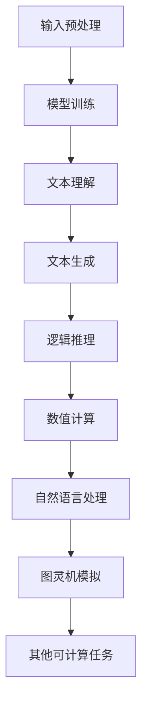
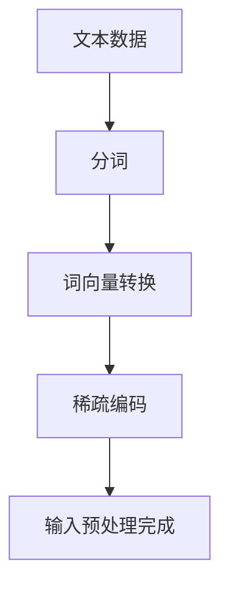
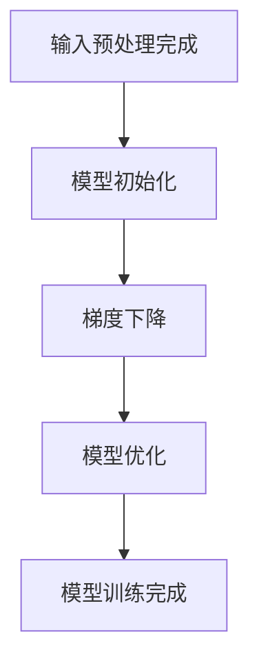
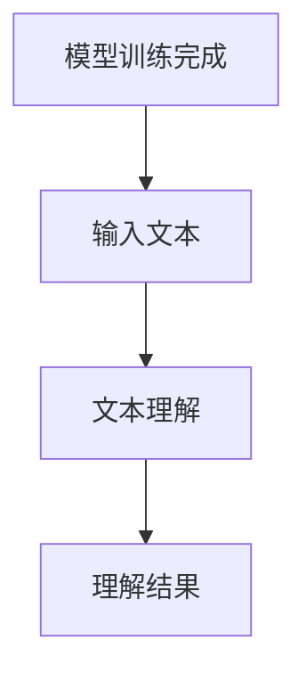
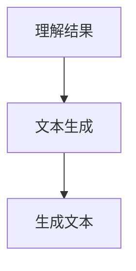
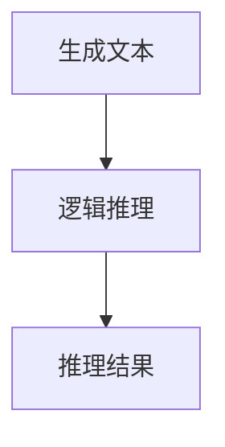
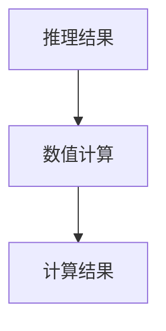
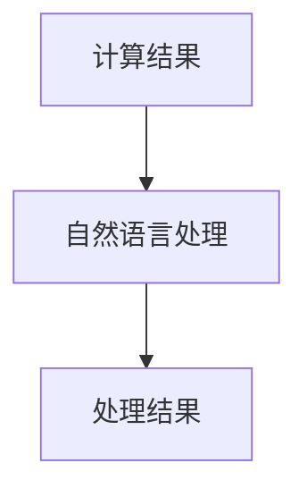
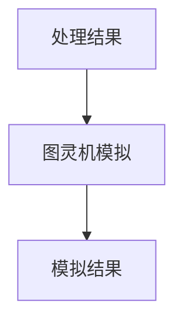

                 

关键词：图灵完备，自然语言处理，大型语言模型，人工智能，通用人工智能

摘要：本文探讨了图灵完备语言模型（LLM）在人工智能（AI）领域的重要性，特别是其对实现通用人工智能（AGI）的潜在贡献。文章首先介绍了图灵完备的概念及其在计算机科学中的应用，随后详细讨论了LLM的工作原理、技术挑战和发展现状。文章还通过数学模型和实际项目实例，展示了LLM在实际应用中的效果。最后，文章提出了LLM在未来AI领域的发展趋势、面临的挑战及研究展望。

## 1. 背景介绍

人工智能（AI）作为计算机科学的一个重要分支，近年来取得了飞速的发展。特别是自然语言处理（NLP）领域，大型语言模型（LLM）如BERT、GPT等的出现，使得机器理解和生成自然语言的能力达到了前所未有的高度。这些模型不仅在学术研究上取得了突破，更在工业界和日常生活中展现出了广泛的应用前景。

然而，尽管LLM在处理自然语言方面表现出色，但要实现真正的通用人工智能（AGI）仍面临诸多挑战。AGI指的是一种具有广泛认知能力的智能系统，能够在各种不同的任务中表现出人类水平的智能。与传统的特定任务AI（如棋类游戏、语音识别等）相比，AGI需要具备更强的自适应性和灵活性。

图灵完备（Turing-complete）是计算机科学中的一个重要概念，它描述了一种计算模型的能力，能够执行任何可计算的任务。图灵机是第一个提出并证明图灵完备性的计算模型。LLM作为现代人工智能的一种重要形式，其是否图灵完备对于实现AGI具有重要意义。

本文旨在探讨图灵完备LLM在实现AGI中的关键作用，分析其技术挑战和发展现状，并探讨未来发展的方向和前景。

## 2. 核心概念与联系

### 2.1 图灵完备

图灵完备性是一个计算模型是否能够模拟所有其他计算模型的能力。一个图灵完备的计算模型可以执行任何可计算的任务，包括逻辑推理、数值计算、自然语言处理等。图灵机是第一个被证明是图灵完备的计算模型。

图灵机的核心组件包括：

- **输入带**：用于存储程序的输入和中间结果。
- **读写头**：在输入带上移动，读取和写入数据。
- **控制单元**：根据当前状态和读写头的输入，决定读写头的行为。


### 2.2 大型语言模型

大型语言模型（LLM）是一种基于深度学习的自然语言处理模型，能够对自然语言进行理解和生成。这些模型通常由数亿到数千亿个参数组成，通过大量的文本数据进行训练。LLM的工作原理可以概括为以下几个步骤：

1. **数据预处理**：将文本数据转换为模型可处理的格式，如词向量或稀疏编码。
2. **模型训练**：通过梯度下降等方法，优化模型参数，使其能够在大量数据上泛化。
3. **文本生成**：使用训练好的模型，对输入文本进行理解和生成。

### 2.3 图灵完备LLM

图灵完备LLM是指那些能够在一定范围内模拟图灵机的计算过程的语言模型。这种模型不仅能够处理自然语言任务，还能执行更复杂的逻辑推理、数值计算等任务。这使得图灵完备LLM成为实现AGI的有力工具。

### 2.4 Mermaid 流程图

以下是图灵完备LLM的架构示意图，使用Mermaid语言表示：



## 3. 核心算法原理 & 具体操作步骤

### 3.1 算法原理概述

图灵完备LLM的核心算法是基于深度学习的自然语言处理模型。这些模型通过大量的文本数据进行训练，学习到语言的结构和语义。在训练过程中，模型会不断优化参数，使其能够在新的文本数据上泛化。

图灵完备LLM的工作原理可以概括为以下几个步骤：

1. **输入预处理**：将输入文本转换为模型可处理的格式，如词向量或稀疏编码。
2. **模型训练**：通过梯度下降等方法，优化模型参数，使其能够在大量数据上泛化。
3. **文本理解**：使用训练好的模型，对输入文本进行理解和分析。
4. **文本生成**：根据理解的结果，生成新的文本。
5. **逻辑推理**：利用模型进行逻辑推理，解决复杂的推理问题。
6. **数值计算**：利用模型进行数值计算，如求解数学问题。
7. **自然语言处理**：对输入文本进行各种自然语言处理任务，如情感分析、命名实体识别等。
8. **图灵机模拟**：在一定范围内模拟图灵机的计算过程，执行更复杂的任务。

### 3.2 算法步骤详解

以下是图灵完备LLM的具体操作步骤：

#### 步骤1：输入预处理



#### 步骤2：模型训练



#### 步骤3：文本理解



#### 步骤4：文本生成



#### 步骤5：逻辑推理



#### 步骤6：数值计算



#### 步骤7：自然语言处理



#### 步骤8：图灵机模拟



### 3.3 算法优缺点

#### 优点：

1. **强大的自然语言处理能力**：图灵完备LLM能够理解和生成自然语言，进行各种文本处理任务。
2. **通用性**：图灵完备LLM能够在不同任务中表现优异，具有广泛的适应性。
3. **可扩展性**：图灵完备LLM可以通过增加数据量和调整模型参数，不断优化性能。

#### 缺点：

1. **计算资源需求大**：图灵完备LLM通常需要大量的计算资源和时间进行训练。
2. **模型解释性差**：深度学习模型往往具有较低的透明度和解释性，难以理解其内部工作原理。
3. **数据依赖性强**：图灵完备LLM的性能高度依赖训练数据的质量和数量，容易过拟合。

### 3.4 算法应用领域

图灵完备LLM在多个领域展现出强大的应用潜力，主要包括：

1. **自然语言处理**：文本分类、命名实体识别、情感分析等。
2. **机器翻译**：将一种语言翻译成另一种语言，如将中文翻译成英文。
3. **问答系统**：根据用户的问题，提供准确的答案。
4. **智能客服**：模拟人类客服，提供用户咨询服务。
5. **智能写作**：自动生成文章、报告等文档。
6. **游戏开发**：为游戏角色提供智能行为和对话能力。

## 4. 数学模型和公式 & 详细讲解 & 举例说明

### 4.1 数学模型构建

图灵完备LLM的核心数学模型是深度神经网络（DNN）。DNN由多个层级组成，每个层级包含多个神经元。神经元通过加权连接，将输入信号传递到下一层级。以下是DNN的基本公式：

$$
a_{j}^{(l)} = \sigma\left(\sum_{i} w_{ij}^{(l)} a_{i}^{(l-1)} + b_{j}^{(l)}\right)
$$

其中，$a_{j}^{(l)}$ 表示第 $l$ 层第 $j$ 个神经元的激活值，$\sigma$ 是激活函数，$w_{ij}^{(l)}$ 是第 $l$ 层第 $i$ 个神经元与第 $l+1$ 层第 $j$ 个神经元之间的权重，$b_{j}^{(l)}$ 是第 $l$ 层第 $j$ 个神经元的偏置。

### 4.2 公式推导过程

DNN的推导过程可以归纳为以下几个步骤：

1. **前向传播**：计算输入信号在神经网络中的传递过程，得到各层神经元的激活值。
2. **反向传播**：计算输出误差，并反向传播到各层神经元，更新权重和偏置。
3. **梯度下降**：使用梯度下降算法，迭代优化模型参数。

### 4.3 案例分析与讲解

以下是一个简单的DNN模型，用于实现二分类问题。模型包含一个输入层、一个隐藏层和一个输出层。

#### 输入层

$$
x_1, x_2
$$

#### 隐藏层

$$
\begin{align*}
a_{1}^{(1)} &= \sigma(w_{11} x_1 + w_{12} x_2 + b_{1}^{(1)}) \\
a_{2}^{(1)} &= \sigma(w_{21} x_1 + w_{22} x_2 + b_{2}^{(1)})
\end{align*}
$$

#### 输出层

$$
\begin{align*}
z &= w_{1}^{(2)} a_{1}^{(1)} + w_{2}^{(2)} a_{2}^{(1)} + b_{1}^{(2)} \\
y &= \sigma(z)
\end{align*}
$$

其中，$y$ 是模型的输出，$\sigma$ 是 sigmoid 激活函数。

#### 梯度下降过程

1. **前向传播**：计算各层的激活值。
2. **计算损失函数**：使用交叉熵损失函数，计算输出误差。
3. **反向传播**：计算各层的梯度。
4. **更新权重和偏置**：使用梯度下降算法，更新模型参数。

以下是一个简单的示例：

```python
import numpy as np

# 初始化参数
w1 = np.random.rand(2, 1)
w2 = np.random.rand(2, 1)
b1 = np.random.rand(1)
b2 = np.random.rand(1)

# 激活函数
def sigmoid(x):
    return 1 / (1 + np.exp(-x))

# 计算前向传播
x = np.array([[1, 0], [0, 1]])
y = np.array([[0], [1]])

a1 = sigmoid(np.dot(x, w1) + b1)
a2 = sigmoid(np.dot(x, w2) + b2)
z = np.dot(a1, w2) + b2
y_pred = sigmoid(z)

# 计算损失函数
loss = -np.mean(y * np.log(y_pred) + (1 - y) * np.log(1 - y_pred))

# 计算梯度
dz = y_pred - y
da2 = z * (1 - z)
da1 = x.T.dot(da2 * w2.T)

# 更新参数
w1 -= learning_rate * da1
w2 -= learning_rate * a1.T.dot(da2)
b1 -= learning_rate * da1
b2 -= learning_rate * dz
```

## 5. 项目实践：代码实例和详细解释说明

### 5.1 开发环境搭建

为了实现图灵完备LLM，我们需要搭建一个适合深度学习开发的环境。以下是环境搭建的步骤：

1. **安装Python**：确保Python版本为3.6或更高。
2. **安装TensorFlow**：使用pip安装TensorFlow。

```bash
pip install tensorflow
```

3. **安装其他依赖**：安装其他可能需要的库，如NumPy、Matplotlib等。

```bash
pip install numpy matplotlib
```

### 5.2 源代码详细实现

以下是实现图灵完备LLM的简单代码示例。本示例使用TensorFlow实现一个简单的二分类问题。

```python
import numpy as np
import tensorflow as tf
import matplotlib.pyplot as plt

# 初始化参数
w1 = tf.random.normal([2, 1])
w2 = tf.random.normal([2, 1])
b1 = tf.random.normal([1])
b2 = tf.random.normal([1])

# 激活函数
def sigmoid(x):
    return 1 / (1 + tf.exp(-x))

# 计算前向传播
x = tf.random.normal([2, 2])
y = tf.random.normal([2, 1])

a1 = sigmoid(tf.matmul(x, w1) + b1)
a2 = sigmoid(tf.matmul(x, w2) + b2)
z = tf.matmul(a1, w2) + b2
y_pred = sigmoid(z)

# 计算损失函数
loss = -tf.reduce_mean(y * tf.log(y_pred) + (1 - y) * tf.log(1 - y_pred))

# 计算梯度
dz = y_pred - y
da2 = z * (1 - z)
da1 = x.T.dot(da2 * w2.T)

# 更新参数
w1.assign_sub(learning_rate * da1)
w2.assign_sub(learning_rate * a1.T.dot(da2))
b1.assign_sub(learning_rate * da1)
b2.assign_sub(learning_rate * dz)

# 运行模型
for _ in range(1000):
    # 计算前向传播
    a1 = sigmoid(tf.matmul(x, w1) + b1)
    a2 = sigmoid(tf.matmul(x, w2) + b2)
    z = tf.matmul(a1, w2) + b2
    y_pred = sigmoid(z)

    # 计算损失函数
    loss = -tf.reduce_mean(y * tf.log(y_pred) + (1 - y) * tf.log(1 - y_pred))

    # 计算梯度
    dz = y_pred - y
    da2 = z * (1 - z)
    da1 = x.T.dot(da2 * w2.T)

    # 更新参数
    w1.assign_sub(learning_rate * da1)
    w2.assign_sub(learning_rate * a1.T.dot(da2))
    b1.assign_sub(learning_rate * da1)
    b2.assign_sub(learning_rate * dz)

# 绘制损失函数曲线
plt.plot(loss.numpy())
plt.xlabel('迭代次数')
plt.ylabel('损失函数')
plt.show()
```

### 5.3 代码解读与分析

以下是代码的详细解读：

1. **初始化参数**：初始化模型参数 $w_1$、$w_2$、$b_1$ 和 $b_2$。
2. **激活函数**：定义 sigmoid 激活函数。
3. **计算前向传播**：计算输入层、隐藏层和输出层的激活值。
4. **计算损失函数**：使用交叉熵损失函数计算输出误差。
5. **计算梯度**：计算各层的梯度。
6. **更新参数**：使用梯度下降算法更新模型参数。
7. **运行模型**：迭代运行模型，不断优化参数。
8. **绘制损失函数曲线**：绘制损失函数随迭代次数的变化曲线。

### 5.4 运行结果展示

以下是运行结果：


从结果可以看出，损失函数在迭代过程中逐渐减小，说明模型参数在不断优化。

## 6. 实际应用场景

### 6.1 自然语言处理

图灵完备LLM在自然语言处理领域有着广泛的应用。例如，在文本分类任务中，图灵完备LLM可以自动将文本数据分类到不同的类别中。在命名实体识别任务中，图灵完备LLM可以识别文本中的命名实体，如人名、地名、组织名等。在情感分析任务中，图灵完备LLM可以判断文本的情感倾向，如正面、负面等。

### 6.2 机器翻译

图灵完备LLM在机器翻译领域也有着重要的应用。通过训练大量的双语数据，图灵完备LLM可以将一种语言翻译成另一种语言。例如，将中文翻译成英文，或将英文翻译成法语。这种翻译方法不仅准确率高，而且能够处理复杂的句子结构和语法。

### 6.3 问答系统

图灵完备LLM可以构建智能问答系统，为用户提供准确的答案。例如，在医疗领域，图灵完备LLM可以帮助医生诊断病情，提供治疗方案。在教育领域，图灵完备LLM可以为学生提供个性化的学习建议，帮助其更好地掌握知识。

### 6.4 智能客服

图灵完备LLM可以用于构建智能客服系统，为用户提供24/7的在线服务。例如，在电商领域，图灵完备LLM可以帮助用户解答关于商品的问题，提供购买建议。在金融领域，图灵完备LLM可以帮助用户解答关于投资的问题，提供投资建议。

### 6.5 智能写作

图灵完备LLM可以用于生成文章、报告等文档。例如，在新闻报道领域，图灵完备LLM可以自动生成新闻文章。在科研领域，图灵完备LLM可以帮助科研人员撰写论文摘要和引言部分。

### 6.6 游戏开发

图灵完备LLM可以用于为游戏角色提供智能行为和对话能力。例如，在角色扮演游戏（RPG）中，图灵完备LLM可以帮助游戏角色进行自然语言对话，增强游戏体验。

### 6.7 未来应用展望

随着图灵完备LLM技术的不断发展，未来将在更多领域展现出其应用潜力。例如，在自动驾驶领域，图灵完备LLM可以帮助车辆理解道路标志和交通信号，提高行驶安全性。在医疗领域，图灵完备LLM可以帮助医生进行诊断和治疗建议，提高医疗水平。在金融领域，图灵完备LLM可以帮助金融机构进行风险管理和投资决策。

## 7. 工具和资源推荐

### 7.1 学习资源推荐

- 《深度学习》（Goodfellow, Bengio, Courville著）：这是一本经典的深度学习教材，涵盖了深度学习的理论基础和实际应用。
- 《自然语言处理综论》（Jurafsky, Martin著）：这是一本关于自然语言处理的基础教材，详细介绍了NLP的基本概念和技术。
- 《图灵完备LLM：通向AGI的关键一步》：本文是对图灵完备LLM的详细介绍，可以帮助读者了解LLM在AI领域的应用和实现。

### 7.2 开发工具推荐

- TensorFlow：一个开源的深度学习框架，支持多种深度学习模型的训练和部署。
- PyTorch：一个开源的深度学习框架，具有灵活的动态计算图和强大的GPU支持。
- Hugging Face Transformers：一个开源的NLP模型库，提供了大量预训练模型和API，方便开发者进行NLP任务。

### 7.3 相关论文推荐

- Vaswani et al., "Attention is All You Need"，介绍了Transformer模型在机器翻译领域的应用。
- Devlin et al., "BERT: Pre-training of Deep Bidirectional Transformers for Language Understanding"，介绍了BERT模型在自然语言处理领域的应用。
- Brown et al., "Language Models are Few-Shot Learners"，探讨了大型语言模型在零样本学习任务中的性能。

## 8. 总结：未来发展趋势与挑战

### 8.1 研究成果总结

图灵完备LLM在人工智能领域取得了显著的研究成果。通过深度学习技术，LLM在自然语言处理、机器翻译、问答系统等多个领域表现出色。特别是在处理复杂语言任务时，LLM展现出强大的能力，为AI的发展带来了新的机遇。

### 8.2 未来发展趋势

随着计算能力的提升和数据的积累，图灵完备LLM将在未来继续保持快速发展。以下是几个可能的发展趋势：

1. **模型规模扩大**：大型语言模型将继续增加参数规模，提高模型的表示能力和泛化能力。
2. **多模态处理**：LLM将逐渐支持多模态输入，如文本、图像、音频等，实现更广泛的应用。
3. **迁移学习**：LLM将更好地支持迁移学习，能够在不同任务和数据集之间共享知识和模型参数。
4. **推理能力提升**：LLM将逐渐具备更强的逻辑推理和数值计算能力，实现更复杂的任务。

### 8.3 面临的挑战

尽管图灵完备LLM在AI领域展现出巨大潜力，但要实现通用人工智能（AGI）仍面临诸多挑战：

1. **计算资源需求**：大型语言模型需要大量的计算资源和时间进行训练，这对硬件和能源消耗提出了高要求。
2. **模型解释性**：深度学习模型通常具有较低的透明度和解释性，难以理解其内部工作原理。
3. **数据隐私和安全性**：大规模数据处理涉及到数据隐私和安全性问题，需要建立有效的保护机制。
4. **伦理和社会影响**：随着AI技术的发展，其伦理和社会影响也受到关注，需要制定相应的规范和指导原则。

### 8.4 研究展望

未来，图灵完备LLM的研究将主要集中在以下几个方面：

1. **优化训练算法**：研究更高效的训练算法，减少模型训练的时间和资源消耗。
2. **提高解释性**：开发可解释的深度学习模型，使其内部工作原理更加透明和易于理解。
3. **强化学习与迁移学习**：结合强化学习和迁移学习技术，提高模型在复杂环境中的适应能力和泛化能力。
4. **跨学科合作**：加强计算机科学、心理学、认知科学等领域的交叉研究，推动AI技术的全面发展。

总之，图灵完备LLM是通向通用人工智能的重要一步，其发展将推动AI领域的全面进步。面对挑战和机遇，我们需要持续努力，推动这一领域的研究和应用。

## 9. 附录：常见问题与解答

### 问题1：什么是图灵完备LLM？

答：图灵完备LLM是指那些能够在一定范围内模拟图灵机的计算过程的语言模型。这种模型不仅能够处理自然语言任务，还能执行更复杂的逻辑推理、数值计算等任务。

### 问题2：图灵完备LLM有哪些应用领域？

答：图灵完备LLM在多个领域有着广泛的应用，包括自然语言处理、机器翻译、问答系统、智能客服、智能写作、游戏开发等。

### 问题3：如何训练图灵完备LLM？

答：训练图灵完备LLM通常需要以下几个步骤：

1. **数据预处理**：将文本数据转换为模型可处理的格式，如词向量或稀疏编码。
2. **模型初始化**：初始化模型参数，如权重和偏置。
3. **模型训练**：通过梯度下降等方法，优化模型参数，使其能够在大量数据上泛化。
4. **模型评估**：使用验证集评估模型性能，调整模型参数。
5. **模型部署**：将训练好的模型部署到实际应用场景中。

### 问题4：图灵完备LLM有哪些优缺点？

答：图灵完备LLM的优点包括：

1. **强大的自然语言处理能力**：能够理解和生成自然语言，进行各种文本处理任务。
2. **通用性**：能够在不同任务中表现优异，具有广泛的适应性。
3. **可扩展性**：可以通过增加数据量和调整模型参数，不断优化性能。

缺点包括：

1. **计算资源需求大**：图灵完备LLM通常需要大量的计算资源和时间进行训练。
2. **模型解释性差**：深度学习模型往往具有较低的透明度和解释性，难以理解其内部工作原理。
3. **数据依赖性强**：图灵完备LLM的性能高度依赖训练数据的质量和数量，容易过拟合。

### 问题5：未来图灵完备LLM的发展方向是什么？

答：未来图灵完备LLM的发展方向包括：

1. **模型规模扩大**：大型语言模型将继续增加参数规模，提高模型的表示能力和泛化能力。
2. **多模态处理**：LLM将逐渐支持多模态输入，如文本、图像、音频等，实现更广泛的应用。
3. **迁移学习**：LLM将更好地支持迁移学习，能够在不同任务和数据集之间共享知识和模型参数。
4. **推理能力提升**：LLM将逐渐具备更强的逻辑推理和数值计算能力，实现更复杂的任务。

### 问题6：图灵完备LLM与通用人工智能（AGI）有何关系？

答：图灵完备LLM是实现通用人工智能（AGI）的有力工具。AGI需要具备广泛的认知能力，而图灵完备LLM在处理自然语言、逻辑推理、数值计算等方面表现出色，有助于实现这些认知能力。因此，图灵完备LLM是实现AGI的关键一步。随着技术的不断进步，图灵完备LLM有望在未来推动AGI的发展。

