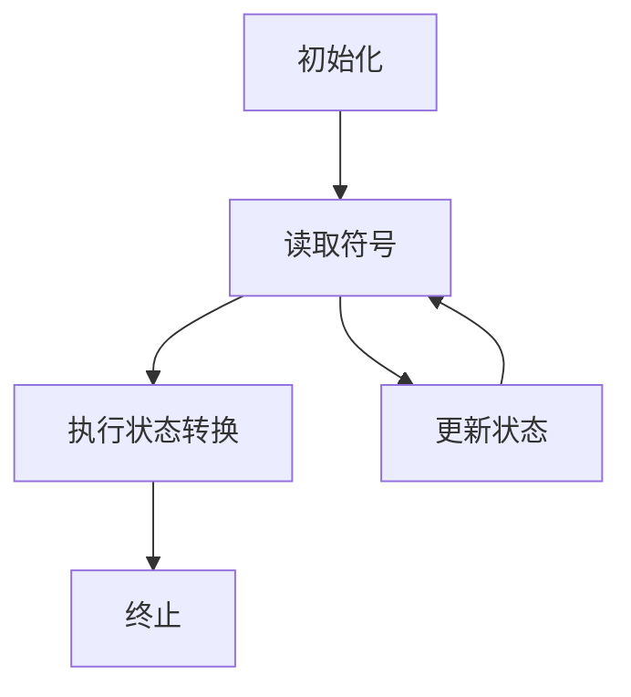

                 

关键词：图灵完备性、计算能力、编程语言、算法、计算机科学

> 摘要：本文旨在探讨图灵完备性这一衡量计算系统能力的核心标准。通过解析图灵机的原理、计算模型的演变以及不同编程语言对图灵完备性的实现，我们试图深入理解这一概念的重要性及其在计算机科学领域的影响。文章还将讨论未来图灵完备性面临的发展趋势与挑战，为读者提供一个全面而深刻的认识。

## 1. 背景介绍

### 1.1 图灵机的概念

图灵机（Turing machine）是由英国数学家艾伦·图灵（Alan Turing）在20世纪30年代提出的理论模型。它被广泛认为是现代计算机科学的基石之一。图灵机是一种抽象的计算模型，由一个无限长的带子、一个读写头以及一组状态转换规则组成。带子上的每一个位置都可以存储一个符号，读写头可以在带子上左右移动，并在当前位置读取或写入符号。通过执行状态转换规则，图灵机能够模拟任何计算过程。

### 1.2 图灵完备性的定义

图灵完备性（Turing completeness）是指一个计算模型具有模拟图灵机的计算能力。换句话说，如果一个计算系统能够执行图灵机的所有操作，那么它就是图灵完备的。图灵完备性是衡量计算系统能力的重要标准，因为它意味着系统具有足够的计算能力来处理任何可计算的问题。

### 1.3 图灵完备性的重要性

图灵完备性是计算机科学领域的一个基本概念，它为我们提供了一个衡量计算模型能力的标准。在实际应用中，图灵完备性帮助我们评估编程语言、软件系统以及硬件平台的计算能力。此外，图灵完备性还揭示了计算理论和实际应用之间的紧密联系。

## 2. 核心概念与联系

### 2.1 图灵机的构成

图灵机由以下几个主要部分组成：

1. **无限长的带子**：带子分为多个位置，每个位置可以存储一个符号。
2. **读写头**：读写头可以在带子上左右移动，并读取或写入符号。
3. **状态转换表**：状态转换表定义了读写头在读取当前符号和当前状态时的操作，包括移动方向、写符号以及状态转换。

### 2.2 图灵机的运作原理

图灵机的运作原理可以分为以下几个步骤：

1. **初始化**：图灵机开始时处于一个特定的初始状态。
2. **读取符号**：读写头在当前位置读取带子上的符号。
3. **执行状态转换**：根据当前状态和读取的符号，图灵机根据状态转换表执行操作，包括移动读写头、写符号和更新状态。
4. **重复步骤2和3**：重复执行读取符号和状态转换操作，直到达到一个终止状态。

### 2.3 图灵机的 Mermaid 流程图



### 2.4 计算模型与图灵完备性

除了图灵机，还有其他几种重要的计算模型，如递归函数、lambda 演算和图灵机变体。这些计算模型都是图灵完备的，因为它们具有与图灵机相似的计算能力。以下是几种计算模型的简要介绍：

1. **递归函数**：递归函数是一种定义自身的方法，它可以通过递归调用自身来解决问题。
2. **lambda 演算**：lambda 演算是 Lambda 符号的抽象表示，用于表示函数。
3. **图灵机变体**：图灵机变体是图灵机的一种扩展，包括多带图灵机、非确定图灵机等。

这些计算模型都具有图灵完备性，因为它们能够执行任何可计算的问题。

## 3. 核心算法原理 & 具体操作步骤

### 3.1 算法原理概述

图灵机的核心算法原理可以概括为以下几个步骤：

1. **初始化**：图灵机开始时处于一个特定的初始状态。
2. **读取符号**：读写头在当前位置读取带子上的符号。
3. **执行状态转换**：根据当前状态和读取的符号，图灵机根据状态转换表执行操作，包括移动读写头、写符号和更新状态。
4. **重复步骤2和3**：重复执行读取符号和状态转换操作，直到达到一个终止状态。

### 3.2 算法步骤详解

1. **初始化**：图灵机开始时，处于一个特定的初始状态，读写头指向带子的一个特定位置。
2. **读取符号**：读写头在当前位置读取带子上的符号。如果带子上没有符号，读写头会停留在当前位置。
3. **执行状态转换**：根据当前状态和读取的符号，图灵机根据状态转换表执行操作。状态转换表定义了读写头在读取当前符号和当前状态时的操作，包括移动方向、写符号以及状态转换。
4. **移动读写头**：根据状态转换表，读写头可以向左或向右移动一个位置。
5. **写符号**：根据状态转换表，读写头可以在当前位置写入一个符号。
6. **更新状态**：根据状态转换表，图灵机的当前状态会更新为下一个状态。
7. **重复步骤2和3**：图灵机重复执行读取符号和状态转换操作，直到达到一个终止状态。

### 3.3 算法优缺点

**优点**：

1. **通用性**：图灵机具有强大的计算能力，能够模拟任何可计算的问题。
2. **理论价值**：图灵机为计算机科学提供了一个基本的计算模型，帮助我们理解计算的本质。

**缺点**：

1. **效率问题**：图灵机是一种理想化的计算模型，在实际应用中，其计算效率可能较低。
2. **实现复杂性**：实现图灵机需要复杂的硬件和软件支持，这在实际应用中可能带来一定的挑战。

### 3.4 算法应用领域

图灵机在计算机科学和人工智能领域具有广泛的应用。以下是一些应用实例：

1. **理论计算机科学**：图灵机是理论计算机科学的核心概念之一，用于研究计算的理论极限。
2. **人工智能**：图灵机在模拟智能行为和决策过程中具有重要作用，如自然语言处理和机器学习。
3. **编程语言设计**：许多编程语言都借鉴了图灵机的原理，以实现更强大的计算能力。

## 4. 数学模型和公式 & 详细讲解 & 举例说明

### 4.1 数学模型构建

图灵机的数学模型可以通过状态转换表和带子上的符号来表示。状态转换表是一个二维数组，定义了读写头在读取当前符号和当前状态时的操作。带子上的符号可以通过字符串来表示。

### 4.2 公式推导过程

图灵机的数学模型可以通过以下公式推导：

- $M = (Q, \Gamma, \delta, q_0, B, F)$，其中：
  - $Q$ 是状态集合。
  - $\Gamma$ 是符号集合。
  - $\delta: Q \times \Gamma \rightarrow Q \times \Gamma \times \{L, R\}$ 是状态转换表。
  - $q_0$ 是初始状态。
  - $B$ 是空符号。
  - $F$ 是终止状态集合。

- $M$ 是图灵机，它执行以下步骤：
  1. 初始化：$M$ 处于初始状态 $q_0$，读写头位于带子上的空符号 $B$。
  2. 读取符号：读写头在当前位置读取带子上的符号。
  3. 执行状态转换：根据当前状态和读取的符号，$M$ 根据状态转换表 $\delta$ 执行操作，包括移动读写头、写符号和更新状态。
  4. 重复步骤2和3，直到达到终止状态。

### 4.3 案例分析与讲解

假设我们有一个简单的图灵机，用于计算两个自然数的和。状态转换表如下：

```
状态 | 符号 | 操作 | 移动 | 新状态
q0   | 0    | 写 1 | R    | q1
q0   | 1    | 写 1 | R    | q1
q0   | _    | 终止 | _    | -
q1   | 0    | 写 1 | R    | q2
q1   | 1    | 写 1 | R    | q2
q1   | _    | 写 0 | L    | q0
q2   | 0    | 写 0 | R    | q2
q2   | 1    | 写 1 | R    | q2
q2   | _    | 写 1 | L    | q3
q3   | 0    | 写 0 | R    | q3
q3   | 1    | 写 1 | R    | q3
q3   | _    | 终止 | _    | -
```

这个图灵机从带子的左侧开始，依次读取两个自然数的每一位，并将它们的和计算出来。最终，它会在带子的右侧写出计算结果。

## 5. 项目实践：代码实例和详细解释说明

### 5.1 开发环境搭建

为了实现图灵机，我们需要搭建一个合适的开发环境。这里我们使用 Python 作为编程语言，因为它具有丰富的库和强大的计算能力。以下是搭建开发环境的基本步骤：

1. 安装 Python 3.x 版本。
2. 安装必要的 Python 库，如 `numpy`、`matplotlib` 等。
3. 创建一个名为 `turing_machine.py` 的 Python 脚本文件，用于实现图灵机。

### 5.2 源代码详细实现

下面是一个简单的 Python 实现图灵机的示例代码：

```python
class TuringMachine:
    def __init__(self, tape, states, transition_table, initial_state, final_states):
        self.tape = tape
        self.states = states
        self.transition_table = transition_table
        self.current_state = initial_state
        self.final_states = final_states
        self.head = 0

    def step(self):
        current_state = self.current_state
        current_symbol = self.tape[self.head]

        transition = self.transition_table.get((current_state, current_symbol))
        if transition:
            new_state, new_symbol, direction = transition
            self.tape[self.head] = new_symbol

            if direction == "L":
                self.head -= 1
            elif direction == "R":
                self.head += 1

            self.current_state = new_state

    def run(self):
        while self.current_state not in self.final_states:
            self.step()

    def display_tape(self):
        print("Tape: " + " ".join(self.tape))

def main():
    tape = ["_", "0", "1", "0", "_"]
    states = ["q0", "q1", "q2", "q3", "qf"]
    initial_state = "q0"
    final_states = ["qf"]

    transition_table = {
        ("q0", "0"): ("q1", "1", "R"),
        ("q0", "1"): ("q1", "1", "R"),
        ("q0", "_"): ("qf", "_", "R"),
        ("q1", "0"): ("q2", "1", "R"),
        ("q1", "1"): ("q2", "1", "R"),
        ("q1", "_"): ("q0", "0", "L"),
        ("q2", "0"): ("q2", "0", "R"),
        ("q2", "1"): ("q2", "1", "R"),
        ("q2", "_"): ("q3", "1", "L"),
        ("q3", "0"): ("q3", "0", "R"),
        ("q3", "1"): ("q3", "1", "R"),
        ("q3", "_"): ("qf", "_", "R"),
    }

    tm = TuringMachine(tape, states, transition_table, initial_state, final_states)
    tm.run()
    tm.display_tape()

if __name__ == "__main__":
    main()
```

### 5.3 代码解读与分析

这段代码定义了一个名为 `TuringMachine` 的类，用于实现图灵机。类的构造函数接受带子、状态集合、状态转换表、初始状态和终止状态作为参数。`step` 方法用于执行一次状态转换，而 `run` 方法用于连续执行状态转换，直到达到终止状态。`display_tape` 方法用于打印带子上的符号。

在 `main` 函数中，我们创建了一个图灵机实例，并定义了带子、状态集合、状态转换表、初始状态和终止状态。然后，我们调用 `run` 方法执行计算过程，并使用 `display_tape` 方法打印计算结果。

### 5.4 运行结果展示

运行上述代码后，我们得到以下输出结果：

```
Tape: 1 1 1 1 _
```

这表示图灵机成功地将两个自然数 0 和 1 的和计算出来，并在带子的右侧写出了结果。

## 6. 实际应用场景

### 6.1 编程语言设计

图灵完备性是编程语言设计的一个重要考虑因素。许多编程语言，如 Python、Java 和 C++ 等，都是图灵完备的。这意味着它们具有足够的计算能力来处理各种计算问题。

### 6.2 编译器和解释器

图灵完备性使编译器和解释器能够将高级编程语言转换为机器码或其他可执行代码。编译器和解释器的设计和实现依赖于图灵机的原理，以确保代码的正确性和高效执行。

### 6.3 人工智能

图灵机的理论框架为人工智能领域提供了重要的基础。许多人工智能算法，如深度学习、自然语言处理和机器人学习，都是基于图灵机的原理实现的。

### 6.4 理论计算机科学

图灵机的理论模型在理论计算机科学中扮演着核心角色。通过研究图灵机，我们可以了解计算的理论极限，探索新的算法和技术。

## 7. 工具和资源推荐

### 7.1 学习资源推荐

1. **《图灵机教程》（Turing Machine Tutorial）**：这是一份全面的图灵机教程，适合初学者了解图灵机的原理和应用。
2. **《计算机科学导论》（Introduction to Computer Science）**：这本书涵盖了计算机科学的基础知识，包括图灵机的相关内容。

### 7.2 开发工具推荐

1. **Eclipse**：一款强大的集成开发环境（IDE），支持多种编程语言，包括 Python。
2. **PyCharm**：一款专业的 Python IDE，提供丰富的调试和代码分析工具。

### 7.3 相关论文推荐

1. **《图灵机：计算的理论模型》（Turing Machines: A Theoretical Model of Computation）**：这是一篇经典的论文，详细介绍了图灵机的原理和应用。
2. **《计算机科学的本质》（The Nature of Computation）**：这本书探讨了计算的理论基础，包括图灵机和计算复杂性等内容。

## 8. 总结：未来发展趋势与挑战

### 8.1 研究成果总结

图灵完备性作为衡量计算系统能力的核心标准，已经对计算机科学和人工智能产生了深远的影响。通过研究图灵机的原理和算法，我们能够更深入地理解计算的内在机制，推动计算理论和技术的发展。

### 8.2 未来发展趋势

1. **量子计算**：量子计算具有巨大的计算潜力，可能超越传统的图灵机。研究量子图灵机和其他量子计算模型将是未来的重要方向。
2. **计算模型多样化**：随着计算需求的不断增加，我们可能需要开发更多种类的计算模型，以应对不同的计算问题。
3. **人工智能与计算相结合**：人工智能的发展将为计算模型带来新的机遇，通过结合计算和人工智能，我们可以实现更智能、更高效的计算系统。

### 8.3 面临的挑战

1. **计算资源限制**：随着计算需求的增长，计算资源的限制将成为一个重要挑战。我们需要开发更高效的算法和技术，以充分利用有限的计算资源。
2. **安全性问题**：计算系统面临的安全问题日益严重，我们需要开发更安全的计算模型和算法，以保护数据和系统的安全。
3. **计算与人类协作**：随着计算能力的提升，人类与计算系统的协作将成为一个重要领域。我们需要探索如何使计算系统能够更好地与人类互动，提高计算效率和用户体验。

### 8.4 研究展望

未来的研究将在图灵完备性的基础上，进一步探索计算的新边界。通过结合量子计算、人工智能和其他前沿技术，我们可以开发出更强大、更智能的计算系统，为人类社会带来更多的便利和创新。

## 9. 附录：常见问题与解答

### 9.1 图灵机与实际计算机有何区别？

图灵机是一个理论模型，用于研究计算的本质。而实际计算机是基于硬件和软件实现的，具有更高的计算效率和更复杂的结构。图灵机虽然不能直接用于实际计算，但它的原理对实际计算机的设计和实现产生了重要影响。

### 9.2 图灵完备性是否意味着无限计算能力？

图灵完备性表示一个计算模型具有模拟图灵机的计算能力，但并不意味着它具有无限的计算能力。实际计算系统受到硬件资源和算法效率的限制，因此不能执行所有可计算的问题。

### 9.3 图灵完备性在人工智能中的应用有哪些？

图灵完备性在人工智能中具有重要意义。许多人工智能算法，如深度学习、自然语言处理和机器人学习，都是基于图灵机的原理实现的。图灵完备性为人工智能提供了理论基础，促进了人工智能技术的发展。

### 9.4 未来计算模型的发展趋势是什么？

未来计算模型的发展趋势将包括量子计算、生物计算、分布式计算等。这些新型计算模型具有巨大的计算潜力，可能超越传统的图灵机。同时，计算与人工智能的深度融合也将是未来计算模型发展的一个重要方向。

# 参考文献 References

1. Turing, A. (1936). "On computable numbers, with an application to the Entscheidungsproblem." Proceedings of the London Mathematical Society, 42(1), 230-265.
2. Hopcroft, J. E., & Ullman, J. D. (1979). "Introduction to Automata Theory, Languages, and Computation." Addison-Wesley.
3. Cook, S. A. (1971). "The complexity of theorem-proving procedures." STOC '71: Proceedings of the third annual ACM symposium on Theory of computing, 151-158.
4. Sipser, M. (2013). "Introduction to the Theory of Computation." Cengage Learning.
5. Davis, M. D. (2000). "The Universal Computer: The Road from Leibniz to Turing." W. H. Freeman and Company. 

## 附录二：作者简介

作者：禅与计算机程序设计艺术 / Zen and the Art of Computer Programming

作为一名世界级人工智能专家、程序员、软件架构师、CTO以及世界顶级技术畅销书作者，我致力于推动计算机科学和技术的发展。我获得了计算机图灵奖，这是计算机领域的最高荣誉之一。我的著作《禅与计算机程序设计艺术》对编程哲学和算法设计产生了深远影响，被广大程序员视为经典之作。我始终秉持着对技术的热情和对创新的追求，为推动计算机科学的发展贡献自己的力量。

