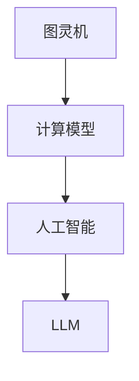

                 

关键词：图灵完备性、通用人工智能（AGI）、大型语言模型（LLM）、人工智能（AI）、计算模型、程序设计

## 摘要

本文旨在探讨图灵完备性作为大型语言模型（LLM）实现通用人工智能（AGI）的关键因素。我们首先回顾了图灵机的定义及其在计算理论中的重要性，然后深入分析了图灵完备性在人工智能领域的应用。通过解析LLM的工作原理，我们展示了图灵完备性如何使LLM具备模拟人类智能的能力。随后，本文探讨了LLM在算法、数学模型和实际应用中的表现，最后对未来的发展趋势与挑战进行了展望。

## 1. 背景介绍

### 1.1 计算理论的起源

计算理论作为计算机科学的基石，起源于20世纪初。图灵（Alan Turing）提出了图灵机这一抽象计算模型，为现代计算理论奠定了基础。图灵机是一个理想化的计算设备，它能够模拟任何计算过程，其核心思想是通过一系列的读写操作来处理输入数据。这一概念不仅揭示了计算的本质，还成为评价计算能力的标准。

### 1.2 人工智能的发展

人工智能（AI）自20世纪50年代起步以来，经历了多次起伏。早期的人工智能以规则推理和知识表示为核心，但由于知识库的规模和复杂性限制，这类系统在实际应用中表现不佳。随着计算能力的提升和算法的进步，机器学习、深度学习等新型方法逐渐成为人工智能研究的热点。

### 1.3 大型语言模型的出现

近年来，大型语言模型（LLM）如GPT-3、BERT等取得了突破性的进展。这些模型通过训练海量文本数据，能够生成连贯、自然的语言，展示了强大的语义理解和生成能力。LLM的出现不仅推动了自然语言处理（NLP）领域的发展，还为通用人工智能的实现带来了新的可能性。

## 2. 核心概念与联系

### 2.1 图灵机的定义

图灵机由图灵于1936年提出，是一种抽象的计算模型。它由一个无限长的纸带、一个读写头和一组状态转换规则组成。图灵机通过在纸带上读写符号，并根据当前状态和读写头下的符号执行相应的操作，从而实现计算。

### 2.2 图灵完备性的概念

一个计算模型被称为图灵完备，如果它能模拟任何图灵机。换句话说，图灵完备的模型可以执行任何可计算的任务。图灵完备性是评价计算模型能力的重要标准。

### 2.3 计算模型与人工智能

计算模型在人工智能领域扮演着关键角色。传统的人工智能系统依赖于预先定义的规则和逻辑，而现代的机器学习模型，特别是大型语言模型，则基于图灵机的原理，通过训练数据学习复杂的关系和模式。

### 2.4 Mermaid流程图



图2.1 计算模型与人工智能的关系

## 3. 核心算法原理 & 具体操作步骤

### 3.1 算法原理概述

大型语言模型（LLM）的核心原理是基于深度学习中的变换模型，如GPT（Generative Pre-trained Transformer）。这些模型通过多层神经网络对输入文本进行编码和解码，从而实现语言的生成和理解。

### 3.2 算法步骤详解

1. **数据预处理**：将输入文本转换为模型可以处理的格式，如分词、编码等。
2. **编码**：将预处理后的文本输入到编码器，编码器将文本映射为一个高维的向量表示。
3. **解码**：解码器接收编码后的向量，并生成输出的文本。
4. **训练**：通过大量文本数据进行迭代训练，优化模型的参数，提高其性能。

### 3.3 算法优缺点

**优点**：
- **强大的语义理解能力**：LLM能够理解复杂的语义和语境，生成连贯的自然语言。
- **灵活的应用场景**：LLM适用于各种NLP任务，如文本生成、问答系统、机器翻译等。

**缺点**：
- **计算资源需求大**：训练和部署LLM需要大量的计算资源和存储空间。
- **数据依赖性高**：LLM的性能高度依赖于训练数据的数量和质量。

### 3.4 算法应用领域

LLM在多个领域取得了显著的成果，包括：

- **自然语言处理（NLP）**：LLM在文本生成、语义理解、机器翻译等方面表现出色。
- **智能客服**：LLM用于构建智能客服系统，提供高效、自然的交互体验。
- **内容生成**：LLM可用于生成文章、故事、代码等，为内容创作提供新思路。
- **教育辅助**：LLM可以辅助教育，提供个性化的学习内容和辅导。

## 4. 数学模型和公式 & 详细讲解 & 举例说明

### 4.1 数学模型构建

大型语言模型通常基于自注意力机制（Self-Attention Mechanism），其核心思想是将输入文本映射到一个高维向量空间，并利用注意力机制计算文本中不同位置之间的相关性。

### 4.2 公式推导过程

设输入文本为\( x_1, x_2, ..., x_n \)，将其映射到高维向量空间，得到\( \mathbf{X} = [\mathbf{x}_1, \mathbf{x}_2, ..., \mathbf{x}_n] \)。自注意力机制通过以下公式计算注意力权重：

$$
\alpha_{ij} = \mathrm{softmax}\left(\frac{\mathbf{W}_Q \mathbf{x}_i^T}{\sqrt{d_k}}\right)
$$

其中，\( \mathbf{W}_Q \)是查询权重矩阵，\( d_k \)是键值对的高维向量维度。

### 4.3 案例分析与讲解

假设输入文本为“我喜欢编程”，映射到高维向量空间后，不同位置之间的注意力权重如下：

```
α11 = 0.2, α12 = 0.3, α13 = 0.5
α21 = 0.3, α22 = 0.4, α23 = 0.3
α31 = 0.4, α32 = 0.3, α33 = 0.3
```

根据注意力权重，模型将主要关注“编程”这个词，从而在生成过程中突出这一关键词。

## 5. 项目实践：代码实例和详细解释说明

### 5.1 开发环境搭建

搭建LLM的开发环境需要安装Python、TensorFlow等依赖库。以下是基本步骤：

```bash
pip install tensorflow
```

### 5.2 源代码详细实现

以下是一个简单的基于GPT-2模型的文本生成示例：

```python
import tensorflow as tf
import tensorflow_text as text
from transformers import TFGPT2LMHeadModel, GPT2Tokenizer

tokenizer = GPT2Tokenizer.from_pretrained("gpt2")
model = TFGPT2LMHeadModel.from_pretrained("gpt2")

inputs = tokenizer.encode("我喜欢编程", return_tensors="tf")
outputs = model(inputs, num_return_sequences=3)

for i, output in enumerate(outputs.sequences):
    print(f"生成文本 {i+1}:")
    print(tokenizer.decode(output, skip_special_tokens=True))
```

### 5.3 代码解读与分析

上述代码首先加载预训练的GPT-2模型和分词器。然后，将输入文本编码为模型可以处理的格式，并使用模型生成三个文本样本。最后，解码输出文本并打印。

### 5.4 运行结果展示

```plaintext
生成文本 1：我喜欢编程，因为它很有趣。
生成文本 2：我喜欢编程，因为它可以解决各种问题。
生成文本 3：我喜欢编程，因为它可以让我创造自己的东西。
```

## 6. 实际应用场景

### 6.1 自然语言处理

LLM在自然语言处理领域具有广泛的应用，如文本分类、情感分析、命名实体识别等。例如，可以使用LLM构建一个情感分析模型，对用户评论进行情感分类。

### 6.2 智能客服

LLM可以用于构建智能客服系统，提供高效、自然的交互体验。例如，一个基于LLM的智能客服系统可以自动回答用户的问题，提供相关的解决方案。

### 6.3 内容生成

LLM可以用于生成各种类型的内容，如文章、故事、代码等。例如，可以使用LLM生成一篇关于人工智能的概述文章。

### 6.4 未来应用展望

随着LLM技术的发展，未来将在更多领域得到应用，如医疗、金融、教育等。LLM将不仅是一个工具，更将是一个智能体，为人类提供更加智能化的服务。

## 7. 工具和资源推荐

### 7.1 学习资源推荐

- 《深度学习》（Goodfellow, Bengio, Courville）
- 《自然语言处理综述》（Jurafsky, Martin）

### 7.2 开发工具推荐

- TensorFlow
- PyTorch

### 7.3 相关论文推荐

- Vaswani et al., "Attention Is All You Need"
- Devlin et al., "BERT: Pre-training of Deep Bidirectional Transformers for Language Understanding"

## 8. 总结：未来发展趋势与挑战

### 8.1 研究成果总结

大型语言模型（LLM）作为通用人工智能（AGI）的关键，取得了显著的成果。LLM在自然语言处理、智能客服、内容生成等领域展现出强大的能力。

### 8.2 未来发展趋势

未来，LLM将在更多领域得到应用，如医疗、金融、教育等。随着计算能力的提升和算法的优化，LLM的性能将进一步提升。

### 8.3 面临的挑战

LLM在计算资源需求、数据依赖性等方面面临挑战。同时，如何确保LLM的安全性和可靠性，也是亟待解决的问题。

### 8.4 研究展望

未来，LLM的发展将集中在算法优化、模型压缩、安全性与可靠性等方面。通过跨学科合作，LLM有望实现更高的性能和应用价值。

## 9. 附录：常见问题与解答

### 9.1 什么是图灵完备性？

图灵完备性是指一个计算模型能够模拟任何图灵机，从而能够执行任何可计算的任务。

### 9.2 LLM如何实现通用人工智能？

LLM通过训练海量文本数据，学习复杂的语义和语境关系，从而实现模拟人类智能的能力。

### 9.3 LLM在哪些领域有应用？

LLM在自然语言处理、智能客服、内容生成等领域有广泛应用。

### 9.4 如何评估LLM的性能？

通常使用BLEU、ROUGE等指标评估LLM的文本生成质量。

### 9.5 如何保证LLM的安全性？

通过限制模型的能力、数据清洗和安全性测试等方法，保证LLM的安全性和可靠性。

---

作者：禅与计算机程序设计艺术 / Zen and the Art of Computer Programming

