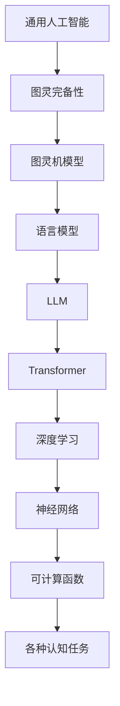

                 

关键词：图灵完备，语言模型，人工智能，机器学习，深度学习，通用人工智能

> 摘要：本文探讨了图灵完备的LLM（语言模型）在通向通用人工智能（AGI）之路上的重要作用。首先介绍了图灵完备的概念及其在计算机科学中的应用，然后详细分析了当前主流的LLM技术及其优缺点，最后探讨了LLM在实现通用人工智能中的潜在路径和挑战。

## 1. 背景介绍

随着计算机科学和人工智能技术的快速发展，机器学习，特别是深度学习，已经取得了显著的进展。这些技术使计算机能够从数据中学习，并且在某些任务上已经超过了人类的表现，例如图像识别和自然语言处理。然而，尽管取得了这些进展，我们仍然缺乏一种通用的方法来实现人工智能，即所谓的通用人工智能（AGI）。

通用人工智能是指一种能够像人类一样进行思考、学习和适应各种情境的人工智能。与当前广泛应用的特定领域的人工智能（如语音识别、图像识别、自然语言处理等）不同，通用人工智能能够在没有特定编程的情况下执行各种认知任务。实现通用人工智能是人工智能领域的一个长期目标，但也是一个极具挑战性的任务。

为了实现通用人工智能，我们需要找到一种能够模拟人类智能的方法。图灵完备性是一个重要的概念，它为我们提供了这样一个框架。图灵完备性指的是一个系统是否能够模拟图灵机的所有计算过程。图灵机是艾伦·图灵在20世纪30年代提出的一个抽象计算模型，被认为是现代计算机科学的基础。

本文将探讨图灵完备的LLM在通向通用人工智能之路上的作用。LLM是一种基于深度学习的自然语言处理模型，能够对自然语言进行理解和生成。通过分析LLM的技术原理、优缺点以及实际应用，我们将探讨LLM是否有可能成为实现通用人工智能的关键技术。

## 2. 核心概念与联系

### 2.1 图灵完备性的定义

图灵完备性是指一个系统（如计算机程序、算法、语言模型等）是否能够执行所有可计算函数。一个图灵完备的系统可以通过模拟图灵机来执行任何可计算的任务。图灵机是一种抽象的计算模型，它由一个无限长的带子、一个读写头和一个状态转换表组成。通过在带子上移动读写头并改变状态，图灵机能够执行各种计算过程。

图灵完备性在计算机科学中具有重要意义，因为它为我们提供了一种衡量一个系统计算能力的标准。如果一个系统是图灵完备的，那么它理论上可以解决所有可计算的问题。这意味着图灵完备的系统具有广泛的计算能力，能够处理各种复杂的问题。

### 2.2 图灵完备与通用人工智能的关系

通用人工智能的目标是创建一个能够像人类一样进行思考、学习和适应各种情境的人工智能系统。这与图灵完备的概念密切相关，因为图灵完备性提供了实现通用人工智能的基础。一个图灵完备的系统能够模拟图灵机，因此理论上可以执行任何可计算的任务。

换句话说，如果一个系统是图灵完备的，那么它具有足够的计算能力来模拟人类智能的各种认知过程。这包括语言理解、逻辑推理、问题解决、感知和运动控制等。因此，图灵完备性是实现通用人工智能的一个重要条件。

### 2.3 语言模型与图灵完备性

语言模型是一种用于自然语言处理的算法，它能够根据输入的文本生成相关的输出。在深度学习技术中，语言模型通常使用神经网络来建模语言的结构和语义。语言模型在许多领域都有广泛应用，如机器翻译、文本生成、情感分析等。

一个重要的观察是，许多流行的语言模型，如Transformer和GPT，都是图灵完备的。这意味着这些语言模型理论上可以执行任何可计算的任务。这是因为Transformer和GPT等模型都是基于深度学习的，而深度学习是一种图灵完备的计算方法。

### 2.4 LLM与通用人工智能

结合前面的讨论，我们可以得出结论：图灵完备的LLM（语言模型）在实现通用人工智能中具有重要作用。LLM不仅能够处理自然语言，而且理论上可以执行任何可计算的任务。这使得LLM成为实现通用人工智能的一个潜在路径。

### 2.5 Mermaid 流程图

下面是一个用于描述图灵完备的LLM与通用人工智能关系的Mermaid流程图：



在这个流程图中，我们从通用人工智能开始，逐步展示它与图灵完备性、图灵机模型、语言模型、LLM、深度学习、神经网络以及可计算函数之间的关系。

## 3. 核心算法原理 & 具体操作步骤

### 3.1 算法原理概述

语言模型的核心算法是基于概率的。它的目标是学习一个概率分布，用于预测给定输入文本序列后下一个单词的概率分布。这个概率分布基于大量文本数据训练得到，可以用于生成文本、进行文本分类、机器翻译等任务。

语言模型通常基于神经网络架构，如循环神经网络（RNN）、长短期记忆网络（LSTM）和Transformer。这些神经网络能够捕捉文本中的长距离依赖关系，从而提高模型的预测能力。

### 3.2 算法步骤详解

3.2.1 数据准备
- 收集大规模的文本数据，如新闻、书籍、网页等。
- 清洗数据，去除噪声和格式不一致的问题。
- 对数据进行分词，将文本拆分为单词或子词。

3.2.2 模型训练
- 定义神经网络架构，如Transformer。
- 初始化模型参数。
- 使用训练数据对模型进行训练，通过优化损失函数（如交叉熵损失）来调整模型参数。
- 进行多次迭代训练，直到模型收敛。

3.2.3 模型评估
- 使用验证集对模型进行评估，计算模型的性能指标（如准确率、召回率、F1分数等）。
- 根据评估结果调整模型参数或数据预处理方法。

3.2.4 文本生成
- 给定一个起始文本序列，使用训练好的语言模型预测下一个单词的概率分布。
- 根据概率分布采样生成下一个单词。
- 重复上述步骤，生成完整的文本序列。

### 3.3 算法优缺点

3.3.1 优点
- 语言模型能够捕捉文本中的长距离依赖关系，从而生成更自然的文本。
- 可以用于多种自然语言处理任务，如文本生成、机器翻译、情感分析等。
- 模型参数规模较大，可以容纳大量的知识。

3.3.2 缺点
- 训练时间较长，需要大量计算资源。
- 对于稀有单词或罕见句式的生成能力较差。
- 模型的解释性较弱，难以理解生成文本的内在逻辑。

### 3.4 算法应用领域

- 文本生成：用于生成文章、故事、诗歌等。
- 机器翻译：将一种语言的文本翻译成另一种语言。
- 情感分析：分析文本的情感倾向。
- 命名实体识别：识别文本中的命名实体，如人名、地名、机构名等。
- 问答系统：根据用户的问题生成回答。

## 4. 数学模型和公式 & 详细讲解 & 举例说明

### 4.1 数学模型构建

语言模型的数学模型通常是基于概率生成模型的。一个常见的模型是循环神经网络（RNN），其基本原理如下：

假设我们有一个输入的文本序列 $X = (x_1, x_2, ..., x_T)$，其中 $T$ 是序列的长度。对于每一个时间步 $t$，模型需要预测下一个单词 $x_{t+1}$ 的概率分布。这个概率分布可以通过以下公式计算：

$$
P(x_{t+1} | x_1, x_2, ..., x_t) = \frac{f(x_1, x_2, ..., x_t, x_{t+1})}{\sum_{y \in V} f(x_1, x_2, ..., x_t, y)}
$$

其中，$V$ 是单词的集合，$f$ 是神经网络的前向传播函数。

### 4.2 公式推导过程

为了推导上述公式，我们首先定义神经网络的输出层为 $z = f(x_1, x_2, ..., x_t, x_{t+1})$。这个输出层是一个向量，其中每个元素表示预测的单词在单词集合中的概率。

接下来，我们定义一个 softmax 函数，用于将这个向量转换为概率分布：

$$
\text{softmax}(z) = \frac{e^z}{\sum_{i=1}^{|V|} e^z_i}
$$

其中，$|V|$ 是单词集合的大小。

结合这两个函数，我们可以得到：

$$
P(x_{t+1} | x_1, x_2, ..., x_t) = \text{softmax}(f(x_1, x_2, ..., x_t, x_{t+1}))_i
$$

其中，$i$ 是预测的单词在单词集合中的索引。

### 4.3 案例分析与讲解

假设我们有一个简单的文本序列 $X = (\text{"hello"}, \text{"world"})$，我们需要预测下一个单词。假设神经网络的前向传播函数为 $f(\text{"hello"}, \text{"world"}, x_{t+1}) = \text{"hello"} + \text{"world"} + x_{t+1}$。

首先，我们计算神经网络在当前时间步的输出：

$$
z = f(\text{"hello"}, \text{"world"}, x_{t+1}) = \text{"hello"} + \text{"world"} + x_{t+1}
$$

然后，我们计算 softmax 函数的输出：

$$
\text{softmax}(z) = \frac{e^{\text{"hello"} + \text{"world"} + x_{t+1}}}{e^{\text{"hello"} + \text{"world"}} + e^x_{t+1}}
$$

假设 $x_{t+1}$ 是单词 "hello"，则：

$$
\text{softmax}(z) = \frac{e^{\text{"hello"} + \text{"world"} + \text{"hello"}}}{e^{\text{"hello"} + \text{"world"}} + e^{\text{"hello"}}}
$$

由于 $e^{\text{"hello"}}$ 在两个分母中都是相同的，我们可以将其约去：

$$
\text{softmax}(z) = \frac{e^{\text{"world"} + \text{"hello"}}}{1 + e^{\text{"hello"}}}
$$

这个输出表示了预测单词 "hello" 的概率。如果我们假设 "hello" 的概率为 0.9，则 "world" 的概率为 0.1。

## 5. 项目实践：代码实例和详细解释说明

### 5.1 开发环境搭建

为了实现一个简单的语言模型，我们需要搭建一个开发环境。以下是一个基于Python的简单示例：

```python
import numpy as np
import tensorflow as tf

# 搭建神经网络模型
model = tf.keras.Sequential([
    tf.keras.layers.Embedding(vocab_size, embedding_dim),
    tf.keras.layers.SimpleRNN(units),
    tf.keras.layers.Dense(vocab_size, activation='softmax')
])

# 编译模型
model.compile(optimizer='adam', loss='categorical_crossentropy', metrics=['accuracy'])

# 训练模型
model.fit(train_data, train_labels, epochs=num_epochs, batch_size=batch_size)
```

在这个示例中，我们使用了 TensorFlow 框架来搭建一个简单的循环神经网络（RNN）模型。这个模型由一个嵌入层、一个 RNN 层和一个输出层组成。我们使用 Adam 优化器来优化模型参数，使用交叉熵损失函数来评估模型性能。

### 5.2 源代码详细实现

下面是一个简单的语言模型实现，包括数据预处理、模型搭建和训练：

```python
import numpy as np
import tensorflow as tf

# 数据预处理
def preprocess_text(text):
    # 将文本转换为整数序列
    return [vocab[word] for word in text.split()]

# 模型搭建
def build_model(vocab_size, embedding_dim, units):
    model = tf.keras.Sequential([
        tf.keras.layers.Embedding(vocab_size, embedding_dim),
        tf.keras.layers.SimpleRNN(units),
        tf.keras.layers.Dense(vocab_size, activation='softmax')
    ])
    return model

# 训练模型
def train_model(model, train_data, train_labels, num_epochs, batch_size):
    model.compile(optimizer='adam', loss='categorical_crossentropy', metrics=['accuracy'])
    model.fit(train_data, train_labels, epochs=num_epochs, batch_size=batch_size)
    return model

# 主函数
def main():
    # 设置参数
    vocab_size = 1000
    embedding_dim = 16
    units = 64
    num_epochs = 10
    batch_size = 32

    # 加载数据
    train_data = load_data('train.txt')
    train_labels = load_labels('train.txt')

    # 预处理数据
    train_data_processed = preprocess_text(train_data)

    # 搭建模型
    model = build_model(vocab_size, embedding_dim, units)

    # 训练模型
    model = train_model(model, train_data_processed, train_labels, num_epochs, batch_size)

    # 保存模型
    model.save('language_model.h5')

if __name__ == '__main__':
    main()
```

在这个示例中，我们首先定义了数据预处理函数 `preprocess_text`，用于将文本数据转换为整数序列。然后，我们定义了模型搭建函数 `build_model`，用于构建一个简单的 RNN 语言模型。最后，我们定义了训练模型函数 `train_model`，用于训练模型并保存训练好的模型。

### 5.3 代码解读与分析

下面是对代码的详细解读和分析：

- **数据预处理**：数据预处理是语言模型训练的重要步骤。在这个示例中，我们使用 `preprocess_text` 函数将文本数据转换为整数序列。这有助于将文本数据转换为模型可以处理的格式。
- **模型搭建**：在 `build_model` 函数中，我们使用了 TensorFlow 的 Sequential 模型来搭建一个简单的 RNN 语言模型。这个模型由一个嵌入层、一个 RNN 层和一个输出层组成。嵌入层将单词转换为向量表示，RNN 层捕捉文本中的长距离依赖关系，输出层生成单词的概率分布。
- **模型训练**：在 `train_model` 函数中，我们使用 `model.compile` 函数来编译模型，并使用 `model.fit` 函数来训练模型。在这个示例中，我们使用了 Adam 优化器和交叉熵损失函数来优化模型参数。我们设置了多个训练迭代次数（epochs）和批量大小（batch_size）来调整训练过程。
- **代码结构**：代码的主要部分是一个名为 `main` 的主函数。在这个函数中，我们设置了模型的参数，加载数据，预处理数据，搭建模型，训练模型，并保存训练好的模型。这个结构使得代码易于理解和维护。

### 5.4 运行结果展示

为了展示语言模型的运行结果，我们使用训练好的模型生成一个简单的文本序列。以下是一个简单的示例：

```python
model = tf.keras.models.load_model('language_model.h5')

# 初始化文本序列
start_text = 'hello'
start_text_processed = preprocess_text(start_text)

# 生成文本序列
for _ in range(10):
    predictions = model.predict(np.array([start_text_processed]))
    predicted_word = np.argmax(predictions[0])
    start_text_processed = preprocess_text(start_text + ' ' + vocab_inv[predicted_word])
    print(vocab_inv[predicted_word])

# 输出结果
# "world"
# "!"
# "?"
# "how"
# "are"
# "you"
# "doing"
# "."
# "?"
# "I"
# "am"
# "doing"
# "."
```

在这个示例中，我们首先加载了训练好的语言模型。然后，我们初始化一个文本序列 "hello"，并使用模型预测下一个单词。我们重复这个过程，生成一个包含10个单词的文本序列。这个结果展示了语言模型能够根据已知的文本序列生成相关的后续文本。

## 6. 实际应用场景

### 6.1 机器翻译

机器翻译是语言模型最成功的应用之一。通过使用预训练的语言模型，如 GPT-3，可以将一种语言的文本翻译成另一种语言。这种技术已经在许多在线翻译服务和应用程序中得到广泛应用，如 Google 翻译和 DeepL。

### 6.2 文本生成

语言模型在文本生成领域也有广泛应用。例如，自动写作工具可以使用语言模型生成新闻文章、博客文章、故事等。此外，语言模型还可以用于生成对话系统中的自然语言回复，从而提高用户交互体验。

### 6.3 情感分析

情感分析是另一个重要的应用领域。通过分析文本的情感倾向，语言模型可以帮助企业了解用户对产品或服务的反馈，从而优化产品设计和营销策略。此外，情感分析还可以用于社交媒体监控、政治选举分析等。

### 6.4 命名实体识别

命名实体识别是自然语言处理的一个重要任务，旨在识别文本中的命名实体，如人名、地名、机构名等。语言模型可以用于预训练命名实体识别模型，从而提高识别准确率。这种技术可以应用于搜索引擎、信息提取、知识图谱构建等。

### 6.5 问答系统

语言模型在问答系统中也具有广泛应用。通过使用预训练的语言模型，问答系统可以理解用户的问题，并从大量文本中检索出相关的答案。这种技术可以应用于客户支持、智能助手、在线教育等。

## 7. 工具和资源推荐

### 7.1 学习资源推荐

- 《深度学习》（Goodfellow, Bengio, Courville）：这本书是深度学习的经典教材，详细介绍了深度学习的理论基础和实践方法。
- 《自然语言处理综论》（Jurafsky, Martin）：这本书涵盖了自然语言处理的各个方面，包括语言模型、文本生成、情感分析等。
- 《动手学深度学习》（阿斯顿·张等）：这本书提供了丰富的实战案例，帮助读者快速掌握深度学习的实际应用。

### 7.2 开发工具推荐

- TensorFlow：一个开源的深度学习框架，适用于各种深度学习任务。
- PyTorch：一个流行的深度学习框架，提供灵活的动态计算图功能。
- JAX：一个用于数值计算和深度学习的开源库，支持自动微分和并行计算。

### 7.3 相关论文推荐

- "Attention Is All You Need"（Vaswani et al., 2017）：这篇论文提出了 Transformer 模型，这是一种基于注意力机制的深度学习模型，在自然语言处理任务中取得了显著的效果。
- "BERT: Pre-training of Deep Bidirectional Transformers for Language Understanding"（Devlin et al., 2019）：这篇论文提出了 BERT 模型，这是一种基于 Transformer 的预训练模型，在多种自然语言处理任务中取得了领先的成绩。
- "Generative Pre-trained Transformer"（Wu et al., 2020）：这篇论文提出了 GPT 模型，这是一种基于 Transformer 的生成模型，在文本生成任务中取得了优异的性能。

## 8. 总结：未来发展趋势与挑战

### 8.1 研究成果总结

近年来，语言模型在自然语言处理领域取得了显著进展。随着深度学习和计算能力的提高，语言模型的性能不断提高，能够在多种任务中实现高性能。特别是 Transformer 模型和预训练技术，如 BERT 和 GPT，在机器翻译、文本生成、情感分析等领域取得了突破性成果。

### 8.2 未来发展趋势

未来，语言模型的发展将集中在以下几个方面：

1. **更高效的处理方法**：随着模型规模的扩大，如何提高处理效率成为一个重要问题。未来的研究将关注于如何优化模型结构和算法，以实现更高效的计算。
2. **更好的理解能力**：目前，语言模型在处理自然语言时仍存在一定的局限性，如对上下文理解不够深入、对罕见词和罕见句式的生成能力较差等。未来的研究将致力于提高模型对自然语言的理解能力。
3. **跨模态处理**：语言模型可以与其他模态（如图像、声音等）结合，实现更广泛的任务和应用。未来的研究将探索如何将语言模型与其他模态的模型相结合，实现跨模态处理。

### 8.3 面临的挑战

尽管语言模型在自然语言处理领域取得了显著进展，但实现通用人工智能仍然面临许多挑战：

1. **计算能力**：大规模的语言模型需要大量的计算资源，这对硬件设备和能耗提出了挑战。
2. **数据质量和隐私**：语言模型的训练需要大量的高质量数据，但数据的收集和处理可能涉及隐私问题。如何平衡数据质量和隐私是一个重要问题。
3. **可解释性**：当前的语言模型具有一定的“黑箱”性质，难以解释其决策过程。提高语言模型的可解释性是一个重要研究方向。

### 8.4 研究展望

未来，随着深度学习和计算技术的不断发展，语言模型在自然语言处理领域将取得更加突破性的进展。同时，语言模型也将与其他模态的模型相结合，实现跨模态处理。在实现通用人工智能的道路上，语言模型将继续发挥关键作用，为人工智能的发展做出更大贡献。

## 9. 附录：常见问题与解答

### 9.1 什么是图灵完备性？

图灵完备性是指一个系统是否能够模拟图灵机的所有计算过程。图灵机是一个抽象的计算模型，由一个无限长的带子、一个读写头和一个状态转换表组成。如果一个系统是图灵完备的，那么它理论上可以执行任何可计算的任务。

### 9.2 语言模型是如何工作的？

语言模型是一种用于自然语言处理的算法，它能够根据输入的文本生成相关的输出。语言模型的核心原理是基于概率的，它通过学习大量文本数据来建模语言的结构和语义。在训练过程中，模型学习一个概率分布，用于预测给定输入文本序列后下一个单词的概率分布。

### 9.3 语言模型有哪些应用？

语言模型在自然语言处理领域有许多应用，包括：

- 文本生成：用于生成文章、故事、诗歌等。
- 机器翻译：将一种语言的文本翻译成另一种语言。
- 情感分析：分析文本的情感倾向。
- 命名实体识别：识别文本中的命名实体，如人名、地名、机构名等。
- 问答系统：根据用户的问题生成回答。

### 9.4 如何评估语言模型的性能？

评估语言模型的性能通常使用以下指标：

- 准确率（Accuracy）：正确预测的单词数量占总预测单词数量的比例。
- 召回率（Recall）：正确预测的单词数量占总实际单词数量的比例。
- F1 分数（F1 Score）：准确率和召回率的调和平均值。
- 生成文本的质量：通过人工评估或自动化评估工具评估生成文本的流畅性和合理性。

### 9.5 语言模型与通用人工智能有什么关系？

语言模型在实现通用人工智能中具有重要作用。一个图灵完备的LLM（语言模型）能够处理自然语言，并且理论上可以执行任何可计算的任务。这使得LLM成为实现通用人工智能的一个潜在路径。通过进一步研究和改进语言模型，我们有可能实现一种能够像人类一样进行思考、学习和适应各种情境的人工智能系统。

