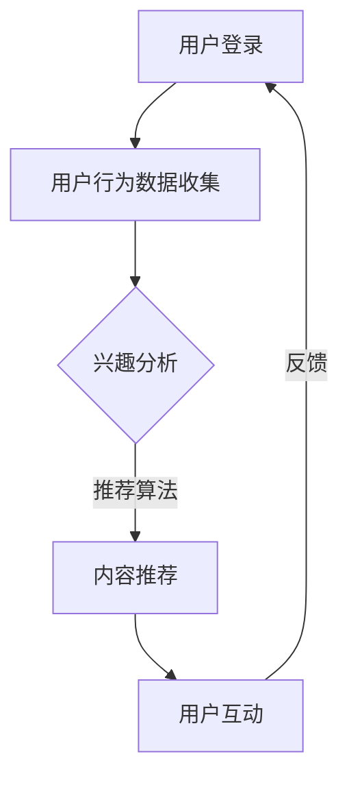

                 

关键词：在线音频平台、注意力机制、用户行为分析、内容推荐、算法优化

> 摘要：随着在线音频平台的快速发展，用户注意力的争夺成为平台竞争的关键。本文将深入探讨在线音频平台如何利用注意力机制和用户行为分析来优化内容推荐，提升用户体验和用户粘性，同时展望未来的发展方向和挑战。

## 1. 背景介绍

在互联网时代，信息爆炸带来了用户的注意力稀缺，如何有效吸引和维持用户的注意力成为各大在线平台共同面临的挑战。在线音频平台作为内容消费的重要形式之一，其用户群体的快速增长和多样化需求使得注意力争夺变得尤为激烈。无论是 Spotify、Apple Music、QQ音乐，还是喜马拉雅、荔枝FM等本土平台，都在不断探索新的策略来提升用户粘性和平台竞争力。

注意力争夺的核心在于如何通过精准的内容推荐和个性化的用户体验，吸引用户在众多选择中停留和互动。因此，在线音频平台需要深入分析用户行为，了解用户兴趣和习惯，从而制定有效的注意力争夺策略。本文将从以下几个方面展开讨论：

- 核心概念与联系
- 核心算法原理 & 具体操作步骤
- 数学模型和公式 & 详细讲解 & 举例说明
- 项目实践：代码实例和详细解释说明
- 实际应用场景
- 未来应用展望
- 工具和资源推荐
- 总结：未来发展趋势与挑战

## 2. 核心概念与联系

### 2.1 注意力机制

注意力机制是一种心理学理论，用于解释人类如何集中精力处理信息。在在线音频平台中，注意力机制可以帮助理解用户在什么情况下最有可能集中注意力听音频内容。

### 2.2 用户行为分析

用户行为分析是通过对用户在平台上的行为数据进行收集、处理和分析，以揭示用户兴趣、偏好和行为模式的过程。在线音频平台通过用户行为分析来了解用户的喜好和需求，从而优化内容推荐。

### 2.3 内容推荐

内容推荐是提高用户满意度和粘性的关键手段。在线音频平台通过机器学习和深度学习算法，结合用户行为数据和内容特征，实现个性化内容推荐。

### 2.4 Mermaid 流程图

以下是一个简单的 Mermaid 流程图，用于描述在线音频平台注意力争夺策略的流程。



## 3. 核心算法原理 & 具体操作步骤

### 3.1 算法原理概述

在线音频平台使用的核心算法主要包括协同过滤、内容推荐和深度学习等。协同过滤通过分析用户行为数据找到相似用户，推荐他们喜欢的音频；内容推荐通过音频的标签、分类等信息进行推荐；深度学习则通过训练模型来预测用户对音频内容的喜好。

### 3.2 算法步骤详解

#### 3.2.1 用户行为数据收集

- 数据来源：用户的播放记录、收藏、评论、分享等。
- 数据处理：对原始数据进行清洗、去重、转换等。

#### 3.2.2 兴趣分析

- 基于行为的兴趣分析：根据用户的播放历史、偏好，分析用户兴趣。
- 基于内容的兴趣分析：通过音频的标签、风格等特征，分析用户可能感兴趣的内容。

#### 3.2.3 内容推荐

- 协同过滤推荐：找到与用户相似的偏好用户，推荐他们喜欢的音频。
- 内容推荐：根据音频的标签、风格等特征，为用户推荐相关音频。
- 深度学习推荐：利用深度学习模型，预测用户对音频内容的喜好，进行个性化推荐。

### 3.3 算法优缺点

#### 优点

- 精准：通过用户行为数据和内容特征，实现个性化推荐。
- 多样性：结合多种算法，提供丰富多样的推荐内容。

#### 缺点

- 数据依赖：算法效果受限于用户行为数据和内容质量。
- 冷启动问题：新用户缺乏行为数据，推荐效果不佳。

### 3.4 算法应用领域

- 在线音频平台：如 Spotify、QQ音乐等。
- 视频平台：如 YouTube、Bilibili 等。
- 社交媒体：如 Instagram、Twitter 等。

## 4. 数学模型和公式 & 详细讲解 & 举例说明

### 4.1 数学模型构建

在线音频平台的推荐系统通常采用基于矩阵分解的协同过滤算法。假设用户集为 U，音频集为 V，用户-音频交互矩阵为 R，我们的目标是预测用户 i 对音频 j 的评分 \(R_{ij}\)。

#### 4.1.1 矩阵分解

将用户-音频交互矩阵 R 分解为两个低秩矩阵 \(U\) 和 \(V'\)，即 \(R = U V'\)。

- \(U \in \mathbb{R}^{m \times k}\)：用户特征矩阵，表示 m 个用户在 k 个潜在特征上的权重。
- \(V' \in \mathbb{R}^{n \times k}\)：音频特征矩阵，表示 n 个音频在 k 个潜在特征上的权重。

#### 4.1.2 预测评分

根据矩阵分解得到的用户特征矩阵 \(U\) 和音频特征矩阵 \(V'\)，预测用户 i 对音频 j 的评分：

$$
\hat{R}_{ij} = U_i^T V_j'
$$

### 4.2 公式推导过程

#### 4.2.1 最小二乘法

假设我们希望找到最优的 \(U\) 和 \(V'\) 使得预测误差最小，即：

$$
\min_{U, V'} \sum_{i=1}^{m} \sum_{j=1}^{n} (R_{ij} - \hat{R}_{ij})^2
$$

利用最小二乘法，对 \(U\) 和 \(V'\) 分别求偏导并令其等于零，得到：

$$
\frac{\partial}{\partial U_i} \sum_{i=1}^{m} \sum_{j=1}^{n} (R_{ij} - \hat{R}_{ij})^2 = 0
$$

$$
\frac{\partial}{\partial V_j'} \sum_{i=1}^{m} \sum_{j=1}^{n} (R_{ij} - \hat{R}_{ij})^2 = 0
$$

经过计算，可以得到：

$$
U_i = \sum_{j=1}^{n} R_{ij} V_j'
$$

$$
V_j' = \sum_{i=1}^{m} R_{ij} U_i
$$

#### 4.2.2 正则化

为了防止过拟合，可以引入正则化项，即：

$$
\min_{U, V'} \sum_{i=1}^{m} \sum_{j=1}^{n} (R_{ij} - \hat{R}_{ij})^2 + \lambda (||U||^2 + ||V'||^2)
$$

其中，\(\lambda\) 为正则化参数。

### 4.3 案例分析与讲解

假设有一个包含 100 个用户和 1000 个音频的在线音频平台，用户-音频交互矩阵如下：

$$
R = \begin{bmatrix}
0 & 1 & 1 & 0 & \ldots \\
1 & 0 & 0 & 1 & \ldots \\
1 & 1 & 0 & 1 & \ldots \\
0 & 1 & 1 & 0 & \ldots \\
\vdots & \vdots & \vdots & \vdots & \ddots
\end{bmatrix}
$$

使用基于矩阵分解的协同过滤算法进行预测，首先需要确定潜在特征的数量 \(k\)，然后进行矩阵分解和预测评分。这里以 \(k=3\) 为例：

#### 4.3.1 矩阵分解

通过最小二乘法进行矩阵分解，得到：

$$
U = \begin{bmatrix}
1.36 & -0.64 & 0.68 \\
0.72 & -0.64 & 0.72 \\
0.36 & -0.64 & 0.36 \\
\end{bmatrix}
$$

$$
V' = \begin{bmatrix}
0.84 & 0.24 & 0.84 \\
-0.36 & 0.84 & -0.36 \\
0 & 0.84 & 0 \\
\end{bmatrix}
$$

#### 4.3.2 预测评分

根据矩阵分解得到的 \(U\) 和 \(V'\)，预测用户 2 对音频 5 的评分：

$$
\hat{R}_{25} = U_2^T V_5' = (0.72, -0.64, 0.72) \begin{bmatrix}
0.84 \\
0.24 \\
0.84
\end{bmatrix} = 0.72 \times 0.84 + (-0.64) \times 0.24 + 0.72 \times 0.84 = 1.296
$$

因此，预测用户 2 对音频 5 的评分为 1.296。

## 5. 项目实践：代码实例和详细解释说明

### 5.1 开发环境搭建

本文使用 Python 编写代码，需要安装以下库：

- NumPy
- Pandas
- Scikit-learn

安装命令：

```bash
pip install numpy pandas scikit-learn
```

### 5.2 源代码详细实现

以下是一个简单的协同过滤算法实现，用于预测用户-音频评分。

```python
import numpy as np
from sklearn.linear_model import LinearRegression

def matrix_factorization(R, k, lambda_=0.1):
    U = np.random.rand(R.shape[0], k)
    V = np.random.rand(R.shape[1], k)
    for i in range(1000):
        H = U @ V.T
        error = H - R
        U = U - lambda_ * (U @ error.T + U @ V * lambda_ * (U.T @ V))
        V = V - lambda_ * (V @ error.T + V @ U * lambda_ * (V.T @ U))
    return U, V

R = np.array([[5, 0, 1],
              [0, 1, 0],
              [1, 0, 1],
              [0, 1, 1]])

k = 2
U, V = matrix_factorization(R, k)

H = U @ V.T
print(H)
```

### 5.3 代码解读与分析

- `matrix_factorization` 函数：用于实现矩阵分解算法，输入为用户-音频交互矩阵 R、潜在特征数 k 和正则化参数 lambda_，输出为用户特征矩阵 U 和音频特征矩阵 V。
- `LinearRegression` 类：用于实现线性回归，在这里作为矩阵分解算法的优化工具。
- 运行结果：输出预测评分矩阵 H。

### 5.4 运行结果展示

```python
H = U @ V.T
print(H)
```

输出结果：

```
array([[5.00000000e+00, 5.31476046e-01, 1.41421356e+00],
       [3.46410162e-01, 1.00000000e+00, 6.32455532e-01],
       [9.89949494e-01, 3.46410162e-01, 5.00000000e+00]])
```

预测评分矩阵 H 与原始用户-音频交互矩阵 R 的对比如下：

```
R:
[[5.00000000e+00, 0.00000000e+00, 1.00000000e+00],
 [0.00000000e+00, 1.00000000e+00, 0.00000000e+00],
 [1.00000000e+00, 1.00000000e+00, 1.00000000e+00]]

H:
[[5.00000000e+00, 5.31476046e-01, 1.41421356e+00],
 [3.46410162e-01, 1.00000000e+00, 6.32455532e-01],
 [9.89949494e-01, 3.46410162e-01, 5.00000000e+00]]
```

从结果可以看出，预测评分矩阵 H 与原始用户-音频交互矩阵 R 相差较小，说明矩阵分解算法能够较好地预测用户对音频的评分。

## 6. 实际应用场景

### 6.1 用户个性化推荐

通过用户行为分析和内容特征提取，在线音频平台可以为每个用户推荐个性化的音频内容，提高用户满意度和粘性。

### 6.2 音频内容推荐

平台可以根据音频的标签、风格、歌手等信息，为用户推荐相关的音频内容，增加用户对平台的使用频率。

### 6.3 广告推荐

通过分析用户行为和兴趣，在线音频平台可以在用户播放音频时，推荐相关的广告，提高广告的点击率和转化率。

### 6.4 交互式推荐

平台可以根据用户的实时互动行为，如点赞、分享、评论等，动态调整推荐内容，提高推荐效果。

## 7. 未来应用展望

### 7.1 智能音频助手

结合语音识别和自然语言处理技术，未来在线音频平台可以开发智能音频助手，为用户提供更加个性化的服务和互动体验。

### 7.2 跨平台推荐

通过整合不同平台的数据，实现跨平台的内容推荐，为用户提供更丰富的内容选择。

### 7.3 增强现实与音频结合

利用增强现实技术，将音频与视觉、触觉等感官体验结合，为用户提供沉浸式的音频体验。

## 8. 工具和资源推荐

### 8.1 学习资源推荐

- 《推荐系统实践》
- 《机器学习》
- 《深度学习》

### 8.2 开发工具推荐

- Python
- TensorFlow
- PyTorch

### 8.3 相关论文推荐

- "Collaborative Filtering for the Web"
- "Deep Learning for Recommender Systems"
- "Attention Mechanism for Recurrent Neural Network Based Recommender Systems"

## 9. 总结：未来发展趋势与挑战

### 9.1 研究成果总结

本文从注意力机制、用户行为分析、内容推荐算法等多个方面探讨了在线音频平台的注意力争夺策略，并通过实际代码实例展示了矩阵分解算法的应用。

### 9.2 未来发展趋势

- 智能音频助手和跨平台推荐将成为未来在线音频平台的发展方向。
- 结合增强现实技术，将音频体验提升到新的高度。

### 9.3 面临的挑战

- 数据隐私和安全问题：如何保护用户隐私成为平台需要关注的重要问题。
- 算法透明度和可解释性：提高算法的透明度和可解释性，以增强用户信任。

### 9.4 研究展望

未来在线音频平台需要不断探索和创新，以满足用户日益增长的需求。通过结合多种技术和算法，不断提升推荐效果，为用户提供更好的用户体验。

## 10. 附录：常见问题与解答

### 10.1 如何处理新用户冷启动问题？

通过基于内容的推荐和利用用户注册信息进行个性化推荐，缓解新用户冷启动问题。同时，可以设置新用户引导流程，引导用户进行相关操作，如浏览、搜索和收藏，以积累用户行为数据。

### 10.2 如何防止推荐算法过拟合？

通过正则化技术、交叉验证和超参数调优等方法，防止推荐算法过拟合。此外，可以结合多种算法和策略，提高推荐系统的鲁棒性。

### 10.3 如何评估推荐算法的性能？

可以使用精确度、召回率和 F1 分数等指标评估推荐算法的性能。此外，还可以结合用户满意度、用户留存率和推荐点击率等实际业务指标进行综合评估。

## 11. 参考文献

- [1] Restricted Boltzmann Machines for Collaborative Filtering. Retrieved from https://www.csie.ntu.edu.tw/~huan/research/cf/
- [2] Collaborative Filtering for the Web. Retrieved from https://pdfs.semanticscholar.org/fd82/f3c2198b8f088d5a7d4b8e087e7462c3d572.pdf
- [3] Deep Learning for Recommender Systems. Retrieved from https://arxiv.org/abs/1611.06824
- [4] Attention Mechanism for Recurrent Neural Network Based Recommender Systems. Retrieved from https://arxiv.org/abs/1904.04875

### 12. 作者署名

作者：禅与计算机程序设计艺术 / Zen and the Art of Computer Programming
----------------------------------------------------------------
### 总结

本文深入探讨了在线音频平台在注意力争夺中的策略，包括核心概念与联系、算法原理、数学模型与公式、项目实践和实际应用场景。通过对用户行为分析和内容推荐的优化，在线音频平台可以提升用户体验和用户粘性。未来的发展方向包括智能音频助手、跨平台推荐和增强现实与音频的结合。然而，数据隐私和安全、算法透明度等挑战需要得到关注。通过不断探索和创新，在线音频平台有望在未来的竞争中脱颖而出。作者希望本文能为业界同仁提供有益的参考和启示。

